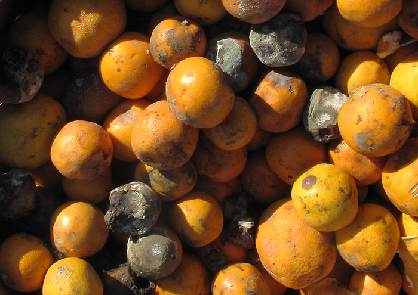

### Learning Objectives

* List the various types of microorganisms and describe their defining characteristics
* Give examples of different types of cellular and viral microorganisms and infectious agents
* Describe the similarities and differences between archaea and bacteria
* Provide an overview of the field of microbiology

Most microbes are unicellular and small enough that they require artificial magnification to be seen. However, there are some unicellular microbes that are visible to the naked eye, and some multicellular organisms that are microscopic. An object must measure about 100 micrometers (µm) to be visible without a microscope, but most microorganisms are many times smaller than that. For some perspective, consider that a typical animal cell measures roughly 10 µm across but is still microscopic. Bacterial cells are typically about 1 µm, and viruses can be 10 times smaller than bacteria ([\[link\]](#OSC_Microbio_01_03_sizes)). See [\[link\]](#fs-id1171359070853) for units of length used in microbiology.

 ![A bar along the bottom indicates size of various objects. At the far right is a from egg at approximately 1 mm. To the left are a human egg and a pollen grain at approximately 0.1 mm. Next are a standard plant and animal cell which range from 10 &#x2013; 100 &#xB5;m. Next is a red blood cell at just under 10 &#xB5;m. Next are a mitochondrion and bacterial cell at approximately 1 &#xB5;m. Next is a smallpox virus at approximately 500 nm. Next is a flu virus at approximately 100 nm. Next is a polio virus at approximately 50 nm. Next are proteins which range from 5-10 nm. Next are lipids which range from 2-5 nm. Next is C60 (fullerene molecule) which is approximately 1 nm. Finally, atoms are approximately 0.1 nm. Light microscopes can be used to view items larger than 100 nm (the size of a flu virus). Electron microscopes are useful for materials from 1.5 nm (larger than an atom) to 1 &#xB5;m (the size of many bacteria).](../resources/OSC_Microbio_01_03_sizes.jpg "The relative sizes of various microscopic and nonmicroscopic objects. Note that a typical virus measures about 100 nm, 10 times smaller than a typical bacterium (~1 &#xB5;m), which is at least 10 times smaller than a typical plant or animal cell (~10&#x2013;100 &#xB5;m). An object must measure about 100 &#xB5;m to be visible without a microscope."){: #OSC_Microbio_01_03_sizes}

<table summary="This table is titled Units of Length Commonly Used in Microbiology. It has three columns and seven rows. The first row is a header and has the labels: Metric Unit, Meaning of Prefix, and Metric Equivalent. The next row is for the metric unit meter (m) with has a dash in the &#x201C;meaning of prefix&#x201D; column. The metric equivalent shows 1 m = 10 superscript 0 m. The next row is for the metric unit decimeter (dm); the prefix deci means 1/10; the metric equivalent is: 1 dm = 0.1 m = 10 superscript -1 m. The next row is for the metric unit centimeter (cm); the prefix centi means 1/100; the metric equivalent is: 1 cm = 0.01 m = 10 superscript -2 m. The next row is for the metric unit millimeter (mm); the prefix milli means 1/1000; the metric equivalent is: 1 mm = 0.001 m = 10 superscript -3 m. The next row is for the metric unit micrometer (&#xB5;m); the prefix micro means 1/1,000,000; the metric equivalent is: 1 &#xB5;m = 0.000001 m = 10 superscript -6 m. The last row is for the metric unit nanometer (nm); the prefix nano means 1/1,000,000,000; the metric equivalent is: 1 nm = 0.000000001 m = 10 superscript -9 m." class="span-all"><thead>
<tr>
<th colspan="3" data-align="center">Units of Length Commonly Used in Microbiology</th>
</tr>
<tr valign="top">
<th data-align="left">Metric Unit</th>
<th data-align="left">Meaning of Prefix</th>
<th data-align="left">Metric Equivalent</th>
</tr>
</thead><tbody>
<tr valign="top">
<td data-align="left">meter (m)</td>
<td data-align="left">—</td>
<td data-align="left">1 m = 100 m</td>
</tr>
<tr valign="top">
<td data-align="left">decimeter (dm)</td>
<td data-align="left">1/10</td>
<td data-align="left">1 dm = 0.1 m = 10−1 m</td>
</tr>
<tr valign="top">
<td data-align="left">centimeter (cm)</td>
<td data-align="left">1/100</td>
<td data-align="left">1 cm = 0.01 m = 10−2 m</td>
</tr>
<tr valign="top">
<td data-align="left">millimeter (mm)</td>
<td data-align="left">1/1000</td>
<td data-align="left">1 mm = 0.001 m = 10−3 m</td>
</tr>
<tr valign="top">
<td data-align="left">micrometer (μm)</td>
<td data-align="left">1/1,000,000</td>
<td data-align="left">1 μm = 0.000001 m = 10−6 m</td>
</tr>
<tr valign="top">
<td data-align="left">nanometer (nm)</td>
<td data-align="left">1/1,000,000,000</td>
<td data-align="left">1 nm = 0.000000001 m = 10−9 m</td>
</tr>
</tbody></table>

Microorganisms differ from each other not only in size, but also in structure, habitat, metabolism, and many other characteristics. While we typically think of microorganisms as being unicellular, there are also many multicellular organisms that are too small to be seen without a microscope. Some microbes, such as viruses, are even **acellular**{: data-type="term"} (not composed of cells).

Microorganisms are found in each of the three domains of life: Archaea, Bacteria, and Eukarya. Microbes within the domains Bacteria and Archaea are all prokaryotes (their cells lack a nucleus), whereas microbes in the domain Eukarya are eukaryotes (their cells have a nucleus). Some microorganisms, such as viruses, do not fall within any of the three domains of life. In this section, we will briefly introduce each of the broad groups of microbes. Later chapters will go into greater depth about the diverse species within each group.

  
How big is a bacterium or a virus compared to other objects? Check out this [interactive website][1] to get a feel for the scale of different microorganisms.

### Prokaryotic Microorganisms

**Bacteria**{: data-type="term"} are found in nearly every habitat on earth, including within and on humans. Most bacteria are harmless or helpful, but some are **pathogen**{: data-type="term"}**s**, causing disease in humans and other animals. Bacteria are prokaryotic because their genetic material (DNA) is not housed within a true nucleus. Most bacteria have cell walls that contain peptidoglycan.

Bacteria are often described in terms of their general shape. Common shapes include spherical (coccus), rod-shaped (bacillus), or curved (spirillum, spirochete, or vibrio). [\[link\]](#OSC_Microbio_01_03_bacteria) shows examples of these shapes.

  and rod-shaped (bacillus). (credit &#x201C;Coccus&#x201D;: modification of work by Janice Haney Carr, Centers for Disease Control and Prevention; credit &#x201C;Coccobacillus&#x201D;: modification of work by Janice Carr, Centers for Disease Control and Prevention; credit &#x201C;Spirochete&#x201D;: Centers for Disease Control and Prevention)"){: #OSC_Microbio_01_03_bacteria}

They have a wide range of metabolic capabilities and can grow in a variety of environments, using different combinations of nutrients. Some bacteria are photosynthetic, such as oxygenic **cyanobacteria**{: data-type="term" .no-emphasis} and anoxygenic green sulfur and green nonsulfur bacteria; these bacteria use energy derived from sunlight, and fix carbon dioxide for growth. Other types of bacteria are nonphotosynthetic, obtaining their energy from organic or inorganic compounds in their environment.

**Archaea**{: data-type="term"} are also unicellular prokaryotic organisms. Archaea and bacteria have different evolutionary histories, as well as significant differences in genetics, metabolic pathways, and the composition of their cell walls and membranes. Unlike most bacteria, archaeal cell walls do not contain peptidoglycan, but their cell walls are often composed of a similar substance called pseudopeptidoglycan. Like bacteria, archaea are found in nearly every habitat on earth, even extreme environments that are very cold, very hot, very basic, or very acidic ([\[link\]](#OSC_Microbio_01_03_archaea)). Some archaea live in the human body, but none have been shown to be human pathogens.

 {: #OSC_Microbio_01_03_archaea}

* What are the two main types of prokaryotic organisms?
* Name some of the defining characteristics of each type.
{: data-bullet-style="bullet"}

### Eukaryotic Microorganisms

The domain Eukarya contains all eukaryotes, including uni- or multicellular eukaryotes such as protists, fungi, plants, and animals. The major defining characteristic of eukaryotes is that their cells contain a nucleus.

#### Protists

**Protist**{: data-type="term"}**s** are unicellular eukaryotes that are not plants, animals, or fungi. Algae and protozoa are examples of protists.

**Algae**{: data-type="term"} (singular: alga) are plant-like protists that can be either unicellular or multicellular ([\[link\]](#OSC_Microbio_01_03_algae)). Their cells are surrounded by cell walls made of cellulose, a type of carbohydrate. Algae are photosynthetic organisms that extract energy from the sun and release oxygen and carbohydrates into their environment. Because other organisms can use their waste products for energy, algae are important parts of many ecosystems. Many consumer products contain ingredients derived from algae, such as carrageenan or alginic acid, which are found in some brands of ice cream, salad dressing, beverages, lipstick, and toothpaste. A derivative of algae also plays a prominent role in the microbiology laboratory. Agar, a gel derived from algae, can be mixed with various nutrients and used to grow microorganisms in a Petri dish. Algae are also being developed as a possible source for biofuels.

 "){: #OSC_Microbio_01_03_algae}

**Protozoa**{: data-type="term"} (singular: protozoan) are protists that make up the backbone of many food webs by providing nutrients for other organisms. Protozoa are very diverse. Some protozoa move with help from hair-like structures called cilia or whip-like structures called flagella. Others extend part of their cell membrane and cytoplasm to propel themselves forward. These cytoplasmic extensions are called pseudopods (“false feet”). Some protozoa are photosynthetic; others feed on organic material. Some are free-living, whereas others are parasitic, only able to survive by extracting nutrients from a host organism. Most protozoa are harmless, but some are pathogens that can cause disease in animals or humans ([\[link\]](#OSC_Microbio_01_03_giardia)).

 "){: #OSC_Microbio_01_03_giardia}

#### Fungi

**Fungi**{: data-type="term"} (singular: fungus) are also eukaryotes. Some multicellular fungi, such as mushrooms, resemble plants, but they are actually quite different. Fungi are not photosynthetic, and their cell walls are usually made out of chitin rather than cellulose.

Unicellular fungi—yeasts—are included within the study of microbiology. There are more than 1000 known species. Yeasts are found in many different environments, from the deep sea to the human navel. Some yeasts have beneficial uses, such as causing bread to rise and beverages to ferment; but yeasts can also cause food to spoil. Some even cause diseases, such as vaginal yeast infections and oral thrush ([\[link\]](#OSC_Microbio_01_03_yeast)).

  and is much larger. (credit: modification of work by Centers for Disease Control and Prevention)"){: #OSC_Microbio_01_03_yeast}

Other fungi of interest to microbiologists are multicellular organisms called **mold**{: data-type="term"}**s**. Molds are made up of long filaments that form visible colonies ([\[link\]](#OSC_Microbio_01_03_mold)). Molds are found in many different environments, from soil to rotting food to dank bathroom corners. Molds play a critical role in the decomposition of dead plants and animals. Some molds can cause allergies, and others produce disease-causing metabolites called mycotoxins. Molds have been used to make pharmaceuticals, including penicillin, which is one of the most commonly prescribed antibiotics, and cyclosporine, used to prevent organ rejection following a transplant.

 {: #OSC_Microbio_01_03_mold}

* Name two types of protists and two types of fungi.
* Name some of the defining characteristics of each type.
{: data-bullet-style="bullet"}

### Helminths

Multicellular parasitic worms called **helminth**{: data-type="term"}**s** are not technically microorganisms, as most are large enough to see without a microscope. However, these worms fall within the field of microbiology because diseases caused by helminths involve microscopic eggs and larvae. One example of a helminth is the **guinea worm**{: data-type="term" .no-emphasis}, or *Dracunculus medinensis*, which causes dizziness, vomiting, diarrhea, and painful ulcers on the legs and feet when the worm works its way out of the skin ([\[link\]](#OSC_Microbio_01_03_worms)). Infection typically occurs after a person drinks water containing water fleas infected by guinea-worm larvae. In the mid-1980s, there were an estimated 3.5 million cases of guinea-worm disease, but the disease has been largely eradicated. In 2014, there were only 126 cases reported, thanks to the coordinated efforts of the World Health Organization (WHO) and other groups committed to improvements in drinking water sanitation.[1](#footnote1){: data-type="footnote-link"}[2](#footnote2){: data-type="footnote-link"}

  The beef tapeworm, Taenia saginata, infects both cattle and humans. T. saginata eggs are microscopic (around 50 &#xB5;m), but adult worms like the one shown here can reach 4&#x2013;10 m, taking up residence in the digestive system. (b) An adult guinea worm, Dracunculus medinensis, is removed through a lesion in the patient&#x2019;s skin by winding it around a matchstick. (credit a, b: modification of work by Centers for Disease Control and Prevention)"){: #OSC_Microbio_01_03_worms}

### Viruses

**Virus**{: data-type="term"}**es** are **acellular**{: data-type="term"} microorganisms, which means they are not composed of cells. Essentially, a virus consists of proteins and genetic material—either DNA or RNA, but never both—that are inert outside of a host organism. However, by incorporating themselves into a host cell, viruses are able to co-opt the host’s cellular mechanisms to multiply and infect other hosts.

Viruses can infect all types of cells, from human cells to the cells of other microorganisms. In humans, viruses are responsible for numerous diseases, from the common cold to deadly Ebola ([\[link\]](#OSC_Microbio_01_03_virus)). However, many viruses do not cause disease.

  Members of the Coronavirus family can cause respiratory infections like the common cold, severe acute respiratory syndrome (SARS), and Middle East respiratory syndrome (MERS). Here they are viewed under a transmission electron microscope (TEM). (b) Ebolavirus, a member of the Filovirus family, as visualized using a TEM. (credit a: modification of work by Centers for Disease Control and Prevention; credit b: modification of work by Thomas W. Geisbert)"){: #OSC_Microbio_01_03_virus}

* Are helminths microorganisms? Explain why or why not.
* How are viruses different from other microorganisms?
{: data-bullet-style="bullet"}

### Microbiology as a Field of Study

**Microbiology**{: data-type="term"} is a broad term that encompasses the study of all different types of microorganisms. But in practice, microbiologists tend to specialize in one of several subfields. For example, **bacteriology**{: data-type="term"} is the study of bacteria; **mycology**{: data-type="term"} is the study of fungi; **protozoology**{: data-type="term"} is the study of protozoa; **parasitology**{: data-type="term"} is the study of helminths and other parasites; and **virology**{: data-type="term"} is the study of viruses ([\[link\]](#OSC_Microbio_01_03_atwork)). **Immunology**{: data-type="term"}, the study of the immune system, is often included in the study of microbiology because host–pathogen interactions are central to our understanding of infectious disease processes. Microbiologists can also specialize in certain areas of microbiology, such as clinical microbiology, environmental microbiology, applied microbiology, or food microbiology.

In this textbook, we are primarily concerned with clinical applications of microbiology, but since the various subfields of microbiology are highly interrelated, we will often discuss applications that are not strictly clinical.

 "){: #OSC_Microbio_01_03_atwork}

Bioethics in Microbiology

In the 1940s, the U.S. government was looking for a solution to a medical problem: the prevalence of sexually transmitted diseases (STDs) among soldiers. Several now-infamous government-funded studies used human subjects to research common STDs and treatments. In one such study, American researchers intentionally exposed more than 1300 human subjects in Guatemala to syphilis, gonorrhea, and chancroid to determine the ability of penicillin and other antibiotics to combat these diseases. Subjects of the study included Guatemalan soldiers, prisoners, prostitutes, and psychiatric patients—none of whom were informed that they were taking part in the study. Researchers exposed subjects to STDs by various methods, from facilitating intercourse with infected prostitutes to inoculating subjects with the bacteria known to cause the diseases. This latter method involved making a small wound on the subject’s genitals or elsewhere on the body, and then putting bacteria directly into the wound.[3](#footnote3){: data-type="footnote-link"} In 2011, a U.S. government commission tasked with investigating the experiment revealed that only some of the subjects were treated with penicillin, and 83 subjects died by 1953, likely as a result of the study.[4](#footnote4){: data-type="footnote-link"}

Unfortunately, this is one of many horrific examples of microbiology experiments that have violated basic ethical standards. Even if this study had led to a life-saving medical breakthrough (it did not), few would argue that its methods were ethically sound or morally justifiable. But not every case is so clear cut. Professionals working in clinical settings are frequently confronted with ethical dilemmas, such as working with patients who decline a vaccine or life-saving blood transfusion. These are just two examples of life-and-death decisions that may intersect with the religious and philosophical beliefs of both the patient and the health-care professional.

No matter how noble the goal, microbiology studies and clinical practice must be guided by a certain set of ethical principles. Studies must be done with integrity. Patients and research subjects provide informed consent (not only agreeing to be treated or studied but demonstrating an understanding of the purpose of the study and any risks involved). Patients’ rights must be respected. Procedures must be approved by an institutional review board. When working with patients, accurate record-keeping, honest communication, and confidentiality are paramount. Animals used for research must be treated humanely, and all protocols must be approved by an institutional animal care and use committee. These are just a few of the ethical principles explored in the *Eye on Ethics* boxes throughout this book.

Resolution

Cora’s CSF samples show no signs of inflammation or infection, as would be expected with a viral infection. However, there is a high concentration of a particular protein, 14-3-3 protein, in her CSF. An electroencephalogram (EEG) of her brain function is also abnormal. The EEG resembles that of a patient with a neurodegenerative disease like Alzheimer’s or Huntington’s, but Cora’s rapid cognitive decline is not consistent with either of these. Instead, her doctor concludes that Cora has **Creutzfeldt-Jakob disease (CJD)**{: data-type="term" .no-emphasis}, a type of transmissible spongiform encephalopathy (TSE).

**CJD**{: data-type="term" .no-emphasis} is an extremely rare disease, with only about 300 cases in the United States each year. It is not caused by a bacterium, fungus, or virus, but rather by **prions**{: data-type="term" .no-emphasis}—which do not fit neatly into any particular category of microbe. Like viruses, prions are not found on the tree of life because they are acellular. Prions are extremely small, about one-tenth the size of a typical virus. They contain no genetic material and are composed solely of a type of abnormal protein.

CJD can have several different causes. It can be acquired through exposure to the brain or nervous-system tissue of an infected person or animal. Consuming meat from an infected animal is one way such exposure can occur. There have also been rare cases of exposure to CJD through contact with contaminated surgical equipment[5](#footnote5){: data-type="footnote-link"} and from cornea and growth-hormone donors who unknowingly had CJD.[6](#footnote6){: data-type="footnote-link"}[7](#footnote7){: data-type="footnote-link"} In rare cases, the disease results from a specific genetic mutation that can sometimes be hereditary. However, in approximately 85% of patients with CJD, the cause of the disease is spontaneous (or sporadic) and has no identifiable cause.[8](#footnote8){: data-type="footnote-link"} Based on her symptoms and their rapid progression, Cora is diagnosed with sporadic CJD.

Unfortunately for Cora, CJD is a fatal disease for which there is no approved treatment. Approximately 90% of patients die within 1 year of diagnosis.[9](#footnote9){: data-type="footnote-link"} Her doctors focus on limiting her pain and cognitive symptoms as her disease progresses. Eight months later, Cora dies. Her CJD diagnosis is confirmed with a brain autopsy.

*Go back to the [previous](/m58782#fs-id1171360143675) Clinical Focus box.*

<section data-depth="1" class="summary" markdown="1">
* Microorganisms are very diverse and are found in all three domains of life: Archaea, Bacteria, and Eukarya.
* **Archaea** and **bacteria** are classified as prokaryotes because they lack a cellular nucleus. Archaea differ from bacteria in evolutionary history, genetics, metabolic pathways, and cell wall and membrane composition.
* Archaea inhabit nearly every environment on earth, but no archaea have been identified as human pathogens.
* **Eukaryotes** studied in microbiology include algae, protozoa, fungi, and helminths.
* **Algae** are plant-like organisms that can be either unicellular or multicellular, and derive energy via photosynthesis.
* **Protozoa** are unicellular organisms with complex cell structures; most are motile.
* Microscopic **fungi** include **molds** and **yeasts**.
* **Helminths** are multicellular parasitic worms. They are included in the field of microbiology because their eggs and larvae are often microscopic.
* **Viruses** are acellular microorganisms that require a host to reproduce.
* The field of microbiology is extremely broad. Microbiologists typically specialize in one of many subfields, but all health professionals need a solid foundation in clinical microbiology.
{: data-bullet-style="bullet"}

</section>

### Multiple Choice

Which of the following types of microorganisms is photosynthetic?

1.  yeast
2.  virus
3.  helminth
4.  alga
{: type="A"}

D

Which of the following is a prokaryotic microorganism?

1.  helminth
2.  protozoan
3.  cyanobacterium
4.  mold
{: type="A"}

C

Which of the following is acellular?

1.  virus
2.  bacterium
3.  fungus
4.  protozoan
{: type="A"}

A

Which of the following is a type of fungal microorganism?

1.  bacterium
2.  protozoan
3.  alga
4.  yeast
{: type="A"}

D

Which of the following is not a subfield of microbiology?

1.  bacteriology
2.  botany
3.  clinical microbiology
4.  virology
{: type="A"}

B

### Fill in the Blank

A \_\_\_\_\_\_\_\_ is a disease-causing microorganism.

pathogen

Multicellular parasitic worms studied by microbiologists are called \_\_\_\_\_\_\_\_\_\_\_.

helminths

The study of viruses is \_\_\_\_\_\_\_\_\_\_\_.

virology

The cells of prokaryotic organisms lack a \_\_\_\_\_\_\_.

nucleus

### Short Answer

Describe the differences between bacteria and archaea.

Name three structures that various protozoa use for locomotion.

Describe the actual and relative sizes of a virus, a bacterium, and a plant or animal cell.

### Critical Thinking

Contrast the behavior of a virus outside versus inside a cell.

Where would a virus, bacterium, animal cell, and a prion belong on this chart?

  

### Footnotes
{: data-type="footnote-refs-title"}

* {: data-type="footnote-ref" #footnote1} [1](#footnote-ref1){: data-type="footnote-ref-link"} C. Greenaway “Dracunculiasis (Guinea Worm Disease).” *Canadian Medical Association Journal* 170 no. 4 (2004):495–500.
* {: data-type="footnote-ref" #footnote2} [2](#footnote-ref2){: data-type="footnote-ref-link"} World Health Organization. “Dracunculiasis (Guinea-Worm Disease).” *WHO*. 2015. http://www.who.int/mediacentre/factsheets/fs359/en/. Accessed October 2, 2015.
* {: data-type="footnote-ref" #footnote3} [3](#footnote-ref3){: data-type="footnote-ref-link"} Kara Rogers. “Guatemala Syphilis Experiment: American Medical Research Project”. *Encylopaedia Britannica*. http://www.britannica.com/event/Guatemala-syphilis-experiment. Accessed June 24, 2015.
* {: data-type="footnote-ref" #footnote4} [4](#footnote-ref4){: data-type="footnote-ref-link"} Susan Donaldson James. “Syphilis Experiments Shock, But So Do Third-World Drug Trials.” *ABC World News*. August 30, 2011. http://abcnews.go.com/Health/guatemala-syphilis-experiments-shock-us-drug-trials-exploit/story?id=14414902. Accessed June 24, 2015.
* {: data-type="footnote-ref" #footnote5} [5](#footnote-ref5){: data-type="footnote-ref-link"} Greg Botelho. “Case of Creutzfeldt-Jakob Disease Confirmed in New Hampshire.” *CNN*. 2013. http://www.cnn.com/2013/09/20/health/creutzfeldt-jakob-brain-disease/.
* {: data-type="footnote-ref" #footnote6} [6](#footnote-ref6){: data-type="footnote-ref-link"} P. Rudge et al. “Iatrogenic CJD Due to Pituitary-Derived Growth Hormone With Genetically Determined Incubation Times of Up to 40 Years.” *Brain* 138 no. 11 (2015): 3386–3399.
* {: data-type="footnote-ref" #footnote7} [7](#footnote-ref7){: data-type="footnote-ref-link"} J.G. Heckmann et al. “Transmission of Creutzfeldt-Jakob Disease via a Corneal Transplant.” *Journal of Neurology, Neurosurgery &amp; Psychiatry* 63 no. 3 (1997): 388–390.
* {: data-type="footnote-ref" #footnote8} [8](#footnote-ref8){: data-type="footnote-ref-link"} National Institute of Neurological Disorders and Stroke. “Creutzfeldt-Jakob Disease Fact Sheet.” *NIH*. 2015. http://www.ninds.nih.gov/disorders/cjd/detail\\\_cjd.htm#288133058.
* {: data-type="footnote-ref" #footnote9} [9](#footnote-ref9){: data-type="footnote-ref-link"} National Institute of Neurological Disorders and Stroke. “Creutzfeldt-Jakob Disease Fact Sheet.” *NIH*. 2015. http://www.ninds.nih.gov/disorders/cjd/detail\\\_cjd.htm#288133058. Accessed June 22, 2015.
{: data-list-type="bulleted" data-bullet-style="none"}

[1]: https://www.openstax.org/l/22relsizes
