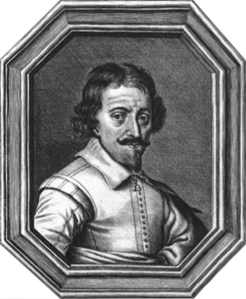

# Learning Objectives

* Describe historical developments and individual contributions that led to the invention and development of the microscope
* Compare and contrast the features of simple and compound microscopes

Some of the fundamental characteristics and functions of microscopes can be understood in the context of the history of their use. Italian scholar Girolamo **Fracastoro**{: data-type="term" .no-emphasis} is regarded as the first person to formally postulate that disease was spread by tiny invisible *seminaria*, or “seeds of the contagion.” In his book ***De Contagione***{: data-type="term" .no-emphasis} (1546), he proposed that these seeds could attach themselves to certain objects (which he called *fomes* \[cloth\]) that supported their transfer from person to person. However, since the technology for seeing such tiny objects did not yet exist, the existence of the *seminaria* remained hypothetical for a little over a century—an invisible world waiting to be revealed.

# Early Microscopes

Antonie **van Leeuwenhoek**{: data-type="term" .no-emphasis}, sometimes hailed as “the Father of Microbiology,” is typically credited as the first person to have created microscopes powerful enough to view microbes ([\[link\]](#OSC_Microbio_02_02_VanLeeuwen)). Born in the city of Delft in the Dutch Republic, van Leeuwenhoek began his career selling fabrics. However, he later became interested in lens making (perhaps to look at threads) and his innovative techniques produced microscopes that allowed him to observe microorganisms as no one had before. In 1674, he described his observations of single-celled organisms, whose existence was previously unknown, in a series of letters to the Royal Society of London. His report was initially met with skepticism, but his claims were soon verified and he became something of a celebrity in the scientific community.

  Antonie van Leeuwenhoek (1632&#x2013;1723) is credited as being the first person to observe microbes, including bacteria, which he called &#x201C;animalcules&#x201D; and &#x201C;wee little beasties.&#x201D; (b) Even though van Leeuwenhoek&#x2019;s microscopes were simple microscopes (as seen in this replica), they were more powerful and provided better resolution than the compound microscopes of his day. (c) Though more famous for developing the telescope, Galileo Galilei (1564&#x2013;1642) was also one of the pioneers of microscopy. (credit b: modification of work by &#x201C;Wellcome Images&#x201D;/Wikimedia Commons)"){: #OSC_Microbio_02_02_VanLeeuwen}

While van Leeuwenhoek is credited with the discovery of microorganisms, others before him had contributed to the development of the microscope. These included eyeglass makers in the Netherlands in the late 1500s, as well as the Italian astronomer **Galileo**{: data-type="term" .no-emphasis} Galilei, who used a **compound microscope**{: data-type="term"} to examine insect parts ([\[link\]](#OSC_Microbio_02_02_VanLeeuwen)). Whereas van Leeuwenhoek used a **simple microscope**{: data-type="term"}**,** in which light is passed through just one lens, Galileo’s compound microscope was more sophisticated, passing light through two sets of lenses.

Van Leeuwenhoek’s contemporary, the Englishman Robert **Hooke**{: data-type="term" .no-emphasis} (1635–1703), also made important contributions to microscopy, publishing in his book ***Micrographia***{: data-type="term" .no-emphasis} (1665) many observations using compound microscopes. Viewing a thin sample of cork through his microscope, he was the first to observe the structures that we now know as cells ([\[link\]](#OSC_Microbio_02_02_Hooke)). Hooke described these structures as resembling “Honey-comb,” and as “small Boxes or Bladders of Air,” noting that each “Cavern, Bubble, or Cell” is distinct from the others (in Latin, “cell” literally means “small room”). They likely appeared to Hooke to be filled with air because the cork cells were dead, with only the rigid cell walls providing the structure.

  compound microscope to view (b) cork cells. Both of these engravings are from his seminal work Micrographia, published in 1665."){: #OSC_Microbio_02_02_Hooke}

* Explain the difference between simple and compound microscopes.
* Compare and contrast the contributions of van Leeuwenhoek, Hooke, and Galileo to early microscopy.

Who Invented the Microscope?

While Antonie van Leeuwenhoek and Robert Hooke generally receive much of the credit for early advances in microscopy, neither can claim to be the inventor of the microscope. Some argue that this designation should belong to Hans and Zaccharias **Janssen**{: data-type="term" .no-emphasis}, Dutch spectacle-makers who may have invented the telescope, the simple microscope, and the compound microscope during the late 1500s or early 1600s ([\[link\]](#OSC_Microbio_02_02_Janssen)). Unfortunately, little is known for sure about the Janssens, not even the exact dates of their births and deaths. The Janssens were secretive about their work and never published. It is also possible that the Janssens did not invent anything at all; their neighbor, Hans **Lippershey**{: data-type="term" .no-emphasis}, also developed microscopes and telescopes during the same time frame, and he is often credited with inventing the telescope. The historical records from the time are as fuzzy and imprecise as the images viewed through those early lenses, and any archived records have been lost over the centuries.

By contrast, van Leeuwenhoek and Hooke can thank ample documentation of their work for their respective legacies. Like Janssen, van Leeuwenhoek began his work in obscurity, leaving behind few records. However, his friend, the prominent physician Reinier de Graaf, wrote a letter to the editor of the *Philosophical Transactions of the Royal Society of London* calling attention to van Leeuwenhoek’s powerful microscopes. From 1673 onward, van Leeuwenhoek began regularly submitting letters to the Royal Society detailing his observations. In 1674, his report describing single-celled organisms produced controversy in the scientific community, but his observations were soon confirmed when the society sent a delegation to investigate his findings. He subsequently enjoyed considerable celebrity, at one point even entertaining a visit by the czar of Russia.

Similarly, Robert Hooke had his observations using microscopes published by the Royal Society in a book called *Micrographia* in 1665. The book became a bestseller and greatly increased interest in microscopy throughout much of Europe.

{: #OSC_Microbio_02_02_Janssen}

# Key Concepts and Summary

* **Antonie van Leeuwenhoek** is credited with the first observation of microbes, including protists and bacteria, with simple microscopes that he made.
* **Robert Hooke** was the first to describe what we now call cells.
* **Simple microscopes** have a single lens, while **compound microscopes** have multiple lenses.
{: data-bullet-style="bullet"}

# Multiple Choice

Who was the first to describe “cells” in dead cork tissue?

1.  Hans Janssen
2.  Zaccharias Janssen
3.  Antonie van Leeuwenhoek
4.  Robert Hooke
{: data-number-style="upper-alpha"}

D

Who is the probable inventor of the compound microscope?

1.  Girolamo Fracastoro
2.  Zaccharias Janssen
3.  Antonie van Leeuwenhoek
4.  Robert Hooke
{: data-number-style="upper-alpha"}

B

# Fill in the Blank

A microscope that uses multiple lenses is called a \_\_\_\_\_\_\_\_\_ microscope.

compound

# Short Answer

Why is Antonie van Leeuwenhoek’s work much better known than that of Zaccharias Janssen?

Why did the cork cells observed by Robert Hooke appear to be empty, as opposed to being full of other structures?

