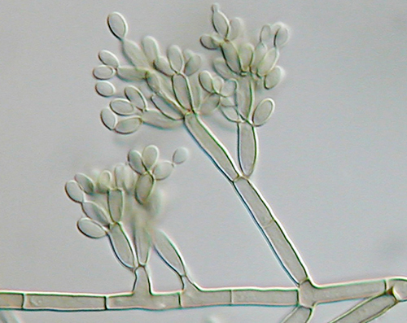

### Learning Objectives

* Identify and describe the parts of a brightfield microscope
* Calculate total magnification for a compound microscope
* Describe the distinguishing features and typical uses for various types of light microscopes, electron microscopes, and scanning probe microscopes

The early pioneers of microscopy opened a window into the invisible world of microorganisms. But microscopy continued to advance in the centuries that followed. In 1830, Joseph Jackson Lister created an essentially modern light microscope. The 20th century saw the development of microscopes that leveraged nonvisible light, such as fluorescence microscopy, which uses an ultraviolet light source, and electron microscopy, which uses short-wavelength electron beams. These advances led to major improvements in magnification, resolution, and contrast. By comparison, the relatively rudimentary microscopes of van Leeuwenhoek and his contemporaries were far less powerful than even the most basic microscopes in use today. In this section, we will survey the broad range of modern microscopic technology and common applications for each type of microscope.

### Light Microscopy

Many types of microscopes fall under the category of **light microscopes**{: data-type="term" .no-emphasis}, which use light to visualize images. Examples of light microscopes include brightfield microscopes, darkfield microscopes, phase-contrast microscopes, differential interference contrast microscopes, fluorescence microscopes, confocal scanning laser microscopes, and two-photon microscopes. These various types of light microscopes can be used to complement each other in diagnostics and research.

#### Brightfield Microscopes

The **brightfield microscope**{: data-type="term"}, perhaps the most commonly used type of microscope, is a compound microscope with two or more lenses that produce a dark image on a bright background. Some brightfield microscopes are **monocular**{: data-type="term"} (having a single eyepiece), though most newer brightfield microscopes are **binocular**{: data-type="term"} (having two eyepieces), like the one shown in [\[link\]](#OSC_Microbio_02_03_Brightfiel); in either case, each eyepiece contains a lens called an **ocular lens**{: data-type="term"}. The ocular lenses typically magnify images 10 times (10⨯). At the other end of the body tube are a set of **objective lenses**{: data-type="term"} on a rotating nosepiece. The magnification of these objective lenses typically ranges from 4⨯ to 100⨯, with the magnification for each lens designated on the metal casing of the lens. The ocular and objective lenses work together to create a magnified image. The **total magnification**{: data-type="term"} is the product of the ocular magnification times the objective magnification:

<math xmlns="http://www.w3.org/1998/Math/MathML"><mrow><mtext>ocular magnification</mtext><mspace width="0.2em" /><mo>×</mo><mspace width="0.2em" /><mtext>objective magnification</mtext></mrow></math>

For example, if a 40⨯ objective lens is selected and the ocular lens is 10⨯, the total magnification would be

<math xmlns="http://www.w3.org/1998/Math/MathML"><mrow><mrow><mo>(</mo><mrow><mn>40</mn><mo>×</mo></mrow><mo>)</mo></mrow><mrow><mo>(</mo><mrow><mn>10</mn><mo>×</mo></mrow><mo>)</mo></mrow><mo>=</mo><mn>400</mn><mo>×</mo></mrow></math>

 ![A photo of a microscope is shown. The base contains a light source (the illuminator, #7) and a knob to adjust light intensity (rheostat). Attached at one end of the base is an arm with a stage (#9) to hold the specimen projecting out halfway up the arm. The center of the stage has an opening to allow light from the illuminator through. Below this opening are the diaphragm and condenser (#8). Above this opening are four lenses (objective lenses, #3) on a revolving nose piece (#2) that holds the multiple objectives. Above the objective lenses are two eye pieces (#1) called the ocular lenses. Attached to the bottom of the stage are two knobs for moving the slide (x-y mechanical stage knobs). On the arm below the stage are 2 knobs for focusing the image. The larger knob (#4) is the coarse focus, and the smaller knob (#5) is the fine focus.](../resources/OSC_Microbio_02_03_Brightfiel.jpg "Components of a typical brightfield microscope."){: #OSC_Microbio_02_03_Brightfiel}

The item being viewed is called a specimen. The specimen is placed on a glass slide, which is then clipped into place on the **stage**{: data-type="term"} (a platform) of the microscope. Once the slide is secured, the specimen on the slide is positioned over the light using the **x-y mechanical stage knobs**{: data-type="term"}. These knobs move the slide on the surface of the stage, but do not raise or lower the stage. Once the specimen is centered over the light, the stage position can be raised or lowered to focus the image. The **coarse focusing knob**{: data-type="term"} is used for large-scale movements with 4⨯ and 10⨯ objective lenses; the **fine focusing knob**{: data-type="term"} is used for small-scale movements, especially with 40⨯ or 100⨯ objective lenses.

When images are magnified, they become dimmer because there is less light per unit area of image. Highly magnified images produced by microscopes, therefore, require intense lighting. In a brightfield microscope, this light is provided by an **illuminator**{: data-type="term"}, which is typically a high-intensity bulb below the stage. Light from the illuminator passes up through **condenser lens**{: data-type="term"} (located below the stage), which focuses all of the light rays on the specimen to maximize illumination. The position of the condenser can be optimized using the attached condenser focus knob; once the optimal distance is established, the condenser should not be moved to adjust the brightness. If less-than-maximal light levels are needed, the amount of light striking the specimen can be easily adjusted by opening or closing a **diaphragm**{: data-type="term"} between the condenser and the specimen. In some cases, brightness can also be adjusted using the **rheostat**{: data-type="term"}, a dimmer switch that controls the intensity of the illuminator.

A brightfield microscope creates an image by directing light from the illuminator at the specimen; this light is differentially transmitted, absorbed, reflected, or refracted by different structures. Different colors can behave differently as they interact with **chromophores**{: data-type="term"} (pigments that absorb and reflect particular wavelengths of light) in parts of the specimen. Often, chromophores are artificially added to the specimen using stains, which serve to increase contrast and resolution. In general, structures in the specimen will appear darker, to various extents, than the bright background, creating maximally sharp images at magnifications up to about 1000⨯. Further magnification would create a larger image, but without increased resolution. This allows us to see objects as small as bacteria, which are visible at about 400⨯ or so, but not smaller objects such as viruses.

At very high magnifications, resolution may be compromised when light passes through the small amount of air between the specimen and the lens. This is due to the large difference between the refractive indices of air and glass; the air scatters the light rays before they can be focused by the lens. To solve this problem, a drop of oil can be used to fill the space between the specimen and an **oil immersion lens**{: data-type="term"}, a special lens designed to be used with immersion oils. Since the oil has a refractive index very similar to that of glass, it increases the maximum angle at which light leaving the specimen can strike the lens. This increases the light collected and, thus, the resolution of the image ([\[link\]](#OSC_Microbio_02_03_OilLens)). A variety of oils can be used for different types of light.

 ![Photograph a shows a close-up of a lens from a brightfield microscope. The lens is nearly touching the slide below it and there is oil spanning the space between the lens and the slide. Diagram b light traveling from the light source through the microscope slide. Without oil, the light refracts as it passes through the glass. Many of these refracted light beams do not meet the lens of the microscope. With immersion oil, the light beams travel from the slide, through the immersion oil, to the microscope lens with minimal refraction.](../resources/OSC_Microbio_02_03_OilLens.jpg "(a) Oil immersion lenses like this one are used to improve resolution. (b) Because immersion oil and glass have very similar refractive indices, there is a minimal amount of refraction before the light reaches the lens. Without immersion oil, light scatters as it passes through the air above the slide, degrading the resolution of the image."){: #OSC_Microbio_02_03_OilLens}

Microscope Maintenance: Best Practices

Even a very powerful microscope cannot deliver high-resolution images if it is not properly cleaned and maintained. Since lenses are carefully designed and manufactured to refract light with a high degree of precision, even a slightly dirty or scratched lens will refract light in unintended ways, degrading the image of the specimen. In addition, microscopes are rather delicate instruments, and great care must be taken to avoid damaging parts and surfaces. Among other things, proper care of a microscope includes the following:

* cleaning the lenses with lens paper
* not allowing lenses to contact the slide (e.g., by rapidly changing the focus)
* protecting the bulb (if there is one) from breakage
* not pushing an objective into a slide
* not using the coarse focusing knob when using the 40⨯ or greater objective lenses
* only using immersion oil with a specialized oil objective, usually the 100⨯ objective
* cleaning oil from immersion lenses after using the microscope
* cleaning any oil accidentally transferred from other lenses
* covering the microscope or placing it in a cabinet when not in use
{: data-bullet-style="bullet"}

Visit the online resources linked below for simulations and demonstrations involving the use of microscopes. Keep in mind that execution of specific techniques and procedures can vary depending on the specific instrument you are using. Thus, it is important to learn and practice with an actual microscope in a laboratory setting under expert supervision.

* University of Delaware’s [Virtual Microscope][1]
* St. John’s University [Microscope Tutorials][2]
{: data-bullet-style="bullet"}

#### Darkfield Microscopy

A **darkfield microscope**{: data-type="term"} is a brightfield microscope that has a small but significant modification to the condenser. A small, opaque disk (about 1 cm in diameter) is placed between the illuminator and the condenser lens. This opaque light stop, as the disk is called, blocks most of the light from the illuminator as it passes through the condenser on its way to the objective lens, producing a hollow cone of light that is focused on the specimen. The only light that reaches the objective is light that has been refracted or reflected by structures in the specimen. The resulting image typically shows bright objects on a dark background ([\[link\]](#OSC_Microbio_02_03_Darkfield)).

 {: #OSC_Microbio_02_03_Darkfield}

Darkfield microscopy can often create high-contrast, high-resolution images of specimens without the use of stains, which is particularly useful for viewing live specimens that might be killed or otherwise compromised by the stains. For example, thin spirochetes like ***Treponema pallidum***{: data-type="term" .no-emphasis}, the causative agent of syphilis, can be best viewed using a darkfield microscope ([\[link\]](#OSC_Microbio_02_03_Syphilis)).

 "){: #OSC_Microbio_02_03_Syphilis}

* Identify the key differences between brightfield and darkfield microscopy.

Part 2

Wound infections like Cindy’s can be caused by many different types of bacteria, some of which can spread rapidly with serious complications. Identifying the specific cause is very important to select a medication that can kill or stop the growth of the bacteria.

After calling a local doctor about Cindy’s case, the camp nurse sends the sample from the wound to the closest medical laboratory. Unfortunately, since the camp is in a remote area, the nearest lab is small and poorly equipped. A more modern lab would likely use other methods to culture, grow, and identify the bacteria, but in this case, the technician decides to make a wet mount from the specimen and view it under a brightfield microscope. In a wet mount, a small drop of water is added to the slide, and a cover slip is placed over the specimen to keep it in place before it is positioned under the objective lens.

Under the brightfield microscope, the technician can barely see the bacteria cells because they are nearly transparent against the bright background. To increase contrast, the technician inserts an opaque light stop above the illuminator. The resulting darkfield image clearly shows that the bacteria cells are spherical and grouped in clusters, like grapes.

* Why is it important to identify the shape and growth patterns of cells in a specimen?
* What other types of microscopy could be used effectively to view this specimen?
{: data-bullet-style="bullet"}

*Jump to the [next](/m58788#fs-id1167793396470) Clinical Focus box. Go back to the [previous](/m58785#fs-id1167793958994) Clinical Focus box.*

#### Phase-Contrast Microscopes

**Phase-contrast microscopes**{: data-type="term"} use refraction and interference caused by structures in a specimen to create high-contrast, high-resolution images without staining. It is the oldest and simplest type of microscope that creates an image by altering the wavelengths of light rays passing through the specimen. To create altered wavelength paths, an annular stop is used in the condenser. The annular stop produces a hollow cone of light that is focused on the specimen before reaching the objective lens. The objective contains a phase plate containing a phase ring. As a result, light traveling directly from the illuminator passes through the phase ring while light refracted or reflected by the specimen passes through the plate. This causes waves traveling through the ring to be about one-half of a wavelength out of phase with those passing through the plate. Because waves have peaks and troughs, they can add together (if in phase together) or cancel each other out (if out of phase). When the wavelengths are out of phase, wave troughs will cancel out wave peaks, which is called destructive interference. Structures that refract light then appear dark against a bright background of only unrefracted light. More generally, structures that differ in features such as refractive index will differ in levels of darkness ([\[link\]](#OSC_Microbio_02_03_Phasecontr)).

 ![A diagram shows the path of light through a phase-contrast microscope. Light from the light source travels to the annular ring in the condenser which produces a cone of light focused on the specimen. The specimen refracts or reflects light. Light traveling directly from the condenser lens (undiffracted light) and light traveling through the specimen (diffracted light) are out of phase when they pass through the objective and phase plates. Wavelengths in phase or out of phase either add together or cancel out each other.](../resources/OSC_Microbio_02_03_Phasecontr.jpg "This diagram of a phase-contrast microscope illustrates phase differences between light passing through the object and background. These differences are produced by passing the rays through different parts of a phase plate. The light rays are superimposed in the image plane, producing contrast due to their interference."){: #OSC_Microbio_02_03_Phasecontr}

Because it increases contrast without requiring stains, phase-contrast microscopy is often used to observe live specimens. Certain structures, such as organelles in eukaryotic cells and **endospores**{: data-type="term" .no-emphasis} in prokaryotic cells, are especially well visualized with phase-contrast microscopy ([\[link\]](#OSC_Microbio_02_03_Pcimage)).

  with a phase-contrast image (right) of the same unstained simple squamous epithelial cells. The cells are in the center and bottom right of each photograph (the irregular item above the cells is acellular debris). Notice that the unstained cells in the brightfield image are almost invisible against the background, whereas the cells in the phase-contrast image appear to glow against the background, revealing far more detail."){: #OSC_Microbio_02_03_Pcimage}

#### Differential Interference Contrast Microscopes

**Differential interference contrast (DIC) microscopes**{: data-type="term"} (also known as Nomarski optics) are similar to phase-contrast microscopes in that they use interference patterns to enhance contrast between different features of a specimen. In a DIC microscope, two beams of light are created in which the direction of wave movement (polarization) differs. Once the beams pass through either the specimen or specimen-free space, they are recombined and effects of the specimens cause differences in the interference patterns generated by the combining of the beams. This results in high-contrast images of living organisms with a three-dimensional appearance. These microscopes are especially useful in distinguishing structures within live, unstained specimens. ([\[link\]](#OSC_Microbio_02_03_DICmicro))

 {: #OSC_Microbio_02_03_DICmicro}

* What are some advantages of phase-contrast and DIC microscopy?

#### Fluorescence Microscopes

A **fluorescence microscope**{: data-type="term"} uses fluorescent chromophores called **fluorochromes**{: data-type="term"}, which are capable of absorbing energy from a light source and then emitting this energy as visible light. Fluorochromes include naturally fluorescent substances (such as chlorophylls) as well as fluorescent stains that are added to the specimen to create contrast. Dyes such as Texas red and FITC are examples of fluorochromes. Other examples include the nucleic acid dyes 4’,6’-diamidino-2-phenylindole (DAPI) and acridine orange.

The microscope transmits an excitation light, generally a form of EMR with a short wavelength, such as ultraviolet or blue light, toward the specimen; the chromophores absorb the excitation light and emit visible light with longer wavelengths. The excitation light is then filtered out (in part because ultraviolet light is harmful to the eyes) so that only visible light passes through the ocular lens. This produces an image of the specimen in bright colors against a dark background.

Fluorescence microscopes are especially useful in clinical microbiology. They can be used to identify pathogens, to find particular species within an environment, or to find the locations of particular molecules and structures within a cell. Approaches have also been developed to distinguish living from dead cells using fluorescence microscopy based upon whether they take up particular fluorochromes. Sometimes, multiple fluorochromes are used on the same specimen to show different structures or features.

One of the most important applications of fluorescence microscopy is a technique called **immunofluorescence**{: data-type="term"}, which is used to identify certain disease-causing microbes by observing whether antibodies bind to them. (Antibodies are protein molecules produced by the immune system that attach to specific pathogens to kill or inhibit them.) There are two approaches to this technique: **direct immunofluorescence assay (DFA)**{: data-type="term" .no-emphasis} and **indirect immunofluorescence assay (IFA)**{: data-type="term" .no-emphasis}. In DFA, specific antibodies (e.g., those that the target the rabies virus) are stained with a fluorochrome. If the specimen contains the targeted pathogen, one can observe the antibodies binding to the pathogen under the fluorescent microscope. This is called a primary antibody stain because the stained antibodies attach directly to the pathogen.

In IFA, secondary antibodies are stained with a fluorochrome rather than primary antibodies. Secondary antibodies do not attach directly to the pathogen, but they do bind to primary antibodies. When the unstained primary antibodies bind to the pathogen, the fluorescent secondary antibodies can be observed binding to the primary antibodies. Thus, the secondary antibodies are attached indirectly to the pathogen. Since multiple secondary antibodies can often attach to a primary antibody, IFA increases the number of fluorescent antibodies attached to the specimen, making it easier visualize features in the specimen ([\[link\]](#OSC_Microbio_02_03_DirectFl)).

 ![Micrograph a shows fluorescent green spheres on a black background. Micrograph b shows fluorescent worm shapes on a black background. Diagram c depicts the process of direct immunofluorescence. In direct immunofluorescence a fluorochrome is attached to a primary antibody and the primary antibody is attached to the antigen. In indirect immunofluorescence the fluorochrome is attached to a secondary antibody. The secondary antibody is attached to the primary antibody; and the primary antibody is attached to the antigen.](../resources/OSC_Microbio_02_03_DirectFl.jpg "(a) A direct immunofluorescent stain is used to visualize Neisseria gonorrhoeae, the bacterium that causes gonorrhea. (b) An indirect immunofluorescent stain is used to visualize larvae of Schistosoma mansoni, a parasitic worm that causes schistosomiasis, an intestinal disease common in the tropics. (c) In direct immunofluorescence, the stain is absorbed by a primary antibody, which binds to the antigen. In indirect immunofluorescence, the stain is absorbed by a secondary antibody, which binds to a primary antibody, which, in turn, binds to the antigen. (credit a: modification of work by Centers for Disease Control and Prevention; credit b: modification of work by Centers for Disease Control and Prevention)"){: #OSC_Microbio_02_03_DirectFl}

* Why must fluorochromes be used to examine a specimen under a fluorescence microscope?

#### Confocal Microscopes

Whereas other forms of light microscopy create an image that is maximally focused at a single distance from the observer (the depth, or z-plane), a **confocal microscope**{: data-type="term"} uses a laser to scan multiple z-planes successively. This produces numerous two-dimensional, high-resolution images at various depths, which can be constructed into a three-dimensional image by a computer. As with fluorescence microscopes, fluorescent stains are generally used to increase contrast and resolution. Image clarity is further enhanced by a narrow aperture that eliminates any light that is not from the z-plane. Confocal microscopes are thus very useful for examining thick specimens such as biofilms, which can be examined alive and unfixed ([\[link\]](#OSC_Microbio_02_03_Confocal)).

 "){: #OSC_Microbio_02_03_Confocal}

Explore a rotating three-dimensional [view][3] of a biofilm as observed under a confocal microscope. After navigating to the webpage, click the “play” button to launch the video.

#### Two-Photon Microscopes

While the original fluorescent and confocal microscopes allowed better visualization of unique features in specimens, there were still problems that prevented optimum visualization. The effective sensitivity of fluorescence microscopy when viewing thick specimens was generally limited by out-of-focus flare, which resulted in poor resolution. This limitation was greatly reduced in the confocal microscope through the use of a confocal pinhole to reject out-of-focus background fluorescence with thin (&lt;1 μm), unblurred optical sections. However, even the confocal microscopes lacked the resolution needed for viewing thick tissue samples. These problems were resolved with the development of the **two-photon microscope**{: data-type="term"}, which uses a scanning technique, fluorochromes, and long-wavelength light (such as infrared) to visualize specimens. The low energy associated with the long-wavelength light means that two photons must strike a location at the same time to excite the fluorochrome. The low energy of the excitation light is less damaging to cells, and the long wavelength of the excitation light more easily penetrates deep into thick specimens. This makes the two-photon microscope useful for examining living cells within intact tissues—brain slices, embryos, whole organs, and even entire animals.

Currently, use of two-photon microscopes is limited to advanced clinical and research laboratories because of the high costs of the instruments. A single two-photon microscope typically costs between $300,000 and $500,000, and the lasers used to excite the dyes used on specimens are also very expensive. However, as technology improves, two-photon microscopes may become more readily available in clinical settings.

* What types of specimens are best examined using confocal or two-photon microscopy?

### Electron Microscopy

The maximum theoretical resolution of images created by light microscopes is ultimately limited by the wavelengths of visible light. Most light microscopes can only magnify 1000⨯, and a few can magnify up to 1500⨯, but this does not begin to approach the magnifying power of an **electron microscope**{: data-type="term"} **(EM)**, which uses short-wavelength electron beams rather than light to increase magnification and resolution.

Electrons, like electromagnetic radiation, can behave as waves, but with wavelengths of 0.005 nm, they can produce much better resolution than visible light. An EM can produce a sharp image that is magnified up to 100,000⨯. Thus, EMs can resolve subcellular structures as well as some molecular structures (e.g., single strands of DNA); however, electron microscopy cannot be used on living material because of the methods needed to prepare the specimens.

There are two basic types of EM: the **transmission electron microscope (TEM)**{: data-type="term"} and the **scanning electron microscope (SEM)**{: data-type="term"} ([\[link\]](#OSC_Microbio_02_03_SEMTEM)). The TEM is somewhat analogous to the brightfield light microscope in terms of the way it functions. However, it uses an electron beam from above the specimen that is focused using a magnetic lens (rather than a glass lens) and projected through the specimen onto a detector. Electrons pass through the specimen, and then the detector captures the image ([\[link\]](#OSC_Microbio_02_03_TEMvsLight)).

 ."){: #OSC_Microbio_02_03_SEMTEM}

{: #OSC_Microbio_02_03_TEMvsLight}

For electrons to pass through the specimen in a TEM, the specimen must be extremely thin (20–100 nm thick). The image is produced because of varying opacity in various parts of the specimen. This opacity can be enhanced by staining the specimen with materials such as heavy metals, which are electron dense. TEM requires that the beam and specimen be in a vacuum and that the specimen be very thin and dehydrated. The specific steps needed to prepare a specimen for observation under an EM are discussed in detail in the next section.

SEMs form images of surfaces of specimens, usually from electrons that are knocked off of specimens by a beam of electrons. This can create highly detailed images with a three-dimensional appearance that are displayed on a monitor ([\[link\]](#OSC_Microbio_02_03_ElMicSchem)). Typically, specimens are dried and prepared with fixatives that reduce artifacts, such as shriveling, that can be produced by drying, before being sputter-coated with a thin layer of metal such as gold. Whereas transmission electron microscopy requires very thin sections and allows one to see internal structures such as organelles and the interior of membranes, scanning electron microscopy can be used to view the surfaces of larger objects (such as a pollen grain) as well as the surfaces of very small samples ([\[link\]](#OSC_Microbio_02_03_SEMvsTEM)). Some EMs can magnify an image up to 2,000,000⨯.[1](#footnote1){: data-type="footnote-link"}

 ![The TEM diagram show a high voltage wire attached to an electron gun which releases a beam of electrons. The electron beam passes by the first condenser lens (connected to a condenser aperture), then the second condenser lens (also connected to a condenser aperture), and then through the specimen on the specimen holder and air lock (which is also connected to an objective lens and aperture). Finally, the electron beam travels to the fluorescent screen and camera. The SEM begins with an electron gun that fires electron beams through an anode, through a condenser lens, through scanning coils and on to the sample on the stage. A backscatter electron detector detects electrons that travel directly back from the sample; secondary electron detectors detect electrons that travel to the sides.](../resources/OSC_Microbio_02_03_ElMicSchem.jpg "These schematic illustrations compare the components of transmission electron microscopes and scanning electron microscopes."){: #OSC_Microbio_02_03_ElMicSchem}

 This TEM image of cells in a biofilm shows well-defined internal structures of the cells because of varying levels of opacity in the specimen. (b) This color-enhanced SEM image of the bacterium Staphylococcus aureus illustrates the ability of scanning electron microscopy to render three-dimensional images of the surface structure of cells. (credit a: modification of work by American Society for Microbiology; credit b: modification of work by Centers for Disease Control and Prevention)"){: #OSC_Microbio_02_03_SEMvsTEM}

* What are some advantages and disadvantages of electron microscopy, as opposed to light microscopy, for examining microbiological specimens?
* What kinds of specimens are best examined using TEM? SEM?

Using Microscopy to Study Biofilms

A biofilm is a complex community of one or more microorganism species, typically forming as a slimy coating attached to a surface because of the production of an **extrapolymeric substance (EPS)**{: data-type="term" .no-emphasis} that attaches to a surface or at the interface between surfaces (e.g., between air and water). In nature, biofilms are abundant and frequently occupy complex niches within ecosystems ([\[link\]](#OSC_Microbio_02_03_Biofilms)). In medicine, **biofilms**{: data-type="term" .no-emphasis} can coat medical devices and exist within the body. Because they possess unique characteristics, such as increased resistance against the immune system and to antimicrobial drugs, biofilms are of particular interest to microbiologists and clinicians alike.

Because biofilms are thick, they cannot be observed very well using light microscopy; slicing a biofilm to create a thinner specimen might kill or disturb the microbial community. Confocal microscopy provides clearer images of biofilms because it can focus on one z-plane at a time and produce a three-dimensional image of a thick specimen. Fluorescent dyes can be helpful in identifying cells within the matrix. Additionally, techniques such as immunofluorescence and **fluorescence in situ hybridization (FISH)**{: data-type="term" .no-emphasis}, in which fluorescent probes are used to bind to DNA, can be used.

Electron microscopy can be used to observe biofilms, but only after dehydrating the specimen, which produces undesirable artifacts and distorts the specimen. In addition to these approaches, it is possible to follow water currents through the shapes (such as cones and mushrooms) of biofilms, using video of the movement of fluorescently coated beads ([\[link\]](#OSC_Microbio_02_03_SSBiofilm)).

![The stages of a biofilm are shown. In stage 1 (initial attachment), a few flagellated cells attach to a surface. In stage 2 (irreversible attachment) clumps of cells are found on the surface. In stage 3 (maturation) the clumps have enlarged. In stage 4 (maturation 2) the clumps have fused and enlarged greatly. In stage 5 (dispersal) the large clump releases flagellated cells away from the surface. These stages are also shown in micrographs: 1) small dots, 2) larger clumps, 3)larger clump, 4) a large mass, 5) a large mass with an opening at the top.](../resources/OSC_Microbio_02_03_Biofilms.jpg "A biofilm forms when planktonic (free-floating) bacteria of one or more species adhere to a surface, produce slime, and form a colony. (credit: Public Library of Science)"){: #OSC_Microbio_02_03_Biofilms}

. (credit: Ricardo Murga, Rodney Donlan)"){: #OSC_Microbio_02_03_SSBiofilm}

### Scanning Probe Microscopy

A **scanning probe microscope**{: data-type="term"} does not use light or electrons, but rather very sharp probes that are passed over the surface of the specimen and interact with it directly. This produces information that can be assembled into images with magnifications up to 100,000,000⨯. Such large magnifications can be used to observe individual atoms on surfaces. To date, these techniques have been used primarily for research rather than for diagnostics.

There are two types of scanning probe microscope: the **scanning tunneling microscope**{: data-type="term"} **(STM)** and the **atomic force microscope**{: data-type="term"} **(AFM)**. An STM uses a probe that is passed just above the specimen as a constant voltage bias creates the potential for an electric current between the probe and the specimen. This current occurs via **quantum tunneling**{: data-type="term" .no-emphasis} of electrons between the probe and the specimen, and the intensity of the current is dependent upon the distance between the probe and the specimen. The probe is moved horizontally above the surface and the intensity of the current is measured. Scanning tunneling microscopy can effectively map the structure of surfaces at a resolution at which individual atoms can be detected.

Similar to an STM, AFMs have a thin probe that is passed just above the specimen. However, rather than measuring variations in the current at a constant height above the specimen, an AFM establishes a constant current and measures variations in the height of the probe tip as it passes over the specimen. As the probe tip is passed over the specimen, forces between the atoms (van der Waals forces, capillary forces, chemical bonding, electrostatic forces, and others) cause it to move up and down. Deflection of the probe tip is determined and measured using **Hooke’s law of elasticity**{: data-type="term" .no-emphasis}, and this information is used to construct images of the surface of the specimen with resolution at the atomic level ([\[link\]](#OSC_Microbio_02_04_STMAFM)).

[\[link\]](#OSC_Microbio_02_03_LightMicTb), [\[link\]](#OSC_Microbio_02_03_ElecMicTb), and [\[link\]](#OSC_Microbio_02_03_ScanMicTb) summarize the microscopy techniques for light microscopes, electron microscopes, and scanning probe microscopes, respectively.

  This STM image of a pure gold surface shows individual atoms of gold arranged in columns. (b) This AFM image shows long, strand-like molecules of nanocellulose, a laboratory-created substance derived from plant fibers. (credit a: modification of work by &#x201C;Erwinrossen&#x201D;/Wikimedia Commons)"){: #OSC_Microbio_02_04_STMAFM}

* Which has higher magnification, a light microscope or a scanning probe microscope?
* Name one advantage and one limitation of scanning probe microscopy.

 ![A table of light microscope types. These use visible or ultraviolet light to produce an image. Magnification: up to about 1000x. Brightfield microscopes are commonly used in a wide variety of laboratory applications as the standard microscope and produce an image on a bright background. The sample image of Bacillus sp. shows red rods on a clear background; small green dots in the red cells indicate endospores. Darkfield microscopes increase contrast without staining by producing a bright image on a dark background. These are especially useful for viewing live specimens. The sample image (Borrelia burgdorferi) shows bright spirals on a dark background. Phase contrast microscopes use refraction and interference caused by structures in the specimen to create high-contrast, high-resolution images without staining, making it useful for viewing live specimens and structures such as endospores and organelles. The sample image (Pseudomonas sp.) shows dark rods with a bright halo. Differential interference contrast (DIC) uses interference patters to enhance contrast between different features of a specimen to produce high-contrast images of living organisms with a three-dimensional appearance, making it especially useful in distinguishing structures within live, unstained specimens. Images viewed reveal detailed structures within cells. The sample image (Escherichia coli 0157:H7) shows small three-dimensional ovals. Fluorescence uses fluorescent stains to produce an image. Fluorescent microscopes can be used to identify pathogens, to find particular species, to distinguish living from dead, or to find location of particular molecules within a cell; also used for immunofluorescence. The sample image (Pseuodomonas putida stained with fluorescent dyes to visualize capsule) shows a green rod on a black background. Confocal microscopes use a laser to scan multiple z-planes successively, producing numerous two-dimensional, high-resolution images at various depths that can be constructed into a three-dimensional image by a computer, making this useful for examining thick specimens such as biofilms. The sample image (mouse intestine cells stained with fluorescent dye) shows cells of various colors on a dark background.](../resources/OSC_Microbio_02_03_LightMicTb.jpg "(credit &#x201C;Brightfield&#x201D;: modification of work by American Society for Microbiology; credit &#x201C;Darkfield&#x201D;: modification of work by American Society for Microbiology; credit &#x201C;Phase contrast&#x201D;: modification of work by American Society for Microbiology; credit &#x201C;DIC&#x201D;: modification of work by American Society for Microbiology; credit &#x201C;Fluorescence&#x201D;: modification of work by American Society for Microbiology; credit &#x201C;Confocal&#x201D;: modification of work by American Society for Microbiology; credit &#x201C;Two-photon&#x201D;: modification of work by Alberto Diaspro, Paolo Bianchini, Giuseppe Vicidomini, Mario Faretta, Paola Ramoino, Cesare Usai)"){: #OSC_Microbio_02_03_LightMicTb}

![Table of electron microscopes which use electron beams focused with magnets to produce an image. Magnification: 20&#x2013;100,000 x or more. Transmission electron microscopes (TEM) use electron means that pass through a specimen to visual small images; useful to observe small, thin specimens such as tissue sections and subcellular structures. The sample image (Ebola virus) shows a tube shaped into a letter d at one end. Scanning electron microscopes (SEM) use electron beams to visualize surfaces; useful to observe the three-dimensional surface details of specimens. The sample image (Campylobactor jejuni) shows thick three-dimensional spirals.](../resources/OSC_Microbio_02_03_ElecMicTb.jpg "(credit &#x201C;TEM&#x201D;: modification of work by American Society for Microbiology; credit &#x201C;SEM&#x201D;: modification of work by American Society for Microbiology)"){: #OSC_Microbio_02_03_ElecMicTb}

![A table of scanning probe microscopes with very sharp probes that are passed over the surface of the specimen and interact with it directly. Magnification: 100&#x2013;100,000,000x or more. A scanning tunneling microscope (STM) uses a probe passed horizontally at a constant distance just above the specimen while the intensity of the current is measured; can map the structure of surfaces at the atomic level; works best on conducting materials but can also be used to examine organic materials such as DNA if fixed on a surface. The sample image (of a gold surface) shows small circles in repeating rows. Atomic force microscopes (AFM) are used in several ways, including using a laser focused on a cantilever to measure the bending of the tip or a probe passed above the specimen while the height needs to maintain a constant current is measured; useful to observe specimens at the atomic level and can be more easily used with nonconducting samples. The sample image (carboxymethylated nanocellulse absorbed on a silica surface) shows long strands throughout.](../resources/OSC_Microbio_02_03_ScanMicTb.jpg){: #OSC_Microbio_02_03_ScanMicTb}

### Key Concepts and Summary

* Numerous types of microscopes use various technologies to generate micrographs. Most are useful for a particular type of specimen or application.
* **Light microscopy** uses lenses to focus light on a specimen to produce an image. Commonly used light microscopes include **brightfield**, **darkfield**, **phase-contrast**, **differential interference contrast**, **fluorescence**, **confocal**, and **two-photon** microscopes.
* **Electron microscopy** focuses electrons on the specimen using magnets, producing much greater magnification than light microscopy. The **transmission electron microscope (TEM)** and **scanning electron microscope (SEM)** are two common forms.
* **Scanning probe microscopy** produces images of even greater magnification by measuring feedback from sharp probes that interact with the specimen. Probe microscopes include the **scanning tunneling microscope (STM)** and the **atomic force microscope (AFM)**.
{: data-bullet-style="bullet"}

### Multiple Choice

Which would be the best choice for viewing internal structures of a living protist such as a *Paramecium*?

1.  a brightfield microscope with a stain
2.  a brightfield microscope without a stain
3.  a darkfield microscope
4.  a transmission electron microscope
{: data-number-style="lower-alpha"}

C

Which type of microscope is especially useful for viewing thick structures such as biofilms?

1.  a transmission electron microscope
2.  a scanning electron microscopes
3.  a phase-contrast microscope
4.  a confocal scanning laser microscope
5.  an atomic force microscope
{: data-number-style="lower-alpha"}

D

Which type of microscope would be the best choice for viewing very small surface structures of a cell?

1.  a transmission electron microscope
2.  a scanning electron microscope
3.  a brightfield microscope
4.  a darkfield microscope
5.  a phase-contrast microscope
{: data-number-style="lower-alpha"}

B

What type of microscope uses an annular stop?

1.  a transmission electron microscope
2.  a scanning electron microscope
3.  a brightfield microscope
4.  a darkfield microscope
5.  a phase-contrast microscope
{: data-number-style="lower-alpha"}

E

What type of microscope uses a cone of light so that light only hits the specimen indirectly, producing a darker image on a brighter background?

1.  a transmission electron microscope
2.  a scanning electron microscope
3.  a brightfield microscope
4.  a darkfield microscope
5.  a phase-contrast microscope
{: data-number-style="lower-alpha"}

D

### Fill in the Blank

Chromophores that absorb and then emit light are called \_\_\_\_\_\_\_\_\_\_.

fluorochromes

In a(n) \_\_\_\_\_\_\_ microscope, a probe located just above the specimen moves up and down in response to forces between the atoms and the tip of the probe.

atomic force microscope

What is the total magnification of a specimen that is being viewed with a standard ocular lens and a 40⨯ objective lens?

400⨯

### Short Answer

What is the function of the condenser in a brightfield microscope?

Art Connection

Label each component of the brightfield microscope.

### Critical Thinking

When focusing a light microscope, why is it best to adjust the focus using the coarse focusing knob before using the fine focusing knob?

You need to identify structures within a cell using a microscope. However, the image appears very blurry even though you have a high magnification. What are some things that you could try to improve the resolution of the image? Describe the most basic factors that affect resolution when you first put the slide onto the stage; then consider more specific factors that could affect resolution for 40⨯ and 100⨯ lenses.

### Footnotes
{: data-type="footnote-refs-title"}

* {: data-type="footnote-ref" #footnote1} [1](#footnote-ref1){: data-type="footnote-ref-link"} “JEM-ARM200F Transmission Electron Microscope,” *JEOL USA Inc*, http://www.jeolusa.com/PRODUCTS/TransmissionElectronMicroscopes%28TEM%29/200kV/JEM-ARM200F/tabid/663/Default.aspx#195028-specifications. Accessed 8/28/2015.
{: data-list-type="bulleted" data-bullet-style="none"}

[1]: https://www.openstax.org/l/22virtualsim
[2]: https://www.openstax.org/l/22microtut
[3]: https://www.openstax.org/l/22biofilm3d
