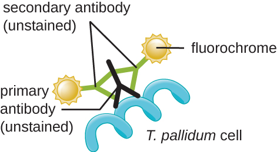

### Learning Objectives

* Differentiate between simple and differential stains
* Describe the unique features of commonly used stains
* Explain the procedures and name clinical applications for Gram, endospore, acid-fast, negative capsule, and flagella staining

In their natural state, most of the cells and microorganisms that we observe under the microscope lack color and contrast. This makes it difficult, if not impossible, to detect important cellular structures and their distinguishing characteristics without artificially treating specimens. We have already alluded to certain techniques involving stains and fluorescent dyes, and in this section we will discuss specific techniques for sample preparation in greater detail. Indeed, numerous methods have been developed to identify specific microbes, cellular structures, DNA sequences, or indicators of infection in tissue samples, under the microscope. Here, we will focus on the most clinically relevant techniques.

### Preparing Specimens for Light Microscopy

In clinical settings, light microscopes are the most commonly used microscopes. There are two basic types of preparation used to view specimens with a light microscope: wet mounts and fixed specimens.

The simplest type of preparation is the **wet mount**{: data-type="term"}, in which the specimen is placed on the slide in a drop of liquid. Some specimens, such as a drop of urine, are already in a liquid form and can be deposited on the slide using a dropper. Solid specimens, such as a skin scraping, can be placed on the slide before adding a drop of liquid to prepare the wet mount. Sometimes the liquid used is simply water, but often stains are added to enhance contrast. Once the liquid has been added to the slide, a coverslip is placed on top and the specimen is ready for examination under the microscope.

The second method of preparing specimens for light microscopy is **fixation**{: data-type="term"}. The “fixing” of a sample refers to the process of attaching cells to a slide. Fixation is often achieved either by heating (**heat fixing**{: data-type="term" .no-emphasis}) or chemically treating the specimen. In addition to attaching the specimen to the slide, fixation also kills microorganisms in the specimen, stopping their movement and metabolism while preserving the integrity of their cellular components for observation.

To heat-fix a sample, a thin layer of the specimen is spread on the slide (called a **smear**{: data-type="term"}), and the slide is then briefly heated over a heat source ([\[link\]](#OSC_Microbio_02_04_Fixation)). **Chemical fixatives**{: data-type="term" .no-emphasis} are often preferable to heat for tissue specimens. Chemical agents such as acetic acid, ethanol, methanol, formaldehyde (formalin), and glutaraldehyde can denature proteins, stop biochemical reactions, and stabilize cell structures in tissue samples ([\[link\]](#OSC_Microbio_02_04_Fixation)).

  A specimen can be heat-fixed by using a slide warmer like this one. (b) Another method for heat-fixing a specimen is to hold a slide with a smear over a microincinerator. (c) This tissue sample is being fixed in a solution of formalin (also known as formaldehyde). Chemical fixation kills microorganisms in the specimen, stopping degradation of the tissues and preserving their structure so that they can be examined later under the microscope. (credit a: modification of work by Nina Parker; credit b: modification of work by Nina Parker; credit c: modification of work by &#x201C;University of Bristol&#x201D;/YouTube)"){: #OSC_Microbio_02_04_Fixation}

In addition to fixation, **staining**{: data-type="term"} is almost always applied to color certain features of a specimen before examining it under a light microscope. Stains, or dyes, contain salts made up of a positive ion and a negative ion. Depending on the type of dye, the positive or the negative ion may be the chromophore (the colored ion); the other, uncolored ion is called the counterion. If the chromophore is the positively charged ion, the stain is classified as a **basic dye**{: data-type="term"}; if the negative ion is the chromophore, the stain is considered an **acidic dye**{: data-type="term"}.

Dyes are selected for staining based on the chemical properties of the dye and the specimen being observed, which determine how the dye will interact with the specimen. In most cases, it is preferable to use a **positive stain**{: data-type="term"}, a dye that will be absorbed by the cells or organisms being observed, adding color to objects of interest to make them stand out against the background. However, there are scenarios in which it is advantageous to use a **negative stain**{: data-type="term"}, which is absorbed by the background but not by the cells or organisms in the specimen. Negative staining produces an outline or silhouette of the organisms against a colorful background ([\[link\]](#OSC_Microbio_02_04_Posnegstai)).

  These Bacillus anthracis cells have absorbed crystal violet, a basic positive stain. (b) This specimen of Spinoloricus, a microscopic marine organism, has been stained with rose bengal, a positive acidic stain. (c) These B. megaterium appear to be white because they have not absorbed the negative red stain applied to the slide. (credit a: modification of work by Centers for Disease Control and Prevention; credit b: modification of work by Roberto Danovaro, Antonio Pusceddu, Cristina Gambi, Iben Heiner, Reinhardt Mobjerg Kristensen; credit c: modification of work by Anh-Hue Tu)"){: #OSC_Microbio_02_04_Posnegstai}

Because cells typically have negatively charged cell walls, the positive chromophores in basic dyes tend to stick to the cell walls, making them positive stains. Thus, commonly used basic dyes such as **basic fuchsin**{: data-type="term" .no-emphasis}, **crystal violet**{: data-type="term" .no-emphasis}, **malachite green**{: data-type="term" .no-emphasis}, **methylene blue**{: data-type="term" .no-emphasis}, and **safranin**{: data-type="term" .no-emphasis} typically serve as positive stains. On the other hand, the negatively charged chromophores in acidic dyes are repelled by negatively charged cell walls, making them negative stains. Commonly used acidic dyes include **acid fuchsin**{: data-type="term" .no-emphasis}, **eosin**{: data-type="term" .no-emphasis}, and **rose bengal**{: data-type="term" .no-emphasis}. [\[link\]](#OSC_Microbio_02_04_StaintablA) provides more detail.

Some staining techniques involve the application of only one dye to the sample; others require more than one dye. In **simple staining**{: data-type="term"}, a single dye is used to emphasize particular structures in the specimen. A simple stain will generally make all of the organisms in a sample appear to be the same color, even if the sample contains more than one type of organism. In contrast, **differential staining**{: data-type="term"} distinguishes organisms based on their interactions with multiple stains. In other words, two organisms in a differentially stained sample may appear to be different colors. Differential staining techniques commonly used in clinical settings include Gram staining, acid-fast staining, endospore staining, flagella staining, and capsule staining. [\[link\]](#OSC_Microbio_02_04_StaintablB) provides more detail on these differential staining techniques.

* Explain why it is important to fix a specimen before viewing it under a light microscope.
* What types of specimens should be chemically fixed as opposed to heat-fixed?
* Why might an acidic dye react differently with a given specimen than a basic dye?
* Explain the difference between a positive stain and a negative stain.
* Explain the difference between simple and differential staining.

### Gram Staining

The **Gram stain procedure**{: data-type="term"} is a differential staining procedure that involves multiple steps. It was developed by Danish microbiologist Hans Christian **Gram**{: data-type="term" .no-emphasis} in 1884 as an effective method to distinguish between bacteria with different types of cell walls, and even today it remains one of the most frequently used staining techniques. The steps of the Gram stain procedure are listed below and illustrated in [\[link\]](#OSC_Microbio_02_04_GramProc).

1.  First, **crystal violet**{: data-type="term" .no-emphasis}, a **primary stain**{: data-type="term"}, is applied to a heat-fixed smear, giving all of the cells a purple color.
2.  Next, **Gram’s iodine**{: data-type="term" .no-emphasis}, a **mordant**{: data-type="term"}, is added. A mordant is a substance used to set or stabilize stains or dyes; in this case, Gram’s iodine acts like a trapping agent that complexes with the crystal violet, making the crystal violet–iodine complex clump and stay contained in thick layers of peptidoglycan in the cell walls.
3.  Next, a **decolorizing agent**{: data-type="term"} is added, usually ethanol or an acetone/ethanol solution. Cells that have thick peptidoglycan layers in their cell walls are much less affected by the decolorizing agent; they generally retain the crystal violet dye and remain purple. However, the decolorizing agent more easily washes the dye out of cells with thinner peptidoglycan layers, making them again colorless.
4.  Finally, a secondary **counterstain**{: data-type="term"}, usually **safranin**{: data-type="term" .no-emphasis}, is added. This stains the decolorized cells pink and is less noticeable in the cells that still contain the crystal violet dye.
{: data-number-style="arabic"}

 ![A table shows the Gram stain process. Each row consists of a column describing the step and a column describing the effect. Additional columns show drawings to support the description in the effects column. Step 1: Crystal Violet, the primary stain, is added to the specimen smear. This stains cells purple or blue. The Gram-positive and Gram-negative cells all look purple. Step 2: Iodine, the mordant, makes the dye less soluble so it adheres to cell walls. The cells remain purple or blue. The Gram-positive and Gram-negative cells all look purple. Step 3: Alcohol, the decolorizer, washes away stain from Gram-negative cell walls. Gram-positive cells remain purple or blue, Gram-negative cells are colorless. Step 4: Safranin, the counterstain, allows dye adherence to Gram-negative cells. Gram-positive cells remain a pruple or blue. Gram-negative cells appear pink or red.](../resources/OSC_Microbio_02_04_GramProc.jpg "Gram-staining is a differential staining technique that uses a primary stain and a secondary counterstain to distinguish between gram-positive and gram-negative bacteria."){: #OSC_Microbio_02_04_GramProc}

The purple, crystal-violet stained cells are referred to as gram-positive cells, while the red, safranin-dyed cells are gram-negative ([\[link\]](#OSC_Microbio_02_04_Gramstain)). However, there are several important considerations in interpreting the results of a Gram stain. First, older bacterial cells may have damage to their cell walls that causes them to appear gram-negative even if the species is gram-positive. Thus, it is best to use fresh bacterial cultures for Gram staining. Second, errors such as leaving on decolorizer too long can affect the results. In some cases, most cells will appear gram-positive while a few appear gram-negative (as in [\[link\]](#OSC_Microbio_02_04_Gramstain)). This suggests damage to the individual cells or that decolorizer was left on for too long; the cells should still be classified as gram-positive if they are all the same species rather than a mixed culture.

Besides their differing interactions with dyes and decolorizing agents, the chemical differences between gram-positive and gram-negative cells have other implications with clinical relevance. For example, Gram staining can help clinicians classify bacterial pathogens in a sample into categories associated with specific properties. Gram-negative bacteria tend to be more resistant to certain antibiotics than gram-positive bacteria. We will discuss this and other applications of Gram staining in more detail in later chapters.

 "){: #OSC_Microbio_02_04_Gramstain}

* Explain the role of Gram’s iodine in the Gram stain procedure.
* Explain the role of alcohol in the Gram stain procedure.
* What color are gram-positive and gram-negative cells, respectively, after the Gram stain procedure?

Part 3

Viewing Cindy’s specimen under the darkfield microscope has provided the technician with some important clues about the identity of the microbe causing her infection. However, more information is needed to make a conclusive diagnosis. The technician decides to make a Gram stain of the specimen. This technique is commonly used as an early step in identifying pathogenic bacteria. After completing the **Gram stain procedure**{: data-type="term" .no-emphasis}, the technician views the slide under the brightfield microscope and sees purple, grape-like clusters of spherical cells ([\[link\]](#OSC_Microbio_02_04_StaphGram)).

* Are these bacteria gram-positive or gram-negative?
* What does this reveal about their cell walls?
{: data-bullet-style="bullet"}

*Jump to the [next](#fs-id1167794065094) Clinical Focus box. Go back to the [previous](/m58787#fs-id1167794186932) Clinical Focus box.*

"){: #OSC_Microbio_02_04_StaphGram}

### Acid-Fast Stains

Acid-fast staining is another commonly used, differential staining technique that can be an important diagnostic tool. An **acid-fast stain**{: data-type="term"} is able to differentiate two types of gram-positive cells: those that have waxy mycolic acids in their cell walls, and those that do not. Two different methods for acid-fast staining are the **Ziehl-Neelsen technique**{: data-type="term"} and the **Kinyoun technique**{: data-type="term"}. Both use **carbolfuchsin**{: data-type="term" .no-emphasis} as the primary stain. The waxy, acid-fast cells retain the carbolfuchsin even after a decolorizing agent (an acid-alcohol solution) is applied. A secondary counterstain, methylene blue, is then applied, which renders non–acid-fast cells blue.

The fundamental difference between the two carbolfuchsin-based methods is whether heat is used during the primary staining process. The Ziehl-Neelsen method uses heat to infuse the carbolfuchsin into the acid-fast cells, whereas the Kinyoun method does not use heat. Both techniques are important diagnostic tools because a number of specific diseases are caused by **acid-fast bacteria**{: data-type="term" .no-emphasis} (AFB). If AFB are present in a tissue sample, their red or pink color can be seen clearly against the blue background of the surrounding tissue cells ([\[link\]](#OSC_Microbio_02_04_Acidfast)).

* Why are acid-fast stains useful?

Using Microscopy to Diagnose Tuberculosis

***Mycobacterium tuberculosis***{: data-type="term" .no-emphasis}, the bacterium that causes **tuberculosis**{: data-type="term" .no-emphasis}, can be detected in specimens based on the presence of acid-fast bacilli. Often, a smear is prepared from a sample of the patient’s sputum and then stained using the Ziehl-Neelsen technique ([\[link\]](#OSC_Microbio_02_04_Acidfast)). If acid-fast bacteria are confirmed, they are generally cultured to make a positive identification. Variations of this approach can be used as a first step in determining whether *M. tuberculosis* or other acid-fast bacteria are present, though samples from elsewhere in the body (such as urine) may contain other *Mycobacterium* species.

An alternative approach for determining the presence of *M. tuberculosis* is immunofluorescence. In this technique, fluorochrome-labeled antibodies bind to *M. tuberculosis*, if present. Antibody-specific fluorescent dyes can be used to view the mycobacteria with a fluorescence microscope.

"){: #OSC_Microbio_02_04_Acidfast}

### Capsule Staining

Certain bacteria and yeasts have a protective outer structure called a capsule. Since the presence of a capsule is directly related to a microbe’s virulence (its ability to cause disease), the ability to determine whether cells in a sample have **capsules**{: data-type="term" .no-emphasis} is an important diagnostic tool. Capsules do not absorb most basic dyes; therefore, a negative staining technique (staining around the cells) is typically used for **capsule staining**{: data-type="term"}. The dye stains the background but does not penetrate the capsules, which appear like halos around the borders of the cell. The specimen does not need to be heat-fixed prior to negative staining.

One common negative staining technique for identifying encapsulated yeast and bacteria is to add a few drops of **India ink**{: data-type="term" .no-emphasis} or **nigrosin**{: data-type="term" .no-emphasis} to a specimen. Other capsular stains can also be used to negatively stain encapsulated cells ([\[link\]](#OSC_Microbio_02_04_CapsuStain)). Alternatively, positive and negative staining techniques can be combined to visualize capsules: The positive stain colors the body of the cell, and the negative stain colors the background but not the capsule, leaving halo around each cell.

  India-ink was used to stain the background around these cells of the yeast Cryptococcus neoformans. The halos surrounding the cells are the polysaccharide capsules. (b) Crystal violet and copper sulfate dyes cannot penetrate the encapsulated Bacillus cells in this negatively stained sample. Encapsulated cells appear to have a light-blue halo. (credit a: modification of work by American Society for Microbiology; credit b: modification of work by American Society for Microbiology)"){: #OSC_Microbio_02_04_CapsuStain}

* How does negative staining help us visualize capsules?

### Endospore Staining

Endospores are structures produced within certain bacterial cells that allow them to survive harsh conditions. Gram staining alone cannot be used to visualize endospores, which appear clear when Gram-stained cells are viewed. **Endospore staining**{: data-type="term"} uses two stains to differentiate **endospores**{: data-type="term" .no-emphasis} from the rest of the cell. The **Schaeffer-Fulton method**{: data-type="term" .no-emphasis} (the most commonly used endospore-staining technique) uses heat to push the primary stain (**malachite green**{: data-type="term" .no-emphasis}) into the endospore. Washing with water decolorizes the cell, but the endospore retains the green stain. The cell is then counterstained pink with **safranin**{: data-type="term" .no-emphasis}. The resulting image reveals the shape and location of endospores, if they are present. The green endospores will appear either within the pink vegetative cells or as separate from the pink cells altogether. If no endospores are present, then only the pink vegetative cells will be visible ([\[link\]](#OSC_Microbio_02_04_Endospores)).

 "){: #OSC_Microbio_02_04_Endospores}

Endospore-staining techniques are important for identifying *Bacillus* and *Clostridium*, two genera of endospore-producing bacteria that contain clinically significant species. Among others, ***B. anthracis***{: data-type="term" .no-emphasis} (which causes **anthrax**{: data-type="term" .no-emphasis}) has been of particular interest because of concern that its spores could be used as a bioterrorism agent. ***C. difficile***{: data-type="term" .no-emphasis} is a particularly important species responsible for the typically hospital-acquired infection known as “C. diff.”

* Is endospore staining an example of positive, negative, or differential staining?

### Flagella Staining

**Flagella**{: data-type="term" .no-emphasis} (singular: flagellum) are tail-like cellular structures used for locomotion by some bacteria, archaea, and eukaryotes. Because they are so thin, flagella typically cannot be seen under a light microscope without a specialized **flagella staining**{: data-type="term"} technique. Flagella staining thickens the flagella by first applying mordant (generally tannic acid, but sometimes potassium alum), which coats the flagella; then the specimen is stained with **pararosaniline**{: data-type="term" .no-emphasis} (most commonly) or **basic fuchsin**{: data-type="term" .no-emphasis} ([\[link\]](#OSC_Microbio_02_04_FlagStain)).

 "){: #OSC_Microbio_02_04_FlagStain}

Though flagella staining is uncommon in clinical settings, the technique is commonly used by microbiologists, since the location and number of flagella can be useful in classifying and identifying bacteria in a sample. When using this technique, it is important to handle the specimen with great care; flagella are delicate structures that can easily be damaged or pulled off, compromising attempts to accurately locate and count the number of flagella.

 ![A table of simple stains is shown. Basic stains include: methylene blue, crystal violet, malachite green, basic fuschsin, carbolfuschsin, and safranin. Basic stains stain negatively charged molecules and structures, such as nucleic acids and proteins. The outcome of this positive stain is dark cells on a light background. Acidic stains include eosine, acid fuchsin, rose Bengal, and Congo red. Acid stains stain positively charged molecules and structures such as proteins. Acidic stains can either be positive or negative stains depending on the cell&#x2019;s chemistry. Negative stains include india in k and nigrosine. Negative stains stain the background, not the specimen and produce a dark background with a light specimen.](../resources/OSC_Microbio_02_04_StaintablA.jpg "(credit &#x201C;basic stains&#x201D;: modification of work by Centers for Disease Control and Prevention; credit &#x201C;Acidic stains&#x201D;: modification of work by Roberto Danovaro, Antonio Dell&#x2019;Anno, Antonio Pusceddu, Cristina Gambi, Iben Heiner, Reinhardt Mobjerg Kristensen; credit &#x201C;Negative stains&#x201D;: modification of work by Anh-Hue Tu)"){: #OSC_Microbio_02_04_StaintablA}

![A table of differential stains is shown. The Gram stain uses crystal violet, Gram&#x2019;s iodine, ethanol (decolorizer), and safranin. The purpose of the Gram stain is to distinguish cells by cell-wall type (Gram-positive, Gram-negative). Gram-positive cells stain purple/violet. Gram-negative cells stain pink. The acid fast stain: after staining with basic fuchsin, acid-fast bacteria resist decolonization by acid-alcohol. Non-acid-fast bacteria are counterstained with methylene blue. The acid-fast stain is used to distinguish acid-fast bacteria such as M. tuberculosis, from non-acid-fast cells. Acid-fast bacteria are red; non-acid-fast cells are blue. The Endospore stain uses heat to stain endospores with malachite green (Schaeffer-Fulton procedure), then cell is washed and counterstained with safranin. The endospore stain is used to distinguish organisms with endospores from those without; used to study the endospore. Endospores appear bluish-green; other structures appear pink to red. Flagella stain: flagella are coated with a tannic acid or potassium alum mordant, then stained using either pararosaline or basic fuchsin. The flagella stain is used to view and study flagella in bacteria that have them. Flagella are visible as thin strands if present. Capsule stain: negative staining with india ink or nigrosine is used to stain the background, leaving a clear area of the cell and the capsule Counterstaining can be used to stain the cell while leaving the capsule clear. The capsule stain is used to distinguish cells with capsules from those without. Capsules appear clear or as halos if present.](../resources/OSC_Microbio_02_04_StaintablB.jpg "(credit &#x201C;Gram stain&#x201D;: modification of work by Nina Parker; credit &#x201C;Acid-fast stain&#x201D;: modification of work by American Society for Microbiology; credit &#x201C;Endospore stain&#x201D;: modification of work by American Society for Microbiology; credit &#x201C;Capsule stain&#x201D; : modification of work by American Society for Microbiology; credit &#x201C;Flagella stain&#x201D;: modification of work by Centers for Disease Control and Prevention)"){: #OSC_Microbio_02_04_StaintablB}

### Preparing Specimens for Electron Microscopy

Samples to be analyzed using a TEM must have very thin sections. But cells are too soft to cut thinly, even with diamond knives. To cut cells without damage, the cells must be embedded in plastic resin and then dehydrated through a series of soaks in ethanol solutions (50%, 60%, 70%, and so on). The ethanol replaces the water in the cells, and the resin dissolves in ethanol and enters the cell, where it solidifies. Next, **thin sections**{: data-type="term"} are cut using a specialized device called an **ultramicrotome**{: data-type="term"} ([\[link\]](#OSC_Microbio_02_04_Microtome)). Finally, samples are fixed to fine copper wire or carbon-fiber grids and stained—not with colored dyes, but with substances like uranyl acetate or osmium tetroxide, which contain electron-dense heavy metal atoms.

  An ultramicrotome used to prepare specimens for a TEM. (b) A technician uses an ultramicrotome to slice a specimen into thin sections. (credit a: modification of work by &#x201C;Frost Museum&#x201D;/Flickr; credit b: modification of work by U.S. Fish and Wildlife Service Northeast Region)"){: #OSC_Microbio_02_04_Microtome}

When samples are prepared for viewing using an SEM, they must also be dehydrated using an ethanol series. However, they must be even drier than is necessary for a TEM. Critical point drying with inert liquid carbon dioxide under pressure is used to displace the water from the specimen. After drying, the specimens are sputter-coated with metal by knocking atoms off of a palladium target, with energetic particles. Sputter-coating prevents specimens from becoming charged by the SEM’s electron beam.

* Why is it important to dehydrate cells before examining them under an electron microscope?
* Name the device that is used to create thin sections of specimens for electron microscopy.

Using Microscopy to Diagnose Syphilis

The causative agent of **syphilis**{: data-type="term" .no-emphasis} is ***Treponema pallidum***{: data-type="term" .no-emphasis}, a flexible, spiral cell (spirochete) that can be very thin (&lt;0.15 μm) and match the refractive index of the medium, making it difficult to view using brightfield microscopy. Additionally, this species has not been successfully cultured in the laboratory on an artificial medium; therefore, diagnosis depends upon successful identification using microscopic techniques and serology (analysis of body fluids, often looking for antibodies to a pathogen). Since fixation and staining would kill the cells, darkfield microscopy is typically used for observing live specimens and viewing their movements. However, other approaches can also be used. For example, the cells can be thickened with silver particles (in tissue sections) and observed using a light microscope. It is also possible to use fluorescence or electron microscopy to view *Treponema* ([\[link\]](#OSC_Microbio_02_04_Syphilis)).

 Living, unstained Treponema pallidum spirochetes can be viewed under a darkfield microscope. (b) In this brightfield image, a modified Steiner silver stain is used to visualized T. pallidum spirochetes. Though the stain kills the cells, it increases the contrast to make them more visible. (c) While not used for standard diagnostic testing, T. pallidum can also be examined using scanning electron microscopy. (credit a: modification of work by Centers for Disease Control and Prevention; credit b: modification of work by Centers for Disease Control and Prevention; credit c: modification of work by Centers for Disease Control and Prevention)"){: #OSC_Microbio_02_04_Syphilis}

In clinical settings, indirect **immunofluorescence**{: data-type="term" .no-emphasis} is often used to identify *Treponema.* A primary, unstained antibody attaches directly to the pathogen surface, and secondary antibodies “tagged” with a fluorescent stain attach to the primary antibody. Multiple secondary antibodies can attach to each primary antibody, amplifying the amount of stain attached to each *Treponema* cell, making them easier to spot ([\[link\]](#OSC_Microbio_02_04_IndIrectFl)).

{: #OSC_Microbio_02_04_IndIrectFl}

### Preparation and Staining for Other Microscopes

Samples for fluorescence and confocal microscopy are prepared similarly to samples for light microscopy, except that the dyes are fluorochromes. Stains are often diluted in liquid before applying to the slide. Some dyes attach to an antibody to stain specific proteins on specific types of cells (**immunofluorescence**{: data-type="term" .no-emphasis}); others may attach to DNA molecules in a process called **fluorescence in situ hybridization (FISH)**{: data-type="term" .no-emphasis}, causing cells to be stained based on whether they have a specific DNA sequence.

Sample preparation for two-photon microscopy is similar to fluorescence microscopy, except for the use of infrared dyes. Specimens for STM need to be on a very clean and atomically smooth surface. They are often mica coated with Au(111). Toluene vapor is a common fixative.

* What is the main difference between preparing a sample for fluorescence microscopy versus light microscopy?

Cornell University’s [Case Studies in Microscopy][1] offers a series of clinical problems based on real-life events. Each case study walks you through a clinical problem using appropriate techniques in microscopy at each step.

Resolution

From the results of the Gram stain, the technician now knows that Cindy’s infection is caused by spherical, gram-positive bacteria that form grape-like clusters, which is typical of staphylococcal bacteria. After some additional testing, the technician determines that these bacteria are the medically important species known as ***Staphylococcus aureus***{: data-type="term" .no-emphasis}, a common culprit in wound infections. Because some strains of *S. aureus* are resistant to many antibiotics, skin infections may spread to other areas of the body and become serious, sometimes even resulting in amputations or death if the correct antibiotics are not used.

After testing several antibiotics, the lab is able to identify one that is effective against this particular strain of *S. aureus*. Cindy’s doctor quickly prescribes the medication and emphasizes the importance of taking the entire course of antibiotics, even if the infection appears to clear up before the last scheduled dose. This reduces the risk that any especially resistant bacteria could survive, causing a second infection or spreading to another person.

*Go back to the [previous](#fs-id1167793396470) Clinical Focus box.*

Microscopy and Antibiotic Resistance

As the use of antibiotics has proliferated in medicine, as well as agriculture, microbes have evolved to become more resistant. Strains of bacteria such as methicillin-resistant *S. aureus* (**MRSA**{: data-type="term" .no-emphasis}), which has developed a high level of resistance to many antibiotics, are an increasingly worrying problem, so much so that research is underway to develop new and more diversified antibiotics.

Fluorescence microscopy can be useful in testing the effectiveness of new antibiotics against resistant strains like MRSA. In a test of one new antibiotic derived from a marine bacterium, MC21-A (bromophene), researchers used the fluorescent dye **SYTOX Green**{: data-type="term" .no-emphasis} to stain samples of MRSA. SYTOX Green is often used to distinguish dead cells from living cells, with fluorescence microscopy. Live cells will not absorb the dye, but cells killed by an antibiotic will absorb the dye, since the antibiotic has damaged the bacterial cell membrane. In this particular case, MRSA bacteria that had been exposed to MC21-A did, indeed, appear green under the fluorescence microscope, leading researchers to conclude that it is an effective antibiotic against MRSA.

Of course, some argue that developing new antibiotics will only lead to even more antibiotic-resistant microbes, so-called **superbugs**{: data-type="term" .no-emphasis} that could spawn epidemics before new treatments can be developed. For this reason, many health professionals are beginning to exercise more discretion in prescribing antibiotics. Whereas antibiotics were once routinely prescribed for common illnesses without a definite diagnosis, doctors and hospitals are much more likely to conduct additional testing to determine whether an antibiotic is necessary and appropriate before prescribing.

A sick patient might reasonably object to this stingy approach to prescribing antibiotics. To the patient who simply wants to feel better as quickly as possible, the potential benefits of taking an antibiotic may seem to outweigh any immediate health risks that might occur if the antibiotic is ineffective. But at what point do the risks of widespread antibiotic use supersede the desire to use them in individual cases?

### Key Concepts and Summary

* Samples must be properly prepared for microscopy. This may involve **staining**, **fixation**, and/or cutting **thin sections**.
* A variety of staining techniques can be used with light microscopy, including **Gram staining, acid-fast staining**, **capsule staining**, **endospore staining,** and **flagella staining**.
* Samples for TEM require very thin sections, whereas samples for SEM require sputter-coating.
* Preparation for fluorescence microscopy is similar to that for light microscopy, except that fluorochromes are used.
{: data-bullet-style="bullet"}

### Multiple Choice

What mordant is used in Gram staining?

1.  crystal violet
2.  safranin
3.  acid-alcohol
4.  iodine
{: data-number-style="upper-alpha"}

D

What is one difference between specimen preparation for a transmission electron microscope (TEM) and preparation for a scanning electron microscope (SEM)?

1.  Only the TEM specimen requires sputter coating.
2.  Only the SEM specimen requires sputter-coating.
3.  Only the TEM specimen must be dehydrated.
4.  Only the SEM specimen must be dehydrated.
{: data-number-style="upper-alpha"}

B

### Fill in the Blank

Ziehl-Neelsen staining, a type of \_\_\_\_\_\_\_ staining, is diagnostic for *Mycobacterium tuberculosis.*

acid-fast

The \_\_\_\_\_\_\_ is used to differentiate bacterial cells based on the components of their cell walls.

Gram stain

### Short Answer

How could you identify whether a particular bacterial sample contained specimens with mycolic acid-rich cell walls?

### Critical Thinking

You use the Gram staining procedure to stain an L-form bacterium (a bacterium that lacks a cell wall). What color will the bacterium be after the staining procedure is finished?

[1]: https://www.openstax.org/l/22cornellstud
