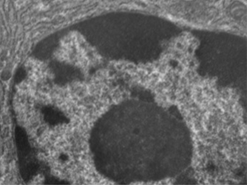
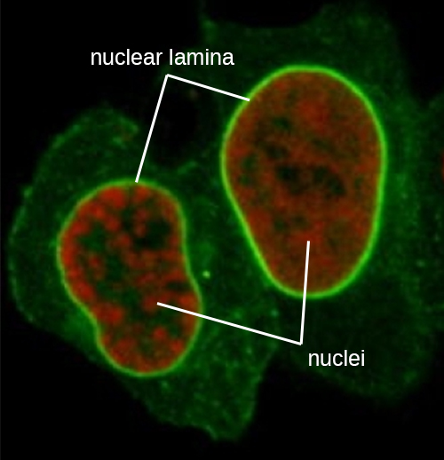

# Learning Objectives

* Explain the distinguishing characteristics of eukaryotic cells
* Describe internal and external structures of prokaryotic cells in terms of their physical structure, chemical structure, and function
* Identify and describe structures and organelles unique to eukaryotic cells
* Compare and contrast similar structures found in prokaryotic and eukaryotic cells

Eukaryotic organisms include protozoans, algae, fungi, plants, and animals. Some eukaryotic cells are independent, single-celled microorganisms, whereas others are part of multicellular organisms. The cells of eukaryotic organisms have several distinguishing characteristics. Above all, **eukaryotic cells**{: data-type="term" .no-emphasis} are defined by the presence of a nucleus surrounded by a complex nuclear membrane. Also, eukaryotic cells are characterized by the presence of membrane-bound organelles in the cytoplasm. Organelles such as mitochondria, the endoplasmic reticulum (ER), Golgi apparatus, lysosomes, and peroxisomes are held in place by the **cytoskeleton**{: data-type="term"}, an internal network that supports transport of intracellular components and helps maintain cell shape ([\[link\]](#OSC_Microbio_03_04_eukcell)). The genome of eukaryotic cells is packaged in multiple, rod-shaped chromosomes as opposed to the single, circular-shaped chromosome that characterizes most prokaryotic cells. [\[link\]](#fs-id1172100758630) compares the characteristics of eukaryotic cell structures with those of bacteria and archaea.

 ![A diagram of a large cell. The outside of the cell is a thin line labeled plasma membrane. A long projection outside of the plasma membrane is labeled flagellum. Shorter projections outside the membrane are labeled cilia. Just under the plasma membrane are lines labeled microtubules and microfilaments. The fluid inside the plasma membrane is labeled cytoplasm. In the cytoplasm are small dots labeled ribosomes. These dots are  either floating in the cytoplasm or attached to a webbed membrane labeled rough endoplasmic reticulum. Some regions of the webbed membrane do not have dots; these regions of the membrane are called smooth endoplasmic reticulum. Other structures in the cytoplasm include an oval with a webbed line inside of it; this is labeled the mitochondrion. Spheres in the cytoplasm are labeled peroxisome and lysosome. A pancake stack of membranes is labeled golgi complex. Two short tubes are labeled centrosomes. A large sphere in the cell is labeled nucleus. The outer membrane of this sphere is the nuclear envelope. Holes in the nuclear envelope are called nuclear pores. A smaller sphere in the nucleus is labeled nucleolus.](../resources/OSC_Microbio_03_04_eukcell.jpg "An illustration of a generalized, single-celled eukaryotic organism. Note that cells of eukaryotic organisms vary greatly in terms of structure and function, and a particular cell may not have all of the structures shown here."){: #OSC_Microbio_03_04_eukcell}

<table summary="Table titled Summary of Cell Structures. Four Columns: Cell Structure, Prokaryotes (bacteria), Prokaryotes (Archaea), Eukaryotes. Eleven rows each containing a different characteristic. Size: bacteria about 0.5 to 1 &#xB5;m, archaea 0.5 to 1 &#xB5;m, eukaryotes ~5-20 &#xB5;m. Bacteria and archaea do not have a nucleus; eukaryotes do. Genome characteristics for bacteria: single chromosome, circular, haploid, lacks histones. Genome characteristics for archaea: single chromosome, circular, haploid, contains histones. Genome characteristics for Eukaryotes: multiple chromosome&#x2019;s, linear, haploid or diploid, contains histones. Bacteria and archaea divide by binary fission; eukaryotes use mitosis and meiosis. Membrane composition of bacteria: ester-linked, straight-chain fatty acids, bilayer. Membrane composition of archaea: ester-linked, branched isoprenoids, bilayer or monolayer. Membrane composition of bacteria: ester-linked, straight-chain fatty acids, sterols, bilayer. Cell wall composition of bacteria: peptidoglycan, or none. Cell wall composition of archaea: pseudopeptidoglycan, or glycopeptide, or polysaccharide, or protein (S-layer), or None. Cell wall composition of eukaryotes: cellulose (plants, some algae), chitin (molluscs, insects, crustaceans, and fungi), silica (some algae), most others lack cell walls. Motility of bacteria: rigid spiral flagella composed of flagellin. Motility of archaea: rigid spiral flagella composed of archaeal fagellins. Motility of eukaryotes: flexible flagella and cilia composed of microtubules. Eukaryotes have membrane bound organelles, bacteria and archaea do not. Eukaryotes have an endomembrane system (ER, Golgi, lysosomes), bacteria and archaea do not. Eukaryotic cells have 80S ribosomes in the cytoplasm and rough ER, and 70S ribosomes in the mitochondria and chloroplasts. Bacteria and archaea both have 70S ribosomes." class="span-all"><thead>
<tr>
<th colspan="4" data-align="center">Summary of Cell Structures</th>
</tr>
<tr valign="top">
<th rowspan="2" data-valign="top" data-align="center">Cell Structure</th>
<th colspan="2" data-valign="top" data-align="center">Prokaryotes</th>
<th rowspan="2" data-valign="top" data-align="center">Eukaryotes</th>
</tr>
<tr valign="top">
<th data-valign="top" data-align="center">Bacteria</th>
<th data-valign="top" data-align="center">Archaea</th>
</tr>
</thead><tbody>
<tr valign="top">
<td data-valign="top" data-align="left">Size</td>
<td data-valign="top" data-align="left">~0.5–1 μM</td>
<td data-valign="top" data-align="left">~0.5–1 μM</td>
<td data-valign="top" data-align="left">~5–20 μM</td>
</tr>
<tr valign="top">
<td data-valign="top" data-align="left">Surface area-to-volume ratio</td>
<td data-valign="top" data-align="left">High</td>
<td data-valign="top" data-align="left">High</td>
<td data-valign="top" data-align="left">Low</td>
</tr>
<tr valign="top">
<td data-valign="top" data-align="left">Nucleus</td>
<td data-valign="top" data-align="left">No</td>
<td data-valign="top" data-align="left">No</td>
<td data-valign="top" data-align="left">Yes</td>
</tr>
<tr valign="top">
<td data-valign="top" data-align="left">Genome characteristics</td>
<td data-valign="top" data-align="left"><ul data-bullet-style="bullet">
<li>Single chromosome</li>
<li>Circular</li>
<li>Haploid</li>
<li>Lacks histones</li>
</ul></td>
<td data-valign="top" data-align="left"><ul data-bullet-style="bullet">
<li>Single chromosome</li>
<li>Circular</li>
<li>Haploid</li>
<li>Contains histones</li>
</ul></td>
<td data-valign="top" data-align="left"><ul data-bullet-style="bullet">
<li>Multiple chromosomes</li>
<li>Linear</li>
<li>Haploid or diploid</li>
<li>Contains histones</li>
</ul></td>
</tr>
<tr valign="top">
<td data-valign="top" data-align="left">Cell division</td>
<td data-valign="top" data-align="left">Binary fission</td>
<td data-valign="top" data-align="left">Binary fission</td>
<td data-valign="top" data-align="left">Mitosis, meiosis</td>
</tr>
<tr valign="top">
<td data-valign="top" data-align="left">Membrane lipid composition</td>
<td data-valign="top" data-align="left"><ul data-bullet-style="bullet">
<li>Ester-linked</li>
<li>Straight-chain fatty acids</li>
<li>Bilayer</li>
</ul></td>
<td data-valign="top" data-align="left"><ul data-bullet-style="bullet">
<li>Ether-linked</li>
<li>Branched isoprenoids</li>
<li>Bilayer or monolayer</li>
</ul></td>
<td data-valign="top" data-align="left"><ul data-bullet-style="bullet">
<li>Ester-linked</li>
<li>Straight-chain fatty acids</li>
<li>Sterols</li>
<li>Bilayer</li>
</ul></td>
</tr>
<tr valign="top">
<td data-valign="top" data-align="left">Cell wall composition</td>
<td data-valign="top" data-align="left"><ul data-bullet-style="bullet">
<li>Peptidoglycan, or</li>
<li>None</li>
</ul></td>
<td data-valign="top" data-align="left"><ul data-bullet-style="bullet">
<li>Pseudopeptidoglycan, or</li>
<li>Glycopeptide, or</li>
<li>Polysaccharide, or</li>
<li>Protein (S-layer), or</li>
<li>None</li>
</ul></td>
<td data-valign="top" data-align="left"><ul data-bullet-style="bullet">
<li>Cellulose (plants, some algae)</li>
<li>Chitin (molluscs, insects, crustaceans, and fungi)</li>
<li>Silica (some algae)</li>
<li>Most others lack cell walls</li>
</ul></td>
</tr>
<tr valign="top">
<td data-valign="top" data-align="left">Motility structures</td>
<td data-valign="top" data-align="left">Rigid spiral flagella composed of flagellin</td>
<td data-valign="top" data-align="left">Rigid spiral flagella composed of archaeal flagellins</td>
<td data-valign="top" data-align="left">Flexible flagella and cilia composed of microtubules</td>
</tr>
<tr valign="top">
<td data-valign="top" data-align="left">Membrane-bound organelles</td>
<td data-valign="top" data-align="left">No</td>
<td data-valign="top" data-align="left">No</td>
<td data-valign="top" data-align="left">Yes</td>
</tr>
<tr valign="top">
<td data-valign="top" data-align="left">Endomembrane system</td>
<td data-valign="top" data-align="left">No</td>
<td data-valign="top" data-align="left">No</td>
<td data-valign="top" data-align="left">Yes (ER, Golgi, lysosomes)</td>
</tr>
<tr valign="top">
<td data-valign="top" data-align="left">Ribosomes</td>
<td data-valign="top" data-align="left">70S</td>
<td data-valign="top" data-align="left">70S</td>
<td data-valign="top" data-align="left"><ul data-bullet-style="bullet">
<li>80S in cytoplasm and rough ER</li>
<li>70S in mitochondria, chloroplasts</li>
</ul></td>
</tr>
</tbody></table>

# Cell Morphologies

Eukaryotic cells display a wide variety of different cell **morphologies**{: data-type="term" .no-emphasis}. Possible shapes include spheroid, ovoid, cuboidal, cylindrical, flat, lenticular, fusiform, discoidal, crescent, ring stellate, and polygonal ([\[link\]](#OSC_Microbio_03_04_EukShapes)). Some eukaryotic cells are irregular in shape, and some are capable of changing shape. The shape of a particular type of eukaryotic cell may be influenced by factors such as its primary function, the organization of its cytoskeleton, the viscosity of its cytoplasm, the rigidity of its cell membrane or cell wall (if it has one), and the physical pressure exerted on it by the surrounding environment and/or adjoining cells.

  Spheroid Chromulina alga. (b) Fusiform shaped Trypanosoma. (c) Bell-shaped Vorticella. (d) Ovoid Paramecium. (e) Ring-shaped Plasmodium ovale. (credit a: modification of work by NOAA; credit b, e: modification of work by Centers for Disease Control and Prevention)"){: #OSC_Microbio_03_04_EukShapes}

* Identify two differences between eukaryotic and prokaryotic cells.
{: data-bullet-style="bullet"}

# Nucleus

Unlike prokaryotic cells, in which DNA is loosely contained in the nucleoid region, eukaryotic cells possess a **nucleus**{: data-type="term"}, which is surrounded by a complex nuclear membrane that houses the DNA genome ([\[link\]](#OSC_Microbio_03_04_NucleusTEM)). By containing the cell’s DNA, the nucleus ultimately controls all activities of the cell and also serves an essential role in reproduction and heredity. Eukaryotic cells typically have their DNA organized into multiple linear chromosomes. The DNA within the nucleus is highly organized and condensed to fit inside the nucleus, which is accomplished by wrapping the DNA around proteins called histones.

 {: #OSC_Microbio_03_04_NucleusTEM}

Although most eukaryotic cells have only one nucleus, exceptions exist. For example, protozoans of the genus ***Paramecium***{: data-type="term" .no-emphasis} typically have two complete nuclei: a small nucleus that is used for reproduction (micronucleus) and a large nucleus that directs cellular metabolism (macronucleus). Additionally, some fungi transiently form cells with two nuclei, called heterokaryotic cells, during sexual reproduction. Cells whose nuclei divide, but whose cytoplasm does not, are called **coenocytes**{: data-type="term"}.

The nucleus is bound by a complex **nuclear membrane**{: data-type="term"}, often called the **nuclear envelope**{: data-type="term"}, that consists of two distinct lipid bilayers that are contiguous with each other ([\[link\]](#OSC_Microbio_03_04_NucEnv)). Despite these connections between the inner and outer membranes, each membrane contains unique lipids and proteins on its inner and outer surfaces. The nuclear envelope contains nuclear pores, which are large, rosette-shaped protein complexes that control the movement of materials into and out of the nucleus. The overall shape of the nucleus is determined by the **nuclear lamina**{: data-type="term"}, a meshwork of intermediate filaments found just inside the nuclear envelope membranes. Outside the nucleus, additional intermediate filaments form a looser mesh and serve to anchor the nucleus in position within the cell.

 {: #OSC_Microbio_03_04_NucEnv}

## Nucleolus

The **nucleolus**{: data-type="term"} is a dense region within the nucleus where ribosomal RNA (rRNA) biosynthesis occurs. In addition, the nucleolus is also the site where assembly of **ribosomes**{: data-type="term" .no-emphasis} begins. Preribosomal complexes are assembled from rRNA and proteins in the nucleolus; they are then transported out to the cytoplasm, where ribosome assembly is completed ([\[link\]](#OSC_Microbio_03_04_Nucleolus)).

 ![a) A diagram showing the nucleus. A sphere in the center of the nucleus is labeled nucleolus. Lines within the nucleus are labeled chromatin. The fluid of the nucleus is labeled nucleoplasm. The outer region just inside the nuclear envelope is labeled nuclear lamina. The outside of the nucleus is labeled nuclear envelop and pores in the envelope are labeled nuclear pores.  The nuclear envelope is continuous with and becomes the endoplasmic reticulum; a webbing of membranes outside the nucleus. B) A micrograph showing these same structures. The nucleolus is a dark region inside the nucleus which is composed of many lighter lines. The nuclear envelop forms the outside of the nucleus and a pore is seen as a light region in the envelope. Outside the envelope are many lines labeled rough endoplasmic reticulum. A smaller set of lines is labeled mitochondrion overlaying part of the RER.](../resources/OSC_Microbio_03_04_Nucleolus.jpg "(a) The nucleolus is the dark, dense area within the nucleus. It is the site of rRNA synthesis and preribosomal assembly. (b) Electron micrograph showing the nucleolus."){: #OSC_Microbio_03_04_Nucleolus}

# Ribosomes

Ribosomes found in eukaryotic organelles such as mitochondria or chloroplasts have 70S ribosomes—the same size as prokaryotic ribosomes. However, nonorganelle-associated ribosomes in eukaryotic cells are **80S ribosomes**{: data-type="term"}, composed of a 40S small subunit and a 60S large subunit. In terms of size and composition, this makes them distinct from the ribosomes of prokaryotic cells.

The two types of nonorganelle-associated eukaryotic ribosomes are defined by their location in the cell: **free ribosomes**{: data-type="term"} and **membrane-bound ribosomes**{: data-type="term"}. Free ribosomes are found in the cytoplasm and serve to synthesize water-soluble proteins; membrane-bound ribosomes are found attached to the rough endoplasmic reticulum and make proteins for insertion into the cell membrane or proteins destined for export from the cell.

The differences between eukaryotic and prokaryotic ribosomes are clinically relevant because certain antibiotic drugs are designed to target one or the other. For example, cycloheximide targets eukaryotic action, whereas chloramphenicol targets prokaryotic ribosomes.[1](#footnote1){: data-type="footnote-number" name="footnote-ref1"} Since human cells are eukaryotic, they generally are not harmed by antibiotics that destroy the prokaryotic ribosomes in bacteria. However, sometimes negative side effects may occur because mitochondria in human cells contain prokaryotic ribosomes.

# Endomembrane System

The **endomembrane system**{: data-type="term"}, unique to eukaryotic cells, is a series of membranous tubules, sacs, and flattened disks that synthesize many cell components and move materials around within the cell ([\[link\]](#OSC_Microbio_03_04_Endomemb)). Because of their larger cell size, eukaryotic cells require this system to transport materials that cannot be dispersed by diffusion alone. The endomembrane system comprises several organelles and connections between them, including the endoplasmic reticulum, Golgi apparatus, lysosomes, and vesicles.

 ![A diagram showing the nucleus. A sphere in the center of the nucleus is labeled nucleolus. Lines within the nucleus are labeled chromatin. The fluid of the nucleus is labeled nucleoplasm. The outer region just inside the nuclear envelope is labeled nuclear lamina. The outside of the nucleus is labeled nuclear envelop and pores in the envelope are labeled nuclear pores.  The nuclear envelope is continuous with and becomes the endoplasmic reticulum; a webbing of membranes outside the nucleus. Regions of the endoplasmic reticulum with dots are labeled rough endoplasmic reticulum (RER) and regions without dots are labeled smooth endoplasmic reticulum (SER). The RER and SER are continuous with each other.](../resources/OSC_Microbio_03_04_Endomemb.jpg "The endomembrane system is composed of a series of membranous intracellular structures that facilitate movement of materials throughout the cell and to the cell membrane."){: #OSC_Microbio_03_04_Endomemb}

## Endoplasmic Reticulum

The **endoplasmic reticulum (ER)**{: data-type="term"} is an interconnected array of tubules and **cisternae**{: data-type="term"} (flattened sacs) with a single lipid bilayer ([\[link\]](#OSC_Microbio_03_04_ER)). The spaces inside of the cisternae are called **lumen**{: data-type="term"} of the ER. There are two types of ER, **rough endoplasmic reticulum (RER)**{: data-type="term"} and **smooth endoplasmic reticulum (SER)**{: data-type="term"}. These two different types of ER are sites for the synthesis of distinctly different types of molecules. RER is studded with ribosomes bound on the cytoplasmic side of the membrane. These ribosomes make proteins destined for the plasma membrane ([\[link\]](#OSC_Microbio_03_04_ER)). Following synthesis, these proteins are inserted into the membrane of the RER. Small sacs of the RER containing these newly synthesized proteins then bud off as **transport vesicles**{: data-type="term"} and move either to the Golgi apparatus for further processing, directly to the plasma membrane, to the membrane of another organelle, or out of the cell. Transport vesicles are single-lipid, bilayer, membranous spheres with hollow interiors that carry molecules. SER does not have ribosomes and, therefore, appears “smooth.” It is involved in biosynthesis of lipids, carbohydrate metabolism, and detoxification of toxic compounds within the cell.

 ."){: #OSC_Microbio_03_04_ER}

## Golgi Apparatus

The Golgi apparatus was discovered within the endomembrane system in 1898 by Italian scientist Camillo **Golgi**{: data-type="term" .no-emphasis} (1843–1926), who developed a novel staining technique that showed stacked membrane structures within the cells of *Plasmodium*, the causative agent of malaria. The **Golgi apparatus**{: data-type="term"} is composed of a series of membranous disks called dictyosomes, each having a single lipid bilayer, that are stacked together ([\[link\]](#OSC_Microbio_03_04_Golgi)).

Enzymes in the Golgi apparatus modify lipids and proteins transported from the ER to the Golgi, often adding carbohydrate components to them, producing glycolipids, glycoproteins, or proteoglycans. Glycolipids and glycoproteins are often inserted into the plasma membrane and are important for signal recognition by other cells or infectious particles. Different types of cells can be distinguished from one another by the structure and arrangement of the glycolipids and glycoproteins contained in their plasma membranes. These glycolipids and glycoproteins commonly also serve as cell surface receptors.

Transport vesicles leaving the ER fuse with a Golgi apparatus on its receiving, or *cis*, face. The proteins are processed within the Golgi apparatus, and then additional transport vesicles containing the modified proteins and lipids pinch off from the Golgi apparatus on its outgoing, or *trans*, face. These outgoing vesicles move to and fuse with the plasma membrane or the membrane of other organelles.

Exocytosis is the process by which **secretory vesicles**{: data-type="term"} (spherical membranous sacs) release their contents to the cell’s exterior ([\[link\]](#OSC_Microbio_03_04_Golgi)). All cells have **constitutive secretory pathways**{: data-type="term" .no-emphasis} in which secretory vesicles transport soluble proteins that are released from the cell continually (constitutively). Certain specialized cells also have **regulated secretory pathways**{: data-type="term" .no-emphasis}, which are used to store soluble proteins in secretory vesicles. Regulated secretion involves substances that are only released in response to certain events or signals. For example, certain cells of the human immune system (e.g., mast cells) secrete histamine in response to the presence of foreign objects or pathogens in the body. Histamine is a compound that triggers various mechanisms used by the immune system to eliminate pathogens.

 ![A small diagram of the cell outlining the Golgi complex which is a series of stacked membranes in the cell. A more detailed diagram shows the stacked membranes labeled cisternae and the inner regions of the stacks labeled lumen. Small spheres on the top are show transport vesicles from ER fuse with the cis face of the golgi. Small spheres on the bottom show newly formed secretory vesicles emerging from the trans face of the golgi. A micrograph shows the golgi in the cell as a stack of lines forming a semi-circle.](../resources/OSC_Microbio_03_04_Golgi.jpg "A transmission electron micrograph (left) of a Golgi apparatus in a white blood cell. The illustration (right) shows the cup-shaped, stacked disks and several transport vesicles. The Golgi apparatus modifies lipids and proteins, producing glycolipids and glycoproteins, respectively, which are commonly inserted into the plasma membrane."){: #OSC_Microbio_03_04_Golgi}

## Lysosomes

In the 1960s, Belgian scientist Christian **de Duve**{: data-type="term" .no-emphasis} (1917–2013) discovered **lysosomes**{: data-type="term"}, membrane-bound organelles of the endomembrane system that contain digestive enzymes. Certain types of eukaryotic cells use lysosomes to break down various particles, such as food, damaged organelles or cellular debris, microorganisms, or immune complexes. Compartmentalization of the digestive enzymes within the lysosome allows the cell to efficiently digest matter without harming the cytoplasmic components of the cell.

* Name the components of the endomembrane system and describe the function of each component.
{: data-bullet-style="bullet"}

# Peroxisomes

Christian de Duve is also credited with the discovery of **peroxisomes**{: data-type="term"}, membrane-bound organelles that are not part of the endomembrane system ([\[link\]](#OSC_Microbio_03_04_Peroxisome)). Peroxisomes form independently in the cytoplasm from the synthesis of peroxin proteins by free ribosomes and the incorporation of these peroxin proteins into existing peroxisomes. Growing peroxisomes then divide by a process similar to binary fission.

Peroxisomes were first named for their ability to produce hydrogen peroxide, a highly reactive molecule that helps to break down molecules such as uric acid, amino acids, and fatty acids. Peroxisomes also possess the enzyme catalase, which can degrade hydrogen peroxide. Along with the SER, peroxisomes also play a role in lipid biosynthesis. Like lysosomes, the compartmentalization of these degradative molecules within an organelle helps protect the cytoplasmic contents from unwanted damage.

The peroxisomes of certain organisms are specialized to meet their particular functional needs. For example, glyoxysomes are modified peroxisomes of yeasts and plant cells that perform several metabolic functions, including the production of sugar molecules. Similarly, glycosomes are modified peroxisomes made by certain trypanosomes, the pathogenic protozoans that cause **Chagas disease**{: data-type="term" .no-emphasis} and **African sleeping sickness**{: data-type="term" .no-emphasis}.

  of a cell containing a peroxisome. The illustration (right) shows the location of peroxisomes in a cell. These eukaryotic structures play a role in lipid biosynthesis and breaking down various molecules. They may also have other specialized functions depending on the cell type. (credit &#x201C;micrograph&#x201D;: modification of work by American Society for Microbiology)"){: #OSC_Microbio_03_04_Peroxisome}

# Cytoskeleton

Eukaryotic cells have an internal **cytoskeleton**{: data-type="term" .no-emphasis} made of **microfilaments**{: data-type="term"}, **intermediate filaments**{: data-type="term"}, and **microtubules**{: data-type="term"}. This matrix of fibers and tubes provides structural support as well as a network over which materials can be transported within the cell and on which organelles can be anchored ([\[link\]](#OSC_Microbio_03_04_Cytoskel)). For example, the process of exocytosis involves the movement of a vesicle via the cytoskeletal network to the plasma membrane, where it can release its contents.

 ![A micrograph shows many lines emminating from the nucleus and extending throughout the cell. These are shown in diagram form as small spheres forming the outside of a long tube. Each pair of spheres is a tubulin dimer and columns of these dimers can be seen on the outside of the large tube they form. The diameter of the tube is 25 &#xB5;m. The same micrograph shows lines throughout the cell; these are drawn as spheres forming a braided structures (a double helix). The diameter of the helix is 7 nm. The spheres are labeled actin subunit. Another micrograph shows many lines forming a webbing in the cell. These are drawn as a rope; each strand of the rope is labeled fibrous subunit (keratins coiled together). The diameter of the rope is 8 &#x2013; 12 nm.](../resources/OSC_Microbio_03_04_Cytoskel.jpg "The cytoskeleton is a network of microfilaments, intermediate filaments, and microtubules found throughout the cytoplasm of a eukaryotic cell. In these fluorescently labeled animal cells, the microtubules are green, the actin microfilaments are red, the nucleus is blue, and keratin (a type of intermediate filament) is yellow."){: #OSC_Microbio_03_04_Cytoskel}

Microfilaments are composed of two intertwined strands of actin, each composed of **actin**{: data-type="term"} monomers forming filamentous cables 6 nm in diameter[2](#footnote2){: data-type="footnote-number" name="footnote-ref2"} ([\[link\]](#OSC_Microbio_03_04_actin)). The actin filaments work together with motor proteins, like myosin, to effect muscle contraction in animals or the amoeboid movement of some eukaryotic microbes. In ameboid organisms, actin can be found in two forms: a stiffer, polymerized, gel form and a more fluid, unpolymerized soluble form. Actin in the gel form creates stability in the ectoplasm, the gel-like area of cytoplasm just inside the plasma membrane of ameboid protozoans.

Temporary extensions of the cytoplasmic membrane called **pseudopodia**{: data-type="term"} (meaning “false feet”) are produced through the forward flow of soluble actin filaments into the pseudopodia, followed by the gel-sol cycling of the actin filaments, resulting in cell motility. Once the cytoplasm extends outward, forming a pseudopodium, the remaining cytoplasm flows up to join the leading edge, thereby creating forward locomotion. Beyond amoeboid movement, microfilaments are also involved in a variety of other processes in eukaryotic cells, including cytoplasmic streaming (the movement or circulation of cytoplasm within the cell), cleavage furrow formation during cell division, and muscle movement in animals ([\[link\]](#OSC_Microbio_03_04_actin)). These functions are the result of the dynamic nature of microfilaments, which can polymerize and depolymerize relatively easily in response to cellular signals, and their interactions with molecular motors in different types of eukaryotic cells.

 ![a) A diagram of the plasma membrane shows the filaments of the cytoskeleton as thin lines on the cytoplasmic side of the membrane. B) A closeup of the filaments shows spheres labeled actin subunits forming into a long chain labeled actin filaments. C)examples of how actin is used in various cells. Some cells use actin for amoeboid movement. This is done when actin polymerizes and depolymerizes to allow a portion of the cell to project out, attach to a surface and pull the rest of the cell behind it. Cytoplasmic streaming is the movement of cytoplasm due to the actions of actin. Contractile ring formation during cytokinesis is when actin pinches a dividing cell off into two separate cells. Muscle contraction in animals is when actin strands are pulled together by myosin; this shortens the length of the muscle cell and contracts the muscle.](../resources/OSC_Microbio_03_04_actin.jpg "(a) A microfilament is composed of a pair of actin filaments. (b) Each actin filament is a string of polymerized actin monomers. (c) The dynamic nature of actin, due to its polymerization and depolymerization and its association with myosin, allows microfilaments to be involved in a variety of cellular processes, including ameboid movement, cytoplasmic streaming, contractile ring formation during cell division, and muscle contraction in animals."){: #OSC_Microbio_03_04_actin}

Intermediate filaments ([\[link\]](#OSC_Microbio_03_04_IntFilam)) are a diverse group of cytoskeletal filaments that act as cables within the cell. They are termed “intermediate” because their 10-nm diameter is thicker than that of actin but thinner than that of microtubules.[3](#footnote3){: data-type="footnote-number" name="footnote-ref3"} They are composed of several strands of polymerized subunits that, in turn, are made up of a wide variety of monomers. Intermediate filaments tend to be more permanent in the cell and maintain the position of the nucleus. They also form the nuclear lamina (lining or layer) just inside the nuclear envelope. Additionally, intermediate filaments play a role in anchoring cells together in animal tissues. The intermediate filament protein desmin is found in desmosomes, the protein structures that join muscle cells together and help them resist external physical forces. The intermediate filament protein keratin is a structural protein found in hair, skin, and nails.

 ![a) Intermediate filaments are shown as a rope-like structure. B) These are found in the nuclear lamina (lamina intermediate filaments) which are just under the nuclear envelope. C) Intermediate filaments are also found in desmosomes. Desmosomes are connections between two cells (shown here as two small regions of plasma membranes next to each other. The intermediate filaments connect these two membranes together across the extracellular space. A micrograph shows these as dark lines running across the membranes between two cells.](../resources/OSC_Microbio_03_04_IntFilam.jpg "(a) Intermediate filaments are composed of multiple strands of polymerized subunits. They are more permanent than other cytoskeletal structures and serve a variety of functions. (b) Intermediate filaments form much of the nuclear lamina. (c) Intermediate filaments form the desmosomes between cells in some animal tissues. (credit c &#x201C;illustration&#x201D;: modification of work by Mariana Ruiz Villareal)"){: #OSC_Microbio_03_04_IntFilam}

Microtubules ([\[link\]](#OSC_Microbio_03_04_Microtub)) are a third type of cytoskeletal fiber composed of tubulin dimers (α tubulin and β tubulin). These form hollow tubes 23 nm in diameter that are used as girders within the cytoskeleton.[4](#footnote4){: data-type="footnote-number" name="footnote-ref4"} Like microfilaments, microtubules are dynamic and have the ability to rapidly assemble and disassemble. Microtubules also work with motor proteins (such as dynein and kinesin) to move organelles and vesicles around within the cytoplasm. Additionally, microtubules are the main components of eukaryotic flagella and cilia, composing both the filament and the basal body components ([\[link\]](#OSC_Microbio_03_04_Flagellum)).

  Microtubules are hollow structures composed of polymerized tubulin dimers. (b) They are involved in several cellular processes, including the movement of organelles throughout the cytoplasm. Motor proteins carry organelles along microtubule tracks that crisscross the entire cell. (credit b: modification of work by National Institute on Aging)"){: #OSC_Microbio_03_04_Microtub}

In addition, microtubules are involved in cell division, forming the mitotic spindle that serves to separate chromosomes during mitosis and meiosis. The mitotic spindle is produced by two **centrosomes**{: data-type="term"}, which are essentially microtubule-organizing centers, at opposite ends of the cell. Each centrosome is composed of a pair of **centrioles**{: data-type="term"} positioned at right angles to each other, and each centriole is an array of nine parallel microtubules arranged in triplets ([\[link\]](#OSC_Microbio_03_04_Centrosome)).

  A centrosome is composed of two centrioles positioned at right angles to each other. Each centriole is composed of nine triplets of microtubules held together by accessory proteins. (b) In animal cells, the centrosomes (arrows) serve as microtubule-organizing centers of the mitotic spindle during mitosis."){: #OSC_Microbio_03_04_Centrosome}

* Compare and contrast the three types of cytoskeletal structures described in this section.
{: data-bullet-style="bullet"}

# Mitochondria

The large, complex organelles in which aerobic cellular **respiration**{: data-type="term" .no-emphasis} occurs in eukaryotic cells are called **mitochondria**{: data-type="term"} ([\[link\]](#OSC_Microbio_03_04_Mitochond)). The term “mitochondrion” was first coined by German microbiologist Carl **Benda**{: data-type="term" .no-emphasis} in 1898 and was later connected with the process of respiration by Otto Warburg in 1913. Scientists during the 1960s discovered that mitochondria have their own genome and 70S ribosomes. The mitochondrial genome was found to be bacterial, when it was sequenced in 1976. These findings ultimately supported the **endosymbiotic theory**{: data-type="term" .no-emphasis} proposed by Lynn **Margulis**{: data-type="term" .no-emphasis}, which states that mitochondria originally arose through an endosymbiotic event in which a bacterium capable of aerobic cellular respiration was taken up by phagocytosis into a host cell and remained as a viable intracellular component.

Each mitochondrion has two lipid membranes. The outer membrane is a remnant of the original host cell’s membrane structures. The inner membrane was derived from the bacterial plasma membrane. The electron transport chain for aerobic respiration uses integral proteins embedded in the inner membrane. The **mitochondrial matrix**{: data-type="term"}, corresponding to the location of the original bacterium’s cytoplasm, is the current location of many metabolic enzymes. It also contains **mitochondrial DNA**{: data-type="term" .no-emphasis} and **70S ribosomes**{: data-type="term" .no-emphasis}. Invaginations of the inner membrane, called cristae, evolved to increase surface area for the location of biochemical reactions. The folding patterns of the cristae differ among various types of eukaryotic cells and are used to distinguish different eukaryotic organisms from each other.

 "){: #OSC_Microbio_03_04_Mitochond}

# Chloroplasts

Plant cells and algal cells contain **chloroplasts**{: data-type="term"}, the organelles in which photosynthesis occurs ([\[link\]](#OSC_Microbio_03_04_Chloroplas)). All chloroplasts have at least three membrane systems: the outer membrane, the inner membrane, and the thylakoid membrane system. Inside the outer and inner membranes is the chloroplast **stroma**{: data-type="term"}, a gel-like fluid that makes up much of a chloroplast’s volume, and in which the **thylakoid**{: data-type="term"} system floats. The thylakoid system is a highly dynamic collection of folded membrane sacs. It is where the green photosynthetic pigment **chlorophyll**{: data-type="term" .no-emphasis} is found and the light reactions of photosynthesis occur. In most plant chloroplasts, the thylakoids are arranged in stacks called grana (singular: granum), whereas in some **algal chloroplasts**{: data-type="term" .no-emphasis}, the thylakoids are free floating.

 {: #OSC_Microbio_03_04_Chloroplas}

Other organelles similar to mitochondria have arisen in other types of eukaryotes, but their roles differ. Hydrogenosomes are found in some anaerobic eukaryotes and serve as the location of anaerobic hydrogen production. Hydrogenosomes typically lack their own DNA and ribosomes. Kinetoplasts are a variation of the mitochondria found in some eukaryotic pathogens. In these organisms, each cell has a single, long, branched mitochondrion in which kinetoplast DNA, organized as multiple circular pieces of DNA, is found concentrated at one pole of the cell.

Mitochondria-Related Organelles in Protozoan Parasites

Many protozoans, including several protozoan parasites that cause infections in humans, can be identified by their unusual appearance. Distinguishing features may include complex cell morphologies, the presence of unique organelles, or the absence of common organelles. The protozoan parasites ***Giardia lamblia***{: data-type="term" .no-emphasis} and ***Trichomonas vaginalis***{: data-type="term" .no-emphasis} are two examples.

*G. lamblia*, a frequent cause of diarrhea in humans and many other animals, is an anaerobic parasite that possesses two nuclei and several flagella. Its Golgi apparatus and endoplasmic reticulum are greatly reduced, and it lacks mitochondria completely. However, it does have organelles known as **mitosomes**{: data-type="term" .no-emphasis}, double-membrane-bound organelles that appear to be severely reduced mitochondria. This has led scientists to believe that *G. lamblia’*s ancestors once possessed mitochondria that evolved to become mitosomes. *T. vaginalis*, which causes the sexually transmitted infection vaginitis, is another protozoan parasite that lacks conventional mitochondria. Instead, it possesses **hydrogenosomes**{: data-type="term" .no-emphasis}, mitochondrial-related, double-membrane-bound organelles that produce molecular hydrogen used in cellular metabolism. Scientists believe that hydrogenosomes, like mitosomes, also evolved from mitochondria.[5](#footnote5){: data-type="footnote-number" name="footnote-ref5"}

# Plasma Membrane

The plasma membrane of eukaryotic cells is similar in structure to the prokaryotic plasma membrane in that it is composed mainly of phospholipids forming a bilayer with embedded peripheral and integral proteins ([\[link\]](#OSC_Microbio_03_04_EukPlasMem)). These membrane components move within the plane of the membrane according to the fluid mosaic model. However, unlike the prokaryotic membrane, **eukaryotic membranes**{: data-type="term" .no-emphasis} contain **sterols**{: data-type="term" .no-emphasis}, including cholesterol, that alter membrane fluidity. Additionally, many eukaryotic cells contain some specialized lipids, including sphingolipids, which are thought to play a role in maintaining membrane stability as well as being involved in signal transduction pathways and cell-to-cell communication.

 ![A drawing of the plasma membrane. The top of the diagram is labeled outside of cell, the bottom is labeled cytoplasm. Separating these two regions is the membrane which is made of mostly a phospholipid bilayer. Each phospholipid is drawn as a sphere with 2 tails. There are two layers of phospholipids making up the bilayer; each phospholipid layer has the sphere towards the outside of the bilayer and the two tails towards the inside of the bilayer. Embedded within the phospholipid bilayer are a variety of large proteins. Glycolipids have long carbohydrate chains (shown as a chain of hexagons) attached to a single phospholipid; the carbohydrates are always on the outside of the membrane. Glycoproteins have a long carbohydrate chain attached to a protein; the carbohydrates are on the outside of the membrane. The cytoskeleton is shown as a thin layer of line just under the inside of the phospholipid bilayer.](../resources/OSC_Microbio_03_04_EukPlasMem.jpg "The eukaryotic plasma membrane is composed of a lipid bilayer with many embedded or associated proteins. It contains cholesterol for the maintenance of membrane, as well as glycoproteins and glycolipids that are important in the recognition other cells or pathogens."){: #OSC_Microbio_03_04_EukPlasMem}

## Membrane Transport Mechanisms

The processes of **simple diffusion**{: data-type="term" .no-emphasis}, **facilitated diffusion**{: data-type="term" .no-emphasis}, and **active transport**{: data-type="term" .no-emphasis} are used in both eukaryotic and prokaryotic cells. However, eukaryotic cells also have the unique ability to perform various types of **endocytosis**{: data-type="term"}, the uptake of matter through plasma membrane invagination and vacuole/vesicle formation ([\[link\]](#OSC_Microbio_03_04_Endocytos)). A type of endocytosis involving the engulfment of large particles through membrane invagination is called **phagocytosis**{: data-type="term"}, which means “cell eating.” In phagocytosis, particles (or other cells) are enclosed in a pocket within the membrane, which then pinches off from the membrane to form a vacuole that completely surrounds the particle. Another type of endocytosis is called **pinocytosis**{: data-type="term"}, which means “cell drinking.” In pinocytosis, small, dissolved materials and liquids are taken into the cell through small vesicles. Saprophytic fungi, for example, obtain their nutrients from dead and decaying matter largely through pinocytosis.

**Receptor-mediated endocytosis**{: data-type="term"} is a type of endocytosis that is initiated by specific molecules called ligands when they bind to cell surface receptors on the membrane. Receptor-mediated endocytosis is the mechanism that peptide and amine-derived hormones use to enter cells and is also used by various viruses and bacteria for entry into host cells.

 ![a) Phagocytosis. A large particle outside of the cell is engulfed by a folding of the plasma membrane. This folding continues until the large particle is fully wrapped in a vacuole and is taken into the cell. b) Pinocytosis. Small particles are taken in through infoldings of the membrane. The membrane folds to form a vesicle that brings the small particles into the cell. Receptor-mediated endocytosis. Particles such as sugars bind to receptors on the membrane. The membrane then folds inward to form a coated vesicle. Inside this vesicle are the receptors still bound to the sugar.](../resources/OSC_Microbio_03_04_Endocytos.jpg "Three variations of endocytosis are shown. (a) In phagocytosis, the cell membrane surrounds the particle and pinches off to form an intracellular vacuole. (b) In pinocytosis, the cell membrane surrounds a small volume of fluid and pinches off, forming a vesicle. (c) In receptor-mediated endocytosis, the uptake of substances is targeted to a specific substance (a ligand) that binds at the receptor on the external cell membrane. (credit: modification of work by Mariana Ruiz Villarreal)"){: #OSC_Microbio_03_04_Endocytos}

The process by which secretory vesicles release their contents to the cell’s exterior is called **exocytosis**{: data-type="term"}. Vesicles move toward the plasma membrane and then meld with the membrane, ejecting their contents out of the cell. Exocytosis is used by cells to remove waste products and may also be used to release chemical signals that can be taken up by other cells.

# Cell Wall

In addition to a plasma membrane, some eukaryotic cells have a **cell wall**{: data-type="term" .no-emphasis}. Cells of fungi, algae, plants, and even some protists have cell walls. Depending upon the type of eukaryotic cell, cell walls can be made of a wide range of materials, including **cellulose**{: data-type="term" .no-emphasis} (fungi and plants); biogenic silica, calcium carbonate, agar, and carrageenan (protists and algae); or **chitin**{: data-type="term" .no-emphasis} (fungi). In general, all cell walls provide structural stability for the cell and protection from environmental stresses such as desiccation, changes in osmotic pressure, and traumatic injury.[6](#footnote6){: data-type="footnote-number" name="footnote-ref6"}

# Extracellular Matrix

Cells of animals and some protozoans do not have cell walls to help maintain shape and provide structural stability. Instead, these types of eukaryotic cells produce an **extracellular matrix**{: data-type="term"} for this purpose. They secrete a sticky mass of carbohydrates and proteins into the spaces between adjacent cells ([\[link\]](#OSC_Microbio_03_04_ECM)). Some protein components assemble into a basement membrane to which the remaining extracellular matrix components adhere. Proteoglycans typically form the bulky mass of the extracellular matrix while fibrous proteins, like **collagen**{: data-type="term" .no-emphasis}, provide strength. Both proteoglycans and collagen are attached to fibronectin proteins, which, in turn, are attached to integrin proteins. These integrin proteins interact with transmembrane proteins in the plasma membranes of eukaryotic cells that lack cell walls.

In animal cells, the extracellular matrix allows cells within tissues to withstand external stresses and transmits signals from the outside of the cell to the inside. The amount of extracellular matrix is quite extensive in various types of connective tissues, and variations in the extracellular matrix can give different types of tissues their distinct properties. In addition, a host cell’s extracellular matrix is often the site where microbial pathogens attach themselves to establish infection. For example, ***Streptococcus pyogenes***{: data-type="term" .no-emphasis}, the bacterium that causes strep throat and various other infections, binds to fibronectin in the extracellular matrix of the cells lining the oropharynx (upper region of the throat).

 ![A drawing of the plasma membrane with proteins shown in the membrane. One of these proteins is labeled integrin. Attached to this and other proteins are long strands made of a chain of hexagons labeled polysaccharides. Branches off this chain of hexagons are labeled proteins and branches of the proteins are labeled carbohydrates. These proteoglycan complexes (made of polysaccharides, proteins, and carbohydrates) are attached to proteins in the membranes via fibronectins. Larger chains on the outside of the membrane are not visibly attached to the membrane and are labeled collagen fibers. Smaller chains on the inside surface of the membrane are labeled microfilaments of cytoskeleton.](../resources/OSC_Microbio_03_04_ECM.jpg "The extracellular matrix is composed of protein and carbohydrate components. It protects cells from physical stresses and transmits signals arriving at the outside edges of the tissue to cells deeper within the tissue."){: #OSC_Microbio_03_04_ECM}

# Flagella and Cilia

Some eukaryotic cells use **flagella**{: data-type="term"} for locomotion; however, **eukaryotic flagella**{: data-type="term" .no-emphasis} are structurally distinct from those found in prokaryotic cells. Whereas the prokaryotic flagellum is a stiff, rotating structure, a eukaryotic flagellum is more like a flexible whip composed of nine parallel pairs of microtubules surrounding a central pair of microtubules. This arrangement is referred to as a 9+2 array ([\[link\]](#OSC_Microbio_03_04_Flagellum)). The parallel microtubules use **dynein**{: data-type="term"} motor proteins to move relative to each other, causing the flagellum to bend.

**Cilia** (singular: **cilium**) are a similar external structure found in some eukaryotic cells. Unique to eukaryotes, **cilia**{: data-type="term" .no-emphasis} are shorter than flagella and often cover the entire surface of a cell; however, they are structurally similar to flagella (a 9+2 array of microtubules) and use the same mechanism for movement. A structure called a **basal body**{: data-type="term"} is found at the base of each cilium and flagellum. The basal body, which attaches the cilium or flagellum to the cell, is composed of an array of triplet microtubules similar to that of a centriole but embedded in the plasma membrane. Because of their shorter length, cilia use a rapid, flexible, waving motion. In addition to motility, cilia may have other functions such as sweeping particles past or into cells. For example, ciliated protozoans use the sweeping of cilia to move food particles into their mouthparts, and ciliated cells in the mammalian respiratory tract beat in synchrony to sweep mucus and debris up and out of the lungs ([\[link\]](#OSC_Microbio_03_04_Flagellum)).

 ![a) A micrograph of a cross section of a flagellum showing a ring of 9 sets of structures that are made of smaller rings. In the center are two more complete smaller rings. B)  A micrograph showing a flagellum. This shows a star shaped structure in the cell attached to the long lines that make up the filament of the flagellum. A diagram shows the triplet centriole in the cell as part of the basal body that attaches the filament to the cell. The diagram also shows a cross section of the filament. The outer ring is made of 9 sets of the following: a ring labeled subfiber A, a ring labeled subfiber B, a projection labeled radial spoke with a small end labeled spoke head, a projection towards the center labeled inner dynein, and a projection towards the outside labeled outer dynein. Each of these 9 sets are connected to the ones next to it via a line called nexin. These 9 sets form a ring; in the center of this ring are 2 small circles labeled central singlet microtubule. These two are attached to each other by a line labeled central bridge. C) A cell with flagella on either end. D) A cell with many small cilia along the outside and an indentation labeled mouth.](../resources/OSC_Microbio_03_04_Flagellum.jpg "(a) Eukaryotic flagella and cilia are composed of a 9+2 array of microtubules, as seen in this transmission electron micrograph cross-section. (b) The sliding of these microtubules relative to each other causes a flagellum to bend. (c) An illustration of Trichomonas vaginalis, a flagellated protozoan parasite that causes vaginitis. (d) Many protozoans, like this Paramecium, have numerous cilia that aid in locomotion as well as in feeding. Note the mouth opening shown here. (credit d: modification of work by University of Vermont/National Institutes of Health)"){: #OSC_Microbio_03_04_Flagellum}

* Explain how the cellular envelope of eukaryotic cells compares to that of prokaryotic cells.
* Explain the difference between eukaryotic and prokaryotic flagella.
{: data-bullet-style="bullet"}

Resolution

Since amoxicillin has not resolved Barbara’s case of pneumonia, the PA prescribes another antibiotic, azithromycin, which targets bacterial ribosomes rather than peptidoglycan. After taking the azithromycin as directed, Barbara’s symptoms resolve and she finally begins to feel like herself again. Presuming no drug resistance to amoxicillin was involved, and given the effectiveness of azithromycin, the causative agent of Barbara’s pneumonia is most likely ***Mycoplasma pneumoniae***{: data-type="term" .no-emphasis}. Even though this bacterium is a prokaryotic cell, it is not inhibited by amoxicillin because it does not have a cell wall and, therefore, does not make peptidoglycan.

*Go back to the [previous](/m58792#fs-id1172099560231) Clinical Focus box.*

# Key Concepts and Summary

* Eukaryotic cells are defined by the presence of a **nucleus** containing the DNA genome and bound by a **nuclear membrane** (or **nuclear envelope**) composed of two lipid bilayers that regulate transport of materials into and out of the nucleus through nuclear pores.
* Eukaryotic cell morphologies vary greatly and may be maintained by various structures, including the cytoskeleton, the cell membrane, and/or the cell wall
* The **nucleolus**, located in the nucleus of eukaryotic cells, is the site of ribosomal synthesis and the first stages of ribosome assembly.
* Eukaryotic cells contain **80S ribosomes** in the rough endoplasmic reticulum (**membrane bound-ribosomes**) and cytoplasm (**free ribosomes**). They contain 70s ribosomes in mitochondria and chloroplasts.
* Eukaryotic cells have evolved an **endomembrane** system, containing membrane-bound organelles involved in transport. These include vesicles, the endoplasmic reticulum, and the Golgi apparatus.
* The **smooth endoplasmic reticulum** plays a role in lipid biosynthesis, carbohydrate metabolism, and detoxification of toxic compounds. The **rough endoplasmic reticulum** contains membrane-bound 80S ribosomes that synthesize proteins destined for the cell membrane
* The **Golgi apparatus** processes proteins and lipids, typically through the addition of sugar molecules, producing glycoproteins or glycolipids, components of the plasma membrane that are used in cell-to-cell communication.
* **Lysosomes** contain digestive enzymes that break down small particles ingested by **endocytosis**, large particles or cells ingested by **phagocytosis**, and damaged intracellular components.
* The **cytoskeleton**, composed of **microfilaments**, **intermediate filaments**, and **microtubules**, provides structural support in eukaryotic cells and serves as a network for transport of intracellular materials.
* **Centrosomes** are microtubule-organizing centers important in the formation of the mitotic spindle in mitosis.
* **Mitochondria** are the site of cellular respiration. They have two membranes: an outer membrane and an inner membrane with cristae. The mitochondrial matrix, within the inner membrane, contains the mitochondrial DNA, 70S ribosomes, and metabolic enzymes.
* The plasma membrane of eukaryotic cells is structurally similar to that found in prokaryotic cells, and membrane components move according to the fluid mosaic model. However, eukaryotic membranes contain sterols, which alter membrane fluidity, as well as glycoproteins and glycolipids, which help the cell recognize other cells and infectious particles.
* In addition to active transport and passive transport, eukaryotic cell membranes can take material into the cell via **endocytosis**, or expel matter from the cell via **exocytosis.**
* Cells of fungi, algae, plants, and some protists have a **cell wall,** whereas cells of animals and some protozoans have a sticky **extracellular matrix** that provides structural support and mediates cellular signaling.
* Eukaryotic flagella are structurally distinct from prokaryotic flagella but serve a similar purpose (locomotion). **Cilia** are structurally similar to eukaryotic flagella, but shorter; they may be used for locomotion, feeding, or movement of extracellular particles.
{: data-bullet-style="bullet"}

# Multiple Choice

Which of the following organelles is not part of the endomembrane system?

1.  endoplasmic reticulum
2.  Golgi apparatus
3.  lysosome
4.  peroxisome
{: data-number-style="upper-alpha"}

D

Which type of cytoskeletal fiber is important in the formation of the nuclear lamina?

1.  microfilaments
2.  intermediate filaments
3.  microtubules
4.  fibronectin
{: data-number-style="upper-alpha"}

B

Sugar groups may be added to proteins in which of the following?

1.  smooth endoplasmic reticulum
2.  rough endoplasmic reticulum
3.  Golgi apparatus
4.  lysosome
{: data-number-style="upper-alpha"}

C

Which of the following structures of a eukaryotic cell is not likely derived from endosymbiotic bacterium?

1.  mitochondrial DNA
2.  mitochondrial ribosomes
3.  inner membrane
4.  outer membrane
{: data-number-style="upper-alpha"}

D

Which type of nutrient uptake involves the engulfment of small dissolved molecules into vesicles?

1.  active transport
2.  pinocytosis
3.  receptor-mediated endocytosis
4.  facilitated diffusion
{: data-number-style="upper-alpha"}

B

Which of the following is not composed of microtubules?

1.  desmosomes
2.  centrioles
3.  eukaryotic flagella
4.  eukaryotic cilia
{: data-number-style="upper-alpha"}

A

# True/False

Mitochondria in eukaryotic cells contain ribosomes that are structurally similar to those found in prokaryotic cells.

True

# Fill in the Blank

Peroxisomes typically produce \_\_\_\_\_\_\_\_\_\_\_\_\_, a harsh chemical that helps break down molecules.

hydrogen peroxide

Microfilaments are composed of \_\_\_\_\_\_\_\_\_\_\_\_\_ monomers.

actin

# Short Answer

What existing evidence supports the theory that mitochondria are of prokaryotic origin?

Why do eukaryotic cells require an endomembrane system?

Name at least two ways that prokaryotic flagella are different from eukaryotic flagella.

# Critical Thinking

Label the lettered parts of this eukaryotic cell.

  

How are peroxisomes more like mitochondria than like the membrane-bound organelles of the endomembrane system? How do they differ from mitochondria?

Why must the functions of both lysosomes and peroxisomes be compartmentalized?

## Footnotes
{: data-type="footnote-title"}

1.  [1](#footnote-ref1){: data-type="footnote-ref" name="footnote1"} A.E. Barnhill, M.T. Brewer, S.A. Carlson. “Adverse Effects of Antimicrobials via Predictable or Idiosyncratic Inhibition of Host Mitochondrial Components.” *Antimicrobial Agents and Chemotherapy* 56 no. 8 (2012):4046–4051.
2.  [2](#footnote-ref2){: data-type="footnote-ref" name="footnote2"} Fuchs E, Cleveland DW. “A Structural Scaffolding of Intermediate Filaments in Health and Disease.” *Science* 279 no. 5350 (1998):514–519.
3.  [3](#footnote-ref3){: data-type="footnote-ref" name="footnote3"} E. Fuchs, D.W. Cleveland. “A Structural Scaffolding of Intermediate Filaments in Health and Disease.” *Science* 279 no. 5350 (1998):514–519.
4.  [4](#footnote-ref4){: data-type="footnote-ref" name="footnote4"} E. Fuchs, D.W. Cleveland. “A Structural Scaffolding of Intermediate Filaments in Health and Disease.” *Science* 279 no. 5350 (1998):514–519.
5.  [5](#footnote-ref5){: data-type="footnote-ref" name="footnote5"} N. Yarlett, J.H.P. Hackstein. “Hydrogenosomes: One Organelle, Multiple Origins.” *BioScience* 55 no. 8 (2005):657–658.
6.  [6](#footnote-ref6){: data-type="footnote-ref" name="footnote6"} M. Dudzick. “Protists.” OpenStax CNX. November 27, 2013. http://cnx.org/contents/f7048bb6-e462-459b-805c-ef291cf7049c@1

