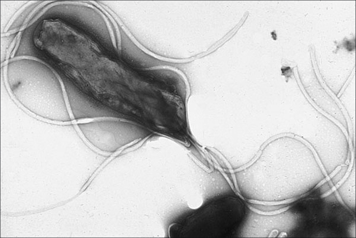

### Learning Objectives

* Describe the unique features of each class within the phylum Proteobacteria: Alphaproteobacteria, Betaproteobacteria, Gammaproteobacteria, Deltaproteobacteria, and Epsilonproteobacteria
* Give an example of a bacterium in each class of Proteobacteria

In 1987, the American microbiologist Carl **Woese**{: data-type="term" .no-emphasis} (1928–2012) suggested that a large and diverse group of bacteria that he called “purple bacteria and their relatives” should be defined as a separate phylum within the domain **Bacteria**{: data-type="term" .no-emphasis} based on the similarity of the nucleotide sequences in their genome.[1](#footnote1){: data-type="footnote-link"} This phylum of gram-negative bacteria subsequently received the name **Proteobacteria**{: data-type="term"}. It includes many bacteria that are part of the normal human microbiota as well as many pathogens. The Proteobacteria are further divided into five classes: Alphaproteobacteria, Betaproteobacteria, Gammaproteobacteria, Deltaproteobacteria, and Epsilonproteobacteria ([Appendix D](/m58949){: .target-chapter}).

### Alphaproteobacteria

The first class of Proteobacteria is the **Alphaproteobacteria**{: data-type="term"}. The unifying characteristic of this class is that they are **oligotroph**{: data-type="term"}s, organisms capable of living in low-nutrient environments such as deep oceanic sediments, glacial ice, or deep undersurface soil.

Among the Alphaproteobacteria are two taxa, chlamydias and rickettsias, that are **obligate intracellular pathogen**{: data-type="term"}s, meaning that part of their life cycle must occur inside other cells called host cells. When not growing inside a host cell, ***Chlamydia***{: data-type="term" .no-emphasis} and ***Rickettsia***{: data-type="term" .no-emphasis} are metabolically inactive outside of the host cell. They cannot synthesize their own adenosine triphosphate (ATP), and, therefore, rely on cells for their energy needs.

*Rickettsia* spp. include a number of serious human pathogens. For example, ***R. rickettsii***{: data-type="term" .no-emphasis} causes **Rocky Mountain spotted fever**{: data-type="term" .no-emphasis}, a life-threatening form of meningoencephalitis (inflammation of the membranes that wrap the brain). *R. rickettsii* infects ticks and can be transmitted to humans via a bite from an infected tick ([\[link\]](#OSC_Microbio_04_02_RRicketsii)).

 "){: #OSC_Microbio_04_02_RRicketsii}

Another species of *Rickettsia*, *R.* *prowazekii*, is spread by lice. It causes **epidemic typhus**{: data-type="term" .no-emphasis}, a severe infectious disease common during warfare and mass migrations of people. *R. prowazekii* infects human endothelium cells, causing inflammation of the inner lining of blood vessels, high fever, abdominal pain, and sometimes delirium. A relative, *R. typhi*, causes a less severe disease known as murine or endemic typhus, which is still observed in the southwestern United States during warm seasons.

*Chlamydia* is another taxon of the Alphaproteobacteria. Members of this genus are gram-negative, obligate intracellular pathogens that are extremely resistant to the cellular defenses, giving them the ability to spread from host to host rapidly via elementary bodies. The metabolically and reproductively inactive **elementary bodies**{: data-type="term"} are the endospore-like form of intracellular bacteria that enter an epithelial cell, where they become active. [\[link\]](#OSC_Microbio_04_02_Chlamydia) illustrates the life cycle of *Chlamydia*.

*C. trachomatis* is a human pathogen that causes **trachoma**{: data-type="term" .no-emphasis}, a disease of the eyes, often leading to blindness. *C. trachomatis* also causes the sexually transmitted disease **lymphogranuloma venereum**{: data-type="term" .no-emphasis} (LGV). This disease is often mildly symptomatic, manifesting as regional lymph node swelling, or it may be asymptomatic, but it is extremely contagious and is common on college campuses.

[\[link\]](#fs-id1172100936505) summarizes the characteristics of important genera of Alphaproteobacteria.

 "){: #OSC_Microbio_04_02_Chlamydia}

<table summary="Table titled Class Alphaproteobacteria. Three columns: Genus, Microscopic Morphology and Unique Characteristics. Genus Agrobacterium: gram-negative bacillus; characteristics: plant pathogen with one species, A. tumefaciens, that causes tumors in plants. Genus Bartonella: gram-negative, pleomorphic, flagellated coccobacllus; characteristics: facultative intracellular bacteria, transmitted by lice and fleas, cause trench fever and cat scratch disease in humans. Genus Brucella: gram-negative, small, flagellated coccobacillus; charactersitics: facultative intracellular bacteria, transmitted by contaminated milk from infected cows, cause brucellosis in cattle and humans. Genus Caulobacter: gram-negative bacillus; characteristics: us ed in studies on cellular adaptation and differentiation because of its peculiar life cycle (during cell division, forms &#x201C;swarm&#x201D; cells and &#x201C;stalked&#x201D; cells). Genus chlamydia: Gram-negative, coccoid or ovoid bacterium; characteristics: Obligatory intracellular bacteria; some cause chlamydia, trachoma, and pneumonia. Genus Coxiella: Small, gram-negative bacillus; characteristics: Obligatory intracellular bacteria; cause Q fever; potential for use as biological weapon. Genus Ehrlichia: very small, gram-negative, coccoid or ovoid bacteria; characteristics: Obligatory intracellular bacteria; can be transported from cell to cell; transmitted by ticks; cause ehrlichiosis (destruction of white blood cells and inflammation) in humans and dogs. Genus Hyphomicrogium: Gram-negative bacilli; grows from a stalk;  characteristics Similar to Caulobacter. Genus Methylocystis is Gram-negative, coccoid or short bacilli; characteristics: nitrogen-fixing aerobic bacteria. Genus Rhizobium: Gram-negative, rectangular bacilli with rounded ends forming clusters; characteristics: Nitrogen-fixing bacteria that live in soil and form symbiotic relationship with roots of legumes (e.g., clover, alfalfa, and beans). Genus Rickettsia: Gram-negative, highly pleomorphic bacteria (may be cocci, rods, or threads); characteristics: Obligate intracellular bacteria; transmitted by ticks; may cause Rocky Mountain spotted fever and typhus." class="span-all"><thead>
<tr>
<th colspan="3" data-align="center">Class Alphaproteobacteria</th>
</tr>
<tr valign="top">
<th data-valign="top" data-align="center">Genus</th>
<th data-valign="top" data-align="center">Microscopic Morphology</th>
<th data-valign="top" data-align="center">Unique Characteristics</th>
</tr>
</thead><tbody>
<tr valign="top">
<td data-valign="top" data-align="left"><strong data-type="term" class="no-emphasis"><em>Agrobacterium</em></strong></td>
<td data-valign="top" data-align="left">Gram-negative bacillus</td>
<td data-valign="top" data-align="left">Plant pathogen; one species, <em>A. tumefaciens</em>, causes tumors in plants</td>
</tr>
<tr valign="top">
<td data-valign="top" data-align="left"><strong data-type="term" class="no-emphasis"><em>Bartonella</em></strong></td>
<td data-valign="top" data-align="left">Gram-negative, pleomorphic, flagellated coccobacillus</td>
<td data-valign="top" data-align="left">Facultative intracellular bacteria, transmitted by lice and fleas, cause trench fever and cat scratch disease in humans</td>
</tr>
<tr valign="top">
<td data-valign="top" data-align="left"><strong data-type="term" class="no-emphasis"><em>Brucella</em></strong></td>
<td data-valign="top" data-align="left">Gram-negative, small, flagellated coccobacillus</td>
<td data-valign="top" data-align="left">Facultative intracellular bacteria, transmitted by contaminated milk from infected cows, cause brucellosis in cattle and humans</td>
</tr>
<tr valign="top">
<td data-valign="top" data-align="left"><strong data-type="term" class="no-emphasis"><em>Caulobacter</em></strong></td>
<td data-valign="top" data-align="left">Gram-negative bacillus</td>
<td data-valign="top" data-align="left">Used in studies on cellular adaptation and differentiation because of its peculiar life cycle (during cell division, forms “swarm” cells and “stalked” cells)</td>
</tr>
<tr valign="top">
<td data-valign="top" data-align="left"><strong data-type="term" class="no-emphasis"><em>Chlamydia</em></strong></td>
<td data-valign="top" data-align="left">Gram-negative, coccoid or ovoid bacterium</td>
<td data-valign="top" data-align="left">Obligatory intracellular bacteria; some cause chlamydia, trachoma, and pneumonia</td>
</tr>
<tr valign="top">
<td data-valign="top" data-align="left"><strong data-type="term" class="no-emphasis"><em>Coxiella</em></strong></td>
<td data-valign="top" data-align="left">Small, gram-negative bacillus</td>
<td data-valign="top" data-align="left">Obligatory intracellular bacteria; cause Q fever; potential for use as biological weapon</td>
</tr>
<tr valign="top">
<td data-valign="top" data-align="left"><strong data-type="term" class="no-emphasis"><em>Ehrlichia</em></strong></td>
<td data-valign="top" data-align="left">Very small, gram-negative, coccoid or ovoid bacteria</td>
<td data-valign="top" data-align="left">Obligatory intracellular bacteria; can be transported from cell to cell; transmitted by ticks; cause ehrlichiosis (destruction of white blood cells and inflammation) in humans and dogs</td>
</tr>
<tr valign="top">
<td data-valign="top" data-align="left"><strong data-type="term" class="no-emphasis"><em>Hyphomicrobium</em></strong></td>
<td data-valign="top" data-align="left">Gram-negative bacilli; grows from a stalk</td>
<td data-valign="top" data-align="left">Similar to <em>Caulobacter</em></td>
</tr>
<tr valign="top">
<td data-valign="top" data-align="left"><strong data-type="term" class="no-emphasis"><em>Methylocystis</em></strong></td>
<td data-valign="top" data-align="left">Gram-negative, coccoid or short bacilli</td>
<td data-valign="top" data-align="left">Nitrogen-fixing aerobic bacteria</td>
</tr>
<tr valign="top">
<td data-valign="top" data-align="left"><strong data-type="term" class="no-emphasis"><em>Rhizobium</em></strong></td>
<td data-valign="top" data-align="left">Gram-negative, rectangular bacilli with rounded ends forming clusters</td>
<td data-valign="top" data-align="left">Nitrogen-fixing bacteria that live in soil and form symbiotic relationship with roots of legumes (e.g., clover, alfalfa, and beans)</td>
</tr>
<tr valign="top">
<td data-valign="top" data-align="left"><strong data-type="term" class="no-emphasis"><em>Rickettsia</em></strong></td>
<td data-valign="top" data-align="left">Gram-negative, highly pleomorphic bacteria (may be cocci, rods, or threads)</td>
<td data-valign="top" data-align="left">Obligate intracellular bacteria; transmitted by ticks; may cause Rocky Mountain spotted fever and typhus</td>
</tr>
</tbody></table>

* What characteristic do all Alphaproteobacteria share?
{: data-bullet-style="bullet"}

### Betaproteobacteria

Unlike Alphaproteobacteria, which survive on a minimal amount of nutrients, the class **Betaproteobacteria**{: data-type="term"} are **eutroph**{: data-type="term"}s (or copiotrophs), meaning that they require a copious amount of organic nutrients. Betaproteobacteria often grow between aerobic and anaerobic areas (e.g., in mammalian intestines). Some genera include species that are human pathogens, able to cause severe, sometimes life-threatening disease. The genus ***Neisseria***{: data-type="term" .no-emphasis}, for example, includes the bacteria *N. gonorrhoeae,* the causative agent of the STI **gonorrhea**{: data-type="term" .no-emphasis}, and *N. meningitides*, the causative agent of **bacterial meningitis**{: data-type="term" .no-emphasis}.

*Neisseria* are cocci that live on mucosal surfaces of the human body. They are fastidious, or difficult to culture, and they require high levels of moisture, nutrient supplements, and carbon dioxide. Also, *Neisseria* are microaerophilic, meaning that they require low levels of oxygen. For optimal growth and for the purposes of identification, *Neisseria* spp. are grown on chocolate agar (i.e., agar supplemented by partially hemolyzed red blood cells). Their characteristic pattern of growth in culture is diplococcal: pairs of cells resembling coffee beans ([\[link\]](#OSC_Microbio_04_02_Neisseria)).

 "){: #OSC_Microbio_04_02_Neisseria}

The pathogen responsible for **pertussis**{: data-type="term" .no-emphasis} (**whooping cough**{: data-type="term" .no-emphasis}) is also a member of Betaproteobacteria. The bacterium ***Bordetella pertussis***{: data-type="term" .no-emphasis}, from the order **Burkholderiales**{: data-type="term" .no-emphasis}, produces several toxins that paralyze the movement of cilia in the human respiratory tract and directly damage cells of the respiratory tract, causing a severe cough.

[\[link\]](#fs-id1172100884064) summarizes the characteristics of important genera of Betaproteobacteria.

<table summary="Table titled Class Betaproteobacteria. Three columns: Genus, Microscopic Morphology and Unique Characteristics. Genus Bordetella: A small, gram-negative coccobacillus; characteristics: Aerobic, very fastidious; B. pertussis causes pertussis (whooping cough). Genus Burkholderia:  is Gram-negative bacillus; characteritics: Aerobic, aquatic, cause diseases in horses and humans (especially patients with cystic fibrosis); agents of nosocomial infections. Genus Leptothrix: Gram-negative, sheathed, filamentous bacillus; characteristics: Aquatic; oxidize iron and manganese; can live in wastewater treatment plants and clog pipes. Genus Neisseria: Gram-negative, coffee bean-shaped coccus forming pairs; characteristics: Require moisture and high concentration of carbon dioxide; oxidase positive, grow on chocolate agar; pathogenic species cause gonorrhea and meningitis. Genus Thiobacillus: Gram-negative bacillus; charactersitics: Thermophilic, acidophilic, strictly aerobic bacteria; oxidize iron and sulfur." class="span-all"><thead>
<tr>
<th colspan="3" data-align="center">Class Betaproteobacteria</th>
</tr>
<tr valign="top">
<th data-valign="top" data-align="center">Example Genus</th>
<th data-valign="top" data-align="center">Microscopic Morphology</th>
<th data-valign="top" data-align="center">Unique Characteristics</th>
</tr>
</thead><tbody>
<tr valign="top">
<td data-valign="top" data-align="left"><strong data-type="term" class="no-emphasis"><em>Bordetella</em></strong></td>
<td data-valign="top" data-align="left">A small, gram-negative coccobacillus</td>
<td data-valign="top" data-align="left">Aerobic, very fastidious; <em>B. pertussis</em> causes pertussis (whooping cough)</td>
</tr>
<tr valign="top">
<td data-valign="top" data-align="left"><strong data-type="term" class="no-emphasis"><em>Burkholderia</em></strong></td>
<td data-valign="top" data-align="left">Gram-negative bacillus</td>
<td data-valign="top" data-align="left">Aerobic, aquatic, cause diseases in horses and humans (especially patients with cystic fibrosis); agents of nosocomial infections</td>
</tr>
<tr valign="top">
<td data-valign="top" data-align="left"><strong data-type="term" class="no-emphasis"><em>Leptothrix</em></strong></td>
<td data-valign="top" data-align="left">Gram-negative, sheathed, filamentous bacillus</td>
<td data-valign="top" data-align="left">Aquatic; oxidize iron and manganese; can live in wastewater treatment plants and clog pipes</td>
</tr>
<tr valign="top">
<td data-valign="top" data-align="left"><strong data-type="term" class="no-emphasis"><em>Neisseria</em></strong></td>
<td data-valign="top" data-align="left">Gram-negative, coffee bean-shaped coccus forming pairs</td>
<td data-valign="top" data-align="left">Require moisture and high concentration of carbon dioxide; oxidase positive, grow on chocolate agar; pathogenic species cause gonorrhea and meningitis</td>
</tr>
<tr valign="top">
<td data-valign="top" data-align="left"><strong data-type="term" class="no-emphasis"><em>Thiobacillus</em></strong></td>
<td data-valign="top" data-align="left">Gram-negative bacillus</td>
<td data-valign="top" data-align="left">Thermophilic, acidophilic, strictly aerobic bacteria; oxidize iron and sulfur</td>
</tr>
</tbody></table>

* What characteristic do all Betaproteobacteria share?
{: data-bullet-style="bullet"}

Part 2

When Marsha finally went to the doctor’s office, the physician listened to her breathing through a stethoscope. He heard some crepitation (a crackling sound) in her lungs, so he ordered a chest radiograph and asked the nurse to collect a sputum sample for microbiological evaluation and cytology. The radiologic evaluation found cavities, opacities, and a particular pattern of distribution of abnormal material ([\[link\]](#OSC_Microbio_04_02_Xray)).

* What are some possible diseases that could be responsible for Marsha’s radiograph results?
{: data-bullet-style="bullet"}

 and &#x201C;caving formation&#x201D; (black arrows) present in the right apical region. (credit: Centers for Disease Control and Prevention)"){: #OSC_Microbio_04_02_Xray}

*Jump to the [next](/m58798#fs-id1172098647956) Clinical Focus box. Go back to the [previous](/m58795#fs-id1172098401810) Clinical Focus box.*

### Gammaproteobacteria

The most diverse class of **gram-negative bacteria**{: data-type="term" .no-emphasis} is **Gammaproteobacteria**{: data-type="term"}, and it includes a number of human pathogens. For example, a large and diverse family, *Pseudomonaceae*, includes the genus ***Pseudomonas***{: data-type="term" .no-emphasis}. Within this genus is the species *P. aeruginosa*, a pathogen responsible for diverse infections in various regions of the body. *P. aeruginosa* is a strictly aerobic, nonfermenting, highly motile bacterium. It often infects wounds and burns, can be the cause of chronic urinary tract infections, and can be an important cause of respiratory infections in patients with cystic fibrosis or patients on mechanical ventilators. Infections by *P. aeruginosa* are often difficult to treat because the bacterium is resistant to many antibiotics and has a remarkable ability to form biofilms. Other representatives of *Pseudomonas* include the fluorescent (glowing) bacterium *P. fluorescens* and the soil bacteria *P. putida*, which is known for its ability to degrade **xenobiotics**{: data-type="term" .no-emphasis} (substances not naturally produced or found in living organisms).

The ***Pasteurellaceae***{: data-type="term" .no-emphasis} also includes several clinically relevant genera and species. This family includes several bacteria that are human and/or animal pathogens. For example, *Pasteurella haemolytica* causes severe pneumonia in sheep and goats. *P. multocida* is a species that can be transmitted from animals to humans through bites, causing infections of the skin and deeper tissues. The genus ***Haemophilus***{: data-type="term" .no-emphasis} contains two human pathogens, *H. influenzae* and *H. ducreyi*. Despite its name, *H. influenzae* does not cause influenza (which is a viral disease). *H. influenzae* can cause both upper and lower respiratory tract infections, including sinusitis, bronchitis, ear infections, and pneumonia. Before the development of effective vaccination, strains of *H. influenzae* were a leading cause of more invasive diseases, like **meningitis**{: data-type="term" .no-emphasis} in children. *H. ducreyi* causes the STI known as **chancroid**{: data-type="term" .no-emphasis}.

The order **Vibrionales**{: data-type="term" .no-emphasis} includes the human pathogen ***Vibrio cholerae***{: data-type="term" .no-emphasis}. This comma-shaped aquatic bacterium thrives in highly alkaline environments like shallow lagoons and sea ports. A toxin produced by *V. cholerae* causes hypersecretion of electrolytes and water in the large intestine, leading to profuse watery diarrhea and dehydration. *V. parahaemolyticus* is also a cause of gastrointestinal disease in humans, whereas *V. vulnificus* causes serious and potentially life-threatening cellulitis (infection of the skin and deeper tissues) and blood-borne infections. Another representative of Vibrionales, *Aliivibrio fischeri*, engages in a symbiotic relationship with squid. The squid provides nutrients for the bacteria to grow and the bacteria produce **bioluminescence**{: data-type="term" .no-emphasis} that protects the squid from predators ([\[link\]](#OSC_Microbio_04_02_vibrionale)).

  Aliivibrio fischeri is a bioluminescent bacterium. (b) A. fischeri colonizes and lives in a mutualistic relationship with the Hawaiian bobtail squid (Euprymna scolopes). (credit a: modification of work by American Society for Microbiology; credit b: modification of work by Margaret McFall-Ngai)"){: #OSC_Microbio_04_02_vibrionale}

The genus ***Legionella***{: data-type="term" .no-emphasis} also belongs to the Gammaproteobacteria. *L. pneumophila,* the pathogen responsible for **Legionnaires disease**{: data-type="term" .no-emphasis}, is an aquatic bacterium that tends to inhabit pools of warm water, such as those found in the tanks of air conditioning units in large buildings ([\[link\]](#OSC_Microbio_04_02_Legionella)). Because the bacteria can spread in aerosols, outbreaks of Legionnaires disease often affect residents of a building in which the water has become contaminated with *Legionella.* In fact, these bacteria derive their name from the first known outbreak of Legionnaires disease, which occurred in a hotel hosting an American Legion veterans’ association convention in Philadelphia in 1976.

  Legionella pneumophila, the causative agent of Legionnaires disease, thrives in warm water. (b) Outbreaks of Legionnaires disease often originate in the air conditioning units of large buildings when water in or near the system becomes contaminated with L. pneumophila. (credit a: modification of work by Centers for Disease Control and Prevention)"){: #OSC_Microbio_04_02_Legionella}

**Enterobacteriaceae**{: data-type="term" .no-emphasis} is a large family of **enteric**{: data-type="term"} (intestinal) bacteria belonging to the **Gammaproteobacteria**{: data-type="term" .no-emphasis}. They are facultative anaerobes and are able to ferment carbohydrates. Within this family, microbiologists recognize two distinct categories. The first category is called the coliforms, after its prototypical bacterium species, ***Escherichia coli***{: data-type="term" .no-emphasis}. **Coliforms**{: data-type="term" .no-emphasis} are able to ferment lactose completely (i.e., with the production of acid and gas). The second category, **noncoliforms**{: data-type="term" .no-emphasis}, either cannot ferment lactose or can only ferment it incompletely (producing either acid or gas, but not both). The noncoliforms include some notable human pathogens, such as *Salmonella* spp*., Shigella* spp*.,* and ***Yersinia pestis***{: data-type="term" .no-emphasis}.

*E. coli* has been perhaps the most studied bacterium since it was first described in 1886 by Theodor Escherich (1857–1911). Many strains of E. coli are in mutualistic relationships with humans. However, some strains produce a potentially deadly toxin called Shiga toxin. Shiga toxin is one of the most potent bacterial toxins identified. Upon entering target cells, Shiga toxin interacts with ribosomes, stopping protein synthesis. Lack of protein synthesis leads to cellular death and hemorrhagic colitis, characterized by inflammation of intestinal tract and bloody diarrhea. In the most severe cases, patients can develop a deadly hemolytic uremic syndrome. Other E. coli strains may cause traveler’s diarrhea, a less severe but very widespread disease.

The genus ***Salmonella***{: data-type="term" .no-emphasis}, which belongs to the noncoliform group of *Enterobacteriaceae*, is interesting in that there is still no consensus about how many species it includes. Scientists have reclassified many of the groups they once thought to be species as **serotypes**{: data-type="term"} (also called **serovars**{: data-type="term" .no-emphasis}), which are strains or variations of the same species of bacteria. Their classification is based on patterns of reactivity by animal antisera against molecules on the surface of the bacterial cells. A number of serotypes of *Salmonella* can cause **salmonellosis**{: data-type="term" .no-emphasis}, characterized by inflammation of the small and the large intestine, accompanied by fever, vomiting, and diarrhea. The species *S. enterobacterica* (serovar *typhi*) causes **typhoid fever**{: data-type="term" .no-emphasis}, with symptoms including fever, abdominal pain, and skin rashes ([\[link\]](#OSC_Microbio_04_02_Salmonella)).

 "){: #OSC_Microbio_04_02_Salmonella}

[\[link\]](#fs-id1172100940519) summarizes the characteristics of important genera of Gammaproteobacteria.

<table summary="Table titled Class Gammaproteobacteria. Three columns: Genus, Microscopic Morphology and Unique Characteristics. Beggiatoa: Gram-negative bacteria; disc-shaped or cylindrical; characteristics: Aquatic, live in water with high content of hydrogen disulfide; can cause problems for sewage treatment. Genus Enterobacter: Gram-negative bacillus; characteristics: Facultative anaerobe; cause urinary and respiratory tract infections in hospitalized patients; implicated in the pathogenesis of obesity. Genus Erwinia: Gram-negative bacillus. Characteristics: Plant pathogen causing leaf spots and discoloration; may digest cellulose; prefer relatively low temperatures (25&#x2013;30 &#xB0;C). Genus Escherichia: Gram-negative bacillus; characteristics: Facultative anaerobe; inhabit the gastrointestinal tract of warm-blooded animals; some strains are mutualists, producing vitamin K; others, like serotype E. coli O157:H7, are pathogens; E. coli has been a model organism for many studies in genetics and molecular biology. Genus Hemophilus: Gram-negative bacillus; characteristics: Pleomorphic, may appear as coccobacillus, aerobe, or facultative anaerobe; grow on blood agar; pathogenic species can cause respiratory infections, chancroid, and other diseases. Genus Klebsiella: Gram-negative bacillus; appears rounder and thicker than other members of the Enterobacteriaceae. Characteristics: Facultative anaerobe, encapsulated, nonmotile; pathogenic species may cause pneumonia, especially in people with alcoholism. Genus Legionella: Gram-negative bacillus. Characteristics: Fastidious, grow on charcoal-buffered yeast extract; L. pneumophila causes Legionnaires disease. Genus Methylomonas: Gram-negative bacillus. Characteristics: Use methane as source of carbon and energy. Genus Proteus: Gram-negative bacillus (pleomorphic). Characteristics: Common inhabitants of the human gastrointestinal tract; motile; produce urease; opportunistic pathogens; may cause urinary tract infections and sepsis. Genus Pseudomonas: Gram-negative bacillus. Characteristics: Aerobic; versatile; produce yellow and blue pigments, making them appear green in culture; opportunistic, antibiotic-resistant pathogens may cause wound infections, hospital-acquired infections, and secondary infections in patients with cystic fibrosis. Genus Serratia: Gram-negative bacillus. Characteristics: Motile; may produce red pigment; opportunistic pathogens responsible for a large number of hospital-acquired infections. Genus Shigella: Gram-negative bacillus. Characteristics: Nonmotile; dangerously pathogenic; produce Shiga toxin, which can destroy cells of the gastrointestinal tract; can cause dysentery. Genus Vibrio: Gram-negative, comma- or curved rod-shaped bacteria. Characteristics: Inhabit seawater; flagellated, motile; may produce toxin that causes hypersecretion of water and electrolytes in the gastrointestinal tract; some species may cause serious wound infections. Genus Yersinia: Gram-negative bacillus. Characteristics: Carried by rodents; human pathogens; Y. pestis causes bubonic plague and pneumonic plague; Y. enterocolitica can be a pathogen causing diarrhea in humans." class="span-all"><thead>
<tr>
<th colspan="3" data-align="center">Class Gammaproteobacteria</th>
</tr>
<tr valign="top">
<th data-valign="top" data-align="center">Example Genus</th>
<th data-valign="top" data-align="center">Microscopic Morphology</th>
<th data-valign="top" data-align="center">Unique Characteristics</th>
</tr>
</thead><tbody>
<tr valign="top">
<td data-valign="top" data-align="left"><strong data-type="term" class="no-emphasis"><em>Beggiatoa</em></strong></td>
<td data-valign="top" data-align="left">Gram-negative bacteria; disc-shaped or cylindrical</td>
<td data-valign="top" data-align="left">Aquatic, live in water with high content of hydrogen disulfide; can cause problems for sewage treatment</td>
</tr>
<tr valign="top">
<td data-valign="top" data-align="left"><strong data-type="term" class="no-emphasis"><em>Enterobacter</em></strong></td>
<td data-valign="top" data-align="left">Gram-negative bacillus</td>
<td data-valign="top" data-align="left">Facultative anaerobe; cause urinary and respiratory tract infections in hospitalized patients; implicated in the pathogenesis of obesity</td>
</tr>
<tr valign="top">
<td data-valign="top" data-align="left"><strong data-type="term" class="no-emphasis"><em>Erwinia</em></strong></td>
<td data-valign="top" data-align="left">Gram-negative bacillus</td>
<td data-valign="top" data-align="left">Plant pathogen causing leaf spots and discoloration; may digest cellulose; prefer relatively low temperatures (25–30 °C)</td>
</tr>
<tr valign="top">
<td data-valign="top" data-align="left"><strong data-type="term" class="no-emphasis"><em>Escherichia</em></strong></td>
<td data-valign="top" data-align="left">Gram-negative bacillus</td>
<td data-valign="top" data-align="left">Facultative anaerobe; inhabit the gastrointestinal tract of warm-blooded animals; some strains are mutualists, producing vitamin K; others, like serotype <em>E. coli</em> O157:H7, are pathogens; <em>E. coli</em> has been a model organism for many studies in genetics and molecular biology</td>
</tr>
<tr valign="top">
<td data-valign="top" data-align="left"><strong data-type="term" class="no-emphasis"><em>Hemophilus</em></strong></td>
<td data-valign="top" data-align="left">Gram-negative bacillus</td>
<td data-valign="top" data-align="left">Pleomorphic, may appear as coccobacillus, aerobe, or facultative anaerobe; grow on blood agar; pathogenic species can cause respiratory infections, chancroid, and other diseases</td>
</tr>
<tr valign="top">
<td data-valign="top" data-align="left"><strong data-type="term" class="no-emphasis"><em>Klebsiella</em></strong></td>
<td data-valign="top" data-align="left">Gram-negative bacillus; appears rounder and thicker than other members of <em>Enterobacteriaceae</em></td>
<td data-valign="top" data-align="left">Facultative anaerobe, encapsulated, nonmotile; pathogenic species may cause pneumonia, especially in people with alcoholism</td>
</tr>
<tr valign="top">
<td data-valign="top" data-align="left"><strong data-type="term" class="no-emphasis"><em>Legionella</em></strong></td>
<td data-valign="top" data-align="left">Gram-negative bacillus</td>
<td data-valign="top" data-align="left">Fastidious, grow on charcoal-buffered yeast extract; <em>L. pneumophila</em> causes Legionnaires disease</td>
</tr>
<tr valign="top">
<td data-valign="top" data-align="left"><strong data-type="term" class="no-emphasis"><em>Methylomonas</em></strong></td>
<td data-valign="top" data-align="left">Gram-negative bacillus</td>
<td data-valign="top" data-align="left">Use methane as source of carbon and energy</td>
</tr>
<tr valign="top">
<td data-valign="top" data-align="left"><strong data-type="term" class="no-emphasis"><em>Proteus</em></strong></td>
<td data-valign="top" data-align="left">Gram-negative bacillus (pleomorphic)</td>
<td data-valign="top" data-align="left">Common inhabitants of the human gastrointestinal tract; motile; produce urease; opportunistic pathogens; may cause urinary tract infections and sepsis</td>
</tr>
<tr valign="top">
<td data-valign="top" data-align="left"><strong data-type="term" class="no-emphasis"><em>Pseudomonas</em></strong></td>
<td data-valign="top" data-align="left">Gram-negative bacillus</td>
<td data-valign="top" data-align="left">Aerobic; versatile; produce yellow and blue pigments, making them appear green in culture; opportunistic, antibiotic-resistant pathogens may cause wound infections, hospital-acquired infections, and secondary infections in patients with cystic fibrosis</td>
</tr>
<tr valign="top">
<td data-valign="top" data-align="left"><strong data-type="term" class="no-emphasis"><em>Serratia</em></strong></td>
<td data-valign="top" data-align="left">Gram-negative bacillus</td>
<td data-valign="top" data-align="left">Motile; may produce red pigment; opportunistic pathogens responsible for a large number of hospital-acquired infections</td>
</tr>
<tr valign="top">
<td data-valign="top" data-align="left"><strong data-type="term" class="no-emphasis"><em>Shigella</em></strong></td>
<td data-valign="top" data-align="left">Gram-negative bacillus</td>
<td data-valign="top" data-align="left">Nonmotile; dangerously pathogenic; produce Shiga toxin, which can destroy cells of the gastrointestinal tract; can cause dysentery</td>
</tr>
<tr valign="top">
<td data-valign="top" data-align="left"><strong data-type="term" class="no-emphasis"><em>Vibrio</em></strong></td>
<td data-valign="top" data-align="left">Gram-negative, comma- or curved rod-shaped bacteria</td>
<td data-valign="top" data-align="left">Inhabit seawater; flagellated, motile; may produce toxin that causes hypersecretion of water and electrolytes in the gastrointestinal tract; some species may cause serious wound infections</td>
</tr>
<tr valign="top">
<td data-valign="top" data-align="left"><strong data-type="term" class="no-emphasis"><em>Yersinia</em></strong></td>
<td data-valign="top" data-align="left">Gram-negative bacillus</td>
<td data-valign="top" data-align="left">Carried by rodents; human pathogens; <em>Y. pestis</em> causes bubonic plague and pneumonic plague; <em>Y. enterocolitica</em> can be a pathogen causing diarrhea in humans</td>
</tr>
</tbody></table>

* List two families of Gammaproteobacteria.
{: data-bullet-style="bullet"}

### Deltaproteobacteria

The **Deltaproteobacteria**{: data-type="term"} is a small class of gram-negative **Proteobacteria**{: data-type="term" .no-emphasis} that includes **sulfate-reducing bacteria**{: data-type="term" .no-emphasis} (SRBs), so named because they use sulfate as the final electron acceptor in the electron transport chain. Few SRBs are pathogenic. However, the SRB *Desulfovibrio orale* is associated with periodontal disease (disease of the gums).

Deltaproteobacteria also includes the genus ***Bdellovibrio***{: data-type="term" .no-emphasis}, species of which are parasites of other gram-negative bacteria. *Bdellovibrio* invades the cells of the host bacterium, positioning itself in the periplasm, the space between the plasma membrane and the cell wall, feeding on the host’s proteins and polysaccharides. The infection is lethal for the host cells.

Another type of Deltaproteobacteria, **myxobacteria**{: data-type="term" .no-emphasis}, lives in the soil, scavenging inorganic compounds. Motile and highly social, they interact with other bacteria within and outside their own group. They can form multicellular, macroscopic “**fruiting bodies**{: data-type="term" .no-emphasis}” ([\[link\]](#OSC_Microbio_04_02_Myxobac)), structures that are still being studied by biologists and bacterial ecologists.[2](#footnote2){: data-type="footnote-link"} These bacteria can also form metabolically inactive **myxospores**{: data-type="term" .no-emphasis}.

 "){: #OSC_Microbio_04_02_Myxobac}

[\[link\]](#fs-id1172100990327) summarizes the characteristics of several important genera of Deltaproteobacteria.

<table summary="Table titled Class Deltaproteobacteria. Three columns: Genus, Microscopic Morphology and Unique Characteristics. Genus Bdellovibrio: Gram-negative, comma-shaped rod. Characteristics: Obligate aerobes; motile; parasitic (infecting other bacteria). Genus Desulfovibrio (formerly Desufuromonas): Gram-negative, comma-shaped rod. Characteristics: Reduce sulfur; can be used for removal of toxic and radioactive waste. Genus Myxobacterium: Gram-negative, coccoid bacteria forming colonies (swarms). Characteristics: Live in soil; can move by gliding; used as a model organism for studies of intercellular communication (signaling)" class="span-all"><thead>
<tr>
<th colspan="3" data-align="center">Class Deltaproteobacteria</th>
</tr>
<tr valign="top">
<th data-valign="top" data-align="center">Genus</th>
<th data-valign="top" data-align="center">Microscopic Morphology</th>
<th data-valign="top" data-align="center">Unique characteristics</th>
</tr>
</thead><tbody>
<tr valign="top">
<td data-valign="top" data-align="left"><strong data-type="term" class="no-emphasis"><em>Bdellovibrio</em></strong></td>
<td data-valign="top" data-align="left">Gram-negative, comma-shaped rod</td>
<td data-valign="top" data-align="left">Obligate aerobes; motile; parasitic (infecting other bacteria)</td>
</tr>
<tr valign="top">
<td data-valign="top" data-align="left"><strong data-type="term" class="no-emphasis"><em>Desulfovibrio</em></strong> (formerly <em>Desufuromonas</em>)</td>
<td data-valign="top" data-align="left">Gram-negative, comma-shaped rod</td>
<td data-valign="top" data-align="left">Reduce sulfur; can be used for removal of toxic and radioactive waste</td>
</tr>
<tr valign="top">
<td data-valign="top" data-align="left"><strong data-type="term" class="no-emphasis"><em>Myxobacterium</em></strong></td>
<td data-valign="top" data-align="left">Gram-negative, coccoid bacteria forming colonies (swarms)</td>
<td data-valign="top" data-align="left">Live in soil; can move by gliding; used as a model organism for studies of intercellular communication (signaling)</td>
</tr>
</tbody></table>

* What type of Deltaproteobacteria forms fruiting bodies?
{: data-bullet-style="bullet"}

### Epsilonproteobacteria

The smallest class of **Proteobacteria**{: data-type="term" .no-emphasis} is **Epsilonproteobacteria**{: data-type="term"}, which are gram-negative microaerophilic bacteria (meaning they only require small amounts of oxygen in their environment). Two clinically relevant genera of Epsilonproteobacteria are ***Campylobacter***{: data-type="term" .no-emphasis} and ***Helicobacter***{: data-type="term" .no-emphasis}, both of which include human pathogens. *Campylobacter* can cause food poisoning that manifests as severe enteritis (inflammation in the small intestine). This condition, caused by the species *C. jejuni*, is rather common in developed countries, usually because of eating contaminated poultry products. Chickens often harbor *C. jejuni* in their gastrointestinal tract and feces, and their meat can become contaminated during processing.

Within the genus *Helicobacter,* the helical, flagellated bacterium *H. pylori* has been identified as a beneficial member of the stomach microbiota, but it is also the most common cause of chronic gastritis and ulcers of the stomach and duodenum ([\[link\]](#OSC_Microbio_04_02_Hpylori)). Studies have also shown that *H. pylori* is linked to stomach cancer.[3](#footnote3){: data-type="footnote-link"} *H. pylori* is somewhat unusual in its ability to survive in the highly acidic environment of the stomach. It produces urease and other enzymes that modify its environment to make it less acidic.

 {: #OSC_Microbio_04_02_Hpylori}

[\[link\]](#fs-id1172098273378) summarizes the characteristics of the most clinically relevant genera of Epsilonproteobacteria.

<table summary="Table titled Class Epsilonproteobacteria. Three columns: Genus, Microscopic Morphology and Unique Characteristics. Genus Campylobacter: Gram-negative, spiral-shaped rod. Characteristics: Aerobic (microaerophilic); often infects chickens; may infect humans via undercooked meat, causing severe enteritis. Genus Helicobacter: Gram-negative, spiral-shaped rod. Characteristics: Aerobic (microaerophilic) bacterium; can damage the inner lining of the stomach, causing chronic gastritis, peptic ulcers, and stomach cancer" class="span-all"><thead>
<tr>
<th colspan="3" data-align="center">Class Epsilonproteobacteria</th>
</tr>
<tr valign="top">
<th data-valign="top" data-align="center">Example Genus</th>
<th data-valign="top" data-align="center">Microscopic Morphology</th>
<th data-valign="top" data-align="center">Unique Characteristics</th>
</tr>
</thead><tbody>
<tr valign="top">
<td data-valign="top" data-align="left"><strong data-type="term" class="no-emphasis"><em>Campylobacter</em></strong></td>
<td data-valign="top" data-align="left">Gram-negative, spiral-shaped rod</td>
<td data-valign="top" data-align="left">Aerobic (microaerophilic); often infects chickens; may infect humans via undercooked meat, causing severe enteritis</td>
</tr>
<tr valign="top">
<td data-valign="top" data-align="left"><strong data-type="term" class="no-emphasis"><em>Helicobacter</em></strong></td>
<td data-valign="top" data-align="left">Gram-negative, spiral-shaped rod</td>
<td data-valign="top" data-align="left">Aerobic (microaerophilic) bacterium; can damage the inner lining of the stomach, causing chronic gastritis, peptic ulcers, and stomach cancer</td>
</tr>
</tbody></table>

* Name two Epsilonproteobacteria that cause gastrointestinal disorders.
{: data-bullet-style="bullet"}

### Key Concepts and Summary

* **Proteobacteria** is a phylum of gram-negative bacteria discovered by Carl Woese in the 1980s based on nucleotide sequence homology.
* Proteobacteria are further classified into the classes alpha-, beta-, gamma-, delta- and epsilonproteobacteria, each class having separate orders, families, genera, and species.
* **Alphaproteobacteria** are **oligotrophs**. The taxa chlamydias and rickettsias are **obligate intracellular pathogens,** feeding on cells of host organisms; they are metabolically inactive outside of the host cell. Some Alphaproteobacteria can convert atmospheric nitrogen to nitrites, making nitrogen usable by other forms of life.
* **Betaproteobacteria** are **eutrophs**. They include human pathogens of the genus *Neisseria* and the species *Bordetella pertussis*.
* **Gammaproteobacteria** are the largest and the most diverse group of Proteobacteria. Many are human pathogens that are aerobes or facultative anaerobes. Some Gammaproteobacteria are **enteric** bacteria that may be coliform or noncoliform. *Escherichia coli*, a member of Gammaproteobacteria, is perhaps the most studied bacterium.
* **Deltaproteobacteria** make up a small group able to reduce sulfate or elemental sulfur. Some are scavengers and form myxospores, with multicellular fruiting bodies.
* **Epsilonproteobacteria** make up the smallest group of Proteobacteria. The genera *Campylobacter* and *Helicobacter* are human pathogens.
{: data-bullet-style="bullet"}

### Multiple Choice

Which of the following describes Proteobacteria in domain Bacteria?

1.  phylum
2.  class
3.  species
4.  genus
{: type="A"}

A

All Alphaproteobacteria are which of the following?

1.  oligotrophs
2.  intracellular
3.  pathogenic
4.  all of the above
5.  none of the above
{: type="A"}

A

Class Betaproteobacteria includes all but which of the following genera?

1.  *Neisseria*.
2.  *Bordetella*.
3.  *Leptothrix*.
4.  *Campylobacter*.
{: type="A"}

D

*Haemophilus influenzae* is a common cause of which of the following?

1.  influenza
2.  dysentery
3.  upper respiratory tract infections
4.  hemophilia
{: type="A"}

C

### Fill in the Blank

Rickettsias are \_\_\_\_\_\_\_\_ intracellular bacteria.

obligate

The species \_\_\_\_\_\_\_\_, which belongs to Epsilonproteobacteria, causes peptic ulcers of the stomach and duodenum.

*Helicobacter pylori*

The genus *Salmonella* belongs to the class \_\_\_\_\_\_\_\_ and includes pathogens that cause salmonellosis and typhoid fever.

Gammaproteobacteria

### Short Answer

What is the metabolic difference between coliforms and noncoliforms? Which category contains several species of intestinal pathogens?

Why are *Mycoplasma* and *Chlamydia* classified as obligate intracellular pathogens?

### Critical Thinking

The cell shown is found in the human stomach and is now known to cause peptic ulcers. What is the name of this bacterium?

"){: #OSC_Microbio_04_02_ArtConn1_img}

### Footnotes
{: data-type="footnote-refs-title"}

* {: data-type="footnote-ref" #footnote1} [1](#footnote-ref1){: data-type="footnote-ref-link"} C.R. Woese. “Bacterial Evolution.” *Microbiological Review* 51 no. 2 (1987):221–271.
* {: data-type="footnote-ref" #footnote2} [2](#footnote-ref2){: data-type="footnote-ref-link"} H. Reichenbach. “Myxobacteria, Producers of Novel Bioactive Substances.” *Journal of Industrial Microbiology &amp; Biotechnology* 27 no. 3 (2001):149–156.
* {: data-type="footnote-ref" #footnote3} [3](#footnote-ref3){: data-type="footnote-ref-link"} S. Suerbaum, P. Michetti. “*Helicobacter pylori* infection.” *New England Journal of Medicine* 347 no. 15 (2002):1175–1186.
{: data-list-type="bulleted" data-bullet-style="none"}

