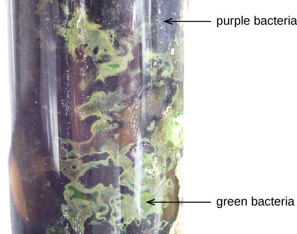

### Learning Objectives

* Describe the unique features of nonproteobacteria gram-negative bacteria
* Give an example of a nonproteobacteria bacterium in each category
* Describe the unique features of phototrophic bacteria
* Identify phototrophic bacteria

The majority of the gram-negative bacteria belong to the phylum Proteobacteria, discussed in the previous section. Those that do not are called the **nonproteobacteria**{: data-type="term" .no-emphasis}. In this section, we will describe three classes of gram-negative nonproteobacteria: the spirochetes, the **CFB group**{: data-type="term" .no-emphasis}, and the **Planctomycetes**{: data-type="term" .no-emphasis}. A diverse group of phototrophic bacteria that includes Proteobacteria and nonproteobacteria will be discussed at the end of this section.

### Spirochetes

Spirochetes are characterized by their long (up to 250 μm), spiral-shaped bodies. Most **spirochetes**{: data-type="term"} are also very thin, which makes it difficult to examine gram-stained preparations under a conventional brightfield microscope. Darkfield fluorescent microscopy is typically used instead. Spirochetes are also difficult or even impossible to culture. They are highly motile, using their axial filament to propel themselves. The **axial filament**{: data-type="term" .no-emphasis} is similar to a flagellum, but it wraps around the cell and runs inside the cell body of a spirochete in the periplasmic space between the outer membrane and the plasma membrane ([\[link\]](#OSC_Microbio_04_03_spirochete)).

 ![A light micrograph of long spiral shaped cells. A TEM cross-section of these shows a circle outlined by a cell membrane. Inside the cell is the cytoplasm and a darker region labeled nucleoid. Outside of this is the periplasmic space and outside of that is an outer membrane. A bulge within the periplasmic space is labeled axial filament. Small dots within the axial filament are labeled endoflagella. An SEM from the original light micrograph shows what looks like a thin rope wound around a thicker rope. The thin rope is labeled axial filament.](../resources/OSC_Microbio_04_03_spirochete.jpg "Spirochetes are typically observed using darkfield microscopy (left). However, electron microscopy (top center, bottom center) provides a more detailed view of their cellular morphology. The flagella found between the inner and outer membranes of spirochetes wrap around the bacterium, causing a twisting motion used for locomotion. (credit &#x201C;spirochetes&#x201D; micrograph: modification of work by Centers for Disease Control and Prevention; credit &#x201C;SEM/TEM&#x201D;: modification of work by Guyard C, Raffel SJ, Schrumpf ME, Dahlstrom E, Sturdevant D, Ricklefs SM, Martens C, Hayes SF, Fischer ER, Hansen BT, Porcella SF, Schwan TG)"){: #OSC_Microbio_04_03_spirochete}

Several genera of spirochetes include human pathogens. For example, the genus ***Treponema***{: data-type="term" .no-emphasis} includes a species *T. pallidum*, which is further classified into four subspecies: *T. pallidum pallidum*, *T. pallidum pertenue, T. pallidum carateum,* and *T. pallidum endemicum*. The subspecies *T. pallidum pallidum* causes the sexually transmitted infection known as **syphilis**{: data-type="term" .no-emphasis}, the third most prevalent sexually transmitted bacterial infection in the United States, after chlamydia and gonorrhea. The other subspecies of *T. pallidum* cause tropical infectious diseases of the skin, bones, and joints.

Another genus of spirochete, ***Borrelia***{: data-type="term" .no-emphasis}, contains a number of pathogenic species. *B. burgdorferi* causes **Lyme disease**{: data-type="term" .no-emphasis}, which is transmitted by several genera of **ticks**{: data-type="term" .no-emphasis} (notably ***Ixodes***{: data-type="term" .no-emphasis} and ***Amblyomma***{: data-type="term" .no-emphasis}) and often produces a “bull’s eye” rash, fever, fatigue, and, sometimes, debilitating arthritis. *B. recurrens* causes a condition known as relapsing fever. [Appendix D](/m58949#fs-id1167662571307) lists the genera, species, and related diseases for spirochetes.

* Why do scientists typically use darkfield fluorescent microscopy to visualize spirochetes?
{: data-bullet-style="bullet"}

### *Cytophaga*, *Fusobacterium*, and *Bacteroides*

The gram-negative nonproteobacteria of the genera ***Cytophaga***{: data-type="term" .no-emphasis}, ***Fusobacterium***{: data-type="term" .no-emphasis}, and ***Bacteroides***{: data-type="term" .no-emphasis} are classified together as a phylum and called the **CFB group**{: data-type="term"}. Although they are phylogenetically diverse, bacteria of the CFB group share some similarities in the sequence of nucleotides in their DNA. They are rod-shaped bacteria adapted to anaerobic environments, such as the tissue of the gums, gut, and rumen of ruminating animals. CFB bacteria are avid fermenters, able to process cellulose in rumen, thus enabling ruminant animals to obtain carbon and energy from grazing.

*Cytophaga* are motile aquatic bacteria that glide. *Fusobacteria* inhabit the human mouth and may cause severe infectious diseases. The largest genus of the CFB group is *Bacteroides*, which includes dozens of species that are prevalent inhabitants of the human large intestine, making up about 30% of the entire gut microbiome ([\[link\]](#OSC_Microbio_04_03_bacteroide)). One gram of human feces contains up to 100 billion *Bacteroides* cells. Most *Bacteroides* are mutualistic. They benefit from nutrients they find in the gut, and humans benefit from their ability to prevent pathogens from colonizing the large intestine. Indeed, when populations of *Bacteroides* are reduced in the gut—as often occurs when a patient takes antibiotics—the gut becomes a more favorable environment for pathogenic bacteria and fungi, which can cause secondary infections.

 "){: #OSC_Microbio_04_03_bacteroide}

Only a few species of *Bacteroides* are pathogenic. *B.* *melaninogenicus*, for example, can cause wound infections in patients with weakened immune systems.

* Why are *Cytophaga*, *Fusobacterium*, and *Bacteroides* classified together as the CFB group?
{: data-bullet-style="bullet"}

### Planctomycetes

The **Planctomycetes**{: data-type="term" .no-emphasis} are found in aquatic environments, inhabiting freshwater, saltwater, and brackish water. Planctomycetes are unusual in that they reproduce by budding, meaning that instead of one maternal cell splitting into two equal daughter cells in the process of binary fission, the mother cell forms a bud that detaches from the mother cell and lives as an independent cell. These so-called swarmer cells are motile and not attached to a surface. However, they will soon differentiate into sessile (immobile) cells with an appendage called a **holdfast**{: data-type="term" .no-emphasis} that allows them to attach to surfaces in the water ([\[link\]](#OSC_Microbio_04_03_planctomyc)). Only the sessile cells are able to reproduce.

  Sessile Planctomycetes have a holdfast that allows them to adhere to surfaces in aquatic environments. (b) Swarmers are motile and lack a holdfast. (credit: modification of work by American Society for Microbiology)"){: #OSC_Microbio_04_03_planctomyc}

[\[link\]](#fs-id1172100622878) summarizes the characteristics of some of the most clinically relevant genera of nonproteobacteria.

<table summary="Table titled Class Nonproteobacteria. Three columns: Genus, Microscopic Morphology and Unique Characteristics.  Genus Bacteroides: Gram-negative bacillus. Characteristics: Obligate anaerobic bacteria; abundant in the human gastrointestinal tract; usually mutualistic, although some species are opportunistic pathogens. Genus Cytophaga: Gram-negative bacillus. Characteristics: Motile by gliding; live in soil or water; decompose cellulose; may cause disease in fish. Genus Fusobacterium: Gram-negative bacillus with pointed ends. Characteristics: Anaerobic; form; biofilms; some species cause disease in humans (periodontitis, ulcers). Genus Leptospira: Spiral-shaped bacterium (spirochetes); gram negative-like (better viewed by darkfield microscopy); very thin. Characteristics: Aerobic, abundant in shallow water reservoirs;  infect rodents and domestic animals; can be transmitted to humans by infected animals&#x2019; urine; may cause severe disease. Genus Sphingobacterium: Gram-negative bacillus. Characteristics: Oxidase positive; nonmotile; contain high amounts of sphingophospholipids; rarely cause disease in humans. Genus Treponema: Gram-negative-like spirochete; very thin; better viewed by darkfield microscopy. Characteristics: Motile; do not grow in culture; T. pallidum (subspecies T. pallidum pallidum) causes syphilis" class="span-all"><thead>
<tr>
<th colspan="3" data-align="center">Nonproteobacteria</th>
</tr>
<tr valign="top">
<th data-valign="top" data-align="center">Example Genus</th>
<th data-valign="top" data-align="center">Microscopic Morphology</th>
<th data-valign="top" data-align="center">Unique Characteristics</th>
</tr>
</thead><tbody>
<tr valign="top">
<td data-valign="top" data-align="left"><strong data-type="term" class="no-emphasis"><em>Bacteroides</em></strong></td>
<td data-valign="top" data-align="left">Gram-negative bacillus</td>
<td data-valign="top" data-align="left">Obligate anaerobic bacteria; abundant in the human gastrointestinal tract; usually mutualistic, although some species are opportunistic pathogens</td>
</tr>
<tr valign="top">
<td data-valign="top" data-align="left"><strong data-type="term" class="no-emphasis"><em>Cytophaga</em></strong></td>
<td data-valign="top" data-align="left">Gram-negative bacillus</td>
<td data-valign="top" data-align="left">Motile by gliding; live in soil or water; decompose cellulose; may cause disease in fish</td>
</tr>
<tr valign="top">
<td data-valign="top" data-align="left"><strong data-type="term" class="no-emphasis"><em>Fusobacterium</em></strong></td>
<td data-valign="top" data-align="left">Gram-negative bacillus with pointed ends</td>
<td data-valign="top" data-align="left">Anaerobic; form; biofilms; some species cause disease in humans (periodontitis, ulcers)</td>
</tr>
<tr valign="top">
<td data-valign="top" data-align="left"><strong data-type="term" class="no-emphasis"><em>Leptospira</em></strong></td>
<td data-valign="top" data-align="left">Spiral-shaped bacterium (spirochetes); gram negative-like (better viewed by darkfield microscopy); very thin</td>
<td data-valign="top" data-align="left">Aerobic, abundant in shallow water reservoirs; infect rodents and domestic animals; can be transmitted to humans by infected animals’ urine; may cause severe disease</td>
</tr>
<tr valign="top">
<td data-valign="top" data-align="left"><strong data-type="term" class="no-emphasis"><em>Sphingobacterium</em></strong></td>
<td data-valign="top" data-align="left">Gram-negative bacillus</td>
<td data-valign="top" data-align="left">Oxidase positive; nonmotile; contain high amounts of sphingophospholipids; rarely cause disease in humans</td>
</tr>
<tr valign="top">
<td data-valign="top" data-align="left"><strong data-type="term" class="no-emphasis"><em>Treponema</em></strong></td>
<td data-valign="top" data-align="left">Gram-negative-like spirochete; very thin; better viewed by darkfield microscopy</td>
<td data-valign="top" data-align="left">Motile; do not grow in culture; <em>T. pallidum</em> (subspecies <em>T. pallidum pallidum</em>) causes syphilis</td>
</tr>
</tbody></table>

* How do Planctomycetes reproduce?
{: data-bullet-style="bullet"}

### Phototrophic Bacteria

The **phototrophic bacteria**{: data-type="term"} are a large and diverse category of bacteria that do not represent a taxon but, rather, a group of bacteria that use sunlight as their primary source of energy. This group contains both **Proteobacteria**{: data-type="term" .no-emphasis} and **nonproteobacteria**{: data-type="term" .no-emphasis}. They use solar energy to synthesize ATP through **photosynthesis**{: data-type="term" .no-emphasis}. When they produce oxygen, they perform oxygenic photosynthesis. When they do not produce oxygen, they perform anoxygenic photosynthesis. With the exception of some cyanobacteria, the majority of phototrophic bacteria perform anoxygenic photosynthesis.

One large group of phototrophic bacteria includes the purple or green bacteria that perform photosynthesis with the help of **bacteriochlorophylls**{: data-type="term"}, which are green, purple, or blue pigments similar to chlorophyll in plants. Some of these bacteria have a varying amount of red or orange pigments called **carotenoids**{: data-type="term" .no-emphasis}. Their color varies from orange to red to purple to green ([\[link\]](#OSC_Microbio_04_03_chromatium)), and they are able to absorb light of various wavelengths. Traditionally, these bacteria are classified into sulfur and **nonsulfur bacteria**{: data-type="term" .no-emphasis}; they are further differentiated by color.

 {: #OSC_Microbio_04_03_chromatium}

The **sulfur bacteria**{: data-type="term" .no-emphasis} perform anoxygenic photosynthesis, using sulfites as electron donors and releasing free elemental sulfur. Nonsulfur bacteria use organic substrates, such as succinate and malate, as donors of electrons.

The **purple sulfur bacteria**{: data-type="term"} oxidize hydrogen sulfide into elemental sulfur and sulfuric acid and get their purple color from the pigments bacteriochlorophylls and carotenoids. Bacteria of the genus ***Chromatium***{: data-type="term" .no-emphasis} are purple sulfur **Gammaproteobacteria**{: data-type="term" .no-emphasis}. These microorganisms are strict anaerobes and live in water. They use carbon dioxide as their only source of carbon, but their survival and growth are possible only in the presence of sulfites, which they use as electron donors. *Chromatium* has been used as a model for studies of bacterial photosynthesis since the 1950s.[1](#footnote1){: data-type="footnote-link"}

The **green sulfur bacteria**{: data-type="term"} use sulfide for oxidation and produce large amounts of green bacteriochlorophyll. The genus ***Chlorobium***{: data-type="term" .no-emphasis} is a green sulfur bacterium that is implicated in **climate change**{: data-type="term" .no-emphasis} because it produces methane, a greenhouse gas. These bacteria use at least four types of **chlorophyll**{: data-type="term" .no-emphasis} for **photosynthesis**{: data-type="term" .no-emphasis}. The most prevalent of these, bacteriochlorophyll, is stored in special vesicle-like organelles called **chlorosomes**{: data-type="term" .no-emphasis}.

Purple nonsulfur bacteria are similar to purple sulfur bacteria, except that they use hydrogen rather than hydrogen sulfide for oxidation. Among the **purple nonsulfur bacteria**{: data-type="term"} is the genus ***Rhodospirillum***{: data-type="term" .no-emphasis}. These microorganisms are facultative anaerobes, which are actually pink rather than purple, and can metabolize (“fix”) nitrogen. They may be valuable in the field of biotechnology because of their potential ability to produce biological plastic and hydrogen fuel.[2](#footnote2){: data-type="footnote-link"}

The **green nonsulfur bacteria**{: data-type="term"} are similar to green sulfur bacteria but they use substrates other than sulfides for oxidation. ***Chloroflexus***{: data-type="term" .no-emphasis} is an example of a green nonsulfur bacterium. It often has an orange color when it grows in the dark, but it becomes green when it grows in sunlight. It stores bacteriochlorophyll in chlorosomes, similar to *Chlorobium*, and performs **anoxygenic photosynthesis**{: data-type="term" .no-emphasis}, using organic sulfites (low concentrations) or molecular hydrogen as electron donors, so it can survive in the dark if oxygen is available. *Chloroflexus* does not have flagella but can glide, like *Cytophaga*. It grows at a wide range of temperatures, from 35 °C to 70 °C, thus can be thermophilic.

Another large, diverse group of phototrophic bacteria compose the phylum **Cyanobacteria**{: data-type="term"}; they get their blue-green color from the **chlorophyll**{: data-type="term" .no-emphasis} contained in their cells ([\[link\]](#OSC_Microbio_04_03_Cyanobact)). Species of this group perform oxygenic photosynthesis, producing megatons of gaseous oxygen. Scientists hypothesize that cyanobacteria played a critical role in the change of our planet’s anoxic atmosphere 1–2 billion years ago to the oxygen-rich environment we have today.[3](#footnote3){: data-type="footnote-link"}

  Microcystis aeruginosa is a type of cyanobacteria commonly found in freshwater environments. (b) In warm temperatures, M. aeruginosa and other cyanobacteria can multiply rapidly and produce neurotoxins, resulting in blooms that are harmful to fish and other aquatic animals. (credit a: modification of work by Dr. Barry H. Rosen/U.S. Geological Survey; credit b: modification of work by NOAA)"){: #OSC_Microbio_04_03_Cyanobact}

Cyanobacteria have other remarkable properties. Amazingly adaptable, they thrive in many habitats, including marine and freshwater environments, soil, and even rocks. They can live at a wide range of temperatures, even in the extreme temperatures of the Antarctic. They can live as unicellular organisms or in colonies, and they can be filamentous, forming sheaths or biofilms. Many of them fix nitrogen, converting molecular nitrogen into nitrites and nitrates that other bacteria, plants, and animals can use. The reactions of **nitrogen fixation**{: data-type="term" .no-emphasis} occur in specialized cells called **heterocysts**{: data-type="term" .no-emphasis}.

Photosynthesis in Cyanobacteria is oxygenic, using the same type of chlorophyll a found in plants and algae as the primary photosynthetic pigment. Cyanobacteria also use **phycocyanin**{: data-type="term" .no-emphasis} and **cyanophycin**{: data-type="term" .no-emphasis}, two secondary photosynthetic pigments that give them their characteristic blue color. They are located in special organelles called **phycobilisomes**{: data-type="term" .no-emphasis} and in folds of the cellular membrane called **thylakoids**{: data-type="term" .no-emphasis}, which are remarkably similar to the photosynthetic apparatus of plants. Scientists hypothesize that plants originated from endosymbiosis of ancestral eukaryotic cells and ancestral photosynthetic bacteria.[4](#footnote4){: data-type="footnote-link"} Cyanobacteria are also an interesting object of research in biochemistry,[5](#footnote5){: data-type="footnote-link"} with studies investigating their potential as biosorbents[6](#footnote6){: data-type="footnote-link"} and products of human nutrition.[7](#footnote7){: data-type="footnote-link"}

Unfortunately, cyanobacteria can sometimes have a negative impact on human health. Genera such as ***Microcystis***{: data-type="term" .no-emphasis} can form harmful **cyanobacterial blooms**{: data-type="term" .no-emphasis}, forming dense mats on bodies of water and producing large quantities of toxins that can harm wildlife and humans. These toxins have been implicated in tumors of the liver and diseases of the nervous system in animals and humans.[8](#footnote8){: data-type="footnote-link"}

[\[link\]](#fs-id1172100547919) summarizes the characteristics of important phototrophic bacteria.

<table summary="Table Titled Phototrophic Bacteria. Six columns: phylum, class, example genus or species, common name, oxygenic or anoxygenic, and sulfur deposition. Phylum Cyanobacteria has one listed phylum &#x2013; cyanophyceae. An example is Microcystis aeruginosa (common name blue-green bacteria). It is oxygenic and does not deposit sulfur. Phylum Chlorobi has one listed class &#x2013; Chlorobia. An example is Chlorobium (common name green sulfur bacteria). These are anoxygenic and deposit sulfer outside the wall. Division Chloroflexi  has one listed class &#x2013; Chloroflexi. An example is Chlrooflexus (common name green nonsulfur bacteria). These are anoxygenic and do not deposit sulfur. Phylum Proteobacteria has 3 listed classes. Class Alphaproteobacteria has the example Thodospirillum (common name purple nonsulfur bacteria) these are anoxygenic and do not deposit sulfur. Class Betaproteobacteria has the example Rhodocyclus (common name purple nonsulfur bacteria) these are anoxygenic and do not deposit sulfur. Class Gammaproteobacteria has the example Chromatium (common name purple sulfur bacteria) these are anoxygenic and deposit sulfur inside the cell." class="span-all"><thead>
<tr>
<th colspan="6" data-align="center">Phototrophic Bacteria</th>
</tr>
<tr valign="top">
<th data-valign="top" data-align="center">Phylum</th>
<th data-valign="top" data-align="center">Class</th>
<th data-valign="top" data-align="center">Example Genus or Species</th>
<th data-valign="top" data-align="center">Common Name</th>
<th data-valign="top" data-align="center">Oxygenic or Anoxygenic</th>
<th data-valign="top" data-align="center">Sulfur Deposition</th>
</tr>
</thead><tbody>
<tr valign="top">
<td data-valign="top" data-align="left"><strong data-type="term" class="no-emphasis">Cyanobacteria</strong></td>
<td data-valign="top" data-align="left">Cyanophyceae</td>
<td data-valign="top" data-align="left"><strong data-type="term" class="no-emphasis"><em>Microcystis</em></strong> <em>aeruginosa</em></td>
<td data-valign="top" data-align="left">Blue-green bacteria</td>
<td data-valign="top" data-align="left">Oxygenic</td>
<td data-valign="top" data-align="left">None</td>
</tr>
<tr valign="top">
<td data-valign="top" data-align="left"><strong data-type="term" class="no-emphasis">Chlorobi</strong></td>
<td data-valign="top" data-align="left">Chlorobia</td>
<td data-valign="top" data-align="left"><strong data-type="term" class="no-emphasis"><em>Chlorobium</em></strong></td>
<td data-valign="top" data-align="left">Green sulfur bacteria</td>
<td data-valign="top" data-align="left">Anoxygenic</td>
<td data-valign="top" data-align="left">Outside the cell</td>
</tr>
<tr valign="top">
<td data-valign="top" data-align="left"><strong data-type="term" class="no-emphasis">Chloroflexi</strong> (Division)</td>
<td data-valign="top" data-align="left">Chloroflexi</td>
<td data-valign="top" data-align="left"><strong data-type="term" class="no-emphasis"><em>Chloroflexus</em></strong></td>
<td data-valign="top" data-align="left">Green nonsulfur bacteria</td>
<td data-valign="top" data-align="left">Anoxygenic</td>
<td data-valign="top" data-align="left">None</td>
</tr>
<tr valign="top">
<td rowspan="3" data-valign="middle" data-align="left">Proteobacteria</td>
<td data-valign="top" data-align="left"><strong data-type="term" class="no-emphasis">Alphaproteobacteria</strong></td>
<td data-valign="top" data-align="left"><strong data-type="term" class="no-emphasis"><em>Rhodospirillum</em></strong></td>
<td data-valign="top" data-align="left">Purple nonsulfur bacteria</td>
<td data-valign="top" data-align="left">Anoxygenic</td>
<td data-valign="top" data-align="left">None</td>
</tr>
<tr valign="top">
<td data-valign="top" data-align="left"><strong data-type="term" class="no-emphasis">Betaproteobacteria</strong></td>
<td data-valign="top" data-align="left"><strong data-type="term" class="no-emphasis"><em>Rhodocyclus</em></strong></td>
<td data-valign="top" data-align="left">Purple nonsulfur bacteria</td>
<td data-valign="top" data-align="left">Anoxygenic</td>
<td data-valign="top" data-align="left">None</td>
</tr>
<tr valign="top">
<td data-valign="top" data-align="left"><strong data-type="term" class="no-emphasis">Gammaproteobacteria</strong></td>
<td data-valign="top" data-align="left"><strong data-type="term" class="no-emphasis"><em>Chromatium</em></strong></td>
<td data-valign="top" data-align="left">Purple sulfur bacteria</td>
<td data-valign="top" data-align="left">Anoxygenic</td>
<td data-valign="top" data-align="left">Inside the cell</td>
</tr>
</tbody></table>

* What characteristic makes phototrophic bacteria different from other prokaryotes?
{: data-bullet-style="bullet"}

### Key Concepts and Summary

* Gram-negative nonproteobacteria include the taxa **spirochetes**; the *Cytophaga*, *Fusobacterium*, *Bacteroides* group; Planctomycetes; and many representatives of **phototrophic bacteria.**
* Spirochetes are motile, spiral bacteria with a long, narrow body; they are difficult or impossible to culture.
* Several genera of spirochetes contain human pathogens that cause such diseases as syphilis and Lyme disease.
* *Cytophaga*, *Fusobacterium*, and *Bacteroides* are classified together as a phylum called the **CFB group**. They are rod-shaped anaerobic organoheterotrophs and avid fermenters. *Cytophaga* are aquatic bacteria with the gliding motility. *Fusobacteria* inhabit the human mouth and may cause severe infectious diseases. *Bacteroides* are present in vast numbers in the human gut, most of them being mutualistic but some are pathogenic.
* Planctomycetes are aquatic bacteria that reproduce by budding; they may form large colonies, and develop a holdfast.
* Phototrophic bacteria are not a taxon but, rather, a group categorized by their ability to use the energy of sunlight. They include Proteobacteria and nonproteobacteria, as well as sulfur and nonsulfur bacteria colored purple or green.
* Sulfur bacteria perform anoxygenic photosynthesis, using sulfur compounds as donors of electrons, whereas nonsulfur bacteria use organic compounds (succinate, malate) as donors of electrons.
* Some phototrophic bacteria are able to fix nitrogen, providing the usable forms of nitrogen to other organisms.
* **Cyanobacteria** are oxygen-producing bacteria thought to have played a critical role in the forming of the earth’s atmosphere.
{: data-bullet-style="bullet"}

### Multiple Choice

Which of the following is the organelle that spirochetes use to propel themselves?

1.  plasma membrane
2.  axial filament
3.  pilum
4.  fimbria
{: type="A"}

B

Which of the following bacteria are the most prevalent in the human gut?

1.  cyanobacteria
2.  staphylococci
3.  *Borrelia*
4.  *Bacteroides*
{: type="A"}

D

Which of the following refers to photosynthesis performed by bacteria with the use of water as the donor of electrons?

1.  oxygenic
2.  anoxygenic
3.  heterotrophic
4.  phototrophic
{: type="A"}

A

### Fill in the Blank

The bacterium that causes syphilis is called \_\_\_\_\_\_\_\_.

*Treponema pallidum pallidum*

Bacteria in the genus *Rhodospirillum* that use hydrogen for oxidation and fix nitrogen are \_\_\_\_\_\_\_\_ bacteria.

purple nonsulfur

### Short Answer

Explain the term CFB group and name the genera that this group includes.

Name and briefly describe the bacterium that causes Lyme disease.

Characterize the phylum Cyanobacteria.

### Footnotes
{: data-type="footnote-refs-title"}

* {: data-type="footnote-ref" #footnote1} [1](#footnote-ref1){: data-type="footnote-ref-link"} R.C. Fuller et al. “Carbon Metabolism in *Chromatium*.” *Journal of Biological Chemistry* 236 (1961):2140–2149.
* {: data-type="footnote-ref" #footnote2} [2](#footnote-ref2){: data-type="footnote-ref-link"} T.T. Selao et al. “Comparative Proteomic Studies in *Rhodospirillum rubrum* Grown Under Different Nitrogen Conditions.” *Journal of Proteome Research* 7 no. 8 (2008):3267–3275.
* {: data-type="footnote-ref" #footnote3} [3](#footnote-ref3){: data-type="footnote-ref-link"} A. De los Rios et al. “Ultrastructural and Genetic Characteristics of Endolithic Cyanobacterial Biofilms Colonizing Antarctic Granite Rocks.” *FEMS Microbiology Ecology* 59 no. 2 (2007):386–395.
* {: data-type="footnote-ref" #footnote4} [4](#footnote-ref4){: data-type="footnote-ref-link"} T. Cavalier-Smith. “Membrane Heredity and Early Chloroplast Evolution.” *Trends in Plant Science* 5 no. 4 (2000):174–182.
* {: data-type="footnote-ref" #footnote5} [5](#footnote-ref5){: data-type="footnote-ref-link"} S. Zhang, D.A. Bryant. “The Tricarboxylic Acid Cycle in Cyanobacteria.” *Science* 334 no. 6062 (2011):1551–1553.
* {: data-type="footnote-ref" #footnote6} [6](#footnote-ref6){: data-type="footnote-ref-link"} A. Cain et al. “Cyanobacteria as a Biosorbent for Mercuric Ion.” Bioresource Technology 99 no. 14 (2008):6578–6586.
* {: data-type="footnote-ref" #footnote7} [7](#footnote-ref7){: data-type="footnote-ref-link"} C.S. Ku et al. “Edible Blue-Green Algae Reduce the Production of Pro-Inflammatory Cytokines by Inhibiting NF-κB Pathway in Macrophages and Splenocytes.” *Biochimica et Biophysica Acta* 1830 no. 4 (2013):2981–2988.
* {: data-type="footnote-ref" #footnote8} [8](#footnote-ref8){: data-type="footnote-ref-link"} I. Stewart et al. Cyanobacterial Poisoning in Livestock, Wild Mammals and Birds – an Overview. *Advances in Experimental Medicine and Biology* 619 (2008):613–637.
{: data-list-type="bulleted" data-bullet-style="none"}

