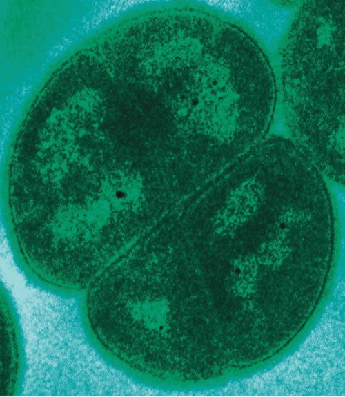

### Learning Objectives

* Describe the unique features of deeply branching bacteria
* Give examples of significant deeply branching bacteria

On a **phylogenetic tree**{: data-type="term" .no-emphasis} (see [A Systematic Approach](/m58782){: .target-chapter}), the trunk or root of the tree represents a common ancient evolutionary ancestor, often called the **last universal common ancestor (LUCA)**{: data-type="term" .no-emphasis}, and the branches are its evolutionary descendants. Scientists consider the **deeply branching bacteria**{: data-type="term"}, such as the genus ***Acetothermus***{: data-type="term" .no-emphasis}, to be the first of these non-LUCA forms of life produced by evolution some 3.5 billion years ago. When placed on the phylogenetic tree, they stem from the common root of life, deep and close to the **LUCA**{: data-type="term" .no-emphasis} root—hence the name “deeply branching” ([\[link\]](#OSC_Microbio_04_05_DeepBranch)).

 ![A diagram of a phylogenetic tree. At the base is the label LUCA This branches into two branches. The branch on the left is the bacteria, the branch to the right branches again to form the archaea and Eukarya. The lowest branch of the bacteria is the acetothermus (which is starred). Branches above that include (from bottom to top): aquifex, thermotoga, green filamentous bacteria, bacteroides, cytophaga, planctomyces, gram positives, cyanobacteria, porteiobacteria and spirochetes. Branches of the arcaea from bottom to top: pyrodicticum, thermoproteus, Thermococcus, methanococcus, methanobacterium, methanosarcina, and halophies. Branches of the Eukarya from bottom to top: diplomonads, microsporidia, trichomonads, flagellates, entamoebae, slime molds, ciliates, plants, animals, and fungi.](../resources/OSC_Microbio_04_05_DeepBranch.jpg "The star on this phylogenetic tree of life shows the position of the deeply branching bacteria Acetothermus. (credit: modification of work by Eric Gaba)"){: #OSC_Microbio_04_05_DeepBranch}

The deeply branching bacteria may provide clues regarding the structure and function of ancient and now extinct forms of life. We can hypothesize that ancient bacteria, like the deeply branching bacteria that still exist, were thermophiles or **hyperthermophiles**{: data-type="term" .no-emphasis}, meaning that they thrived at very high temperatures. ***Acetothermus paucivorans***{: data-type="term" .no-emphasis}, a gram-negative anaerobic bacterium discovered in 1988 in sewage sludge, is a thermophile growing at an optimal temperature of 58 °C.[1](#footnote1){: data-type="footnote-link"} Scientists have determined it to be the deepest branching bacterium, or the closest evolutionary relative of the LUCA ([\[link\]](#OSC_Microbio_04_05_DeepBranch)).

The class **Aquificae**{: data-type="term" .no-emphasis} includes deeply branching bacteria that are adapted to the harshest conditions on our planet, resembling the conditions thought to dominate the earth when life first appeared. Bacteria from the genus ***Aquifex***{: data-type="term" .no-emphasis} are hyperthermophiles, living in hot springs at a temperature higher than 90 °C. The species *A. pyrophilus* thrives near underwater volcanoes and thermal ocean vents, where the temperature of water (under high pressure) can reach 138 °C. *Aquifex* bacteria use inorganic substances as nutrients. For example, *A. pyrophilus* can reduce oxygen, and it is able to reduce nitrogen in anaerobic conditions. They also show a remarkable resistance to ultraviolet light and ionizing radiation. Taken together, these observations support the hypothesis that the ancient ancestors of deeply branching bacteria began evolving more than 3 billion years ago, when the earth was hot and lacked an atmosphere, exposing the bacteria to nonionizing and ionizing radiation.

The class **Thermotogae**{: data-type="term" .no-emphasis} is represented mostly by hyperthermophilic, as well as some mesophilic (preferring moderate temperatures), anaerobic gram-negative bacteria whose cells are wrapped in a peculiar sheath-like outer membrane called a **toga**{: data-type="term" .no-emphasis}. The thin layer of peptidoglycan in their cell wall has an unusual structure; it contains diaminopimelic acid and D-lysine. These bacteria are able to use a variety of organic substrates and produce molecular hydrogen, which can be used in industry. The class contains several genera, of which the best known is the genus ***Thermotoga***{: data-type="term" .no-emphasis}. One species of this genus, *T. maritima*, lives near the thermal ocean vents and thrives in temperatures of 90 °C; another species, *T. subterranea*, lives in underground oil reservoirs.

Finally, the deeply branching bacterium ***Deinococcus radiodurans***{: data-type="term" .no-emphasis} belongs to a genus whose name is derived from a Greek word meaning *terrible* *berry*. Nicknamed “**Conan the Bacterium**{: data-type="term" .no-emphasis},” *D. radiodurans* is considered a polyextremophile because of its ability to survive under the many different kinds of extreme conditions—extreme heat, drought, vacuum, acidity, and radiation. It owes its name to its ability to withstand doses of ionizing radiation that kill all other known bacteria; this special ability is attributed to some unique mechanisms of DNA repair.

 {: #OSC_Microbio_04_05_Dradiodura}

### Key Concepts and Summary

* **Deeply branching bacteria** are phylogenetically the most ancient forms of life, being the closest to the last universal common ancestor.
* Deeply branching bacteria include many species that thrive in extreme environments that are thought to resemble conditions on earth billions of years ago
* Deeply branching bacteria are important for our understanding of evolution; some of them are used in industry
{: data-bullet-style="bullet"}

### Multiple Choice

The term “deeply branching” refers to which of the following?

1.  the cellular shape of deeply branching bacteria
2.  the position in the evolutionary tree of deeply branching bacteria
3.  the ability of deeply branching bacteria to live in deep ocean waters
4.  the pattern of growth in culture of deeply branching bacteria
{: data-number-style="upper-alpha"}

B

Which of these deeply branching bacteria is considered a polyextremophile?

1.  *Aquifex pyrophilus*
2.  *Deinococcus radiodurans*
3.  *Staphylococcus aureus*
4.  *Mycobacterium tuberculosis*
{: data-number-style="upper-alpha"}

B

### Fill in the Blank

The length of the branches of the evolutionary tree characterizes the evolutionary \_\_\_\_\_\_\_\_ between organisms.

distance

The deeply branching bacteria are thought to be the form of life closest to the last universal \_\_\_\_\_\_\_\_ \_\_\_\_\_\_\_\_.

common ancestor

Many of the deeply branching bacteria are aquatic and hyperthermophilic, found near underwater volcanoes and thermal ocean \_\_\_\_\_\_\_\_.

vents

The deeply branching bacterium *Deinococcus radiodurans* is able to survive exposure to high doses of \_\_\_\_\_\_\_\_.

ionizing radiation

### Short Answer

Briefly describe the significance of deeply branching bacteria for basic science and for industry.

What is thought to account for the unique radiation resistance of *D. radiodurans*?

### Footnotes
{: data-type="footnote-refs-title"}

* {: data-type="footnote-ref" #footnote1} [1](#footnote-ref1){: data-type="footnote-ref-link"} G. Dietrich et al. “*Acetothermus paucivorans*, gen. nov., sp. Nov., a Strictly Anaerobic, Thermophilic Bacterium From Sewage Sludge, Fermenting Hexoses to Acetate, CO2, and H2.” *Systematic and Applied Microbiology* 10 no. 2 (1988):174–179.
{: data-list-type="bulleted" data-bullet-style="none"}

