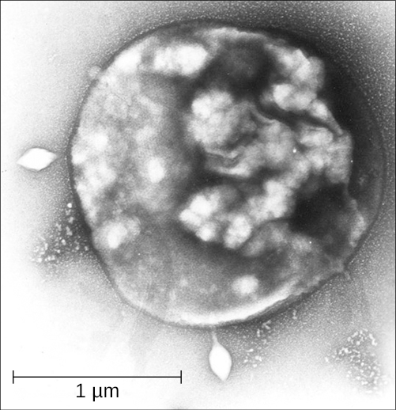

# Learning Objectives

* Describe the unique features of each category of Archaea
* Explain why archaea might not be associated with human microbiomes or pathology
* Give common examples of archaea commonly associated with unique environmental habitats

Like organisms in the domain Bacteria, organisms of the domain **Archaea**{: data-type="term"} are all unicellular organisms. However, archaea differ structurally from bacteria in several significant ways, as discussed in [Unique Characteristics of Prokaryotic Cells](/m58792){: .target-chapter}. To summarize:

* The archaeal cell membrane is composed of **ether linkages**{: data-type="term" .no-emphasis} with branched **isoprene chains**{: data-type="term" .no-emphasis} (as opposed to the bacterial cell membrane, which has ester linkages with unbranched fatty acids).
* Archaeal cell walls lack peptidoglycan, but some contain a structurally similar substance called **pseudopeptidoglycan**{: data-type="term" .no-emphasis} or **pseudomurein**{: data-type="term" .no-emphasis}.
* The genomes of Archaea are larger and more complex than those of bacteria.
{: data-bullet-style="bullet"}

Domain Archaea is as diverse as domain Bacteria, and its representatives can be found in any habitat. Some archaea are **mesophiles**{: data-type="term" .no-emphasis}, and many are **extremophiles**{: data-type="term" .no-emphasis}, preferring extreme hot or cold, extreme salinity, or other conditions that are hostile to most other forms of life on earth. Their metabolism is adapted to the harsh environments, and they can perform **methanogenesis**{: data-type="term" .no-emphasis}, for example, which bacteria and eukaryotes cannot.

The size and complexity of the archaeal genome makes it difficult to classify. Most taxonomists agree that within the Archaea, there are currently five major phyla: **Crenarchaeota**{: data-type="term" .no-emphasis}, **Euryarchaeota**{: data-type="term" .no-emphasis}, **Korarchaeota**{: data-type="term" .no-emphasis}, **Nanoarchaeota**{: data-type="term" .no-emphasis}, and **Thaumarchaeota**{: data-type="term" .no-emphasis}. There are likely many other archaeal groups that have not yet been systematically studied and classified.

With few exceptions, archaea are not present in the human microbiota, and none are currently known to be associated with infectious diseases in humans, animals, plants, or microorganisms. However, many play important roles in the environment and may thus have an indirect impact on human health.

# Crenarchaeota

Crenarchaeota is a class of Archaea that is extremely diverse, containing genera and species that differ vastly in their morphology and requirements for growth. All Crenarchaeota are aquatic organisms, and they are thought to be the most abundant microorganisms in the oceans. Most, but not all, Crenarchaeota are hyperthermophiles; some of them (notably, the genus *Pyrolobus*) are able to grow at temperatures up to 113 °C.[1](#footnote1){: data-type="footnote-number" name="footnote-ref1"}

Archaea of the genus ***Sulfolobus***{: data-type="term" .no-emphasis} ([\[link\]](#OSC_Microbio_04_06_Sulfolobus)) are thermophiles that prefer temperatures around 70–80°C and acidophiles that prefer a pH of 2–3.[2](#footnote2){: data-type="footnote-number" name="footnote-ref2"} *Sulfolobus* can live in aerobic or anaerobic environments. In the presence of oxygen, *Sulfolobus* spp. use metabolic processes similar to those of heterotrophs. In anaerobic environments, they oxidize sulfur to produce sulfuric acid, which is stored in granules. *Sulfolobus* spp. are used in biotechnology for the production of thermostable and acid-resistant proteins called **affitins**{: data-type="term" .no-emphasis}.[3](#footnote3){: data-type="footnote-number" name="footnote-ref3"} Affitins can bind and neutralize various antigens (molecules found in toxins or infectious agents that provoke an immune response from the body).

 {: #OSC_Microbio_04_06_Sulfolobus}

Another genus, ***Thermoproteus***{: data-type="term" .no-emphasis}, is represented by strictly anaerobic organisms with an optimal growth temperature of 85 °C. They have **flagella**{: data-type="term" .no-emphasis} and, therefore, are motile. *Thermoproteus* has a cellular membrane in which lipids form a monolayer rather than a bilayer, which is typical for archaea. Its metabolism is autotrophic. To synthesize ATP, *Thermoproteus* spp. reduce sulfur or molecular hydrogen and use carbon dioxide or carbon monoxide as a source of carbon. *Thermoproteus* is thought to be the deepest-branching genus of Archaea, and thus is a living example of some of our planet’s earliest forms of life.

* What types of environments do Crenarchaeota prefer?
{: data-bullet-style="bullet"}

# Euryarchaeota

The phylum Euryarchaeota includes several distinct classes. Species in the classes Methanobacteria, Methanococci, and Methanomicrobia represent Archaea that can be generally described as methanogens. Methanogens are unique in that they can reduce carbon dioxide in the presence of hydrogen, producing methane. They can live in the most extreme environments and can reproduce at temperatures varying from below freezing to boiling. Methanogens have been found in hot springs as well as deep under ice in Greenland. Some scientists have even hypothesized that **methanogen**{: data-type="term"}**s** may inhabit the planet Mars because the mixture of gases produced by methanogens resembles the makeup of the Martian atmosphere.[4](#footnote4){: data-type="footnote-number" name="footnote-ref4"}

Methanogens are thought to contribute to the formation of anoxic sediments by producing hydrogen sulfide, making “marsh gas.” They also produce gases in ruminants and humans. Some genera of methanogens, notably ***Methanosarcina***{: data-type="term" .no-emphasis}, can grow and produce methane in the presence of oxygen, although the vast majority are strict anaerobes.

The class **Halobacteria**{: data-type="term" .no-emphasis} (which was named before scientists recognized the distinction between Archaea and Bacteria) includes halophilic (“salt-loving”) archaea. Halobacteria require a very high concentrations of sodium chloride in their aquatic environment. The required concentration is close to saturation, at 36%; such environments include the Dead Sea as well as some salty lakes in Antarctica and south-central Asia. One remarkable feature of these organisms is that they perform **photosynthesis**{: data-type="term" .no-emphasis} using the protein **bacteriorhodopsin**{: data-type="term" .no-emphasis}, which gives them, and the bodies of water they inhabit, a beautiful purple color ([\[link\]](#OSC_Microbio_04_06_Halobact)).

 "){: #OSC_Microbio_04_06_Halobact}

Notable species of Halobacteria include ***Halobacterium salinarum***{: data-type="term" .no-emphasis}, which may be the oldest living organism on earth; scientists have isolated its DNA from fossils that are 250 million years old.[5](#footnote5){: data-type="footnote-number" name="footnote-ref5"} Another species, ***Haloferax volcanii***{: data-type="term" .no-emphasis}, shows a very sophisticated system of ion exchange, which enables it to balance the concentration of salts at high temperatures.

* Where do Halobacteria live?
{: data-bullet-style="bullet"}

Finding a Link Between Archaea and Disease

Archaea are not known to cause any disease in humans, animals, plants, bacteria, or in other archaea. Although this makes sense for the extremophiles, not all archaea live in extreme environments. Many genera and species of Archaea are mesophiles, so they can live in human and animal microbiomes, although they rarely do. As we have learned, some methanogens exist in the human gastrointestinal tract. Yet we have no reliable evidence pointing to any archaean as the causative agent of any human disease.

Still, scientists have attempted to find links between human disease and archaea. For example, in 2004, Lepp et al. presented evidence that an archaean called *Methanobrevibacter oralis* inhabits the gums of patients with periodontal disease. The authors suggested that the activity of these methanogens causes the disease.[6](#footnote6){: data-type="footnote-number" name="footnote-ref6"} However, it was subsequently shown that there was no causal relationship between *M. oralis* and periodontitis. It seems more likely that periodontal disease causes an enlargement of anaerobic regions in the mouth that are subsequently populated by *M. oralis*.[7](#footnote7){: data-type="footnote-number" name="footnote-ref7"}

There remains no good answer as to why archaea do not seem to be pathogenic, but scientists continue to speculate and hope to find the answer.

# Key Concepts and Summary

* **Archaea** are unicellular, prokaryotic microorganisms that differ from bacteria in their genetics, biochemistry, and ecology.
* Some archaea are extremophiles, living in environments with extremely high or low temperatures, or extreme salinity.
* Only archaea are known to produce methane. Methane-producing archaea are called **methanogens**.
* Halophilic archaea prefer a concentration of salt close to saturation and perform photosynthesis using bacteriorhodopsin.
* Some archaea, based on fossil evidence, are among the oldest organisms on earth.
* Archaea do not live in great numbers in human microbiomes and are not known to cause disease.
{: data-bullet-style="bullet"}

# Multiple Choice

Archaea and Bacteria are most similar in terms of their \_\_\_\_\_\_\_\_.

1.  genetics
2.  cell wall structure
3.  ecology
4.  unicellular structure
{: data-number-style="upper-alpha"}

D

Which of the following is true of archaea that produce methane?

1.  They reduce carbon dioxide in the presence of nitrogen.
2.  They live in the most extreme environments.
3.  They are always anaerobes.
4.  They have been discovered on Mars.
{: data-number-style="upper-alpha"}

B

# Fill in the Blank

\_\_\_\_\_\_\_\_ is a genus of Archaea. Its optimal environmental temperature ranges from 70 °C to 80 °C, and its optimal pH is 2–3. It oxidizes sulfur and produces sulfuric acid.

*Sulfolobus*

\_\_\_\_\_\_\_\_ was once thought to be the cause of periodontal disease, but, more recently, the causal relationship between this archaean and the disease was not confirmed.

*Methanobrevibacter oralis*

# Short Answer

What accounts for the purple color in salt ponds inhabited by halophilic archaea?

What evidence supports the hypothesis that some archaea live on Mars?

# Critical Thinking

What is the connection between this methane bog and archaea?

"){: #OSC_Microbio_04_06_ArtConn4_img}

## Footnotes
{: data-type="footnote-title"}

1.  [1](#footnote-ref1){: data-type="footnote-ref" name="footnote1"} E. Blochl et al.“*Pyrolobus fumani*, gen. and sp. nov., represents a novel group of Archaea, extending the upper temperature limit for life to 113°C.” *Extremophiles* 1 (1997):14–21.
2.  [2](#footnote-ref2){: data-type="footnote-ref" name="footnote2"} T.D. Brock et al. “*Sulfolobus*\: A New Genus of Sulfur-Oxidizing Bacteria Living at Low pH and High Temperature.” *Archiv für Mikrobiologie* 84 no. 1 (1972):54–68.
3.  [3](#footnote-ref3){: data-type="footnote-ref" name="footnote3"} S. Pacheco et al. “Affinity Transfer to the Archaeal Extremophilic Sac7d Protein by Insertion of a CDR.” *Protein Engineering Design and Selection* 27 no. 10 (2014):431-438.
4.  [4](#footnote-ref4){: data-type="footnote-ref" name="footnote4"} R.R. Britt “Crater Critters: Where Mars Microbes Might Lurk.” http://www.space.com/1880-crater-critters-mars-microbes-lurk.html. Accessed April 7, 2015.
5.  [5](#footnote-ref5){: data-type="footnote-ref" name="footnote5"} H. Vreeland et al. “Fatty acid and DA Analyses of Permian Bacterium Isolated From Ancient Salt Crystals Reveal Differences With Their Modern Relatives.” *Extremophiles* 10 (2006):71–78.
6.  [6](#footnote-ref6){: data-type="footnote-ref" name="footnote6"} P.W. Lepp et al. “Methanogenic Archaea and Human Gum Disease.” *Proceedings of the National Academies of Science of the United States of America* 101 no. 16 (2004):6176–6181.
7.  [7](#footnote-ref7){: data-type="footnote-ref" name="footnote7"} R.I. Aminov. “Role of Archaea in Human Disease.” *Frontiers in Cellular and Infection Microbiology* 3 (2013):42.

