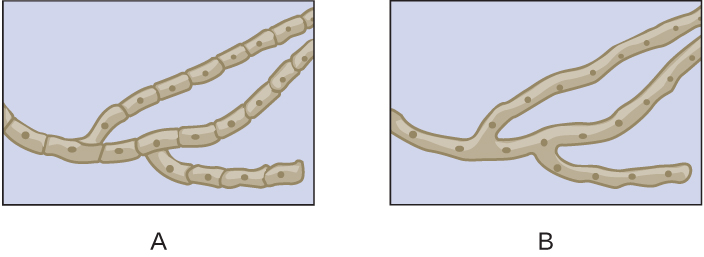

# Learning Objectives

* Explain why the study of fungi such as yeast and molds is within the discipline of microbiology
* Describe the unique characteristics of fungi
* Describe examples of asexual and sexual reproduction of fungi
* Compare the major groups of fungi in this chapter, and give examples of each
* Identify examples of the primary causes of infections due to yeasts and molds
* Identify examples of toxin-producing fungi
* Classify fungal organisms according to major groups

The **fungi**{: data-type="term" .no-emphasis} comprise a diverse group of organisms that are heterotrophic and typically saprozoic. In addition to the well-known macroscopic fungi (such as mushrooms and molds), many unicellular yeasts and spores of macroscopic fungi are microscopic. For this reason, fungi are included within the field of microbiology.

Fungi are important to humans in a variety of ways. Both microscopic and macroscopic fungi have medical relevance, with some pathogenic species that can cause **mycoses**{: data-type="term"} (illnesses caused by fungi). Some pathogenic fungi are opportunistic, meaning that they mainly cause infections when the host’s immune defenses are compromised and do not normally cause illness in healthy individuals. Fungi are important in other ways. They act as decomposers in the environment, and they are critical for the production of certain foods such as cheeses. Fungi are also major sources of antibiotics, such as **penicillin**{: data-type="term" .no-emphasis} from the fungus ***Penicillium***{: data-type="term" .no-emphasis}.

# Characteristics of Fungi

Fungi have well-defined characteristics that set them apart from other organisms. Most multicellular fungal bodies, commonly called **molds**{: data-type="term" .no-emphasis}, are made up of filaments called **hyphae**{: data-type="term"}. Hyphae can form a tangled network called a **mycelium**{: data-type="term"} and form the **thallus**{: data-type="term"} (body) of fleshy fungi. Hyphae that have walls between the cells are called **septate hyphae**{: data-type="term"}; hyphae that lack walls and cell membranes between the cells are called nonseptate or **coenocytic hyphae**{: data-type="term"}). ([\[link\]](#OSC_Microbio_05_03_hyphae)).

  form hyphae, which may be septate or nonseptate. Unicellular fungi (yeasts) cells form pseudohyphae from individual yeast cells."){: #OSC_Microbio_05_03_hyphae}

In contrast to molds, **yeasts**{: data-type="term" .no-emphasis} are unicellular fungi. The **budding yeasts**{: data-type="term"} reproduce asexually by budding off a smaller daughter cell; the resulting cells may sometimes stick together as a short chain or **pseudohypha**{: data-type="term"} ([\[link\]](#OSC_Microbio_05_03_hyphae)). ***Candida albicans***{: data-type="term" .no-emphasis} is a common yeast that forms pseudohyphae; it is associated with various infections in humans, including vaginal yeast infections, oral thrush, and candidiasis of the skin.

Some fungi are dimorphic, having more than one appearance during their life cycle. These **dimorphic fungi**{: data-type="term"} may be able to appear as yeasts or molds, which can be important for infectivity. They are capable of changing their appearance in response to environmental changes such as nutrient availability or fluctuations in temperature, growing as a mold, for example, at 25 °C (77 °F), and as yeast cells at 37 °C (98.6 °F). This ability helps dimorphic fungi to survive in diverse environments. ***Histoplasma capsulatum***{: data-type="term" .no-emphasis}, the pathogen that causes **histoplasmosis**{: data-type="term" .no-emphasis}, a lung infection, is an example of a dimorphic fungus ([\[link\]](#OSC_Microbio_05_03_struct)).

  (top left). It can change forms to survive at different temperatures. In the outdoors, it typically grows as a mycelium (as shown in the micrograph, bottom left), but when the spores are inhaled (right), it responds to the high internal temperature of the body (37 &#xB0;C [98.6 &#xB0;F]) by turning into a yeast that can multiply in the lungs, causing the chronic lung disease histoplasmosis. (credit: modification of work by Centers for Disease Control and Prevention)"){: #OSC_Microbio_05_03_struct}

There are notable unique features in fungal cell walls and membranes. Fungal cell walls contain **chitin**{: data-type="term"}, as opposed to the cellulose found in the cell walls of plants and many protists. Additionally, whereas animals have cholesterol in their cell membranes, fungal cell membranes have different sterols called **ergosterols**{: data-type="term" .no-emphasis}. Ergosterols are often exploited as targets for antifungal drugs.

Fungal life cycles are unique and complex. Fungi reproduce sexually either through cross- or self-fertilization. Haploid fungi form hyphae that have gametes at the tips. Two different mating types (represented as “+ type” and “– type”) are involved. The cytoplasms of the + and – type gametes fuse (in an event called plasmogamy), producing a cell with two distinct nuclei (a **dikaryotic**{: data-type="term"} cell). Later, the nuclei fuse (in an event called **karyogamy**{: data-type="term" .no-emphasis}) to create a diploid zygote. The zygote undergoes meiosis to form **spores**{: data-type="term"} that germinate to start the haploid stage, which eventually creates more haploid mycelia ([\[link\]](#OSC_Microbio_05_03_zygo)). Depending on the taxonomic group, these sexually produced spores are known as zygospores (in Zygomycota), ascospores (in Ascomycota), or basidiospores (in Basidiomycota) ([\[link\]](#OSC_Microbio_05_03_spores)).

Fungi may also exhibit asexual reproduction by mitosis, mitosis with budding, fragmentation of hyphae, and formation of asexual spores by mitosis. These spores are specialized cells that, depending on the organism, may have unique characteristics for survival, reproduction, and dispersal. Fungi exhibit several types of asexual spores and these can be important in classification.

 ![Zygomycete life cycle. The mycelia can undergo asexual reproduction by forming spores via mitosis. The spores then form mycelia by germination. The haploid spores can also undergo sexual reproduction. The first step is germination when mycelia form. If the two mating types (+ and -) are in close proximity, extensions called gametangia form between them. Next is plasmogamy. This is the fusion between the + and &#x2013; mating types resulting in a zygosporangium with multiple haploid nucei. The zygosporangiom forms a thick, protective coat. Next the nuclei fuse to form a zygote with multiple diploid nuclei in karyogamy. This forms a diploid zygote. Next is mitosis and germination where the sporangium grows on a  short stalk and the haploid spores are formed inside. The spores are released in germination and we are back to the spore stage of the life cycle.](../resources/OSC_Microbio_05_03_zygo.jpg "Zygomycetes have sexual and asexual life cycles. In the sexual life cycle, + and &#x2013; mating types conjugate to form a zygosporangium."){: #OSC_Microbio_05_03_zygo}

 This brightfield micrograph shows the release of spores from a sporangium at the end of a hypha called a sporangiophore. The organism is a Mucor sp. fungus, a mold often found indoors. (b) Sporangia grow at the ends of stalks, which appear as the white fuzz seen on this bread mold, Rhizopus stolonifer. The tips of bread mold are the dark, spore-containing sporangia. (credit a: modification of work by Centers for Disease Control and Prevention; credit b right: modification of work by &#x201C;Andrew&#x201D;/Flickr)"){: #OSC_Microbio_05_03_spores}

* Is a dimorphic fungus a yeast or a mold? Explain.
{: data-bullet-style="bullet"}

# Fungal Diversity

The **fungi**{: data-type="term" .no-emphasis} are very diverse, comprising seven major groups. Not all of the seven groups contain pathogens. Some of these groups are generally associated with plants and include plant pathogens. For example, Urediniomycetes and Ustilagomycetes include the plant **rusts**{: data-type="term" .no-emphasis} and **smuts**{: data-type="term" .no-emphasis}, respectively. These form reddish or dark masses, respectively, on plants as rusts (red) or smuts (dark). Some species have substantial economic impact because of their ability to reduce crop yields. Glomeromycota includes the **mycorrhizal fungi**{: data-type="term" .no-emphasis}, important symbionts with plant roots that can promote plant growth by acting like an extended root system. The Glomeromycota are obligate symbionts, meaning that they can only survive when associated with plant roots; the fungi receive carbohydrates from the plant and the plant benefits from the increased ability to take up nutrients and minerals from the soil. The Chytridiomycetes (**chytrids**{: data-type="term" .no-emphasis}) are small fungi, but are extremely ecologically important. Chytrids are generally aquatic and have flagellated, motile gametes; specific types are implicated in amphibian declines around the world. Because of their medical importance, we will focus on Zygomycota, Ascomycota, Basidiomycota, and Microsporidia. [\[link\]](#OSC_Microbio_05_03_TaxaTable) summarizes the characteristics of these medically important groups of fungi.

The **Zygomycota**{: data-type="term" .no-emphasis} (zygomycetes) are mainly saprophytes with coenocytic hyphae and haploid nuclei. They use sporangiospores for asexual reproduction. The group name comes from the **zygospores**{: data-type="term"} that they use for sexual reproduction ([\[link\]](#OSC_Microbio_05_03_zygo)), which have hard walls formed from the fusion of reproductive cells from two individuals. Zygomycetes are important for food science and as crop pathogens. One example is ***Rhizopus stolonifer***{: data-type="term" .no-emphasis} ([\[link\]](#OSC_Microbio_05_03_spores)), an important bread mold that also causes rice seedling blight. ***Mucor***{: data-type="term" .no-emphasis} is a genus of fungi that can potentially cause necrotizing infections in humans, although most species are intolerant of temperatures found in mammalian bodies ([\[link\]](#OSC_Microbio_05_03_spores)).

The **Ascomycota**{: data-type="term" .no-emphasis} include fungi that are used as food (edible mushrooms, morels, and truffles), others that are common causes of food spoilage (bread molds and plant pathogens), and still others that are human pathogens. Ascomycota may have septate hyphae and cup-shaped fruiting bodies called **ascocarps**{: data-type="term"}. Some genera of Ascomycota use sexually produced **ascospores**{: data-type="term"} as well as asexual spores called **conidia**{: data-type="term"}, but sexual phases have not been discovered or described for others. Some produce an **ascus**{: data-type="term"} containing ascospores within an ascocarp ([\[link\]](#OSC_Microbio_05_03_asclife)).

Examples of the Ascomycota include several bread molds and minor pathogens, as well as species capable of causing more serious mycoses. Species in the genus *Aspergillus* are important causes of allergy and infection, and are useful in research and in the production of certain fermented alcoholic beverages such as Japanese *sake*. The fungus ***Aspergillus flavus***{: data-type="term" .no-emphasis}*,* a contaminant of nuts and stored grains, produces an **aflatoxin**{: data-type="term"} that is both a toxin and the most potent known natural carcinogen. ***Neurospora crassa***{: data-type="term" .no-emphasis} is of particular use in genetics research because the spores produced by meiosis are kept inside the ascus in a row that reflects the cell divisions that produced them, giving a direct view of segregation and assortment of genes ([\[link\]](#OSC_Microbio_05_03_sexspores)). ***Penicillium***{: data-type="term" .no-emphasis} produces the antibiotic penicillin ([\[link\]](#OSC_Microbio_05_03_asclife)).

Many species of ascomycetes are medically important. A large number of species in the genera ***Trichophyton***{: data-type="term" .no-emphasis}, ***Microsporum***{: data-type="term" .no-emphasis}, and ***Epidermophyton***{: data-type="term" .no-emphasis} are **dermatophytes**{: data-type="term" .no-emphasis}, pathogenic fungi capable of causing skin infections such as athlete’s foot, jock itch, and **ringworm**{: data-type="term" .no-emphasis}. ***Blastomyces dermatitidis***{: data-type="term" .no-emphasis} is a dimorphic fungus that can cause **blastomycosis**{: data-type="term" .no-emphasis}, a respiratory infection that, if left untreated, can become disseminated to other body sites, sometimes leading to death. Another important respiratory pathogen is the dimorphic fungus ***Histoplasma capsulatum***{: data-type="term" .no-emphasis} ([\[link\]](#OSC_Microbio_05_03_struct))*,* which is associated with birds and bats in the Ohio and Mississippi river valleys. ***Coccidioides immitis***{: data-type="term" .no-emphasis} causes the serious lung disease **Valley fever**{: data-type="term" .no-emphasis}. ***Candida albicans***{: data-type="term" .no-emphasis}, the most common cause of vaginal and other yeast infections, is also an ascomycete fungus; it is a part of the normal microbiota of the skin, intestine, genital tract, and ear ([\[link\]](#OSC_Microbio_05_03_asclife)). Ascomycetes also cause plant diseases, including ergot infections, Dutch elm disease, and powdery mildews.

***Saccharomyces***{: data-type="term" .no-emphasis} yeasts, including the baker’s yeast *S. cerevisiae*, are unicellular ascomycetes with haploid and diploid stages ([\[link\]](#OSC_Microbio_05_03_ascomyLC)). This and other *Saccharomyces* species are used for brewing beer.

  This brightfield micrograph shows ascospores being released from asci in the fungus Talaromyces flavus var. flavus. (b) This electron micrograph shows the conidia (spores) borne on the conidiophore of Aspergillus, a type of toxic fungus found mostly in soil and plants. (c) This brightfield micrograph shows the yeast Candida albicans, the causative agent of candidiasis and thrush. (credit a, b, c: modification of work by Centers for Disease Control and Prevention)"){: #OSC_Microbio_05_03_asclife}

"){: #OSC_Microbio_05_03_sexspores}

![Ascomycete life cycle. Mycelia produce conidiophores which use mitosis to asexually produce spores. These spores then germinate into new mycelia. Sexual reproduction begins one hyphae produces an ascogonium and another produces an antheridium. In plasmogamy the ascogonium and antheridium fuse. Mitosis and cell division result in the formation of many dikaryotic hyphae, which form a fruiting body called the ascocarp. Asci form at the tips of these hyphae. In karyogamy the nuclein in the asci fuse to form a diploid zygote. Then meiosis produces four haploid nuclei in the ascus. Then mitosis and cell division results in eight haploid ascospores in the ascus. These ascospores then disperse and germinate into new mycelia.](../resources/OSC_Microbio_05_03_ascomyLC.jpg "The life cycle of an ascomycete is characterized by the production of asci during the sexual phase. The haploid phase is the predominant phase of the life cycle."){: #OSC_Microbio_05_03_ascomyLC}

The **Basidiomycota**{: data-type="term" .no-emphasis} (basidiomycetes) are fungi that have **basidia**{: data-type="term"} (club-shaped structures) that produce **basidiospores**{: data-type="term"} (spores produced through budding) within fruiting bodies called **basidiocarps**{: data-type="term"} ([\[link\]](#OSC_Microbio_05_03_basidioLC)). They are important as decomposers and as food. This group includes rusts, stinkhorns, puffballs, and mushrooms. Several species are of particular importance. ***Cryptococcus neoformans***{: data-type="term" .no-emphasis}, a fungus commonly found as a yeast in the environment, can cause serious lung infections when inhaled by individuals with weakened immune systems. The edible meadow mushroom, *Agricus campestris*, is a basidiomycete, as is the poisonous mushroom *Amanita* *phalloides*, known as the death cap. The deadly toxins produced by *A. phalloides* have been used to study transcription.

 ![Basidiomycete life cycle. Haploid basidiospres germinate to form mycelia. There are two mating types (+ and -\_). In plasmogamy, fusion between + and &#x2013; mating types results in formation of a dikaryotic mycelium. Under the right environmental conditions, a basidiocarp forms via mitosis. Gills of the basidiocarp contain cells called basidia. A photo of a mushroom labels the mushroom as basidiocap and basidia within the gills. Basidia form diploid nuclei via karyotamy; this produces a diploid zygote. Four haploid nuclei are formed in the basidium via meisos. Cell division produces four haploid basidiospores. These spres then disperse and germinate into new mycelia.](../resources/OSC_Microbio_05_03_basidioLC.jpg "The life cycle of a basidiomycete alternates a haploid generation with a prolonged stage in which two nuclei (dikaryon) are present in the hyphae."){: #OSC_Microbio_05_03_basidioLC}

Finally, the **Microsporidia**{: data-type="term"} are unicellular fungi that are obligate intracellular parasites. They lack mitochondria, peroxisomes, and centrioles, but their spores release a unique **polar tubule**{: data-type="term"} that pierces the host cell membrane to allow the fungus to gain entry into the cell. A number of microsporidia are human pathogens, and infections with microsporidia are called **microsporidiosis**{: data-type="term" .no-emphasis}. One pathogenic species is ***Enterocystozoan bieneusi***{: data-type="term" .no-emphasis}, which can cause symptoms such as diarrhea, cholecystitis (inflammation of the gall bladder), and in rare cases, respiratory illness.

 ![A table labeled select groups of fungi. Four groups are discussed. Ascomycota have the characteristics: septate hyphae, ascus with ascospores in ascocarp, and conidiospores. Examples include Cup fungi, edible mushrooms, morels, truffles, neurospora, and penicillim. Medically important species include Aspergillus, Trichophyton, Microsporum, Epidemophyton, Blastomyces demititidis, and Histoplasma capsulatum. An image of Aspergillus niger shows long strands with a dark sphere at the end of one strand. Basidiomycota have the characteristics: basidia, produce basidiospores in basidiocarp. Examples include club fungi, rusts, stinkhors, puffballs, mushrooms, Cryptococcus neoformans, Amanita phalloides. Medically important species include Cryptococcus neoformans. An image shows a mushroom labeled Amanita phalloides. Microsporidia have the characteristics: lack mitochondria, peroxisomes, and centrioles; spores produce a polar tube. Examples include Enterocystozoan bieneusi which is medically important. A micrograph shows oval cells labeled microsporidia (unidentified). Zygomycota have the characteristics: mainly saprophytes, coenocytic hyphae, haploid nuclei and zygospores. Examples include Rhizopus stolonifera and the medically important mucor spp. A micrograph shows a long strand with many small dots everywhere on the slide.](../resources/OSC_Microbio_05_03_TaxaTable.jpg "(credit &#x201C;Ascomycota&#x201D;: modification of work by Dr. Lucille Georg, Centers for Disease Control and Prevention; credit &#x201C;Microsporidia&#x201D;: modification of work by Centers for Disease Control and Prevention)"){: #OSC_Microbio_05_03_TaxaTable}

* Which group of fungi appears to be associated with the greatest number of human diseases?
{: data-bullet-style="bullet"}

Eukaryotic Pathogens in Eukaryotic Hosts

When we think about antimicrobial medications, antibiotics such as penicillin often come to mind. Penicillin and related antibiotics interfere with the synthesis of peptidoglycan cell walls, which effectively targets bacterial cells. These antibiotics are useful because humans (like all eukaryotes) do not have peptidoglycan cell walls.

Developing medications that are effective against eukaryotic cells but not harmful to human cells is more difficult. Despite huge morphological differences, the cells of humans, fungi, and protists are similar in terms of their ribosomes, cytoskeletons, and cell membranes. As a result, it is more challenging to develop medications that target protozoans and fungi in the same way that antibiotics target prokaryotes.

Fungicides have relatively limited modes of action. Because fungi have **ergosterols**{: data-type="term" .no-emphasis} (instead of cholesterol) in their cell membranes, the different enzymes involved in sterol production can be a target of some medications. The azole and morpholine **fungicides**{: data-type="term" .no-emphasis} interfere with the synthesis of membrane sterols. These are used widely in agriculture (fenpropimorph) and clinically (e.g., miconazole). Some antifungal medications target the **chitin**{: data-type="term" .no-emphasis} cell walls of fungi. Despite the success of these compounds in targeting fungi, **antifungal medications**{: data-type="term" .no-emphasis} for systemic infections still tend to have more toxic side effects than antibiotics for bacteria.

Part 3

Sarah is relieved the ringworm is not an actual worm, but wants to know what it really is. The physician explains that ringworm is a fungus. He tells her that she will not see mushrooms popping out of her skin, because this fungus is more like the invisible part of a mushroom that hides in the soil. He reassures her that they are going to get the fungus out of her too.

The doctor cleans and then carefully scrapes the lesion to place a specimen on a slide. By looking at it under a microscope, the physician is able to confirm that a fungal infection is responsible for Sarah’s lesion. In [\[link\]](#OSC_Microbio_05_03_Trubrum), it is possible to see macro- and microconidia in ***Trichophyton rubrum***{: data-type="term" .no-emphasis}. Cell walls are also visible. Even if the pathogen resembled a helminth under the microscope, the presence of cell walls would rule out the possibility because animal cells lack cell walls.

The doctor prescribes an antifungal cream for Sarah’s mother to apply to the ringworm. Sarah’s mother asks, “What should we do if it doesn’t go away?”

* Can all forms of ringworm be treated with the same antifungal medication?
{: data-bullet-style="bullet"}

 and microconidia of Trichophyton rubrum, a dermatophyte responsible for fungal infections of the skin. (credit: modification of work by Centers for Disease Control and Prevention)"){: #OSC_Microbio_05_03_Trubrum}

*Jump to the [next](/m58806#fs-id1172101914727) Clinical Focus box. Go back to the [previous](/m58803#fs-id1172102074327) Clinical Focus box.*

# Key Concepts and Summary

* The fungi include diverse saprotrophic eukaryotic organisms with chitin cell walls
* Fungi can be unicellular or multicellular; some (like yeast) and fungal spores are microscopic, whereas some are large and conspicuous
* Reproductive types are important in distinguishing fungal groups
* Medically important species exist in the four fungal groups Zygomycota, Ascomycota, Basidiomycota, and Microsporidia
* Members of Zygomycota, Ascomycota, and Basidiomycota produce deadly toxins
* Important differences in fungal cells, such as ergosterols in fungal membranes, can be targets for antifungal medications, but similarities between human and fungal cells make it difficult to find targets for medications and these medications often have toxic adverse effects
{: data-bullet-style="bullet"}

# Multiple Choice

Mushrooms are a type of which of the following?

1.  conidia
2.  ascus
3.  polar tubule
4.  basidiocarp
{: data-number-style="upper-alpha"}

D

Which of the following is the most common cause of human yeast infections?

1.  *Candida albicans*
2.  *Blastomyces dermatitidis*
3.  *Cryptococcus neoformans*
4.  *Aspergillus fumigatus*
{: data-number-style="upper-alpha"}

A

Which of the following is an ascomycete fungus associated with bat droppings that can cause a respiratory infection if inhaled?

1.  *Candida albicans*
2.  *Histoplasma capsulatum*
3.  *Rhizopus stolonifera*
4.  *Trichophyton rubrum*
{: data-number-style="upper-alpha"}

B

# Fill in the Blank

Nonseptate hyphae are also called \_\_\_\_\_\_\_\_\_.

coenocytic

Unicellular fungi are called \_\_\_\_\_\_\_\_\_.

yeasts

Some fungi have proven medically useful because they can be used to produce \_\_\_\_\_\_\_\_\_.

antibiotics

# Short Answer

Which genera of fungi are common dermatophytes (fungi that cause skin infections)?

What is a dikaryotic cell?

# Critical Thinking

Which of the drawings shows septate hyphae?

  

Explain the benefit of research into the pathways involved in the synthesis of chitin in fungi.

