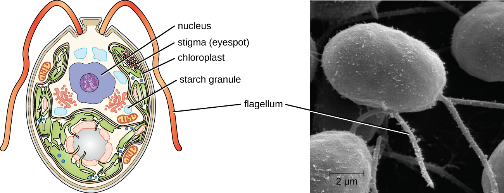

# Learning Objectives

* Explain why algae are included within the discipline of microbiology
* Describe the unique characteristics of algae
* Identify examples of toxin-producing algae
* Compare the major groups of algae in this chapter, and give examples of each
* Classify algal organisms according to major groups

The **algae**{: data-type="term"} are autotrophic protists that can be unicellular or multicellular. These organisms are found in the supergroups **Chromalveolata**{: data-type="term" .no-emphasis} (dinoflagellates, diatoms, golden algae, and brown algae) and **Archaeplastida**{: data-type="term" .no-emphasis} (red algae and green algae). They are important ecologically and environmentally because they are responsible for the production of approximately 70% of the oxygen and organic matter in aquatic environments. Some types of algae, even those that are microscopic, are regularly eaten by humans and other animals. Additionally, algae are the source for **agar**{: data-type="term"}, agarose, and **carrageenan**{: data-type="term"}, solidifying agents used in laboratories and in food production. Although algae are typically not pathogenic, some produce toxins. Harmful **algal bloom**{: data-type="term"}**s**, which occur when algae grow quickly and produce dense populations, can produce high concentrations of toxins that impair liver and nervous-system function in aquatic animals and humans.

Like protozoans, algae often have complex cell structures. For instance, algal cells can have one or more chloroplasts that contain structures called **pyrenoids**{: data-type="term"} to synthesize and store starch. The chloroplasts themselves differ in their number of membranes, indicative of secondary or rare tertiary endosymbiotic events. Primary chloroplasts have two membranes—one from the original cyanobacteria that the ancestral eukaryotic cell engulfed, and one from the plasma membrane of the engulfing cell. Chloroplasts in some lineages appear to have resulted from secondary endosymbiosis, in which another cell engulfed a green or red algal cell that already had a primary chloroplast within it. The engulfing cell destroyed everything except the chloroplast and possibly the cell membrane of its original cell, leaving three or four membranes around the chloroplast. Different algal groups have different pigments, which are reflected in common names such as red algae, brown algae, and green algae.

Some algae, the seaweeds, are macroscopic and may be confused with plants. Seaweeds can be red, brown, or green, depending on their photosynthetic pigments. Green algae, in particular, share some important similarities with land plants; however, there are also important distinctions. For example, seaweeds do not have true tissues or organs like plants do. Additionally, seaweeds do not have a waxy cuticle to prevent desiccation. Algae can also be confused with cyanobacteria, photosynthetic bacteria that bear a resemblance to algae; however, cyanobacteria are prokaryotes (see [Nonproteobacteria Gram-negative Bacteria and Phototrophic Bacteria](/m58797){: .target-chapter}).

Algae have a variety of life cycles. Reproduction may be asexual by mitosis or sexual using gametes.

# Algal Diversity

Although the algae and protozoa were formerly separated taxonomically, they are now mixed into supergroups. The algae are classified within the Chromalveolata and the Archaeplastida. Although the Euglenozoa (within the supergroup Excavata) include photosynthetic organisms, these are not considered algae because they feed and are motile.

The dinoflagellates and stramenopiles fall within the Chromalveolata. The **dinoflagellates**{: data-type="term"} are mostly marine organisms and are an important component of plankton. They have a variety of nutritional types and may be phototrophic, heterotrophic, or mixotrophic. Those that are photosynthetic use chlorophyll *a*, chlorophyll *c*2, and other photosynthetic pigments ([\[link\]](#OSC_Microbio_05_04_dino)). They generally have two flagella, causing them to whirl (in fact, the name dinoflagellate comes from the Greek word for “whirl”: *dini*). Some have cellulose plates forming a hard outer covering, or **theca**{: data-type="term"}, as armor. Additionally, some dinoflagellates produce neurotoxins that can cause paralysis in humans or fish. Exposure can occur through contact with water containing the dinoflagellate toxins or by feeding on organisms that have eaten dinoflagellates.

When a population of dinoflagellates becomes particularly dense, a **red tide**{: data-type="term"} (a type of harmful algal bloom) can occur. Red tides cause harm to marine life and to humans who consume contaminated marine life. Major toxin producers include ***Gonyaulax***{: data-type="term" .no-emphasis} and ***Alexandrium***{: data-type="term" .no-emphasis}*,* both of which cause paralytic shellfish poisoning. Another species, ***Pfiesteria piscicida***{: data-type="term" .no-emphasis}, is known as a fish killer because, at certain parts of its life cycle, it can produce toxins harmful to fish and it appears to be responsible for a suite of symptoms, including memory loss and confusion, in humans exposed to water containing the species.

 "){: #OSC_Microbio_05_04_dino}

The **stramenopiles**{: data-type="term"} include the **golden algae**{: data-type="term" .no-emphasis} (**Chrysophyta**{: data-type="term" .no-emphasis}), the **brown algae**{: data-type="term" .no-emphasis} (**Phaeophyta**{: data-type="term" .no-emphasis}), and the **diatoms**{: data-type="term"} (**Bacillariophyta**{: data-type="term" .no-emphasis}). Stramenopiles have chlorophyll *a*, chlorophyll *c1/c2*, and fucoxanthin as photosynthetic pigments. Their storage carbohydrate is chrysolaminarin. While some lack cell walls, others have scales. Diatoms have flagella and **frustules**{: data-type="term"}, which are outer cell walls of crystallized silica; their fossilized remains are used to produce diatomaceous earth, which has a range of uses such as filtration and insulation. Additionally, diatoms can reproduce sexually or asexually. One diatom genus, ***Pseudo-nitzschia***{: data-type="term" .no-emphasis}*,* is known to be associated with harmful algal blooms.

Brown algae (Phaeophyta) are multicellular marine seaweeds. Some can be extremely large, such as the giant kelp (***Laminaria***{: data-type="term" .no-emphasis}). They have leaf-like blades, stalks, and structures called holdfasts that are used to attach to substrate. However, these are not true leaves, stems, or roots ([\[link\]](#OSC_Microbio_05_04_algae)). Their photosynthetic pigments are chlorophyll *a*, chlorophyll *c*, *β*-carotene, and fucoxanthine. They use laminarin as a storage carbohydrate.

The **Archaeplastids**{: data-type="term" .no-emphasis} include the **green algae**{: data-type="term" .no-emphasis} (**Chlorophyta**{: data-type="term" .no-emphasis}), the **red algae**{: data-type="term" .no-emphasis} (**Rhodophyta**{: data-type="term" .no-emphasis}), another group of green algae (**Charophyta**{: data-type="term" .no-emphasis}), and the land plants. The Charaphyta are the most similar to land plants because they share a mechanism of cell division and an important biochemical pathway, among other traits that the other groups do not have. Like land plants, the Charophyta and Chlorophyta have chlorophyll *a* and chlorophyll *b* as photosynthetic pigments, cellulose cell walls, and starch as a carbohydrate storage molecule. ***Chlamydomonas***{: data-type="term" .no-emphasis} is a green alga that has a single large chloroplast, two flagella, and a **stigma**{: data-type="term" .no-emphasis} (eyespot); it is important in molecular biology research ([\[link\]](#OSC_Microbio_05_04_green)).

***Chlorella***{: data-type="term" .no-emphasis} is a nonmotile, large, unicellular alga, and ***Acetabularia***{: data-type="term" .no-emphasis} is an even larger unicellular green alga. The size of these organisms challenges the idea that all cells are small, and they have been used in genetics research since Joachim **Hämmerling**{: data-type="term" .no-emphasis} (1901–1980) began to work with them in 1943. *Volvox* is a colonial, unicellular alga ([\[link\]](#OSC_Microbio_05_04_green)). A larger, multicellular green alga is *Ulva*, also known as the sea lettuce because of its large, edible, green blades. The range of life forms within the Chlorophyta—from unicellular to various levels of coloniality to multicellular forms—has been a useful research model for understanding the evolution of multicellularity. The red algae are mainly multicellular but include some unicellular forms. They have rigid cell walls containing **agar**{: data-type="term" .no-emphasis} or **carrageenan**{: data-type="term" .no-emphasis}, which are useful as food solidifying agents and as a solidifier added to growth media for microbes.

  These large multicellular kelps are members of the brown algae. Note the &#x201C;leaves&#x201D; and &#x201C;stems&#x201D; that make them appear similar to green plants. (b) This is a species of red algae that is also multicellular. (c) The green alga Halimeda incrassata, shown here growing on the sea floor in shallow water, appears to have plant-like structures, but is not a true plant. (d) Bioluminesence, visible in the cresting wave in this picture, is a phenomenon of certain dinoflagellates. (e) Diatoms (pictured in this micrograph) produce silicaceous tests (skeletons) that form diatomaceous earths. (f) Colonial green algae, like volvox in these three micrographs, exhibit simple cooperative associations of cells. (credit a, e: modification of work by NOAA; credit b: modification of work by Ed Bierman; credit c: modification of work by James St. John; credit d: modification of work by &#x201C;catalano82&#x201D;/Flickr; credit f: modification of work by Dr. Ralf Wagner)"){: #OSC_Microbio_05_04_algae}

{: #OSC_Microbio_05_04_green}

* Which groups of algae are associated with harmful algal blooms?
{: data-bullet-style="bullet"}

# Key Concepts and Summary

* Algae are a diverse group of photosynthetic eukaryotic protists
* Algae may be unicellular or multicellular
* Large, multicellular algae are called seaweeds but are not plants and lack plant-like tissues and organs
* Although algae have little pathogenicity, they may be associated with toxic **algal blooms** that can and aquatic wildlife and contaminate seafood with toxins that cause paralysis
* Algae are important for producing **agar**, which is used as a solidifying agent in microbiological media, and **carrageenan**, which is used as a solidifying agent
{: data-bullet-style="bullet"}

# Multiple Choice

Which polysaccharide found in red algal cell walls is a useful solidifying agent?

1.  chitin
2.  cellulose
3.  phycoerythrin
4.  agar
{: data-number-style="upper-alpha"}

D

Which is the term for the hard outer covering of some dinoflagellates?

1.  theca
2.  thallus
3.  mycelium
4.  shell
{: data-number-style="upper-alpha"}

A

Which protists are associated with red tides?

1.  red algae
2.  brown algae
3.  dinoflagellates
4.  green algae
{: data-number-style="upper-alpha"}

C

# Fill in the Blank

Structures in chloroplasts used to synthesize and store starch are called \_\_\_\_\_\_\_\_.

pyrenoids

Algae with chloroplasts with three or four membranes are a result of \_\_\_\_\_\_\_\_ \_\_\_\_\_\_\_\_.

secondary endosymbiosis

# Short Answer

What is a distinctive feature of diatoms?

Why are algae not considered parasitic?

Which groups contain the multicellular algae?

