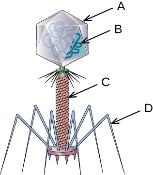

### Learning Objectives

* Describe the general characteristics of viruses as pathogens
* Describe viral genomes
* Describe the general characteristics of viral life cycles
* Differentiate among bacteriophages, plant viruses, and animal viruses
* Describe the characteristics used to identify viruses as obligate intracellular parasites

Part 1

David, a 45-year-old journalist, has just returned to the U.S. from travels in Russia, China, and Africa. He is not feeling well, so he goes to his general practitioner complaining of weakness in his arms and legs, fever, headache, noticeable agitation, and minor discomfort. He thinks it may be related to a dog bite he suffered while interviewing a Chinese farmer. He is experiencing some prickling and itching sensations at the site of the bite wound, but he tells the doctor that the dog seemed healthy and that he had not been concerned until now. The doctor ordered a culture and sensitivity test to rule out bacterial infection of the wound, and the results came back negative for any possible pathogenic bacteria.

* Based on this information, what additional tests should be performed on the patient?
* What type of treatment should the doctor recommend?
{: data-bullet-style="bullet"}

*Jump to the [next](#fs-id1168328286182) Clinical Focus box.*

Despite their small size, which prevented them from being seen with light microscopes, the discovery of a filterable component smaller than a bacterium that causes **tobacco mosaic disease**{: data-type="term" .no-emphasis} (TMD) dates back to 1892.[1](#footnote1){: data-type="footnote-link"} At that time, Dmitri **Ivanovski**{: data-type="term" .no-emphasis}, a Russian botanist, discovered the source of TMD by using a porcelain filtering device first invented by Charles **Chamberland**{: data-type="term" .no-emphasis} and Louis **Pasteur**{: data-type="term" .no-emphasis} in Paris in 1884. Porcelain **Chamberland filters**{: data-type="term" .no-emphasis} have a pore size of 0.1 µm, which is small enough to remove all bacteria ≥0.2 µm from any liquids passed through the device. An extract obtained from TMD-infected tobacco plants was made to determine the cause of the disease. Initially, the source of the disease was thought to be bacterial. It was surprising to everyone when Ivanovski, using a Chamberland filter, found that the cause of TMD was not removed after passing the extract through the porcelain filter. So if a bacterium was not the cause of TMD, what could be causing the disease? Ivanovski concluded the cause of TMD must be an extremely small bacterium or bacterial spore. Other scientists, including Martinus **Beijerinck**{: data-type="term" .no-emphasis}, continued investigating the cause of TMD. It was Beijerinck, in 1899, who eventually concluded the causative agent was not a bacterium but, instead, possibly a chemical, like a biological poison we would describe today as a toxin. As a result, the word *virus*, Latin for poison, was used to describe the cause of TMD a few years after Ivanovski’s initial discovery. Even though he was not able to see the virus that caused TMD, and did not realize the cause was not a bacterium, Ivanovski is credited as the original discoverer of viruses and a founder of the field of virology.

Today, we can see viruses using electron microscopes ([\[link\]](#OSC_Microbio_06_01_TMV)) and we know much more about them. Viruses are distinct biological entities; however, their evolutionary origin is still a matter of speculation. In terms of taxonomy, they are not included in the tree of life because they are **acellular**{: data-type="term"} (not consisting of cells). In order to survive and reproduce, viruses must infect a cellular host, making them obligate intracellular parasites. The genome of a virus enters a host cell and directs the production of the viral components, proteins and nucleic acids, needed to form new virus particles called **virion**{: data-type="term"}**s**. New virions are made in the host cell by assembly of viral components. The new virions transport the viral genome to another host cell to carry out another round of infection. [\[link\]](#fs-id1168327918159) summarizes the properties of viruses.

|  |
| Characteristics of Viruses |
|----------
| Infectious, acellular pathogens |
| Obligate intracellular parasites with host and cell-type specificity |
| DNA or RNA genome (never both) |
| Genome is surrounded by a protein capsid and, in some cases, a phospholipid membrane studded with viral glycoproteins |
| Lack genes for many products needed for successful reproduction, requiring exploitation of host-cell genomes to reproduce |
{: summary="Characteristics of viruses: acellular, infectious, obligate intracellular parasites, host and cell-type specificity, DNA or RNA genome (never both), Genome is surrounded by a protein capsid and, in some cases, a phospholipid membrane studded with viral glycoproteins, Genome lacks genes for many products needed for successful reproduction, requiring exploitation of host-cell genomes to reproduce" .span-all}

  Tobacco mosaic virus (TMV) viewed with transmission electron microscope. (b) Plants infected with tobacco mosaic disease (TMD), caused by TMV. (credit a: modification of work by USDA Agricultural Research Service&#x2014;scale-bar data from Matt Russell; credit b: modification of work by USDA Forest Service, Department of Plant Pathology Archive North Carolina State University)"){: #OSC_Microbio_06_01_TMV}

* Why was the first virus investigated mistaken for a toxin?

### Hosts and Viral Transmission

Viruses can infect every type of host cell, including those of plants, animals, fungi, protists, bacteria, and archaea. Most viruses will only be able to infect the cells of one or a few species of organism. This is called the **host range**{: data-type="term"}. However, having a wide host range is not common and viruses will typically only infect specific hosts and only specific cell types within those hosts. The viruses that infect bacteria are called **bacteriophage**{: data-type="term"}**s**, or simply phages. The word *phage* comes from the Greek word for devour. Other viruses are just identified by their host group, such as animal or plant viruses. Once a cell is infected, the effects of the virus can vary depending on the type of virus. Viruses may cause abnormal growth of the cell or cell death, alter the cell’s genome, or cause little noticeable effect in the cell.

Viruses can be transmitted through direct contact, indirect contact with **fomites**{: data-type="term" .no-emphasis}, or through a **vector**{: data-type="term"}\: an animal that transmits a pathogen from one host to another. Arthropods such as mosquitoes, ticks, and flies, are typical vectors for viral diseases, and they may act as **mechanical vector**{: data-type="term"}**s** or **biological vector**{: data-type="term"}**s**. Mechanical transmission occurs when the arthropod carries a viral pathogen on the outside of its body and transmits it to a new host by physical contact. Biological transmission occurs when the arthropod carries the viral pathogen inside its body and transmits it to the new host through biting.

In humans, a wide variety of viruses are capable of causing various infections and diseases. Some of the deadliest emerging pathogens in humans are viruses, yet we have few treatments or drugs to deal with viral infections, making them difficult to eradicate.

Viruses that can be transmitted from an animal host to a human host can cause **zoonoses**{: data-type="term" .no-emphasis}. For example, the avian influenza virus originates in birds, but can cause disease in humans. **Reverse zoonoses**{: data-type="term" .no-emphasis} are caused by infection of an animal by a virus that originated in a human.

Fighting Bacteria with Viruses

The emergence of superbugs, or **multidrug resistant bacteria**{: data-type="term" .no-emphasis}, has become a major challenge for pharmaceutical companies and a serious health-care problem. According to a 2013 report by the US Centers for Disease Control and Prevention (CDC), more than 2 million people are infected with drug-resistant bacteria in the US annually, resulting in at least 23,000 deaths.[2](#footnote2){: data-type="footnote-link"} The continued use and overuse of **antibiotics**{: data-type="term" .no-emphasis} will likely lead to the evolution of even more drug-resistant strains.

One potential solution is the use of **phage therapy**{: data-type="term" .no-emphasis}, a procedure that uses bacteria-killing viruses (bacteriophages) to treat bacterial infections. Phage therapy is not a new idea. The discovery of bacteriophages dates back to the early 20th century, and phage therapy was first used in Europe in 1915 by the English bacteriologist Frederick **Twort**{: data-type="term" .no-emphasis}.[3](#footnote3){: data-type="footnote-link"} However, the subsequent discovery of penicillin and other antibiotics led to the near abandonment of this form of therapy, except in the former Soviet Union and a few countries in Eastern Europe. Interest in phage therapy outside of the countries of the former Soviet Union is only recently re-emerging because of the rise in antibiotic-resistant bacteria.[4](#footnote4){: data-type="footnote-link"}

Phage therapy has some advantages over antibiotics in that phages kill only one specific bacterium, whereas antibiotics kill not only the pathogen but also beneficial bacteria of the normal microbiota. Development of new antibiotics is also expensive for drug companies and for patients, especially for those who live in countries with high poverty rates.

Phages have also been used to prevent food spoilage. In 2006, the US Food and Drug Administration approved the use of a solution containing six bacteriophages that can be sprayed on lunch meats such as bologna, ham, and turkey to kill *Listeria monocytogenes*, a bacterium responsible for listeriosis, a form of food poisoning. Some consumers have concerns about the use of phages on foods, however, especially given the rising popularity of organic products. Foods that have been treated with phages must declare “**bacteriophage preparation**{: data-type="term" .no-emphasis}” in the list of ingredients or include a label declaring that the meat has been “treated with antimicrobial solution to reduce microorganisms.”[5](#footnote5){: data-type="footnote-link"}

* Why do humans not have to be concerned about the presence of bacteriophages in their food?
* What are three ways that viruses can be transmitted between hosts?

### Viral Structures

In general, virions (viral particles) are small and cannot be observed using a regular light microscope. They are much smaller than prokaryotic and eukaryotic cells; this is an adaptation allowing viruses to infect these larger cells (see [\[link\]](#OSC_Microbio_06_01_virusbac)). The size of a virion can range from 20 nm for small viruses up to 900 nm for typical, large viruses (see [\[link\]](#OSC_Microbio_06_01_sizes)). Recent discoveries, however, have identified new **giant viral species**{: data-type="term" .no-emphasis}, such as *Pandoravirus salinus* and *Pithovirus sibericum*, with sizes approaching that of a bacterial cell.[6](#footnote6){: data-type="footnote-link"}

  In this transmission electron micrograph, a bacteriophage (a virus that infects bacteria) is dwarfed by the bacterial cell it infects. (b) An illustration of the bacteriophage in the micrograph. (credit a: modification of work by U.S. Department of Energy, Office of Science, LBL, PBD)"){: #OSC_Microbio_06_01_virusbac}

{: #OSC_Microbio_06_01_sizes}

In 1935, after the development of the electron microscope, Wendell **Stanley**{: data-type="term" .no-emphasis} was the first scientist to crystallize the structure of the **tobacco mosaic virus**{: data-type="term" .no-emphasis} and discovered that it is composed of RNA and protein. In 1943, he isolated ***Influenza B virus***{: data-type="term" .no-emphasis}, which contributed to the development of an influenza (flu) vaccine. Stanley’s discoveries unlocked the mystery of the nature of viruses that had been puzzling scientists for over 40 years and his contributions to the field of virology led to him being awarded the Nobel Prize in 1946.

As a result of continuing research into the nature of viruses, we now know they consist of a nucleic acid (either RNA or DNA, but never both) surrounded by a protein coat called a **capsid**{: data-type="term"} (see [\[link\]](#OSC_Microbio_06_01_structure)). The interior of the capsid is not filled with cytosol, as in a cell, but instead it contains the bare necessities in terms of genome and enzymes needed to direct the synthesis of new virions. Each capsid is composed of protein subunits called **capsomere**{: data-type="term"}**s** made of one or more different types of capsomere proteins that interlock to form the closely packed capsid.

There are two categories of viruses based on general composition. Viruses formed from only a nucleic acid and capsid are called **naked virus**{: data-type="term"}**es** or **nonenveloped virus**{: data-type="term"}**es**. Viruses formed with a nucleic-acid packed capsid surrounded by a lipid layer are called **enveloped virus**{: data-type="term"}**es** (see [\[link\]](#OSC_Microbio_06_01_structure)). The **viral envelope**{: data-type="term"} is a small portion of phospholipid membrane obtained as the virion buds from a host cell. The viral envelope may either be intracellular or cytoplasmic in origin.

Extending outward and away from the capsid on some naked viruses and enveloped viruses are protein structures called **spike**{: data-type="term"}**s**. At the tips of these spikes are structures that allow the virus to attach and enter a cell, like the influenza virus hemagglutinin spikes (H) or enzymes like the neuraminidase (N) influenza virus spikes that allow the virus to detach from the cell surface during release of new virions. Influenza viruses are often identified by their H and N spikes. For example, **H1N1 influenza**{: data-type="term" .no-emphasis} viruses were responsible for the pandemics in 1918 and 2009,[7](#footnote7){: data-type="footnote-link"} **H2N2**{: data-type="term" .no-emphasis} for the pandemic in 1957, and H3N2 for the pandemic in 1968.

  The naked atadenovirus uses spikes made of glycoproteins from its capsid to bind to host cells. (b) The enveloped human immunodeficiency virus uses spikes made of glycoproteins embedded in its envelope to bind to host cells (credit a &#x201C;micrograph&#x201D;: modification of work by NIAID; credit b &#x201C;micrograph&#x201D;: modification of work by Centers for Disease Control and Prevention)"){: #OSC_Microbio_06_01_structure}

Viruses vary in the shape of their capsids, which can be either **helical**{: data-type="term"}, **polyhedral**{: data-type="term"}, or **complex**{: data-type="term"}. A helical capsid forms the shape of tobacco mosaic virus (TMV), a naked **helical virus**{: data-type="term" .no-emphasis}, and Ebola virus, an enveloped helical virus. The capsid is cylindrical or rod shaped, with the genome fitting just inside the length of the capsid. Polyhedral capsids form the shapes of poliovirus and rhinovirus, and consist of a nucleic acid surrounded by a polyhedral (many-sided) capsid in the form of an icosahedron. An **icosahedral**{: data-type="term"} capsid is a three-dimensional, 20-sided structure with 12 vertices. These capsids somewhat resemble a soccer ball. Both helical and polyhedral viruses can have envelopes. Viral shapes seen in certain types of bacteriophages, such as T4 phage, and poxviruses, like vaccinia virus, may have features of both polyhedral and helical viruses so they are described as a complex viral shape (see [\[link\]](#OSC_Microbio_06_01_shapes)). In the bacteriophage complex form, the genome is located within the polyhedral head and the **sheath**{: data-type="term"} connects the head to the **tail fiber**{: data-type="term"}**s** and **tail pins**{: data-type="term"} that help the virus attach to receptors on the host cell’s surface. Poxviruses that have complex shapes are often brick shaped, with intricate surface characteristics not seen in the other categories of capsid.

  helical, (b) polyhedral, or (c) have a complex shape. (credit a &#x201C;micrograph&#x201D;: modification of work by USDA ARS; credit b &#x201C;micrograph&#x201D;: modification of work by U.S. Department of Energy)"){: #OSC_Microbio_06_01_shapes}

* Which types of viruses have spikes?

### Classification and Taxonomy of Viruses

Although viruses are not classified in the three domains of life, their numbers are great enough to require classification. Since 1971, the **International Union of Microbiological Societies**{: data-type="term" .no-emphasis} Virology Division has given the task of developing, refining, and maintaining a universal virus taxonomy to the **International Committee on Taxonomy of Viruses (ICTV)**{: data-type="term" .no-emphasis}. Since viruses can mutate so quickly, it can be difficult to classify them into a genus and a species epithet using the binomial nomenclature system. Thus, the ICTV’s viral nomenclature system classifies viruses into families and genera based on viral genetics, chemistry, morphology, and mechanism of multiplication. To date, the ICTV has classified known viruses in seven orders, 96 families, and 350 genera. Viral family names end in -*viridae* (e.g, *Parvoviridae*) and genus names end in *−virus* (e.g., *Parvovirus*). The names of viral orders, families, and genera are all italicized. When referring to a viral species, we often use a genus and species epithet such as *Pandoravirus dulcis* or *Pandoravirus salinus.*

The **Baltimore classification system**{: data-type="term" .no-emphasis} is an alternative to ICTV nomenclature. The Baltimore system classifies viruses according to their genomes (DNA or RNA, single versus double stranded, and mode of replication). This system thus creates seven groups of viruses that have common genetics and biology.

Explore the latest virus [taxonomy][1] at the ICTV website.

Aside from formal systems of nomenclature, viruses are often informally grouped into categories based on chemistry, morphology, or other characteristics they share in common. Categories may include naked or enveloped structure, single-stranded (ss) or double-stranded (ds) DNA or ss or ds RNA genomes, segmented or nonsegmented genomes, and positive-strand (+) or negative-strand (−) RNA. For example, herpes viruses can be classified as a dsDNA enveloped virus; human immunodeficiency virus (HIV) is a +ssRNA enveloped virus, and tobacco mosaic virus is a +ssRNA virus. Other characteristics such as host specificity, tissue specificity, capsid shape, and special genes or enzymes may also be used to describe groups of similar viruses. [\[link\]](#fs-id1168328363596) lists some of the most common viruses that are human pathogens by genome type.

<table summary="This table separates viruses based on genome structure. The first section identifies examples of dsDNA enveloped viruses. Examples include the poxviridae family which includes orthopoxvirus which causes skin papules, pustules, and lesions and parapoxvirus which causes skin lesions. Herpesviridae family is also dsDNA enveloped and includes simplexvirus which causes cold sores, genital herpes, and sexually transmitted disease. The next section identifies examples of dsDNA naked viurses. This includes the Adenoviridae family such as Atadenovirus which causes respiratory infection (common cold); the Papillomaviridae family such as Papillomavirus which causes genital warts, cervical, vulvar or vaginal cancer; and Reoviridae such as reovirus which causes gasteroenteritis severe diarrhea (stomach flu). The next section identifies examples of ssDNA naked viruses. This includes the Parvoridae family such as Adeno-associated dependoparvovirus A and B which cause respiratory tract infections. The next section identifies examples of dsRNA naked viruses such as the Reoviridae family which includes Rotavirus which causes gastroenteritis. The next section identifies examples of +ssRNA naked viruses. This includes the family Picornaviridae which includes Enterovirus C which causes poliomyelitis, Rhinovirus which causes upper respiratory tract infections (common cold) and Hepatovirus which causes Hepatitis. The next section identifies examples of +ssRNA enveloped viruses. This includes the Togaviridae family which includes Alphavirus which causes encephalitis and hemorrhagic fever and rubivirus which causes rubella. This also includes the Retroviridae family which includes Lentivirus which causes Acquired immune deficiency syndrome (AIDS). The last section identifies examples of &#x2212;ssRNA enveloped viruses. This includes the Riloviridae family which includes Zaiere Ebolavirus which causes hemorrhagic fever; the Orthomyxoviridae family which includes Influenzavirus A, B, and C which cause flu; and the Rhabdoviridae family which causes Lyssavirus which causes Rabies." class="span-all"><thead>
<tr>
<th colspan="4" data-align="center">Common Pathogenic Viruses</th>
</tr>
<tr>
<th data-valign="top" data-align="left"><strong>Genome</strong></th>
<th data-valign="top" data-align="left"><strong>Family</strong></th>
<th data-valign="top" data-align="left"><strong>Example Virus</strong></th>
<th data-valign="top" data-align="left"><strong>Clinical Features</strong></th>
</tr>
</thead><tbody>
<tr>
<td rowspan="3" data-valign="middle" data-align="left">dsDNA, enveloped</td>
<td data-valign="middle" data-align="left"><em>Poxviridae</em></td>
<td data-valign="middle" data-align="left"><em>Orthopoxvirus</em></td>
<td data-valign="top" data-align="left">Skin papules, pustules, lesions</td>
</tr>
<tr>
<td data-valign="middle" data-align="left"><em>Poxviridae</em></td>
<td data-valign="middle" data-align="left"><em>Parapoxvirus</em></td>
<td data-valign="middle" data-align="left">Skin lesions</td>
</tr>
<tr>
<td data-valign="middle" data-align="left"><em>Herpesviridae</em></td>
<td data-valign="middle" data-align="left"><em>Simplexvirus</em></td>
<td data-valign="top" data-align="left">Cold sores, genital herpes, sexually transmitted disease</td>
</tr>
<tr>
<td rowspan="3" data-valign="middle" data-align="left">dsDNA, naked</td>
<td data-valign="middle" data-align="left"><em>Adenoviridae</em></td>
<td data-valign="middle" data-align="left"><em>Atadenovirus</em></td>
<td data-valign="top" data-align="left">Respiratory infection (common cold)</td>
</tr>
<tr>
<td data-valign="middle" data-align="left"><em>Papillomaviridae</em></td>
<td data-valign="middle" data-align="left"><em>Papillomavirus</em></td>
<td data-valign="middle" data-align="left">Genital warts, cervical, vulvar, or vaginal cancer</td>
</tr>
<tr>
<td data-valign="middle" data-align="left"><em>Reoviridae</em></td>
<td data-valign="middle" data-align="left"><em>Reovirus</em></td>
<td data-valign="middle" data-align="left">Gastroenteritis severe diarrhea (stomach flu)</td>
</tr>
<tr>
<td rowspan="2" data-valign="middle" data-align="left">ssDNA, naked</td>
<td data-valign="middle" data-align="left"><em>Parvoviridae</em></td>
<td data-valign="middle" data-align="left"><em>Adeno-associated dependoparvovirus A</em></td>
<td data-valign="middle" data-align="left">Respiratory tract infection</td>
</tr>
<tr>
<td data-valign="middle" data-align="left"><em>Parvoviridae</em></td>
<td data-valign="middle" data-align="left"><em>Adeno-associated dependoparvovirus B</em></td>
<td data-valign="middle" data-align="left">Respiratory tract infection</td>
</tr>
<tr>
<td data-valign="middle" data-align="left">dsRNA, naked</td>
<td data-valign="middle" data-align="left"><em>Reoviridae</em></td>
<td data-valign="middle" data-align="left"><em>Rotavirus</em></td>
<td data-valign="middle" data-align="left">Gastroenteritis</td>
</tr>
<tr>
<td rowspan="3" data-valign="middle" data-align="left">+ssRNA, naked</td>
<td data-valign="middle" data-align="left"><em>Picornaviridae</em></td>
<td data-valign="middle" data-align="left"><em>Enterovirus C</em></td>
<td data-valign="middle" data-align="left">Poliomyelitis</td>
</tr>
<tr>
<td data-valign="middle" data-align="left"><em>Picornaviridae</em></td>
<td data-valign="middle" data-align="left"><em>Rhinovirus</em></td>
<td data-valign="middle" data-align="left">Upper respiratory tract infection (common cold)</td>
</tr>
<tr>
<td data-valign="middle" data-align="left"><em>Picornaviridae</em></td>
<td data-valign="middle" data-align="left"><em>Hepatovirus</em></td>
<td data-valign="middle" data-align="left">Hepatitis</td>
</tr>
<tr>
<td rowspan="3" data-valign="middle" data-align="left">+ssRNA, enveloped</td>
<td data-valign="middle" data-align="left"><em>Togaviridae</em></td>
<td data-valign="middle" data-align="left"><em>Alphavirus</em></td>
<td data-valign="middle" data-align="left">Encephalitis, hemorrhagic fever</td>
</tr>
<tr>
<td data-valign="middle" data-align="left"><em>Togaviridae</em></td>
<td data-valign="middle" data-align="left"><em>Rubivirus</em></td>
<td data-valign="middle" data-align="left">Rubella</td>
</tr>
<tr>
<td data-valign="middle" data-align="left"><em>Retroviridae</em></td>
<td data-valign="middle" data-align="left"><em>Lentivirus</em></td>
<td data-valign="middle" data-align="left">Acquired immune deficiency syndrome (AIDS)</td>
</tr>
<tr>
<td rowspan="3" data-valign="middle" data-align="left">−ssRNA, enveloped</td>
<td data-valign="middle" data-align="left"><em>Filoviridae</em></td>
<td data-valign="middle" data-align="left"><em>Zaire Ebolavirus</em></td>
<td data-valign="middle" data-align="left">Hemorrhagic fever</td>
</tr>
<tr>
<td data-valign="middle" data-align="left"><em>Orthomyxoviridae</em></td>
<td data-valign="middle" data-align="left"><em>Influenzavirus A, B, C</em></td>
<td data-valign="middle" data-align="left">Flu</td>
</tr>
<tr>
<td data-valign="middle" data-align="left"><em>Rhabdoviridae</em></td>
<td data-valign="middle" data-align="left"><em>Lyssavirus</em></td>
<td data-valign="middle" data-align="left">Rabies</td>
</tr>
</tbody></table>

* What are the types of virus genomes?

#### Classification of Viral Diseases

While the ICTV has been tasked with the biological classification of viruses, it has also played an important role in the classification of diseases caused by viruses. To facilitate the tracking of virus-related human diseases, the ICTV has created classifications that link to the **International Classification of Diseases (ICD)**{: data-type="term" .no-emphasis}, the standard taxonomy of disease that is maintained and updated by the World Health Organization (WHO). The ICD assigns an alphanumeric code of up to six characters to every type of viral infection, as well as all other types of diseases, medical conditions, and causes of death. This ICD code is used in conjunction with two other coding systems (the Current Procedural Terminology, and the Healthcare Common Procedure Coding System) to categorize patient conditions for treatment and insurance reimbursement.

For example, when a patient seeks treatment for a viral infection, ICD codes are routinely used by clinicians to order laboratory tests and prescribe treatments specific to the virus suspected of causing the illness. This ICD code is then used by medical laboratories to identify tests that must be performed to confirm the diagnosis. The ICD code is used by the health-care management system to verify that all treatments and laboratory work performed are appropriate for the given virus. Medical coders use ICD codes to assign the proper code for procedures performed, and medical billers, in turn, use this information to process claims for reimbursement by insurance companies. Vital-records keepers use ICD codes to record cause of death on death certificates, and epidemiologists used ICD codes to calculate morbidity and mortality statistics.

* Identify two locations where you would likely find an ICD code.

Part 2

David’s doctor was concerned that his symptoms included prickling and itching at the site of the dog bite; these sensations could be early symptoms of rabies. Several tests are available to diagnose rabies in live patients, but no single antemortem test is adequate. The doctor decided to take samples of David’s blood, saliva, and skin for testing. The skin sample was taken from the nape of the neck (posterior side of the neck near the hairline). It was about 6-mm long and contained at least 10 hair follicles, including the superficial cutaneous nerve. An **immunofluorescent staining**{: data-type="term" .no-emphasis} technique was used on the skin biopsy specimen to detect rabies antibodies in the cutaneous nerves at the base of the hair follicles. A test was also performed on a serum sample from David’s blood to determine whether any antibodies for the rabies virus had been produced.

Meanwhile, the saliva sample was used for **reverse transcriptase-polymerase chain reaction (RT-PCR)**{: data-type="term" .no-emphasis} analysis, a test that can detect the presence of viral nucleic acid (RNA). The blood tests came back positive for the presence of rabies virus antigen, prompting David’s doctor to prescribe prophylactic treatment. David is given a series of intramuscular injections of human rabies immunoglobulin along with a series of rabies vaccines.

* Why does the immunofluorescent technique look for rabies antibodies rather than the rabies virus itself?
* If David has contracted rabies, what is his prognosis?
{: data-bullet-style="bullet"}

*Jump to the [next](/m58810#fs-id1168328293244) Clinical Focus box. Go back to the [previous](#fs-id1168328256872) Clinical Focus box.*

### Key Concepts and Summary

* Viruses are generally ultramicroscopic, typically from 20 nm to 900 nm in length. Some large viruses have been found.
* **Virions** are acellular and consist of a nucleic acid, DNA or RNA, but not both, surrounded by a protein **capsid**. There may also be a phospholipid membrane surrounding the capsid.
* Viruses are obligate intracellular parasites.
* Viruses are known to infect various types of cells found in plants, animals, fungi, protists, bacteria, and archaea. Viruses typically have limited **host ranges** and infect specific cell types.
* Viruses may have **helical**, **polyhedral,** or **complex** shapes.
* Classification of viruses is based on morphology, type of nucleic acid, host range, cell specificity, and enzymes carried within the virion.
* Like other diseases, viral diseases are classified using ICD codes.
{: data-bullet-style="bullet"}

### Multiple Choice

The component(s) of a virus that is/are extended from the envelope for attachment is/are the:

1.  capsomeres
2.  spikes
3.  nucleic acid
4.  viral whiskers
{: data-number-style="upper-alpha"}

B

Which of the following does a virus lack? Select all that apply.

1.  ribosomes
2.  metabolic processes
3.  nucleic acid
4.  glycoprotein
{: data-number-style="upper-alpha"}

A and B

The envelope of a virus is derived from the host’s

1.  nucleic acids
2.  membrane structures
3.  cytoplasm
4.  genome
{: data-number-style="upper-alpha"}

B

In naming viruses, the family name ends with \_\_\_\_\_\_\_\_ and genus name ends with \_\_\_\_\_\_\_\_\_.

1.  *−virus; −viridae*
2.  *−viridae; −virus*
3.  *−virion; virus*
4.  *−virus; virion*
{: data-number-style="upper-alpha"}

B

What is another name for a nonenveloped virus?

1.  enveloped virus
2.  provirus
3.  naked virus
4.  latent virus
{: data-number-style="upper-alpha"}

C

### True/False

True or False: Scientists have identified viruses that are able to infect fungal cells.

True

### Fill in the Blank

A virus that infects a bacterium is called a/an \_\_\_\_\_\_\_\_\_\_\_\_\_\_\_\_\_\_\_.

bacteriophage

A/an \_\_\_\_\_\_\_\_\_\_ virus possesses characteristics of both a polyhedral and helical virus.

complex

A virus containing only nucleic acid and a capsid is called a/an \_\_\_\_\_\_\_\_\_\_\_\_\_\_\_\_\_\_\_ virus or \_\_\_\_\_\_\_\_\_\_\_\_\_\_\_\_\_\_ virus.

naked or nonenveloped

The \_\_\_\_\_\_\_\_\_\_\_\_ \_\_\_\_\_\_\_\_\_\_\_\_\_ on the bacteriophage allow for binding to the bacterial cell.

tail fibers

### Short Answer

Discuss the geometric differences among helical, polyhedral, and complex viruses.

What was the meaning of the word “virus” in the 1880s and why was it used to describe the cause of tobacco mosaic disease?

### Critical Thinking

Name each labeled part of the illustrated bacteriophage.

In terms of evolution, which do you think arises first? The virus or the host? Explain your answer.

Do you think it is possible to create a virus in the lab? Imagine that you are a mad scientist. Describe how you would go about creating a new virus.

### Footnotes
{: data-type="footnote-refs-title"}

* {: data-type="footnote-ref" #footnote1} [1](#footnote-ref1){: data-type="footnote-ref-link"} H. Lecoq. “\[Discovery of the First Virus, the Tobacco Mosaic Virus: 1892 or 1898?\].” *Comptes Rendus de l’Academie des Sciences – Serie III – Sciences de la Vie* 324, no. 10 (2001): 929–933.
* {: data-type="footnote-ref" #footnote2} [2](#footnote-ref2){: data-type="footnote-ref-link"} US Department of Health and Human Services, Centers for Disease Control and Prevention. “Antibiotic Resistance Threats in the United States, 2013.” http://www.cdc.gov/drugresistance/pdf/ar-threats-2013-508.pdf (accessed September 22, 2015).
* {: data-type="footnote-ref" #footnote3} [3](#footnote-ref3){: data-type="footnote-ref-link"} M. Clokie et al. “Phages in Nature.” *Bacteriophage* 1, no. 1 (2011): 31–45.
* {: data-type="footnote-ref" #footnote4} [4](#footnote-ref4){: data-type="footnote-ref-link"} A. Sulakvelidze et al. “Bacteriophage Therapy.” *Antimicrobial Agents and Chemotherapy* 45, no. 3 (2001): 649–659.
* {: data-type="footnote-ref" #footnote5} [5](#footnote-ref5){: data-type="footnote-ref-link"} US Food and Drug Administration. “FDA Approval of *Listeria*-specific Bacteriophage Preparation on Ready-to-Eat (RTE) Meat and Poultry Products.” http://www.fda.gov/food/ingredientspackaginglabeling/ucm083572.htm (accessed September 22, 2015).
* {: data-type="footnote-ref" #footnote6} [6](#footnote-ref6){: data-type="footnote-ref-link"} N. *Philippe et al. “Pandoraviruses: Amoeba Viruses with Genomes up to 2.5 Mb Reaching that of Parasitic Eukaryotes.” Science 341, no. 6143 (2013): 281–286.*
* {: data-type="footnote-ref" #footnote7} [7](#footnote-ref7){: data-type="footnote-ref-link"} J. Cohen. “What’s Old Is New: 1918 Virus Matches 2009 H1N1 Strain. *Science* 327, no. 5973 (2010): 1563–1564.
{: data-list-type="bulleted" data-bullet-style="none"}

[1]: https://www.openstax.org/l/22virustaxon
