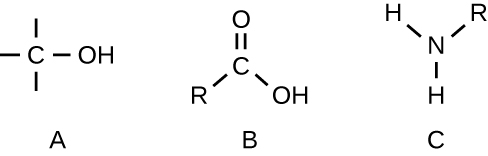

### Learning Objectives

* Identify common elements and structures found in organic molecules
* Explain the concept of isomerism
* Identify examples of functional groups
* Describe the role of functional groups in synthesizing polymers

Part 1

Penny is a 16-year-old student who visited her doctor, complaining about an itchy skin rash. She had a history of allergic episodes. The doctor looked at her sun-tanned skin and asked her if she switched to a different sunscreen. She said she had, so the doctor diagnosed an allergic eczema. The symptoms were mild so the doctor told Penny to avoid using the sunscreen that caused the reaction and prescribed an over-the-counter moisturizing cream to keep her skin hydrated and to help with itching.

* What kinds of substances would you expect to find in a moisturizing cream?
* What physical or chemical properties of these substances would help alleviate itching and inflammation of the skin?
{: data-bullet-style="bullet"}

*Jump to the [next](/m58815#fs-id1167662559579) Clinical Focus box.*

Biochemistry is the discipline that studies the chemistry of life, and its objective is to explain form and function based on chemical principles. Organic chemistry is the discipline devoted to the study of carbon-based chemistry, which is the foundation for the study of biomolecules and the discipline of **biochemistry**{: data-type="term" .no-emphasis}. Both biochemistry and **organic chemistry**{: data-type="term" .no-emphasis} are based on the concepts of general chemistry, some of which are presented in [Appendix A](/m58946){: .target-chapter}.

### Elements in Living Cells

The most abundant element in cells is hydrogen (H), followed by carbon (C), oxygen (O), nitrogen (N), phosphorous (P), and sulfur (S). We call these elements **macronutrient**{: data-type="term"}**s**, and they account for about 99% of the dry weight of cells. Some elements, such as sodium (Na), potassium (K), magnesium (Mg), zinc (Zn), iron (Fe), calcium (Ca), molybdenum (Mo), copper (Cu), cobalt (Co), manganese (Mn), or vanadium (Va), are required by some cells in very small amounts and are called **micronutrient**{: data-type="term"}**s** or **trace element**{: data-type="term"}**s**. All of these elements are essential to the function of many biochemical reactions, and, therefore, are essential to life.

The four most abundant elements in living matter (C, N, O, and H) have low atomic numbers and are thus light elements capable of forming strong bonds with other atoms to produce molecules ([\[link\]](#OSC_Microbio_07_01_commonMol)). Carbon forms four chemical bonds, whereas nitrogen forms three, oxygen forms two, and hydrogen forms one. When bonded together within molecules, oxygen, sulfur, and nitrogen often have one or more “lone pairs” of electrons that play important roles in determining many of the molecules’ physical and chemical properties (see [Appendix A](/m58946){: .target-chapter}). These traits in combination permit the formation of a vast number of diverse molecular species necessary to form the structures and enable the functions of living organisms.

 ![Carbon dioxide (CO2) has a carbon atom in the center. This carbon atom is double bonded to an oxygen on the left and another oxygen on the right. Ammonia NH3 has a nitrogen attached to 3 hydrogen atoms. Oxygen (O2) has two oxygen atoCarbon dioxide (CO2) has a carbon atom in the center. This carbon atom is double bonded to an oxygen on the left and another oxygen on the right. Ammonia NH3 has a nitrogen attached to 3 hydrogen atoms. Oxygen (O2) has two oxygen atoms double bonded to each other.ms double bonded to each other.](../resources/OSC_Microbio_07_01_commonMol.jpg "Some common molecules include carbon dioxide, ammonia, and oxygen, which consist of combinations of oxygen atoms (red spheres), carbon atoms (gray spheres), hydrogen atoms (white spheres), or nitrogen atoms (blue spheres)."){: #OSC_Microbio_07_01_commonMol}

Living organisms contain **inorganic compound**{: data-type="term" .no-emphasis}s (mainly water and salts; see [Appendix A](/m58946){: .target-chapter}) and organic molecules. Organic molecules contain carbon; inorganic compounds do not. Carbon oxides and carbonates are exceptions; they contain carbon but are considered inorganic because they do not contain hydrogen. The atoms of an **organic molecule**{: data-type="term"} are typically organized around chains of carbon atoms.

Inorganic compounds make up 1%–1.5% of a living cell’s mass. They are small, simple compounds that play important roles in the cell, although they do not form cell structures. Most of the carbon found in organic molecules originates from inorganic carbon sources such as carbon dioxide captured via **carbon fixation**{: data-type="term" .no-emphasis} by microorganisms.

* Describe the most abundant elements in nature.
* Describe the most abundant elements in natureWhat are the differences between organic and inorganic molecules?
{: data-bullet-style="bullet"}

### Organic Molecules and Isomerism

Organic molecules in organisms are generally larger and more complex than inorganic molecules. Their carbon skeletons are held together by covalent bonds. They form the cells of an organism and perform the chemical reactions that facilitate life. All of these molecules, called **biomolecule**{: data-type="term"}**s** because they are part of living matter, contain carbon, which is the building block of life. Carbon is a very unique element in that it has four valence electrons in its outer orbitals and can form four single covalent bonds with up to four other atoms at the same time (see [Appendix A](/m58946){: .target-chapter}). These atoms are usually oxygen, hydrogen, nitrogen, sulfur, phosphorous, and carbon itself; the simplest organic compound is methane, in which carbon binds only to hydrogen ([\[link\]](#OSC_Microbio_07_01_methane)).

As a result of carbon’s unique combination of size and bonding properties, carbon atoms can bind together in large numbers, thus producing a chain or **carbon skeleton**{: data-type="term"}. The carbon skeleton of organic molecules can be straight, branched, or ring shaped (cyclic). Organic molecules are built on chains of carbon atoms of varying lengths; most are typically very long, which allows for a huge number and variety of compounds. No other element has the ability to form so many different molecules of so many different sizes and shapes.

 , depicted here."){: #OSC_Microbio_07_01_methane}

Molecules with the same atomic makeup but different structural arrangement of atoms are called **isomers**{: data-type="term"}. The concept of **isomerism**{: data-type="term" .no-emphasis} is very important in chemistry because the structure of a molecule is always directly related to its function. Slight changes in the structural arrangements of atoms in a molecule may lead to very different properties. Chemists represent molecules by their **structural formula**{: data-type="term"}, which is a graphic representation of the molecular structure, showing how the atoms are arranged. Compounds that have identical molecular formulas but differ in the bonding sequence of the atoms are called **structural isomers**{: data-type="term"}. The **monosaccharides**{: data-type="term" .no-emphasis} **glucose**{: data-type="term" .no-emphasis}, **galactose**{: data-type="term" .no-emphasis}, and **fructose**{: data-type="term" .no-emphasis} all have the same molecular formula, C6H12O6, but we can see from [\[link\]](#OSC_Microbio_07_01_isomers) that the atoms are bonded together differently.

 , but these structural isomers differ in their physical and chemical properties."){: #OSC_Microbio_07_01_isomers}

Isomers that differ in the spatial arrangements of atoms are called **stereoisomers**{: data-type="term"}; one unique type is **enantiomers**{: data-type="term"}. The properties of enantiomers were originally discovered by Louis **Pasteur**{: data-type="term" .no-emphasis} in 1848 while using a microscope to analyze crystallized fermentation products of wine. Enantiomers are molecules that have the characteristic of **chirality**{: data-type="term"}, in which their structures are nonsuperimposable mirror images of each other. Chirality is an important characteristic in many biologically important molecules, as illustrated by the examples of structural differences in the enantiomeric forms of the monosaccharide glucose or the amino acid alanine ([\[link\]](#OSC_Microbio_07_01_monoglucos)).

Many organisms are only able to use one enantiomeric form of certain types of molecules as nutrients and as building blocks to make structures within a cell. Some enantiomeric forms of amino acids have distinctly different tastes and smells when consumed as food. For example, L-aspartame, commonly called aspartame, tastes sweet, whereas D-aspartame is tasteless. Drug enantiomers can have very different pharmacologic affects. For example, the compound methorphan exists as two enantiomers, one of which acts as an antitussive (*dextro*methorphan, a cough suppressant), whereas the other acts as an analgesic (*levo*methorphan, a drug similar in effect to codeine).

 ![Diagrams showing enantiomers; each diagram has 2 molecules with a dashed line labeled &#x201C;mirror&#x201D; in between them. The chemical formula for D and L glucose both have a 6 C chain with a double bonded O at the top carbon. Each of the other carbons has an OH on the opposite side &#x2013; for example the OH on the second carbon is on the right in D-glucose and on the left in L-glucose. D-alanine and L-alanine both have a 3 carbon chain, but the NH2 group is on opposite sides of the chain in each of these.](../resources/OSC_Microbio_07_01_monoglucos.jpg "Enantiomers are stereoisomers that exhibit chirality. Their chemical structures are nonsuperimposable mirror images of each other. (a) D-glucose and L-glucose are monosaccharides that are enantiomers. (b) The enantiomers D-alanine and L-alanine are enantiomers found in bacterial cell walls and human cells, respectively."){: #OSC_Microbio_07_01_monoglucos}

Enantiomers are also called optical isomers because they can rotate the plane of polarized light. Some of the crystals Pasteur observed from wine fermentation rotated light clockwise whereas others rotated the light counterclockwise. Today, we denote enantiomers that rotate polarized light clockwise (+) as ***d* form**{: data-type="term" .no-emphasis}s, and the mirror image of the same molecule that rotates polarized light counterclockwise (−) as the ***l* form**{: data-type="term" .no-emphasis}. The *d* and *l* labels are derived from the Latin words *dexter* (on the right) and *laevus* (on the left), respectively. These two different optical isomers often have very different biological properties and activities. Certain species of molds, yeast, and bacteria, such as ***Rhizopus***{: data-type="term" .no-emphasis}, ***Yarrowia***{: data-type="term" .no-emphasis}, and ***Lactobacillus***{: data-type="term" .no-emphasis} spp., respectively, can only metabolize one type of optical isomer; the opposite isomer is not suitable as a source of nutrients. Another important reason to be aware of optical isomers is the therapeutic use of these types of chemicals for drug treatment, because some microorganisms can only be affected by one specific optical isomer.

* We say that life is carbon based. What makes carbon so suitable to be part of all the macromolecules of living organisms?
{: data-bullet-style="bullet"}

### Biologically Significant Functional Groups

In addition to containing carbon atoms, biomolecules also contain **functional groups**{: data-type="term"}—groups of atoms within molecules that are categorized by their specific chemical composition and the chemical reactions they perform, regardless of the molecule in which the group is found. Some of the most common functional groups are listed in [\[link\]](#OSC_Microbio_07_01_TBLcomFun). In the formulas, the symbol R stands for “residue” and represents the remainder of the molecule. R might symbolize just a single hydrogen atom or it may represent a group of many atoms. Notice that some functional groups are relatively simple, consisting of just one or two atoms, while some comprise two of these simpler functional groups. For example, a carbonyl group is a functional group composed of a carbon atom double bonded to an oxygen atom: C=O. It is present in several classes of organic compounds as part of larger functional groups such as ketones, aldehydes, carboxylic acids, and amides. In ketones, the carbonyl is present as an internal group, whereas in aldehydes it is a terminal group.

 ![Table titled: Common functional groups found in biomolecules; 3 columns, name, functional group and class of compound.  Aldehyde has a red C  double bonded O and an H; the C is also bound to a black R. This is found in carbohydrates. Amine has a red C double bonded to an O and single bonded to an NH. The C and the N are each also bound to a black R. This is found in proteins. Amino has a red NH2 bound to a black R. This is found in amino acids and proteins. Phosphate has a red PO3H2; the P is also bound to a black R. This is found in nucleic acids, phospholipids and ATP. Carbonyl has a red C double bonded to an O; the C is also bound to 2 black Rs. This is found in ketones, aldehydes, carboxylic acids, amides. Carboxylic acid has a red C double bonded to an O and to an OH; the C is also bound to a black R. This is found in amino acids, proteins, and fatty acids. Ester has a red C double bonded to an O and single bonded to another O. The C is bound to a black R and the single bonded O is also bound to a black R. This is found in lipids and nucleic acids. Ether has a red O bound to 2 black Rs. This is found in disaccharides, polysaccharides, and lipids. Hydroxyl has a red OH bound to a black R; this is found in alcohols, monosaccharides, amino acids, and nucleic acids. Ketone has a red C double bonded to an O; the C is also bound to 2 black Rs. This is found in carbohydrates. Methyl has a red CH3 bound to a black R. This is found in methylated compounds such as methyl alcohols and methyl esters. Sulfhydryl has a black R bound to a red SH.. This is found in amino acids and proteins](../resources/OSC_Microbio_07_01_TBLcomFun.jpg){: #OSC_Microbio_07_01_TBLcomFun}

### Macromolecules

Carbon chains form the skeletons of most organic molecules. Functional groups combine with the chain to form biomolecules. Because these biomolecules are typically large, we call them **macromolecule**{: data-type="term"}s. Many biologically relevant macromolecules are formed by linking together a great number of identical, or very similar, smaller organic molecules. The smaller molecules act as building blocks and are called **monomer**{: data-type="term"}**s**, and the macromolecules that result from their linkage are called **polymer**{: data-type="term"}**s**. Cells and cell structures include four main groups of carbon-containing macromolecules: **polysaccharides**{: data-type="term" .no-emphasis}, **proteins**{: data-type="term" .no-emphasis}, **lipids**{: data-type="term" .no-emphasis}, and **nucleic acids**{: data-type="term" .no-emphasis}. The first three groups of molecules will be studied throughout this chapter. The biochemistry of nucleic acids will be discussed in [Biochemistry of the Genome](/m58834){: .target-chapter}.

Of the many possible ways that monomers may be combined to yield polymers, one common approach encountered in the formation of biological macromolecules is **dehydration synthesis**{: data-type="term"}. In this chemical reaction, monomer molecules bind end to end in a process that results in the formation of water molecules as a byproduct:

<math xmlns="http://www.w3.org/1998/Math/MathML"><mrow><mtext>H—monomer—OH</mtext><mo>+</mo><mtext>H—monomer—OH</mtext><mspace width="0.2em" /><mo stretchy="false">⟶</mo><mspace width="0.2em" /><mtext>H—monomer—monomer—OH</mtext><mo>+</mo><msub><mrow><mtext>H</mtext></mrow><mn>2</mn></msub><mtext>O</mtext></mrow></math>

[\[link\]](#OSC_Microbio_07_01_dehydrat) shows dehydration synthesis of **glucose**{: data-type="term" .no-emphasis} binding together to form maltose and a water molecule. [\[link\]](#fs-id1167663727696) summarizes macromolecules and some of their functions.

 {: #OSC_Microbio_07_01_dehydrat}

<table summary="A table titled some functions of macromolecules; two columns &#x2013; macromolecule and function. Carbohydrates function as: Energy storage, receptors, food, structural role in plants, fungal cell walls, exoskeletons of insects. Lipids function as: Energy storage, membrane structure, insulation, hormones, pigments. Nucleic acids function as : torage and transfer of genetic information. Proteins function as: Enzymes, structure, receptors, transport, structural role in the cytoskeleton of a cell and the extracellular matrix" class="span-all"><thead>
<tr>
<th colspan="2" data-align="center">Some Functions of Macromolecules</th>
</tr>
<tr valign="top">
<th data-valign="top" data-align="center">Macromolecule</th>
<th data-valign="top" data-align="center">Functions</th>
</tr>
</thead><tbody>
<tr valign="top">
<td data-valign="top" data-align="left">Carbohydrates</td>
<td data-valign="top" data-align="left">Energy storage, receptors, food, structural role in plants, fungal cell walls, exoskeletons of insects</td>
</tr>
<tr valign="top">
<td data-valign="top" data-align="left">Lipids</td>
<td data-valign="top" data-align="left">Energy storage, membrane structure, insulation, hormones, pigments</td>
</tr>
<tr valign="top">
<td data-valign="top" data-align="left">Nucleic acids</td>
<td data-valign="top" data-align="left">Storage and transfer of genetic information</td>
</tr>
<tr valign="top">
<td data-valign="top" data-align="left">Proteins</td>
<td data-valign="top" data-align="left">Enzymes, structure, receptors, transport, structural role in the cytoskeleton of a cell and the extracellular matrix</td>
</tr>
</tbody></table>

* What is the byproduct of a dehydration synthesis reaction?
{: data-bullet-style="bullet"}

### Key Concepts and Summary

* The most abundant elements in cells are hydrogen, carbon, oxygen, nitrogen, phosphorus, and sulfur.
* Life is carbon based. Each carbon atom can bind to another one producing a **carbon skeleton** that can be straight, branched, or ring shaped.
* The same numbers and types of atoms may bond together in different ways to yield different molecules called **isomers**. Isomers may differ in the bonding sequence of their atoms (**structural isomers**) or in the spatial arrangement of atoms whose bonding sequences are the same (**stereoisomers**), and their physical and chemical properties may vary slightly or drastically.
* **Functional groups** confer specific chemical properties to molecules bearing them. Common functional groups in biomolecules are hydroxyl, methyl, carbonyl, carboxyl, amino, phosphate, and sulfhydryl.
* **Macromolecules** are **polymers** assembled from individual units, the **monomers**, which bind together like building blocks. Many biologically significant macromolecules are formed by **dehydration synthesis**, a process in which monomers bind together by combining their functional groups and generating water molecules as byproducts.
{: data-bullet-style="bullet"}

### Multiple Choice

Which of these elements is *not* a micronutrient?

1.  C
2.  Ca
3.  Co
4.  Cu
{: data-number-style="upper-alpha"}

A

Which of the following is the name for molecules whose structures are nonsuperimposable mirror images?

1.  structural isomers
2.  monomers
3.  polymers
4.  enantiomers
{: data-number-style="upper-alpha"}

D

### True/False

Aldehydes, amides, carboxylic acids, esters, and ketones all contain carbonyl groups.

True

Two molecules containing the same types and numbers of atoms but different bonding sequences are called enantiomers.

False

### Short Answer

Why are carbon, nitrogen, oxygen, and hydrogen the most abundant elements in living matter and, therefore, considered macronutrients?

Identify the functional group in each of the depicted structural formulas.

### Critical Thinking

The structural formula shown corresponds to penicillin G, a narrow-spectrum antibiotic that is given intravenously or intramuscularly as a treatment for several bacterial diseases. The antibiotic is produced by fungi of the genus *Penicillium*. (a) Identify three major functional groups in this molecule that each comprise two simpler functional groups. (b) Name the two simpler functional groups composing each of the major functional groups identified in (a).

![A complex chemical figure begins with a ring of Cs; each C is double bonded to one other C.  Off this ring is a CH2, then a C with a double bonded O, then an NH, then a C in a square. This square has Cs in 3 corners and an N in the fourth. The top left C is attached to the previous components discussed here, the bottom left C is double bonded to an O. The top right C is bound to an S, which is bound to a C, which is bound to a CH, which is bound to the N in the square. Back to the C that is attached to the S &#x2013; this C is bound to two CH3s. The C attached to the N is bound to a C that is double bonded to an O and bound to an OH.](../resources/OSC_Microbio_07_01_fungroup_img.jpg)

