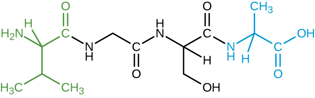

### Learning Objectives

* Describe the fundamental structure of an amino acid
* Describe the chemical structures of proteins
* Summarize the unique characteristics of proteins

At the beginning of this chapter, a famous experiment was described in which scientists synthesized **amino acid**{: data-type="term" .no-emphasis}s under conditions simulating those present on earth long before the evolution of life as we know it. These compounds are capable of bonding together in essentially any number, yielding molecules of essentially any size that possess a wide array of physical and chemical properties and perform numerous functions vital to all organisms. The molecules derived from amino acids can function as structural components of cells and subcellular entities, as sources of nutrients, as atom- and energy-storage reservoirs, and as functional species such as hormones, enzymes, receptors, and transport molecules.

### Amino Acids and Peptide Bonds

An **amino acid**{: data-type="term"} is an organic molecule in which a hydrogen atom, a **carboxyl group**{: data-type="term" .no-emphasis} (–COOH), and an amino group (–NH2) are all bonded to the same carbon atom, the so-called **α carbon**{: data-type="term" .no-emphasis}. The fourth group bonded to the α carbon varies among the different amino acids and is called a **residue**{: data-type="term" .no-emphasis} or a **side chain**{: data-type="term"}, represented in structural formulas by the letter *R*. A residue is a monomer that results when two or more amino acids combine and remove water molecules. The primary structure of a protein, a peptide chain, is made of amino acid residues. The unique characteristics of the functional groups and ***R* group**{: data-type="term" .no-emphasis}s allow these components of the amino acids to form hydrogen, ionic, and disulfide bonds, along with polar/nonpolar interactions needed to form secondary, tertiary, and quaternary protein structures. These groups are composed primarily of carbon, hydrogen, oxygen, nitrogen, and sulfur, in the form of hydrocarbons, acids, amides, alcohols, and amines. A few examples illustrating these possibilities are provided in [\[link\]](#OSC_Microbio_07_04_aminoacids).

 ![A table titled some amino acids and their structures; 3 columns: amino acid, R group, structure.  Alanine has an R group of CH3. Its structure is a C attached to a COO-, an H, a NH3, and a CH3. Serine has an R group of CH2OH. Its structure is a C attached to a COO-, an H, a NH3, and a CH2OH. Lysine has an R group of (CH2)4NH3+.  Its structure is a C attached to a COO-, an H, a NH3, and a (CH2)4NH3+. Aspartate has an R group of CH2COO. Its structure is a C attached to a COO-, an H, a NH3, and a CH2COO.  Cysteine has an R group of CH2SH. Its structure is a C attached to a COO-, an H, a NH3, and a CH2SH.](../resources/OSC_Microbio_07_04_aminoacids.jpg){: #OSC_Microbio_07_04_aminoacids}

Amino acids may chemically bond together by reaction of the **carboxylic acid**{: data-type="term" .no-emphasis} group of one molecule with the **amine group**{: data-type="term" .no-emphasis} of another. This reaction forms a **peptide bond**{: data-type="term"} and a water molecule and is another example of **dehydration synthesis**{: data-type="term" .no-emphasis} ([\[link\]](#OSC_Microbio_07_04_peptide)). Molecules formed by chemically linking relatively modest numbers of **amino acid**{: data-type="term" .no-emphasis}s (approximately 50 or fewer) are called **peptide**{: data-type="term" .no-emphasis}s, and prefixes are often used to specify these numbers: **dipeptide**{: data-type="term" .no-emphasis}s (two amino acids), **tripeptide**{: data-type="term" .no-emphasis}s (three amino acids), and so forth. More generally, the approximate number of amino acids is designated: **oligopeptide**{: data-type="term"}**s** are formed by joining up to approximately 20 amino acids, whereas **polypeptide**{: data-type="term"}**s** are synthesized from up to approximately 50 amino acids. When the number of amino acids linked together becomes very large, or when multiple polypeptides are used as building subunits, the macromolecules that result are called **proteins**{: data-type="term"}. The continuously variable length (the number of monomers) of these **biopolymers**{: data-type="term" .no-emphasis}, along with the variety of possible ***R* group**{: data-type="term" .no-emphasis}s on each amino acid, allows for a nearly unlimited diversity in the types of proteins that may be formed.

  is linked to the amino group of the incoming second amino acid (alanine). In the process, a molecule of water is released."){: #OSC_Microbio_07_04_peptide}

* How many amino acids are in polypeptides?
{: data-bullet-style="bullet"}

### Protein Structure

The size (length) and specific amino acid sequence of a protein are major determinants of its shape, and the shape of a protein is critical to its function. For example, in the process of biological **nitrogen fixation**{: data-type="term" .no-emphasis} (see [Biogeochemical Cycles](/m58825){: .target-chapter}), soil microorganisms collectively known as **rhizobia**{: data-type="term" .no-emphasis} symbiotically interact with roots of legume plants such as soybeans, peanuts, or beans to form a novel structure called a nodule on the plant roots. The plant then produces a carrier protein called leghemoglobin, a protein that carries nitrogen or oxygen. Leghemoglobin binds with a very high affinity to its substrate oxygen at a specific region of the protein where the shape and amino acid sequence are appropriate (the **active site**{: data-type="term" .no-emphasis}). If the shape or chemical environment of the active site is altered, even slightly, the substrate may not be able to bind as strongly, or it may not bind at all. Thus, for the protein to be fully active, it must have the appropriate shape for its function.

Protein structure is categorized in terms of four levels: primary, secondary, tertiary, and quaternary. The **primary structure**{: data-type="term"} is simply the sequence of **amino acid**{: data-type="term" .no-emphasis}s that make up the **polypeptide chain**{: data-type="term" .no-emphasis}. [\[link\]](#OSC_Microbio_07_04_primary) depicts the primary structure of a protein.

The chain of amino acids that defines a protein’s primary structure is not rigid, but instead is flexible because of the nature of the bonds that hold the amino acids together. When the chain is sufficiently long, hydrogen bonding may occur between amine and carbonyl functional groups within the peptide backbone (excluding the *R* side group), resulting in localized folding of the polypeptide chain into helices and sheets. These shapes constitute a protein’s **secondary structure**{: data-type="term"}. The most common secondary structures are the α-helix and β-pleated sheet. In the **α-helix**{: data-type="term"} structure, the helix is held by hydrogen bonds between the oxygen atom in a **carbonyl group**{: data-type="term" .no-emphasis} of one amino acid and the hydrogen atom of the amino group that is just four amino acid units farther along the chain. In the **β-pleated sheet**{: data-type="term"}, the pleats are formed by similar **hydrogen bonds**{: data-type="term" .no-emphasis} between continuous sequences of carbonyl and **amino groups**{: data-type="term" .no-emphasis} that are further separated on the backbone of the polypeptide chain ([\[link\]](#OSC_Microbio_07_04_secondary)).

The next level of protein organization is the **tertiary structure**{: data-type="term"}, which is the large-scale three-dimensional shape of a single polypeptide chain. Tertiary structure is determined by interactions between amino acid residues that are far apart in the chain. A variety of interactions give rise to protein tertiary structure, such as **disulfide bridge**{: data-type="term"}s, which are bonds between the sulfhydryl (–SH) functional groups on amino acid side groups; hydrogen bonds; ionic bonds; and hydrophobic interactions between nonpolar side chains. All these interactions, weak and strong, combine to determine the final three-dimensional shape of the protein and its function ([\[link\]](#OSC_Microbio_07_04_tertiary)).

The process by which a polypeptide chain assumes a large-scale, three-dimensional shape is called **protein folding**{: data-type="term" .no-emphasis}. Folded proteins that are fully functional in their normal biological role are said to possess a **native structure**{: data-type="term"}. When a protein loses its three-dimensional shape, it may no longer be functional. These **unfolded proteins**{: data-type="term" .no-emphasis} are **denatured**{: data-type="term"}. Denaturation implies the loss of the **secondary structure**{: data-type="term" .no-emphasis} and **tertiary structure**{: data-type="term" .no-emphasis} (and, if present, the quaternary structure) without the loss of the primary structure.

Some proteins are assemblies of several separate **polypeptide**{: data-type="term" .no-emphasis}s, also known as **protein subunit**{: data-type="term" .no-emphasis}s. These proteins function adequately only when all subunits are present and appropriately configured. The interactions that hold these subunits together constitute the **quaternary structure**{: data-type="term"} of the protein. The overall quaternary structure is stabilized by relatively weak interactions. Hemoglobin, for example, has a quaternary structure of four globular protein subunits: two α and two β polypeptides, each one containing an iron-based heme ([\[link\]](#OSC_Microbio_07_04_hemoglobin)).

Another important class of proteins is the **conjugated proteins**{: data-type="term"} that have a nonprotein portion. If the conjugated protein has a carbohydrate attached, it is called a **glycoprotein**{: data-type="term"}. If it has a lipid attached, it is called a **lipoprotein**{: data-type="term"}. These proteins are important components of membranes. [\[link\]](#OSC_Microbio_07_04_proteinstr) summarizes the four levels of protein structure.

 "){: #OSC_Microbio_07_04_primary}

{: #OSC_Microbio_07_04_secondary}

![A long ribbon labeled polypeptide backbone. Loops of the ribbon are held in place by various types of chemical reactions. An ionic bond is then a positively charged amino acid and a negatively charged amino acid are attracted to each other. Hydrophobic interactions are when hydrophobic amino acids (containing only carbons and hydrogens) are clustered together. A disulfide linkage is when a sulfur of one amino acid is covalently bound to the sulfur of another amino acid. A hydrogen bond is when two polar amino acids are attracted to each other.](../resources/OSC_Microbio_07_04_tertiary.jpg "The tertiary structure of proteins is determined by a variety of attractive forces, including hydrophobic interactions, ionic bonding, hydrogen bonding, and disulfide linkages."){: #OSC_Microbio_07_04_tertiary}

{: #OSC_Microbio_07_04_hemoglobin}

![Primary protein structure: sequence of a chain of amino acids. This is shown as a chain of circles. Secondary protein structure: local folding of the polypeptide chain into helices or sheets. This is shown as a spiral labeled alpha-helix and a folded sheet labeled beta-pleated sheet. Tertiary protein structure: three-dimensional folding pattern of a protein due to side chain interactions. This is shown as a complex 3-D shape made of alpha helices and beta pleated sheets. Quaternary protein structure: protein consisting of more than one amino acid chain. This is shown as 2 complex structures similar to that seen at the tertiary level.](../resources/OSC_Microbio_07_04_proteinstr.jpg "Protein structure has four levels of organization. (credit: modification of work by National Human Genome Research Institute)"){: #OSC_Microbio_07_04_proteinstr}

* What can happen if a protein’s primary, secondary, tertiary, or quaternary structure is changed?
{: data-bullet-style="bullet"}

Primary Structure, Dysfunctional Proteins, and Cystic Fibrosis

Proteins associated with biological membranes are classified as extrinsic or intrinsic. Extrinsic proteins, also called peripheral proteins, are loosely associated with one side of the membrane. Intrinsic proteins, or integral proteins, are embedded in the membrane and often function as part of transport systems as transmembrane proteins. Cystic fibrosis (CF) is a human genetic disorder caused by a change in the transmembrane protein. It affects mostly the lungs but may also affect the pancreas, liver, kidneys, and intestine. CF is caused by a loss of the amino acid phenylalanine in a **cystic fibrosis**{: data-type="term" .no-emphasis} transmembrane protein (CFTR). The loss of one amino acid changes the primary structure of a protein that normally helps transport salt and water in and out of cells ([\[link\]](#OSC_Microbio_07_04_CFTRprot)).

The change in the primary structure prevents the protein from functioning properly, which causes the body to produce unusually thick mucus that clogs the lungs and leads to the accumulation of sticky mucus. The mucus obstructs the pancreas and stops natural enzymes from helping the body break down food and absorb vital nutrients.

In the lungs of individuals with cystic fibrosis, the altered mucus provides an environment where bacteria can thrive. This colonization leads to the formation of **biofilms**{: data-type="term" .no-emphasis} in the small airways of the lungs. The most common pathogens found in the lungs of patients with cystic fibrosis are ***Pseudomonas aeruginosa***{: data-type="term" .no-emphasis} ([\[link\]](#OSC_Microbio_07_04_pseudomona)) and ***Burkholderia cepacia***{: data-type="term" .no-emphasis}. *Pseudomonas* differentiates within the biofilm in the lung and forms large colonies, called “mucoid” *Pseudomonas*. The colonies have a unique pigmentation that shows up in laboratory tests ([\[link\]](#OSC_Microbio_07_04_pseudomona)) and provides physicians with the first clue that the patient has CF (such colonies are rare in healthy individuals).

 move in and out of cells."){: #OSC_Microbio_07_04_CFTRprot}

 A scanning electron micrograph shows the opportunistic bacterium Pseudomonas aeruginosa. (b) Pigment-producing P. aeruginosa on cetrimide agar shows the green pigment called pyocyanin. (credit a: modification of work by the Centers for Disease Control and Prevention)"){: #OSC_Microbio_07_04_pseudomona}

  
For more information about cystic fibrosis, visit the [Cystic Fibrosis Foundation][1] website.

### Key Concepts and Summary

* Amino acids are small molecules essential to all life. Each has an α carbon to which a hydrogen atom, carboxyl group, and amine group are bonded. The fourth bonded group, represented by *R,* varies in chemical composition, size, polarity, and charge among different amino acids, providing variation in properties.
* **Peptides** are polymers formed by the linkage of amino acids via dehydration synthesis. The bonds between the linked amino acids are called **peptide bonds.** The number of amino acids linked together may vary from a few to many.
* **Proteins** are polymers formed by the linkage of a very large number of amino acids. They perform many important functions in a cell, serving as nutrients and enzymes; storage molecules for carbon, nitrogen, and energy; and structural components.
* The structure of a protein is a critical determinant of its function and is described by a graduated classification: **primary**, **secondary**, **tertiary**, and **quaternary**. The **native structure** of a protein may be disrupted by **denaturation**, resulting in loss of its higher-order structure and its biological function.
* Some proteins are formed by several separate protein subunits, the interaction of these subunits composing the **quaternary structure** of the protein complex.
* **Conjugated proteins** have a nonpolypeptide portion that can be a carbohydrate (forming a **glycoprotein**) or a lipid fraction (forming a **lipoprotein**). These proteins are important components of membranes.
{: data-bullet-style="bullet"}

### Multiple Choice

Which of the following groups varies among different amino acids?

1.  hydrogen atom
2.  carboxyl group
3.  *R* group
4.  amino group
{: type="A"}

C

The amino acids present in proteins differ in which of the following?

1.  size
2.  shape
3.  side groups
4.  all of the above
{: type="A"}

D

Which of the following bonds are not involved in tertiary structure?

1.  peptide bonds
2.  ionic bonds
3.  hydrophobic interactions
4.  hydrogen bonds
{: type="A"}

A

### Fill in the Blank

The sequence of amino acids in a protein is called its \_\_\_\_\_\_\_\_\_\_.

Primary structure

Denaturation implies the loss of the \_\_\_\_\_\_\_\_\_\_ and \_\_\_\_\_\_\_\_\_\_ structures without the loss of the \_\_\_\_\_\_\_\_\_\_ structure.

secondary, tertiary, primary

### True/False

A change in one amino acid in a protein sequence always results in a loss of function.

False

### Critical Thinking

Heating a protein sufficiently may cause it to denature. Considering the definition of denaturation, what does this statement say about the strengths of peptide bonds in comparison to hydrogen bonds?

The image shown represents a tetrapeptide. (a) How many peptide bonds are in this molecule? (b) Identify the side groups of the four amino acids composing this peptide.

  

[1]: https://openstax.org/l/22cystfibrofoun
