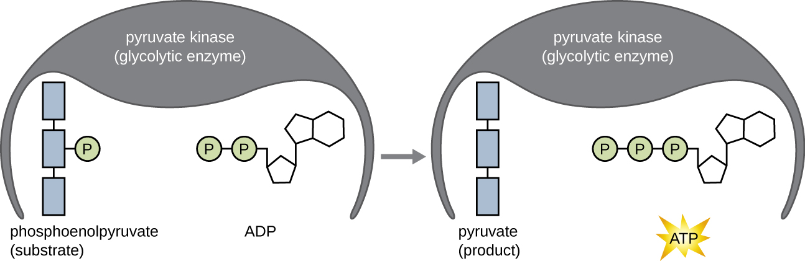

### Learning Objectives

* Describe why glycolysis is not oxygen dependent
* Define and describe the net yield of three-carbon molecules, ATP, and NADH from glycolysis
* Explain how three-carbon pyruvate molecules are converted into two-carbon acetyl groups that can be funneled into the Krebs cycle.
* Define and describe the net yield of CO2, GTP/ATP, FADH2, and NADH from the Krebs cycle
* Explain how intermediate carbon molecules of the Krebs cycle can be used in a cell

Extensive enzyme pathways exist for breaking down **carbohydrate**{: data-type="term" .no-emphasis}s to capture energy in **ATP**{: data-type="term" .no-emphasis} bonds. In addition, many catabolic pathways produce intermediate molecules that are also used as building blocks for **anabolism**{: data-type="term" .no-emphasis}. Understanding these processes is important for several reasons. First, because the main metabolic processes involved are common to a wide range of chemoheterotrophic organisms, we can learn a great deal about human metabolism by studying metabolism in more easily manipulated bacteria like *E. coli*. Second, because animal and human pathogens are also **chemoheterotroph**{: data-type="term" .no-emphasis}s, learning about the details of **metabolism**{: data-type="term" .no-emphasis} in these bacteria, including possible differences between bacterial and human pathways, is useful for the diagnosis of pathogens as well as for the discovery of antimicrobial therapies targeting specific pathogens. Last, learning specifically about the pathways involved in chemoheterotrophic metabolism also serves as a basis for comparing other more unusual metabolic strategies used by microbes. Although the chemical source of electrons initiating **electron transfer**{: data-type="term" .no-emphasis} is different between chemoheterorophs and **chemoautotroph**{: data-type="term" .no-emphasis}s, many similar processes are used in both types of organisms.

The typical example used to introduce concepts of metabolism to students is carbohydrate catabolism. For chemoheterotrophs, our examples of metabolism start with the catabolism of polysaccharides such as glycogen, starch, or cellulose. Enzymes such as amylase, which breaks down glycogen or starch, and cellulases, which break down cellulose, can cause the hydrolysis of glycosidic bonds between the glucose monomers in these polymers, releasing glucose for further catabolism.

### Glycolysis

For bacteria, eukaryotes, and most archaea, **glycolysis**{: data-type="term"} is the most common pathway for the catabolism of glucose; it produces energy, reduced electron carriers, and precursor molecules for cellular metabolism. Every living organism carries out some form of glycolysis, suggesting this mechanism is an ancient universal metabolic process. The process itself does not use oxygen; however, glycolysis can be coupled with additional metabolic processes that are either aerobic or anaerobic. Glycolysis takes place in the cytoplasm of prokaryotic and eukaryotic cells. It begins with a single six-carbon glucose molecule and ends with two molecules of a three-carbon sugar called pyruvate. Pyruvate may be broken down further after glycolysis to harness more energy through aerobic or anaerobic respiration, but many organisms, including many microbes, may be unable to respire; for these organisms, glycolysis may be their only source of generating ATP.

The type of glycolysis found in animals and that is most common in microbes is the **Embden-Meyerhof-Parnas (EMP) pathway**{: data-type="term"}, named after Gustav Embden (1874–1933), Otto Meyerhof (1884–1951), and Jakub Parnas (1884–1949). Glycolysis using the EMP pathway consists of two distinct phases ([\[link\]](#OSC_Microbio_08_02_Glycolysis)). The first part of the pathway, called the energy investment phase, uses energy from two ATP molecules to modify a glucose molecule so that the six-carbon sugar molecule can be split evenly into two phosphorylated three-carbon molecules called glyceraldehyde 3-phosphate (G3P). The second part of the pathway, called the energy payoff phase, extracts energy by oxidizing G3P to pyruvate, producing four ATP molecules and reducing two molecules of NAD+ to two molecules of NADH, using electrons that originated from glucose. (A discussion and illustration of the full EMP pathway with chemical structures and enzyme names appear in [Appendix C](/m58948){: .target-chapter}.)

The ATP molecules produced during the energy payoff phase of glycolysis are formed by **substrate-level phosphorylation**{: data-type="term"} ([\[link\]](#OSC_Microbio_08_02_SubPhos)), one of two mechanisms for producing ATP. In substrate-level phosphorylation, a phosphate group is removed from an organic molecule and is directly transferred to an available ADP molecule, producing ATP. During glycolysis, high-energy phosphate groups from the intermediate molecules are added to ADP to make ATP.

Overall, in this process of glycolysis, the net gain from the breakdown of a single glucose molecule is:

* two ATP molecules
* two NADH molecule, and
* two pyruvate molecules.
{: data-bullet-style="bullet"}

  molecules. The energy payoff phase harnesses the energy in the G3P molecules, producing four ATP molecules, two NADH molecules, and two pyruvates."){: #OSC_Microbio_08_02_Glycolysis}

{: #OSC_Microbio_08_02_SubPhos}

### Other Glycolytic Pathways

When we refer to glycolysis, unless otherwise indicated, we are referring to the EMP pathway used by animals and many bacteria. However, some prokaryotes use alternative glycolytic pathways. One important alternative is the **Entner-Doudoroff (ED) pathway**{: data-type="term"}, named after its discoverers Nathan Entner and Michael Doudoroff (1911–1975). Although some bacteria, including the opportunistic gram-negative pathogen ***Pseudomonas aeruginosa***{: data-type="term" .no-emphasis}, contain only the ED pathway for glycolysis, other bacteria, like *E. coli*, have the ability to use either the ED pathway or the EMP pathway.

A third type of glycolytic pathway that occurs in all cells, which is quite different from the previous two pathways, is the **pentose phosphate pathway**{: data-type="term"} (**PPP**{: data-type="term" .no-emphasis}) also called the **phosphogluconate pathway**{: data-type="term"} or the **hexose monophosphate shunt**{: data-type="term"}. Evidence suggests that the PPP may be the most ancient universal glycolytic pathway. The intermediates from the PPP are used for the **biosynthesis**{: data-type="term" .no-emphasis} of nucleotides and amino acids. Therefore, this glycolytic pathway may be favored when the cell has need for nucleic acid and/or protein synthesis, respectively. A discussion and illustration of the complete ED pathway and PPP with chemical structures and enzyme names appear in [Appendix C](/m58948){: .target-chapter}.

* When might an organism use the ED pathway or the PPP for glycolysis?
{: data-bullet-style="bullet"}

### Transition Reaction, Coenzyme A, and the Krebs Cycle

Glycolysis produces pyruvate, which can be further oxidized to capture more energy. For pyruvate to enter the next oxidative pathway, it must first be decarboxylated by the enzyme complex pyruvate dehydrogenase to a two-carbon acetyl group in the **transition reaction**{: data-type="term"}, also called the **bridge reaction**{: data-type="term"} (see [Appendix C](/m58948){: .target-chapter} and [\[link\]](#OSC_Microbio_08_02_Transition)). In the transition reaction, electrons are also transferred to NAD+ to form NADH. To proceed to the next phase of this metabolic process, the comparatively tiny two-carbon acetyl must be attached to a very large carrier compound called **coenzyme A (CoA)**{: data-type="term" .no-emphasis}. The transition reaction occurs in the mitochondrial matrix of eukaryotes; in prokaryotes, it occurs in the cytoplasm because prokaryotes lack membrane-enclosed organelles.

  Coenzyme A is shown here without an attached acetyl group. (b) Coenzyme A is shown here with an attached acetyl group."){: #OSC_Microbio_08_02_Transition}

The **Krebs cycle**{: data-type="term"} transfers remaining electrons from the acetyl group produced during the transition reaction to electron carrier molecules, thus reducing them. The Krebs cycle also occurs in the cytoplasm of prokaryotes along with glycolysis and the transition reaction, but it takes place in the mitochondrial matrix of eukaryotic cells where the transition reaction also occurs. The Krebs cycle is named after its discoverer, British scientist Hans Adolf Krebs (1900–1981) and is also called the **citric acid cycle**{: data-type="term"}, or the **tricarboxylic acid cycle (TCA)**{: data-type="term"} because citric acid has three carboxyl groups in its structure. Unlike glycolysis, the Krebs cycle is a closed loop: The last part of the pathway regenerates the compound used in the first step ([\[link\]](#OSC_Microbio_08_02_Krebs)). The eight steps of the cycle are a series of chemical reactions that capture the two-carbon acetyl group (the CoA carrier does not enter the Krebs cycle) from the transition reaction, which is added to a four-carbon intermediate in the Krebs cycle, producing the six-carbon intermediate citric acid (giving the alternate name for this cycle). As one turn of the cycle returns to the starting point of the four-carbon intermediate, the cycle produces two CO2 molecules, one ATP molecule (or an equivalent, such as guanosine triphosphate \[GTP\]) produced by substrate-level phosphorylation, and three molecules of NADH and one of FADH2. (A discussion and detailed illustration of the full Krebs cycle appear in [Appendix C](/m58948){: .target-chapter}.)

Although many organisms use the Krebs cycle as described as part of glucose metabolism, several of the intermediate compounds in the Krebs cycle can be used in synthesizing a wide variety of important cellular molecules, including amino acids, chlorophylls, fatty acids, and nucleotides; therefore, the cycle is both anabolic and catabolic ([\[link\]](#OSC_Microbio_08_02_KrebsUsage)).

  molecules made by substrate-level phosphorylation. Two turns of the Krebs cycle are required to process all of the carbon from one glucose molecule."){: #OSC_Microbio_08_02_Krebs}

![Details of the Kreb&#x2019;s cycle. Acetyl-CoA (C2) enter at the top (along with water). SH-CoA leaves. The 2 carbons of Acetyl-CoA bind with the 4 carbons of oxaloacetate for form citrate (C6). An arrow shows that this can be used to build fatty acids and sterols. Citrate is converted to isocitrate (C6). Isocitrate is converted to alpha-ketoglutarate. This step builds 1 NADH/H+ from NADH and releases 1 CO2. Alpha-ketoglutarate can be used to build glutamate which can be used to build other amino acids and nucleotides. Alpha-ketoglutarate is converted to succinyl CoA (C4) by the addition of SH-CoA. This step builds one NADH/H+ from NAH+ and releases a CO2. Succinyl CoA can be used to build porphyrins, heme, and chlorophyll. Succinyl-CoA is converted to Succinate (C4). This step releases SH-CO and builds ATP or GTP from ADP or GDP and Pi. Succinate is converted to fumarate (C4). This step produces FADH2 from FAD. Fumarate is converted to malate (C4) with the addition of water. Malate is converted to oxaloacetate. This step produces NADH/H+ from NAD+. Oxoaloacetate can be used to build asparate which can be used to build nucleotides and other amino acids. Oxaloacetate can also continue in another cycle of the Kreb&#x2019;s cycle](../resources/OSC_Microbio_08_02_KrebsUsage.jpg "Many organisms use intermediates from the Krebs cycle, such as amino acids, fatty acids, and nucleotides, as building blocks for biosynthesis."){: #OSC_Microbio_08_02_KrebsUsage}

### Key Concepts and Summary

* **Glycolysis** is the first step in the breakdown of glucose, resulting in the formation of ATP, which is produced by **substrate-level phosphorylation**; NADH; and two pyruvate molecules. Glycolysis does not use oxygen and is not oxygen dependent.
* After glycolysis, a three-carbon pyruvate is decarboxylated to form a two-carbon acetyl group, coupled with the formation of NADH. The acetyl group is attached to a large carrier compound called coenzyme A.
* After the transition step, coenzyme A transports the two-carbon acetyl to the **Krebs cycle**, where the two carbons enter the cycle. Per turn of the cycle, one acetyl group derived from glycolysis is further oxidized, producing three NADH molecules, one FADH2, and one ATP by **substrate-level phosphorylation**, and releasing two CO2 molecules.
* The Krebs cycle may be used for other purposes. Many of the intermediates are used to synthesize important cellular molecules, including amino acids, chlorophylls, fatty acids, and nucleotides.
{: data-bullet-style="bullet"}

### Multiple Choice

During which of the following is ATP not made by substrate-level phosphorylation?

1.  Embden-Meyerhof pathway
2.  Transition reaction
3.  Krebs cycle
4.  Entner-Doudoroff pathway
{: data-number-style="upper-alpha"}

B

Which of the following products is made during Embden-Meyerhof glycolysis?

1.  NAD+
2.  pyruvate
3.  CO2
4.  two-carbon acetyl
{: data-number-style="upper-alpha"}

B

During the catabolism of glucose, which of the following is produced only in the Krebs cycle?

1.  ATP
2.  NADH
3.  NADPH
4.  FADH2
{: data-number-style="upper-alpha"}

D

Which of the following is not a name for the cycle resulting in the conversion of a two-carbon acetyl to one ATP, two CO2, one FADH2, and three NADH molecules?

1.  Krebs cycle
2.  tricarboxylic acid cycle
3.  Calvin cycle
4.  citric acid cycle
{: data-number-style="upper-alpha"}

C

### True/False

Glycolysis requires oxygen or another inorganic final electron acceptor to proceed.

False

### Fill in the Blank

Per turn of the Krebs cycle, one acetyl is oxidized, forming \_\_\_\_ CO2, \_\_\_\_ ATP, \_\_\_\_ NADH, and \_\_\_\_ FADH2 molecules.

2; 1; 3; 1

Most commonly, glycolysis occurs by the \_\_\_\_\_\_\_\_ pathway.

Embden-Meyerhof

### Short Answer

What is substrate-level phosphorylation? When does it occur during the breakdown of glucose to CO2?

Why is the Krebs cycle important in both catabolism and anabolism?

### Critical Thinking

What would be the consequences to a cell of having a mutation that knocks out coenzyme A synthesis?

