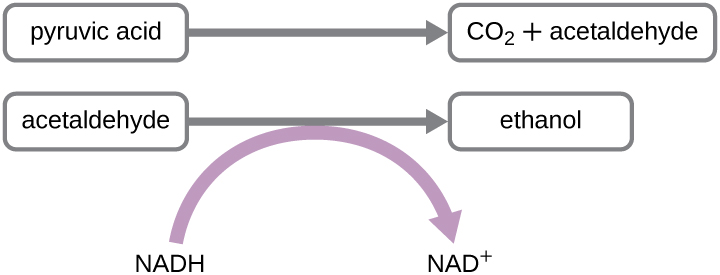

### Learning Objectives

* Define fermentation and explain why it does not require oxygen
* Describe the fermentation pathways and their end products and give examples of microorganisms that use these pathways
* Compare and contrast fermentation and anaerobic respiration

Many cells are unable to carry out respiration because of one or more of the following circumstances:

1.  The cell lacks a sufficient amount of any appropriate, inorganic, final electron acceptor to carry out cellular respiration.
2.  The cell lacks genes to make appropriate complexes and electron carriers in the electron transport system.
3.  The cell lacks genes to make one or more enzymes in the Krebs cycle.
{: data-number-style="arabic"}

Whereas lack of an appropriate inorganic final electron acceptor is environmentally dependent, the other two conditions are genetically determined. Thus, many prokaryotes, including members of the clinically important genus *Streptococcus*, are permanently incapable of respiration, even in the presence of oxygen. Conversely, many prokaryotes are facultative, meaning that, should the environmental conditions change to provide an appropriate inorganic final electron acceptor for respiration, organisms containing all the genes required to do so will switch to cellular respiration for glucose metabolism because respiration allows for much greater ATP production per glucose molecule.

If respiration does not occur, NADH must be reoxidized to NAD+ for reuse as an electron carrier for glycolysis, the cell’s only mechanism for producing any ATP, to continue. Some living systems use an organic molecule (commonly pyruvate) as a final electron acceptor through a process called **fermentation**{: data-type="term"}. Fermentation does not involve an electron transport system and does not directly produce any additional ATP beyond that produced during glycolysis by substrate-level phosphorylation. Organisms carrying out fermentation, called fermenters, produce a maximum of two ATP molecules per glucose during glycolysis. [\[link\]](#fs-id1167660204994) compares the final electron acceptors and methods of ATP synthesis in aerobic respiration, anaerobic respiration, and fermentation. Note that the number of ATP molecules shown for glycolysis assumes the **Embden-Meyerhof-Parnas pathway**{: data-type="term" .no-emphasis}. The number of ATP molecules made by **substrate-level phosphorylation**{: data-type="term" .no-emphasis} (SLP) versus **oxidative phosphorylation**{: data-type="term" .no-emphasis} (OP) are indicated.

<table summary="Comparison of Respiration versus Fermentation. In aerobic respiration (such as Pseudomonas aeruginosa) the final electron acceptor is O2. The pathways involved in ATP synthesis (type of phosphorylation are: EMP glycolysis (SLP) which has a maximum ATP yield of 2; Krebs cycle (SLP) which has a maximum ATP yield of 2 and Electron transport and chemiosmosis (OP) which has a maximum ATP yield of 34. The total maximum is 38 ATP. In anaerobic respiration (such as Paracoccus denitrificans) the final electron acceptor is NO_3^-,SO_4^(-2),Fe^(+3),CO_2, and other inorganics. The pathways involved in ATP synthesis (type of phosphorylation are: EMP glycolysis (SLP) which has a maximum ATP yield of 2; Krebs cycle (SLP) which has a maximum ATP yield of 2 and Electron transport and chemiosmosis (OP) which has a maximum ATP yield of 1-32. The total maximum is 5-36 ATP. In fermentation (such as Candida albicans) the final electron acceptor is organics (usually pyruvate). The pathways involved in ATP synthesis (type of phosphorylation are: EMP glycolysis (SLP) which has a maximum ATP yield of 2; and fermentation which does not produce ATP. The total maximum is 2 ATP." class="span-all"><thead>
<tr>
<th colspan="5" data-align="center">Comparison of Respiration Versus Fermentation</th>
</tr>
<tr>
<th data-valign="top" data-align="center">Type of Metabolism</th>
<th data-valign="top" data-align="center">Example</th>
<th data-valign="top" data-align="center">Final Electron Acceptor</th>
<th data-valign="top" data-align="center">Pathways Involved in ATP Synthesis (Type of Phosphorylation)</th>
<th data-valign="top" data-align="center">Maximum Yield of ATP Molecules</th>
</tr>
</thead><tbody>
<tr valign="top">
<td rowspan="2" data-valign="top" data-align="left">Aerobic respiration</td>
<td rowspan="2" data-valign="top" data-align="center"><em>Pseudomonas aeruginosa</em></td>
<td rowspan="2" data-valign="top" data-align="center"><math xmlns="http://www.w3.org/1998/Math/MathML"><mrow><msub><mrow><mtext>O</mtext></mrow><mn>2</mn></msub></mrow></math></td>
<td data-valign="top" data-align="center">EMP glycolysis (SLP)
Krebs cycle (SLP)
Electron transport and chemiosmosis (OP):</td>
<td data-valign="top" data-align="center">2
2
34</td>
</tr>
<tr valign="top">
<td data-valign="top" data-align="center"><strong>Total</strong></td>
<td data-valign="top" data-align="center"><strong>38</strong></td>
</tr>
<tr valign="top">
<td rowspan="2" data-valign="top" data-align="left">Anaerobic respiration</td>
<td rowspan="2" data-valign="top" data-align="center"><em>Paracoccus denitrificans</em></td>
<td rowspan="2" data-valign="top" data-align="center"><math xmlns="http://www.w3.org/1998/Math/MathML"><mrow><msup><mrow><msub><mrow><mtext>NO</mtext></mrow><mn>3</mn></msub></mrow><mo>−</mo></msup><mo>,</mo><msubsup><mrow><mspace width="0.2em" /><mtext>SO</mtext></mrow><mn>4</mn><mrow><mn>−2</mn></mrow></msubsup><mo>,</mo><msup><mrow><mspace width="0.2em" /><mtext>Fe</mtext></mrow><mrow><mo>+</mo><mn>3</mn></mrow></msup><mo>,</mo><msub><mrow><mspace width="0.2em" /><mtext>CO</mtext></mrow><mn>2</mn></msub><mo>,</mo></mrow></math>
other inorganics</td>
<td data-valign="top" data-align="center">EMP glycolysis (SLP)
Krebs cycle (SLP)
Electron transport and chemiosmosis (OP):</td>
<td data-valign="top" data-align="center">2
2
1–32</td>
</tr>
<tr valign="top">
<td data-valign="top" data-align="center"><strong>Total</strong></td>
<td data-valign="top" data-align="center"><strong>5</strong>–<strong>36</strong></td>
</tr>
<tr valign="top">
<td rowspan="2" data-valign="top" data-align="left">Fermentation</td>
<td rowspan="2" data-valign="top" data-align="center"><em>Candida albicans</em></td>
<td rowspan="2" data-valign="top" data-align="center">Organics
(usually pyruvate)</td>
<td data-valign="top" data-align="center">EMP glycolysis (SLP)
Fermentation</td>
<td data-valign="top" data-align="center">2
0</td>
</tr>
<tr valign="top">
<td data-valign="top" data-align="center"><strong>Total</strong></td>
<td data-valign="top" data-align="center"><strong>2</strong></td>
</tr>
</tbody></table>

Microbial fermentation processes have been manipulated by humans and are used extensively in the production of various foods and other commercial products, including pharmaceuticals. Microbial fermentation can also be useful for identifying microbes for diagnostic purposes.

Fermentation by some bacteria, like those in yogurt and other soured food products, and by animals in muscles during oxygen depletion, is **lactic acid fermentation**{: data-type="term" .no-emphasis}. The chemical reaction of lactic acid fermentation is as follows:

<math xmlns="http://www.w3.org/1998/Math/MathML"><mrow><mtext>Pyruvate  +  NADH</mtext><mspace width="0.2em" /><mtext> </mtext><mover><mo>↔</mo><mrow /></mover><mtext> </mtext><msup><mrow><mtext>lactic acid  + NAD</mtext></mrow><mtext>+</mtext></msup></mrow></math>

Bacteria of several gram-positive genera, including ***Lactobacillus***{: data-type="term" .no-emphasis}, ***Leuconostoc***{: data-type="term" .no-emphasis}, and ***Streptococcus***{: data-type="term" .no-emphasis}, are collectively known as the **lactic acid bacteria (LAB)**{: data-type="term" .no-emphasis}, and various strains are important in food production. During <strong data-type="term" class="no-emphasis">yogurt </strong>and <strong data-type="term" class="no-emphasis">cheese </strong>production, the highly acidic environment generated by lactic acid fermentation denatures proteins contained in milk, causing it to solidify. When lactic acid is the only fermentation product, the process is said to be **homolactic fermentation**{: data-type="term"}; such is the case for *Lactobacillus delbrueckii* and *S. thermophiles* used in yogurt production. However, many bacteria perform **heterolactic fermentation**{: data-type="term"}, producing a mixture of lactic acid, ethanol and/or acetic acid, and CO2 as a result, because of their use of the branched pentose phosphate pathway instead of the EMP pathway for glycolysis. One important heterolactic fermenter is *Leuconostoc mesenteroides*, which is used for souring vegetables like cucumbers and cabbage, producing pickles and sauerkraut, respectively.

Lactic acid bacteria are also important medically. The production of low pH environments within the body inhibits the establishment and growth of pathogens in these areas. For example, the vaginal microbiota is composed largely of lactic acid bacteria, but when these bacteria are reduced, yeast can proliferate, causing a yeast infection. Additionally, lactic acid bacteria are important in maintaining the health of the gastrointestinal tract and, as such, are the primary component of probiotics.

Another familiar fermentation process is **alcohol fermentation**{: data-type="term" .no-emphasis}, which produces ethanol. The ethanol fermentation reaction is shown in [\[link\]](#OSC_Microbio_08_04_EthFerm). In the first reaction, the enzyme **pyruvate decarboxylase**{: data-type="term" .no-emphasis} removes a carboxyl group from pyruvate, releasing CO2 gas while producing the two-carbon molecule acetaldehyde. The second reaction, catalyzed by the enzyme alcohol dehydrogenase, transfers an electron from NADH to acetaldehyde, producing ethanol and NAD+. The ethanol fermentation of pyruvate by the yeast ***Saccharomyces cerevisiae***{: data-type="term" .no-emphasis} is used in the production of alcoholic beverages and also makes bread products rise due to CO2 production. Outside of the food industry, ethanol fermentation of plant products is important in **biofuel**{: data-type="term" .no-emphasis} production.

 {: #OSC_Microbio_08_04_EthFerm}

Beyond lactic acid fermentation and alcohol fermentation, many other fermentation methods occur in prokaryotes, all for the purpose of ensuring an adequate supply of NAD+ for glycolysis ([\[link\]](#fs-id1167658030346)). Without these pathways, glycolysis would not occur and no ATP would be harvested from the breakdown of glucose. It should be noted that most forms of fermentation besides **homolactic fermentation**{: data-type="term" .no-emphasis} produce gas, commonly CO2 and/or hydrogen gas. Many of these different types of fermentation pathways are also used in food production and each results in the production of different organic acids, contributing to the unique flavor of a particular fermented food product. The propionic acid produced during **propionic acid fermentation**{: data-type="term" .no-emphasis} contributes to the distinctive flavor of Swiss cheese, for example.

Several fermentation products are important commercially outside of the food industry. For example, chemical solvents such as **acetone**{: data-type="term" .no-emphasis} and **butanol**{: data-type="term" .no-emphasis} are produced during **acetone-butanol-ethanol fermentation**{: data-type="term" .no-emphasis}. Complex organic pharmaceutical compounds used in antibiotics (e.g., penicillin), vaccines, and vitamins are produced through **mixed acid fermentation**{: data-type="term" .no-emphasis}. Fermentation products are used in the laboratory to differentiate various bacteria for diagnostic purposes. For example, enteric bacteria are known for their ability to perform mixed acid fermentation, reducing the pH, which can be detected using a pH indicator. Similarly, the bacterial production of acetoin during butanediol fermentation can also be detected. Gas production from fermentation can also be seen in an inverted Durham tube that traps produced gas in a broth culture.

Microbes can also be differentiated according to the substrates they can ferment. For example, *E. coli* can ferment lactose, forming gas, whereas some of its close gram-negative relatives cannot. The ability to ferment the sugar alcohol sorbitol is used to identify the pathogenic enterohemorrhagic O157:H7 strain of *E. coli* because, unlike other *E. coli* strains, it is unable to ferment sorbitol. Last, mannitol fermentation differentiates the mannitol-fermenting ***Staphylococcus aureus***{: data-type="term" .no-emphasis} from other non–mannitol-fermenting staphylococci.

<table summary="Table titled: Common Fermentation Pathways. Columns: Pathway; End Products; Example Microbes; Commercial Products. Pathway: Acetone-butanol-ethanol; Acetone, butanol, ethanol, CO2; Clostridium acetobutylicum; Commercial solvents, gasoline alternative. Pathway: Alcohol; Ethanol, CO2; Candida, Saccharomyces; Beer, bread. Pathway&#x201D; Butanediol; Formic and lactic acid; ethanol; acetoin; 2,3 butanediol; CO2; hydrogen gas; Klebsiella, Enterobacter; Chardonnay wine. Pathway: Butyric acid; Butyric acid, CO2, hydrogen gas; Clostridium butyricum; Butter. Pathway: Lactic acid; Lactic acid; Streptococcus, Lactobacillus; Sauerkraut, yogurt, cheese. Pathway: Mixed acid; Acetic, formic, lactic, and succinic acids; ethanol, CO2, hydrogen gas; Escherichia, Shigella; Vinegar, cosmetics, pharmaceuticals. Pathway: Propionic acid; Acetic acid, propionic acid, CO2; Propionibacterium, Bifidobacterium; Swiss cheese." class="span-all"><thead>
<tr>
<th colspan="4" data-align="center">Common Fermentation Pathways</th></tr>
<tr valign="top">
<th data-valign="bottom" data-align="center">Pathway</th>
<th data-valign="bottom" data-align="center">End Products</th>
<th data-valign="bottom" data-align="center">Example Microbes</th>
<th data-valign="bottom" data-align="center">Commercial Products</th>
</tr>
</thead><tbody>
<tr valign="top">
<td data-valign="bottom" data-align="left">Acetone-butanol-ethanol</td>
<td data-valign="bottom" data-align="left">Acetone, butanol, ethanol, CO2</td>
<td data-valign="bottom" data-align="left"><em>Clostridium acetobutylicum</em></td>
<td data-valign="bottom" data-align="left">Commercial solvents, gasoline alternative</td>
</tr>
<tr valign="top">
<td data-valign="bottom" data-align="left">Alcohol</td>
<td data-valign="bottom" data-align="left">Ethanol, CO2</td>
<td data-valign="bottom" data-align="left"><em>Candida, Saccharomyces</em></td>
<td data-valign="bottom" data-align="left">Beer, bread</td>
</tr>
<tr valign="top">
<td data-valign="bottom" data-align="left">Butanediol</td>
<td data-valign="bottom" data-align="left">Formic and lactic acid; ethanol; acetoin; 2,3 butanediol; CO2; hydrogen gas</td>
<td data-valign="bottom" data-align="left"><em>Klebsiella, Enterobacter</em></td>
<td data-valign="bottom" data-align="left">Chardonnay wine</td>
</tr>
<tr valign="top">
<td data-valign="bottom" data-align="left">Butyric acid</td>
<td data-valign="bottom" data-align="left">Butyric acid, CO2, hydrogen gas</td>
<td data-valign="bottom" data-align="left"><em>Clostridium butyricum</em></td>
<td data-valign="bottom" data-align="left">Butter</td>
</tr>
<tr valign="top">
<td data-valign="bottom" data-align="left">Lactic acid</td>
<td data-valign="bottom" data-align="left">Lactic acid</td>
<td data-valign="bottom" data-align="left"><em>Streptococcus, Lactobacillus</em></td>
<td data-valign="bottom" data-align="left">Sauerkraut, yogurt, cheese</td>
</tr>
<tr valign="top">
<td data-valign="bottom" data-align="left">Mixed acid</td>
<td data-valign="bottom" data-align="left">Acetic, formic, lactic, and succinic acids; ethanol, CO2, hydrogen gas</td>
<td data-valign="bottom" data-align="left"><em>Escherichia, Shigella</em></td>
<td data-valign="bottom" data-align="left">Vinegar, cosmetics, pharmaceuticals</td>
</tr>
<tr valign="top">
<td data-valign="bottom" data-align="left">Propionic acid</td>
<td data-valign="bottom" data-align="left">Acetic acid, propionic acid, CO2</td>
<td data-valign="bottom" data-align="left"><em>Propionibacterium, Bifidobacterium</em></td>
<td data-valign="bottom" data-align="left">Swiss cheese</td>
</tr>
</tbody></table>

* When would a metabolically versatile microbe perform fermentation rather than cellular respiration?
{: data-bullet-style="bullet"}

Identifying Bacteria by Using API Test Panels

Identification of a microbial isolate is essential for the proper diagnosis and appropriate treatment of patients. Scientists have developed techniques that identify bacteria according to their biochemical characteristics. Typically, they either examine the use of specific carbon sources as substrates for fermentation or other metabolic reactions, or they identify fermentation products or specific enzymes present in reactions. In the past, microbiologists have used individual test tubes and plates to conduct biochemical testing. However, scientists, especially those in clinical laboratories, now more frequently use plastic, disposable, multitest panels that contain a number of miniature reaction tubes, each typically including a specific substrate and pH indicator. After inoculation of the test panel with a small sample of the microbe in question and incubation, scientists can compare the results to a database that includes the expected results for specific biochemical reactions for known microbes, thus enabling rapid identification of a sample microbe. These test panels have allowed scientists to reduce costs while improving efficiency and reproducibility by performing a larger number of tests simultaneously.

Many commercial, miniaturized biochemical test panels cover a number of clinically important groups of bacteria and yeasts. One of the earliest and most popular test panels is the Analytical Profile Index (API) panel invented in the 1970s. Once some basic laboratory characterization of a given strain has been performed, such as determining the strain’s Gram morphology, an appropriate test strip that contains 10 to 20 different biochemical tests for differentiating strains within that microbial group can be used. Currently, the various **API strips**{: data-type="term" .no-emphasis} can be used to quickly and easily identify more than 600 species of bacteria, both aerobic and anaerobic, and approximately 100 different types of yeasts. Based on the colors of the reactions when metabolic end products are present, due to the presence of pH indicators, a metabolic profile is created from the results ([\[link\]](#OSC_Microbio_08_04_FB3)). Microbiologists can then compare the sample’s profile to the database to identify the specific microbe.

{: #OSC_Microbio_08_04_FB3}

Part 2

Many of Hannah’s symptoms are consistent with several different infections, including influenza and pneumonia. However, her sluggish reflexes along with her light sensitivity and stiff neck suggest some possible involvement of the central nervous system, perhaps indicating **meningitis**{: data-type="term" .no-emphasis}. Meningitis is an infection of the cerebrospinal fluid (CSF) around the brain and spinal cord that causes inflammation of the meninges, the protective layers covering the brain. Meningitis can be caused by viruses, bacteria, or fungi. Although all forms of meningitis are serious, bacterial meningitis is particularly serious. Bacterial meningitis may be caused by several different bacteria, but the bacterium ***Neisseria meningitidis***{: data-type="term" .no-emphasis}, a gram-negative, bean-shaped diplococcus, is a common cause and leads to death within 1 to 2 days in 5% to 10% of patients.

Given the potential seriousness of Hannah’s conditions, her physician advised her parents to take her to the hospital in the Gambian capital of Banjul and there have her tested and treated for possible meningitis. After a 3-hour drive to the hospital, Hannah was immediately admitted. Physicians took a blood sample and performed a lumbar puncture to test her CSF. They also immediately started her on a course of the antibiotic ceftriaxone, the drug of choice for treatment of meningitis caused by *N. meningitidis*, without waiting for laboratory test results.

* How might biochemical testing be used to confirm the identity of *N. meningitidis*?**
* Why did Hannah’s doctors decide to administer antibiotics without waiting for the test results?
{: data-bullet-style="bullet"}

*Jump to the [next](/m58823#fs-id1167662513703) Clinical Focus box. Go back to the [previous](/m58819#fs-id1167662371112) Clinical Focus box.*

### Key Concepts and Summary

* Fermentation uses an organic molecule as a final electron acceptor to regenerate NAD+ from NADH so that glycolysis can continue.
* Fermentation does not involve an electron transport system, and no ATP is made by the fermentation process directly. Fermenters make very little ATP—only two ATP molecules per glucose molecule during glycolysis.
* Microbial fermentation processes have been used for the production of foods and pharmaceuticals, and for the identification of microbes.
* During lactic acid fermentation, pyruvate accepts electrons from NADH and is reduced to lactic acid. Microbes performing **homolactic fermentation** produce only lactic acid as the fermentation product; microbes performing **heterolactic fermentation** produce a mixture of lactic acid, ethanol and/or acetic acid, and CO2.
* Lactic acid production by the normal microbiota prevents growth of pathogens in certain body regions and is important for the health of the gastrointestinal tract.
* During ethanol fermentation, pyruvate is first decarboxylated (releasing CO2) to acetaldehyde, which then accepts electrons from NADH, reducing acetaldehyde to ethanol. Ethanol fermentation is used for the production of alcoholic beverages, for making bread products rise, and for biofuel production.
* Fermentation products of pathways (e.g., propionic acid fermentation) provide distinctive flavors to food products. Fermentation is used to produce chemical solvents (acetone-butanol-ethanol fermentation) and pharmaceuticals (mixed acid fermentation).
* Specific types of microbes may be distinguished by their fermentation pathways and products. Microbes may also be differentiated according to the substrates they are able to ferment.
{: data-bullet-style="bullet"}

### Multiple Choice

Which of the following is the purpose of fermentation?

1.  to make ATP
2.  to make carbon molecule intermediates for anabolism
3.  to make NADH
4.  to make NAD+
{: data-number-style="upper-alpha"}

D

Which molecule typically serves as the final electron acceptor during fermentation?

1.  oxygen
2.  NAD+
3.  pyruvate
4.  CO2
{: data-number-style="upper-alpha"}

C

Which fermentation product is important for making bread rise?

1.  ethanol
2.  CO2
3.  lactic acid
4.  hydrogen gas
{: data-number-style="upper-alpha"}

B

Which of the following is not a commercially important fermentation product?

1.  ethanol
2.  pyruvate
3.  butanol
4.  penicillin
{: data-number-style="upper-alpha"}

B

### Fill in the Blank

The microbe responsible for ethanol fermentation for the purpose of producing alcoholic beverages is \_\_\_\_\_\_\_\_.

yeast (*Saccharomyces cerevisiae*)

\_\_\_\_\_\_\_\_ results in the production of a mixture of fermentation products, including lactic acid, ethanol and/or acetic acid, and CO2.

Heterolactic fermentation

Fermenting organisms make ATP through the process of \_\_\_\_\_\_\_\_.

glycolysis

### Matching

Match the fermentation pathway with the correct commercial product it is used to produce:

| \_\_\_acetone-butanol-ethanol fermentation | a. bread |
{: valign="top"}| \_\_\_alcohol fermentation | b. pharmaceuticals |
{: valign="top"}| \_\_\_lactic acid fermentation | c. Swiss cheese |
{: valign="top"}| \_\_\_mixed acid fermentation | d. yogurt |
{: valign="top"}| \_\_\_propionic acid fermentation | e. industrial solvents |
{: valign="top"}{: summary="1. acetone-butanol-ethanol fermentation. 2. alcohol fermentation. 3. lactic acid fermentation. 4. mixed acid fermentation. 5. propionic acid fermentation. a. bread. b. pharmaceuticals. c. Swiss cheese. d. yogurt. e. industrial solvents." .unnumbered .unstyled}

e; 2. a; 3. d; 4. b; 5. c

### Short Answer

Why are some microbes, including *Streptococcus* spp., unable to perform aerobic respiration, even in the presence of oxygen?

How can fermentation be used to differentiate various types of microbes?

### Critical Thinking

The bacterium *E. coli* is capable of performing aerobic respiration, anaerobic respiration, and fermentation. When would it perform each process and why? How is ATP made in each case?

