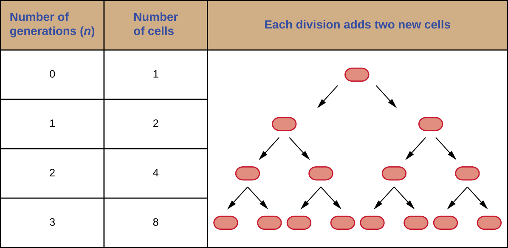

### Learning Objectives

* Define the generation time for growth based on binary fission
* Identify and describe the activities of microorganisms undergoing typical phases of binary fission (simple cell division) in a growth curve
* Explain several laboratory methods used to determine viable and total cell counts in populations undergoing exponential growth
* Describe examples of cell division not involving binary fission, such as budding or fragmentation
* Describe the formation and characteristics of biofilms
* Identify health risks associated with biofilms and how they are addressed
* Describe quorum sensing and its role in cell-to-cell communication and coordination of cellular activities

Part 1

Jeni, a 24-year-old pregnant woman in her second trimester, visits a clinic with complaints of high fever, 38.9 °C (102 °F), fatigue, and muscle aches—typical flu-like signs and symptoms. Jeni exercises regularly and follows a nutritious diet with emphasis on organic foods, including raw milk that she purchases from a local farmer’s market. All of her immunizations are up to date. However, the health-care provider who sees Jeni is concerned and orders a blood sample to be sent for testing by the microbiology laboratory.

* Why is the health-care provider concerned about Jeni’s signs and symptoms?
{: data-bullet-style="bullet"}

*Jump to the [next](/m58829#fs-id1172098266125) Clinical Focus box*

The bacterial cell cycle involves the formation of new cells through the replication of DNA and partitioning of cellular components into two daughter cells. In prokaryotes, reproduction is always asexual, although extensive genetic recombination in the form of horizontal gene transfer takes place, as will be explored in a different chapter. Most bacteria have a single circular chromosome; however, some exceptions exist. For example, ***Borrelia burgdorferi***{: data-type="term" .no-emphasis}, the causative agent of Lyme disease, has a linear chromosome.

### Binary Fission

The most common mechanism of cell replication in bacteria is a process called **binary fission**{: data-type="term"}, which is depicted in [\[link\]](#OSC_Microbio_09_01_binaryfiss). Before dividing, the cell grows and increases its number of cellular components. Next, the replication of DNA starts at a location on the circular chromosome called the origin of replication, where the chromosome is attached to the inner cell membrane. Replication continues in opposite directions along the chromosome until the terminus is reached.

The center of the enlarged cell constricts until two daughter cells are formed, each offspring receiving a complete copy of the parental genome and a division of the cytoplasm (cytokinesis). This process of cytokinesis and cell division is directed by a protein called **FtsZ**{: data-type="term" .no-emphasis}. FtsZ assembles into a **Z ring**{: data-type="term" .no-emphasis} on the cytoplasmic membrane ([\[link\]](#OSC_Microbio_09_01_Zring)). The Z ring is anchored by FtsZ-binding proteins and defines the division plane between the two daughter cells. Additional proteins required for cell division are added to the Z ring to form a structure called the **divisome**{: data-type="term" .no-emphasis}. The divisome activates to produce a peptidoglycan cell wall and build a **septum**{: data-type="term"} that divides the two daughter cells. The daughter cells are separated by the division septum, where all of the cells’ outer layers (the cell wall and outer membranes, if present) must be remodeled to complete division. For example, we know that specific enzymes break bonds between the monomers in peptidoglycans and allow addition of new subunits along the division septum.

  The electron micrograph depicts two cells of Salmonella typhimurium after a binary fission event. (b) Binary fission in bacteria starts with the replication of DNA as the cell elongates. A division septum forms in the center of the cell. Two daughter cells of similar size form and separate, each receiving a copy of the original chromosome. (credit a: modification of work by Centers for Disease Control and Prevention)"){: #OSC_Microbio_09_01_binaryfiss}

{: #OSC_Microbio_09_01_Zring}

* What is the name of the protein that assembles into a Z ring to initiate cytokinesis and cell division?
{: data-bullet-style="bullet"}

### Generation Time

In eukaryotic organisms, the generation time is the time between the same points of the life cycle in two successive generations. For example, the typical generation time for the human population is 25 years. This definition is not practical for bacteria, which may reproduce rapidly or remain dormant for thousands of years. In prokaryotes (Bacteria and Archaea), the **generation time**{: data-type="term"} is also called the **doubling time**{: data-type="term"} and is defined as the time it takes for the population to double through one round of binary fission. Bacterial doubling times vary enormously. Whereas *Escherichia coli* can double in as little as 20 minutes under optimal growth conditions in the laboratory, bacteria of the same species may need several days to double in especially harsh environments. Most pathogens grow rapidly, like *E. coli*, but there are exceptions. For example, ***Mycobacterium tuberculosis***{: data-type="term" .no-emphasis}, the causative agent of tuberculosis, has a generation time of between 15 and 20 hours. On the other hand, *M. leprae*, which causes **Hansen’s disease**{: data-type="term" .no-emphasis} (leprosy), grows much more slowly, with a doubling time of 14 days.

Calculating Number of Cells

It is possible to predict the number of cells in a population when they divide by binary fission at a constant rate. As an example, consider what happens if a single cell divides every 30 minutes for 24 hours. The diagram in [\[link\]](#OSC_Microbio_09_01_generation) shows the increase in cell numbers for the first three generations.

The number of cells increases exponentially and can be expressed as 2*n*, where *n* is the number of generations. If cells divide every 30 minutes, after 24 hours, 48 divisions would have taken place. If we apply the formula 2*n*, where *n* is equal to 48, the single cell would give rise to 248 or 281,474,976,710,656 cells at 48 generations (24 hours). When dealing with such huge numbers, it is more practical to use scientific notation. Therefore, we express the number of cells as 2.8 × 1014 cells.

In our example, we used one cell as the initial number of cells. For any number of starting cells, the formula is adapted as follows:

<math xmlns="http://www.w3.org/1998/Math/MathML"><mrow><msub><mi>N</mi><mi>n</mi></msub><mo>=</mo><msub><mi>N</mi><mn>0</mn></msub><msup><mn>2</mn><mi>n</mi></msup></mrow></math>

*Nn* is the number of cells at any generation *n*, *N*0 is the initial number of cells, and *n* is the number of generations.

{: #OSC_Microbio_09_01_generation}

* With a doubling time of 30 minutes and a starting population size of 1 × 105 cells, how many cells will be present after 2 hours, assuming no cell death?
{: data-bullet-style="bullet"}

### The Growth Curve

Microorganisms grown in **closed culture**{: data-type="term" .no-emphasis} (also known as a **batch culture**{: data-type="term" .no-emphasis}), in which no nutrients are added and most waste is not removed, follow a reproducible growth pattern referred to as the **growth curve**{: data-type="term"}. An example of a batch culture in nature is a pond in which a small number of cells grow in a closed environment. The **culture density**{: data-type="term"} is defined as the number of cells per unit volume. In a closed environment, the culture density is also a measure of the number of cells in the population. Infections of the body do not always follow the growth curve, but correlations can exist depending upon the site and type of infection. When the number of live cells is plotted against time, distinct phases can be observed in the curve ([\[link\]](#OSC_Microbio_09_01_growthcurv)).

 ![A graph with time on the X axis and logarithm of living bacterial cells on the Y axis. The line of the graph begins towards the bottom of the Y axis and is flat for a short time. This is labeled 1) lag phase: no increase in number of living bacterial cells. Next the line slopes upwards. This is labeled Log phase: exponential increase in number of living bacterial cells. Next the line flattens again. This is labeled 3) Stationary phase: plateau in number of living bacterial cells; rate of cell division and death roughly equal. Final the line slopes downwards. This is labeled 4) Death or decline phase: exponential decrease in number of living bacterial cells.](../resources/OSC_Microbio_09_01_growthcurv.jpg "The growth curve of a bacterial culture is represented by the logarithm of the number of live cells plotted as a function of time. The graph can be divided into four phases according to the slope, each of which matches events in the cell. The four phases are lag, log, stationary, and death."){: #OSC_Microbio_09_01_growthcurv}

#### The Lag Phase

The beginning of the growth curve represents a small number of cells, referred to as an **inoculum**{: data-type="term"}, that are added to a fresh **culture medium**{: data-type="term"}, a nutritional broth that supports growth. The initial phase of the growth curve is called the **lag phase**{: data-type="term"}, during which cells are gearing up for the next phase of growth. The number of cells does not change during the lag phase; however, cells grow larger and are metabolically active, synthesizing proteins needed to grow within the medium. If any cells were damaged or shocked during the transfer to the new medium, repair takes place during the lag phase. The duration of the lag phase is determined by many factors, including the species and genetic make-up of the cells, the composition of the medium, and the size of the original inoculum.

#### The Log Phase

In the **logarithmic (log) growth phase**{: data-type="term"}, sometimes called **exponential growth phase**{: data-type="term" .no-emphasis}, the cells are actively dividing by binary fission and their number increases exponentially. For any given bacterial species, the generation time under specific growth conditions (nutrients, temperature, pH, and so forth) is genetically determined, and this generation time is called the **intrinsic growth rate**{: data-type="term"}. During the log phase, the relationship between time and number of cells is not linear but exponential; however, the growth curve is often plotted on a semilogarithmic graph, as shown in [\[link\]](#OSC_Microbio_09_01_Jgrowthcur), which gives the appearance of a linear relationship.

 ![a) An arithmetic scale graph showing log phase growth. The X axis is time (hours) and the Y ais is cells per ml. The line on this graph starts fairly flat with readings of (1,2) and (5,32) but quickly slopes up steeply with a final reading of (10, 1024). B) is a semilog scale graph of log phase growth. Again the X axis is time (hours) and the Y axis is cells per ml. But the intervals of the Y axis more clearly show the difference between 10 superscript 1 and 10 superscript 3. The line on this graph is a straight line diagonally across the graph with points of (1,2), (5,32) and (10,1024) &#x2013; just like the first graph. The equation for both graphs is N=2 superscript n.](../resources/OSC_Microbio_09_01_Jgrowthcur.jpg "Both graphs illustrate population growth during the log phase for a bacterial sample with an initial population of one cell and a doubling time of 1 hour. (a) When plotted on an arithmetic scale, the growth rate resembles a curve. (b) When plotted on a semilogarithmic scale (meaning the values on the y-axis are logarithmic), the growth rate appears linear."){: #OSC_Microbio_09_01_Jgrowthcur}

Cells in the log phase show constant growth rate and uniform metabolic activity. For this reason, cells in the log phase are preferentially used for industrial applications and research work. The log phase is also the stage where bacteria are the most susceptible to the action of disinfectants and common antibiotics that affect protein, DNA, and cell-wall synthesis.

#### Stationary Phase

As the number of cells increases through the log phase, several factors contribute to a slowing of the growth rate. Waste products accumulate and nutrients are gradually used up. In addition, gradual depletion of oxygen begins to limit aerobic cell growth. This combination of unfavorable conditions slows and finally stalls population growth. The total number of live cells reaches a plateau referred to as the **stationary phase**{: data-type="term"} ([\[link\]](#OSC_Microbio_09_01_growthcurv)). In this phase, the number of new cells created by cell division is now equivalent to the number of cells dying; thus, the total population of living cells is relatively stagnant. The culture density in a stationary culture is constant. The culture’s carrying capacity, or maximum culture density, depends on the types of microorganisms in the culture and the specific conditions of the culture; however, carrying capacity is constant for a given organism grown under the same conditions.

During the stationary phase, cells switch to a survival mode of metabolism. As growth slows, so too does the synthesis of peptidoglycans, proteins, and nucleic-acids; thus, stationary cultures are less susceptible to antibiotics that disrupt these processes. In bacteria capable of producing endospores, many cells undergo sporulation during the stationary phase. Secondary metabolites, including antibiotics, are synthesized in the stationary phase. In certain pathogenic bacteria, the stationary phase is also associated with the expression of virulence factors, products that contribute to a microbe’s ability to survive, reproduce, and cause disease in a host organism. For example, quorum sensing in *Staphylococcus aureus* initiates the production of enzymes that can break down human tissue and cellular debris, clearing the way for bacteria to spread to new tissue where nutrients are more plentiful.

#### The Death Phase

As a culture medium accumulates toxic waste and nutrients are exhausted, cells die in greater and greater numbers. Soon, the number of dying cells exceeds the number of dividing cells, leading to an exponential decrease in the number of cells ([\[link\]](#OSC_Microbio_09_01_growthcurv)). This is the aptly named **death phase**{: data-type="term"}, sometimes called the decline phase. Many cells lyse and release nutrients into the medium, allowing surviving cells to maintain viability and form endospores. A few cells, the so-called **persisters**{: data-type="term"}, are characterized by a slow metabolic rate. Persister cells are medically important because they are associated with certain chronic infections, such as tuberculosis, that do not respond to antibiotic treatment.

#### Sustaining Microbial Growth

The growth pattern shown in [\[link\]](#OSC_Microbio_09_01_growthcurv) takes place in a closed environment; nutrients are not added and waste and dead cells are not removed. In many cases, though, it is advantageous to maintain cells in the logarithmic phase of growth. One example is in industries that harvest microbial products. A **chemostat**{: data-type="term" .no-emphasis} ([\[link\]](#OSC_Microbio_09_01_chemostat)) is used to maintain a continuous culture in which nutrients are supplied at a steady rate. A controlled amount of air is mixed in for aerobic processes. Bacterial suspension is removed at the same rate as nutrients flow in to maintain an optimal growth environment.

  and an outlet to remove contents (effluent), effectively diluting toxic wastes and dead cells. The addition and removal of fluids is adjusted to maintain the culture in the logarithmic phase of growth. If aerobic bacteria are grown, suitable oxygen levels are maintained."){: #OSC_Microbio_09_01_chemostat}

* During which phase does growth occur at the fastest rate?
* Name two factors that limit microbial growth.
{: data-bullet-style="bullet"}

### Measurement of Bacterial Growth

Estimating the number of bacterial cells in a sample, known as a bacterial count, is a common task performed by microbiologists. The number of bacteria in a clinical sample serves as an indication of the extent of an infection. Quality control of drinking water, food, medication, and even cosmetics relies on estimates of bacterial counts to detect contamination and prevent the spread of disease. Two major approaches are used to measure cell number. The direct methods involve counting cells, whereas the indirect methods depend on the measurement of cell presence or activity without actually counting individual cells. Both direct and indirect methods have advantages and disadvantages for specific applications.

#### Direct Cell Count

Direct cell count refers to counting the cells in a liquid culture or colonies on a plate. It is a direct way of estimating how many organisms are present in a sample. Let’s look first at a simple and fast method that requires only a specialized slide and a compound microscope.

The simplest way to count bacteria is called the **direct microscopic cell count**{: data-type="term"}, which involves transferring a known volume of a culture to a calibrated slide and counting the cells under a light microscope. The calibrated slide is called a **Petroff-Hausser chamber**{: data-type="term"} ([\[link\]](#OSC_Microbio_09_01_hemcy)) and is similar to a **hemocytometer**{: data-type="term" .no-emphasis} used to count red blood cells. The central area of the counting chamber is etched into squares of various sizes. A sample of the culture suspension is added to the chamber under a coverslip that is placed at a specific height from the surface of the grid. It is possible to estimate the concentration of cells in the original sample by counting individual cells in a number of squares and determining the volume of the sample observed. The area of the squares and the height at which the coverslip is positioned are specified for the chamber. The concentration must be corrected for dilution if the sample was diluted before enumeration.

  A Petroff-Hausser chamber is a special slide designed for counting the bacterial cells in a measured volume of a sample. A grid is etched on the slide to facilitate precision in counting. (b) This diagram illustrates the grid of a Petroff-Hausser chamber, which is made up of squares of known areas. The enlarged view shows the square within which bacteria (red cells) are counted. If the coverslip is 0.2 mm above the grid and the square has an area of 0.04 mm2, then the volume is 0.008 mm3, or 0.000008 mL. Since there are 10 cells inside the square, the density of bacteria is 10 cells/0.000008 mL, which equates to 1,250,000 cells/mL. (credit a: modification of work by Jeffrey M. Vinocur)"){: #OSC_Microbio_09_01_hemcy}

Cells in several small squares must be counted and the average taken to obtain a reliable measurement. The advantages of the chamber are that the method is easy to use, relatively fast, and inexpensive. On the downside, the counting chamber does not work well with dilute cultures because there may not be enough cells to count.

Using a counting chamber does not necessarily yield an accurate count of the number of live cells because it is not always possible to distinguish between live cells, dead cells, and debris of the same size under the microscope. However, newly developed fluorescence staining techniques make it possible to distinguish viable and dead bacteria. These viability stains (or live stains) bind to nucleic acids, but the primary and secondary stains differ in their ability to cross the cytoplasmic membrane. The primary stain, which fluoresces green, can penetrate intact cytoplasmic membranes, staining both live and dead cells. The secondary stain, which fluoresces red, can stain a cell only if the cytoplasmic membrane is considerably damaged. Thus, live cells fluoresce green because they only absorb the green stain, whereas dead cells appear red because the red stain displaces the green stain on their nucleic acids ([\[link\]](#OSC_Microbio_09_01_livedead)).

 "){: #OSC_Microbio_09_01_livedead}

Another technique uses an **electronic cell counting device**{: data-type="term" .no-emphasis} (**Coulter counter**{: data-type="term" .no-emphasis}) to detect and count the changes in electrical resistance in a saline solution. A glass tube with a small opening is immersed in an electrolyte solution. A first electrode is suspended in the glass tube. A second electrode is located outside of the tube. As cells are drawn through the small aperture in the glass tube, they briefly change the resistance measured between the two electrodes and the change is recorded by an electronic sensor ([\[link\]](#OSC_Microbio_09_01_coulter)); each resistance change represents a cell. The method is rapid and accurate within a range of concentrations; however, if the culture is too concentrated, more than one cell may pass through the aperture at any given time and skew the results. This method also does not differentiate between live and dead cells.

Direct counts provide an estimate of the total number of cells in a sample. However, in many situations, it is important to know the number of live, or **viable**{: data-type="term"}, cells. Counts of live cells are needed when assessing the extent of an infection, the effectiveness of antimicrobial compounds and medication, or contamination of food and water.

 "){: #OSC_Microbio_09_01_coulter}

* Why would you count the number of cells in more than one square in the Petroff-Hausser chamber to estimate cell numbers?
* In the viability staining method, why do dead cells appear red?
{: data-bullet-style="bullet"}

### Plate Count

The **viable plate count**{: data-type="term"}, or simply **plate count**{: data-type="term" .no-emphasis}, is a count of viable or live cells. It is based on the principle that viable cells replicate and give rise to visible colonies when incubated under suitable conditions for the specimen. The results are usually expressed as **colony-forming unit**{: data-type="term"}s per milliliter (CFU/mL) rather than cells per milliliter because more than one cell may have landed on the same spot to give rise to a single colony. Furthermore, samples of bacteria that grow in clusters or chains are difficult to disperse and a single colony may represent several cells. Some cells are described as viable but nonculturable and will not form colonies on solid media. For all these reasons, the viable plate count is considered a low estimate of the actual number of live cells. These limitations do not detract from the usefulness of the method, which provides estimates of live bacterial numbers.

Microbiologists typically count plates with 30–300 colonies. Samples with too few colonies (&lt;30) do not give statistically reliable numbers, and overcrowded plates (&gt;300 colonies) make it difficult to accurately count individual colonies. Also, counts in this range minimize occurrences of more than one bacterial cell forming a single colony. Thus, the calculated CFU is closer to the true number of live bacteria in the population.

There are two common approaches to inoculating plates for viable counts: the pour plate and the spread plate methods. Although the final inoculation procedure differs between these two methods, they both start with a serial dilution of the culture.

#### Serial Dilution

The **serial dilution**{: data-type="term"} of a culture is an important first step before proceeding to either the pour plate or spread plate method. The goal of the serial dilution process is to obtain plates with CFUs in the range of 30–300, and the process usually involves several dilutions in multiples of 10 to simplify calculation. The number of serial dilutions is chosen according to a preliminary estimate of the culture density. [\[link\]](#OSC_Microbio_09_01_serialtub) illustrates the serial dilution method.

A fixed volume of the original culture, 1.0 mL, is added to and thoroughly mixed with the first dilution tube solution, which contains 9.0 mL of sterile broth. This step represents a dilution factor of 10, or 1:10, compared with the original culture. From this first dilution, the same volume, 1.0 mL, is withdrawn and mixed with a fresh tube of 9.0 mL of dilution solution. The dilution factor is now 1:100 compared with the original culture. This process continues until a series of dilutions is produced that will bracket the desired cell concentration for accurate counting. From each tube, a sample is plated on solid medium using either the **pour plate method**{: data-type="term"} ([\[link\]](#OSC_Microbio_09_01_pourplate)) or the **spread plate method**{: data-type="term"} ([\[link\]](#OSC_Microbio_09_01_spreadplate)). The plates are incubated until colonies appear. Two to three plates are usually prepared from each dilution and the numbers of colonies counted on each plate are averaged. In all cases, thorough mixing of samples with the dilution medium (to ensure the cell distribution in the tube is random) is paramount to obtaining reliable results.

 ![A diagram of serial dilution. A large beaker on the left contains a dark solution. 1 ml is moved from this beaker to a tube containing 9 ml of broth. This tube has a dilution of 1:10 and is lighter in color than the original beaker. A sample of 0.1 ml from this tube is put on an agar plate; the colonies are too numerous to count. 1 ml is taken out of this tube and placed in a tube containing 9 ml of broth. This tube now has a dilution of 1:100 from the original beaker and is even lighter in color. 0.1 ml is plated on an a agar plate and the colonies are still too numerous to count. 1 ml is taken from this tube and placed in another tube containing 9 ml broth. This is now a dilution of 1:1000 from the original beaker and the tube is lighter than the last. 0.1 ml is taken out of this tube and placed on an agar plate; there are 389 colonies. 1 ml is taken out of this tube and placed in another tube containing 9 ml broth. This is now a dilution of 1:10,000 from the original beaker and this tube is even lighter than the last. 0.1 ml is taken out of this tube and placed on an agar plate; there are 50 colonies. 1 ml is taken out of this tube and placed in a tube containing 9 ml of broth. This is a dilution of 1:100,000 from the original beaker and this is the lightest tube of all. 0.1 ml is taken from this tube and placed on an agar plate; there are 2 colonies.](../resources/OSC_Microbio_09_01_serialtub.jpg "Serial dilution involves diluting a fixed volume of cells mixed with dilution solution using the previous dilution as an inoculum. The result is dilution of the original culture by an exponentially growing factor. (credit: modification of work by &#x201C;Leberechtc&#x201D;/Wikimedia Commons)"){: #OSC_Microbio_09_01_serialtub}

The dilution factor is used to calculate the number of cells in the original cell culture. In our example, an average of 50 colonies was counted on the plates obtained from the 1:10,000 dilution. Because only 0.1 mL of suspension was pipetted on the plate, the multiplier required to reconstitute the original concentration is 10 × 10,000. The number of CFU per mL is equal to 50 × 100 × 10,000 = 5,000,000. The number of bacteria in the culture is estimated as 5 million cells/mL. The colony count obtained from the 1:1000 dilution was 389, well below the expected 500 for a 10-fold difference in dilutions. This highlights the issue of inaccuracy when colony counts are greater than 300 and more than one bacterial cell grows into a single colony.

  poured into a sterile Petri dish and further mixed by swirling. This process is repeated for each serial dilution prepared. The resulting colonies are counted and provide an estimate of the number of cells in the original volume sampled."){: #OSC_Microbio_09_01_pourplate}

{: #OSC_Microbio_09_01_spreadplate}

A very dilute sample—drinking water, for example—may not contain enough organisms to use either of the plate count methods described. In such cases, the original sample must be concentrated rather than diluted before plating. This can be accomplished using a modification of the plate count technique called the **membrane filtration technique**{: data-type="term"}. Known volumes are vacuum-filtered aseptically through a membrane with a pore size small enough to trap microorganisms. The membrane is transferred to a Petri plate containing an appropriate growth medium. Colonies are counted after incubation. Calculation of the cell density is made by dividing the cell count by the volume of filtered liquid.

  
Watch this [video][1] for demonstrations of serial dilutions and spread plate techniques.

#### The Most Probable Number

The number of microorganisms in dilute samples is usually too low to be detected by the plate count methods described thus far. For these specimens, microbiologists routinely use the **most probable number (MPN) method**{: data-type="term"}, a statistical procedure for estimating of the number of viable microorganisms in a sample. Often used for water and food samples, the MPN method evaluates detectable growth by observing changes in turbidity or color due to metabolic activity.

A typical application of MPN method is the estimation of the number of coliforms in a sample of pond water. Coliforms are gram-negative rod bacteria that ferment lactose. The presence of **coliforms**{: data-type="term" .no-emphasis} in water is considered a sign of contamination by fecal matter. For the method illustrated in [\[link\]](#OSC_Microbio_09_01_MPNtubes), a series of three dilutions of the water sample is tested by inoculating five lactose broth tubes with 10 mL of sample, five lactose broth tubes with 1 mL of sample, and five lactose broth tubes with 0.1 mL of sample. The lactose broth tubes contain a pH indicator that changes color from red to yellow when the lactose is fermented. After inoculation and incubation, the tubes are examined for an indication of coliform growth by a color change in media from red to yellow. The first set of tubes (10-mL sample) showed growth in all the tubes; the second set of tubes (1 mL) showed growth in two tubes out of five; in the third set of tubes, no growth is observed in any of the tubes (0.1-mL dilution). The numbers 5, 2, and 0 are compared with [Figure B1](/m58947#OSC_Microbio_00_EE_MPN) in [Appendix B](/m58947){: .target-chapter}, which has been constructed using a probability model of the sampling procedure. From our reading of the table, we conclude that 49 is the most probable number of bacteria per 100 mL of pond water.no lo

![A diagram where the original sample of pond water is diluted into tubes containing lactose broth (a pink broth). 10 mL of the sample is placed into each of 5 lactose broth tubes. Another 5 tubes get 1 mL each of the sample. Another 5 tubes get 0.1 mL of sample. After 24 hours of incubation at 37&#xB0;C some tubes have a color change. All of the 5 tubes containing 10 mL of the sample turned yellow and show gas in the smaller inner tube. 2 of the 5 tubes that got 1 mL of the original sample turned yellow and show gas; 3 of these tubes remain pink. All of the tubes that got 0.1 mL of the original sample remain pink.](../resources/OSC_Microbio_09_01_MPNtubes.jpg "In the most probable number method, sets of five lactose broth tubes are inoculated with three different volumes of pond water: 10 mL, 1 mL, and 0.1mL. Bacterial growth is assessed through a change in the color of the broth from red to yellow as lactose is fermented."){: #OSC_Microbio_09_01_MPNtubes}

* What is a colony-forming unit?
* What two methods are frequently used to estimate bacterial numbers in water samples?
{: data-bullet-style="bullet"}

### Indirect Cell Counts

Besides direct methods of counting cells, other methods, based on an indirect detection of cell density, are commonly used to estimate and compare cell densities in a culture. The foremost approach is to measure the **turbidity**{: data-type="term"} (cloudiness) of a sample of bacteria in a liquid suspension. The laboratory instrument used to measure turbidity is called a **spectrophotometer**{: data-type="term" .no-emphasis} ([\[link\]](#OSC_Microbio_09_01_spectroph)). In a spectrophotometer, a light beam is transmitted through a bacterial suspension, the light passing through the suspension is measured by a detector, and the amount of light passing through the sample and reaching the detector is converted to either percent transmission or a logarithmic value called absorbance (optical density). As the numbers of bacteria in a suspension increase, the turbidity also increases and causes less light to reach the detector. The decrease in light passing through the sample and reaching the detector is associated with a decrease in percent transmission and increase in absorbance measured by the spectrophotometer.

Measuring turbidity is a fast method to estimate cell density as long as there are enough cells in a sample to produce turbidity. It is possible to correlate turbidity readings to the actual number of cells by performing a viable plate count of samples taken from cultures having a range of absorbance values. Using these values, a **calibration curve**{: data-type="term" .no-emphasis} is generated by plotting turbidity as a function of cell density. Once the calibration curve has been produced, it can be used to estimate cell counts for all samples obtained or cultured under similar conditions and with densities within the range of values used to construct the curve.

  A spectrophotometer is commonly used to measure the turbidity of a bacterial cell suspension as an indirect measure of cell density. (b) A spectrophotometer works by splitting white light from a source into a spectrum. The spectrophotometer allows choice of the wavelength of light to use for the measurement. The optical density (turbidity) of the sample will depend on the wavelength, so once one wavelength is chosen, it must be used consistently. The filtered light passes through the sample (or a control with only medium) and the light intensity is measured by a detector. The light passing into a suspension of bacteria is scattered by the cells in such a way that some fraction of it never reaches the detector. This scattering happens to a far lesser degree in the control tube with only the medium. (credit a: modification of work by Hwang HS, Kim MS; credit b &#x201C;test tube photos&#x201D;: modification of work by Suzanne Wakim)"){: #OSC_Microbio_09_01_spectroph}

Measuring **dry weight of a culture sample**{: data-type="term" .no-emphasis} is another indirect method of evaluating culture density without directly measuring cell counts. The cell suspension used for weighing must be concentrated by filtration or centrifugation, washed, and then dried before the measurements are taken. The degree of drying must be standardized to account for residual water content. This method is especially useful for filamentous microorganisms, which are difficult to enumerate by direct or viable plate count.

As we have seen, methods to estimate viable cell numbers can be labor intensive and take time because cells must be grown. Recently, indirect ways of measuring live cells have been developed that are both fast and easy to implement. These methods measure cell activity by following the production of metabolic products or disappearance of reactants. Adenosine triphosphate (ATP) formation, biosynthesis of proteins and nucleic acids, and consumption of oxygen can all be monitored to estimate the number of cells.

* What is the purpose of a calibration curve when estimating cell count from turbidity measurements?
* What are the newer indirect methods of counting live cells?
{: data-bullet-style="bullet"}

### Alternative Patterns of Cell Division

Binary fission is the most common pattern of cell division in prokaryotes, but it is not the only one. Other mechanisms usually involve asymmetrical division (as in budding) or production of spores in aerial filaments.

In some **cyanobacteria**{: data-type="term" .no-emphasis}, many nucleoids may accumulate in an enlarged round cell or along a filament, leading to the generation of many new cells at once. The new cells often split from the parent filament and float away in a process called **fragmentation**{: data-type="term"} ([\[link\]](#OSC_Microbio_09_01_filam)). Fragmentation is commonly observed in the **Actinomycetes**{: data-type="term" .no-emphasis}, a group of gram-positive, anaerobic bacteria commonly found in soil. Another curious example of cell division in prokaryotes, reminiscent of live birth in animals, is exhibited by the giant bacterium ***Epulopiscium***{: data-type="term" .no-emphasis}. Several daughter cells grow fully in the parent cell, which eventually disintegrates, releasing the new cells to the environment. Other species may form a long narrow extension at one pole in a process called **budding**{: data-type="term"}. The tip of the extension swells and forms a smaller cell, the bud that eventually detaches from the parent cell. Budding is most common in yeast ([\[link\]](#OSC_Microbio_09_01_filam)), but it is also observed in prosthecate bacteria and some cyanobacteria.

  Filamentous cyanobacteria, like those pictured here, replicate by fragmentation. (b) In this electron micrograph, cells of the bacterium Gemmata obscuriglobus are budding. The larger cell is the mother cell. Labels indicate the nucleoids (N) and the still-forming nuclear envelope (NE) of the daughter cell. (credit a: modification of work by CSIRO; credit b: modification of work by Kuo-Chang Lee, Rick I Webb and John A Fuerst)"){: #OSC_Microbio_09_01_filam}

The soil bacteria ***Actinomyces***{: data-type="term" .no-emphasis} grow in long filaments divided by septa, similar to the mycelia seen in fungi, resulting in long cells with multiple nucleoids. Environmental signals, probably related to low nutrient availability, lead to the formation of aerial filaments. Within these **aerial filaments**{: data-type="term" .no-emphasis}, elongated cells divide simultaneously. The new cells, which contain a single nucleoid, develop into spores that give rise to new colonies.

* Identify at least one difference between fragmentation and budding.
{: data-bullet-style="bullet"}

### Biofilms

In nature, microorganisms grow mainly in **biofilms**{: data-type="term"}, complex and dynamic ecosystems that form on a variety of environmental surfaces, from industrial conduits and water treatment pipelines to rocks in river beds. Biofilms are not restricted to solid surface substrates, however. Almost any surface in a liquid environment containing some minimal nutrients will eventually develop a biofilm. Microbial mats that float on water, for example, are biofilms that contain large populations of photosynthetic microorganisms. Biofilms found in the human mouth may contain hundreds of bacterial species. Regardless of the environment where they occur, biofilms are not random collections of microorganisms; rather, they are highly structured communities that provide a selective advantage to their constituent microorganisms.

#### Biofilm Structure

Observations using **confocal microscopy**{: data-type="term" .no-emphasis} have shown that environmental conditions influence the overall structure of biofilms. Filamentous biofilms called streamers form in rapidly flowing water, such as freshwater streams, eddies, and specially designed laboratory flow cells that replicate growth conditions in fast-moving fluids. The streamers are anchored to the substrate by a “head” and the “tail” floats downstream in the current. In still or slow-moving water, biofilms mainly assume a mushroom-like shape. The structure of biofilms may also change with other environmental conditions such as nutrient availability.

Detailed observations of biofilms under confocal laser and scanning electron microscopes reveal clusters of microorganisms embedded in a matrix interspersed with open water channels. The extracellular matrix consists of **extracellular polymeric substances (EPS)**{: data-type="term"} secreted by the organisms in the biofilm. The extracellular matrix represents a large fraction of the biofilm, accounting for 50%–90% of the total dry mass. The properties of the EPS vary according to the resident organisms and environmental conditions.

EPS is a hydrated gel composed primarily of polysaccharides and containing other macromolecules such as proteins, nucleic acids, and lipids. It plays a key role in maintaining the integrity and function of the biofilm. Channels in the EPS allow movement of nutrients, waste, and gases throughout the biofilm. This keeps the cells hydrated, preventing desiccation. EPS also shelters organisms in the biofilm from predation by other microbes or cells (e.g., protozoans, white blood cells in the human body).

#### Biofilm Formation

Free-floating microbial cells that live in an aquatic environment are called **planktonic**{: data-type="term"} cells. The formation of a biofilm essentially involves the attachment of planktonic cells to a substrate, where they become **sessile**{: data-type="term"} (attached to a surface). This occurs in stages, as depicted in [\[link\]](#OSC_Microbio_09_05_filmdiag). The first stage involves the attachment of planktonic cells to a surface coated with a conditioning film of organic material. At this point, attachment to the substrate is reversible, but as cells express new phenotypes that facilitate the formation of EPS, they transition from a planktonic to a sessile lifestyle. The biofilm develops characteristic structures, including an extensive matrix and water channels. Appendages such as **fimbriae**{: data-type="term" .no-emphasis}, **pili**{: data-type="term" .no-emphasis}, and **flagella**{: data-type="term" .no-emphasis} interact with the EPS, and microscopy and genetic analysis suggest that such structures are required for the establishment of a mature biofilm. In the last stage of the biofilm life cycle, cells on the periphery of the biofilm revert to a planktonic lifestyle, sloughing off the mature biofilm to colonize new sites. This stage is referred to as **dispersal**{: data-type="term" .no-emphasis}.

 ![Diagram of the formation of a biofilm. Step 1 &#x2013; the reversible attachment of planktonic cells (seconds). This is shown as a few cells with flagella attaching to a surface. Step 2 &#x2013; the first colonizers become irreversibly attached (seconds to minutes). This is shown as small clusters of cells on the surface. Step 3 &#x2013; Growth and cell division (hours, days). This is shown as larger clusters on the surface. Step 4 &#x2013; Production of EPS and formation of water channels (hours, days). This is shown as very large clusters. Step 5 &#x2013; Attachment of secondary colonizers and dispersion of microbes to new sites (days, months). This is shown as small flagellated cells leaving from the very large cluster.](../resources/OSC_Microbio_09_05_filmdiag.jpg "Stages in the formation and life cycle of a biofilm. (credit: modification of work by Public Library of Science and American Society for Microbiology)"){: #OSC_Microbio_09_05_filmdiag}

Within a biofilm, different species of microorganisms establish metabolic collaborations in which the waste product of one organism becomes the nutrient for another. For example, aerobic microorganisms consume oxygen, creating anaerobic regions that promote the growth of anaerobes. This occurs in many polymicrobial infections that involve both aerobic and anaerobic pathogens.

The mechanism by which cells in a biofilm coordinate their activities in response to environmental stimuli is called **quorum sensing**{: data-type="term"}. Quorum sensing—which can occur between cells of different species within a biofilm—enables microorganisms to detect their cell density through the release and binding of small, diffusible molecules called **autoinducers**{: data-type="term"}. When the cell population reaches a critical threshold (a quorum), these autoinducers initiate a cascade of reactions that activate genes associated with cellular functions that are beneficial only when the population reaches a critical density. For example, in some pathogens, synthesis of virulence factors only begins when enough cells are present to overwhelm the immune defenses of the host. Although mostly studied in bacterial populations, quorum sensing takes place between bacteria and eukaryotes and between eukaryotic cells such as the fungus ***Candida albicans***{: data-type="term" .no-emphasis}, a common member of the human microbiota that can cause infections in immunocompromised individuals.

The signaling molecules in quorum sensing belong to two major classes. Gram-negative bacteria communicate mainly using N-acylated homoserine lactones, whereas gram-positive bacteria mostly use small peptides ([\[link\]](#OSC_Microbio_09_05_autoinduc)). In all cases, the first step in quorum sensing consists of the binding of the autoinducer to its specific receptor only when a threshold concentration of signaling molecules is reached. Once binding to the receptor takes place, a cascade of signaling events leads to changes in gene expression. The result is the activation of biological responses linked to quorum sensing, notably an increase in the production of signaling molecules themselves, hence the term autoinducer.

 {: #OSC_Microbio_09_05_autoinduc}

#### Biofilms and Human Health

The human body harbors many types of biofilms, some beneficial and some harmful. For example, the layers of normal microbiota lining the intestinal and respiratory mucosa play a role in warding off infections by pathogens. However, other biofilms in the body can have a detrimental effect on health. For example, the plaque that forms on teeth is a biofilm that can contribute to dental and periodontal disease. Biofilms can also form in wounds, sometimes causing serious infections that can spread. The bacterium ***Pseudomonas aeruginosa***{: data-type="term" .no-emphasis} often colonizes biofilms in the airways of patients with **cystic fibrosis**{: data-type="term" .no-emphasis}, causing chronic and sometimes fatal infections of the lungs. Biofilms can also form on medical devices used in or on the body, causing infections in patients with in-dwelling **catheters**{: data-type="term" .no-emphasis}, artificial joints, or **contact lenses**{: data-type="term" .no-emphasis}.

Pathogens embedded within biofilms exhibit a higher resistance to antibiotics than their free-floating counterparts. Several hypotheses have been proposed to explain why. Cells in the deep layers of a biofilm are metabolically inactive and may be less susceptible to the action of antibiotics that disrupt metabolic activities. The EPS may also slow the diffusion of antibiotics and antiseptics, preventing them from reaching cells in the deeper layers of the biofilm. Phenotypic changes may also contribute to the increased resistance exhibited by bacterial cells in biofilms. For example, the increased production of **efflux pumps**{: data-type="term" .no-emphasis}, membrane-embedded proteins that actively extrude antibiotics out of bacterial cells, have been shown to be an important mechanism of antibiotic resistance among biofilm-associated bacteria. Finally, biofilms provide an ideal environment for the exchange of **extrachromosomal DNA**{: data-type="term" .no-emphasis}, which often includes genes that confer antibiotic resistance.

* What is the matrix of a biofilm composed of?
* What is the role of quorum sensing in a biofilm?
{: data-bullet-style="bullet"}

### Key Concepts and Summary

* Most bacterial cells divide by **binary fission**. **Generation time** in bacterial growth is defined as the **doubling time** of the population.
* Cells in a closed system follow a pattern of growth with four phases: **lag**, **logarithmic (exponential)**, **stationary**, and **death**.
* Cells can be counted by **direct viable cell count**. The **pour plate** and **spread plate** methods are used to plate **serial dilutions** into or onto, respectively, agar to allow counting of viable cells that give rise to **colony-forming units**. **Membrane filtration** is used to count live cells in dilute solutions. The **most probable cell number (MPN)** method allows estimation of cell numbers in cultures without using solid media.
* Indirect methods can be used to estimate **culture density** by measuring **turbidity** of a culture or live cell density by measuring metabolic activity.
* Other patterns of cell division include multiple nucleoid formation in cells; asymmetric division, as in **budding**; and the formation of hyphae and terminal spores.
* **Biofilms** are communities of microorganisms enmeshed in a matrix of **extracellular polymeric substance**. The formation of a biofilm occurs when **planktonic** cells attach to a substrate and become **sessile**. Cells in biofilms coordinate their activity by communicating through **quorum sensing**.
* Biofilms are commonly found on surfaces in nature and in the human body, where they may be beneficial or cause severe infections. Pathogens associated with biofilms are often more resistant to antibiotics and disinfectants.
{: data-bullet-style="bullet"}

### Multiple Choice

Which of the following methods would be used to measure the concentration of bacterial contamination in processed peanut butter?

1.  turbidity measurement
2.  total plate count
3.  dry weight measurement
4.  direct counting of bacteria on a calibrated slide under the microscope
{: type="A"}

B

In which phase would you expect to observe the most endospores in a *Bacillus* cell culture?

1.  death phase
2.  lag phase
3.  log phase
4.  log, lag, and death phases would all have roughly the same number of endospores.
{: type="A"}

A

During which phase would penicillin, an antibiotic that inhibits cell-wall synthesis, be most effective?

1.  death phase
2.  lag phase
3.  log phase
4.  stationary phase
{: type="A"}

C

Which of the following is the best definition of generation time in a bacterium?

1.  the length of time it takes to reach the log phase
2.  the length of time it takes for a population of cells to double
3.  the time it takes to reach stationary phase
4.  the length of time of the exponential phase
{: type="A"}

B

What is the function of the Z ring in binary fission?

1.  It controls the replication of DNA.
2.  It forms a contractile ring at the septum.
3.  It separates the newly synthesized DNA molecules.
4.  It mediates the addition of new peptidoglycan subunits.
{: type="A"}

B

If a culture starts with 50 cells, how many cells will be present after five generations with no cell death?

1.  200
2.  400
3.  1600
4.  3200
{: type="A"}

C

Filamentous cyanobacteria often divide by which of the following?

1.  budding
2.  mitosis
3.  fragmentation
4.  formation of endospores
{: type="A"}

C

Which is a reason for antimicrobial resistance being higher in a biofilm than in free-floating bacterial cells?

1.  The EPS allows faster diffusion of chemicals in the biofilm.
2.  Cells are more metabolically active at the base of a biofilm.
3.  Cells are metabolically inactive at the base of a biofilm.
4.  The structure of a biofilm favors the survival of antibiotic resistant cells.
{: type="A"}

C

Quorum sensing is used by bacterial cells to determine which of the following?

1.  the size of the population
2.  the availability of nutrients
3.  the speed of water flow
4.  the density of the population
{: type="A"}

D

Which of the following statements about autoinducers is incorrect?

1.  They bind directly to DNA to activate transcription.
2.  They can activate the cell that secreted them.
3.  N-acylated homoserine lactones are autoinducers in gram-negative cells.
4.  Autoinducers may stimulate the production of virulence factors.
{: type="A"}

A

### Fill in the Blank

Direct count of total cells can be performed using a \_\_\_\_\_\_\_\_ or a \_\_\_\_\_\_\_\_.

hemocytometer, Petroff-Hausser counting chamber

The \_\_\_\_\_\_\_\_ method allows direct count of total cells growing on solid medium.

plate count

A statistical estimate of the number of live cells in a liquid is usually done by \_\_\_\_\_\_\_\_.

most probable number

For this indirect method of estimating the growth of a culture, you measure \_\_\_\_\_\_\_\_ using a spectrophotometer.

turbidity

Active growth of a culture may be estimated indirectly by measuring the following products of cell metabolism: \_\_\_\_\_\_\_\_ or \_\_\_\_\_\_\_\_.

ATP, acid from fermentation

### Matching

Match the definition with the name of the growth phase in the growth curve.

| \_\_\_Number of dying cells is higher than the number of cells dividing | A. Lag phase |
{: valign="top"}| \_\_\_Number of new cells equal to number of dying cells | B. Log phase |
{: valign="top"}| \_\_\_New enzymes to use available nutrients are induced | C. Stationary phase |
{: valign="top"}| \_\_\_Binary fission is occurring at maximum rate | D. Death phase |
{: valign="top"}{: .unnumbered .unstyled summary="No Summary"}

D, C, A, B

### Short Answer

Why is it important to measure the transmission of light through a control tube with only broth in it when making turbidity measures of bacterial cultures?

In terms of counting cells, what does a plating method accomplish that an electronic cell counting method does not?

Order the following stages of the development of a biofilm from the earliest to the last step.

1.  secretion of EPS
2.  reversible attachment
3.  dispersal
4.  formation of water channels
5.  irreversible attachment
{: type="1"}

Infections among hospitalized patients are often related to the presence of a medical device in the patient. Which conditions favor the formation of biofilms on in-dwelling catheters and prostheses?

### Critical Thinking

A patient in the hospital has an intravenous catheter inserted to allow for the delivery of medications, fluids, and electrolytes. Four days after the catheter is inserted, the patient develops a fever and an infection in the skin around the catheter. Blood cultures reveal that the patient has a blood-borne infection. Tests in the clinical laboratory identify the blood-borne pathogen as *Staphylococcus epidermidis*, and antibiotic susceptibility tests are performed to provide doctors with essential information for selecting the best drug for treatment of the infection. Antibacterial chemotherapy is initiated and delivered through the intravenous catheter that was originally inserted into the patient. Within 7 days, the skin infection is gone, blood cultures are negative for *S. epidermidis*, and the antibacterial chemotherapy is discontinued. However, 2 days after discontinuing the antibacterial chemotherapy, the patient develops another fever and skin infection and the blood cultures are positive for the same strain of *S. epidermidis* that had been isolated the previous week. This time, doctors remove the intravenous catheter and administer oral antibiotics, which successfully treat both the skin and blood-borne infection caused by *S. epidermidis.* Furthermore, the infection does not return after discontinuing the oral antibacterial chemotherapy. What are some possible reasons why intravenous chemotherapy failed to completely cure the patient despite laboratory tests showing the bacterial strain was susceptible to the prescribed antibiotic? Why might the second round of antibiotic therapy have been more successful? Justify your answers.

Why are autoinducers small molecules?

Refer to [Figure B1](/m58947#OSC_Microbio_00_EE_MPN) in [Appendix B](/m58947){: .target-chapter}. If the results from a pond water sample were recorded as 3, 2, 1, what would be the MPN of bacteria in 100 mL of pond water?

Refer to [[link]](#OSC_Microbio_09_01_spectroph). Why does turbidity lose reliability at high cell concentrations when the culture reaches the stationary phase?

[1]: https://openstax.org/l/22serdilpltcvid
