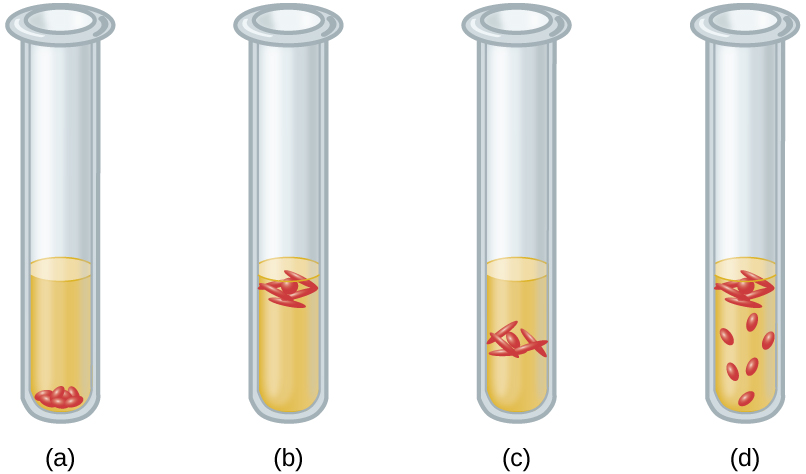

### Learning Objectives

* Interpret visual data demonstrating minimum, optimum, and maximum oxygen or carbon dioxide requirements for growth
* Identify and describe different categories of microbes with requirements for growth with or without oxygen: obligate aerobe, obligate anaerobe, facultative anaerobe, aerotolerant anaerobe, microaerophile, and capnophile
* Give examples of microorganisms for each category of growth requirements

Ask most people “What are the major requirements for life?” and the answers are likely to include water and oxygen. Few would argue about the need for water, but what about oxygen? Can there be life without oxygen?

The answer is that molecular oxygen (O2) is not always needed. The earliest signs of life are dated to a period when conditions on earth were highly reducing and free oxygen gas was essentially nonexistent. Only after cyanobacteria started releasing oxygen as a byproduct of photosynthesis and the capacity of iron in the oceans for taking up oxygen was exhausted did oxygen levels increase in the atmosphere. This event, often referred to as the **Great Oxygenation Event**{: data-type="term" .no-emphasis} or the **Oxygen Revolution**{: data-type="term" .no-emphasis}, caused a massive extinction. Most organisms could not survive the powerful oxidative properties of **reactive oxygen species**{: data-type="term"} (ROS), highly unstable ions and molecules derived from partial reduction of oxygen that can damage virtually any macromolecule or structure with which they come in contact. Singlet oxygen (O2•), superoxide <math xmlns="http://www.w3.org/1998/Math/MathML"><mrow><mrow><mo>(</mo><mrow><msup><mrow><msub><mtext>O</mtext><mn>2</mn></msub></mrow><mtext>−</mtext></msup></mrow><mo>)</mo></mrow><mo>,</mo></mrow></math>

 peroxides (H2O2), hydroxyl radical (OH•), and hypochlorite ion (OCl−), the active ingredient of household bleach, are all examples of ROS. The organisms that were able to detoxify reactive oxygen species harnessed the high electronegativity of oxygen to produce free energy for their metabolism and thrived in the new environment.

### Oxygen Requirements of Microorganisms

Many ecosystems are still free of molecular oxygen. Some are found in extreme locations, such as deep in the ocean or in earth’s crust; others are part of our everyday landscape, such as marshes, bogs, and sewers. Within the bodies of humans and other animals, regions with little or no oxygen provide an anaerobic environment for microorganisms. ([\[link\]](#OSC_Microbio_09_02_bog)).

  a bog where undisturbed dense sediments are virtually devoid of oxygen, and (b) the rumen (the first compartment of a cow&#x2019;s stomach), which provides an oxygen-free incubator for methanogens and other obligate anaerobic bacteria. (credit a: modification of work by National Park Service; credit b: modification of work by US Department of Agriculture)"){: #OSC_Microbio_09_02_bog}

We can easily observe different requirements for molecular oxygen by growing bacteria in **thioglycolate tube culture**{: data-type="term"}s. A test-tube culture starts with autoclaved **thioglycolate medium**{: data-type="term"} containing a low percentage of agar to allow motile bacteria to move throughout the medium. Thioglycolate has strong reducing properties and autoclaving flushes out most of the oxygen. The tubes are inoculated with the bacterial cultures to be tested and incubated at an appropriate temperature. Over time, oxygen slowly diffuses throughout the thioglycolate tube culture from the top. Bacterial density increases in the area where oxygen concentration is best suited for the growth of that particular organism.

The growth of bacteria with varying oxygen requirements in thioglycolate tubes is illustrated in [\[link\]](#OSC_Microbio_09_02_tubO). In tube A, all the growth is seen at the top of the tube. The bacteria are **obligate (strict) aerobe**{: data-type="term"}s that cannot grow without an abundant supply of oxygen. Tube B looks like the opposite of tube A. Bacteria grow at the bottom of tube B. Those are **obligate anaerobe**{: data-type="term"}s, which are killed by oxygen. Tube C shows heavy growth at the top of the tube and growth throughout the tube, a typical result with **facultative anaerobe**{: data-type="term"}s. Facultative anaerobes are organisms that thrive in the presence of oxygen but also grow in its absence by relying on fermentation or anaerobic respiration, if there is a suitable electron acceptor other than oxygen and the organism is able to perform anaerobic respiration. The **aerotolerant anaerobe**{: data-type="term"}s in tube D are indifferent to the presence of oxygen. They do not use oxygen because they usually have a fermentative metabolism, but they are not harmed by the presence of oxygen as obligate anaerobes are. Tube E on the right shows a “Goldilocks” culture. The oxygen level has to be just right for growth, not too much and not too little. These **microaerophile**{: data-type="term"}s are bacteria that require a minimum level of oxygen for growth, about 1%–10%, well below the 21% found in the atmosphere.

Examples of obligate aerobes are ***Mycobacterium tuberculosis***{: data-type="term" .no-emphasis}, the causative agent of tuberculosis and ***Micrococcus luteus***{: data-type="term" .no-emphasis}, a gram-positive bacterium that colonizes the skin. ***Neisseria meningitidis***{: data-type="term" .no-emphasis}, the causative agent of severe **bacterial meningitis**{: data-type="term" .no-emphasis}, and *N. gonorrhoeae*, the causative agent of sexually transmitted **gonorrhea**{: data-type="term" .no-emphasis}, are also obligate aerobes.

{: #OSC_Microbio_09_02_tubO}

Many obligate anaerobes are found in the environment where anaerobic conditions exist, such as in deep sediments of soil, still waters, and at the bottom of the deep ocean where there is no photosynthetic life. Anaerobic conditions also exist naturally in the intestinal tract of animals. Obligate anaerobes, mainly ***Bacteroidetes***{: data-type="term" .no-emphasis}, represent a large fraction of the microbes in the human gut. Transient anaerobic conditions exist when tissues are not supplied with blood circulation; they die and become an ideal breeding ground for obligate anaerobes. Another type of obligate anaerobe encountered in the human body is the gram-positive, rod-shaped ***Clostridium***{: data-type="term" .no-emphasis} spp. Their ability to form endospores allows them to survive in the presence of oxygen. One of the major causes of health-acquired infections is *C. difficile*, known as C. diff. Prolonged use of antibiotics for other infections increases the probability of a patient developing a secondary *C. difficile* infection. Antibiotic treatment disrupts the balance of microorganisms in the intestine and allows the colonization of the gut by *C. difficile*, causing a significant inflammation of the colon.

Other clostridia responsible for serious infections include *C. tetani*, the agent of tetanus, and *C. perfringens*, which causes **gas gangrene**{: data-type="term" .no-emphasis}. In both cases, the infection starts in necrotic tissue (dead tissue that is not supplied with oxygen by blood circulation). This is the reason that deep puncture wounds are associated with tetanus. When tissue death is accompanied by lack of circulation, gangrene is always a danger.

The study of obligate anaerobes requires special equipment. Obligate anaerobic bacteria must be grown under conditions devoid of oxygen. The most common approach is culture in an **anaerobic jar**{: data-type="term"} ([\[link\]](#OSC_Microbio_09_02_jar)). Anaerobic jars include chemical packs that remove oxygen and release carbon dioxide (CO2). An **anaerobic chamber**{: data-type="term"} is an enclosed box from which all oxygen is removed. Gloves sealed to openings in the box allow handling of the cultures without exposing the culture to air ([\[link\]](#OSC_Microbio_09_02_jar)).

  An anaerobic jar is pictured that is holding nine Petri plates supporting cultures. (b) Openings in the side of an anaerobic box are sealed by glove-like sleeves that allow for the handling of cultures inside the box. (credit a: modification of work by Centers for Disease Control and Prevention; credit b: modification of work by NIST)"){: #OSC_Microbio_09_02_jar}

Staphylococci and **Enterobacteriaceae**{: data-type="term" .no-emphasis} are examples of facultative anaerobes. Staphylococci are found on the skin and upper respiratory tract. Enterobacteriaceae are found primarily in the gut and upper respiratory tract but can sometimes spread to the urinary tract, where they are capable of causing infections. It is not unusual to see mixed bacterial infections in which the facultative anaerobes use up the oxygen, creating an environment for the obligate anaerobes to flourish.

Examples of aerotolerant anaerobes include lactobacilli and streptococci, both found in the oral microbiota. ***Campylobacter jejuni***{: data-type="term" .no-emphasis}, which causes gastrointestinal infections, is an example of a microaerophile and is grown under low-oxygen conditions.

The **optimum oxygen concentration**{: data-type="term"}, as the name implies, is the ideal concentration of oxygen for a particular microorganism. The lowest concentration of oxygen that allows growth is called the **minimum permissive oxygen concentration**{: data-type="term"}. The highest tolerated concentration of oxygen is the **maximum permissive oxygen concentration**{: data-type="term"}. The organism will not grow outside the range of oxygen levels found between the minimum and maximum permissive oxygen concentrations.

* Would you expect the oldest bacterial lineages to be aerobic or anaerobic?
* Which bacteria grow at the top of a thioglycolate tube, and which grow at the bottom of the tube?
{: data-bullet-style="bullet"}

An Unwelcome Anaerobe

Charles is a retired bus driver who developed type 2 **diabetes**{: data-type="term" .no-emphasis} over 10 years ago. Since his retirement, his lifestyle has become very sedentary and he has put on a substantial amount of weight. Although he has felt tingling and numbness in his left foot for a while, he has not been worried because he thought his foot was simply “falling asleep.” Recently, a scratch on his foot does not seem to be healing and is becoming increasingly ugly. Because the sore did not bother him much, Charles figured it could not be serious until his daughter noticed a purplish discoloration spreading on the skin and oozing ([\[link\]](#OSC_Microbio_09_02_foot)). When he was finally seen by his physician, Charles was rushed to the operating room. His open sore, or ulcer, is the result of a **diabetic foot**{: data-type="term" .no-emphasis}.

The concern here is that **gas gangrene**{: data-type="term" .no-emphasis} may have taken hold in the dead tissue. The most likely agent of gas gangrene is ***Clostridium perfringens***{: data-type="term" .no-emphasis}, an endospore-forming, gram-positive bacterium. It is an obligate anaerobe that grows in tissue devoid of oxygen. Since dead tissue is no longer supplied with oxygen by the circulatory system, the dead tissue provides pockets of ideal environment for the growth of *C. perfringens*.

A surgeon examines the ulcer and radiographs of Charles’s foot and determines that the bone is not yet infected. The wound will have to be surgically debrided (debridement refers to the removal of dead and infected tissue) and a sample sent for microbiological lab analysis, but Charles will not have to have his foot amputated. Many diabetic patients are not so lucky. In 2008, nearly 70,000 diabetic patients in the United States lost a foot or limb to amputation, according to statistics from the Centers for Disease Control and Prevention.[1](#footnote1){: data-type="footnote-link"}

* Which growth conditions would you recommend for the detection of *C. perfringens*?
{: data-bullet-style="bullet"}

"){: #OSC_Microbio_09_02_foot}

### Detoxification of Reactive Oxygen Species

Aerobic respiration constantly generates reactive oxygen species (ROS), byproducts that must be detoxified. Even organisms that do not use aerobic respiration need some way to break down some of the ROS that may form from atmospheric oxygen. Three main enzymes break down those toxic byproducts: superoxide dismutase, peroxidase, and catalase. Each one catalyzes a different reaction. Reactions of type seen in Reaction 1 are catalyzed by **peroxidase**{: data-type="term"}s.

<math xmlns="http://www.w3.org/1998/Math/MathML"><mrow><mrow><mo>(</mo><mn>1</mn><mo>)</mo></mrow><mspace width="2em" /><mtext>X</mtext><mo>−</mo><mrow><mo>(</mo><mrow><mn>2</mn><msup><mtext>H</mtext><mtext>+</mtext></msup></mrow><mo>)</mo></mrow><mo>+</mo><msub><mtext>H</mtext><mn>2</mn></msub><msub><mtext>O</mtext><mn>2</mn></msub><mo stretchy="false">→</mo><mtext>oxidized-X</mtext><mo>+</mo><mn>2</mn><msub><mtext>H</mtext><mn>2</mn></msub><mtext>O</mtext></mrow></math>

In these reactions, an electron donor (reduced compound; e.g., reduced nicotinamide adenine dinucleotide \[NADH\]) oxidizes **hydrogen peroxide**{: data-type="term" .no-emphasis}, or other peroxides, to water. The enzymes play an important role by limiting the damage caused by peroxidation of membrane lipids. Reaction 2 is mediated by the enzyme **superoxide dismutase**{: data-type="term"} (SOD) and breaks down the powerful superoxide anions generated by aerobic metabolism:

<math xmlns="http://www.w3.org/1998/Math/MathML"><mrow><mrow><mo>(</mo><mn>2</mn><mo>)</mo></mrow><mspace width="2em" /><mn>2</mn><msup><mtext>O</mtext><mrow><mn>2</mn><mtext>−</mtext></mrow></msup><mo>+</mo><mn>2</mn><msup><mtext>H</mtext><mo>+</mo></msup><mo stretchy="false">→</mo><msub><mtext>H</mtext><mn>2</mn></msub><msub><mtext>O</mtext><mn>2</mn></msub><mo>+</mo><msub><mtext>O</mtext><mn>2</mn></msub></mrow></math>

The enzyme **catalase**{: data-type="term"} converts hydrogen peroxide to water and oxygen as shown in Reaction 3.

<math xmlns="http://www.w3.org/1998/Math/MathML"><mrow><mrow><mo>(</mo><mn>3</mn><mo>)</mo></mrow><mspace width="2em" /><mn>2</mn><msub><mtext>H</mtext><mn>2</mn></msub><msub><mtext>O</mtext><mn>2</mn></msub><mo stretchy="false">→</mo><mn>2</mn><msub><mtext>H</mtext><mn>2</mn></msub><mtext>O</mtext><mo>+</mo><msub><mtext>O</mtext><mn>2</mn></msub></mrow></math>

Obligate anaerobes usually lack all three enzymes. Aerotolerant anaerobes do have SOD but no catalase. Reaction 3, shown occurring in [\[link\]](#OSC_Microbio_09_01_cat), is the basis of a useful and rapid test to distinguish streptococci, which are aerotolerant and do not possess catalase, from staphylococci, which are facultative anaerobes. A sample of culture rapidly mixed in a drop of 3% hydrogen peroxide will release bubbles if the culture is catalase positive.

  with the negative result (left). (credit: Centers for Disease Control and Prevention)"){: #OSC_Microbio_09_01_cat}

Bacteria that grow best in a higher concentration of CO2 and a lower concentration of oxygen than present in the atmosphere are called **capnophiles**{: data-type="term"}. One common approach to grow capnophiles is to use a **candle jar**{: data-type="term"}. A candle jar consists of a jar with a tight-fitting lid that can accommodate the cultures and a candle. After the cultures are added to the jar, the candle is lit and the lid closed. As the candle burns, it consumes most of the oxygen present and releases CO2.

* What substance is added to a sample to detect catalase?
* What is the function of the candle in a candle jar?
{: data-bullet-style="bullet"}

Part 2

The health-care provider who saw Jeni was concerned primarily because of her pregnancy. Her condition enhances the risk for infections and makes her more vulnerable to those infections. The immune system is downregulated during pregnancy, and pathogens that cross the placenta can be very dangerous for the fetus. A note on the provider’s order to the microbiology lab mentions a suspicion of infection by ***Listeria monocytogenes***{: data-type="term" .no-emphasis}, based on the signs and symptoms exhibited by the patient.

Jeni’s blood samples are streaked directly on **sheep blood agar**{: data-type="term" .no-emphasis}, a medium containing tryptic soy agar enriched with 5% sheep blood. (Blood is considered sterile; therefore, competing microorganisms are not expected in the medium.) The inoculated plates are incubated at 37 °C for 24 to 48 hours. Small grayish colonies surrounded by a clear zone emerge. Such colonies are typical of *Listeria* and other pathogens such as streptococci; the clear zone surrounding the colonies indicates complete lysis of blood in the medium, referred to as beta-hemolysis ([\[link\]](#OSC_Microbio_09_02_listumbrel)). When tested for the presence of catalase, the colonies give a positive response, eliminating *Streptococcus* as a possible cause. Furthermore, a Gram stain shows short gram-positive bacilli. Cells from a broth culture grown at room temperature displayed the tumbling motility characteristic of *Listeria* ([\[link\]](#OSC_Microbio_09_02_listumbrel)). All of these clues lead the lab to positively confirm the presence of *Listeria* in Jeni’s blood samples.

* How serious is Jeni’s condition and what is the appropriate treatment?
{: data-bullet-style="bullet"}

 A sample blood agar test showing beta-hemolysis. (b) A sample motility test showing both positive and negative results. (credit a: modification of work by Centers for Disease Control and Prevention; credit b: modification of work by &#x201C;VeeDunn&#x201D;/Flickr)"){: #OSC_Microbio_09_02_listumbrel}

*Jump to the [next](/m58831#fs-id1172099879960) Clinical Focus box. Go back to the [previous](/m58828#fs-id1172099378549) Clinical Focus box.*

### Key Concepts and Summary

* Aerobic and anaerobic environments can be found in diverse niches throughout nature, including different sites within and on the human body.
* Microorganisms vary in their requirements for molecular oxygen. **Obligate aerobes** depend on aerobic respiration and use oxygen as a terminal electron acceptor. They cannot grow without oxygen.
* **Obligate anaerobes** cannot grow in the presence of oxygen. They depend on fermentation and anaerobic respiration using a final electron acceptor other than oxygen.
* **Facultative anaerobes** show better growth in the presence of oxygen but will also grow without it.
* Although **aerotolerant anaerobes** do not perform aerobic respiration, they can grow in the presence of oxygen. Most aerotolerant anaerobes test negative for the enzyme **catalase**.
* **Microaerophiles** need oxygen to grow, albeit at a lower concentration than 21% oxygen in air.
* **Optimum oxygen concentration** for an organism is the oxygen level that promotes the fastest growth rate. The **minimum permissive oxygen concentration** and the **maximum permissive oxygen concentration** are, respectively, the lowest and the highest oxygen levels that the organism will tolerate.
* **Peroxidase**, **superoxide dismutase**, and **catalase** are the main enzymes involved in the detoxification of the **reactive oxygen species**. Superoxide dismutase is usually present in a cell that can tolerate oxygen. All three enzymes are usually detectable in cells that perform aerobic respiration and produce more ROS.
* A **capnophile** is an organism that requires a higher than atmospheric concentration of CO2 to grow.
{: data-bullet-style="bullet"}

### Multiple Choice

An inoculated thioglycolate medium culture tube shows dense growth at the surface and turbidity throughout the rest of the tube. What is your conclusion?

1.  The organisms die in the presence of oxygen
2.  The organisms are facultative anaerobes.
3.  The organisms should be grown in an anaerobic chamber.
4.  The organisms are obligate aerobes.
{: type="A"}

B

An inoculated thioglycolate medium culture tube is clear throughout the tube except for dense growth at the bottom of the tube. What is your conclusion?

1.  The organisms are obligate anaerobes.
2.  The organisms are facultative anaerobes.
3.  The organisms are aerotolerant.
4.  The organisms are obligate aerobes.
{: type="A"}

A

*Pseudomonas aeruginosa* is a common pathogen that infects the airways of patients with cystic fibrosis. It does not grow in the absence of oxygen. The bacterium is probably which of the following?

1.  an aerotolerant anaerobe
2.  an obligate aerobe
3.  an obligate anaerobe
4.  a facultative anaerobe
{: type="A"}

B

*Streptococcus mutans* is a major cause of cavities. It resides in the gum pockets, does not have catalase activity, and can be grown outside of an anaerobic chamber. The bacterium is probably which of the following?

1.  a facultative anaerobe
2.  an obligate aerobe
3.  an obligate anaerobe
4.  an aerotolerant anaerobe
{: type="A"}

D

Why do the instructions for the growth of *Neisseria gonorrhoeae* recommend a CO2-enriched atmosphere?

1.  It uses CO2 as a final electron acceptor in respiration.
2.  It is an obligate anaerobe.
3.  It is a capnophile.
4.  It fixes CO2 through photosynthesis.
{: type="A"}

C

### Matching

Four tubes are illustrated with cultures grown in a medium that slows oxygen diffusion. Match the culture tube with the correct type of bacteria from the following list: facultative anaerobe, obligate anaerobe, microaerophile, aerotolerant anaerobe, obligate aerobe.

  

(a) obligate anaerobe, (b) obligate aerobe, (c) microaerophile, (d) facultative anaerobe

### Short Answer

Why are some obligate anaerobes able to grow in tissues (e.g., gum pockets) that are not completely free of oxygen?

Why should *Haemophilus influenzae* be grown in a candle jar?

In terms of oxygen requirements, what type of organism would most likely be responsible for a foodborne illness associated with canned foods?

### Critical Thinking

A microbiology instructor prepares cultures for a gram-staining practical laboratory by inoculating growth medium with a gram-positive coccus (nonmotile) and a gram-negative rod (motile). The goal is to demonstrate staining of a mixed culture. The flask is incubated at 35 °C for 24 hours without aeration. A sample is stained and reveals only gram-negative rods. Both cultures are known facultative anaerobes. Give a likely reason for success of the gram-negative rod. Assume that the cultures have comparable intrinsic growth rates.

### Footnotes
{: data-type="footnote-refs-title"}

* {: data-type="footnote-ref" #footnote1} [1](#footnote-ref1){: data-type="footnote-ref-link"} Centers for Disease Control and Prevention. “Living With Diabetes: Keep Your Feet Healthy.” http://www.cdc.gov/Features/DiabetesFootHealth/
{: data-list-type="bulleted" data-bullet-style="none"}

