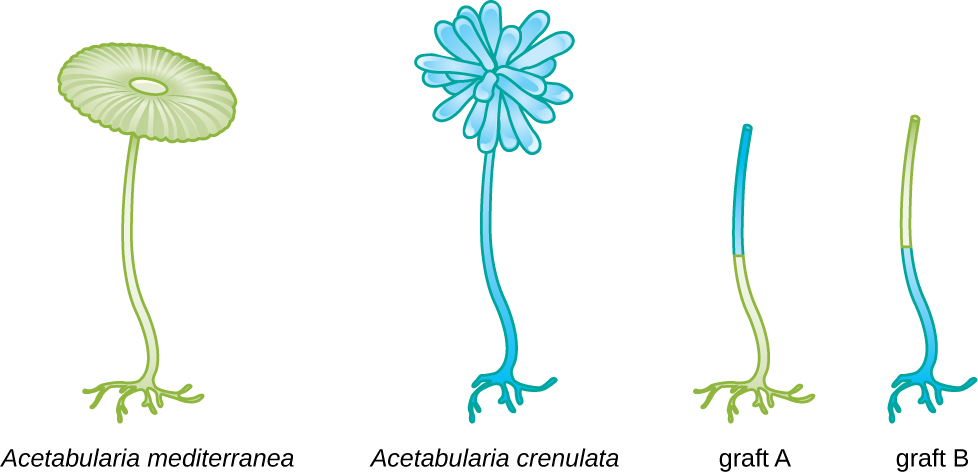

### Learning Objectives

* Describe the discovery of nucleic acid and nucleotides
* Explain the historical experiments that led to the characterization of DNA
* Describe how microbiology and microorganisms have been used to discover the biochemistry of genes
* Explain how scientists established the link between DNA and heredity

Part 1

Alex is a 22-year-old college student who vacationed in Puerta Vallarta, Mexico, for spring break. Unfortunately, two days after flying home to Ohio, he began to experience abdominal cramping and extensive watery diarrhea. Because of his discomfort, he sought medical attention at a large Cincinnati hospital nearby.

* What types of infections or other conditions may be responsible?
{: data-bullet-style="bullet"}

*Jump to the [next](/m58836#fs-id1172099702711) Clinical Focus box.*

Through the early 20th century, DNA was not yet recognized as the genetic material responsible for **heredity**{: data-type="term" .no-emphasis}, the passage of traits from one generation to the next. In fact, much of the research was dismissed until the mid-20th century. The scientific community believed, incorrectly, that the process of inheritance involved a blending of parental traits that produced an intermediate physical appearance in offspring; this hypothetical process appeared to be correct because of what we know now as continuous variation, which results from the action of many genes to determine a particular characteristic, like human height. Offspring appear to be a “blend” of their parents’ traits when we look at characteristics that exhibit continuous variation. The blending theory of inheritance asserted that the original parental traits were lost or absorbed by the blending in the offspring, but we now know that this is not the case.

Two separate lines of research, begun in the mid to late 1800s, ultimately led to the discovery and characterization of **DNA**{: data-type="term" .no-emphasis} and the foundations of genetics, the science of heredity. These lines of research began to converge in the 1920s, and research using microbial systems ultimately resulted in significant contributions to elucidating the molecular basis of **genetics**{: data-type="term" .no-emphasis}.

### Discovery and Characterization of DNA

Modern understanding of DNA has evolved from the discovery of nucleic acid to the development of the double-helix model. In the 1860s, Friedrich **Miescher**{: data-type="term" .no-emphasis} (1844–1895), a physician by profession, was the first person to isolate phosphorus-rich chemicals from leukocytes (white blood cells) from the pus on used bandages from a local surgical clinic. He named these chemicals (which would eventually be known as RNA and DNA) “**nuclein**{: data-type="term" .no-emphasis}” because they were isolated from the nuclei of the cells. His student Richard **Altmann**{: data-type="term" .no-emphasis} (1852–1900) subsequently termed it “**nucleic acid**{: data-type="term" .no-emphasis}” 20 years later when he discovered the acidic nature of nuclein. In the last two decades of the 19th century, German biochemist Albrecht **Kossel**{: data-type="term" .no-emphasis} (1853–1927) isolated and characterized the five different **nucleotide bases**{: data-type="term" .no-emphasis} composing nucleic acid. These are adenine, guanine, cytosine, thymine (in DNA), and uracil (in RNA). Kossell received the Nobel Prize in Physiology or Medicine in 1910 for his work on nucleic acids and for his considerable work on proteins, including the discovery of **histidine**{: data-type="term" .no-emphasis}.

### Foundations of Genetics

Despite the discovery of DNA in the late 1800s, scientists did not make the association with heredity for many more decades. To make this connection, scientists, including a number of microbiologists, performed many experiments on plants, animals, and bacteria.

#### Mendel’s Pea Plants

While Miescher was isolating and discovering DNA in the 1860s, Austrian monk and botanist Johann Gregor **Mendel**{: data-type="term" .no-emphasis} (1822–1884) was experimenting with garden peas, demonstrating and documenting basic patterns of inheritance, now known as Mendel’s laws.

In 1856, Mendel began his decade-long research into inheritance patterns. He used the diploid garden pea, *Pisum sativum*, as his primary model system because it naturally self-fertilizes and is highly inbred, producing “true-breeding” pea plant lines—plants that always produce offspring that look like the parent. By experimenting with true-breeding pea plants, Mendel avoided the appearance of unexpected traits in offspring that might occur if he used plants that were not true-breeding. Mendel performed hybridizations, which involve mating two true-breeding individuals (P generation) that have different traits, and examined the characteristics of their offspring (first filial generation, F1) as well as the offspring of self-fertilization of the F1 generation (second filial generation, F2) ([\[link\]](#OSC_Microbio_10_01_Mendel)).

 . The resulting hybrids in the F1 generation all had violet flowers. In the F2 generation, approximately three-quarters of the plants had violet flowers, and one-quarter had white flowers."){: #OSC_Microbio_10_01_Mendel}

In 1865, Mendel presented the results of his experiments with nearly 30,000 pea plants to the local natural history society. He demonstrated that traits are transmitted faithfully from parents to offspring independently of other traits. In 1866, he published his work, “Experiments in Plant Hybridization,”[1](#footnote1){: data-type="footnote-link"} in the *Proceedings of the Natural History Society of Brünn*. Mendel’s work went virtually unnoticed by the scientific community, which believed, incorrectly, in the theory of blending of traits in continuous variation.

He was not recognized for his extraordinary scientific contributions during his lifetime. In fact, it was not until 1900 that his work was rediscovered, reproduced, and revitalized by scientists on the brink of discovering the chromosomal basis of heredity.

#### The Chromosomal Theory of Inheritance

Mendel carried out his experiments long before **chromosomes**{: data-type="term" .no-emphasis} were visualized under a microscope. However, with the improvement of microscopic techniques during the late 1800s, cell biologists could stain and visualize subcellular structures with dyes and observe their actions during **meiosis**{: data-type="term" .no-emphasis}. They were able to observe chromosomes replicating, condensing from an amorphous nuclear mass into distinct X-shaped bodies and migrating to separate cellular poles. The speculation that chromosomes might be the key to understanding heredity led several scientists to examine Mendel’s publications and re-evaluate his model in terms of the behavior of chromosomes during **mitosis**{: data-type="term" .no-emphasis} and meiosis.

In 1902, Theodor **Boveri**{: data-type="term" .no-emphasis} (1862–1915) observed that in sea urchins, nuclear components (chromosomes) determined proper embryonic development. That same year, Walter **Sutton**{: data-type="term" .no-emphasis} (1877–1916) observed the separation of chromosomes into daughter cells during meiosis. Together, these observations led to the development of the **Chromosomal Theory of Inheritance**{: data-type="term" .no-emphasis}, which identified chromosomes as the genetic material responsible for Mendelian inheritance.

Despite compelling correlations between the behavior of chromosomes during meiosis and Mendel’s observations, the Chromosomal Theory of Inheritance was proposed long before there was any direct evidence that traits were carried on chromosomes. Thomas Hunt **Morgan**{: data-type="term" .no-emphasis} (1866–1945) and his colleagues spent several years carrying out crosses with the fruit fly, *Drosophila melanogaster*. They performed meticulous microscopic observations of fly chromosomes and correlated these observations with resulting fly characteristics. Their work provided the first experimental evidence to support the Chromosomal Theory of Inheritance in the early 1900s. In 1915, Morgan and his “Fly Room” colleagues published *The Mechanism of Mendelian Heredity,* which identified chromosomes as the cellular structures responsible for heredity. For his many significant contributions to genetics, Morgan received the Nobel Prize in Physiology or Medicine in 1933.

In the late 1920s, Barbara **McClintock**{: data-type="term" .no-emphasis} (1902–1992) developed chromosomal staining techniques to visualize and differentiate between the different chromosomes of maize (corn). In the 1940s and 1950s, she identified a breakage event on chromosome 9, which she named the dissociation locus (*Ds*). *Ds* could change position within the chromosome. She also identified an activator locus (*Ac*). *Ds* chromosome breakage could be activated by an *Ac* element (transposase enzyme). At first, McClintock’s finding of these **jumping genes**{: data-type="term" .no-emphasis}, which we now call **transposons**{: data-type="term" .no-emphasis}, was not accepted by the scientific community. It wasn’t until the 1960s and later that transposons were discovered in bacteriophages, bacteria, and *Drosophila*. Today, we know that transposons are mobile segments of DNA that can move within the genome of an organism. They can regulate gene expression, protein expression, and virulence (ability to cause disease).

#### Microbes and Viruses in Genetic Research

Microbiologists have also played a crucial part in our understanding of genetics. Experimental organisms such as **Mendel**{: data-type="term" .no-emphasis}’s garden peas, Morgan’s fruit flies, and **McClintock**{: data-type="term" .no-emphasis}’s corn had already been used successfully to pave the way for an understanding of genetics. However, microbes and viruses were (and still are) excellent model systems for the study of **genetics**{: data-type="term" .no-emphasis} because, unlike peas, fruit flies, and corn, they are propagated more easily in the laboratory, growing to high population densities in a small amount of space and in a short time. In addition, because of their structural simplicity, microbes and viruses are more readily manipulated genetically.

Fortunately, despite significant differences in size, structure, reproduction strategies, and other biological characteristics, there is biochemical unity among all organisms; they have in common the same underlying molecules responsible for **heredity**{: data-type="term" .no-emphasis} and the use of genetic material to give cells their varying characteristics. In the words of French scientist Jacques **Monod**{: data-type="term" .no-emphasis}, “What is true for *E. coli* is also true for the elephant,” meaning that the biochemistry of life has been maintained throughout evolution and is shared in all forms of life, from simple unicellular organisms to large, complex organisms. This biochemical continuity makes microbes excellent models to use for genetic studies.

In a clever set of experiments in the 1930s and 1940s, German scientist Joachim **Hämmerling**{: data-type="term" .no-emphasis} (1901–1980), using the single-celled alga ***Acetabularia***{: data-type="term" .no-emphasis} as a microbial model, established that the genetic information in a eukaryotic cell is housed within the **nucleus**{: data-type="term" .no-emphasis}. *Acetabularia* spp. are unusually large algal cells that grow asymmetrically, forming a “foot” containing the nucleus, which is used for substrate attachment; a stalk; and an umbrella-like cap—structures that can all be easily seen with the naked eye. In an early set of experiments, Hämmerling removed either the cap or the foot of the cells and observed whether new caps or feet were regenerated ([\[link\]](#OSC_Microbio_10_01_footandcap)). He found that when the foot of these cells was removed, new feet did not grow; however, when caps were removed from the cells, new caps were regenerated. This suggested that the hereditary information was located in the nucleus-containing foot of each cell.

  The cells of the single-celled alga Acetabularia measure 2&#x2013;6 cm and have a cell morphology that can be observed with the naked eye. Each cell has a cap, a stalk, and a foot, which contains the nucleus. (b) H&#xE4;mmerling found that if he removed the cap, a new cap would regenerate; but if he removed the foot, a new foot would not regenerate. He concluded that the genetic information needed for regeneration was found in the nucleus. (credit a: modification of work by James St. John)"){: #OSC_Microbio_10_01_footandcap}

In another set of experiments, Hämmerling used two species of *Acetabularia* that have different cap morphologies, *A. crenulata* and *A. mediterranea* ([\[link\]](#OSC_Microbio_10_01_AcetabCap)). He cut the caps from both types of cells and then grafted the stalk from an *A. crenulata* onto an *A. mediterranea* foot, and vice versa. Over time, he observed that the grafted cell with the *A. crenulata* foot and *A. mediterranea* stalk developed a cap with the *A. crenulata* morphology. Conversely, the grafted cell with the *A. mediterranea* foot and *A. crenulata* stalk developed a cap with the *A. mediterranea* morphology. He microscopically confirmed the presence of nuclei in the feet of these cells and attributed the development of these cap morphologies to the nucleus of each grafted cell. Thus, he showed experimentally that the **nucleus**{: data-type="term" .no-emphasis} was the location of genetic material that dictated a cell’s properties.

 {: #OSC_Microbio_10_01_AcetabCap}

Another microbial model, the red bread mold ***Neurospora crassa***{: data-type="term" .no-emphasis}, was used by George Beadle and Edward Tatum to demonstrate the relationship between genes and the proteins they encode. Beadle had worked with fruit flies in **Morgan**{: data-type="term" .no-emphasis}’s laboratory but found them too complex to perform certain types of experiments. *N. crassa*, on the other hand, is a simpler organism and has the ability to grow on a minimal medium because it contains enzymatic pathways that allow it to use the medium to produce its own vitamins and amino acids.

**Beadle and Tatum**{: data-type="term" .no-emphasis} irradiated the mold with X-rays to induce changes to a sequence of nucleic acids, called **mutations**{: data-type="term" .no-emphasis}. They mated the irradiated mold spores and attempted to grow them on both a complete medium and a minimal medium. They looked for **mutants**{: data-type="term" .no-emphasis} that grew on a complete medium, supplemented with vitamins and amino acids, but did not grow on the minimal medium lacking these supplements. Such molds theoretically contained mutations in the genes that encoded biosynthetic pathways. Upon finding such mutants, they systematically tested each to determine which vitamin or amino acid it was unable to produce ([\[link\]](#OSC_Microbio_10_01_X-rayMold)) and published this work in 1941.[2](#footnote2){: data-type="footnote-link"}

 ![Diagram of Beadle and Tatum&#x2019;s experiment. Wild type spores are exposed to X-rays to form mutagenized spores. The wild type and mutagenized spores are then crossed. The mutants are then grown on complete (with amino acids) and minimal media (without amino acids). Mutants that grow only on complete medium are identified. Spores that cannot grow on a minimal medium are tested on a minimal medium with a single amino acid added. Spores that grow inonly one of these tubes have a mutation in the pathway that produces that particular amino acid.](../resources/OSC_Microbio_10_01_X-rayMold.jpg "Beadle and Tatum&#x2019;s experiment involved the mating of irradiated and nonirradiated mold spores. These spores were grown on both complete medium and a minimal medium to determine which amino acid or vitamin the mutant was unable to produce on its own."){: #OSC_Microbio_10_01_X-rayMold}

Subsequent work by Beadle, Tatum, and colleagues showed that they could isolate different classes of mutants that required a particular supplement, like the amino acid arginine ([\[link\]](#OSC_Microbio_10_01_GeneEnzyme)). With some knowledge of the arginine biosynthesis pathway, they identified three classes of arginine mutants by supplementing the minimal medium with intermediates (citrulline or ornithine) in the pathway. The three mutants differed in their abilities to grow in each of the media, which led the group of scientists to propose, in 1945, that each type of mutant had a defect in a different gene in the arginine biosynthesis pathway. This led to the so-called **one gene–one enzyme hypothesis**{: data-type="term" .no-emphasis}, which suggested that each gene encodes one enzyme.

Subsequent knowledge about the processes of **transcription**{: data-type="term" .no-emphasis} and **translation**{: data-type="term" .no-emphasis} led scientists to revise this to the “one gene–one polypeptide” hypothesis. Although there are some genes that do not encode polypeptides (but rather encode for transfer RNAs \[tRNAs\] or ribosomal RNAs \[rRNAs\], which we will discuss later), the one gene–one enzyme hypothesis is true in many cases, especially in microbes. Beadle and Tatum’s discovery of the link between genes and corresponding characteristics earned them the 1958 Nobel Prize in Physiology and Medicine and has since become the basis for modern molecular genetics.

 ![The table at the top is labeled Beadle and Tatum Experiments and shows the growth pattern of 4 different spores. The wild type spore grew on minimal medium (MM), MM + Ornithing, MM + Citruline and MM + Arginine. Mutant 1 did not grow on MM but did grow on MM + Ornithing, MM + Citruline and MM + Arginine. Mutant 2 did not grow on MM or  MM + Ornithing but did grow on  MM + Citruline and MM + Arginine. Mutant 3 did not grow on MM, MM + Ornithing, or MM + Citruline but did grow on MM + Arginine.  Underneath the table is a diagram that explains these results. The top diagram shows a pathway where gene 1 produces enzyme 1 and enzyme 1 produces ornithine. Gene 2 produces enzyme 2 which converts ornithine to citruline. Gene 3 produces enzyme 3 which converts citruline to arginine. Mutant 1 had a mutation in gene 1 that destroyed the function of enzyme 1, so one of the amino acids are produced. Mutant 2 had a mutation in gene 2 that destroyed the function of enzyme 2. So, Ornithine is still produced but citruline and arginine are not. Mutant 3 had a mutation in gene 3 that destroyed the function of enzyme 3. So, ornithine and citruline are produced but arginine is not.](../resources/OSC_Microbio_10_01_GeneEnzyme.jpg "Three classes of arginine mutants were identified, each differing in their ability to grow in the presence of intermediates in the arginine biosynthesis pathway. From this, Beadle and Tatum concluded that each mutant was defective in a different gene encoding a different enzyme in the arginine biosynthesis pathway, leading to them to their one gene&#x2013;one enzyme hypothesis."){: #OSC_Microbio_10_01_GeneEnzyme}

To learn more about the experiments of Beadle and Tatum, visit this [website][1] from the DNA Learning Center.

* What organism did Morgan and his colleagues use to develop the Chromosomal Theory of Inheritance? What traits did they track?
* What did Hämmerling prove with his experiments on *Acetabularia*?
{: data-bullet-style="bullet"}

### DNA as the Molecule Responsible for Heredity

By the beginning of the 20th century, a great deal of work had already been done on characterizing **DNA**{: data-type="term" .no-emphasis} and establishing the foundations of genetics, including attributing heredity to chromosomes found within the nucleus. Despite all of this research, it was not until well into the 20th century that these lines of research converged and scientists began to consider that DNA could be the genetic material that offspring inherited from their parents. DNA, containing only four different **nucleotides**{: data-type="term" .no-emphasis}, was thought to be structurally too simple to encode such complex genetic information. Instead, protein was thought to have the complexity required to serve as cellular genetic information because it is composed of 20 different amino acids that could be combined in a huge variety of combinations. Microbiologists played a pivotal role in the research that determined that DNA is the molecule responsible for **heredity**{: data-type="term" .no-emphasis}.

#### Griffith’s Transformation Experiments

British bacteriologist Frederick **Griffith**{: data-type="term" .no-emphasis} (1879–1941) was perhaps the first person to show that hereditary information could be transferred from one cell to another “horizontally” (between members of the same generation), rather than “vertically” (from parent to offspring). In 1928, he reported the first demonstration of **bacterial transformation**{: data-type="term" .no-emphasis}, a process in which external DNA is taken up by a cell, thereby changing its characteristics.[3](#footnote3){: data-type="footnote-link"} He was working with two strains of ***Streptococcus pneumoniae***{: data-type="term" .no-emphasis}, a bacterium that causes pneumonia: a rough (R) strain and a smooth (S) strain. The R strain is nonpathogenic and lacks a capsule on its outer surface; as a result, colonies from the R strain appear rough when grown on plates. The S strain is pathogenic and has a capsule outside its cell wall, allowing it to escape phagocytosis by the host immune system. The capsules cause colonies from the S strain to appear smooth when grown on plates.

In a series of experiments, Griffith analyzed the effects of live R, live S, and heat-killed S strains of *S. pneumoniae* on live mice ([\[link\]](#OSC_Microbio_10_01_Griffith)). When mice were injected with the live S strain, the mice died. When he injected the mice with the live R strain or the heat-killed S strain, the mice survived. But when he injected the mice with a mixture of live R strain and heat-killed S strain, the mice died. Upon isolating the live bacteria from the dead mouse, he only recovered the S strain of bacteria. When he then injected this isolated S strain into fresh mice, the mice died. Griffith concluded that something had passed from the heat-killed S strain into the live R strain and “transformed” it into the pathogenic S strain; he called this the “transforming principle.” These experiments are now famously known as **Griffith’s transformation experiments**{: data-type="term" .no-emphasis}.

 {: #OSC_Microbio_10_01_Griffith}

In 1944, Oswald **Avery**{: data-type="term" .no-emphasis}, Colin **MacLeod**{: data-type="term" .no-emphasis}, and Maclyn **McCarty**{: data-type="term" .no-emphasis} were interested in exploring Griffith’s transforming principle further. They isolated the S strain from infected dead mice, heat-killed it, and inactivated various components of the S extract, conducting a systematic elimination study ([\[link\]](#OSC_Microbio_10_01_DNATrans)). They used enzymes that specifically degraded proteins, RNA, and DNA and mixed the S extract with each of these individual enzymes. Then, they tested each extract/enzyme combination’s resulting ability to transform the R strain, as observed by the diffuse growth of the S strain in culture media and confirmed visually by growth on plates. They found that when **DNA**{: data-type="term" .no-emphasis} was degraded, the resulting mixture was no longer able to transform the R strain bacteria, whereas no other enzymatic treatment was able to prevent transformation. This led them to conclude that DNA was the transforming principle. Despite their results, many scientists did not accept their conclusion, instead believing that there were protein contaminants within their extracts.

 ![A diagram of Avery, MaLeod and McCarty&#x2019;s experiment: Determining the identity of the hereditary material. Heat is used to kill S strain of S. pneumonia and capsule components are removed from solution. This produes a solution with DNA, RNA and proteins. This solution is then placed into 4 tubes. In the control, no enzymes are used so DNA, RNA, and proteins are all present. R cells are then added and S cells are found because transformation occurred. In the next experiment proteases degrade proteins in the sample, leaving DNA and RNA. R cells are added and S cells are found. Therefore, transformation occurred in the absence of proteins. In the next experiment ribonucleases degrade RNA in the sample, leaving DNA and proteins. R cells are added and S cells are found. Therefore, transformation occurred in the absence of RNA. In the final experiment deoxyribonucleases degrade DNA in the sample, leaving proteins and RNA. R cells are added and S cells are not found. Therefore, transformation does not occur without DNA. DNA is necessary for transformation.](../resources/OSC_Microbio_10_01_DNATrans.jpg "Oswald Avery, Colin MacLeod, and Maclyn McCarty followed up on Griffith&#x2019;s experiment and experimentally determined that the transforming principle was DNA."){: #OSC_Microbio_10_01_DNATrans}

* How did Avery, MacLeod, and McCarty’s experiments show that DNA was the transforming principle first described by Griffith?
{: data-bullet-style="bullet"}

#### Hershey and Chase’s Proof of DNA as Genetic Material

Alfred Hershey and Martha Chase performed their own experiments in 1952 and were able to provide confirmatory evidence that **DNA**{: data-type="term" .no-emphasis}, not protein, was the genetic material ([\[link\]](#OSC_Microbio_10_01_HersheyChase)).[4](#footnote4){: data-type="footnote-link"} **Hershey and Chase**{: data-type="term" .no-emphasis} were studying a **bacteriophage**{: data-type="term" .no-emphasis}, a virus that infects bacteria. Viruses typically have a simple structure: a protein coat, called the capsid, and a nucleic acid core that contains the genetic material, either DNA or RNA (see [Viruses](/m58808){: .target-chapter}). The particular bacteriophage they were studying was the T2 bacteriophage, which infects *E. coli* cells. As we now know today, T2 attaches to the surface of the bacterial cell and then it injects its nucleic acids inside the cell. The phage DNA makes multiple copies of itself using the host machinery, and eventually the host cell bursts, releasing a large number of bacteriophages.

Hershey and Chase labeled the protein coat in one batch of phage using radioactive sulfur, 35S, because sulfur is found in the amino acids methionine and cysteine but not in nucleic acids. They labeled the DNA in another batch using radioactive phosphorus, 32P, because phosphorus is found in DNA and RNA but not typically in protein.

Each batch of phage was allowed to infect the cells separately. After infection, Hershey and Chase put each phage bacterial suspension in a blender, which detached the phage coats from the host cell, and spun down the resulting suspension in a centrifuge. The heavier bacterial cells settled down and formed a pellet, whereas the lighter phage particles stayed in the supernatant. In the tube with the protein labeled, the radioactivity remained only in the supernatant. In the tube with the DNA labeled, the radioactivity was detected only in the bacterial cells. Hershey and Chase concluded that it was the phage DNA that was injected into the cell that carried the information to produce more phage particles, thus proving that DNA, not proteins, was the source of the genetic material. As a result of their work, the scientific community more broadly accepted DNA as the molecule responsible for heredity.

 ![Diagram of Hershey Chase experiment. 1- One batch of phage was labeled with 32P which is incorporated into the DNA. Another batch is labeled with 35S which is incorporated into the protein coat. 2 &#x2013; Bacteria were infected with the phage. The researchers were looking to identify if viral DNA or viral protein entered the host cell. 3 &#x2013; Each culture is blended and centrifuged to separate the phage from the bacteria. The centrifuge separates the lighter phage particles from the heavier bacterial cells. 4 &#x2013; Bacteria infected with phage 32P labeled DNA produce 32P labeled phage. Bacteria infected with 35S labeled phage produced unlabeled phage.](../resources/OSC_Microbio_10_01_HersheyChase.jpg "Martha Chase and Alfred Hershey conducted an experiment separately labeling the DNA and proteins of the T2 bacteriophage to determine which component was the genetic material responsible for the production of new phage particles."){: #OSC_Microbio_10_01_HersheyChase}

By the time **Hershey and Chase**{: data-type="term" .no-emphasis} published their experiment in the early 1950s, microbiologists and other scientists had been researching heredity for over 80 years. Building on one another’s research during that time culminated in the general agreement that DNA was the genetic material responsible for heredity ([\[link\]](#OSC_Microbio_10_01_Timeline)). This knowledge set the stage for the age of molecular biology to come and the significant advancements in biotechnology and systems biology that we are experiencing today.

To learn more about the experiments involved in the history of genetics and the discovery of DNA as the genetic material of cells, visit this [website][2] from the DNA Learning Center.

* How did Hershey and Chase use microbes to prove that DNA is genetic material?
{: data-bullet-style="bullet"}

 ![A timeline. 1865: Mendel documents patters of heredity in pea plants. 1869L Miescher first identifies DNA (&#x201C;nuclein&#x201D;). 1902: Sutton and Boveri propose chromosome theory of heredity. 1915: Morgan and his &#x201C;Fly Room&#x201D; colleagues confirm the chromosome theory of heredity. 1927: Muller shows that X-rays induce mutation. 1928: Griffith&#x2019;s &#x201C;transformation experiments&#x201D; transform non-pathogenic bacterial strains to pathogenic. 1930&#x2019;s: Mammerling shows that hereditary information is contained in the nuclei of eukaryotic cells. 1930: McClintock demonstrates genetic recombination in corn. 1941: Beadle and Tatum describe the &#x201C;one gen-one enzyme&#x201D; hypothesis. 1944: Avery, McLeod, and McCarty show that DNA is the &#x201C;transforming principle&#x201D; responsible for heredity. 1950: Chargaff discovers that A=T and C=G (Chargaff&#x2019;s rules). 1952: Hershey and Chase use radioactive labeling to prove that DNA is responsible for heredity. 1953: Watson and Crick propose the double helix structure of DNA. 1961: Jacob and Monod propose the existence of mRNA. 1990&#x2019;s: Genome sequence projects begin.](../resources/OSC_Microbio_10_01_Timeline.jpg "A timeline of key events leading up to the identification of DNA as the molecule responsible for heredity"){: #OSC_Microbio_10_01_Timeline}

### Key Concepts and Summary

* **DNA** was discovered and characterized long before its role in heredity was understood. Microbiologists played significant roles in demonstrating that DNA is the hereditary information found within cells.
* In the 1850s and 1860s, Gregor Mendel experimented with true-breeding garden peas to demonstrate the **heritability** of specific observable traits.
* In 1869, Friedrich Miescher isolated and purified a compound rich in phosphorus from the nuclei of white blood cells; he named the compound nuclein. Miescher’s student Richard Altmann discovered its acidic nature, renaming it **nucleic acid**. Albrecht Kossell characterized the **nucleotide bases** found within nucleic acids.
* Although Walter Sutton and Theodor Boveri proposed the **Chromosomal Theory of Inheritance** in 1902, it was not scientifically demonstrated until the 1915 publication of the work of Thomas Hunt Morgan and his colleagues.
* Using *Acetabularia,* a large algal cell, as his model system, Joachim Hämmerling demonstrated in the 1930s and 1940s that the nucleus was the location of hereditary information in these cells.
* In the 1940s, George Beadle and Edward Tatum used the mold *Neurospora crassa* to show that each protein’s production was under the control of a single gene, demonstrating the **“one gene–one enzyme” hypothesis**.
* In 1928, Frederick Griffith showed that dead encapsulated bacteria could pass genetic information to live nonencapsulated bacteria and transform them into harmful strains. In 1944, Oswald Avery, Colin McLeod, and Maclyn McCarty identified the compound as DNA.
* The nature of DNA as the molecule that stores genetic information was unequivocally demonstrated in the experiment of Alfred Hershey and Martha Chase published in 1952. Labeled DNA from bacterial viruses entered and infected bacterial cells, giving rise to more viral particles. The labeled protein coats did not participate in the transmission of genetic information.
{: data-bullet-style="bullet"}

### Multiple Choice

Frederick Griffith infected mice with a combination of dead R and live S bacterial strains. What was the outcome, and why did it occur?

1.  The mice will live. Transformation was not required.
2.  The mice will die. Transformation of genetic material from R to S was required.
3.  The mice will live. Transformation of genetic material from S to R was required.
4.  The mice will die. Transformation was not required.
{: data-number-style="upper-alpha"}

D

Why was the alga *Acetabularia* a good model organism for Joachim Hämmerling to use to identify the location of genetic material?

1.  It lacks a nuclear membrane.
2.  It self-fertilizes.
3.  It is a large, asymmetrical, single cell easy to see with the naked eye.
4.  It makes a protein capsid.
{: data-number-style="upper-alpha"}

C

Which of the following best describes the results from Hershey and Chase’s experiment using bacterial viruses with 35S-labeled proteins or 32P-labeled DNA that are consistent with protein being the molecule responsible for hereditary?

1.  After infection with the 35S-labeled viruses and centrifugation, only the pellet would be radioactive.
2.  After infection with the 35S-labeled viruses and centrifugation, both the pellet and the supernatant would be radioactive.
3.  After infection with the 32P-labeled viruses and centrifugation, only the pellet would be radioactive.
4.  After infection with the 32P-labeled viruses and centrifugation, both the pellet and the supernatant would be radioactive.
{: data-number-style="upper-alpha"}

A

Which method did Morgan and colleagues use to show that hereditary information was carried on chromosomes?

1.  statistical predictions of the outcomes of crosses using true-breeding parents
2.  correlations between microscopic observations of chromosomal movement and the characteristics of offspring
3.  transformation of nonpathogenic bacteria to pathogenic bacteria
4.  mutations resulting in distinct defects in metabolic enzymatic pathways
{: data-number-style="upper-alpha"}

B

According to Beadle and Tatum’s “one gene–one enzyme” hypothesis, which of the following enzymes will eliminate the transformation of hereditary material from pathogenic bacteria to nonpathogenic bacteria?

1.  carbohydrate-degrading enzymes
2.  proteinases
3.  ribonucleases
4.  deoxyribonucleases
{: data-number-style="upper-alpha"}

D

### Fill in the Blank

The element \_\_\_\_\_\_\_\_\_\_\_\_ is unique to nucleic acids compared with other macromolecules.

phosphorus

In the late 1800s and early 1900s, the macromolecule thought to be responsible for heredity was \_\_\_\_\_\_\_\_\_\_\_\_\_\_.

protein

### Short Answer

Why do bacteria and viruses make good model systems for various genetic studies?

Why was nucleic acid disregarded for so long as the molecule responsible for the transmission of hereditary information?

Bacteriophages inject their genetic material into host cells, whereas animal viruses enter host cells completely. Why was it important to use a bacteriophage in the Hershey–Chase experiment rather than an animal virus?

### Critical Thinking

In the figure shown, if the nuclei were contained within the stalks of *Acetabularia*, what types of caps would you expect from the pictured grafts?

Why are Hershey and Chase credited with identifying DNA as the carrier of heredity even though DNA had been discovered many years before?

### Footnotes
{: data-type="footnote-refs-title"}

* {: data-type="footnote-ref" #footnote1} [1](#footnote-ref1){: data-type="footnote-ref-link"} J.G. Mendel. “Versuche über Pflanzenhybriden.” *Verhandlungen des naturforschenden Vereines in Brünn, Bd. Abhandlungen* 4 (1865):3–7. (For English translation, see http://www.mendelweb.org/Mendel.plain.html)
* {: data-type="footnote-ref" #footnote2} [2](#footnote-ref2){: data-type="footnote-ref-link"} G.W. Beadle, E.L. Tatum. “Genetic Control of Biochemical Reactions in *Neurospora.” Proceedings of the National Academy of Sciences* 27 no. 11 (1941):499–506.
* {: data-type="footnote-ref" #footnote3} [3](#footnote-ref3){: data-type="footnote-ref-link"} F. Griffith. “The Significance of Pneumococcal Types.” *Journal of Hygiene* 27 no. 2 (1928):8–159.
* {: data-type="footnote-ref" #footnote4} [4](#footnote-ref4){: data-type="footnote-ref-link"} A.D. Hershey, M. Chase. “Independent Functions of Viral Protein and Nucleic Acid in Growth of Bacteriophage.” *Journal of General Physiology* 36 no. 1 (1952):39–56.
{: data-list-type="bulleted" data-bullet-style="none"}

[1]: https://www.openstax.org/l/22expbeatatum
[2]: https://www.openstax.org/l/22dnalearncen
