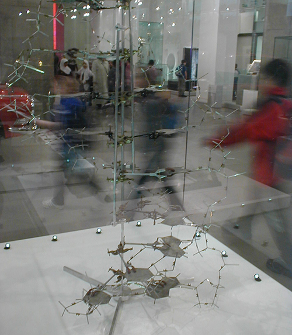
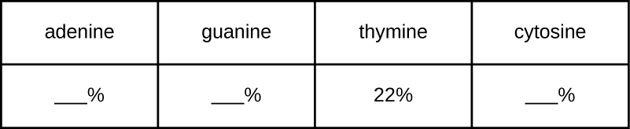

### Learning Objectives

* Describe the biochemical structure of deoxyribonucleotides
* Identify the base pairs used in the synthesis of deoxyribonucleotides
* Explain why the double helix of DNA is described as antiparallel

In [Microbial Metabolism](/m58818){: .target-chapter}, we discussed three classes of macromolecules: proteins, lipids, and carbohydrates. In this chapter, we will discuss a fourth class of macromolecules: nucleic acids. Like other macromolecules, **nucleic acid**{: data-type="term"}s are composed of monomers, called **nucleotide**{: data-type="term"}s, which are polymerized to form large strands. Each nucleic acid strand contains certain nucleotides that appear in a certain order within the strand, called its **base sequence**{: data-type="term"}. The base sequence of **deoxyribonucleic acid (DNA)**{: data-type="term"} is responsible for carrying and retaining the hereditary information in a cell. In [Mechanisms of Microbial Genetics](/m58839){: .target-chapter}, we will discuss in detail the ways in which DNA uses its own base sequence to direct its own synthesis, as well as the synthesis of **RNA**{: data-type="term" .no-emphasis} and proteins, which, in turn, gives rise to products with diverse structure and function. In this section, we will discuss the basic structure and function of DNA.

### DNA Nucleotides

The building blocks of nucleic acids are nucleotides. Nucleotides that compose DNA are called **deoxyribonucleotides**{: data-type="term"}. The three components of a deoxyribonucleotide are a five-carbon sugar called **deoxyribose**{: data-type="term" .no-emphasis}, a phosphate group, and a **nitrogenous base**{: data-type="term"}, a nitrogen-containing ring structure that is responsible for **complementary base pairing**{: data-type="term" .no-emphasis} between nucleic acid strands ([\[link\]](#OSC_Microbio_10_02_Nucleotide)). The carbon atoms of the five-carbon deoxyribose are numbered 1ʹ, 2ʹ, 3ʹ, 4ʹ, and 5ʹ (1ʹ is read as “one prime”). A **nucleoside**{: data-type="term" .no-emphasis} comprises the five-carbon sugar and nitrogenous base.

 ![a) At the center of a deoxyribonucleotide is a deoxyribose sugar. This is a pentagon shape with O at the top and H attached to the bottom right Carbon and OH attached to the bottom right Carbon. Attached to the upper left carbon is a phosphate group which consists of a Phosphate attached to 4 oxygens. Attached to the upper right carbon of the sugar is a base which consists of 1 or 2 rings that contain both carbon and nitrogen. B) A more detailed drawing of deoxyribose. This is a pentagon shaped structure with oxygen at the top corner.  Moving clockwise, the upper right corner has a carbon labeled 1-prime. There is an OH attached to this carbon. The bottom right carbon is labeled 2-prime and has an H attached to it. The bottom left carbon is labeled 3-prime and has an OH group attached to it. The upper left carbon is labeled 4-prime and has CH2OH attached. This last carbon is labeled 5-prime.](../resources/OSC_Microbio_10_02_Nucleotide.jpg "(a) Each deoxyribonucleotide is made up of a sugar called deoxyribose, a phosphate group, and a nitrogenous base&#x2014;in this case, adenine. (b) The five carbons within deoxyribose are designated as 1&#x2B9;, 2&#x2B9;, 3&#x2B9;, 4&#x2B9;, and 5&#x2B9;."){: #OSC_Microbio_10_02_Nucleotide}

The deoxyribonucleotide is named according to the **nitrogenous bases**{: data-type="term" .no-emphasis} ([\[link\]](#OSC_Microbio_10_02_Bases)). The nitrogenous bases **adenine**{: data-type="term"} (A) and **guanine**{: data-type="term"} (G) are the **purines**{: data-type="term"}; they have a double-ring structure with a six-carbon ring fused to a five-carbon ring. The **pyrimidines**{: data-type="term"}, **cytosine**{: data-type="term"} (C) and **thymine**{: data-type="term"} (T), are smaller nitrogenous bases that have only a six-carbon ring structure.

 {: #OSC_Microbio_10_02_Bases}

Individual nucleoside triphosphates combine with each other by covalent bonds known as 5ʹ-3ʹ **phosphodiester bonds**{: data-type="term"}, or linkages whereby the phosphate group attached to the 5ʹ carbon of the sugar of one nucleotide bonds to the hydroxyl group of the 3ʹ carbon of the sugar of the next nucleotide. Phosphodiester bonding between nucleotides forms the **sugar-phosphate backbone**{: data-type="term"}, the alternating sugar-phosphate structure composing the framework of a nucleic acid strand ([\[link\]](#OSC_Microbio_10_02_NAcidStrand)). During the polymerization process, deoxynucleotide triphosphates (dNTP) are used. To construct the sugar-phosphate backbone, the two terminal phosphates are released from the dNTP as a pyrophosphate. The resulting strand of nucleic acid has a free phosphate group at the 5ʹ carbon end and a free hydroxyl group at the 3ʹ carbon end. The two unused phosphate groups from the nucleotide triphosphate are released as pyrophosphate during phosphodiester bond formation. Pyrophosphate is subsequently hydrolyzed, releasing the energy used to drive nucleotide polymerization.

 ![A nucleotide with a sugar in the center, the sugar is a pentagon with oxygen at the top point. Moving clockwise the carbons are numbered 1 (upper right) 2, (bottom right), 3 (bottom left), 4 (upper left) and 5 (projecting from carbon 4. Attached to carbon 1 is a base (thymine). Attached to carbon 5 is a phosphate group. Another nucleotide below has the same structure (other than that the base is C rather than T). The phosphate group attached to carbon 5 of the lower nucleotide is also attached to carbon 3 of the upper nucleotide. The lower nucleotide has an OH attached to its carbon 3. Another nucleotide has the OH group of its phosphate highlighted. A phospodiester bond forms when water is removed from these two OH groups. This results in a bond forming between carbon 3 of the nucleotide in the chain and the phosphate group attached to carbon 5 of the new nucleotide. This is called a phosphodiester bond.](../resources/OSC_Microbio_10_02_NAcidStrand.jpg "Phosphodiester bonds form between the phosphate group attached to the 5&#x2B9; carbon of one nucleotide and the hydroxyl group of the 3&#x2B9; carbon in the next nucleotide, bringing about polymerization of nucleotides in to nucleic acid strands. Note the 5&#x2B9; and 3&#x2B9; ends of this nucleic acid strand."){: #OSC_Microbio_10_02_NAcidStrand}

* What is meant by the 5ʹ and 3ʹ ends of a nucleic acid strand?
{: data-bullet-style="bullet"}

### Discovering the Double Helix

By the early 1950s, considerable evidence had accumulated indicating that DNA was the genetic material of cells, and now the race was on to discover its three-dimensional structure. Around this time, Austrian biochemist Erwin **Chargaff**{: data-type="term" .no-emphasis}[1](#footnote1){: data-type="footnote-link"} (1905–2002) examined the content of **DNA**{: data-type="term" .no-emphasis} in different species and discovered that adenine, thymine, guanine, and cytosine were not found in equal quantities, and that it varied from species to species, but not between individuals of the same species. He found that the amount of adenine was very close to equaling the amount of thymine, and the amount of cytosine was very close to equaling the amount of guanine, or A = T and G = C. These relationships are also known as **Chargaff’s rules**{: data-type="term" .no-emphasis}.

Other scientists were also actively exploring this field during the mid-20th century. In 1952, American scientist Linus **Pauling**{: data-type="term" .no-emphasis} (1901–1994) was the world’s leading structural chemist and odds-on favorite to solve the structure of DNA. Pauling had earlier discovered the structure of protein α helices, using **X-ray diffraction**{: data-type="term" .no-emphasis}, and, based upon X-ray diffraction images of DNA made in his laboratory, he proposed a triple-stranded model of DNA.[2](#footnote2){: data-type="footnote-link"} At the same time, British researchers Rosalind **Franklin**{: data-type="term" .no-emphasis} (1920–1958) and her graduate student R.G. **Gosling**{: data-type="term" .no-emphasis} were also using X-ray diffraction to understand the structure of DNA ([\[link\]](#OSC_Microbio_10_02_X-rayDiff)). It was Franklin’s scientific expertise that resulted in the production of more well-defined X-ray diffraction images of DNA that would clearly show the overall double-helix structure of DNA.

 "){: #OSC_Microbio_10_02_X-rayDiff}

James Watson (1928–), an American scientist, and Francis Crick (1916–2004), a British scientist, were working together in the 1950s to discover DNA’s structure. They used **Chargaff’s rules**{: data-type="term" .no-emphasis} and **Franklin**{: data-type="term" .no-emphasis} and **Wilkins**{: data-type="term" .no-emphasis}’ **X-ray diffraction**{: data-type="term" .no-emphasis} images of DNA fibers to piece together the purine-pyrimidine pairing of the double helical DNA molecule ([\[link\]](#OSC_Microbio_10_02_DNAHelix)). In April 1953, **Watson and Crick**{: data-type="term" .no-emphasis} published their model of the DNA **double helix**{: data-type="term" .no-emphasis} in *Nature*.[3](#footnote3){: data-type="footnote-link"} The same issue additionally included papers by Wilkins and colleagues,[4](#footnote4){: data-type="footnote-link"} as well as by Franklin and **Gosling**{: data-type="term" .no-emphasis},[5](#footnote5){: data-type="footnote-link"} each describing different aspects of the molecular structure of DNA. In 1962, James Watson, Francis Crick, and Maurice Wilkins were awarded the Nobel Prize in Physiology and Medicine. Unfortunately, by then Franklin had died, and Nobel prizes at the time were not awarded posthumously. Work continued, however, on learning about the structure of DNA. In 1973, Alexander **Rich**{: data-type="term" .no-emphasis} (1924–2015) and colleagues were able to analyze DNA crystals to confirm and further elucidate DNA structure.[6](#footnote6){: data-type="footnote-link"}

 {: #OSC_Microbio_10_02_DNAHelix}

* Which scientists are given most of the credit for describing the molecular structure of DNA?
{: data-bullet-style="bullet"}

### DNA Structure

**Watson and Crick**{: data-type="term" .no-emphasis} proposed that **DNA**{: data-type="term" .no-emphasis} is made up of two strands that are twisted around each other to form a right-handed helix. The two DNA strands are **antiparallel**{: data-type="term"}, such that the 3ʹ end of one strand faces the 5ʹ end of the other ([\[link\]](#OSC_Microbio_10_02_DoubHelix)). The 3ʹ end of each strand has a free hydroxyl group, while the 5ʹ end of each strand has a free phosphate group. The sugar and phosphate of the polymerized nucleotides form the backbone of the structure, whereas the nitrogenous bases are stacked inside. These nitrogenous bases on the interior of the molecule interact with each other, base pairing.

Analysis of the diffraction patterns of DNA has determined that there are approximately 10 bases per turn in DNA. The asymmetrical spacing of the sugar-phosphate backbones generates major grooves (where the backbone is far apart) and minor grooves (where the backbone is close together) ([\[link\]](#OSC_Microbio_10_02_DoubHelix)). These grooves are locations where proteins can bind to DNA. The binding of these proteins can alter the structure of DNA, regulate **replication**{: data-type="term" .no-emphasis}, or regulate **transcription**{: data-type="term" .no-emphasis} of DNA into RNA.

 ![a) A diagram of DNA shown as a double helix (a twisted ladder). The outside of the ladder is a blue ribbon labeled &#x201C;sugar phosphate backbone&#x201D;. The rungs of the ladder are labeled &#x201C;base pair&#x201D; and are either red and yellow or green and blue. Red indicates the nitrogenous base adenine. Yellow indicates the nitrogenous base thymine. Blue indicates the nitrogenous base guanine. Green indicates the nitrogenous base cytosine. The ladder twists so that there are wide spaces (called major grooves) and narrow spaces (called minor grooves) between the twists. B) A different diagram of DNA showing it as a straight ladder. This makes it easier to see the bases (which can now be labeled with the letters A, T, C or G directly on the image. The left strand has a 3-prime at the top and a 5-prime at the bottom. The right strand has a 5-prime at the top and a 3-prime at the bottom. C) Another diagram of DNA showing a much shorter segment which allows the chemical structures to be seen more clearly. The strands show that the phosphate group is always between carbon 3 of one nucleotide and carbon 5 of the next. The two strands are connected with dotted lines indicating hydrogen bonds. The A-T bond has 2 hydrogen bonds and C-G has 3 hydrogen bonds. The negative charge of the phosphates is also apparent.](../resources/OSC_Microbio_10_02_DoubHelix.jpg "Watson and Crick proposed the double helix model for DNA. (a) The sugar-phosphate backbones are on the outside of the double helix and purines and pyrimidines form the &#x201C;rungs&#x201D; of the DNA helix ladder. (b) The two DNA strands are antiparallel to each other. (c) The direction of each strand is identified by numbering the carbons (1 through 5) in each sugar molecule. The 5&#x2B9; end is the one where carbon #5 is not bound to another nucleotide; the 3&#x2B9; end is the one where carbon #3 is not bound to another nucleotide."){: #OSC_Microbio_10_02_DoubHelix}

Base pairing takes place between a purine and pyrimidine. In DNA, adenine (A) and thymine (T) are **complementary base pairs**{: data-type="term"}, and cytosine (C) and guanine (G) are also complementary base pairs, explaining **Chargaff’s rules**{: data-type="term" .no-emphasis} ([\[link\]](#OSC_Microbio_10_02_BasePairs)). The base pairs are stabilized by hydrogen bonds; adenine and thymine form two hydrogen bonds between them, whereas cytosine and guanine form three hydrogen bonds between them.

 {: #OSC_Microbio_10_02_BasePairs}

In the laboratory, exposing the two DNA strands of the double helix to high temperatures or to certain chemicals can break the hydrogen bonds between complementary bases, thus separating the strands into two separate single strands of DNA (single-stranded DNA \[**ssDNA**{: data-type="term" .no-emphasis}\]). This process is called DNA **denaturation**{: data-type="term" .no-emphasis} and is analogous to protein denaturation, as described in [Proteins](/m58816){: .target-chapter}. The ssDNA strands can also be put back together as double-stranded DNA (**dsDNA**{: data-type="term" .no-emphasis}), through reannealing or renaturing by cooling or removing the chemical denaturants, allowing these hydrogen bonds to reform. The ability to artificially manipulate DNA in this way is the basis for several important techniques in biotechnology ([\[link\]](#OSC_Microbio_10_02_Denatured)). Because of the additional hydrogen bonding between the C = G base pair, DNA with a high GC content is more difficult to denature than DNA with a lower GC content.

 "){: #OSC_Microbio_10_02_Denatured}

View an [animation][1] on DNA structure from the DNA Learning Center to learn more.

* What are the two complementary base pairs of DNA and how are they bonded together?
{: data-bullet-style="bullet"}

#### DNA Function

DNA stores the information needed to build and control the cell. The transmission of this information from mother to daughter cells is called **vertical gene transfer**{: data-type="term"} and it occurs through the process of DNA replication. DNA is replicated when a cell makes a duplicate copy of its DNA, then the cell divides, resulting in the correct distribution of one DNA copy to each resulting cell. DNA can also be enzymatically degraded and used as a source of nucleosides and nucleotides for the cell. Unlike other macromolecules, DNA does not serve a structural role in cells.

* How does DNA transmit genetic information to offspring?
{: data-bullet-style="bullet"}

Paving the Way for Women in Science and Health Professions

Historically, women have been underrepresented in the sciences and in medicine, and often their pioneering contributions have gone relatively unnoticed. For example, although Rosalind **Franklin**{: data-type="term" .no-emphasis} performed the **X-ray diffraction**{: data-type="term" .no-emphasis} studies demonstrating the double helical structure of DNA, it is **Watson and Crick**{: data-type="term" .no-emphasis} who became famous for this discovery, building on her data. There still remains great controversy over whether their acquisition of her data was appropriate and whether personality conflicts and gender bias contributed to the delayed recognition of her significant contributions. Similarly, Barbara **McClintock**{: data-type="term" .no-emphasis} did pioneering work in maize (corn) genetics from the 1930s through 1950s, discovering **transposons**{: data-type="term" .no-emphasis} (jumping genes), but she was not recognized until much later, receiving a Nobel Prize in Physiology or Medicine in 1983 ([\[link\]](#OSC_Microbio_10_02_SciGirls)).

Today, women still remain underrepresented in many fields of science and medicine. While more than half of the undergraduate degrees in science are awarded to women, only 46% of doctoral degrees in science are awarded to women. In academia, the number of women at each level of career advancement continues to decrease, with women holding less than one-third of the positions of Ph.D.-level scientists in tenure-track positions, and less than one-quarter of the full professorships at 4-year colleges and universities.[7](#footnote7){: data-type="footnote-link"} Even in the health professions, like nearly all other fields, women are often underrepresented in many medical careers and earn significantly less than their male counterparts, as shown in a 2013 study published by the *Journal of the American Medical Association*.[8](#footnote8){: data-type="footnote-link"}

Why do such disparities continue to exist and how do we break these cycles? The situation is complex and likely results from the combination of various factors, including how society conditions the behaviors of girls from a young age and supports their interests, both professionally and personally. Some have suggested that women do not belong in the laboratory, including Nobel Prize winner Tim Hunt, whose 2015 public comments suggesting that women are too emotional for science[9](#footnote9){: data-type="footnote-link"} were met with widespread condemnation.

Perhaps girls should be supported more from a young age in the areas of science and math ([\[link\]](#OSC_Microbio_10_02_SciGirls)). Science, technology, engineering, and mathematics (STEM) programs sponsored by the American Association of University Women (AAUW)[10](#footnote10){: data-type="footnote-link"} and National Aeronautics and Space Administration (NASA)[11](#footnote11){: data-type="footnote-link"} are excellent examples of programs that offer such support. Contributions by women in science should be made known more widely to the public, and marketing targeted to young girls should include more images of historically and professionally successful female scientists and medical professionals, encouraging all bright young minds, including girls and women, to pursue careers in science and medicine.

 Barbara McClintock&#x2019;s work on maize genetics in the 1930s through 1950s resulted in the discovery of transposons, but its significance was not recognized at the time. (b) Efforts to appropriately mentor and to provide continued societal support for women in science and medicine may someday help alleviate some of the issues preventing gender equality at all levels in science and medicine. (credit a: modification of work by Smithsonian Institution; credit b: modification of work by Haynie SL, Hinkle AS, Jones NL, Martin CA, Olsiewski PJ, Roberts MF)"){: #OSC_Microbio_10_02_SciGirls}

Part 2

Based upon his symptoms, Alex’s physician suspects that he is suffering from a foodborne illness that he acquired during his travels. Possibilities include bacterial infection (e.g., **enterotoxigenic *E. coli***{: data-type="term" .no-emphasis}, ***Vibrio cholerae***{: data-type="term" .no-emphasis}, ***Campylobacter jejuni***{: data-type="term" .no-emphasis}, ***Salmonella***{: data-type="term" .no-emphasis}), viral infection (rotavirus or norovirus), or protozoan infection (***Giardia lamblia***{: data-type="term" .no-emphasis}, ***Cryptosporidium parvum***{: data-type="term" .no-emphasis}, or ***Entamoeba histolytica***{: data-type="term" .no-emphasis}).

His physician orders a stool sample to identify possible causative agents (e.g., bacteria, cysts) and to look for the presence of blood because certain types of infectious agents (like *C. jejuni*, *Salmonella*, and *E. histolytica*) are associated with the production of bloody stools.

Alex’s stool sample showed neither blood nor cysts. Following analysis of his stool sample and based upon his recent travel history, the hospital physician suspected that Alex was suffering from traveler’s diarrhea caused by enterotoxigenic *E. coli* (**ETEC**{: data-type="term" .no-emphasis}), the causative agent of most traveler’s diarrhea. To verify the diagnosis and rule out other possibilities, Alex’s physician ordered a diagnostic lab test of his stool sample to look for DNA sequences encoding specific virulence factors of ETEC. The physician instructed Alex to drink lots of fluids to replace what he was losing and discharged him from the hospital.

ETEC produces several plasmid-encoded virulence factors that make it pathogenic compared with typical *E. coli*. These include the secreted toxins **heat-labile enterotoxin (LT)**{: data-type="term" .no-emphasis} and **heat-stabile enterotoxin (ST)**{: data-type="term" .no-emphasis}, as well as **colonization factor (CF)**{: data-type="term" .no-emphasis}. Both LT and ST cause the excretion of chloride ions from intestinal cells to the intestinal lumen, causing a consequent loss of water from intestinal cells, resulting in diarrhea. CF encodes a bacterial protein that aids in allowing the bacterium to adhere to the lining of the small intestine.

* Why did Alex’s physician use genetic analysis instead of either isolation of bacteria from the stool sample or direct Gram stain of the stool sample alone?
{: data-bullet-style="bullet"}

*Jump to the [next](/m58838#fs-id1172100644777) Clinical Focus box. Go back to the [previous](/m58835#fs-id1172098310660) Clinical Focus box.*

### Key Concepts and Summary

* **Nucleic acids** are composed of **nucleotides**, each of which contains a pentose sugar, a phosphate group, and a **nitrogenous base**. **Deoxyribonucleotides** within DNA contain **deoxyribose** as the pentose sugar.
* DNA contains the **pyrimidines cytosine** and **thymine**, and the **purines** **adenine** and **guanine**.
* **Nucleotides** are linked together by phosphodiester bonds between the 5ʹ phosphate group of one nucleotide and the 3ʹ hydroxyl group of another. A **nucleic acid strand** has a free phosphate group at the 5ʹ end and a free hydroxyl group at the 3ʹ end.
* Chargaff discovered that the amount of **adenine** is approximately equal to the amount of **thymine** in DNA, and that the amount of the **guanine** is approximately equal to **cytosine**. These relationships were later determined to be due to complementary base pairing.
* Watson and Crick, building on the work of Chargaff, Franklin and Gosling, and Wilkins, proposed the double helix model and base pairing for DNA structure.
* DNA is composed of two complementary strands oriented **antiparallel** to each other with the **phosphodiester backbones** on the exterior of the molecule. The nitrogenous bases of each strand face each other and complementary bases hydrogen bond to each other, stabilizing the double helix.
* Heat or chemicals can break the hydrogen bonds between complementary bases, denaturing DNA. Cooling or removing chemicals can lead to renaturation or reannealing of DNA by allowing hydrogen bonds to reform between complementary bases.
* DNA stores the instructions needed to build and control the cell. This information is transmitted from parent to offspring through **vertical gene transfer**.
{: data-bullet-style="bullet"}

### Multiple Choice

Which of the following is not found within DNA?

1.  thymine
2.  phosphodiester bonds
3.  complementary base pairing
4.  amino acids
{: data-number-style="upper-alpha"}

D

If 30% of the bases within a DNA molecule are adenine, what is the percentage of thymine?

1.  20%
2.  25%
3.  30%
4.  35%
{: data-number-style="upper-alpha"}

C

Which of the following statements about base pairing in DNA is incorrect?

1.  Purines always base pairs with pyrimidines.
2.  Adenine binds to guanine.
3.  Base pairs are stabilized by hydrogen bonds.
4.  Base pairing occurs at the interior of the double helix.
{: data-number-style="upper-alpha"}

B

If a DNA strand contains the sequence 5ʹ-ATTCCGGATCGA-3ʹ, which of the following is the sequence of the complementary strand of DNA?

1.  5ʹ-TAAGGCCTAGCT-3ʹ
2.  5ʹ-ATTCCGGATCGA-3ʹ
3.  3ʹ-TAACCGGTACGT-5ʹ
4.  5ʹ-TCGATCCGGAAT-3ʹ
{: data-number-style="upper-alpha"}

D

During denaturation of DNA, which of the following happens?

1.  Hydrogen bonds between complementary bases break.
2.  Phosphodiester bonds break within the sugar-phosphate backbone.
3.  Hydrogen bonds within the sugar-phosphate backbone break.
4.  Phosphodiester bonds between complementary bases break.
{: data-number-style="upper-alpha"}

A.

### Fill in the Blank

The end of a nucleic acid strand with a free phosphate group is called the \_\_\_\_\_\_\_\_.

5ʹ end

### True/False

The work of Rosalind Franklin and R.G. Gosling was important in demonstrating the helical nature of DNA.

True

The A-T base pair has more hydrogen bonding than the C-G base pair.

False

### Short Answer

What is the role of phosphodiester bonds within the sugar-phosphate backbone of DNA?

What is meant by the term “antiparallel?”

Why is DNA with a high GC content more difficult to denature than that with a low GC content?

### Critical Thinking

A certain DNA sample is found to have a makeup consisting of 22% thymine. Use Chargaff’s rules to fill in the percentages for the other three nitrogenous bases.

In considering the structure of the DNA double helix, how would you expect the structure to differ if there was base pairing between two purines? Between two pyrimidines?

### Footnotes
{: data-type="footnote-refs-title"}

* {: data-type="footnote-ref" #footnote1} [1](#footnote-ref1){: data-type="footnote-ref-link"} N. Kresge et al. “Chargaff\'s Rules: The Work of Erwin Chargaff.” *Journal of Biological Chemistry* 280 (2005):e21.
* {: data-type="footnote-ref" #footnote2} [2](#footnote-ref2){: data-type="footnote-ref-link"} L. Pauling, “A Proposed Structure for the Nucleic Acids.” *Proceedings of the National Academy of Science of the United States of America* 39 no. 2 (1953):84–97.
* {: data-type="footnote-ref" #footnote3} [3](#footnote-ref3){: data-type="footnote-ref-link"} J.D. Watson, F.H.C. Crick. “A Structure for Deoxyribose Nucleic Acid.” *Nature* 171 no. 4356 (1953):737–738. 
* {: data-type="footnote-ref" #footnote4} [4](#footnote-ref4){: data-type="footnote-ref-link"} M.H.F. Wilkins et al. “Molecular Structure of Deoxypentose Nucleic Acids.” *Nature* 171 no. 4356 (1953):738–740.
* {: data-type="footnote-ref" #footnote5} [5](#footnote-ref5){: data-type="footnote-ref-link"} R. Franklin, R.G. Gosling. “Molecular Configuration in Sodium Thymonucleate.” *Nature* 171 no. 4356 (1953):740–741. 
* {: data-type="footnote-ref" #footnote6} [6](#footnote-ref6){: data-type="footnote-ref-link"} R.O. Day et al. “A Crystalline Fragment of the Double Helix: The Structure of the Dinucleoside Phosphate Guanylyl-3\',5\'-Cytidine.” *Proceedings of the National Academy of Sciences of the United States of America* 70 no. 3 (1973):849–853.
* {: data-type="footnote-ref" #footnote7} [7](#footnote-ref7){: data-type="footnote-ref-link"} N.H. Wolfinger “For Female Scientists, There\'s No Good Time to Have Children.” *The Atlantic* July 29, 2013. http://www.theatlantic.com/sexes/archive/2013/07/for-female-scientists-theres-no-good-time-to-have-children/278165/.
* {: data-type="footnote-ref" #footnote8} [8](#footnote-ref8){: data-type="footnote-ref-link"} S.A. Seabury et al. “Trends in the Earnings of Male and Female Health Care Professionals in the United States, 1987 to 2010.” *Journal of the American Medical Association Internal Medicine* 173 no. 18 (2013):1748–1750.
* {: data-type="footnote-ref" #footnote9} [9](#footnote-ref9){: data-type="footnote-ref-link"} E. Chung. “Tim Hunt, Sexism and Science: The Real \'Trouble With Girls\' in Labs.” *CBC News Technology and Science*, June 12, 2015. http://www.cbc.ca/news/technology/tim-hunt-sexism-and-science-the-real-trouble-with-girls-in-labs-1.3110133. Accessed 8/4/2016.
* {: data-type="footnote-ref" #footnote10} [10](#footnote-ref10){: data-type="footnote-ref-link"} American Association of University Women. “Building a STEM Pipeline for Girls and Women.” http://www.aauw.org/what-we-do/stem-education/. Accessed June 10, 2016.
* {: data-type="footnote-ref" #footnote11} [11](#footnote-ref11){: data-type="footnote-ref-link"} National Aeronautics and Space Administration. “Outreach Programs: Women and Girls Initiative.” http://women.nasa.gov/outreach-programs/. Accessed June 10, 2016.
{: data-list-type="bulleted" data-bullet-style="none"}

[1]: https://www.openstax.org/l/22dnastruanim
