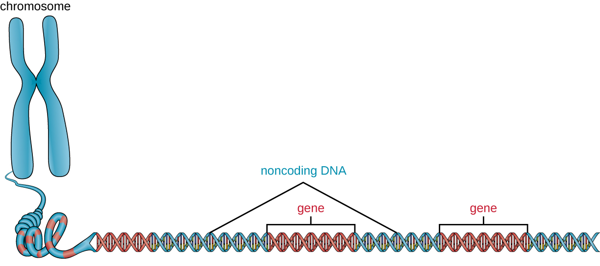
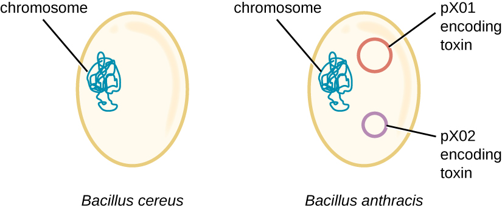

### Learning Objectives

* Define gene and genotype and differentiate genotype from phenotype
* Describe chromosome structure and packaging
* Compare prokaryotic and eukaryotic chromosomes
* Explain why extrachromosomal DNA is important in a cell

Thus far, we have discussed the structure and function of individual pieces of **DNA**{: data-type="term" .no-emphasis} and **RNA**{: data-type="term" .no-emphasis}. In this section, we will discuss how all of an organism’s genetic material—collectively referred to as its **genome**{: data-type="term"}—is organized inside of the cell. Since an organism’s **genetics**{: data-type="term" .no-emphasis} to a large extent dictate its characteristics, it should not be surprising that organisms differ in the arrangement of their DNA and RNA.

### Genotype versus Phenotype

All cellular activities are encoded within a cell’s DNA. The sequence of bases within a DNA molecule represents the genetic information of the cell. Segments of DNA molecules are called **gene**{: data-type="term"}s, and individual genes contain the instructional code necessary for synthesizing various proteins, enzymes, or stable RNA molecules.

The full collection of genes that a cell contains within its genome is called its **genotype**{: data-type="term"}. However, a cell does not express all of its genes simultaneously. Instead, it turns on (expresses) or turns off certain genes when necessary. The set of genes being expressed at any given point in time determines the cell’s activities and its observable characteristics, referred to as its **phenotype**{: data-type="term"}. Genes that are always expressed are known as **constitutive genes**{: data-type="term" .no-emphasis}; some constitutive genes are known as **housekeeping genes**{: data-type="term" .no-emphasis} because they are necessary for the basic functions of the cell.

While the genotype of a cell remains constant, the phenotype may change in response to environmental signals (e.g., changes in temperature or nutrient availability) that affect which nonconstitutive genes are expressed. For example, the oral bacterium ***Streptococcus mutans***{: data-type="term" .no-emphasis} produces a sticky slime layer that allows it to adhere to teeth, forming **dental plaque**{: data-type="term" .no-emphasis}; however, the genes that control the production of the slime layer are only expressed in the presence of sucrose (table sugar). Thus, while the genotype of *S. mutans* is constant, its phenotype changes depending on the presence and absence of sugar in its environment. Temperature can also regulate **gene expression**{: data-type="term" .no-emphasis}. For example, the gram-negative bacterium ***Serratia marcescens***{: data-type="term" .no-emphasis}, a pathogen frequently associated with hospital-acquired infections, produces a red pigment at 28 °C but not at 37 °C, the normal internal temperature of the human body ([\[link\]](#OSC_Microbio_10_04_GenoPheno)).

  but not at 37 &#xB0;C (right). (credit: modification of work by Ann Auman)"){: #OSC_Microbio_10_04_GenoPheno}

### Organization of Genetic Material

The vast majority of an organism’s genome is organized into the cell’s **chromosomes**{: data-type="term"}, which are discrete DNA structures within cells that control cellular activity. Recall that while eukaryotic chromosomes are housed in the membrane-bound nucleus, most prokaryotes contain a single, circular chromosome that is found in an area of the cytoplasm called the **nucleoid**{: data-type="term" .no-emphasis} (see [Unique Characteristics of Prokaryotic Cells](/m58792){: .target-chapter}). A chromosome may contain several thousand genes.

#### Organization of Eukaryotic Chromosome

Chromosome structure differs somewhat between eukaryotic and prokaryotic cells. Eukaryotic chromosomes are typically linear, and eukaryotic cells contain multiple distinct chromosomes. Many eukaryotic cells contain two copies of each chromosome and, therefore, are **diploid**{: data-type="term"}.

The length of a chromosome greatly exceeds the length of the cell, so a chromosome needs to be packaged into a very small space to fit within the cell. For example, the combined length of all of the 3 billion base pairs[1](#footnote1){: data-type="footnote-link"} of DNA of the human genome would measure approximately 2 meters if completely stretched out, and some eukaryotic genomes are many times larger than the human genome. DNA **supercoiling**{: data-type="term"} refers to the process by which DNA is twisted to fit inside the cell. Supercoiling may result in DNA that is either underwound (less than one turn of the helix per 10 base pairs) or overwound (more than one turn per 10 base pairs) from its normal relaxed state. Proteins known to be involved in supercoiling include **topoisomerases**{: data-type="term"}; these enzymes help maintain the structure of supercoiled chromosomes, preventing overwinding of DNA during certain cellular processes like DNA replication.

During **DNA packaging**{: data-type="term"}, DNA-binding proteins called **histones**{: data-type="term"} perform various levels of DNA wrapping and attachment to scaffolding proteins. The combination of DNA with these attached proteins is referred to as **chromatin**{: data-type="term"}. In eukaryotes, the packaging of DNA by histones may be influenced by environmental factors that affect the presence of methyl groups on certain cytosine nucleotides of DNA. The influence of environmental factors on DNA packaging is called **epigenetics**{: data-type="term" .no-emphasis}. Epigenetics is another mechanism for regulating gene expression without altering the sequence of nucleotides. Epigenetic changes can be maintained through multiple rounds of cell division and, therefore, can be heritable.

View this [animation][1] from the DNA Learning Center to learn more about on DNA packaging in eukaryotes.

#### Organization of Prokaryotic Chromosomes

Chromosomes in bacteria and archaea are usually circular, and a prokaryotic cell typically contains only a single chromosome within the **nucleoid**{: data-type="term" .no-emphasis}. Because the chromosome contains only one copy of each gene, prokaryotes are **haploid**{: data-type="term"}. As in eukaryotic cells, DNA **supercoiling**{: data-type="term" .no-emphasis} is necessary for the genome to fit within the prokaryotic cell. The DNA in the bacterial chromosome is arranged in several supercoiled domains. As with eukaryotes, topoisomerases are involved in supercoiling DNA. **DNA gyrase**{: data-type="term" .no-emphasis} is a type of topoisomerase, found in bacteria and some archaea, that helps prevent the overwinding of DNA. (Some antibiotics kill bacteria by targeting DNA gyrase.) In addition, **histone-like proteins**{: data-type="term" .no-emphasis} bind DNA and aid in DNA packaging. Other proteins bind to the origin of replication, the location in the chromosome where DNA replication initiates. Because different regions of DNA are packaged differently, some regions of chromosomal DNA are more accessible to enzymes and thus may be used more readily as templates for gene expression. Interestingly, several bacteria, including ***Helicobacter pylori***{: data-type="term" .no-emphasis} and ***Shigella flexneri***{: data-type="term" .no-emphasis}, have been shown to induce epigenetic changes in their hosts upon infection, leading to **chromatin remodeling**{: data-type="term" .no-emphasis} that may cause long-term effects on host immunity.[2](#footnote2){: data-type="footnote-link"}

* What is the difference between a cell’s genotype and its phenotype?
* How does DNA fit inside cells?
{: data-bullet-style="bullet"}

### Noncoding DNA

In addition to genes, a genome also contains many regions of **noncoding DNA**{: data-type="term"} that do not encode proteins or stable RNA products. Noncoding DNA is commonly found in areas prior to the start of coding sequences of genes as well as in **intergenic regions**{: data-type="term" .no-emphasis} (i.e., DNA sequences located between genes) ([\[link\]](#OSC_Microbio_10_04_noncodDNA)).

 {: #OSC_Microbio_10_04_noncodDNA}

Prokaryotes appear to use their genomes very efficiently, with only an average of 12% of the genome being taken up by noncoding sequences. In contrast, noncoding DNA can represent about 98% of the genome in eukaryotes, as seen in humans, but the percentage of noncoding DNA varies between species.[3](#footnote3){: data-type="footnote-link"} These noncoding DNA regions were once referred to as “junk DNA”; however, this terminology is no longer widely accepted because scientists have since found roles for some of these regions, many of which contribute to the regulation of **transcription**{: data-type="term" .no-emphasis} or **translation**{: data-type="term" .no-emphasis} through the production of small noncoding RNA molecules, **DNA packaging**{: data-type="term" .no-emphasis}, and chromosomal stability. Although scientists may not fully understand the roles of all noncoding regions of DNA, it is generally believed that they do have purposes within the cell.

* What is the role of noncoding DNA?
{: data-bullet-style="bullet"}

### Extrachromosomal DNA

Although most DNA is contained within a cell’s chromosomes, many cells have additional molecules of DNA outside the chromosomes, called **extrachromosomal DNA**{: data-type="term"}, that are also part of its genome. The genomes of eukaryotic cells would also include the chromosomes from any organelles such as mitochondria and/or chloroplasts that these cells maintain ([\[link\]](#OSC_Microbio_10_04_Extrachrom)). The maintenance of circular chromosomes in these organelles is a vestige of their prokaryotic origins and supports the **endosymbiotic theory**{: data-type="term" .no-emphasis} (see [Foundations of Modern Cell Theory](/m58791){: .target-chapter}). In some cases, genomes of certain DNA viruses can also be maintained independently in host cells during latent viral infection. In these cases, these viruses are another form of extrachromosomal DNA. For example, the human papillomavirus (HPV) may be maintained in infected cells in this way.

  and chloroplasts (plants and algae)."){: #OSC_Microbio_10_04_Extrachrom}

Besides chromosomes, some prokaryotes also have smaller loops of DNA called **plasmids**{: data-type="term" .no-emphasis} that may contain one or a few genes not essential for normal growth ([\[link\]](/m58792#OSC_Microbio_03_03_ProkCell)). Bacteria can exchange these plasmids with other bacteria in a process known as **horizontal gene transfer **(**HGT)**{: data-type="term" .no-emphasis}. The exchange of genetic material on plasmids sometimes provides microbes with new genes beneficial for growth and survival under special conditions. In some cases, genes obtained from plasmids may have clinical implications, encoding virulence factors that give a microbe the ability to cause disease or make a microbe resistant to certain antibiotics. Plasmids are also used heavily in genetic engineering and biotechnology as a way to move genes from one cell to another. The role of plasmids in horizontal gene transfer and biotechnology will be discussed further in [Mechanisms of Microbial Genetics](/m58839){: .target-chapter} and [Modern Applications of Microbial Genetics](/m58847){: .target-chapter}.

* How are plasmids involved in antibiotic resistance?
{: data-bullet-style="bullet"}

Lethal Plasmids

Maria, a 20-year-old anthropology student from Texas, recently became ill in the African nation of Botswana, where she was conducting research as part of a study-abroad program. Maria’s research was focused on traditional African methods of tanning hides for the production of leather. Over a period of three weeks, she visited a tannery daily for several hours to observe and participate in the tanning process. One day, after returning from the tannery, Maria developed a fever, chills, and a headache, along with chest pain, muscle aches, nausea, and other flu-like symptoms. Initially, she was not concerned, but when her fever spiked and she began to cough up blood, her African host family became alarmed and rushed her to the hospital, where her condition continued to worsen.

After learning about her recent work at the tannery, the physician suspected that Maria had been exposed to **anthrax**{: data-type="term" .no-emphasis}. He ordered a chest X-ray, a blood sample, and a spinal tap, and immediately started her on a course of intravenous penicillin. Unfortunately, lab tests confirmed the physician’s presumptive diagnosis. Maria’s chest X-ray exhibited pleural effusion, the accumulation of fluid in the space between the pleural membranes, and a Gram stain of her blood revealed the presence of gram-positive, rod-shaped bacteria in short chains, consistent with ***Bacillus anthracis***{: data-type="term" .no-emphasis}. Blood and bacteria were also shown to be present in her cerebrospinal fluid, indicating that the infection had progressed to meningitis. Despite supportive treatment and aggressive antibiotic therapy, Maria slipped into an unresponsive state and died three days later.

Anthrax is a disease caused by the introduction of endospores from the gram-positive bacterium *B. anthracis* into the body. Once infected, patients typically develop meningitis, often with fatal results. In Maria’s case, she inhaled the endospores while handling the hides of animals that had been infected.

The genome of *B. anthracis* illustrates how small structural differences can lead to major differences in virulence. In 2003, the genomes of *B. anthracis* and ***Bacillus cereus***{: data-type="term" .no-emphasis}, a similar but less pathogenic bacterium of the same genus, were sequenced and compared.[4](#footnote4){: data-type="footnote-link"} Researchers discovered that the 16S rRNA gene sequences of these bacteria are more than 99% identical, meaning that they are actually members of the same species despite their traditional classification as separate species. Although their chromosomal sequences also revealed a great deal of similarity, several virulence factors of *B. anthracis* were found to be encoded on two large plasmids not found in *B. cereus*. The plasmid pX01 encodes a three-part toxin that suppresses the host immune system, whereas the plasmid pX02 encodes a capsular polysaccharide that further protects the bacterium from the host immune system ([\[link\]](#OSC_Microbio_10_04_Bacilli)). Since *B. cereus* lacks these plasmids, it does not produce these virulence factors, and although it is still pathogenic, it is typically associated with mild cases of diarrhea from which the body can quickly recover. Unfortunately for Maria, the presence of these toxin-encoding plasmids in *B. anthracis* gives it its lethal virulence.

{: #OSC_Microbio_10_04_Bacilli}

* What do you think would happen to the pathogenicity of *B. anthracis* if it lost one or both of its plasmids?
{: data-bullet-style="bullet"}

Resolution

Within 24 hours, the results of the diagnostic test analysis of Alex’s stool sample revealed that it was positive for **heat-labile enterotoxin (LT)**{: data-type="term" .no-emphasis}, **heat-stabile enterotoxin (ST)**{: data-type="term" .no-emphasis}, and **colonization factor (CF)**{: data-type="term" .no-emphasis}, confirming the hospital physician’s suspicion of **ETEC**{: data-type="term" .no-emphasis}. During a follow-up with Alex’s family physician, this physician noted that Alex’s symptoms were not resolving quickly and he was experiencing discomfort that was preventing him from returning to classes. The family physician prescribed Alex a course of **ciprofloxacin**{: data-type="term" .no-emphasis} to resolve his symptoms. Fortunately, the ciprofloxacin resolved Alex’s symptoms within a few days.

Alex likely got his infection from ingesting contaminated food or water. Emerging industrialized countries like Mexico are still developing sanitation practices that prevent the contamination of water with fecal material. Travelers in such countries should avoid the ingestion of undercooked foods, especially meats, seafood, vegetables, and unpasteurized dairy products. They should also avoid use of water that has not been treated; this includes drinking water, ice cubes, and even water used for brushing teeth. Using bottled water for these purposes is a good alternative. Good hygiene (handwashing) can also aid the prevention of an ETEC infection. Alex had not been careful about his food or water consumption, which led to his illness.

Alex’s symptoms were very similar to those of **cholera**{: data-type="term" .no-emphasis}, caused by the gram-negative bacterium ***Vibrio cholerae***{: data-type="term" .no-emphasis}, which also produces a toxin similar to ST and LT. At some point in the evolutionary history of **ETEC**{: data-type="term" .no-emphasis}, a nonpathogenic strain of *E. coli* similar to those typically found in the gut may have acquired the genes encoding the ST and LT toxins from *V. cholerae*. The fact that the genes encoding those toxins are encoded on extrachromosomal plasmids in ETEC supports the idea that these genes were acquired by *E. coli* and are likely maintained in bacterial populations through horizontal gene transfer.

*Go back to the [previous](/m58836#fs-id1172099702711) Clinical Focus box.*

### Viral Genomes

Viral genomes exhibit significant diversity in structure. Some viruses have genomes that consist of DNA as their genetic material. This **DNA**{: data-type="term" .no-emphasis} may be single stranded, as exemplified by human **parvoviruses**{: data-type="term" .no-emphasis}, or double stranded, as seen in the <strong data-type="term" class="no-emphasis">herpesviruses </strong>and **poxviruses**{: data-type="term" .no-emphasis}. Additionally, although all cellular life uses DNA as its genetic material, some **viral genomes**{: data-type="term" .no-emphasis} are made of either single-stranded or double-stranded RNA molecules, as we have discussed. Viral genomes are typically smaller than most bacterial genomes, encoding only a few genes, because they rely on their hosts to carry out many of the functions required for their **replication**{: data-type="term" .no-emphasis}. The diversity of viral genome structures and their implications for viral replication life cycles are discussed in more detail in [The Viral Life Cycle](/m58809){: .target-chapter}.

* Why do viral genomes vary widely among viruses?
{: data-bullet-style="bullet"}

Genome Size Matters

There is great variation in size of genomes among different organisms. Most eukaryotes maintain multiple chromosomes; humans, for example have 23 pairs, giving them 46 chromosomes. Despite being large at 3 billion base pairs, the human genome is far from the largest genome. Plants often maintain very large genomes, up to 150 billion base pairs, and commonly are polyploid, having multiple copies of each chromosome.

The size of **bacterial genomes**{: data-type="term" .no-emphasis} also varies considerably, although they tend to be smaller than eukaryotic genomes ([\[link\]](#OSC_Microbio_10_04_GenomeSize)). Some bacterial genomes may be as small as only 112,000 base pairs. Often, the size of a bacterium’s genome directly relates to how much the bacterium depends on its host for survival. When a bacterium relies on the host cell to carry out certain functions, it loses the genes encoding the abilities to carry out those functions itself. These types of bacterial endosymbionts are reminiscent of the prokaryotic origins of mitochondria and chloroplasts.

From a clinical perspective, obligate intracellular pathogens also tend to have small genomes (some around 1 million base pairs). Because host cells supply most of their nutrients, they tend to have a reduced number of genes encoding metabolic functions. Due to their small sizes, the genomes of organisms like ***Mycoplasma genitalium***{: data-type="term" .no-emphasis} (580,000 base pairs), ***Chlamydia trachomatis***{: data-type="term" .no-emphasis} (1.0 million), ***Rickettsia prowazekii***{: data-type="term" .no-emphasis} (1.1 million), and ***Treponema pallidum***{: data-type="term" .no-emphasis} (1.1 million) were some of the earlier bacterial genomes sequenced. Respectively, these pathogens cause urethritis and pelvic inflammation, chlamydia, typhus, and syphilis.

Whereas obligate intracellular pathogens have unusually small genomes, other bacteria with a great variety of metabolic and enzymatic capabilities have unusually large bacterial genomes. *Pseudomonas aeruginosa*, for example, is a bacterium commonly found in the environment and is able to grow on a wide range of substrates. Its genome contains 6.3 million base pairs, giving it a high metabolic ability and the ability to produce virulence factors that cause several types of opportunistic infections*.*

Interestingly, there has been significant variability in genome size in viruses as well, ranging from 3,500 base pairs to 2.5 million base pairs, significantly exceeding the size of many bacterial genomes. The great variation observed in viral genome sizes further contributes to the great diversity of viral genome characteristics already discussed.

![ A graph showing genome sizes. Viruses have genomes that range from 1.7x10 to the 2nd bp to 2.5x10 to the 6th bp. Bacteria have genomes that range in size from 10 to the 5th to 10 to the 7th. One example is E. coli which ranges from 4.6 to 5.6 x 10 to the 6th bp. Fungi have genomes that range from 10 to the 6th to 10 to the 8th bp. Saccharomyces cerevisiae (yeast) has a genome of 1.2 x 10 to the 7th bp. Plants and animals have genomes that range from 10 to the 6th to 10 to the 11th bp. Mammals range from 10 to the 9th to 10 to the 10th bp. Humans have a genome of 3 x  10 to the 9th.](../resources/OSC_Microbio_10_04_GenomeSize.jpg "There is great variability as well as overlap among the genome sizes of various groups of organisms and viruses."){: #OSC_Microbio_10_04_GenomeSize}

Visit the [genome database][2] of the National Center for Biotechnology Information (NCBI) to see the genomes that have been sequenced and their sizes.

### Key Concepts and Summary

* The entire genetic content of a cell is its **genome**.
* **Genes** code for proteins, or stable RNA molecules, each of which carries out a specific function in the cell.
* Although the **genotype** that a cell possesses remains constant, expression of genes is dependent on environmental conditions.
* A **phenotype** is the observable characteristics of a cell (or organism) at a given point in time and results from the complement of genes currently being used.
* The majority of genetic material is organized into **chromosomes** that contain the DNA that controls cellular activities.
* Prokaryotes are typically haploid, usually having a single circular chromosome found in the nucleoid. Eukaryotes are diploid; DNA is organized into multiple linear chromosomes found in the nucleus.
* Supercoiling and DNA packaging using DNA binding proteins allows lengthy molecules to fit inside a cell. Eukaryotes and archaea use histone proteins, and bacteria use different proteins with similar function.
* Prokaryotic and eukaryotic genomes both contain **noncoding DNA**, the function of which is not well understood. Some noncoding DNA appears to participate in the formation of small noncoding RNA molecules that influence gene expression; some appears to play a role in maintaining chromosomal structure and in DNA packaging.
* **Extrachromosomal DNA** in eukaryotes includes the chromosomes found within organelles of prokaryotic origin (mitochondria and chloroplasts) that evolved by endosymbiosis. Some viruses may also maintain themselves extrachromosomally.
* Extrachromosomal DNA in prokaryotes is commonly maintained as **plasmids** that encode a few nonessential genes that may be helpful under specific conditions. Plasmids can be spread through a bacterial community by horizontal gene transfer.
* Viral genomes show extensive variation and may be composed of either RNA or DNA, and may be either double or single stranded.
{: data-bullet-style="bullet"}

### Multiple Choice

Which of the following correctly describes the structure of the typical eukaryotic genome?

1.  diploid
2.  linear
3.  singular
4.  double stranded
{: data-number-style="upper-alpha"}

A

Which of the following is typically found as part of the prokaryotic genome?

1.  chloroplast DNA
2.  linear chromosomes
3.  plasmids
4.  mitochondrial DNA
{: data-number-style="upper-alpha"}

C

*Serratia marcescens* cells produce a red pigment at room temperature. The red color of the colonies is an example of which of the following?

1.  genotype
2.  phenotype
3.  change in DNA base composition
4.  adaptation to the environment
{: data-number-style="upper-alpha"}

B

Which of the following genes would not likely be encoded on a plasmid?

1.  genes encoding toxins that damage host tissue
2.  genes encoding antibacterial resistance
3.  gene encoding enzymes for glycolysis
4.  genes encoding enzymes for the degradation of an unusual substrate
{: data-number-style="upper-alpha"}

C

Histones are DNA binding proteins that are important for DNA packaging in which of the following?

1.  double-stranded and single-stranded DNA viruses
2.  archaea and bacteria
3.  bacteria and eukaryotes
4.  eukaryotes and archaea
{: data-number-style="upper-alpha"}

D

### True/False

Within an organism, phenotypes may change while genotypes remain constant.

True

Noncoding DNA has no biological purpose.

False

### Fill in the Blank

Plasmids are typically transferred among members of a bacterial community by \_\_\_\_\_\_\_\_ gene transfer.

horizontal

### Short Answer

What are some differences in chromosomal structures between prokaryotes and eukaryotes?

How do prokaryotes and eukaryotes manage to fit their lengthy DNA inside of cells? Why is this necessary?

What are some functions of noncoding DNA?

In the chromatin of eukaryotic cells, which regions of the chromosome would you expect to be more compact: the regions that contain genes being actively copied into RNA or those that contain inactive genes?

### Critical Thinking

A new type of bacteriophage has been isolated and you are in charge of characterizing its genome. The base composition of the bacteriophage is A (15%), C (20%), T (35%), and G (30%). What can you conclude about the genome of the virus?

### Footnotes
{: data-type="footnote-refs-title"}

* {: data-type="footnote-ref" #footnote1} [1](#footnote-ref1){: data-type="footnote-ref-link"} National Human Genome Research Institute. “The Human Genome Project Completion: Frequently Asked Questions.” https://www.genome.gov/11006943. Accessed June 10, 2016
* {: data-type="footnote-ref" #footnote2} [2](#footnote-ref2){: data-type="footnote-ref-link"} H. Bierne et al. “Epigenetics and Bacterial Infections.” *Cold Spring Harbor Perspectives in Medicine* 2 no. 12 (2012):a010272.
* {: data-type="footnote-ref" #footnote3} [3](#footnote-ref3){: data-type="footnote-ref-link"} R.J. Taft et al. “The Relationship between Non-Protein-Coding DNA and Eukaryotic Complexity.” *Bioessays* 29 no. 3 (2007):288–299.
* {: data-type="footnote-ref" #footnote4} [4](#footnote-ref4){: data-type="footnote-ref-link"} N. Ivanova et al. “Genome Sequence of *Bacillus cereus* and Comparative Analysis with *Bacillus anthracis.” Nature* 423 no. 6935 (2003):87–91.
{: data-list-type="bulleted" data-bullet-style="none"}

[1]: https://www.openstax.org/l/22dnapackanim
[2]: https://www.openstax.org/l/22NCBIgendata
