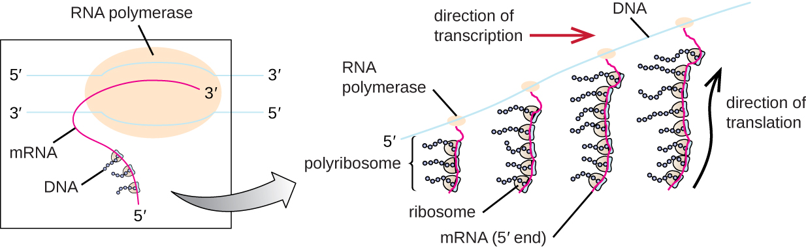

# Learning Objectives

* Describe the genetic code and explain why it is considered almost universal
* Explain the process of translation and the functions of the molecular machinery of translation
* Compare translation in eukaryotes and prokaryotes

The synthesis of proteins consumes more of a cell’s energy than any other metabolic process. In turn, proteins account for more mass than any other macromolecule of living organisms. They perform virtually every function of a cell, serving as both functional (e.g., enzymes) and structural elements. The process of **translation**{: data-type="term"}, or **protein synthesis**{: data-type="term"}, the second part of gene expression, involves the decoding by a ribosome of an mRNA message into a polypeptide product.

# The Genetic Code

Translation of the **mRNA**{: data-type="term" .no-emphasis} template converts nucleotide-based genetic information into the “language” of amino acids to create a protein product. A **protein sequence**{: data-type="term" .no-emphasis} consists of 20 commonly occurring **amino acids**{: data-type="term" .no-emphasis}. Each amino acid is defined within the mRNA by a triplet of nucleotides called a **codon**{: data-type="term"}. The relationship between an mRNA codon and its corresponding amino acid is called the **genetic code**{: data-type="term"}.

The three-nucleotide code means that there is a total of 64 possible combinations (43, with four different nucleotides possible at each of the three different positions within the codon). This number is greater than the number of amino acids and a given amino acid is encoded by more than one codon ([\[link\]](#OSC_Microbio_11_04_GenCode)). This redundancy in the genetic code is called **degeneracy**{: data-type="term"}. Typically, whereas the first two positions in a codon are important for determining which amino acid will be incorporated into a growing polypeptide, the third position, called the **wobble position**{: data-type="term"}, is less critical. In some cases, if the nucleotide in the third position is changed, the same amino acid is still incorporated.

Whereas 61 of the 64 possible triplets code for amino acids, three of the 64 codons do not code for an amino acid; they terminate protein synthesis, releasing the polypeptide from the translation machinery. These are called **stop codon**{: data-type="term"}**s** or **nonsense codon**{: data-type="term"}**s**. Another codon, AUG, also has a special function. In addition to specifying the amino acid methionine, it also typically serves as the **start codon**{: data-type="term"} to initiate translation. The **reading frame**{: data-type="term"}, the way nucleotides in mRNA are grouped into codons, for translation is set by the AUG start codon near the 5’ end of the mRNA. Each set of three nucleotides following this start codon is a codon in the mRNA message.

The genetic code is nearly universal. With a few exceptions, virtually all species use the same genetic code for protein synthesis, which is powerful evidence that all extant life on earth shares a common origin. However, unusual amino acids such as **selenocysteine**{: data-type="term" .no-emphasis} and **pyrrolysine**{: data-type="term" .no-emphasis} have been observed in archaea and bacteria. In the case of selenocysteine, the codon used is UGA (normally a stop codon). However, UGA can encode for selenocysteine using a stem-loop structure (known as the selenocysteine insertion sequence, or SECIS element), which is found at the 3’ untranslated region of the mRNA. Pyrrolysine uses a different stop codon, UAG. The incorporation of pyrrolysine requires the *pylS* gene and a unique transfer RNA (tRNA) with a CUA anticodon.

 ![The codon table. On the left is the first letter of the codon (from top to bottom &#x2013; U, C, A, G). On the top is the second letter (left to right U, C, A, G). On the right is the third letter (in each row, this is designated from top to bottom as U, C, A, G. UUU and UUC are Phe. UUA and UUG are Leu. UCU, UCC, UCA and UCG are Ser. UAU and UAC are Tyr. UAA and UAG are stop. UGU and UGC are Cys. UGA is stop. UGG is Trp. CUU, CUC, CUA, and CUG are Leu. CC, CCC, CCA, and CCG are Pro. CAU and CAC are his. CAA and CAG are Gln. CGU, CGC, CGA, CGG are Arg. AUU, AUC, AUA are Ile, AUG is Met and start. ACU, ACC, ACA, ACG is Thr. AAU AAc, is Asn. AAA, AAG is Lys. AGU, AGC is SEr. AGA, AG is ARg. GUU, GUC, GUA, GUG is Val. GCU, GCC, GCA, GCG, is ala. GAU, GAC is Asp. GAA, GAG is Glu. GGU, GGC, GGA, GGG is Gly.](../resources/OSC_Microbio_11_04_GenCode.jpg "This figure shows the genetic code for translating each nucleotide triplet in mRNA into an amino acid or a termination signal in a nascent protein. The first letter of a codon is shown vertically on the left, the second letter of a codon is shown horizontally across the top, and the third letter of a codon is shown vertically on the right. (credit: modification of work by National Institutes of Health)"){: #OSC_Microbio_11_04_GenCode}

* How many bases are in each codon?
* What amino acid is coded for by the codon AAU?
* What happens when a stop codon is reached?
{: data-bullet-style="bullet"}

# The Protein Synthesis Machinery

In addition to the mRNA template, many molecules and macromolecules contribute to the process of **translation**{: data-type="term" .no-emphasis}. The composition of each component varies across taxa; for instance, ribosomes may consist of different numbers of ribosomal RNAs (rRNAs) and polypeptides depending on the organism. However, the general structures and functions of the protein synthesis machinery are comparable from bacteria to human cells. Translation requires the input of an mRNA template, ribosomes, tRNAs, and various enzymatic factors.

## Ribosomes

A **ribosome**{: data-type="term" .no-emphasis} is a complex macromolecule composed of catalytic rRNAs (called **ribozyme**{: data-type="term" .no-emphasis}s) and structural **rRNA**{: data-type="term" .no-emphasis}s, as well as many distinct polypeptides. Mature rRNAs make up approximately 50% of each ribosome. Prokaryotes have 70S ribosomes, whereas eukaryotes have 80S ribosomes in the cytoplasm and rough endoplasmic reticulum, and 70S ribosomes in **mitochondria**{: data-type="term" .no-emphasis} and **chloroplasts**{: data-type="term" .no-emphasis}. Ribosomes dissociate into large and small subunits when they are not synthesizing proteins and reassociate during the **initiation of translation**{: data-type="term"}. In *E. coli*, the **small subunit**{: data-type="term" .no-emphasis} is described as 30S (which contains the 16S rRNA subunit), and the **large subunit**{: data-type="term" .no-emphasis} is 50S (which contains the 5S and 23S rRNA subunits), for a total of 70S (Svedberg units are not additive). Eukaryote ribosomes have a small 40S subunit (which contains the 18S rRNA subunit) and a large 60S subunit (which contains the 5S, 5.8S and 28S rRNA subunits), for a total of 80S. The small subunit is responsible for binding the mRNA template, whereas the large subunit binds tRNAs (discussed in the next subsection).

Each mRNA molecule is simultaneously translated by many ribosomes, all synthesizing protein in the same direction: reading the mRNA from 5’ to 3’ and synthesizing the polypeptide from the N terminus to the C terminus. The complete structure containing an mRNA with multiple associated ribosomes is called a **polyribosome**{: data-type="term"} (or **polysome**{: data-type="term"}). In both bacteria and **archaea**{: data-type="term" .no-emphasis}, before transcriptional termination occurs, each protein-encoding transcript is already being used to begin synthesis of numerous copies of the encoded polypeptide(s) because the processes of transcription and translation can occur concurrently, forming polyribosomes ([\[link\]](#OSC_Microbio_11_04_Cotrantxn)). The reason why transcription and translation can occur simultaneously is because both of these processes occur in the same 5’ to 3’ direction, they both occur in the cytoplasm of the cell, and because the RNA transcript is not processed once it is transcribed. This allows a prokaryotic cell to respond to an environmental signal requiring new proteins very quickly. In contrast, in eukaryotic cells, simultaneous transcription and translation is not possible. Although polyribosomes also form in eukaryotes, they cannot do so until RNA synthesis is complete and the RNA molecule has been modified and transported out of the nucleus.

 {: #OSC_Microbio_11_04_Cotrantxn}

## Transfer RNAs

Transfer RNAs (tRNAs) are structural RNA molecules and, depending on the species, many different types of tRNAs exist in the cytoplasm. Bacterial species typically have between 60 and 90 types. Serving as adaptors, each **tRNA**{: data-type="term" .no-emphasis} type binds to a specific codon on the mRNA template and adds the corresponding amino acid to the polypeptide chain. Therefore, tRNAs are the molecules that actually “translate” the language of RNA into the language of proteins. As the adaptor molecules of translation, it is surprising that tRNAs can fit so much specificity into such a small package. The tRNA molecule interacts with three factors: aminoacyl tRNA synthetases, ribosomes, and mRNA.

Mature tRNAs take on a three-dimensional structure when complementary bases exposed in the single-stranded RNA molecule hydrogen bond with each other ([\[link\]](#OSC_Microbio_11_04_tRNA)). This shape positions the amino-acid binding site, called the **CCA amino acid binding end**{: data-type="term"}, which is a cytosine-cytosine-adenine sequence at the 3’ end of the tRNA, and the **anticodon**{: data-type="term"} at the other end. The anticodon is a three-nucleotide sequence that bonds with an mRNA codon through complementary base pairing.

An amino acid is added to the end of a tRNA molecule through the process of tRNA “charging,” during which each tRNA molecule is linked to its correct or **cognate amino acid**{: data-type="term"} by a group of enzymes called **aminoacyl tRNA synthetase**{: data-type="term"}s. At least one type of aminoacyl tRNA synthetase exists for each of the 20 amino acids. During this process, the amino acid is first activated by the addition of adenosine monophosphate (AMP) and then transferred to the tRNA, making it a **charged tRNA**{: data-type="term"}, and AMP is released.

 ![Three different drawings of tRNA. A) shows a single strand folded into a cross shape with intramolecular base pairing. The 3&#x2019; end at the top is labeled amino acid attachment site and has the sequence ACC. The 5&#x2019; end is also at the top. At the base of the cross is a three letter grouping called anticodon. This is complementary to a three letter set on the mRNA called a codon. B) shows a space filling 3-D model that is shaped like an L. One end is the amino acid attachment site and the other is the anticodon. C) is a ver simplified drawing shaped like zigzag; one end is the amino acid attachment site and the other is the anticodon.](../resources/OSC_Microbio_11_04_tRNA.jpg "(a) After folding caused by intramolecular base pairing, a tRNA molecule has one end that contains the anticodon, which interacts with the mRNA codon, and the CCA amino acid binding end. (b) A space-filling model is helpful for visualizing the three-dimensional shape of tRNA. (c) Simplified models are useful when drawing complex processes such as protein synthesis."){: #OSC_Microbio_11_04_tRNA}

* Describe the structure and composition of the prokaryotic ribosome.
* In what direction is the mRNA template read?
* Describe the structure and function of a tRNA.
{: data-bullet-style="bullet"}

# The Mechanism of Protein Synthesis

Translation is similar in prokaryotes and eukaryotes. Here we will explore how translation occurs in *E. coli*, a representative prokaryote, and specify any differences between bacterial and eukaryotic translation.

## Initiation

The **initiation of protein synthesis**{: data-type="term"} begins with the formation of an initiation complex. In ***E. coli***{: data-type="term" .no-emphasis}, this complex involves the small 30S ribosome, the mRNA template, three **initiation factors**{: data-type="term"} that help the ribosome assemble correctly, guanosine triphosphate (GTP) that acts as an energy source, and a special initiator tRNA carrying ***N*-formyl-methionine**{: data-type="term" .no-emphasis} (fMet-tRNAfMet) ([\[link\]](#OSC_Microbio_11_04_TlnInit)). The initiator tRNA interacts with the start codon AUG of the mRNA and carries a formylated methionine (fMet). Because of its involvement in initiation, fMet is inserted at the beginning (N terminus) of every polypeptide chain synthesized by *E. coli*. In *E. coli* mRNA, a leader sequence upstream of the first AUG codon, called the **Shine-Dalgarno sequence**{: data-type="term" .no-emphasis} (also known as the ribosomal binding site AGGAGG), interacts through complementary base pairing with the rRNA molecules that compose the ribosome. This interaction anchors the 30S ribosomal subunit at the correct location on the mRNA template. At this point, the 50S ribosomal subunit then binds to the initiation complex, forming an intact ribosome.

In eukaryotes, initiation complex formation is similar, with the following differences:

* The initiator tRNA is a different specialized tRNA carrying methionine, called Met-tRNAi
* Instead of binding to the mRNA at the Shine-Dalgarno sequence, the eukaryotic initiation complex recognizes the 5’ cap of the eukaryotic mRNA, then tracks along the mRNA in the 5’ to 3’ direction until the AUG start codon is recognized. At this point, the 60S subunit binds to the complex of Met-tRNAi, mRNA, and the 40S subunit.
{: data-bullet-style="bullet"}

 ![Diagram showing translation. At the start codon of the mRNA (AUG) the following attach: a tRNA with the anticodon UAC and containing the first amino acid, the large ribosomal subunit (a dome) and the small ribosomal subunit (a flat oval). During initiation, translational complex forms, and tRNA brings the first amino acid in polypeptide chain to bind to start codon om mRNA. At this point the tRNA is attached to the middle binding site (P) of the ribosome. The 3 sites from left to right are E, P, A. During elongation, tRNAs bring amino acids one by one to add to polypeptide chain. In the diagram, a tRNA with a long chain of circles is in the P site, a tRNA with a single circle is in the A site, and a tRNA without any circles is leaving from the E site. During termination, release factor recognizes stop codon, translational complex dissociates, and complete polypeptide is released. In the diagram a tRNA with a long strand is attached to the P site and a release factor (red shape) is attached to the stop codon in the mRNA which is now under the A site. Next the completed polypeptide leaves and all the other components dissociate from each other.](../resources/OSC_Microbio_11_04_TlnInit.jpg "Translation in bacteria begins with the formation of the initiation complex, which includes the small ribosomal subunit, the mRNA, the initiator tRNA carrying N-formyl-methionine, and initiation factors. Then the 50S subunit binds, forming an intact ribosome."){: #OSC_Microbio_11_04_TlnInit}

## Elongation

In prokaryotes and eukaryotes, the basics of **elongation of translation**{: data-type="term"} are the same. In ***E. coli***{: data-type="term" .no-emphasis}, the binding of the 50S ribosomal subunit to produce the intact ribosome forms three functionally important ribosomal sites: The **A (aminoacyl) site**{: data-type="term"} binds incoming charged aminoacyl tRNAs. The **P (peptidyl) site**{: data-type="term"} binds charged tRNAs carrying amino acids that have formed peptide bonds with the growing polypeptide chain but have not yet dissociated from their corresponding tRNA. The **E (exit) site**{: data-type="term"} releases dissociated tRNAs so that they can be recharged with free amino acids. There is one notable exception to this assembly line of tRNAs: During initiation complex formation, bacterial fMet−tRNAfMet or eukaryotic Met-tRNAi enters the P site directly without first entering the A site, providing a free A site ready to accept the tRNA corresponding to the first codon after the AUG.

Elongation proceeds with single-codon movements of the ribosome each called a translocation event. During each translocation event, the charged tRNAs enter at the A site, then shift to the P site, and then finally to the E site for removal. Ribosomal movements, or steps, are induced by conformational changes that advance the ribosome by three bases in the 3’ direction. Peptide bonds form between the amino group of the amino acid attached to the A-site tRNA and the carboxyl group of the amino acid attached to the P-site tRNA. The formation of each peptide bond is catalyzed by **peptidyl transferase**{: data-type="term"}, an RNA-based ribozyme that is integrated into the 50S ribosomal subunit. The amino acid bound to the P-site tRNA is also linked to the growing polypeptide chain. As the ribosome steps across the mRNA, the former P-site tRNA enters the E site, detaches from the amino acid, and is expelled. Several of the steps during elongation, including binding of a charged aminoacyl tRNA to the A site and translocation, require energy derived from GTP hydrolysis, which is catalyzed by specific elongation factors. Amazingly, the *E. coli* translation apparatus takes only 0.05 seconds to add each amino acid, meaning that a 200 amino-acid protein can be translated in just 10 seconds.

## Termination

The **termination of translation**{: data-type="term"} occurs when a **nonsense codon**{: data-type="term" .no-emphasis} (UAA, UAG, or UGA) is encountered for which there is no complementary tRNA. On aligning with the A site, these nonsense codons are recognized by release factors in prokaryotes and eukaryotes that result in the P-site amino acid detaching from its tRNA, releasing the newly made polypeptide. The small and large ribosomal subunits dissociate from the mRNA and from each other; they are recruited almost immediately into another translation init iation complex.

In summary, there are several key features that distinguish prokaryotic gene expression from that seen in eukaryotes. These are illustrated in [\[link\]](#OSC_Microbio_11_04_ProkEuk) and listed in [\[link\]](#OSC_Microbio_11_04_ComTranTbl).

 ![a) Diagram of prokaryotic cell with a plasma membrane on the outside. The DNA is in the cytoplasm and the mRNA is being copied at the same time that ribosomes are building proteins of the developing mRNA. B) Diagram of a eukaryotic cell with a plasma membrane an a nucleus. The DNA is in the nucleus and pre-mRNA is made during transcription; this is then process into mature mRNA. The mature mRNA then leaves the nucleus and enters the cytoplasm where translation takes place. This is when ribosomes bind to the mRNA and make proteins.](../resources/OSC_Microbio_11_04_ProkEuk.jpg "(a) In prokaryotes, the processes of transcription and translation occur simultaneously in the cytoplasm, allowing for a rapid cellular response to an environmental cue. (b) In eukaryotes, transcription is localized to the nucleus and translation is localized to the cytoplasm, separating these processes and necessitating RNA processing for stability."){: #OSC_Microbio_11_04_ProkEuk}

![Table titled: Comparison of Translation in Bacteria Versus Eukaryotes. Bacteria have 70s ribosomes made of a 30s (small subunit) with 16SrRNA subunit and a 50S (large subunit) with 5S and 23S rRNA subunits. Eukaryotic ribosomes are 80S with 40s (small subunit) with 18s rRNA subunit and 60S (large subunit) with 5S, 5.8S, and 28S rRNA subunits. The amino acid carried by the initiator tRNA is fMet for bacteria and Met for Eukaryotes. Bacteria have a Shine-Delgarno sequence in their mRNA while Eukaryotes do not. Transcription and translation is simultaneous in bacteria but not in eukaryotes.](../resources/OSC_Microbio_11_04_ComTranTbl.jpg){: #OSC_Microbio_11_04_ComTranTbl}

# Protein Targeting, Folding, and Modification

During and after translation, polypeptides may need to be modified before they are biologically active. Post-translational modifications include:

1.  removal of translated signal sequences—short tails of amino acids that aid in directing a protein to a specific cellular compartment
2.  proper “folding” of the polypeptide and association of multiple polypeptide subunits, often facilitated by chaperone proteins, into a distinct three-dimensional structure
3.  proteolytic processing of an inactive polypeptide to release an active protein component, and
4.  various chemical modifications (e.g., phosphorylation, methylation, or glycosylation) of individual amino acids.
{: data-number-style="arabic"}

* What are the components of the initiation complex for translation in prokaryotes?
* What are two differences between initiation of prokaryotic and eukaryotic translation?
* What occurs at each of the three active sites of the ribosome?
* What causes termination of translation?
{: data-bullet-style="bullet"}

# Key Concepts and Summary

* In **translation**, polypeptides are synthesized using mRNA sequences and cellular machinery, including tRNAs that match mRNA **codons** to specific amino acids and ribosomes composed of RNA and proteins that catalyze the reaction.
* The **genetic code** is **degenerate** in that several mRNA codons code for the same amino acids. The genetic code is almost universal among living organisms.
* Prokaryotic (70S) and cytoplasmic eukaryotic (80S) ribosomes are each composed of a large subunit and a small subunit of differing sizes between the two groups. Each subunit is composed of rRNA and protein. Organelle ribosomes in eukaryotic cells resemble prokaryotic ribosomes.
* Some 60 to 90 species of tRNA exist in bacteria. Each tRNA has a three-nucleotide **anticodon** as well as a binding site for a **cognate amino acid**. All tRNAs with a specific anticodon will carry the same amino acid.
* **Initiation** of translation occurs when the small ribosomal subunit binds with **initiation factors** and an initiator tRNA at the **start codon** of an mRNA, followed by the binding to the initiation complex of the large ribosomal subunit.
* In prokaryotic cells, the start codon codes for N-formyl-methionine carried by a special initiator tRNA. In eukaryotic cells, the start codon codes for methionine carried by a special initiator tRNA. In addition, whereas ribosomal binding of the mRNA in prokaryotes is facilitated by the Shine-Dalgarno sequence within the mRNA, eukaryotic ribosomes bind to the 5’ cap of the mRNA.
* During the **elongation** stage of translation, a **charged tRNA** binds to mRNA in the **A site** of the ribosome; a peptide bond is catalyzed between the two adjacent amino acids, breaking the bond between the first amino acid and its tRNA; the ribosome moves one codon along the mRNA; and the first tRNA is moved from the **P site** of the ribosome to the **E site** and leaves the ribosomal complex.
* **Termination** of translation occurs when the ribosome encounters a **stop codon**, which does not code for a tRNA. Release factors cause the polypeptide to be released, and the ribosomal complex dissociates.
* In prokaryotes, transcription and translation may be coupled, with translation of an mRNA molecule beginning as soon as transcription allows enough mRNA exposure for the binding of a ribosome, prior to transcription termination. Transcription and translation are not coupled in eukaryotes because transcription occurs in the nucleus, whereas translation occurs in the cytoplasm or in association with the rough endoplasmic reticulum.
* Polypeptides often require one or more **post-translational modifications** to become biologically active.
{: data-bullet-style="bullet"}

# Multiple Choice

Which of the following is the name of the three-base sequence in the mRNA that binds to a tRNA molecule?

1.  P site
2.  codon
3.  anticodon
4.  CCA binding site
{: data-number-style="upper-alpha"}

B

Which component is the last to join the initiation complex during the initiation of translation?

1.  the mRNA molecule
2.  the small ribosomal subunit
3.  the large ribosomal subunit
4.  the initiator tRNA
{: data-number-style="upper-alpha"}

C

During elongation in translation, to which ribosomal site does an incoming charged tRNA molecule bind?

1.  A site
2.  P site
3.  E site
4.  B site
{: data-number-style="upper-alpha"}

A

Which of the following is the amino acid that appears at the N-terminus of all newly translated prokaryotic and eukaryotic polypeptides?

1.  tryptophan
2.  methionine
3.  selenocysteine
4.  glycine
{: data-number-style="upper-alpha"}

B

When the ribosome reaches a nonsense codon, which of the following occurs?

1.  a methionine is incorporated
2.  the polypeptide is released
3.  a peptide bond forms
4.  the A site binds to a charged tRNA
{: data-number-style="upper-alpha"}

B

# Fill in the Blank

The third position within a codon, in which changes often result in the incorporation of the same amino acid into the growing polypeptide, is called the \_\_\_\_\_\_\_\_.

wobble position

The enzyme that adds an amino acid to a tRNA molecule is called \_\_\_\_\_\_\_\_.

aminoacyl-tRNA synthetase

# True/False

Each codon within the genetic code encodes a different amino acid.

False

# Short Answer

Why does translation terminate when the ribosome reaches a stop codon? What happens?

How does the process of translation differ between prokaryotes and eukaryotes?

What is meant by the genetic code being nearly universal?

Below is an antisense DNA sequence. Translate the mRNA molecule synthesized using the genetic code, recording the resulting amino acid sequence, indicating the N and C termini.

Antisense DNA strand: 3’-T A C T G A C T G A C G A T C-5’

# Critical Thinking

Label the following in the figure: ribosomal E, P, and A sites; mRNA; codons; anticodons; growing polypeptide; incoming amino acid; direction of translocation; small ribosomal unit; large ribosomal unit.

 ![A long line at the bottom has many letters on it and is labeled G. Each set of 3 letters is circles and labeled D. Attached to this is a large dome (I) and a small oval (3). Attached to one group of 3 letters is a rectangle 9labeled C); the 3 letters at the bottom of the rectangle are labeled H. A circle at the end of the rectangle is labeled B. The rectangle in the center of the dome labeled I has a long chain of circles attached to it labeled A. An arrow at the bottom points to the right and is labeled F.](../resources/OSC_Microbio_11_04_TransComp_img.jpg) 

Prior to the elucidation of the genetic code, prominent scientists, including Francis Crick, had predicted that each mRNA codon, coding for one of the 20 amino acids, needed to be at least three nucleotides long. Why is it not possible for codons to be any shorter?

