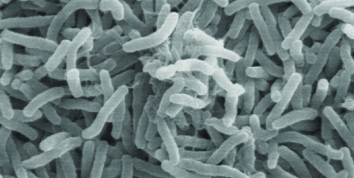

# Learning Objectives

* Compare the processes of transformation, transduction, and conjugation
* Explain how asexual gene transfer results in prokaryotic genetic diversity
* Explain the structure and consequences for bacterial genetic diversity of transposons

Typically, when we consider genetic transfer, we think of **vertical gene transfer**{: data-type="term"}, the transmission of genetic information from generation to generation. Vertical gene transfer is by far the main mode of transmission of genetic information in all cells. In sexually reproducing organisms, crossing-over events and independent assortment of individual chromosomes during **meiosis**{: data-type="term" .no-emphasis} contribute to **genetic diversity**{: data-type="term" .no-emphasis} in the population. Genetic diversity is also introduced during **sexual reproduction**{: data-type="term" .no-emphasis}, when the genetic information from two parents, each with different complements of genetic information, are combined, producing new combinations of parental genotypes in the diploid offspring. The occurrence of mutations also contributes to genetic diversity in a population. Genetic diversity of offspring is useful in changing or inconsistent environments and may be one reason for the evolutionary success of sexual reproduction.

When prokaryotes and eukaryotes reproduce asexually, they transfer a nearly identical copy of their genetic material to their offspring through vertical gene transfer. Although **asexual reproduction**{: data-type="term" .no-emphasis} produces more offspring more quickly, any benefits of diversity among those offspring are lost. How then do organisms whose dominant reproductive mode is asexual create genetic diversity? In prokaryotes, **horizontal gene transfer (HGT)**{: data-type="term"}, the introduction of genetic material from one organism to another organism within the same generation, is an important way to introduce genetic diversity. HGT allows even distantly related species to share genes, influencing their phenotypes. It is thought that HGT is more prevalent in prokaryotes but that only a small fraction of the prokaryotic genome may be transferred by this type of transfer at any one time. As the phenomenon is investigated more thoroughly, it may be revealed to be even more common. Many scientists believe that HGT and mutation are significant sources of genetic variation, the raw material for the process of natural selection, in prokaryotes. Although HGT is more common among evolutionarily related organisms, it may occur between any two species that live together in a natural community.

HGT in prokaryotes is known to occur by the three primary mechanisms that are illustrated in [\[link\]](#OSC_Microbio_11_06_HGT)\:

1.  Transformation: naked DNA is taken up from the environment
2.  Transduction: genes are transferred between cells in a virus (see [The Viral Life Cycle](/m58809){: .target-chapter})
3.  Conjugation: use of a hollow tube called a conjugation pilus to transfer genes between cells
{: data-number-style="arabic"}

  In transformation, the cell takes up DNA directly from the environment. The DNA may remain separate as a plasmid or be incorporated into the host genome. b) In transduction, a bacteriophage injects DNA that is a hybrid of viral DNA and DNA from a previously infected bacterial cell. c) In conjugation, DNA is transferred between cells through a cytoplasmic bridge after a conjugation pilus draws the two cells close enough to form the bridge."){: #OSC_Microbio_11_06_HGT}

* What are three ways sexual reproduction introduces genetic variation into offspring?
* What is a benefit of asexual reproduction?
* What are the three mechanisms of horizontal gene transfer in prokaryotes?
{: data-bullet-style="bullet"}

# Transformation

Frederick **Griffith**{: data-type="term" .no-emphasis} was the first to demonstrate the process of **transformation**{: data-type="term" .no-emphasis}. In 1928, he showed that live, nonpathogenic ***Streptococcus pneumoniae***{: data-type="term" .no-emphasis} bacteria could be transformed into pathogenic bacteria through exposure to a heat-killed pathogenic strain. He concluded that some sort of agent, which he called the “transforming principle,” had been passed from the dead pathogenic bacteria to the live, nonpathogenic bacteria. In 1944, Oswald **Avery**{: data-type="term" .no-emphasis} (1877–1955), Colin **MacLeod**{: data-type="term" .no-emphasis} (1909–1972), and Maclyn **McCarty**{: data-type="term" .no-emphasis} (1911–2005) demonstrated that the transforming principle was DNA (see [Using Microorganisms to Discover the Secrets of Life](/m58835){: .target-chapter}).

In **transformation**{: data-type="term"}, the prokaryote takes up naked DNA found in its environment and that is derived from other cells that have lysed on death and released their contents, including their genome, into the environment. Many bacteria are naturally competent, meaning that they actively bind to environmental DNA, transport it across their cell envelopes into their cytoplasm, and make it single stranded. Typically, double-stranded foreign DNA within cells is destroyed by nucleases as a defense against viral infection. However, these nucleases are usually ineffective against single-stranded DNA, so this single-stranded DNA within the cell has the opportunity to recombine into the bacterial genome. A molecule of DNA that contains fragments of DNA from different organisms is called **recombinant DNA**{: data-type="term" .no-emphasis}. (Recombinant DNA will be discussed in more detail in [Microbes and the Tools of Genetic Engineering](/m58848){: .target-chapter}.) If the bacterium incorporates the new DNA into its own genome through recombination, the bacterial cell may gain new phenotypic properties. For example, if a nonpathogenic bacterium takes up DNA for a toxin gene from a pathogen and then incorporates it into its chromosome, it, too, may become pathogenic. Plasmid DNA may also be taken up by competent bacteria and confer new properties to the cell. Overall, transformation in nature is a relatively inefficient process because environmental DNA levels are low because of the activity of nucleases that are also released during cellular lysis. Additionally, genetic recombination is inefficient at incorporating new DNA sequences into the genome.

In nature, bacterial transformation is an important mechanism for the acquisition of genetic elements encoding **virulence factor**{: data-type="term" .no-emphasis}s and **antibiotic resistance**{: data-type="term" .no-emphasis}. Genes encoding resistance to antimicrobial compounds have been shown to be widespread in nature, even in environments not influenced by humans. These genes, which allow microbes living in mixed communities to compete for limited resources, can be transferred within a population by transformation, as well as by the other processes of HGT. In the laboratory, we can exploit the natural process of bacterial transformation for genetic engineering to make a wide variety of medicinal products, as discussed in [Microbes and the Tools of Genetic Engineering](/m58848){: .target-chapter}.

* Why does a bacterial cell make environmental DNA brought into the cell into a single-stranded form?
{: data-bullet-style="bullet"}

# Transduction

Viruses that infect bacteria (**bacteriophages**{: data-type="term" .no-emphasis}) may also move short pieces of chromosomal DNA from one bacterium to another in a process called **transduction**{: data-type="term"} (see [\[link\]](/m58809#OSC_Microbio_06_02_transd)). Recall that in **generalized transduction**{: data-type="term" .no-emphasis}, any piece of chromosomal DNA may be transferred to a new host cell by accidental packaging of chromosomal DNA into a phage head during phage assembly. By contrast, **specialized transduction**{: data-type="term" .no-emphasis} results from the imprecise excision of a lysogenic prophage from the bacterial chromosome such that it carries with it a piece of the bacterial chromosome from either side of the phage’s integration site to a new host cell. As a result, the host may acquire new properties. This process is called lysogenic conversion. Of medical significance, a lysogenic phage may carry with it a **virulence gene**{: data-type="term" .no-emphasis} to its new host. Once inserted into the new host’s chromosome, the new host may gain pathogenicity. Several pathogenic bacteria, including ***Corynebacterium diphtheriae***{: data-type="term" .no-emphasis} (the causative agent of diphtheria) and ***Clostridium botulinum***{: data-type="term" .no-emphasis} (the causative agent of botulism), are virulent because of the introduction of toxin-encoding genes by lysogenic bacteriophages, affirming the clinical relevance of transduction in the exchange of genes involved in infectious disease. Archaea have their own viruses that translocate genetic material from one individual to another.

* What is the agent of transduction of prokaryotic cells?
* In specialized transduction, where does the transducing piece of DNA come from?
{: data-bullet-style="bullet"}

The Clinical Consequences of Transduction

Paul, a 23-year-old relief worker from Atlanta, traveled to Haiti in 2011 to provide aid following the 2010 earthquake. After working there for several weeks, he suddenly began experiencing abdominal distress, including severe cramping, nausea, vomiting, and watery diarrhea. He also began to experience intense muscle cramping. At a local clinic, the physician suspected that Paul’s symptoms were caused by cholera because there had been a cholera outbreak after the earthquake. Because cholera is transmitted by the fecal-oral route, breaches in sanitation infrastructure, such as often occur following natural disasters, may precipitate outbreaks. The physician confirmed the presumptive diagnosis using a cholera dipstick test. He then prescribed Paul a single dose of doxycycline, as well as oral rehydration salts, instructing him to drink significant amounts of clean water.

Cholera is caused by the gram-negative curved rod *Vibrio cholerae* ([\[link\]](#OSC_Microbio_11_06_VC)). Its symptoms largely result from the production of the cholera toxin (CT), which ultimately activates a chloride transporter to pump chloride ions out of the epithelial cells into the gut lumen. Water then follows the chloride ions, causing the prolific watery diarrhea characteristic of cholera. The gene encoding the cholera toxin is incorporated into the bacterial chromosome of *V*. *cholerae* through infection of the bacterium with the lysogenic filamentous CTX phage, which carries the CT gene and introduces it into the chromosome on integration of the prophage. Thus, pathogenic strains of *V. cholerae* result from horizontal gene transfer by specialized transduction.

* Why are outbreaks of cholera more common as a result of a natural disaster?
* Why is muscle cramping a common symptom of cholera? Why is treatment with oral rehydration salts so important for the treatment of cholera?
* In areas stricken by cholera, what are some strategies that people could use to prevent disease transmission?
{: data-bullet-style="bullet"}

{: #OSC_Microbio_11_06_VC}

# Conjugation

In **conjugation**{: data-type="term"}, DNA is directly transferred from one prokaryote to another by means of a **conjugation pilus**{: data-type="term"}, which brings the organisms into contact with one another. In ***E. coli***{: data-type="term" .no-emphasis}, the genes encoding the ability to conjugate are located on a bacterial **plasmid**{: data-type="term" .no-emphasis} called the **F plasmid**{: data-type="term"}, also known as the **fertility factor**{: data-type="term"}, and the conjugation pilus is called the **F pilus**{: data-type="term"}. The F-plasmid genes encode both the proteins composing the F pilus and those involved in **rolling circle replication**{: data-type="term" .no-emphasis} of the plasmid. Cells containing the F plasmid, capable of forming an F pilus, are called **F+ cell**{: data-type="term"}s or **donor cell**{: data-type="term"}**s**, and those lacking an F plasmid are called **F− cell**{: data-type="term"}s or **recipient cell**{: data-type="term"}**s**.

## Conjugation of the F Plasmid

During typical conjugation in *E. coli*, the F pilus of an F+ cell comes into contact with an F– cell and retracts, bringing the two cell envelopes into contact ([\[link\]](#OSC_Microbio_11_06_Conjug)). Then a cytoplasmic bridge forms between the two cells at the site of the conjugation pilus. As rolling circle replication of the F plasmid occurs in the F+ cell, a single-stranded copy of the F plasmid is transferred through the cytoplasmic bridge to the F− cell, which then synthesizes the complementary strand, making it double stranded. The F− cell now becomes an F+ cell capable of making its own conjugation pilus. Eventually, in a mixed bacterial population containing both F+ and F− cells, all cells will become F+ cells. Genes on the *E. coli* F plasmid also encode proteins preventing conjugation between F+ cells.

 ![Diagram of conjugation. 1: Pilus of donor cell attaches to recipient cell. The donor cell contains a plasmid labeled F plasmid; the cell is labeled F+ donor cell. The recipient cell is labeled F- recipient cell and does not contain a plasmid. A bridge between them is labeled pilus. 2: Pilus contracts, drawing cells together to make contact with one another. 3: One strand of F plasmid DNA transfers from donor cell to recipient cell. 4: Donor synthesizes complementary strand to restore plasmid. Recipient synthesizes complementary strand to become F+ cell pith pilus. Both cells are now labeled F+ and contain a small circular plasmid.](../resources/OSC_Microbio_11_06_Conjug.jpg "Typical conjugation of the F plasmid from an F+ cell to an F&#x2212; cell is brought about by the conjugation pilus bringing the two cells into contact. A single strand of the F plasmid is transferred to the F&#x2212; cell, which is then made double stranded."){: #OSC_Microbio_11_06_Conjug}

## Conjugation of F’ and Hfr Cells

Although typical conjugation in *E. coli* results in the transfer of the F-plasmid DNA only, conjugation may also transfer chromosomal DNA. This is because the F plasmid occasionally integrates into the bacterial chromosome through recombination between the plasmid and the chromosome, forming an **Hfr cell**{: data-type="term"} ([\[link\]](#OSC_Microbio_11_06_FtoHfr)). “Hfr” refers to the high frequency of recombination seen when recipient F− cells receive genetic information from Hfr cells through conjugation. Similar to the imprecise excision of a prophage during **specialized transduction**{: data-type="term" .no-emphasis}, the integrated F plasmid may also be imprecisely excised from the chromosome, producing an **F’ plasmid**{: data-type="term"} that carries with it some chromosomal DNA adjacent to the integration site. On conjugation, this DNA is introduced to the recipient cell and may be either maintained as part of the F’ plasmid or be recombined into the recipient cell’s bacterial chromosome.

Hfr cells may also treat the bacterial chromosome like an enormous F plasmid and attempt to transfer a copy of it to a recipient F− cell. Because the bacterial chromosome is so large, transfer of the entire chromosome takes a long time ([\[link\]](#OSC_Microbio_11_06_HFR)). However, contact between bacterial cells during conjugation is transient, so it is unusual for the entire chromosome to be transferred. Host chromosomal DNA near the integration site of the F plasmid, displaced by the unidirectional process of rolling circle replication, is more likely to be transferred and recombined into a recipient cell’s chromosome than host genes farther away. Thus, the relative location of bacterial genes on the Hfr cell’s genome can be mapped based on when they are transferred through conjugation. As a result, prior to the age of widespread bacterial genome sequencing, distances on prokaryotic genome maps were often measured in minutes.

  The F plasmid can occasionally integrate into the bacterial chromosome, producing an Hfr cell. (b) Imprecise excision of the F plasmid from the chromosome of an Hfr cell may lead to the production of an F&#x2019; plasmid that carries chromosomal DNA adjacent to the integration site. This F&#x2019; plasmid can be transferred to an F&#x2212; cell by conjugation."){: #OSC_Microbio_11_06_FtoHfr}

 An Hfr cell may attempt to transfer the entire bacterial chromosome to an F&#x2212; cell, treating the chromosome like an extremely large F plasmid. However, contact between cells during conjugation is temporary. Chromosomal genes closest to the integration site (gene 1) that are first displaced during rolling circle replication will be transferred more quickly than genes far away from the integration site (gene 4). Hence, they are more likely to be recombined into the recipient F&#x2212; cell&#x2019;s chromosome. (b) The time it takes for a gene to be transferred, as detected by recombination into the F&#x2212; cell&#x2019;s chromosome, can be used to generate a map of the bacterial genome, such as this genomic map of E. coli. Note that it takes approximately 100 minutes for the entire genome (4.6 Mbp) of an Hfr strain of E. coli to be transferred by conjugation."){: #OSC_Microbio_11_06_HFR}

## Consequences and Applications of Conjugation

Plasmids are an important type of extrachromosomal DNA element in bacteria and, in those cells that harbor them, are considered to be part of the bacterial genome. From a clinical perspective, **plasmid**{: data-type="term" .no-emphasis}s often code for genes involved in virulence. For example, genes encoding proteins that make a bacterial cell resistant to a particular antibiotic are encoded on **R plasmids**{: data-type="term"}. R plasmids, in addition to their genes for antimicrobial resistance, contain genes that control conjugation and transfer of the plasmid. R plasmids are able to transfer between cells of the same species and between cells of different species. Single R plasmids commonly contain multiple genes conferring resistance to multiple antibiotics.

Genes required for the production of various toxins and molecules important for colonization during infection may also be found encoded on plasmids. For example, verotoxin-producing strains of ***E. coli***{: data-type="term" .no-emphasis} (**VTEC**{: data-type="term" .no-emphasis}) appear to have acquired the genes encoding the Shiga toxin from its gram-negative relative ***Shigella dysenteriae***{: data-type="term" .no-emphasis} through the acquisition of a large plasmid encoding this toxin. VTEC causes severe diarrheal disease that may result in **hemolytic uremic syndrome**{: data-type="term" .no-emphasis} (HUS), which may be lead to kidney failure and death.

In nonclinical settings, bacterial genes that encode metabolic enzymes needed to degrade specialized atypical compounds like polycyclic aromatic hydrocarbons (PAHs) are also frequently encoded on plasmids. Additionally, certain plasmids have the ability to move from bacterial cells to other cell types, like those of plants and animals, through mechanisms distinct from conjugation. Such mechanisms and their use in genetic engineering are covered in [Modern Applications of Microbial Genetics](/m58847){: .target-chapter}.

  
Click through this [animation][1] to learn more about the process of conjugation.

* What type of replication occurs during conjugation?
* What occurs to produce an Hfr *E. coli* cell?
* What types of traits are encoded on plasmids?
{: data-bullet-style="bullet"}

# Transposition

Genetic elements called **transposons**{: data-type="term"} (transposable elements), or “**jumping genes**{: data-type="term" .no-emphasis},” are molecules of DNA that include special inverted repeat sequences at their ends and a gene encoding the enzyme **transposase**{: data-type="term" .no-emphasis} ([\[link\]](#OSC_Microbio_11_06_Transpos)). Transposons allow the entire sequence to independently excise from one location in a DNA molecule and integrate into the DNA elsewhere through a process called **transposition**{: data-type="term"}. Transposons were originally discovered in maize (corn) by American geneticist Barbara **McClintock**{: data-type="term" .no-emphasis} (1902–1992) in the 1940s. Transposons have since been found in all types of organisms, both prokaryotes and eukaryotes. Thus, unlike the three previous mechanisms discussed, transposition is not prokaryote-specific. Most transposons are nonreplicative, meaning they move in a “cut-and-paste” fashion. Some may be replicative, however, retaining their location in the DNA while making a copy to be inserted elsewhere (“copy and paste”). Because transposons can move within a DNA molecule, from one DNA molecule to another, or even from one cell to another, they have the ability to introduce genetic diversity. Movement within the same DNA molecule can alter phenotype by inactivating or activating a gene.

Transposons may carry with them additional genes, moving these genes from one location to another with them. For example, bacterial transposons can relocate **antibiotic resistance**{: data-type="term" .no-emphasis} genes, moving them from chromosomes to plasmids. This mechanism has been shown to be responsible for the colocalization of multiple antibiotic resistance genes on a single R plasmid in ***Shigella***{: data-type="term" .no-emphasis} strains causing bacterial dysentery. Such an R plasmid can then be easily transferred among a bacterial population through the process of conjugation.

 ![Diagram of a transposon. 1: A typical transposon encodes the enzyme transposase, surrounded by inverted repeat sequences. A segment of chromosome shows that the transposon is interspersed between genes. The transposon is made of a gene for transposase and small bands labeled inverted repeat sequence on either side of the gene. 2: Transposase facilitates recombination between inverted repeats. Transposon is cut from its original location and inserted into a new location. This is shown by an oval labeled transposase causing the DNA segment for fold upon itself so the inverted repeats are nearly touching. 3: Transposon targets specific sequences in DNA that will be duplicated, forming direct repeats on either side of the inserted transposon sequence. This is shows as the transposon now sitting in the middle of a gene labeled disrupted gene.](../resources/OSC_Microbio_11_06_Transpos.jpg "Transposons are segments of DNA that have the ability to move from one location to another because they code for the enzyme transposase. In this example, a nonreplicative transposon has disrupted gene B. The consequence of that the transcription of gene B may now have been interrupted."){: #OSC_Microbio_11_06_Transpos}

* What are two ways a transposon can affect the phenotype of a cell it moves to?
{: data-bullet-style="bullet"}

[\[link\]](#fs-id1167663877679) summarizes the processes discussed in this section.

<table summary="Table titled: Summary of Mechanisms of Genetic Diversity in Prokaryotes. Columns: Term, Definition. Conjugation: Transfer of DNA through direct contact using a conjugation pilus. Transduction: Mechanism of horizontal gene transfer in bacteria in which genes are transferred through viral infection. Transformation: Mechanism of horizontal gene transfer in which naked environmental DNA is taken up by a bacterial cell. Transposition: Process whereby DNA independently excises from one location in a DNA molecule and integrates elsewhere." class="span-all"><thead>
<tr>
<th colspan="2" data-align="center">Summary of Mechanisms of Genetic Diversity in Prokaryotes</th>
</tr>
<tr valign="top">
<th data-valign="top" data-align="left">Term</th>
<th data-valign="top" data-align="left">Definition</th>
</tr>
</thead><tbody>
<tr valign="top">
<td data-valign="top" data-align="left">Conjugation</td>
<td data-valign="top" data-align="left">Transfer of DNA through direct contact using a conjugation pilus</td>
</tr>
<tr valign="top">
<td data-valign="top" data-align="left">Transduction</td>
<td data-valign="top" data-align="left">Mechanism of horizontal gene transfer in bacteria in which genes are transferred through viral infection</td>
</tr>
<tr valign="top">
<td data-valign="top" data-align="left">Transformation</td>
<td data-valign="top" data-align="left">Mechanism of horizontal gene transfer in which naked environmental DNA is taken up by a bacterial cell</td>
</tr>
<tr valign="top">
<td data-valign="top" data-align="left">Transposition</td>
<td data-valign="top" data-align="left">Process whereby DNA independently excises from one location in a DNA molecule and integrates elsewhere</td>
</tr>
</tbody></table>

Part 3

Despite continued antibiotic treatment, Mark’s infection continued to progress rapidly. The infected region continued to expand, and he had to be put on a ventilator to help him breathe. Mark’s physician ordered surgical removal of the infected tissue. Following an initial surgery, Mark’s wound was monitored daily to ensure that the infection did not return, but it continued to spread.

After two additional rounds of surgery, the infection finally seemed to be contained. A few days later, Mark was removed from the ventilator and was able to breathe on his own. However, he had lost a great deal of skin and soft tissue on his lower leg.

* Why does the removal of infected tissue stem the infection?
* What are some likely complications of this method of treatment?
{: data-bullet-style="bullet"}

*Jump to the [next](/m58846#fs-id1167663650577) Clinical Focus box. Go back to the [previous](/m58842#fs-id1167663965745) Clinical Focus box.*

# Key Concepts and Summary

* **Horizontal gene transfer** is an important way for asexually reproducing organisms like prokaryotes to acquire new traits.
* There are three mechanisms of horizontal gene transfer typically used by bacteria: **transformation**, **transduction**, and **conjugation**.
* Transformation allows for competent cells to take up naked DNA, released from other cells on their death, into their cytoplasm, where it may recombine with the host genome.
* In **generalized transduction**, any piece of chromosomal DNA may be transferred by accidental packaging of the degraded host chromosome into a phage head. In **specialized transduction**, only chromosomal DNA adjacent to the integration site of a lysogenic phage may be transferred as a result of imprecise excision of the prophage.
* Conjugation is mediated by the **F plasmid,** which encodes a **conjugation pilus** that brings an F plasmid-containing **F+ cell** into contact with an **F**- **cell**.
* The rare integration of the F plasmid into the bacterial chromosome, generating an **Hfr cell**, allows for transfer of chromosomal DNA from the donor to the recipient. Additionally, imprecise excision of the F plasmid from the chromosome may generate an F’ plasmid that may be transferred to a recipient by conjugation.
* Conjugation transfer of **R plasmids** is an important mechanism for the spread of antibiotic resistance in bacterial communities.
* **Transposons** are molecules of DNA with inverted repeats at their ends that also encode the enzyme transposase, allowing for their movement from one location in DNA to another. Although found in both prokaryotes and eukaryotes, transposons are clinically relevant in bacterial pathogens for the movement of virulence factors, including antibiotic resistance genes.
{: data-bullet-style="bullet"}

# Multiple Choice

Which is the mechanism by which improper excision of a prophage from a bacterial chromosome results in packaging of bacterial genes near the integration site into a phage head?

1.  conjugation
2.  generalized transduction
3.  specialized transduction
4.  transformation
{: data-number-style="upper-alpha"}

C

Which of the following refers to the uptake of naked DNA from the surrounding environment?

1.  conjugation
2.  generalized transduction
3.  specialized transduction
4.  transformation
{: data-number-style="upper-alpha"}

D

The F plasmid is involved in which of the following processes?

1.  conjugation
2.  transduction
3.  transposition
4.  transformation
{: data-number-style="upper-alpha"}

A

Which of the following refers to the mechanism of horizontal gene transfer naturally responsible for the spread of antibiotic resistance genes within a bacterial population?

1.  conjugation
2.  generalized transduction
3.  specialized transduction
4.  transformation
{: data-number-style="upper-alpha"}

A

# Fill in the Blank

A small DNA molecule that has the ability to independently excise from one location in a larger DNA molecule and integrate into the DNA elsewhere is called a \_\_\_\_\_\_\_\_.

transposon or transposable element

\_\_\_\_\_\_\_\_ is a group of mechanisms that allow for the introduction of genetic material from one organism to another organism within the same generation.

Horizontal gene transfer

# True/False

Asexually reproducing organisms lack mechanisms for generating genetic diversity within a population.

False

# Short Answer

Briefly describe two ways in which chromosomal DNA from a donor cell may be transferred to a recipient cell during the process of conjugation.

Describe what happens when a nonsense mutation is introduced into the gene encoding transposase within a transposon.

[1]: https://openstax.org/l/22conjuganim
