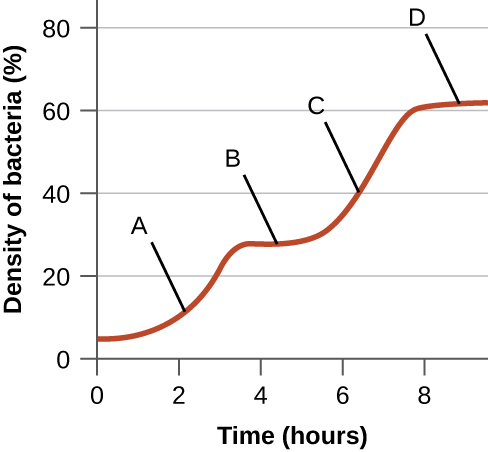

### Learning Objectives

* Compare inducible operons and repressible operons
* Describe why regulation of operons is important

Each nucleated cell in a multicellular organism contains copies of the same DNA. Similarly, all cells in two pure bacterial cultures inoculated from the same starting colony contain the same DNA, with the exception of changes that arise from spontaneous mutations. If each cell in a multicellular organism has the same DNA, then how is it that cells in different parts of the organism’s body exhibit different characteristics? Similarly, how is it that the same bacterial cells within two pure cultures exposed to different environmental conditions can exhibit different phenotypes? In both cases, each genetically identical cell does not turn on, or express, the same set of genes. Only a subset of proteins in a cell at a given time is expressed.

Genomic DNA contains both **structural gene**{: data-type="term" .no-emphasis}s, which encode products that serve as cellular structures or enzymes, and **regulatory gene**{: data-type="term" .no-emphasis}s, which encode products that regulate gene expression. The expression of a gene is a highly regulated process. Whereas regulating gene expression in multicellular organisms allows for cellular differentiation, in single-celled organisms like prokaryotes, it primarily ensures that a cell’s resources are not wasted making proteins that the cell does not need at that time.

Elucidating the mechanisms controlling **gene expression**{: data-type="term" .no-emphasis} is important to the understanding of human health. Malfunctions in this process in humans lead to the development of cancer and other diseases. Understanding the interaction between the gene expression of a pathogen and that of its human host is important for the understanding of a particular infectious disease. Gene regulation involves a complex web of interactions within a given cell among signals from the cell’s environment, signaling molecules within the cell, and the cell’s DNA. These interactions lead to the expression of some genes and the suppression of others, depending on circumstances.

Prokaryotes and eukaryotes share some similarities in their mechanisms to regulate gene expression; however, gene expression in eukaryotes is more complicated because of the temporal and spatial separation between the processes of transcription and translation. Thus, although most regulation of gene expression occurs through transcriptional control in prokaryotes, regulation of gene expression in eukaryotes occurs at the transcriptional level and post-transcriptionally (after the primary transcript has been made).

### Prokaryotic Gene Regulation

In bacteria and **archaea**{: data-type="term" .no-emphasis}, structural proteins with related functions are usually encoded together within the genome in a block called an **operon**{: data-type="term"} and are transcribed together under the control of a single **promoter**{: data-type="term" .no-emphasis}, resulting in the formation of a polycistronic transcript ([\[link\]](#OSC_Microbio_11_07_Operon)). In this way, regulation of the transcription of all of the structural genes encoding the enzymes that catalyze the many steps in a single biochemical pathway can be controlled simultaneously, because they will either all be needed at the same time, or none will be needed. For example, in ***E. coli***{: data-type="term" .no-emphasis}, all of the structural genes that encode enzymes needed to use lactose as an energy source lie next to each other in the lactose (or *lac*) operon under the control of a single promoter, the *lac* promoter. French scientists François **Jacob**{: data-type="term" .no-emphasis} (1920–2013) and Jacques **Monod**{: data-type="term" .no-emphasis} at the Pasteur Institute were the first to show the organization of bacterial genes into operons, through their studies on the ***lac* operon**{: data-type="term" .no-emphasis} of *E. coli*. For this work, they won the Nobel Prize in Physiology or Medicine in 1965. Although eukaryotic genes are not organized into operons, prokaryotic operons are excellent models for learning about gene regulation generally. There are some gene clusters in eukaryotes that function similar to operons. Many of the principles can be applied to eukaryotic systems and contribute to our understanding of changes in gene expression in eukaryotes that can result pathological changes such as cancer.

Each operon includes DNA sequences that influence its own transcription; these are located in a region called the regulatory region. The regulatory region includes the promoter and the region surrounding the promoter, to which **transcription factors**{: data-type="term"}, proteins encoded by regulatory genes, can bind. Transcription factors influence the binding of **RNA polymerase**{: data-type="term" .no-emphasis} to the promoter and allow its progression to transcribe structural genes. A **repressor**{: data-type="term"} is a transcription factor that suppresses transcription of a gene in response to an external stimulus by binding to a DNA sequence within the regulatory region called the **operator**{: data-type="term"}, which is located between the RNA polymerase binding site of the promoter and the transcriptional start site of the first structural gene. Repressor binding physically blocks RNA polymerase from transcribing structural genes. Conversely, an **activator**{: data-type="term"} is a transcription factor that increases the transcription of a gene in response to an external stimulus by facilitating RNA polymerase binding to the promoter. An **inducer**{: data-type="term"}, a third type of regulatory molecule, is a small molecule that either activates or represses transcription by interacting with a repressor or an activator.

In prokaryotes, there are examples of operons whose gene products are required rather consistently and whose expression, therefore, is unregulated. Such operons are **constitutively expressed**{: data-type="term"}, meaning they are transcribed and translated continuously to provide the cell with constant intermediate levels of the protein products. Such genes encode enzymes involved in housekeeping functions required for cellular maintenance, including DNA replication, repair, and expression, as well as enzymes involved in core metabolism. In contrast, there are other prokaryotic operons that are expressed only when needed and are regulated by repressors, activators, and inducers.

 {: #OSC_Microbio_11_07_Operon}

* What are the parts in the DNA sequence of an operon?
* What types of regulatory molecules are there?
{: data-bullet-style="bullet"}

### Regulation by Repression

Prokaryotic operons are commonly controlled by the binding of repressors to operator regions, thereby preventing the transcription of the structural genes. Such operons are classified as either **repressible operon**{: data-type="term"}**s** or inducible operons. Repressible operons, like the tryptophan (*trp*) operon, typically contain genes encoding enzymes required for a biosynthetic pathway. As long as the product of the pathway, like tryptophan, continues to be required by the cell, a repressible operon will continue to be expressed. However, when the product of the biosynthetic pathway begins to accumulate in the cell, removing the need for the cell to continue to make more, the expression of the operon is repressed. Conversely, **inducible operon**{: data-type="term"}**s**, like the ***lac* operon**{: data-type="term" .no-emphasis} of ***E. coli***{: data-type="term" .no-emphasis}, often contain genes encoding enzymes in a pathway involved in the metabolism of a specific substrate like lactose. These enzymes are only required when that substrate is available, thus expression of the operons is typically induced only in the presence of the substrate.

#### The *trp* Operon: A Repressible Operon

***E. coli***{: data-type="term" .no-emphasis} can synthesize tryptophan using enzymes that are encoded by five structural genes located next to each other in the ***trp* operon**{: data-type="term" .no-emphasis} ([\[link\]](#OSC_Microbio_11_07_trp)). When environmental tryptophan is low, the operon is turned on. This means that transcription is initiated, the genes are expressed, and tryptophan is synthesized. However, if tryptophan is present in the environment, the *trp* operon is turned off. Transcription does not occur and tryptophan is not synthesized.

When tryptophan is not present in the cell, the repressor by itself does not bind to the operator; therefore, the operon is active and tryptophan is synthesized. However, when tryptophan accumulates in the cell, two tryptophan molecules bind to the *trp* repressor molecule, which changes its shape, allowing it to bind to the *trp* operator. This binding of the active form of the *trp* repressor to the operator blocks RNA polymerase from transcribing the structural genes, stopping expression of the operon. Thus, the actual product of the biosynthetic pathway controlled by the operon regulates the expression of the operon.

 ![Diagram of the trp operon. The top image shows the operon in the absence of tryptophan. The trp repressor dissociates from the operator and RNA synthesis proceeds. RNA polymerase is bound to the promoter and an arrow indicates that transcription will occur. The repressor is not bound ot anything. The bottom image shows the operon in the presence of tryprophan. When tryptophan is present, the trp repressor binds to the operator and RNA synthesis is blocked. Tryptophan is shown bound to the repressor which is bound to the operator. RNA polymerase is bound to the promoter but is blocked from moving forward by the repressor.](../resources/OSC_Microbio_11_07_trp.jpg "The five structural genes needed to synthesize tryptophan in E. coli are located next to each other in the trp operon. When tryptophan is absent, the repressor protein does not bind to the operator, and the genes are transcribed. When tryptophan is plentiful, tryptophan binds the repressor protein at the operator sequence. This physically blocks the RNA polymerase from transcribing the tryptophan biosynthesis genes."){: #OSC_Microbio_11_07_trp}

  
Watch this [video][1] to learn more about the *trp* operon.

#### The *lac* Operon: An Inducible Operon

The ***lac* operon**{: data-type="term" .no-emphasis} is an example of an inducible operon that is also subject to activation in the absence of glucose ([\[link\]](#OSC_Microbio_11_07_lacrep)). The *lac* operon encodes three structural genes necessary to acquire and process the disaccharide lactose from the environment, breaking it down into the simple sugars glucose and galactose. For the *lac* operon to be expressed, lactose must be present. This makes sense for the cell because it would be energetically wasteful to create the enzymes to process lactose if lactose was not available.

In the absence of lactose, the *lac* repressor is bound to the operator region of the *lac* operon, physically preventing RNA polymerase from transcribing the structural genes. However, when lactose is present, the lactose inside the cell is converted to allolactose. Allolactose serves as an **inducer**{: data-type="term" .no-emphasis} molecule, binding to the **repressor**{: data-type="term" .no-emphasis} and changing its shape so that it is no longer able to bind to the operator DNA. Removal of the repressor in the presence of lactose allows **RNA polymerase**{: data-type="term" .no-emphasis} to move through the operator region and begin transcription of the *lac* structural genes.

 ![A diagram of the lac operon. The top image shows what occurs in the absence of lactose. In the absence of lactose, the lac repressor binds the operator and transcription is blocked. The repressor is not bound to lactose but is bound to the operator. RNA polymerase is bound to the promoter but is blocked from transcription by the repressor. The bottom image shows the presence of lactose. In the presence of lactose, the lac repressor is released from the operator and transcription proceeds at a slow rate. The image shows lactose bound to the repressor which is no longer bound to the operator. RNA polymerase is bound to the promoter and an arrow indicates that transcription is occurring.](../resources/OSC_Microbio_11_07_lacrep.jpg "The three structural genes that are needed to degrade lactose in E. coli are located next to each other in the lac operon. When lactose is absent, the repressor protein binds to the operator, physically blocking the RNA polymerase from transcribing the lac structural genes. When lactose is available, a lactose molecule binds the repressor protein, preventing the repressor from binding to the operator sequence, and the genes are transcribed."){: #OSC_Microbio_11_07_lacrep}

#### The *lac* Operon: Activation by Catabolite Activator Protein

Bacteria typically have the ability to use a variety of substrates as carbon sources. However, because glucose is usually preferable to other substrates, bacteria have mechanisms to ensure that alternative substrates are only used when glucose has been depleted. Additionally, bacteria have mechanisms to ensure that the genes encoding enzymes for using alternative substrates are expressed only when the alternative substrate is available. In the 1940s, Jacques **Monod**{: data-type="term" .no-emphasis} was the first to demonstrate the preference for certain substrates over others through his studies of *E. coli*’s growth when cultured in the presence of two different substrates simultaneously. Such studies generated diauxic growth curves, like the one shown in [\[link\]](#OSC_Microbio_11_07_Diaux). Although the preferred substrate glucose is used first, ***E. coli***{: data-type="term" .no-emphasis} grows quickly and the enzymes for lactose metabolism are absent. However, once glucose levels are depleted, growth rates slow, inducing the expression of the enzymes needed for the metabolism of the second substrate, lactose. Notice how the growth rate in lactose is slower, as indicated by the lower steepness of the growth curve.

The ability to switch from glucose use to another substrate like lactose is a consequence of the activity of an enzyme called **Enzyme IIA**{: data-type="term" .no-emphasis} (EIIA). When glucose levels drop, cells produce less ATP from catabolism (see [Catabolism of Carbohydrates](/m58820){: .target-chapter}), and EIIA becomes phosphorylated. Phosphorylated EIIA activates adenylyl cyclase, an enzyme that converts some of the remaining ATP to **cyclic AMP (cAMP)**{: data-type="term"}, a cyclic derivative of AMP and important signaling molecule involved in glucose and energy metabolism in *E. coli*. As a result, cAMP levels begin to rise in the cell ([\[link\]](#OSC_Microbio_11_07_ATPcAMP)).

The *lac* operon also plays a role in this switch from using glucose to using lactose. When glucose is scarce, the accumulating cAMP caused by increased adenylyl cyclase activity binds to **catabolite activator protein (CAP)**{: data-type="term"}, also known as cAMP receptor protein (CRP). The complex binds to the promoter region of the *lac* operon ([\[link\]](#OSC_Microbio_11_07_CAP)). In the regulatory regions of these operons, a CAP binding site is located upstream of the RNA polymerase binding site in the promoter. Binding of the CAP-cAMP complex to this site increases the binding ability of RNA polymerase to the promoter region to initiate the transcription of the structural genes. Thus, in the case of the *lac* operon, for transcription to occur, lactose must be present (removing the lac repressor protein) and glucose levels must be depleted (allowing binding of an activating protein). When glucose levels are high, there is catabolite repression of operons encoding enzymes for the metabolism of alternative substrates. Because of low cAMP levels under these conditions, there is an insufficient amount of the CAP-cAMP complex to activate transcription of these operons. See [\[link\]](#fs-id1167663723938) for a summary of the regulation of the lac operon.

  until it is depleted. Then, enzymes needed for the metabolism of the second substrate are expressed and growth resumes, although at a slower rate."){: #OSC_Microbio_11_07_Diaux}

![ATP contains 3 phosphate groups. Adenylyl cyclase removes two of these phosphate groups. The remaining phosphate group is linked into the sugar to make cAMP. Cyclic AMP is made of a ribose sugar with oxygens at both carbons 2 and 3 (the carbons at the bottom of the pentagon). The oxygen bound to carbon 3 is also bound to the phosphorus. Similarly, the oxygen bound at carbon 5 was already bound to the phosphorus. This forms a ring where the phosphorus is linked with an oxygen to both carbons 3 and 5.](../resources/OSC_Microbio_11_07_ATPcAMP.jpg "When ATP levels decrease due to depletion of glucose, some remaining ATP is converted to cAMP by adenylyl cyclase. Thus, increased cAMP levels signal glucose depletion."){: #OSC_Microbio_11_07_ATPcAMP}

![Diagram of the lac operon with and without cAMP. A) In the absence of cAMP, CAP does not bind the promoter. RNA polymerase does bind to the promoter and transcription occurs at a low rate. In the presence of cAMP, CAP binds the promoter and increases RNA polymerase activity. This is shown with a circle labeled cAMP + CAP bound to the promoter. RNA polymerase is also bound to the promoter and a thick arrow indicates faster transcription. B) cAMO-CAP complex stimulates RNA polymerase activity and increases RNA synthesis. However, even in the presence of cAMP-CAP complex, RNA synthesis is blocked when repressor is bound ot he operator. This is shows as the cAMP + CAP circle as well as the RNA polymerase bound to the promoter. The repressor is bound to the operator and this blocks RNA polymerase from moving forward.](../resources/OSC_Microbio_11_07_CAP.jpg "(a) In the presence of cAMP, CAP binds to the promoters of operons, like the lac operon, that encode genes for enzymes for the use of alternate substrates. (b) For the lac operon to be expressed, there must be activation by cAMP-CAP as well as removal of the lac repressor from the operator."){: #OSC_Microbio_11_07_CAP}

<table summary="Table titled: Conditions Affecting Transcription of the lac Operon. If glucose is present, CAP is not bound, Lactose is absent, and repressor is bound &#x2013; there is no transcription. If glucose is present, CAP is not bound, Lactose is present, and repressor is bound &#x2013; there is some transcription. If glucose is absent, CAP is bound, Lactose is absent, and repressor is bound &#x2013; there is no transcription. If glucose is absent, CAP is bound, Lactose is present, and repressor is not bound &#x2013; there is transcription." class="span-all"><thead>
<tr>
<th colspan="5" data-align="center">Conditions Affecting Transcription of the <em>lac</em> Operon</th>
</tr>
<tr valign="top">
<th data-valign="top" data-align="left">Glucose</th>
<th data-valign="top" data-align="left">CAP binds</th>
<th data-valign="top" data-align="left">Lactose</th>
<th data-valign="top" data-align="left">Repressor binds</th>
<th data-valign="top" data-align="left">Transcription</th>
</tr>
</thead><tbody>
<tr valign="top">
<td data-valign="top" data-align="center">+</td>
<td data-valign="top" data-align="center">–</td>
<td data-valign="top" data-align="center">–</td>
<td data-valign="top" data-align="center">+</td>
<td data-valign="top" data-align="center">No</td>
</tr>
<tr valign="top">
<td data-valign="top" data-align="center">+</td>
<td data-valign="top" data-align="center">–</td>
<td data-valign="top" data-align="center">+</td>
<td data-valign="top" data-align="center">–</td>
<td data-valign="top" data-align="center">Some</td>
</tr>
<tr valign="top">
<td data-valign="top" data-align="center">–</td>
<td data-valign="top" data-align="center">+</td>
<td data-valign="top" data-align="center">–</td>
<td data-valign="top" data-align="center">+</td>
<td data-valign="top" data-align="center">No</td>
</tr>
<tr valign="top">
<td data-valign="top" data-align="center">–</td>
<td data-valign="top" data-align="center">+</td>
<td data-valign="top" data-align="center">+</td>
<td data-valign="top" data-align="center">–</td>
<td data-valign="top" data-align="center">Yes</td>
</tr>
</tbody></table>

  
Watch an [animated tutorial][2] about the workings of lac operon here.

* What affects the binding of the *trp* operon repressor to the operator?
* How and when is the behavior of the *lac* repressor protein altered?
* In addition to being repressible, how else is the *lac* operon regulated?
{: data-bullet-style="bullet"}

### Global Responses of Prokaryotes

In prokaryotes, there are also several higher levels of gene regulation that have the ability to control the transcription of many related operons simultaneously in response to an environmental signal. A group of operons all controlled simultaneously is called a **regulon**{: data-type="term" .no-emphasis}.

#### Alarmones

When sensing impending stress, prokaryotes alter the expression of a wide variety of **operon**{: data-type="term" .no-emphasis}s to respond in coordination. They do this through the production of **alarmones**{: data-type="term"}, which are small intracellular nucleotide derivatives. Alarmones change which genes are expressed and stimulate the expression of specific stress-response genes. The use of alarmones to alter gene expression in response to stress appears to be important in pathogenic bacteria. On encountering host defense mechanisms and other harsh conditions during infection, many operons encoding virulence genes are upregulated in response to alarmone signaling. Knowledge of these responses is key to being able to fully understand the infection process of many pathogens and to the development of therapies to counter this process.

#### Alternate σ Factors

Since the σ subunit of bacterial RNA polymerase confers specificity as to which promoters should be transcribed, altering the **σ factor**{: data-type="term"} used is another way for bacteria to quickly and globally change what regulons are transcribed at a given time. The σ factor recognizes sequences within a bacterial **promoter**{: data-type="term" .no-emphasis}, so different σ factors will each recognize slightly different promoter sequences. In this way, when the cell senses specific environmental conditions, it may respond by changing which σ factor it expresses, degrading the old one and producing a new one to transcribe the operons encoding genes whose products will be useful under the new environmental condition. For example, in sporulating bacteria of the genera ***Bacillus***{: data-type="term" .no-emphasis} and ***Clostridium***{: data-type="term" .no-emphasis} (which include many pathogens), a group of σ factors controls the expression of the many genes needed for sporulation in response to sporulation-stimulating signals.

* What is the name given to a collection of operons that can be regulated as a group?
* What type of stimulus would trigger the transcription of a different σ factor?
{: data-bullet-style="bullet"}

### Additional Methods of Regulation in Bacteria: Attenuation and Riboswitches

Although most gene expression is regulated at the level of transcription initiation in prokaryotes, there are also mechanisms to control both the completion of transcription as well as translation concurrently. Since their discovery, these mechanisms have been shown to control the completion of transcription and translation of many prokaryotic operons. Because these mechanisms link the regulation of transcription and translation directly, they are specific to prokaryotes, because these processes are physically separated in eukaryotes.

One such regulatory system is **attenuation**{: data-type="term"}, whereby secondary **stem-loop structure**{: data-type="term" .no-emphasis}s formed within the 5’ end of an mRNA being transcribed determine if transcription to complete the synthesis of this mRNA will occur and if this mRNA will be used for translation. Beyond the transcriptional repression mechanism already discussed, attenuation also controls expression of the ***trp* operon**{: data-type="term" .no-emphasis} in ***E. coli***{: data-type="term" .no-emphasis} ([\[link\]](#OSC_Microbio_11_07_Atten)). The *trp* operon regulatory region contains a leader sequence called *trpL* between the operator and the first structural gene, which has four stretches of RNA that can base pair with each other in different combinations. When a terminator stem-loop forms, transcription terminates, releasing RNA polymerase from the mRNA. However, when an antiterminator stem-loop forms, this prevents the formation of the terminator stem-loop, so RNA polymerase can transcribe the structural genes.

A related mechanism of concurrent regulation of transcription and translation in prokaryotes is the use of a **riboswitch**{: data-type="term"}, a small region of noncoding RNA found within the 5’ end of some prokaryotic mRNA molecules ([\[link\]](#OSC_Microbio_11_07_Riboswitch). A riboswitch may bind to a small intracellular molecule to stabilize certain secondary structures of the mRNA molecule. The binding of the small molecule determines which stem-loop structure forms, thus influencing the completion of mRNA synthesis and protein synthesis.

 {: #OSC_Microbio_11_07_Atten}

![a) The mRNA forms a loop called a riboswitch and a loop called an antiterminator stem loop. RNA polymerase can proceed transcription. This is labeled &#x201C;on&#x201D;. A small molecule binds to the mRNA at the riboswitch location. The shifts the second loop to the terminator stem loop position and no transcription occurs. This is labeled off. B) The mRNA forms a loop called a riboswitch and another unlabeled loop. The ribosome binds at the ribosome binding site after the second loop and a translation proceeds. This is &#x201C;on&#x201D;. A small molecule binds to the mRNA at the riboswitch location. The shifts the second loop to the ribosome binding site location with blocks this ribosome binding site. This is now &#x201C;off&#x201D;.](../resources/OSC_Microbio_11_07_Riboswitch.jpg "Riboswitches found within prokaryotic mRNA molecules can bind to small intracellular molecules, stabilizing certain RNA structures, influencing either the completion of the synthesis of the mRNA molecule itself (left) or the protein made using that mRNA (right)."){: #OSC_Microbio_11_07_Riboswitch}

### Other Factors Affecting Gene Expression in Prokaryotes and Eukaryotes

Although the focus on our discussion of transcriptional control used prokaryotic operons as examples, eukaryotic transcriptional control is similar in many ways. As in prokaryotes, eukaryotic transcription can be controlled through the binding of transcription factors including **repressor**{: data-type="term" .no-emphasis}s and **activator**{: data-type="term" .no-emphasis}s. Interestingly, eukaryotic transcription can be influenced by the binding of proteins to regions of DNA, called **enhancer**{: data-type="term" .no-emphasis}s, rather far away from the gene, through DNA looping facilitated between the enhancer and the promoter ([\[link\]](#OSC_Microbio_11_07_Enhancer)). Overall, regulating transcription is a highly effective way to control gene expression in both prokaryotes and eukaryotes. However, the control of gene expression in eukaryotes in response to environmental and cellular stresses can be accomplished in additional ways without the binding of transcription factors to regulatory regions.

 {: #OSC_Microbio_11_07_Enhancer}

#### DNA-Level Control

In eukaryotes, the DNA molecules or associated histones can be chemically modified in such a way as to influence transcription; this is called **epigenetic regulation**{: data-type="term"}. Methylation of certain cytosine nucleotides in DNA in response to environmental factors has been shown to influence use of such DNA for transcription, with **DNA methylation**{: data-type="term" .no-emphasis} commonly correlating to lowered levels of gene expression. Additionally, in response to environmental factors, **histone**{: data-type="term" .no-emphasis} proteins for packaging DNA can also be chemically modified in multiple ways, including **acetylation**{: data-type="term" .no-emphasis} and deacetylation, influencing the packaging state of DNA and thus affecting the availability of loosely wound DNA for transcription. These chemical modifications can sometimes be maintained through multiple rounds of cell division, making at least some of these epigenetic changes heritable.

  
This [video][3] describes how epigenetic regulation controls gene expression.

* What stops or allows transcription to proceed when attenuation is operating?
* What determines the state of a riboswitch?
* Describe the function of an enhancer.
* Describe two mechanisms of epigenetic regulation in eukaryotes.
{: data-bullet-style="bullet"}

Resolution

Although Mark survived his bout with necrotizing fasciitis, he would now have to undergo a skin-grafting surgery, followed by long-term physical therapy. Based on the amount of muscle mass he lost, it is unlikely that his leg will return to full strength, but his physical therapist is optimistic that he will regain some use of his leg.

Laboratory testing revealed the causative agent of Mark’s infection was a strain of group A streptococcus (Group A strep). As required by law, Mark’s case was reported to the state health department and ultimately to the Centers for Disease Control and Prevention (CDC). At the CDC, the strain of group A strep isolated from Mark was analyzed more thoroughly for methicillin resistance.

Methicillin resistance is genetically encoded and is becoming more common in group A strep through horizontal gene transfer. In necrotizing fasciitis, blood flow to the infected area is typically limited because of the action of various genetically encoded bacterial toxins. This is why there is typically little to no bleeding as a result of the incision test. Unfortunately, these bacterial toxins limit the effectiveness of intravenous antibiotics in clearing infection from the skin and underlying tissue, meaning that antibiotic resistance alone does not explain the ineffectiveness of Mark’s treatment. Nevertheless, intravenous antibiotic therapy was warranted to help minimize the possible outcome of sepsis, which is a common outcome of necrotizing fasciitis. Through genomic analysis by the CDC of the strain isolated from Mark, several of the important virulence genes were shown to be encoded on prophages, indicating that transduction is important in the horizontal gene transfer of these genes from one bacterial cell to another.

*Go back to the [previous](/m58845#fs-id1167661565061) Clinical Focus box.*

### Key Concepts and Summary

* **Gene expression** is a tightly regulated process.
* Gene expression in prokaryotes is largely regulated at the point of transcription. Gene expression in eukaryotes is additionally regulated post-transcriptionally.
* Prokaryotic structural genes of related function are often organized into **operons**, all controlled by transcription from a single promoter. The regulatory region of an operon includes the promoter itself and the region surrounding the promoter to which transcription factors can bind to influence transcription.
* Although some operons are **constitutively expressed**, most are subject to regulation through the use of **transcription factors** (repressors and activators). A **repressor** binds to an **operator**, a DNA sequence within the regulatory region between the RNA polymerase binding site in the promoter and first structural gene, thereby physically blocking transcription of these operons. An **activator** binds within the regulatory region of an operon, helping RNA polymerase bind to the promoter, thereby enhancing the transcription of this operon. An **inducer** influences transcription through interacting with a repressor or activator.
* The *trp* operon is a classic example of a **repressible operon**. When tryptophan accumulates, tryptophan binds to a repressor, which then binds to the operator, preventing further transcription.
* The *lac* operon is a classic example an **inducible operon**. When lactose is present in the cell, it is converted to allolactose. Allolactose acts as an inducer, binding to the repressor and preventing the repressor from binding to the operator. This allows transcription of the structural genes.
* The *lac* operon is also subject to activation. When glucose levels are depleted, some cellular ATP is converted into cAMP, which binds to the **catabolite activator protein (CAP)**. The cAMP-CAP complex activates transcription of the *lac* operon. When glucose levels are high, its presence prevents transcription of the *lac* operon and other operons by **catabolite repression**.
* Small intracellular molecules called **alarmones** are made in response to various environmental stresses, allowing bacteria to control the transcription of a group of operons, called a regulon.
* Bacteria have the ability to change which **σ factor** of RNA polymerase they use in response to environmental conditions to quickly and globally change which regulons are transcribed.
* Prokaryotes have regulatory mechanisms, including **attenuation** and the use of **riboswitches**, to simultaneously control the completion of transcription and translation from that transcript. These mechanisms work through the formation of stem loops in the 5’ end of an mRNA molecule currently being synthesized.
* There are additional points of regulation of gene expression in prokaryotes and eukaryotes. In eukaryotes, **epigenetic regulation** by chemical modification of DNA or histones, and regulation of RNA processing are two methods.
{: data-bullet-style="bullet"}

### Multiple Choice

An operon of genes encoding enzymes in a biosynthetic pathway is likely to be which of the following?

1.  inducible
2.  repressible
3.  constitutive
4.  monocistronic
{: type="A"}

B

An operon encoding genes that are transcribed and translated continuously to provide the cell with constant intermediate levels of the protein products is said to be which of the following?

1.  repressible
2.  inducible
3.  constitutive
4.  activated
{: type="A"}

C

Which of the following conditions leads to maximal expression of the *lac* operon?

1.  lactose present, glucose absent
2.  lactose present, glucose present
3.  lactose absent, glucose absent
4.  lactose absent, glucose present
{: type="A"}

A

Which of the following is a type of regulation of gene expression unique to eukaryotes?

1.  attenuation
2.  use of alternate σ factor
3.  chemical modification of histones
4.  alarmones
{: type="A"}

C

### Fill in the Blank

The DNA sequence, to which repressors may bind, that lies between the promoter and the first structural gene is called the \_\_\_\_\_\_\_\_.

operator

The prevention of expression of operons encoding substrate use pathways for substrates other than glucose when glucose is present is called \_\_\_\_\_\_\_.

catabolite repression

### Short Answer

What are two ways that bacteria can influence the transcription of multiple different operons simultaneously in response to a particular environmental condition?

### Critical Thinking

The following figure is from Monod’s original work on diauxic growth showing the growth of *E. coli* in the simultaneous presence of xylose and glucose as the only carbon sources. Explain what is happening at points A–D with respect to the carbon source being used for growth, and explain whether the xylose-use operon is being expressed (and why). Note that expression of the enzymes required for xylose use is regulated in a manner similar to the expression of the enzymes required for lactose use.

  

[1]: https://openstax.org/l/22trpoperon
[2]: https://openstax.org/l/22lacoperon
[3]: https://openstax.org/l/22epigreg
