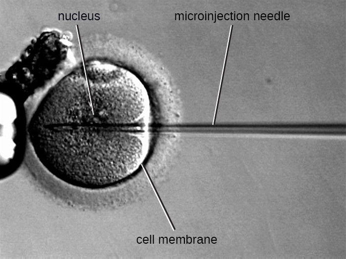

### Learning Objectives

* Identify tools of molecular genetics that are derived from microorganisms
* Describe the methods used to create recombinant DNA molecules
* Describe methods used to introduce DNA into prokaryotic cells
* List the types of genomic libraries and describe their uses
* Describe the methods used to introduce DNA into eukaryotic cells

Part 1

Kayla, a 24-year-old electrical engineer and running enthusiast, just moved from Arizona to New Hampshire to take a new job. On her weekends off, she loves to explore her new surroundings, going for long runs in the pine forests. In July she spent a week hiking through the mountains. In early August, Kayla developed a low fever, headache, and mild muscle aches, and she felt a bit fatigued. Not thinking much of it, she took some ibuprofen to combat her symptoms and vowed to get more rest.

* What types of medical conditions might be responsible for Kayla’s symptoms?
{: data-bullet-style="bullet"}

*Jump to the [next](/m58849#fs-id1167742703238) Clinical Focus box.*

The science of using living systems to benefit humankind is called **biotechnology**{: data-type="term"}. Technically speaking, the domestication of plants and animals through farming and **breeding**{: data-type="term" .no-emphasis} practices is a type of biotechnology. However, in a contemporary sense, we associate biotechnology with the direct alteration of an organism’s genetics to achieve desirable traits through the process of **genetic engineering**{: data-type="term"}. Genetic engineering involves the use of **recombinant DNA technology**{: data-type="term"}, the process by which a DNA sequence is manipulated *in vitro,* thus creating **recombinant DNA**{: data-type="term"} **molecule**{: data-type="term"}**s** that have new combinations of genetic material. The recombinant DNA is then introduced into a host organism. If the DNA that is introduced comes from a different species, the host organism is now considered to be **transgenic**{: data-type="term"}.

One example of a transgenic microorganism is the bacterial strain that produces human **insulin**{: data-type="term" .no-emphasis} ([\[link\]](#OSC_Microbio_12_01_RecombTech)). The insulin gene from humans was inserted into a plasmid. This recombinant DNA plasmid was then inserted into bacteria. As a result, these transgenic microbes are able to produce and secrete human insulin. Many prokaryotes are able to acquire foreign DNA and incorporate functional genes into their own genome through “mating” with other cells (**conjugation**{: data-type="term" .no-emphasis}), viral infection (**transduction**{: data-type="term" .no-emphasis}), and taking up DNA from the environment (**transformation**{: data-type="term" .no-emphasis}). Recall that these mechanisms are examples of **horizontal gene transfer**{: data-type="term" .no-emphasis}—the transfer of genetic material between cells of the same generation.

 ![A diagram explaining recombinant DNA technology. The insulin gene is removed from the DNA in the nucleus of a human cell. This gene is then inserted into a plasmid (a round piece of DNA). The result is a recombinant plasmid which gets inserted into a bacterial cell. The resulting transgenic bacterium is a bacterial cell with a plasmid containing the insulin gene. The recombinant bacteria divide and produce the protein coded for by the inserted gene. In this example the bacteria are producing and secreting insulin. The result is insulin in solution.](../resources/OSC_Microbio_12_01_RecombTech.jpg "Recombinant DNA technology is the artificial recombination of DNA from two organisms. In this example, the human insulin gene is inserted into a bacterial plasmid. This recombinant plasmid can then be used to transform bacteria, which gain the ability to produce the insulin protein."){: #OSC_Microbio_12_01_RecombTech}

### Molecular Cloning

Herbert **Boyer**{: data-type="term" .no-emphasis} and Stanley **Cohen**{: data-type="term" .no-emphasis} first demonstrated the complete **molecular cloning**{: data-type="term"} process in 1973 when they successfully cloned genes from the African clawed frog (***Xenopus laevis***{: data-type="term" .no-emphasis}) into a bacterial plasmid that was then introduced into the bacterial host ***Escherichia coli***{: data-type="term" .no-emphasis}. Molecular cloning is a set of methods used to construct recombinant DNA and incorporate it into a host organism; it makes use of a number of molecular tools that are derived from microorganisms.

#### Restriction Enzymes and Ligases

In recombinant DNA technology, DNA molecules are manipulated using naturally occurring enzymes derived mainly from bacteria and viruses. The creation of recombinant DNA molecules is possible due to the use of naturally occurring **restriction endonucleases**{: data-type="term"} (**restriction enzymes**{: data-type="term"}), bacterial enzymes produced as a protection mechanism to cut and destroy foreign cytoplasmic DNA that is most commonly a result of bacteriophage infection. Stewart **Linn**{: data-type="term" .no-emphasis} and Werner **Arber**{: data-type="term" .no-emphasis} discovered restriction enzymes in their 1960s studies of how *E. coli* limits bacteriophage replication on infection. Today, we use restriction enzymes extensively for cutting DNA fragments that can then be spliced into another DNA molecule to form recombinant molecules. Each restriction enzyme cuts DNA at a characteristic **recognition site**{: data-type="term"}, a specific, usually palindromic, DNA sequence typically between four to six base pairs in length. A palindrome is a sequence of letters that reads the same forward as backward. (The word “level” is an example of a palindrome.) Palindromic DNA sequences contain the same base sequences in the 5ʹ to 3ʹ direction on one strand as in the 5ʹ to 3ʹ direction on the complementary strand. A restriction enzyme recognizes the DNA palindrome and cuts each backbone at identical positions in the palindrome. Some restriction enzymes cut to produce molecules that have complementary overhangs (**sticky ends**{: data-type="term"}) while others cut without generating such overhangs, instead producing **blunt ends**{: data-type="term"} ([\[link\]](#OSC_Microbio_12_01_Recuts)).

Molecules with complementary sticky ends can easily **anneal**{: data-type="term"}, or form hydrogen bonds between complementary bases, at their sticky ends. The annealing step allows **hybridization**{: data-type="term"} of the single-stranded overhangs. Hybridization refers to the joining together of two complementary single strands of DNA. Blunt ends can also attach together, but less efficiently than sticky ends due to the lack of complementary overhangs facilitating the process. In either case, **ligation**{: data-type="term"} by **DNA ligase**{: data-type="term" .no-emphasis} can then rejoin the two sugar-phosphate backbones of the DNA through covalent bonding, making the molecule a continuous double strand. In 1972, Paul **Berg**{: data-type="term" .no-emphasis}, a Stanford biochemist, was the first to produce a recombinant DNA molecule using this technique, combining the SV40 monkey virus with *E. coli* bacteriophage lambda to create a hybrid.

 ![Diagrams of how restriction enzymes cut DNA. Both diagrams show a double stranded pieces of DNA that is cut. A) in sticky end cutting the DNA is cut so that there are short single stranded pieces of DNA at the cut site. In this example, the enzyme cuts the sequence GGATCC; it cuts between the two G&#x2019;s. After cutting, both strands have a double stranded G/C bond, but then also have single stranded GATC. In blunt end cutting there are no single stranded ends. In this example the enzyme cuts GGCC between the G and the C.](../resources/OSC_Microbio_12_01_Recuts.jpg "(a) In this six-nucleotide restriction enzyme site, recognized by the enzyme BamHI, notice that the sequence reads the same in the 5&#x2B9; to 3&#x2B9; direction on both strands. This is known as a palindrome. The cutting of the DNA by the restriction enzyme at the sites (indicated by the black arrows) produces DNA fragments with sticky ends. Another piece of DNA cut with the same restriction enzyme could attach to one of these sticky ends, forming a recombinant DNA molecule. (b) This four-nucleotide recognition site also exhibits a palindromic sequence. The cutting of the DNA by the restriction enzyme HaeIII at the indicated sites produces DNA fragments with blunt ends. Any other piece of blunt DNA could attach to one of the blunt ends produced, forming a recombinant DNA molecule."){: #OSC_Microbio_12_01_Recuts}

#### Plasmids

After restriction digestion, genes of interest are commonly inserted into **plasmids**{: data-type="term" .no-emphasis}, small pieces of typically circular, double-stranded DNA that replicate independently of the bacterial chromosome (see [Unique Characteristics of Prokaryotic Cells](/m58792){: .target-chapter}). In recombinant DNA technology, plasmids are often used as **vectors**{: data-type="term"}, DNA molecules that carry DNA fragments from one organism to another. Plasmids used as vectors can be genetically engineered by researchers and scientific supply companies to have specialized properties, as illustrated by the commonly used plasmid vector **pUC19**{: data-type="term" .no-emphasis} ([\[link\]](#OSC_Microbio_12_01_pUC19)). Some **plasmid vectors**{: data-type="term" .no-emphasis} contain genes that confer **antibiotic resistance**{: data-type="term" .no-emphasis}; these resistance genes allow researchers to easily find plasmid-containing colonies by plating them on media containing the corresponding antibiotic. The antibiotic kills all host cells that do not harbor the desired plasmid vector, but those that contain the vector are able to survive and grow.

Plasmid vectors used for cloning typically have a **polylinker site**{: data-type="term"}, or **multiple cloning site (MCS)**{: data-type="term"}. A polylinker site is a short sequence containing multiple unique restriction enzyme recognition sites that are used for inserting DNA into the plasmid after restriction digestion of both the DNA and the plasmid. Having these multiple restriction enzyme recognition sites within the polylinker site makes the plasmid vector versatile, so it can be used for many different cloning experiments involving different restriction enzymes.

This polylinker site is often found within a **reporter gene**{: data-type="term"}, another gene sequence artificially engineered into the plasmid that encodes a protein that allows for visualization of DNA insertion. The reporter gene allows a researcher to distinguish host cells that contain recombinant plasmids with cloned DNA fragments from host cells that only contain the non-recombinant plasmid vector. The most common reporter gene used in plasmid vectors is the bacterial ***lacZ***{: data-type="term" .no-emphasis} gene encoding beta-galactosidase, an enzyme that naturally degrades lactose but can also degrade a colorless synthetic analog **X-gal**{: data-type="term" .no-emphasis}, thereby producing blue colonies on X-gal–containing media. The *lacZ* reporter gene is disabled when the recombinant DNA is spliced into the plasmid. Because the LacZ protein is not produced when the gene is disabled, X-gal is not degraded and white colonies are produced, which can then be isolated. This **blue-white screening**{: data-type="term"} method is described later and shown in [\[link\]](#OSC_Microbio_12_01_MolCloning). In addition to these features, some plasmids come pre-digested and with an enzyme linked to the linearized plasmid to aid in ligation after the insertion of foreign DNA fragments.

  resistance gene encoded on the plasmid."){: #OSC_Microbio_12_01_pUC19}

#### Molecular Cloning using Transformation

The most commonly used mechanism for introducing engineered plasmids into a bacterial cell is **transformation**{: data-type="term" .no-emphasis}, a process in which bacteria take up free DNA from their surroundings. In nature, free DNA typically comes from other lysed bacterial cells; in the laboratory, free DNA in the form of recombinant plasmids is introduced to the cell’s surroundings.

Some bacteria, such as ***Bacillus***{: data-type="term" .no-emphasis} spp., are naturally competent, meaning they are able to take up foreign DNA. However, not all bacteria are naturally competent. In most cases, bacteria must be made artificially competent in the laboratory by increasing the permeability of the cell membrane. This can be achieved through chemical treatments that neutralize charges on the cell membrane or by exposing the bacteria to an electric field that creates microscopic pores in the cell membrane. These methods yield chemically competent or electrocompetent bacteria, respectively.

Following the transformation protocol, bacterial cells are plated onto an antibiotic-containing medium to inhibit the growth of the many host cells that were not transformed by the plasmid conferring antibiotic resistance. A technique called **blue-white screening**{: data-type="term"} is then used for *lacZ*-encoding plasmid vectors such as pUC19. Blue colonies have a functional beta-galactosidase enzyme because the *lacZ* gene is uninterrupted, with no foreign DNA inserted into the polylinker site. These colonies typically result from the digested, linearized plasmid religating to itself. However, white colonies lack a functional beta-galactosidase enzyme, indicating the insertion of foreign DNA within the polylinker site of the plasmid vector, thus disrupting the *lacZ* gene. Thus, white colonies resulting from this blue-white screening contain plasmids with an insert and can be further screened to characterize the foreign DNA. To be sure the correct DNA was incorporated into the plasmid, the DNA insert can then be sequenced.

  
View an [animation of molecular cloning][1] from the DNA Learning Center.

* In blue-white screening, what does a blue colony mean and why is it blue?
{: data-bullet-style="bullet"}

#### Molecular Cloning Using Conjugation or Transduction

The bacterial process of **conjugation**{: data-type="term" .no-emphasis} (see [How Asexual Prokaryotes Achieve Genetic Diversity](/m58845){: .target-chapter}) can also be manipulated for molecular cloning. **F plasmids**{: data-type="term" .no-emphasis}, or fertility plasmids, are transferred between bacterial cells through the process of conjugation. Recombinant DNA can be transferred by conjugation when bacterial cells containing a recombinant F plasmid are mixed with compatible bacterial cells lacking the plasmid. F plasmids encode a surface structure called an **F pilus**{: data-type="term" .no-emphasis} that facilitates contact between a cell containing an F plasmid and one without an F plasmid. On contact, a cytoplasmic bridge forms between the two cells and the F-plasmid-containing cell replicates its plasmid, transferring a copy of the recombinant F plasmid to the recipient cell. Once it has received the recombinant F plasmid, the recipient cell can produce its own F pilus and facilitate transfer of the recombinant F plasmid to an additional cell. The use of conjugation to transfer recombinant F plasmids to recipient cells is another effective way to introduce recombinant DNA molecules into host cells.

Alternatively, **bacteriophages**{: data-type="term" .no-emphasis} can be used to introduce recombinant DNA into host bacterial cells through a manipulation of the **transduction**{: data-type="term" .no-emphasis} process (see [How Asexual Prokaryotes Achieve Genetic Diversity](/m58845){: .target-chapter}). In the laboratory, DNA fragments of interest can be engineered into **phagemids**{: data-type="term"}, which are plasmids that have phage sequences that allow them to be packaged into bacteriophages. Bacterial cells can then be infected with these bacteriophages so that the recombinant phagemids can be introduced into the bacterial cells. Depending on the type of phage, the recombinant DNA may be integrated into the host bacterial genome (lysogeny), or it may exist as a plasmid in the host’s cytoplasm.

 ![A diagram explaining molecular cloning. Both foreign DNa and a plasmid are cut with the same restriction enzyme. The restriction site occurs only once in the plasmid in the middle of a gene for and enzyme (lacZ). The plasmid also contains an ampicillin resistang gene. The restriction enzyme leaves complementary sticky ends on the foreign DNA fragment and the plasmid. This allows the foreign DNA to be inserted into the plasmid when the sticky ends anneal. Adding DNA ligase reattaches the DNA backbones. These are recombinant plasmids. The plasmids are combined with a culture of living bacteria. Many of the bacteria do not take any plasmids into their cells. Many take plasmids that do not have the foreign DNA in them and a few take up the recombinant plasmid. The bacteria that take up the recombinant plasmid cannot make the enzyme from the gene that the fragment was inserted into (lacZ). They also carry a gene for resistance to the antibiotic ampicillin, which was on the original plasmid. To find the bacteria with the recombinant plasmid, the bacteria are grown on a plate with the antibiotic ampicillin and a substance that changes color when exposed to the enzyme produced by the lacZ gene. The ampicillin will kill any bacteria that did not take up a plasmid. The color of the substance will nto change when the gene for lacZ contains the foreign DNA insert. These are the bacteria with the recombinant plasmid that we want to grow.](../resources/OSC_Microbio_12_01_MolCloning.jpg "The steps involved in molecular cloning using bacterial transformation are outlined in this graphic flowchart."){: #OSC_Microbio_12_01_MolCloning}

* What is the original function of a restriction enzyme?
* What two processes are exploited to get recombinant DNA into a bacterial host cell?
* Distinguish the uses of an antibiotic resistance gene and a reporter gene in a plasmid vector.
{: data-bullet-style="bullet"}

### Creating a Genomic Library

Molecular cloning may also be used to generate a **genomic library**{: data-type="term"}. The library is a complete (or nearly complete) copy of an organism’s genome contained as recombinant DNA plasmids engineered into unique clones of bacteria. Having such a library allows a researcher to create large quantities of each fragment by growing the bacterial host for that fragment. These fragments can be used to determine the sequence of the DNA and the function of any genes present.

One method for generating a genomic library is to ligate individual restriction enzyme-digested genomic fragments into plasmid vectors cut with the same restriction enzyme ([\[link\]](#OSC_Microbio_12_01_CloneLibry)). After transformation into a bacterial host, each transformed bacterial cell takes up a single recombinant plasmid and grows into a colony of cells. All of the cells in this colony are identical **clones**{: data-type="term"} and carry the same recombinant plasmid. The resulting library is a collection of colonies, each of which contains a fragment of the original organism’s genome, that are each separate and distinct and can each be used for further study. This makes it possible for researchers to screen these different clones to discover the one containing a gene of interest from the original organism’s genome.

 "){: #OSC_Microbio_12_01_CloneLibry}

To construct a genomic library using larger fragments of genomic DNA, an *E. coli* bacteriophage, such as **lambda**{: data-type="term" .no-emphasis}, can be used as a host ([\[link\]](#OSC_Microbio_12_01_PhageLibry)). Genomic DNA can be sheared or enzymatically digested and ligated into a pre-digested bacteriophage lambda DNA vector. Then, these recombinant phage DNA molecules can be packaged into phage particles and used to infect *E. coli* host cells on a plate. During infection within each cell, each recombinant phage will make many copies of itself and lyse the *E. coli* lawn, forming a plaque. Thus, each plaque from a phage library represents a unique recombinant phage containing a distinct genomic DNA fragment. Plaques can then be screened further to look for genes of interest. One advantage to producing a library using phages instead of plasmids is that a phage particle holds a much larger insert of foreign DNA compared with a plasmid vector, thus requiring a much smaller number of cultures to fully represent the entire genome of the original organism.

 {: #OSC_Microbio_12_01_PhageLibry}

To focus on the expressed genes in an organism or even a tissue, researchers construct libraries using the organism’s messenger RNA (mRNA) rather than its genomic DNA. Whereas all cells in a single organism will have the same genomic DNA, different tissues express different genes, producing different complements of **mRNA**{: data-type="term" .no-emphasis}. For example, all human cells’ genomic DNA contains the gene for insulin, but only cells in the pancreas express mRNA directing the production of insulin. Because mRNA cannot be cloned directly, in the laboratory mRNA must be used as a template by the retroviral enzyme **reverse transcriptase**{: data-type="term" .no-emphasis} to make **complementary DNA (cDNA)**{: data-type="term"}. A cell’s full complement of mRNA can be reverse-transcribed into cDNA molecules, which can be used as a template for DNA polymerase to make double-stranded DNA copies; these fragments can subsequently be ligated into either plasmid vectors or bacteriophage to produce a cDNA library. The benefit of a cDNA library is that it contains DNA from only the expressed genes in the cell. This means that the introns, control sequences such as promoters, and DNA not destined to be translated into proteins are not represented in the library. The focus on translated sequences means that the library cannot be used to study the sequence and structure of the genome in its entirety. The construction of a cDNA genomic library is shown in [\[link\]](#OSC_Microbio_12_01_cDNALibry).

 ![A diagram showing the generation of a cDNA library. The diagram begins with RNA being extracted from the organism (in this case a worm). Reverse transcription is then used to convert the RNA into cDNA The cDNA fragments are then each inserted into a different plasmid. This produces many fragments each with a different insert from the genome. Bacteria are then transformed with these vectors. Each bacterium replicates producing colonies of clones each containing a single cDNA fragment from the original organism.](../resources/OSC_Microbio_12_01_cDNALibry.jpg "Complementary DNA (cDNA) is made from mRNA by the retroviral enzyme reverse transcriptase, converted into double-stranded copies, and inserted into either plasmid vectors or bacteriophage, producing a cDNA library. (credit &#x201C;micrograph&#x201D;: modification of work by National Institutes of Health)"){: #OSC_Microbio_12_01_cDNALibry}

* What are the hosts for the genomic libraries described?
* What is cDNA?
{: data-bullet-style="bullet"}

### Introducing Recombinant Molecules into Eukaryotic Hosts

The use of bacterial hosts for genetic engineering laid the foundation for recombinant DNA technology; however, researchers have also had great interest in genetically engineering eukaryotic cells, particularly those of plants and animals. The introduction of recombinant DNA molecules into eukaryotic hosts is called **transfection**{: data-type="term"}. Genetically engineered plants, called **transgenic plants**{: data-type="term" .no-emphasis}, are of significant interest for agricultural and pharmaceutical purposes. The first transgenic plant sold commercially was the **Flavr Savr**{: data-type="term" .no-emphasis} delayed-ripening tomato, which came to market in 1994. Genetically engineered livestock have also been successfully produced, resulting, for example, in pigs with increased nutritional value[1](#footnote1){: data-type="footnote-link"} and goats that secrete pharmaceutical products in their milk.[2](#footnote2){: data-type="footnote-link"}

#### Electroporation

Compared to bacterial cells, eukaryotic cells tend to be less amenable as hosts for recombinant DNA molecules. Because eukaryotes are typically neither competent to take up foreign DNA nor able to maintain plasmids, transfection of eukaryotic hosts is far more challenging and requires more intrusive techniques for success. One method used for transfecting cells in cell culture is called **electroporation**{: data-type="term"}. A brief electric pulse induces the formation of transient pores in the phospholipid bilayers of cells through which the gene can be introduced. At the same time, the electric pulse generates a short-lived positive charge on one side of the cell’s interior and a negative charge on the opposite side; the charge difference draws negatively charged DNA molecules into the cell ([\[link\]](#OSC_Microbio_12_01_electropor)).

 ![A diagram showing electroporation. The first panel reads: introduce the gene into the cell. A cell with a distinct plasma membrane is shown and recombinant DNA is on the outside. The next panel reads: apply the electric pulse; pores form in the cell membrane and the gene enters. The image shows holes in the plasma membrane. Positive charges are inside the holes and negative charges are on the outside. Recombinant DNA pieces move into the cell. The final panel reads: after the electric pulse, the pores reseal and the gene remains in the cell. The diagram shows a continuous plasma membrane again and recombinant DNA both inside and outside the cell. The recombinant DNA inside the cell is labeled &#x201C;introduced gene&#x201D;](../resources/OSC_Microbio_12_01_electropor.jpg "Electroporation is one laboratory technique used to introduce DNA into eukaryotic cells."){: #OSC_Microbio_12_01_electropor}

#### Microinjection

An alternative method of transfection is called **microinjection**{: data-type="term"}. Because eukaryotic cells are typically larger than those of prokaryotes, DNA fragments can sometimes be directly injected into the cytoplasm using a glass micropipette, as shown in [\[link\]](#OSC_Microbio_12_01_microinjec).

 {: #OSC_Microbio_12_01_microinjec}

#### Gene Guns

Transfecting plant cells can be even more difficult than animal cells because of their thick cell walls. One approach involves treating plant cells with enzymes to remove their cell walls, producing protoplasts. Then, a **gene gun**{: data-type="term"} is used to shoot gold or tungsten particles coated with recombinant DNA molecules into the plant protoplasts at high speeds. Recipient protoplast cells can then recover and be used to generate new transgenic plants ([\[link\]](#OSC_Microbio_12_01_GeneGun)).

  A schematic of a gene gun. (b) A photograph of a gene gun. (credit a, b: modification of work by JA O'Brien, SC Lummis)"){: #OSC_Microbio_12_01_GeneGun}

#### Shuttle Vectors

Another method of transfecting plants involves **shuttle vectors**{: data-type="term"}, plasmids that can move between bacterial and eukaryotic cells. The **tumor-inducing (Ti) plasmids**{: data-type="term"} originating from the bacterium ***Agrobacterium tumefaciens***{: data-type="term" .no-emphasis} are commonly used as shuttle vectors for incorporating genes into plants ([\[link\]](#OSC_Microbio_12_01_Ti)). In nature, the Ti plasmids of *A. tumefaciens* cause plants to develop tumors when they are transferred from bacterial cells to plant cells. Researchers have been able to manipulate these naturally occurring plasmids to remove their tumor-causing genes and insert desirable DNA fragments. The resulting recombinant Ti plasmids can be transferred into the plant genome through the natural transfer of Ti plasmids from the bacterium to the plant host. Once inside the plant host cell, the gene of interest recombines into the plant cell’s genome.

 {: #OSC_Microbio_12_01_Ti}

#### Viral Vectors

Viral vectors can also be used to transfect eukaryotic cells. In fact, this method is often used in **gene therapy**{: data-type="term" .no-emphasis} (see [Gene Therapy](/m58851){: .target-chapter}) to introduce healthy genes into human patients suffering from diseases that result from genetic mutations. Viral genes can be deleted and replaced with the gene to be delivered to the patient;[3](#footnote3){: data-type="footnote-link"} the virus then infects the host cell and delivers the foreign DNA into the genome of the targeted cell. Adenoviruses are often used for this purpose because they can be grown to high titer and can infect both nondividing and dividing host cells. However, use of **viral vectors**{: data-type="term" .no-emphasis} for gene therapy can pose some risks for patients, as discussed in [Gene Therapy](/m58851){: .target-chapter}.

* What are the methods used to introduce recombinant DNA vectors into animal cells?
* Compare and contrast shuttle vectors and viral vectors.
{: data-bullet-style="bullet"}

### Key Concepts and Summary

* **Biotechology** is the science of utilizing living systems to benefit humankind. In recent years, the ability to directly alter an organism’s genome through **genetic** **engineering** has been made possible due to advances in **recombinant DNA technology,** which allows researchers to create **recombinant DNA molecules** with new combinations of genetic material.
* **Molecular cloning** involves methods used to construct recombinant DNA and facilitate their replication in host organisms. These methods include the use of **restriction enzymes** (to cut both foreign DNA and **plasmid vectors)**, **ligation** (to paste fragments of DNA together), and the introduction of recombinant DNA into a host organism (often bacteria).
* **Blue-white screening** allows selection of bacterial transformants that contain recombinant plasmids using the phenotype of a **reporter gene** that is disabled by insertion of the DNA fragment.
* **Genomic libraries** can be made by cloning genomic fragments from one organism into plasmid vectors or into bacteriophage.
* **cDNA libraries** can be generated to represent the mRNA molecules expressed in a cell at a given point.
* **Transfection** of eukaryotic hosts can be achieved through various methods using **electroporation**, **gene guns**, **microinjection**, **shuttle vectors**, and **viral vectors**.
{: data-bullet-style="bullet"}

### Multiple Choice

Which of the following is required for repairing the phosphodiester backbone of DNA during molecular cloning?

1.  cDNA
2.  reverse transcriptase
3.  restriction enzymes
4.  DNA ligase
{: type="a"}

D

All of the following are processes used to introduce DNA molecules into bacterial cells *except*:

1.  transformation
2.  transduction
3.  transcription
4.  conjugation
{: type="a"}

C

The enzyme that uses RNA as a template to produce a DNA copy is called:

1.  a restriction enzyme
2.  DNA ligase
3.  reverse transcriptase
4.  DNA polymerase
{: type="a"}

C

In blue-white screening, what do blue colonies represent?

1.  cells that have not taken up the plasmid vector
2.  cells with recombinant plasmids containing a new insert
3.  cells containing empty plasmid vectors
4.  cells with a non-functional *lacZ* gene
{: type="a"}

C

The Ti plasmid is used for introducing genes into:

1.  animal cells
2.  plant cells
3.  bacteriophages
4.  *E. coli* cells
{: type="a"}

B

### True/False

Recombination is a process not usually observed in nature.

false

It is generally easier to introduce recombinant DNA into prokaryotic cells than into eukaryotic cells.

true

### Fill in the Blank

The process of introducing DNA molecules into eukaryotic cells is called \_\_\_\_\_\_\_\_.

transfection

### Short answer

Name three elements incorporated into a plasmid vector for efficient cloning.

When would a scientist want to generate a cDNA library instead of a genomic library?

What is one advantage of generating a genomic library using phages instead of plasmids?

### Critical Thinking

Is biotechnology always associated with genetic engineering? Explain your answer.

Which is more efficient: blunt-end cloning or sticky-end cloning? Why?

### Footnotes
{: data-type="footnote-refs-title"}

* {: data-type="footnote-ref" #footnote1} [1](#footnote-ref1){: data-type="footnote-ref-link"} Liangxue Lai, Jing X. Kang, Rongfeng Li, Jingdong Wang, William T. Witt, Hwan Yul Yong, Yanhong Hao et al. “Generation of Cloned Transgenic Pigs Rich in Omega-3 Fatty Acids.” *Nature Biotechnology 24* no. 4 (2006): 435–436.
* {: data-type="footnote-ref" #footnote2} [2](#footnote-ref2){: data-type="footnote-ref-link"} Raylene Ramos Moura, Luciana Magalhães Melo, and Vicente José de Figueirêdo Freitas. “Production of Recombinant Proteins in Milk of Transgenic and Non-Transgenic Goats.” *Brazilian Archives of Biology and Technology 54* no. 5 (2011): 927–938.
* {: data-type="footnote-ref" #footnote3} [3](#footnote-ref3){: data-type="footnote-ref-link"} William S.M. Wold and Karoly Toth. “Adenovirus Vectors for Gene Therapy, Vaccination and Cancer Gene Therapy.” *Current Gene Therapy 13* no. 6 (2013): 421.
{: data-list-type="bulleted" data-bullet-style="none"}

[1]: https://openstax.org/l/22moleclonani
