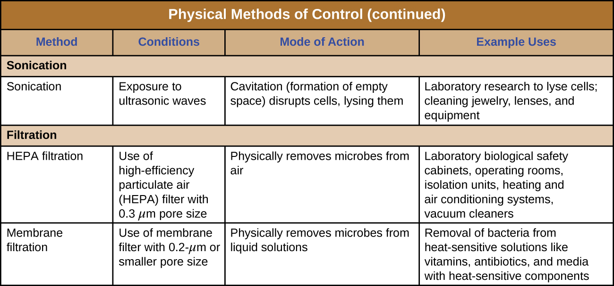

### Learning Objectives

* Understand and compare various physical methods of controlling microbial growth, including heating, refrigeration, freezing, high-pressure treatment, desiccation, lyophilization, irradiation, and filtration

For thousands of years, humans have used various physical methods of microbial control for **food preservation**{: data-type="term" .no-emphasis}. Common control methods include the application of high temperatures, radiation, filtration, and desiccation (drying), among others. Many of these methods nonspecifically kill cells by disrupting membranes, changing membrane permeability, or damaging proteins and nucleic acids by denaturation, degradation, or chemical modification. Various physical methods used for microbial control are described in this section.

### Heat

Heating is one of the most common—and oldest—forms of microbial control. It is used in simple techniques like cooking and **canning**{: data-type="term" .no-emphasis}. Heat can kill microbes by altering their membranes and denaturing proteins. The **thermal death point (TDP)**{: data-type="term"} of a microorganism is the lowest temperature at which all microbes are killed in a 10-minute exposure. Different microorganisms will respond differently to high temperatures, with some (e.g., endospore-formers such as *C. botulinum*) being more heat tolerant. A similar parameter, the **thermal death time (TDT)**{: data-type="term"}, is the length of time needed to kill all microorganisms in a sample at a given temperature. These parameters are often used to describe sterilization procedures that use high heat, such as **autoclaving**{: data-type="term" .no-emphasis}. Boiling is one of the oldest methods of moist-heat control of microbes, and it is typically quite effective at killing vegetative cells and some viruses. However, **boiling**{: data-type="term" .no-emphasis} is less effective at killing endospores; some endospores are able to survive up to 20 hours of boiling. Additionally, boiling may be less effective at higher altitudes, where the boiling point of water is lower and the boiling time needed to kill microbes is therefore longer. For these reasons, boiling is not considered a useful sterilization technique in the laboratory or clinical setting.

Many different heating protocols can be used for sterilization in the laboratory or clinic, and these protocols can be broken down into two main categories: **dry-heat sterilization**{: data-type="term"} and **moist-heat sterilization**{: data-type="term"}. Aseptic technique in the laboratory typically involves some dry-heat sterilization protocols using direct application of high heat, such as sterilizing inoculating loops ([\[link\]](#OSC_Microbio_13_02_LoopFlame)). Incineration at very high temperatures destroys all microorganisms. Dry heat can also be applied for relatively long periods of time (at least 2 hours) at temperatures up to 170 °C by using a dry-heat sterilizer, such as an oven. However, moist-heat sterilization is typically the more effective protocol because it penetrates cells better than dry heat does.

  Sterilizing a loop, often referred to as &#x201C;flaming a loop,&#x201D; is a common component of aseptic technique in the microbiology laboratory and is used to incinerate any microorganisms on the loop. (b) Alternatively, a bactericinerator may be used to reduce aerosolization of microbes and remove the presence of an open flame in the laboratory. These are examples of dry-heat sterilization by the direct application of high heat capable of incineration. (credit a: modification of work by Anh-Hue Tu; credit b: modification of work by Brian Forster)"){: #OSC_Microbio_13_02_LoopFlame}

#### Autoclaves

Autoclaves rely on moist-heat sterilization. They are used to raise temperatures above the boiling point of water to sterilize items such as surgical equipment from vegetative cells, viruses, and especially endospores, which are known to survive boiling temperatures, without damaging the items. Charles **Chamberland**{: data-type="term" .no-emphasis} (1851–1908) designed the modern **autoclave**{: data-type="term" .no-emphasis} in 1879 while working in the laboratory of Louis **Pasteur**{: data-type="term" .no-emphasis}. The autoclave is still considered the most effective method of sterilization ([\[link\]](#OSC_Microbio_13_02_Autoclave)). Outside laboratory and clinical settings, large industrial autoclaves called **retort**{: data-type="term"}**s** allow for moist-heat sterilization on a large scale.

In general, the air in the chamber of an autoclave is removed and replaced with increasing amounts of steam trapped within the enclosed chamber, resulting in increased interior pressure and temperatures above the boiling point of water. The two main types of autoclaves differ in the way that air is removed from the chamber. In **gravity displacement autoclave**{: data-type="term" .no-emphasis}s, steam is introduced into the chamber from the top or sides. Air, which is heavier than steam, sinks to the bottom of the chamber, where it is forced out through a vent. Complete displacement of air is difficult, especially in larger loads, so longer cycles may be required for such loads. In **prevacuum sterilizer**{: data-type="term" .no-emphasis}s, air is removed completely using a high-speed vacuum before introducing steam into the chamber. Because air is more completely eliminated, the steam can more easily penetrate wrapped items. Many autoclaves are capable of both gravity and prevacuum cycles, using the former for the decontamination of waste and sterilization of media and unwrapped glassware, and the latter for sterilization of packaged instruments.

  An autoclave is commonly used for sterilization in the laboratory and in clinical settings. By displacing the air in the chamber with increasing amounts of steam, pressure increases, and temperatures exceeding 100 &#xB0;C can be achieved, allowing for complete sterilization. (b) A researcher programs an autoclave to sterilize a sample. (credit a: modification of work by Courtney Harrington; credit b: modification of work by Lackemeyer MG, Kok-Mercado Fd, Wada J, Bollinger L, Kindrachuk J, Wahl-Jensen V, Kuhn JH, Jahrling PB)"){: #OSC_Microbio_13_02_Autoclave}

Standard operating temperatures for autoclaves are 121 °C or, in some cases, 132 °C, typically at a pressure of 15 to 20 pounds per square inch (psi). The length of exposure depends on the volume and nature of material being sterilized, but it is typically 20 minutes or more, with larger volumes requiring longer exposure times to ensure sufficient heat transfer to the materials being sterilized. The steam must directly contact the liquids or dry materials being sterilized, so containers are left loosely closed and instruments are loosely wrapped in paper or foil. The key to autoclaving is that the temperature must be high enough to kill endospores to achieve complete sterilization.

Because sterilization is so important to safe medical and laboratory protocols, quality control is essential. Autoclaves may be equipped with recorders to document the pressures and temperatures achieved during each run. Additionally, internal indicators of various types should be autoclaved along with the materials to be sterilized to ensure that the proper sterilization temperature has been reached ([\[link\]](#OSC_Microbio_13_02_ACTests)). One common type of indicator is the use of heat-sensitive **autoclave tape**{: data-type="term" .no-emphasis}, which has white stripes that turn black when the appropriate temperature is achieved during a successful autoclave run. This type of indicator is relatively inexpensive and can be used during every run. However, autoclave tape provides no indication of length of exposure, so it cannot be used as an indicator of sterility. Another type of indicator, a biological indicator spore test, uses either a strip of paper or a liquid suspension of the endospores of ***Geobacillus stearothermophilus***{: data-type="term" .no-emphasis} to determine whether the endospores are killed by the process. The endospores of the obligate thermophilic bacterium *G.* *stearothermophilus* are the gold standard used for this purpose because of their extreme heat resistance. Biological spore indicators can also be used to test the effectiveness of other sterilization protocols, including ethylene oxide, dry heat, formaldehyde, gamma radiation, and hydrogen peroxide plasma sterilization using either *G*. *stearothermophilus*, *Bacillus atrophaeus, B. subtilis,* or *B. pumilus* spores. In the case of validating autoclave function, the endospores are incubated after autoclaving to ensure no viable endospores remain. Bacterial growth subsequent to endospore germination can be monitored by **biological indicator spore tests**{: data-type="term" .no-emphasis} that detect acid metabolites or fluorescence produced by enzymes derived from viable *G.* *stearothermophilus*. A third type of autoclave indicator is the **Diack tube**{: data-type="term" .no-emphasis}, a glass ampule containing a temperature-sensitive pellet that melts at the proper sterilization temperature. Spore strips or Diack tubes are used periodically to ensure the autoclave is functioning properly.

  turn dark during a successful autoclave run (right tube). (credit: modification of work by Brian Forster)"){: #OSC_Microbio_13_02_ACTests}

#### Pasteurization

Although complete sterilization is ideal for many medical applications, it is not always practical for other applications and may also alter the quality of the product. Boiling and autoclaving are not ideal ways to control microbial growth in many foods because these methods may ruin the consistency and other organoleptic (sensory) qualities of the food. Pasteurization is a form of microbial control for food that uses heat but does not render the food sterile. Traditional **pasteurization**{: data-type="term"} kills pathogens and reduces the number of spoilage-causing microbes while maintaining food quality. The process of pasteurization was first developed by Louis **Pasteur**{: data-type="term" .no-emphasis} in the 1860s as a method for preventing the spoilage of beer and wine. Today, pasteurization is most commonly used to kill heat-sensitive pathogens in milk and other food products (e.g., apple juice and honey) ([\[link\]](#OSC_Microbio_13_02_Pasteurize)). However, because pasteurized food products are not sterile, they will eventually spoil.

The methods used for milk pasteurization balance the temperature and the length of time of treatment. One method, **high-temperature short-time (HTST) pasteurization**{: data-type="term"}, exposes milk to a temperature of 72 °C for 15 seconds, which lowers bacterial numbers while preserving the quality of the milk. An alternative is **ultra-high-temperature (UHT) pasteurization**{: data-type="term"}, in which the milk is exposed to a temperature of 138 °C for 2 or more seconds. UHT pasteurized milk can be stored for a long time in sealed containers without being refrigerated; however, the very high temperatures alter the proteins in the milk, causing slight changes in the taste and smell. Still, this method of pasteurization is advantageous in regions where access to refrigeration is limited.

 ![Pasteurization shows an image of a large machine. To the left is HTST pasteurization where milk is heated at 72 degrees C for 15 seconds, then boiled and refrigerated. To the right is UHT pasteurization where milk is heated at 138 degrees C for 2 or more seconds, then sealed in airtight containers for up to 90 days without refrigeration. To the bottom is the following test: milkborne organisms killed by pasteurization: Campylobacter jejuni, Coxiella burnetii, Listeria monocytogenes, Escherichia coli O157:H7, Mycobacterium tuberculosis, M. paratuberculosis, Salmonella spp., Yersinia enterocolitica.](../resources/OSC_Microbio_13_02_Pasteurize.jpg "Two different methods of pasteurization, HTST and UHT, are commonly used to kill pathogens associated with milk spoilage. (credit left: modification of work by Mark Hillary; credit right: modification of work by Kerry Ceszyk)"){: #OSC_Microbio_13_02_Pasteurize}

* In an autoclave, how are temperatures above boiling achieved?
* How would the onset of spoilage compare between HTST-pasteurized and UHT-pasteurized milk?
* Why is boiling not used as a sterilization method in a clinical setting?
{: data-bullet-style="bullet"}

### Refrigeration and Freezing

Just as high temperatures are effective for controlling microbial growth, exposing microbes to low temperatures can also be an easy and effective method of microbial control, with the exception of **psychrophiles**{: data-type="term" .no-emphasis}, which prefer cold temperatures (see [Temperature and Microbial Growth](/m58831){: .target-chapter}). Refrigerators used in home kitchens or in the laboratory maintain temperatures between 0 °C and 7 °C. This temperature range inhibits microbial metabolism, slowing the growth of microorganisms significantly and helping preserve refrigerated products such as foods or medical supplies. Certain types of laboratory cultures can be preserved by **refrigeration**{: data-type="term" .no-emphasis} for later use.

Freezing below −2 °C may stop microbial growth and even kill susceptible organisms. According to the US Department of Agriculture (USDA), the only safe ways that frozen foods can be thawed are in the refrigerator, immersed in cold water changed every 30 minutes, or in the microwave, keeping the food at temperatures not conducive for bacterial growth.[1](#footnote1){: data-type="footnote-link"} In addition, halted bacterial growth can restart in thawed foods, so thawed foods should be treated like fresh perishables.

Bacterial cultures and medical specimens requiring long-term storage or transport are often frozen at ultra-low temperatures of −70 °C or lower. These ultra-low temperatures can be achieved by storing specimens on **dry ice**{: data-type="term" .no-emphasis} in an **ultra-low freezer**{: data-type="term" .no-emphasis} or in special **liquid nitrogen**{: data-type="term" .no-emphasis} tanks, which maintain temperatures lower than −196 °C ([\[link\]](#OSC_Microbio_13_02_Ultralow)).

  An ultra-low freezer maintains temperatures at or below &#x2212;70 &#xB0;C. (b) Even lower temperatures can be achieved through freezing and storage in liquid nitrogen. (credit a: modification of work by &#x201C;Expert Infantry&#x201D;/Flickr; credit b: modification of work by USDA)"){: #OSC_Microbio_13_02_Ultralow}

* Does placing food in a refrigerator kill bacteria on the food?
{: data-bullet-style="bullet"}

### Pressure

Exposure to high pressure kills many microbes. In the food industry, **high-pressure processing**{: data-type="term" .no-emphasis} (also called **pascalization**{: data-type="term" .no-emphasis}) is used to kill bacteria, yeast, molds, parasites, and viruses in foods while maintaining food quality and extending shelf life. The application of high pressure between 100 and 800 MPa (sea level atmospheric pressure is about 0.1 MPa) is sufficient to kill vegetative cells by protein denaturation, but endospores may survive these pressures.[2](#footnote2){: data-type="footnote-link"}[3](#footnote3){: data-type="footnote-link"}

In clinical settings, **hyperbaric oxygen therapy**{: data-type="term" .no-emphasis} is sometimes used to treat infections. In this form of therapy, a patient breathes pure oxygen at a pressure higher than normal atmospheric pressure, typically between 1 and 3 atmospheres (atm). This is achieved by placing the patient in a hyperbaric chamber or by supplying the pressurized oxygen through a breathing tube. Hyperbaric oxygen therapy helps increase oxygen saturation in tissues that become hypoxic due to infection and inflammation. This increased oxygen concentration enhances the body’s immune response by increasing the activities of neutrophils and macrophages, white blood cells that fight infections. Increased oxygen levels also contribute to the formation of toxic free radicals that inhibit the growth of oxygen-sensitive or anaerobic bacteria like as ***Clostridium perfringens***{: data-type="term" .no-emphasis}, a common cause of **gas gangrene**{: data-type="term" .no-emphasis}. In *C.* *perfringens* infections, hyperbaric oxygen therapy can also reduce secretion of a bacterial toxin that causes tissue destruction. Hyperbaric oxygen therapy also seems to enhance the effectiveness of antibiotic treatments. Unfortunately, some rare risks include oxygen toxicity and effects on delicate tissues, such as the eyes, middle ear, and lungs, which may be damaged by the increased air pressure.

High pressure processing is not commonly used for disinfection or sterilization of fomites. Although the application of pressure and steam in an autoclave is effective for killing endospores, it is the high temperature achieved, and not the pressure directly, that results in endospore death.

A Streak of Bad Potluck

One Monday in spring 2015, an Ohio woman began to experience blurred, double vision; difficulty swallowing; and drooping eyelids. She was rushed to the emergency department of her local hospital. During the examination, she began to experience abdominal cramping, nausea, paralysis, dry mouth, weakness of facial muscles, and difficulty speaking and breathing. Based on these symptoms, the hospital’s incident command center was activated, and Ohio public health officials were notified of a possible case of botulism. Meanwhile, other patients with similar symptoms began showing up at other local hospitals. Because of the suspicion of botulism, antitoxin was shipped overnight from the CDC to these medical facilities, to be administered to the affected patients. The first patient died of respiratory failure as a result of paralysis, and about half of the remaining victims required additional hospitalization following antitoxin administration, with at least two requiring ventilators for breathing.

Public health officials investigated each of the cases and determined that all of the patients had attended the same church potluck the day before. Moreover, they traced the source of the outbreak to a potato salad made with home-canned potatoes. More than likely, the potatoes were canned using boiling water, a method that allows endospores of *Clostridium botulinum* to survive. *C. botulinum* produces botulinum toxin, a neurotoxin that is often deadly once ingested. According to the CDC, the Ohio case was the largest botulism outbreak in the United States in nearly 40 years.[4](#footnote4){: data-type="footnote-link"}

Killing *C. botulinum* endospores requires a minimum temperature of 116 °C (240 °F), well above the boiling point of water. This temperature can only be reached in a pressure canner, which is recommended for home canning of low-acid foods such as meat, fish, poultry, and vegetables ([\[link\]](#OSC_Microbio_13_02_HomeCan)). Additionally, the CDC recommends boiling home-canned foods for about 10 minutes before consumption. Since the botulinum toxin is heat labile (meaning that it is denatured by heat), 10 minutes of boiling will render nonfunctional any botulinum toxin that the food may contain.

 Clostridium botulinum is the causative agent of botulism. (b) A pressure canner is recommended for home canning because endospores of C. botulinum can survive temperatures above the boiling point of water. (credit a: modification of work by Centers for Disease Control and Prevention; credit b: modification of work by National Center for Home Food Preservation)"){: #OSC_Microbio_13_02_HomeCan}

  
To [learn more][1] about proper home-canning techniques, visit the CDC’s website.

### Desiccation

Drying, also known as **desiccation**{: data-type="term"} or dehydration, is a method that has been used for millennia to preserve foods such as raisins, prunes, and jerky. It works because all cells, including microbes, require water for their metabolism and survival. Although drying controls microbial growth, it might not kill all microbes or their endospores, which may start to regrow when conditions are more favorable and water content is restored.

In some cases, foods are dried in the sun, relying on evaporation to achieve desiccation. Freeze-drying, or **lyophilization**{: data-type="term"}, is another method of dessication in which an item is rapidly frozen (“snap-frozen”) and placed under vacuum so that water is lost by sublimation. Lyophilization combines both exposure to cold temperatures and desiccation, making it quite effective for controlling microbial growth. In addition, lyophilization causes less damage to an item than conventional desiccation and better preserves the item’s original qualities. Lyophilized items may be stored at room temperature if packaged appropriately to prevent moisture acquisition. Lyophilization is used for preservation in the food industry and is also used in the laboratory for the long-term storage and transportation of microbial cultures.

The water content of foods and materials, called the **water activity**{: data-type="term"}, can be lowered without physical drying by the addition of solutes such as salts or sugars. At very high concentrations of salts or sugars, the amount of available water in microbial cells is reduced dramatically because water will be drawn from an area of low solute concentration (inside the cell) to an area of high solute concentration (outside the cell) ([\[link\]](#OSC_Microbio_13_02_Dessicated)). Many microorganisms do not survive these conditions of high osmotic pressure. Honey, for example, is 80% sucrose, an environment in which very few microorganisms are capable of growing, thereby eliminating the need for refrigeration. Salted meats and fish, like ham and cod, respectively, were critically important foods before the age of **refrigeration**{: data-type="term" .no-emphasis}. Fruits were preserved by adding sugar, making jams and jellies. However, certain microbes, such as molds and yeasts, tend to be more tolerant of desiccation and high osmotic pressures, and, thus, may still contaminate these types of foods.

  The addition of a solute creates a hypertonic environment, drawing water out of cells. (b) Some foods can be dried directly, like raisins and jerky. Other foods are dried with the addition of salt, as in the case of salted fish, or sugar, as in the case of jam. (credit a: modification of work by &#x201C;Bruce Blaus&#x201D;/Wikimedia Commons; credit raisins: modification of work by Christian Schnettelker; credit jerky: modification of work by Larry Jacobsen; credit salted fish: modification of work by &#x201C;The Photographer&#x201D;/Wikimedia Commons; credit jam: modification of work by Kim Becker)"){: #OSC_Microbio_13_02_Dessicated}

* How does the addition of salt or sugar to food affect its water activity?
{: data-bullet-style="bullet"}

### Radiation

Radiation in various forms, from high-energy radiation to sunlight, can be used to kill microbes or inhibit their growth. **Ionizing radiation** includes X-rays, gamma rays, and high-energy electron beams. Ionizing **radiation**{: data-type="term" .no-emphasis} is strong enough to pass into the cell, where it alters molecular structures and damages cell components. For example, **ionizing radiation**{: data-type="term" .no-emphasis} introduces double-strand breaks in DNA molecules. This may directly cause DNA mutations to occur, or mutations may be introduced when the cell attempts to repair the DNA damage. As these mutations accumulate, they eventually lead to cell death.

Both **X-rays**{: data-type="term" .no-emphasis} and **gamma rays**{: data-type="term" .no-emphasis} easily penetrate paper and plastic and can therefore be used to sterilize many packaged materials. In the laboratory, ionizing radiation is commonly used to sterilize materials that cannot be autoclaved, such as plastic Petri dishes and disposable plastic inoculating loops. For clinical use, ionizing radiation is used to sterilize gloves, intravenous tubing, and other latex and plastic items used for patient care. Ionizing radiation is also used for the sterilization of other types of delicate, heat-sensitive materials used clinically, including tissues for transplantation, pharmaceutical drugs, and medical equipment.

In Europe, **gamma irradiation**{: data-type="term" .no-emphasis} for **food preservation**{: data-type="term" .no-emphasis} is widely used, although it has been slow to catch on in the United States (see the [Micro Connections](#fs-id1167585073785) box on this topic). Packaged dried spices are also often gamma-irradiated. Because of their ability to penetrate paper, plastic, thin sheets of wood and metal, and tissue, great care must be taken when using X-rays and gamma irradiation. These types of ionizing irradiation cannot penetrate thick layers of iron or lead, so these metals are commonly used to protect humans who may be potentially exposed.

Another type of radiation, **nonionizing radiation**{: data-type="term"}, is commonly used for disinfection and uses less energy than ionizing radiation. It does not penetrate cells or packaging. Ultraviolet (UV) light is one example; it causes **thymine dimer**{: data-type="term" .no-emphasis}s to form between adjacent thymines within a single strand of DNA ([\[link\]](#OSC_Microbio_13_02_UV)). When DNA polymerase encounters the thymine dimer, it does not always incorporate the appropriate complementary nucleotides (two adenines), and this leads to formation of mutations that can ultimately kill microorganisms.

UV light can be used effectively by both consumers and laboratory personnel to control microbial growth. UV lamps are now commonly incorporated into **water purification**{: data-type="term" .no-emphasis} systems for use in homes. In addition, small portable UV lights are commonly used by campers to purify water from natural environments before drinking. Germicidal lamps are also used in surgical suites, **biological safety cabinet**{: data-type="term" .no-emphasis}s, and transfer hoods, typically emitting UV light at a wavelength of 260 nm. Because **UV light**{: data-type="term" .no-emphasis} does not penetrate surfaces and will not pass through plastics or glass, cells must be exposed directly to the light source.

Sunlight has a very broad spectrum that includes UV and visible light. In some cases, sunlight can be effective against certain bacteria because of both the formation of thymine dimers by UV light and by the production of reactive oxygen products induced in low amounts by exposure to visible light.

  UV radiation causes the formation of thymine dimers in DNA, leading to lethal mutations in the exposed microbes. (b) Germicidal lamps that emit UV light are commonly used in the laboratory to disinfect equipment."){: #OSC_Microbio_13_02_UV}

* What are two advantages of ionizing radiation as a sterilization method?
* How does the effectiveness of ionizing radiation compare with that of nonionizing radiation?
{: data-bullet-style="bullet"}

Irradiated Food: Would You Eat That?

Of all the ways to prevent food spoilage and foodborne illness, gamma irradiation may be the most unappetizing. Although gamma irradiation is a proven method of eliminating potentially harmful microbes from food, the public has yet to buy in. Most of their concerns, however, stem from misinformation and a poor understanding of the basic principles of radiation.

The most common method of irradiation is to expose food to cobalt-60 or cesium-137 by passing it through a radiation chamber on a conveyor belt. The food does not directly contact the radioactive material and does not become radioactive itself. Thus, there is no risk for exposure to radioactive material through eating gamma-irradiated foods. Additionally, irradiated foods are not significantly altered in terms of nutritional quality, aside from the loss of certain vitamins, which is also exacerbated by extended storage. Alterations in taste or smell may occur in irradiated foods with high fat content, such as fatty meats and dairy products, but this effect can be minimized by using lower doses of radiation at colder temperatures.

In the United States, the CDC, Environmental Protection Agency (EPA), and the Food and Drug Administration (FDA) have deemed irradiation safe and effective for various types of meats, poultry, shellfish, fresh fruits and vegetables, eggs with shells, and spices and seasonings. Gamma irradiation of foods has also been approved for use in many other countries, including France, the Netherlands, Portugal, Israel, Russia, China, Thailand, Belgium, Australia, and South Africa. To help ameliorate consumer concern and assist with education efforts, irradiated foods are now clearly labeled and marked with the international irradiation symbol, called the “radura” ([\[link\]](#OSC_Microbio_13_02_Gammafood)). Consumer acceptance seems to be rising, as indicated by several recent studies.[5](#footnote5){: data-type="footnote-link"}

 Foods are exposed to gamma radiation by passage on a conveyor belt through a radiation chamber. (b) Gamma-irradiated foods must be clearly labeled and display the irradiation symbol, known as the &#x201C;radura.&#x201D; (credit a, b: modification of work by U.S. Department of Agriculture)"){: #OSC_Microbio_13_02_Gammafood}

### Sonication

The use of high-frequency ultrasound waves to disrupt cell structures is called **sonication**{: data-type="term"}. Application of ultrasound waves causes rapid changes in pressure within the intracellular liquid; this leads to **cavitation**{: data-type="term" .no-emphasis}, the formation of bubbles inside the cell, which can disrupt cell structures and eventually cause the cell to lyse or collapse. Sonication is useful in the laboratory for efficiently lysing cells to release their contents for further research; outside the laboratory, sonication is used for cleaning surgical instruments, lenses, and a variety of other objects such as coins, tools, and musical instruments.

### Filtration

Filtration is a method of physically separating microbes from samples. Air is commonly filtered through **high-efficiency particulate air (HEPA) filter**{: data-type="term"}s ([\[link\]](#OSC_Microbio_13_02_HEPA)). HEPA filters have effective pore sizes of 0.3 µm, small enough to capture bacterial cells, endospores, and many viruses, as air passes through these filters, nearly sterilizing the air on the other side of the filter. HEPA filters have a variety of applications and are used widely in clinical settings, in cars and airplanes, and even in the home. For example, they may be found in vacuum cleaners, heating and air-conditioning systems, and air purifiers.

  HEPA filters like this one remove microbes, endospores, and viruses as air flows through them. (b) A schematic of a HEPA filter. (credit a: modification of work by CSIRO; credit b: modification of work by &#x201C;LadyofHats&#x201D;/Mariana Ruiz Villareal)"){: #OSC_Microbio_13_02_HEPA}

#### Biological Safety Cabinets

Biological safety cabinets are a good example of the use of HEPA filters. HEPA filters in **biological safety cabinet**{: data-type="term" .no-emphasis}s (BSCs) are used to remove particulates in the air either entering the cabinet (air intake), leaving the cabinet (air exhaust), or treating both the intake and exhaust. Use of an air-intake HEPA filter prevents environmental contaminants from entering the BSC, creating a clean area for handling biological materials. Use of an air-exhaust HEPA filter prevents laboratory pathogens from contaminating the laboratory, thus maintaining a safe work area for laboratory personnel.

There are three classes of BSCs: I, II, and III. Each class is designed to provide a different level of protection for laboratory personnel and the environment; BSC II and III are also designed to protect the materials or devices in the cabinet. [\[link\]](#fs-id1167581501606) summarizes the level of safety provided by each class of BSC for each BSL.

<table summary="A table titled biological risks and BSC&#x2019;s; 5 columsn. Biological risk assessed, bsc class, protection of personnel, protection of environment, protection of product. BSL-1, 2 and 3; BSC class I &#x2013; requires protection of personnel and environment but not product. BSL-1, 2, and 3 require protection of all 3. SBL-4, III, II wen used in suite room with suit requires protection of all 3 personnel, environment and product." class="span-all"><thead>
<tr>
<th colspan="5" data-align="center">Biological Risks and BSCs</th>
</tr>
<tr valign="top">
<th data-valign="top" data-align="left">Biological Risk Assessed</th>
<th data-valign="top" data-align="left">BSC Class</th>
<th data-valign="top" data-align="left">Protection of Personnel</th>
<th data-valign="top" data-align="left">Protection of Environment</th>
<th data-valign="top" data-align="left">Protection of Product</th>
</tr>
</thead><tbody>
<tr valign="top">
<td data-valign="top" data-align="left">BSL-1, BSL-2, BSL-3</td>
<td data-valign="top" data-align="left">I</td>
<td data-valign="top" data-align="left">Yes</td>
<td data-valign="top" data-align="left">Yes</td>
<td data-valign="top" data-align="left">No</td>
</tr>
<tr valign="top">
<td data-valign="top" data-align="left">BSL-1, BSL-2, BSL-3</td>
<td data-valign="top" data-align="left">II</td>
<td data-valign="top" data-align="left">Yes</td>
<td data-valign="top" data-align="left">Yes</td>
<td data-valign="top" data-align="left">Yes</td>
</tr>
<tr valign="top">
<td data-valign="top" data-align="left">BSL-4</td>
<td data-valign="top" data-align="left">III; II when used in suit room with suit</td>
<td data-valign="top" data-align="left">Yes</td>
<td data-valign="top" data-align="left">Yes</td>
<td data-valign="top" data-align="left">Yes</td>
</tr>
</tbody></table>

Class I BSCs protect laboratory workers and the environment from a low to moderate risk for exposure to biological agents used in the laboratory. Air is drawn into the cabinet and then filtered before exiting through the building’s exhaust system. Class II BSCs use directional air flow and partial barrier systems to contain infectious agents. Class III BSCs are designed for working with highly infectious agents like those used in **BSL-4**{: data-type="term" .no-emphasis} laboratories. They are gas tight, and materials entering or exiting the cabinet must be passed through a double-door system, allowing the intervening space to be decontaminated between uses. All air is passed through one or two HEPA filters and an air incineration system before being exhausted directly to the outdoors (not through the building’s exhaust system). Personnel can manipulate materials inside the Class III cabinet by using long rubber gloves sealed to the cabinet.

  
This [video][2] shows how BSCs are designed and explains how they protect personnel, the environment, and the product.

#### Filtration in Hospitals

HEPA filters are also commonly used in hospitals and surgical suites to prevent contamination and the spread of airborne microbes through ventilation systems. HEPA filtration systems may be designed for entire buildings or for individual rooms. For example, burn units, operating rooms, or isolation units may require special HEPA-filtration systems to remove opportunistic pathogens from the environment because patients in these rooms are particularly vulnerable to infection.

#### Membrane Filters

Filtration can also be used to remove microbes from liquid samples using **membrane filtration**{: data-type="term"}. Membrane filters for liquids function similarly to HEPA filters for air. Typically, membrane filters that are used to remove bacteria have an effective pore size of 0.2 µm, smaller than the average size of a bacterium (1 µm), but filters with smaller pore sizes are available for more specific needs. Membrane filtration is useful for removing bacteria from various types of heat-sensitive solutions used in the laboratory, such as antibiotic solutions and vitamin solutions. Large volumes of culture media may also be filter sterilized rather than autoclaved to protect heat-sensitive components. Often when filtering small volumes, **syringe filter**{: data-type="term" .no-emphasis}s are used, but **vacuum filter**{: data-type="term" .no-emphasis}s are typically used for filtering larger volumes ([\[link\]](#OSC_Microbio_13_02_MembFilter)).

  Larger volumes are filtered in units like these. The solution is drawn through the filter by connecting the unit to a vacuum. (b) Smaller volumes are often filtered using syringe filters, which are units that fit on the end of a syringe. In this case, the solution is pushed through by depressing the syringe&#x2019;s plunger. (credit a, b: modification of work by Brian Forster)"){: #OSC_Microbio_13_02_MembFilter}

* Would membrane filtration with a 0.2-µm filter likely remove viruses from a solution? Explain.
* Name at least two common uses of HEPA filtration in clinical or laboratory settings.
{: data-bullet-style="bullet"}

[\[link\]](#OSC_Microbio_13_02_PMCTable_A) and [\[link\]](#OSC_Microbio_13_02_PMCTable_B) summarize the physical methods of control discussed in this section.

 ![A table titled physical methods of control; 4 columns &#x2013; method, conditions, mode of action, and examples of use. Groupings are: heat, cold, pressure, desiccation, radiation, sonication, and filtration. Heat. Boiling, 100 &#xB0;C at sea level, Denatures proteins and alters membranes; usese Cooking, personal use, preparing certain laboratory media. Dry-heat oven, 170 &#xB0;C for 2 hours, Denatures proteins and alters membranes, dehydration, desiccation; uses Sterilization of heat-stable medical and laboratory equipment and glassware. Incineration, Exposure to flame,Destroy by burning, Flaming loop, microincinerator. Autoclave, Typical settings: 121 &#xB0;C for 15&#x2013;40 minutes at 15 psi, Denatures proteins and alters membranes, Sterilization of microbiological media, heat-stable medical and laboratory equipment, and other heat-stable items. Pasteurization, 72 &#xB0;C for 15 seconds (HTST) or 138 &#xB0;C for &#x2265; 2 seconds (UHT), Denatures proteins and alters membranes, Prevents spoilage of milk, apple juice, honey, and other ingestible liquids. Cold. Refrigeration, 0 &#xB0;C to 7 &#xB0;C, Inhibits metabolism (slows or arrests cell division), Preservation of food or laboratory materials (solutions, cultures). Freezing, Below &#x2212;2 &#xB0;C, Stops metabolism, may kill microbes, Long-term storage of food, laboratory cultures, or medical specimens. Pressure. High-pressure processing, Exposure to pressures of 100&#x2013;800 MPa, Denatures proteins and can cause cell lysis Preservation of food, Hyberbaric oxygen therapy. Inhalation of pure oxygen at a pressure of 1&#x2013;3 atm, Inhibits metabolism and growth of anaerobic microbes, Treatment of certain infections (e.g., gas gangrene). Dessication. Simple desiccation, Drying, Inhibits metabolism, Dried fruits, jerky. Reduce water activity, Addition of salt or water Inhibits metabolism and can cause lysis, Salted meats and fish, honey, jams and jellies. Lyophilization, Rapid freezing under vacuum, Inhibits metabolism Preservation of food, laboratory cultures, or reagents. Radiation. Ionizing radiation, Exposure to X-rays or gamma rays, Alters molecular structures, introduces double-strand breaks into DNA, Sterilization of spices and heat-sensitive laboratory and medical items; used for food sterilization in Europe but not widely accepted in US. Nonionizing radiation, Exposure to ultraviolet light, Introduces thymine dimers, leading to mutations, Surface sterilization of laboratory materials, water purification. Sonication, Exposure to ultrasonic waves, Cavitation (formation of empty space) disrupts cells, lysing them, Laboratory research to lyse cells; cleaning jewelry, lenses, and equipment. Filtration. HEPA filtration, Use of HEPA filter with 0.3-&#xB5;m pore size Physically removes microbes from air, Laboratory biological safety cabinets, operating rooms, isolation units, heating and air conditioning systems, vacuum cleaners. Membrane filtration Use of membrane filter with 0.2-&#xB5;m or smaller pore size, Physically removes microbes from liquid solutions, Removal of bacteria from heat-sensitive solutions like vitamins, antibiotics, and media with heat-sensitive components. ](../resources/OSC_Microbio_13_02_PMCTable_A.jpg){: #OSC_Microbio_13_02_PMCTable_A}

{: #OSC_Microbio_13_02_PMCTable_B}

### Key Concepts and Summary

* Heat is a widely used and highly effective method for controlling microbial growth.
* **Dry-heat sterilization** protocols are used commonly in aseptic techniques in the laboratory. However, **moist-heat sterilization** is typically the more effective protocol because it penetrates cells better than dry heat does.
* **Pasteurization** is used to kill pathogens and reduce the number of microbes that cause food spoilage. **High-temperature, short-time pasteurization** is commonly used to pasteurize milk that will be refrigerated; **ultra-high temperature pasteurization** can be used to pasteurize milk for long-term storage without refrigeration.
* Refrigeration slows microbial growth; freezing stops growth, killing some organisms. Laboratory and medical specimens may be frozen on dry ice or at ultra-low temperatures for storage and transport.
* High-pressure processing can be used to kill microbes in food. Hyperbaric oxygen therapy to increase oxygen saturation has also been used to treat certain infections.
* **Desiccation** has long been used to preserve foods and is accelerated through the addition of salt or sugar, which decrease water activity in foods.
* **Lyophilization** combines cold exposure and desiccation for the long-term storage of foods and laboratory materials, but microbes remain and can be rehydrated.
* **Ionizing radiation**, including gamma irradiation, is an effective way to sterilize heat-sensitive and packaged materials. **Nonionizing radiation**, like ultraviolet light, is unable to penetrate surfaces but is useful for surface sterilization.
* **HEPA** filtration is commonly used in hospital ventilation systems and biological safety cabinets in laboratories to prevent transmission of airborne microbes. **Membrane filtration** is commonly used to remove bacteria from heat-sensitive solutions.
{: data-bullet-style="bullet"}

### Multiple Choice

Which of the following methods brings about cell lysis due to cavitation induced by rapid localized pressure changes?

1.  microwaving
2.  gamma irradiation
3.  ultraviolet radiation
4.  sonication
{: type="A"}

D

Which of the following terms is used to describe the time required to kill all of the microbes within a sample at a given temperature?

1.  D-value
2.  thermal death point
3.  thermal death time
4.  decimal reduction time
{: type="A"}

C

Which of the following microbial control methods does not actually kill microbes or inhibit their growth but instead removes them physically from samples?

1.  filtration
2.  desiccation
3.  lyophilization
4.  nonionizing radiation
{: type="A"}

A

### Fill in the Blank

In an autoclave, the application of pressure to \_\_\_\_\_\_\_\_ is increased to allow the steam to achieve temperatures above the boiling point of water.

steam

### True/False

Ionizing radiation can penetrate surfaces, but nonionizing radiation cannot.

True

Moist-heat sterilization protocols require the use of higher temperatures for longer periods of time than do dry-heat sterilization protocols do.

False

### Short Answer

What is the advantage of HTST pasteurization compared with sterilization? What is an advantage of UHT treatment?

How does the addition of salt or sugar help preserve food?

Which is more effective at killing microbes: autoclaving or freezing? Explain.

### Critical Thinking

In 2001, endospores of *Bacillus anthracis*, the causative agent of anthrax, were sent to government officials and news agencies via the mail. In response, the US Postal Service began to irradiate mail with UV light. Was this an effective strategy? Why or why not?

### Footnotes
{: data-type="footnote-refs-title"}

* {: data-type="footnote-ref" #footnote1} [1](#footnote-ref1){: data-type="footnote-ref-link"} US Department of Agriculture. “Freezing and Food Safety.” 2013. http://www.fsis.usda.gov/wps/portal/fsis/topics/food-safety-education/get-answers/food-safety-fact-sheets/safe-food-handling/freezing-and-food-safety/CT\\\_Index. Accessed June 8, 2016.
* {: data-type="footnote-ref" #footnote2} [2](#footnote-ref2){: data-type="footnote-ref-link"} C. Ferstl. “High Pressure Processing: Insights on Technology and Regulatory Requirements.” Food for Thought/White Paper. Series Volume 10. Livermore, CA: The National Food Lab; July 2013.
* {: data-type="footnote-ref" #footnote3} [3](#footnote-ref3){: data-type="footnote-ref-link"} US Food and Drug Administration. “Kinetics of Microbial Inactivation for Alternative Food Processing Technologies: High Pressure Processing.” 2000. http://www.fda.gov/Food/FoodScienceResearch/SafePracticesforFoodProcesses/ucm101456.htm. Accessed July 19, 2106.
* {: data-type="footnote-ref" #footnote4} [4](#footnote-ref4){: data-type="footnote-ref-link"} CL McCarty et al. “Large Outbreak of Botulism Associated with a Church Potluck Meal-Ohio, 2015.” *Morbidity and Mortality Weekly Report* 64, no. 29 (2015):802–803. 
* {: data-type="footnote-ref" #footnote5} [5](#footnote-ref5){: data-type="footnote-ref-link"} AM Johnson et al. “Consumer Acceptance of Electron-Beam Irradiated Ready-to-Eat Poultry Meats.” *Food Processing Preservation*, 28 no. 4 (2004):302–319.
{: data-list-type="bulleted" data-bullet-style="none"}

[1]: https://openstax.org/l/22cdccanathome
[2]: https://openstax.org/l/22BSCsdesvideo
