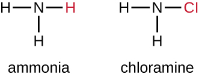
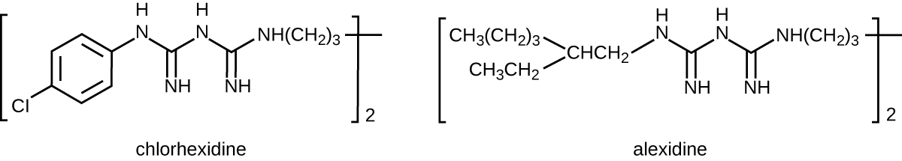

### Learning Objectives

* Understand and compare various chemicals used to control microbial growth, including their uses, advantages and disadvantages, chemical structure, and mode of action

In addition to physical methods of microbial control, chemicals are also used to control microbial growth. A wide variety of chemicals can be used as disinfectants or antiseptics. When choosing which to use, it is important to consider the type of microbe targeted; how clean the item needs to be; the disinfectant’s effect on the item’s integrity; its safety to animals, humans, and the environment; its expense; and its ease of use. This section describes the variety of chemicals used as disinfectants and antiseptics, including their mechanisms of action and common uses.

### Phenolics

In the 1800s, scientists began experimenting with a variety of chemicals for disinfection. In the 1860s, British surgeon Joseph **Lister**{: data-type="term" .no-emphasis} (1827–1912) began using carbolic acid, known as **phenol**{: data-type="term" .no-emphasis}, as a disinfectant for the treatment of surgical wounds (see [Foundations of Modern Cell Theory](/m58791){: .target-chapter}). In 1879, Lister’s work inspired the American chemist Joseph **Lawrence**{: data-type="term" .no-emphasis} (1836–1909) to develop Listerine, an alcohol-based mixture of several related compounds that is still used today as an oral antiseptic. Today, carbolic acid is no longer used as a surgical disinfectant because it is a skin irritant, but the chemical compounds found in antiseptic mouthwashes and throat lozenges are called **phenolics**{: data-type="term"}.

Chemically, phenol consists of a benzene ring with an –OH group, and phenolics are compounds that have this group as part of their chemical structure ([\[link\]](#OSC_Microbio_13_01_Phenolcomp)). Phenolics such as **thymol**{: data-type="term" .no-emphasis} and **eucalyptol**{: data-type="term" .no-emphasis} occur naturally in plants. Other phenolics can be derived from creosote, a component of coal tar. Phenolics tend to be stable, persistent on surfaces, and less toxic than phenol. They inhibit microbial growth by denaturing proteins and disrupting membranes.

  Chemical structure of phenol, also known as carbolic acid. (b) o-Phenylphenol, a type of phenolic, has been used as a disinfectant as well as to control bacterial and fungal growth on harvested citrus fruits. (c) Hexachlorophene, another phenol, known as a bisphenol (two rings), is the active ingredient in pHisoHex."){: #OSC_Microbio_13_01_Phenolcomp}

Since Lister’s time, several **phenolic compounds**{: data-type="term" .no-emphasis} have been used to control microbial growth. Phenolics like **cresols**{: data-type="term" .no-emphasis} (methylated phenols) and **o-phenylphenol**{: data-type="term" .no-emphasis} were active ingredients in various formulations of Lysol since its invention in 1889. o-Phenylphenol was also commonly used in agriculture to control bacterial and fungal growth on harvested crops, especially citrus fruits, but its use in the United States is now far more limited. The bisphenol **hexachlorophene**{: data-type="term" .no-emphasis}, a disinfectant, is the active ingredient in pHisoHex, a topical cleansing detergent widely used for handwashing in hospital settings. pHisoHex is particularly effective against gram-positive bacteria, including those causing staphylococcal and streptococcal skin infections. pHisoHex was formerly used for bathing infants, but this practice has been discontinued because it has been shown that exposure to hexachlorophene can lead to neurological problems.

Triclosan is another bisphenol compound that has seen widespread application in antibacterial products over the last several decades. Initially used in toothpastes, **triclosan**{: data-type="term" .no-emphasis} is now commonly used in hand soaps and is frequently impregnated into a wide variety of other products, including cutting boards, knives, shower curtains, clothing, and concrete, to make them antimicrobial. It is particularly effective against gram-positive bacteria on the skin, as well as certain gram-negative bacteria and yeasts.[1](#footnote1){: data-type="footnote-link"}

Triclosan: Antibacterial Overkill?

Hand soaps and other cleaning products are often marketed as “antibacterial,” suggesting that they provide a level of cleanliness superior to that of conventional soaps and cleansers. But are the antibacterial ingredients in these products really safe and effective?

About 75% of antibacterial liquid hand soaps and 30% of bar soaps contain the chemical triclosan, a phenolic, ([\[link\]](#OSC_Microbio_13_03_Triclosan)).[2](#footnote2){: data-type="footnote-link"} Triclosan blocks an enzyme in the bacterial fatty acid-biosynthesis pathway that is not found in the comparable human pathway. Although the use of triclosan in the home increased dramatically during the 1990s, more than 40 years of research by the FDA have turned up no conclusive evidence that washing with triclosan-containing products provides increased health benefits compared with washing with traditional soap. Although some studies indicate that fewer bacteria may remain on a person’s hands after washing with triclosan-based soap, compared with traditional soap, no evidence points to any reduction in the transmission of bacteria that cause respiratory and gastrointestinal illness. In short, soaps with triclosan may remove or kill a few more germs but not enough to reduce the spread of disease.

Perhaps more disturbing, some clear risks associated with triclosan-based soaps have come to light. The widespread use of triclosan has led to an increase in triclosan-resistant bacterial strains, including those of clinical importance, such as *Salmonella enterica*; this resistance may render triclosan useless as an antibacterial in the long run.[3](#footnote3){: data-type="footnote-link"}[4](#footnote4){: data-type="footnote-link"} Bacteria can easily gain resistance to triclosan through a change to a single gene encoding the targeted enzyme in the bacterial fatty acid-synthesis pathway. Other disinfectants with a less specific mode of action are much less prone to engendering resistance because it would take much more than a single genetic change.

Use of triclosan over the last several decades has also led to a buildup of the chemical in the environment. Triclosan in hand soap is directly introduced into wastewater and sewage systems as a result of the handwashing process. There, its antibacterial properties can inhibit or kill bacteria responsible for the decomposition of sewage, causing septic systems to clog and back up. Eventually, triclosan in wastewater finds its way into surface waters, streams, lakes, sediments, and soils, disrupting natural populations of bacteria that carry out important environmental functions, such as inhibiting algae. Triclosan also finds its way into the bodies of amphibians and fish, where it can act as an endocrine disruptor. Detectable levels of triclosan have also been found in various human bodily fluids, including breast milk, plasma, and urine.[5](#footnote5){: data-type="footnote-link"} In fact, a study conducted by the CDC found detectable levels of triclosan in the urine of 75% of 2,517 people tested in 2003–2004.[6](#footnote6){: data-type="footnote-link"} This finding is even more troubling given the evidence that triclosan may affect immune function in humans.[7](#footnote7){: data-type="footnote-link"}

In December 2013, the FDA gave soap manufacturers until 2016 to prove that antibacterial soaps provide a significant benefit over traditional soaps; if unable to do so, manufacturers will be forced to remove these products from the market.

"){: #OSC_Microbio_13_03_Triclosan}

* Why is triclosan more like an antibiotic than a traditional disinfectant?
{: data-bullet-style="bullet"}

### Heavy Metals

Some of the first chemical disinfectants and antiseptics to be used were **heavy metals**{: data-type="term" .no-emphasis}. Heavy metals kill microbes by binding to proteins, thus inhibiting enzymatic activity ([\[link\]](#OSC_Microbio_13_03_HeavyMetal)). Heavy metals are oligodynamic, meaning that very small concentrations show significant antimicrobial activity. Ions of heavy metals bind to sulfur-containing amino acids strongly and bioaccumulate within cells, allowing these metals to reach high localized concentrations. This causes proteins to denature.

Heavy metals are not selectively toxic to microbial cells. They may bioaccumulate in human or animal cells, as well, and excessive concentrations can have toxic effects on humans. If too much silver accumulates in the body, for example, it can result in a condition called **argyria**{: data-type="term" .no-emphasis}, in which the skin turns irreversibly blue-gray. One way to reduce the potential toxicity of heavy metals is by carefully controlling the duration of exposure and concentration of the heavy metal.

  Copper in fixtures like this door handle kills microbes that otherwise might accumulate on frequently touched surfaces. (b) Eating utensils contain small amounts of silver to inhibit microbial growth. (c) Copper commonly lines incubators to minimize contamination of cell cultures stored inside. (d) Antiseptic mouthwashes commonly contain zinc chloride. (e) This patient is suffering from argyria, an irreversible condition caused by bioaccumulation of silver in the body. (credit b: modification of work by &#x201C;Shoshanah&#x201D;/Flickr; credit e: modification of work by Herbert L. Fred and Hendrik A. van Dijk)"){: #OSC_Microbio_13_03_HeavyMetal}

#### Mercury

Mercury is an example of a heavy metal that has been used for many years to control microbial growth. It was used for many centuries to treat syphilis. Mercury compounds like **mercuric chloride**{: data-type="term" .no-emphasis} are mainly **bacteriostatic**{: data-type="term" .no-emphasis} and have a very broad spectrum of activity. Various forms of **mercury**{: data-type="term" .no-emphasis} bind to sulfur-containing amino acids within proteins, inhibiting their functions.

In recent decades, the use of such compounds has diminished because of mercury’s toxicity. It is toxic to the central nervous, digestive, and renal systems at high concentrations, and has negative environmental effects, including bioaccumulation in fish. Topical antiseptics such as **mercurochrome**{: data-type="term" .no-emphasis}, which contains mercury in low concentrations, and **merthiolate**{: data-type="term" .no-emphasis}, a **tincture**{: data-type="term"} (a solution of mercury dissolved in alcohol) were once commonly used. However, because of concerns about using mercury compounds, these antiseptics are no longer sold in the United States.

#### Silver

Silver has long been used as an antiseptic. In ancient times, drinking water was stored in **silver**{: data-type="term" .no-emphasis} jugs.[8](#footnote8){: data-type="footnote-link"} Silvadene cream is commonly used to treat topical wounds and is particularly helpful in preventing infection in burn wounds. Silver nitrate drops were once routinely applied to the eyes of newborns to protect against **ophthalmia neonatorum**{: data-type="term" .no-emphasis}, eye infections that can occur due to exposure to pathogens in the birth canal, but antibiotic creams are more now commonly used. Silver is often combined with antibiotics, making the antibiotics thousands of times more effective.[9](#footnote9){: data-type="footnote-link"} Silver is also commonly incorporated into catheters and bandages, rendering them antimicrobial; however, there is evidence that heavy metals may also enhance selection for antibiotic resistance.[10](#footnote10){: data-type="footnote-link"}

#### Copper, Nickel, and Zinc

Several other heavy metals also exhibit antimicrobial activity. Copper sulfate is a common **algicide**{: data-type="term" .no-emphasis} used to control algal growth in swimming pools and fish tanks. The use of metallic **copper**{: data-type="term" .no-emphasis} to minimize microbial growth is also becoming more widespread. Copper linings in incubators help reduce contamination of cell cultures. The use of copper pots for water storage in underdeveloped countries is being investigated as a way to combat diarrheal diseases. Copper coatings are also becoming popular for frequently handled objects such as doorknobs, cabinet hardware, and other fixtures in health-care facilities in an attempt to reduce the spread of microbes.

Nickel and zinc coatings are now being used in a similar way. Other forms of zinc, including **zinc chloride**{: data-type="term" .no-emphasis} and **zinc oxide**{: data-type="term" .no-emphasis}, are also used commercially. Zinc chloride is quite safe for humans and is commonly found in mouthwashes, substantially increasing their length of effectiveness. Zinc oxide is found in a variety of products, including topical antiseptic creams such as calamine lotion, diaper ointments, baby powder, and dandruff shampoos.

* Why are many heavy metals both antimicrobial and toxic to humans?
{: data-bullet-style="bullet"}

### Halogens

Other chemicals commonly used for disinfection are the **halogens**{: data-type="term" .no-emphasis} **iodine**{: data-type="term" .no-emphasis}, **chlorine**{: data-type="term" .no-emphasis}, and **fluorine**{: data-type="term" .no-emphasis}. Iodine works by oxidizing cellular components, including sulfur-containing amino acids, nucleotides, and fatty acids, and destabilizing the macromolecules that contain these molecules. It is often used as a topical tincture, but it may cause staining or skin irritation. An **iodophor**{: data-type="term"} is a compound of iodine complexed with an organic molecule, thereby increasing iodine’s stability and, in turn, its efficacy. One common iodophor is **povidone-iodine**{: data-type="term" .no-emphasis}, which includes a wetting agent that releases iodine relatively slowly. Betadine is a brand of povidone-iodine commonly used as a hand scrub by medical personnel before surgery and for topical antisepsis of a patient’s skin before incision ([\[link\]](#OSC_Microbio_13_03_Betadine)).

  Betadine is a solution of the iodophor povidone-iodine. (b) It is commonly used as a topical antiseptic on a patient&#x2019;s skin before incision during surgery. (credit b: modification of work by Andrew Ratto)"){: #OSC_Microbio_13_03_Betadine}

Chlorine is another halogen commonly used for disinfection. When chlorine gas is mixed with water, it produces a strong oxidant called hypochlorous acid, which is uncharged and enters cells easily. Chlorine gas is commonly used in municipal drinking water and wastewater treatment plants, with the resulting hypochlorous acid producing the actual antimicrobial effect. Those working at water treatment facilities need to take great care to minimize personal exposure to chlorine gas. Sodium hypochlorite is the chemical component of common household **bleach**{: data-type="term" .no-emphasis}, and it is also used for a wide variety of disinfecting purposes. Hypochlorite salts, including sodium and calcium hypochlorites, are used to disinfect swimming pools. Chlorine gas, sodium hypochlorite, and calcium hypochlorite are also commonly used disinfectants in the food processing and restaurant industries to reduce the spread of foodborne diseases. Workers in these industries also need to take care to use these products correctly to ensure their own safety as well as the safety of consumers. A recent joint statement published by the Food and Agriculture Organization (FAO) of the United Nations and WHO indicated that none of the many beneficial uses of chlorine products in food processing to reduce the spread of foodborne illness posed risks to consumers.[11](#footnote11){: data-type="footnote-link"}

Another class of chlorinated compounds called **chloramines**{: data-type="term" .no-emphasis} are widely used as disinfectants. Chloramines are relatively stable, releasing chlorine over long periods time. Chloramines are derivatives of ammonia by substitution of one, two, or all three hydrogen atoms with chlorine atoms ([\[link\]](#OSC_Microbio_13_02_chloram)).

 {: #OSC_Microbio_13_02_chloram}

Chloramines and other cholorine compounds may be used for disinfection of drinking water, and chloramine tablets are frequently used by the military for this purpose. After a natural disaster or other event that compromises the public water supply, the CDC recommends disinfecting tap water by adding small amounts of regular household bleach. Recent research suggests that sodium dichloroisocyanurate (NaDCC) may also be a good alternative for drinking water disinfection. Currently, NaDCC tablets are available for general use and for use by the military, campers, or those with emergency needs; for these uses, NaDCC is preferable to chloramine tablets. Chlorine dioxide, a gaseous agent used for fumigation and sterilization of enclosed areas, is also commonly used for the disinfection of water.

Although chlorinated compounds are relatively effective disinfectants, they have their disadvantages. Some may irritate the skin, nose, or eyes of some individuals, and they may not completely eliminate certain hardy organisms from contaminated drinking water. The fungus ***Cryptosporidium***{: data-type="term" .no-emphasis}, for example, has a protective outer shell that makes it resistant to chlorinated disinfectants. Thus, boiling of drinking water in emergency situations is recommended when possible.

The halogen fluorine is also known to have antimicrobial properties that contribute to the prevention of **dental caries**{: data-type="term" .no-emphasis} (cavities).[12](#footnote12){: data-type="footnote-link"} Fluoride is the main active ingredient of toothpaste and is also commonly added to tap water to help communities maintain oral health. Chemically, **fluoride**{: data-type="term" .no-emphasis} can become incorporated into the hydroxyapatite of tooth enamel, making it more resistant to corrosive acids produced by the fermentation of oral microbes. Fluoride also enhances the uptake of calcium and phosphate ions in tooth enamel, promoting remineralization. In addition to strengthening enamel, fluoride also seems to be bacteriostatic. It accumulates in plaque-forming bacteria, interfering with their metabolism and reducing their production of the acids that contribute to tooth decay.

* What is a benefit of a chloramine over hypochlorite for disinfecting?
{: data-bullet-style="bullet"}

### Alcohols

Alcohols make up another group of chemicals commonly used as disinfectants and antiseptics. They work by rapidly denaturing proteins, which inhibits cell metabolism, and by disrupting membranes, which leads to cell lysis. Once denatured, the proteins may potentially refold if enough water is present in the solution. Alcohols are typically used at concentrations of about 70% aqueous solution and, in fact, work better in aqueous solutions than 100% alcohol solutions. This is because alcohols coagulate proteins. In higher alcohol concentrations, rapid coagulation of surface proteins prevents effective penetration of cells. The most commonly used alcohols for disinfection are **ethyl alcohol**{: data-type="term" .no-emphasis} (ethanol) and **isopropyl alcohol**{: data-type="term" .no-emphasis} (isopropanol, rubbing alcohol) ([\[link\]](#OSC_Microbio_13_03_Alcohols)).

Alcohols tend to be bactericidal and fungicidal, but may also be viricidal for enveloped viruses only. Although alcohols are not sporicidal, they do inhibit the processes of sporulation and germination. Alcohols are volatile and dry quickly, but they may also cause skin irritation because they dehydrate the skin at the site of application. One common clinical use of alcohols is swabbing the skin for degerming before needle injection. Alcohols also are the active ingredients in instant **hand sanitizer**{: data-type="term" .no-emphasis}s, which have gained popularity in recent years. The alcohol in these hand sanitizers works both by denaturing proteins and by disrupting the microbial cell membrane, but will not work effectively in the presence of visible dirt.

Last, alcohols are used to make **tincture**{: data-type="term" .no-emphasis}s with other antiseptics, such as the iodine tinctures discussed previously in this chapter. All in all, alcohols are inexpensive and quite effective for the disinfection of a broad range of vegetative microbes. However, one disadvantage of alcohols is their high volatility, limiting their effectiveness to immediately after application.

  Ethyl alcohol, the intoxicating ingredient found in alcoholic drinks, is also used commonly as a disinfectant. (b) Isopropyl alcohol, also called rubbing alcohol, has a related molecular structure and is another commonly used disinfectant. (credit a photo: modification of work by D Coetzee; credit b photo: modification of work by Craig Spurrier)"){: #OSC_Microbio_13_03_Alcohols}

* Name at least three advantages of alcohols as disinfectants.
* Describe several specific applications of alcohols used in disinfectant products.
{: data-bullet-style="bullet"}

### Surfactants

Surface-active agents, or **surfactants**{: data-type="term"}, are a group of chemical compounds that lower the surface tension of water. Surfactants are the major ingredients in **soaps**{: data-type="term" .no-emphasis} and **detergents**{: data-type="term" .no-emphasis}. Soaps are salts of long-chain fatty acids and have both polar and nonpolar regions, allowing them to interact with polar and nonpolar regions in other molecules ([\[link\]](#OSC_Microbio_13_03_soap)). They can interact with nonpolar oils and grease to create emulsions in water, loosening and lifting away dirt and microbes from surfaces and skin. Soaps do not kill or inhibit microbial growth and so are not considered antiseptics or disinfectants. However, proper use of soaps mechanically carries away microorganisms, effectively **degerming**{: data-type="term" .no-emphasis} a surface. Some soaps contain added bacteriostatic agents such as **triclocarban**{: data-type="term" .no-emphasis} or **cloflucarban**{: data-type="term" .no-emphasis}, compounds structurally related to triclosan, that introduce **antiseptic**{: data-type="term" .no-emphasis} or **disinfectant**{: data-type="term" .no-emphasis} properties to the soaps.

  of fatty acids and have the ability to emulsify lipids, fats, and oils by interacting with water through their hydrophilic heads and with the lipid at their hydrophobic tails."){: #OSC_Microbio_13_03_soap}

Soaps, however, often form films that are difficult to rinse away, especially in hard water, which contains high concentrations of calcium and magnesium mineral salts. Detergents contain synthetic surfactant molecules with both polar and nonpolar regions that have strong cleansing activity but are more soluble, even in hard water, and, therefore, leave behind no soapy deposits. Anionic **detergents**{: data-type="term" .no-emphasis}, such as those used for laundry, have a negatively charged anion at one end attached to a long hydrophobic chain, whereas cationic detergents have a positively charged cation instead. Cationic detergents include an important class of disinfectants and antiseptics called the **quaternary ammonium salts (quats)**{: data-type="term"}, named for the characteristic quaternary nitrogen atom that confers the positive charge ([\[link\]](#OSC_Microbio_13_03_Quats)). Overall, quats have properties similar to phospholipids, having hydrophilic and hydrophobic ends. As such, quats have the ability to insert into the bacterial phospholipid bilayer and disrupt membrane integrity. The cationic charge of quats appears to confer their antimicrobial properties, which are diminished when neutralized. Quats have several useful properties. They are stable, nontoxic, inexpensive, colorless, odorless, and tasteless. They tend to be bactericidal by disrupting membranes. They are also active against fungi, protozoans, and enveloped viruses, but endospores are unaffected. In clinical settings, they may be used as antiseptics or to disinfect surfaces. Mixtures of quats are also commonly found in household cleaners and disinfectants, including many current formulations of Lysol brand products, which contain **benzalkonium chlorides**{: data-type="term" .no-emphasis} as the active ingredients. Benzalkonium chlorides, along with the quat **cetylpyrimidine chloride**{: data-type="term" .no-emphasis}, are also found in products such as skin antiseptics, oral rinses, and mouthwashes.

  Two common quats are benzylalkonium chloride and cetylpyrimidine chloride. Note the hydrophobic nonpolar carbon chain at one end and the nitrogen-containing cationic component at the other end. (b) Quats are able to infiltrate the phospholipid plasma membranes of bacterial cells and disrupt their integrity, leading to death of the cell."){: #OSC_Microbio_13_03_Quats}

* Why are soaps not considered disinfectants?
{: data-bullet-style="bullet"}

Handwashing the Right Way

Handwashing is critical for public health and should be emphasized in a clinical setting. For the general public, the CDC recommends **handwashing**{: data-type="term" .no-emphasis} before, during, and after food handling; before eating; before and after interacting with someone who is ill; before and after treating a wound; after using the toilet or changing diapers; after coughing, sneezing, or blowing the nose; after handling garbage; and after interacting with an animal, its feed, or its waste. [\[link\]](#OSC_Microbio_13_03_HandwashAB) illustrates the five steps of proper handwashing recommended by the CDC.

Handwashing is even more important for health-care workers, who should wash their hands thoroughly between every patient contact, after the removal of gloves, after contact with bodily fluids and potentially infectious fomites, and before and after assisting a surgeon with invasive procedures. Even with the use of proper surgical attire, including gloves, scrubbing for surgery is more involved than routine handwashing. The goal of **surgical scrubbing**{: data-type="term" .no-emphasis} is to reduce the normal microbiota on the skin’s surface to prevent the introduction of these microbes into a patient’s surgical wounds.

There is no single widely accepted protocol for surgical scrubbing. Protocols for length of time spent scrubbing may depend on the antimicrobial used; health-care workers should always check the manufacturer’s recommendations. According to the Association of Surgical Technologists (AST), surgical scrubs may be performed with or without the use of brushes ([\[link\]](#OSC_Microbio_13_03_HandwashAB)).

![a) CDC handwashing recommendations for the general public. 1 &#x2013; wet your hands with clean, running water (warm or cold). Turn off the tap and apply soap. 2 &#x2013; Lather your hands by rubbing them together with the soap. Be sure to lather the backs of your hands, between your fingers and under your nails. 3 &#x2013; Scrub your hands for at least 20 seconds. Need a timer? Hum the &#x201C;Happy birthday&#x201D; song from beginning to end twice. 4 &#x2013; Rinse your hands well under clean, running water. 5 &#x2013; Dry your hands using a clean towel or air-dry them. B) A photo of a person washing their hands.](../resources/OSC_Microbio_13_03_HandwashAB.jpg "(a) The CDC recommends five steps as part of typical handwashing for the general public. (b) Surgical scrubbing is more extensive, requiring scrubbing starting from the fingertips, extending to the hands and forearms, and then up beyond the elbows, as shown here. (credit a: modification of work by World Health Organization)"){: #OSC_Microbio_13_03_HandwashAB}

To [learn more][1] about proper handwashing, visit the CDC’s website.

### Bisbiguanides

Bisbiguanides were first synthesized in the 20th century and are cationic (positively charged) molecules known for their antiseptic properties ([\[link\]](#OSC_Microbio_13_03_bisbi)). One important **bisbiguanide**{: data-type="term"} antiseptic is **chlorhexidine**{: data-type="term" .no-emphasis}. It has broad-spectrum activity against yeasts, gram-positive bacteria, and gram-negative bacteria, with the exception of ***Pseudomonas aeruginosa***{: data-type="term" .no-emphasis}, which may develop resistance on repeated exposure.[13](#footnote13){: data-type="footnote-link"} Chlorhexidine disrupts cell membranes and is bacteriostatic at lower concentrations or bactericidal at higher concentrations, in which it actually causes the cells’ cytoplasmic contents to congeal. It also has activity against enveloped viruses. However, chlorhexidine is poorly effective against ***Mycobacterium tuberculosis***{: data-type="term" .no-emphasis} and nonenveloped viruses, and it is not sporicidal. Chlorhexidine is typically used in the clinical setting as a surgical scrub and for other handwashing needs for medical personnel, as well as for topical antisepsis for patients before surgery or needle injection. It is more persistent than iodophors, providing long-lasting antimicrobial activity. Chlorhexidine solutions may also be used as oral rinses after oral procedures or to treat gingivitis. Another bisbiguanide, **alexidine**{: data-type="term" .no-emphasis}, is gaining popularity as a surgical scrub and an oral rinse because it acts faster than chlorhexidine.

 {: #OSC_Microbio_13_03_bisbi}

* What two effects does chlorhexidine have on bacterial cells?
{: data-bullet-style="bullet"}

### Alkylating Agents

The **alkylating agent**{: data-type="term"}s are a group of strong disinfecting chemicals that act by replacing a hydrogen atom within a molecule with an alkyl group (CnH2n+1), thereby inactivating enzymes and nucleic acids ([\[link\]](#OSC_Microbio_13_03_Alkylators)). The alkylating agent formaldehyde (CH2OH) is commonly used in solution at a concentration of 37% (known as **formalin**{: data-type="term" .no-emphasis}) or as a gaseous disinfectant and biocide. It is a strong, broad-spectrum disinfectant and biocide that has the ability to kill bacteria, viruses, fungi, and endospores, leading to sterilization at low temperatures, which is sometimes a convenient alternative to the more labor-intensive heat sterilization methods. It also cross-links proteins and has been widely used as a chemical fixative. Because of this, it is used for the storage of tissue specimens and as an embalming fluid. It also has been used to inactivate infectious agents in vaccine preparation. Formaldehyde is very irritating to living tissues and is also carcinogenic; therefore, it is not used as an antiseptic.

Glutaraldehyde is structurally similar to formaldehyde but has two reactive aldehyde groups, allowing it to act more quickly than formaldehyde. It is commonly used as a 2% solution for sterilization and is marketed under the brand name Cidex. It is used to disinfect a variety of surfaces and surgical and medical equipment. However, similar to formaldehyde, glutaraldehyde irritates the skin and is not used as an antiseptic.

A new type of disinfectant gaining popularity for the disinfection of medical equipment is **o-phthalaldehyde**{: data-type="term" .no-emphasis} (OPA), which is found in some newer formulations of Cidex and similar products, replacing glutaraldehyde. o-Phthalaldehyde also has two reactive aldehyde groups, but they are linked by an aromatic bridge. o-Phthalaldehyde is thought to work similarly to glutaraldehyde and formaldehyde, but is much less irritating to skin and nasal passages, produces a minimal odor, does not require processing before use, and is more effective against mycobacteria.

**Ethylene oxide**{: data-type="term" .no-emphasis} is a type of alkylating agent that is used for gaseous sterilization. It is highly penetrating and can sterilize items within plastic bags such as catheters, disposable items in laboratories and clinical settings (like packaged Petri dishes), and other pieces of equipment. Ethylene oxide exposure is a form of cold sterilization, making it useful for the sterilization of heat-sensitive items. Great care needs to be taken with the use of ethylene oxide, however; it is carcinogenic, like the other alkylating agents, and is also highly explosive. With careful use and proper aeration of the products after treatment, ethylene oxide is highly effective, and ethylene oxide sterilizers are commonly found in medical settings for sterilizing packaged materials.

β-Propionolactone is an alkylating agent with a different chemical structure than the others already discussed. Like other alkylating agents, **β-propionolactone**{: data-type="term" .no-emphasis} binds to DNA, thereby inactivating it ([\[link\]](#OSC_Microbio_13_03_Alkylators)). It is a clear liquid with a strong odor and has the ability to kill endospores. As such, it has been used in either liquid form or as a vapor for the sterilization of medical instruments and tissue grafts, and it is a common component of vaccines, used to maintain their sterility. It has also been used for the sterilization of nutrient broth, as well as blood plasma, milk, and water. It is quickly metabolized by animals and humans to lactic acid. It is also an irritant, however, and may lead to permanent damage of the eyes, kidneys, or liver. Additionally, it has been shown to be carcinogenic in animals; thus, precautions are necessary to minimize human exposure to β-propionolactone.[14](#footnote14){: data-type="footnote-link"}

  Alkylating agents replace hydrogen atoms with alkyl groups. Here, guanine is alkylated, resulting in its hydrogen bonding with thymine, instead of cytosine. (b) The chemical structures of several alkylating agents."){: #OSC_Microbio_13_03_Alkylators}

* What chemical reaction do alkylating agents participate in?
* Why are alkylating agents not used as antiseptics?
{: data-bullet-style="bullet"}

Diehard Prions

Prions, the acellular, misfolded proteins responsible for incurable and fatal diseases such as kuru and Creutzfeldt-Jakob disease (see [Viroids, Virusoids, and Prions](/m58811){: .target-chapter}), are notoriously difficult to destroy. Prions are extremely resistant to heat, chemicals, and radiation. They are also extremely infectious and deadly; thus, handling and disposing of prion-infected items requires extensive training and extreme caution.

Typical methods of disinfection can reduce but not eliminate the infectivity of prions. Autoclaving is not completely effective, nor are chemicals such as phenol, alcohols, formalin, and β-propiolactone. Even when fixed in formalin, affected brain and spinal cord tissues remain infectious.

Personnel who handle contaminated specimens or equipment or work with infected patients must wear a protective coat, face protection, and cut-resistant gloves. Any contact with skin must be immediately washed with detergent and warm water without scrubbing. The skin should then be washed with 1 N NaOH or a 1:10 dilution of bleach for 1 minute. Contaminated waste must be incinerated or autoclaved in a strong basic solution, and instruments must be cleaned and soaked in a strong basic solution.

For more information on the handling of animals and prion-contaminated materials, visit the guidelines published on the [CDC][2] and [WHO][3] websites.

### Peroxygens

Peroxygens are strong oxidizing agents that can be used as disinfectants or antiseptics. The most widely used **peroxygen**{: data-type="term"} is **hydrogen peroxide**{: data-type="term" .no-emphasis} (H2O2), which is often used in solution to disinfect surfaces and may also be used as a gaseous agent. Hydrogen peroxide solutions are inexpensive skin antiseptics that break down into water and oxygen gas, both of which are environmentally safe. This decomposition is accelerated in the presence of light, so hydrogen peroxide solutions typically are sold in brown or opaque bottles. One disadvantage of using hydrogen peroxide as an antiseptic is that it also causes damage to skin that may delay healing or lead to scarring. Contact lens cleaners often include hydrogen peroxide as a disinfectant.

Hydrogen peroxide works by producing free radicals that damage cellular macromolecules. Hydrogen peroxide has broad-spectrum activity, working against gram-positive and gram-negative bacteria (with slightly greater efficacy against gram-positive bacteria), fungi, viruses, and endospores. However, bacteria that produce the oxygen-detoxifying enzymes **catalase**{: data-type="term" .no-emphasis} or **peroxidase**{: data-type="term" .no-emphasis} may have inherent tolerance to low hydrogen peroxide concentrations ([\[link\]](#OSC_Microbio_13_03_Catalase)). To kill endospores, the length of exposure or concentration of solutions of hydrogen peroxide must be increased. Gaseous hydrogen peroxide has greater efficacy and can be used as a **sterilant**{: data-type="term" .no-emphasis} for rooms or equipment.

  into water and oxygen. Hydrogen peroxide can be used to clean wounds. Hydrogen peroxide is used to sterilize items such as contact lenses. (credit photos: modification of work by Kerry Ceszyk)"){: #OSC_Microbio_13_03_Catalase}

Plasma, a hot, ionized gas, described as the fourth state of matter, is useful for sterilizing equipment because it penetrates surfaces and kills vegetative cells and endospores. Hydrogen peroxide and **peracetic acid**{: data-type="term" .no-emphasis}, another commonly used peroxygen, each may be introduced as a plasma. Peracetic acid can be used as a liquid or plasma sterilant insofar as it readily kills endospores, is more effective than hydrogen peroxide even at rather low concentrations, and is immune to inactivation by catalases and peroxidases. It also breaks down to environmentally innocuous compounds; in this case, acetic acid and oxygen.

Other examples of peroxygens include **benzoyl peroxide**{: data-type="term" .no-emphasis} and **carbamide peroxide**{: data-type="term" .no-emphasis}. Benzoyl peroxide is a peroxygen that used in acne medication solutions. It kills the bacterium ****Propionibacterium acnes****{: data-type="term" .no-emphasis}, which is associated with acne. Carbamide peroxide, an ingredient used in toothpaste, is a peroxygen that combats oral biofilms that cause tooth discoloration and halitosis (bad breath).[15](#footnote15){: data-type="footnote-link"} Last, **ozone**{: data-type="term" .no-emphasis} gas is a peroxygen with disinfectant qualities and is used to clean air or water supplies. Overall, peroxygens are highly effective and commonly used, with no associated environmental hazard.

* How do peroxides kill cells?
{: data-bullet-style="bullet"}

### Supercritical Fluids

Within the last 15 years, the use of **supercritical fluids**{: data-type="term"}, especially supercritical carbon dioxide (scCO2), has gained popularity for certain sterilizing applications. When carbon dioxide is brought to approximately 10 times atmospheric pressure, it reaches a supercritical state that has physical properties between those of liquids and gases. Materials put into a chamber in which carbon dioxide is pressurized in this way can be sterilized because of the ability of scCO2 to penetrate surfaces.

Supercritical carbon dioxide works by penetrating cells and forming **carbonic acid**{: data-type="term" .no-emphasis}, thereby lowering the cell pH considerably. This technique is effective against vegetative cells and is also used in combination with peracetic acid to kill endospores. Its efficacy can also be augmented with increased temperature or by rapid cycles of pressurization and depressurization, which more likely produce cell lysis.

Benefits of scCO2 include the nonreactive, nontoxic, and nonflammable properties of carbon dioxide, and this protocol is effective at low temperatures. Unlike other methods, such as heat and irradiation, that can degrade the object being sterilized, the use of scCO2 preserves the object’s integrity and is commonly used for treating foods (including spices and juices) and medical devices such as endoscopes. It is also gaining popularity for disinfecting tissues such as skin, bones, tendons, and ligaments prior to transplantation. scCO2 can also be used for pest control because it can kill insect eggs and larvae within products.

* Why is the use of supercritical carbon dioxide gaining popularity for commercial and medical uses?
{: data-bullet-style="bullet"}

### Chemical Food Preservatives

Chemical **preservatives**{: data-type="term" .no-emphasis} are used to inhibit microbial growth and minimize spoilage in some foods. Commonly used chemical preservatives include **sorbic acid**{: data-type="term" .no-emphasis}, **benzoic acid**{: data-type="term" .no-emphasis}, and **propionic acid**{: data-type="term" .no-emphasis}, and their more soluble salts **potassium sorbate**{: data-type="term" .no-emphasis}, **sodium benzoate**{: data-type="term" .no-emphasis}, and **calcium propionate**{: data-type="term" .no-emphasis}, all of which are used to control the growth of molds in acidic foods. Each of these preservatives is nontoxic and readily metabolized by humans. They are also flavorless, so they do not compromise the flavor of the foods they preserve.

Sorbic and benzoic acids exhibit increased efficacy as the pH decreases. Sorbic acid is thought to work by inhibiting various cellular enzymes, including those in the citric acid cycle, as well as **catalases**{: data-type="term" .no-emphasis} and **peroxidases**{: data-type="term" .no-emphasis}. It is added as a preservative in a wide variety of foods, including dairy, bread, fruit, and vegetable products. Benzoic acid is found naturally in many types of fruits and berries, spices, and fermented products. It is thought to work by decreasing intracellular pH, interfering with mechanisms such as **oxidative phosphorylation**{: data-type="term" .no-emphasis} and the uptake of molecules such as amino acids into cells. Foods preserved with benzoic acid or sodium benzoate include fruit juices, jams, ice creams, pastries, soft drinks, chewing gum, and pickles.

Propionic acid is thought to both inhibit enzymes and decrease intracellular pH, working similarly to benzoic acid. However, propionic acid is a more effective preservative at a higher pH than either sorbic acid or benzoic acid. Propionic acid is naturally produced by some cheeses during their ripening and is added to other types of cheese and baked goods to prevent mold contamination. It is also added to raw dough to prevent contamination by the bacterium ***Bacillus mesentericus***{: data-type="term" .no-emphasis}, which causes bread to become ropy.

Other commonly used chemical preservatives include **sulfur dioxide**{: data-type="term" .no-emphasis} and **nitrites**{: data-type="term" .no-emphasis}. Sulfur dioxide prevents browning of foods and is used for the preservation of dried fruits; it has been used in winemaking since ancient times. Sulfur dioxide gas dissolves in water readily, forming **sulfites**{: data-type="term" .no-emphasis}. Although sulfites can be metabolized by the body, some people have sulfite allergies, including asthmatic reactions. Additionally, sulfites degrade thiamine, an important nutrient in some foods. The mode of action of sulfites is not entirely clear, but they may interfere with the **disulfide bond**{: data-type="term" .no-emphasis} (see [\[link\]](/m58816#OSC_Microbio_07_04_tertiary)) formation in proteins, inhibiting enzymatic activity. Alternatively, they may reduce the intracellular pH of the cell, interfering with proton motive force-driven mechanisms.

Nitrites are added to processed meats to maintain color and stop the germination of ***Clostridium botulinum***{: data-type="term" .no-emphasis} endospores. Nitrites are reduced to **nitric oxide**{: data-type="term" .no-emphasis}, which reacts with heme groups and iron-sulfur groups. When nitric oxide reacts with the heme group within the myoglobin of meats, a red product forms, giving meat its red color. Alternatively, it is thought that when nitric acid reacts with the iron-sulfur enzyme **ferredoxin**{: data-type="term" .no-emphasis} within bacteria, this electron transport-chain carrier is destroyed, preventing ATP synthesis. Nitrosamines, however, are carcinogenic and can be produced through exposure of nitrite-preserved meats (e.g., hot dogs, lunch meat, breakfast sausage, bacon, meat in canned soups) to heat during cooking.

#### Natural Chemical Food Preservatives

The discovery of natural antimicrobial substances produced by other microbes has added to the arsenal of preservatives used in food. **Nisin**{: data-type="term" .no-emphasis} is an antimicrobial peptide produced by the bacterium ***Lactococcus lactis***{: data-type="term" .no-emphasis} and is particularly effective against gram-positive organisms. Nisin works by disrupting cell wall production, leaving cells more prone to lysis. It is used to preserve cheeses, meats, and beverages.

**Natamycin**{: data-type="term" .no-emphasis} is an antifungal macrolide antibiotic produced by the bacterium ***Streptomyces natalensis***{: data-type="term" .no-emphasis}. It was approved by the FDA in 1982 and is used to prevent fungal growth in various types of dairy products, including cottage cheese, sliced cheese, and shredded cheese. Natamycin is also used for meat preservation in countries outside the United States.

* What are the advantages and drawbacks of using sulfites and nitrites as food preservatives?
{: data-bullet-style="bullet"}

### Key Concepts and Summary

* **Heavy metals**, including mercury, silver, copper, and zinc, have long been used for disinfection and preservation, although some have toxicity and environmental risks associated with them.
* **Halogens**, including chlorine, fluorine, and iodine, are also commonly used for disinfection. Chlorine compounds, including **sodium hypochlorite**, **chloramines**, and **chlorine dioxide**, are commonly used for water disinfection. Iodine, in both **tincture** and **iodophor** forms, is an effective antiseptic.
* **Alcohols**, including ethyl alcohol and isopropyl alcohol, are commonly used antiseptics that act by denaturing proteins and disrupting membranes.
* **Phenolics** are stable, long-acting disinfectants that denature proteins and disrupt membranes. They are commonly found in household cleaners, mouthwashes, and hospital disinfectants, and are also used to preserve harvested crops.
* The phenolic compound **triclosan**, found in antibacterial soaps, plastics, and textiles is technically an antibiotic because of its specific mode of action of inhibiting bacterial fatty-acid synthesis..
* **Surfactants**, including soaps and detergents, lower the surface tension of water to create emulsions that mechanically carry away microbes. Soaps are long-chain fatty acids, whereas detergents are synthetic surfactants.
* **Quaternary ammonium compounds** (**quats**) are cationic detergents that disrupt membranes. They are used in household cleaners, skin disinfectants, oral rinses, and mouthwashes.
* **Bisbiguanides** disrupt cell membranes, causing cell contents to gel. **Chlorhexidine** and **alexidine** are commonly used for surgical scrubs, for handwashing in clinical settings, and in prescription oral rinses.
* **Alkylating agents** effectively sterilize materials at low temperatures but are carcinogenic and may also irritate tissue. **Glutaraldehyde** and **o-phthalaldehyde** are used as hospital disinfectants but not as antiseptics. **Formaldehyde** is used for the storage of tissue specimens, as an embalming fluid, and in vaccine preparation to inactivate infectious agents. **Ethylene oxide** is a gas sterilant that can permeate heat-sensitive packaged materials, but it is also explosive and carcinogenic.
* **Peroxygens**, including **hydrogen peroxide**, **peracetic acid**, **benzoyl peroxide**, and ozone gas, are strong oxidizing agents that produce free radicals in cells, damaging their macromolecules. They are environmentally safe and are highly effective disinfectants and antiseptics.
* Pressurized carbon dioxide in the form of a **supercritical fluid** easily permeates packaged materials and cells, forming carbonic acid and lowering intracellular pH. Supercritical carbon dioxide is nonreactive, nontoxic, nonflammable, and effective at low temperatures for sterilization of medical devices, implants, and transplanted tissues.
* Chemical preservatives are added to a variety of foods. **Sorbic acid**, **benzoic acid**, **propionic acid**, and their more soluble salts inhibit enzymes or reduce intracellular pH.
* **Sulfites** are used in winemaking and food processing to prevent browning of foods.
* **Nitrites** are used to preserve meats and maintain color, but cooking nitrite-preserved meats may produce carcinogenic nitrosamines.
* **Nisin** and **natamycin** are naturally produced preservatives used in cheeses and meats. Nisin is effective against gram-positive bacteria and natamycin against fungi.
{: data-bullet-style="bullet"}

### Multiple Choice

Which of the following refers to a disinfecting chemical dissolved in alcohol?

1.  iodophor
2.  tincture
3.  phenolic
4.  peroxygen
{: data-number-style="upper-alpha"}

B

Which of the following peroxygens is widely used as a household disinfectant, is inexpensive, and breaks down into water and oxygen gas?

1.  hydrogen peroxide
2.  peracetic acid
3.  benzoyl peroxide
4.  ozone
{: data-number-style="upper-alpha"}

A

Which of the following chemical food preservatives is used in the wine industry but may cause asthmatic reactions in some individuals?

1.  nitrites
2.  sulfites
3.  propionic acid
4.  benzoic acid
{: data-number-style="upper-alpha"}

B

Bleach is an example of which group of chemicals used for disinfection?

1.  heavy metals
2.  halogens
3.  quats
4.  bisbiguanides
{: data-number-style="upper-alpha"}

B

Which chemical disinfectant works by methylating enzymes and nucleic acids and is known for being toxic and carcinogenic?

1.  sorbic acid
2.  triclosan
3.  formaldehyde
4.  hexaclorophene
{: data-number-style="upper-alpha"}

C

### Fill in the Blank

Doorknobs and other surfaces in clinical settings are often coated with \_\_\_\_\_\_\_\_, \_\_\_\_\_\_\_\_, or \_\_\_\_\_\_\_\_ to prevent the transmission of microbes.

copper, nickel, zinc

### True/False

Soaps are classified as disinfectants.

False

Mercury-based compounds have fallen out of favor for use as preservatives and antiseptics.

True

### Short Answer

Which solution of ethyl alcohol is more effective at inhibiting microbial growth: a 70% solution or a 100% solution? Why?

When might a gas treatment be used to control microbial growth instead of autoclaving? What are some examples?

What is the advantage of using an iodophor rather than iodine or an iodine tincture?

### Critical Thinking

Looking at [[link]](#OSC_Microbio_13_03_Alkylators) and reviewing the functional groups in [[link]](/m58813#OSC_Microbio_07_01_TBLcomFun), which alkylating agent shown lacks an aldehyde group?

Do you think naturally produced antimicrobial products like nisin and natamycin should replace sorbic acid for food preservation? Why or why not?

Why is the use of skin disinfecting compounds required for surgical scrubbing and not for everyday handwashing?

### Footnotes
{: data-type="footnote-refs-title"}

* {: data-type="footnote-ref" #footnote1} [1](#footnote-ref1){: data-type="footnote-ref-link"} US Food and Drug Administration. “Triclosan: What Consumers Should Know.” 2015. http://www.fda.gov/ForConsumers/ConsumerUpdates/ucm205999.htm. Accessed June 9, 2016.
* {: data-type="footnote-ref" #footnote2} [2](#footnote-ref2){: data-type="footnote-ref-link"} J. Stromberg. “Five Reasons Why You Should Probably Stop Using Antibacterial Soap.” *Smithsonian.com* January 3, 2014. http://www.smithsonianmag.com/science-nature/five-reasons-why-you-should-probably-stop-using-antibacterial-soap-180948078/?no-ist. Accessed June 9, 2016.
* {: data-type="footnote-ref" #footnote3} [3](#footnote-ref3){: data-type="footnote-ref-link"} SP Yazdankhah et al. “Triclosan and Antimicrobial Resistance in Bacteria: An Overview.” *Microbial Drug Resistance* 12 no. 2 (2006):83–90.
* {: data-type="footnote-ref" #footnote4} [4](#footnote-ref4){: data-type="footnote-ref-link"} L. Birošová, M. Mikulášová. “Development of Triclosan and Antibiotic Resistance in *Salmonella enterica* serovar Typhimurium.” *Journal of Medical Microbiology* 58 no. 4 (2009):436–441.
* {: data-type="footnote-ref" #footnote5} [5](#footnote-ref5){: data-type="footnote-ref-link"} AB Dann, A. Hontela. “Triclosan: Environmental Exposure, Toxicity and Mechanisms of Action.” *Journal of Applied Toxicology* 31 no. 4 (2011):285–311.
* {: data-type="footnote-ref" #footnote6} [6](#footnote-ref6){: data-type="footnote-ref-link"} US Centers for Disease Control and Prevention. “Triclosan Fact Sheet.” 2013. http://www.cdc.gov/biomonitoring/Triclosan\\\_FactSheet.html. Accessed June 9, 2016.
* {: data-type="footnote-ref" #footnote7} [7](#footnote-ref7){: data-type="footnote-ref-link"} EM Clayton et al. “The Impact of Bisphenol A and Triclosan on Immune Parameters in the US Population, NHANES 2003-2006.” *Environmental Health Perspectives* 119 no. 3 (2011):390.
* {: data-type="footnote-ref" #footnote8} [8](#footnote-ref8){: data-type="footnote-ref-link"} N. Silvestry-Rodriguez et al. “Silver as a Disinfectant.” In *Reviews of Environmental Contamination and Toxicology*, pp. 23-45. Edited by GW Ware and DM Whitacre. New York: Springer, 2007.
* {: data-type="footnote-ref" #footnote9} [9](#footnote-ref9){: data-type="footnote-ref-link"} B. Owens. “Silver Makes Antibiotics Thousands of Times More Effective.” *Nature* June 19 2013. http://www.nature.com/news/silver-makes-antibiotics-thousands-of-times-more-effective-1.13232
* {: data-type="footnote-ref" #footnote10} [10](#footnote-ref10){: data-type="footnote-ref-link"} C. Seiler, TU Berendonk. “Heavy Metal Driven Co-Selection of Antibiotic Resistance in Soil and Water Bodies Impacted by Agriculture and Aquaculture.” *Frontiers in Microbiology* 3 (2012):399.
* {: data-type="footnote-ref" #footnote11} [11](#footnote-ref11){: data-type="footnote-ref-link"} World Health Organization. “Benefits and Risks of the Use of Chlorine-Containing Disinfectants in Food Production and Food Processing: Report of a Joint FAO/WHO Expert Meeting.” Geneva, Switzerland: World Health Organization, 2009.
* {: data-type="footnote-ref" #footnote12} [12](#footnote-ref12){: data-type="footnote-ref-link"} RE Marquis. “Antimicrobial Actions of Fluoride for Oral Bacteria.” *Canadian Journal of Microbiology* 41 no. 11 (1995):955–964.
* {: data-type="footnote-ref" #footnote13} [13](#footnote-ref13){: data-type="footnote-ref-link"} L. Thomas et al. “Development of Resistance to Chlorhexidine Diacetate in *Pseudomonas aeruginosa* and the Effect of a ‘Residual’ Concentration.” *Journal of Hospital Infection* 46 no. 4 (2000):297–303.
* {: data-type="footnote-ref" #footnote14} [14](#footnote-ref14){: data-type="footnote-ref-link"} Institute of Medicine. “Long-Term Health Effects of Participation in Project SHAD (Shipboard Hazard and Defense).” Washington, DC: The National Academies Press, 2007.
* {: data-type="footnote-ref" #footnote15} [15](#footnote-ref15){: data-type="footnote-ref-link"} Yao, C.S. et al. “In vitro antibacterial effect of carbamide peroxide on oral biofilm.” *Journal of Oral Microbiology* Jun 12, 2013. http://www.ncbi.nlm.nih.gov/pmc/articles/PMC3682087/. doi: 10.3402/jom.v5i0.20392.
{: data-list-type="bulleted" data-bullet-style="none"}

[1]: https://openstax.org/l/22CDChandwash
[2]: https://openstax.org/l/22CDChandanipri
[3]: https://openstax.org/l/22WHOhandanipri
