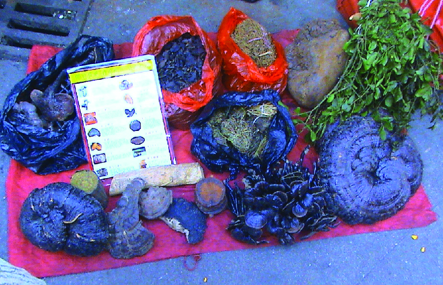
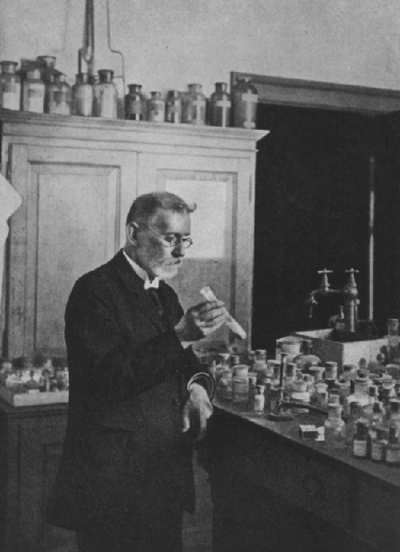
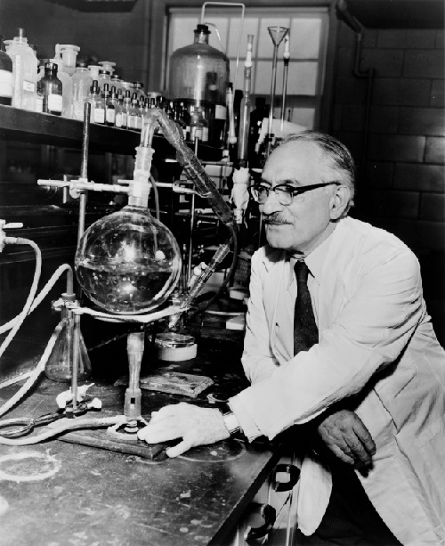

# Learning Objectives

* Compare and contrast natural, semisynthetic, and synthetic antimicrobial drugs
* Describe the chemotherapeutic approaches of ancient societies
* Describe the historically important individuals and events that led to the development of antimicrobial drugs

Part 1

Marisa, a 52-year-old woman, was suffering from severe abdominal pain, swollen lymph nodes, fatigue, and a fever. She had just returned home from visiting extended family in her native country of Cambodia. While abroad, she received medical care in neighboring Vietnam for a compressed spinal cord. She still had discomfort when leaving Cambodia, but the pain increased as her trip home continued and her husband drove her straight from the airport to the emergency room.

Her doctor considers whether Marisa could be suffering from appendicitis, a urinary tract infection (UTI), or pelvic inflammatory disease (PID). However, each of those conditions is typically preceded or accompanied by additional symptoms. He considers the treatment she received in Vietnam for her compressed spinal cord, but abdominal pain is not usually associated with spinal cord compression. He examines her health history further.

* What type of infection or other condition may be responsible?
* What type of lab tests might the doctor order?
{: data-bullet-style="bullet"}

*Jump to the [next](/m58860#fs-id1167661499148) Clinical Focus box.*

Most people associate the term **chemotherapy**{: data-type="term" .no-emphasis} with treatments for cancer. However, chemotherapy is actually a broader term that refers to any use of chemicals or drugs to treat disease. Chemotherapy may involve drugs that target cancerous cells or tissues, or it may involve **antimicrobial drugs**{: data-type="term"} that target infectious microorganisms. Antimicrobial drugs typically work by destroying or interfering with microbial structures and enzymes, either killing microbial cells or inhibiting of their growth. But before we examine how these drugs work, we will briefly explore the history of humans’ use of antimicrobials for the purpose of chemotherapy.

# Use of Antimicrobials in Ancient Societies

Although the discovery of antimicrobials and their subsequent widespread use is commonly associated with modern medicine, there is evidence that humans have been exposed to antimicrobial compounds for millennia. Chemical analyses of the skeletal remains of people from Nubia[1](#footnote1){: data-type="footnote-number" name="footnote-ref1"} (now found in present-day Sudan) dating from between 350 and 550 AD have shown residue of the antimicrobial agent **tetracycline**{: data-type="term" .no-emphasis} in high enough quantities to suggest the purposeful fermentation of tetracycline-producing *Streptomyces* during the beer-making process. The resulting **beer**{: data-type="term" .no-emphasis}, which was thick and gruel-like, was used to treat a variety of ailments in both adults and children, including gum disease and wounds. The antimicrobial properties of certain plants may also have been recognized by various cultures around the world, including Indian and Chinese **herbalists**{: data-type="term" .no-emphasis} ([\[link\]](#OSC_Microbio_14_01_Woodcut)) who have long used plants for a wide variety of medical purposes. Healers of many cultures understood the antimicrobial properties of fungi and their use of moldy bread or other mold-containing products to treat wounds has been well documented for centuries.[2](#footnote2){: data-type="footnote-number" name="footnote-ref2"} Today, while about 80% of the world’s population still relies on plant-derived medicines,[3](#footnote3){: data-type="footnote-number" name="footnote-ref3"} scientists are now discovering the active compounds conferring the medicinal benefits contained in many of these traditionally used plants.

 {: #OSC_Microbio_14_01_Woodcut}

* Give examples of how antimicrobials were used in ancient societies.
{: data-bullet-style="bullet"}

# The First Antimicrobial Drugs

Societies relied on traditional medicine for thousands of years; however, the first half of the 20th century brought an era of strategic drug discovery. In the early 1900s, the German physician and scientist Paul **Ehrlich**{: data-type="term" .no-emphasis} (1854–1915) set out to discover or synthesize chemical compounds capable of killing infectious microbes without harming the patient. In 1909, after screening more than 600 arsenic-containing compounds, Ehrlich’s assistant Sahachiro **Hata**{: data-type="term" .no-emphasis} (1873–1938) found one such “magic bullet.” **Compound 606**{: data-type="term" .no-emphasis} targeted the bacterium *Treponema pallidum*, the causative agent of syphilis. Compound 606 was found to successfully cure syphilis in rabbits and soon after was marketed under the name **Salvarsan**{: data-type="term" .no-emphasis} as a remedy for the disease in humans ([\[link\]](#OSC_Microbio_14_01_Ehrlich)). Ehrlich’s innovative approach of systematically screening a wide variety of compounds remains a common strategy for the discovery of new antimicrobial agents even today.

 {: #OSC_Microbio_14_01_Ehrlich}

A few decades later, German scientists Josef **Klarer**{: data-type="term" .no-emphasis}, Fritz **Mietzsch**{: data-type="term" .no-emphasis}, and Gerhard **Domagk**{: data-type="term" .no-emphasis} discovered the antibacterial activity of a synthetic dye, **prontosil**{: data-type="term" .no-emphasis}, that could treat streptococcal and staphylococcal infections in mice. Domagk’s own daughter was one of the first human recipients of the drug, which completely cured her of a severe streptococcal infection that had resulted from a poke with an embroidery needle. Gerhard **Domagk**{: data-type="term" .no-emphasis} (1895–1964) was awarded the Nobel Prize in Medicine in 1939 for his work with prontosil and **sulfanilamide**{: data-type="term" .no-emphasis}, the active breakdown product of prontosil in the body. Sulfanilamide, the first synthetic antimicrobial created, served as the foundation for the chemical development of a family of sulfa drugs. A **synthetic antimicrobial**{: data-type="term"} is a drug that is developed from a chemical not found in nature. The success of the **sulfa drugs**{: data-type="term" .no-emphasis} led to the discovery and production of additional important classes of synthetic antimicrobials, including the **quinolines**{: data-type="term" .no-emphasis} and **oxazolidinones**{: data-type="term" .no-emphasis}.

A few years before the discovery of prontosil, scientist Alexander **Fleming**{: data-type="term" .no-emphasis} (1881–1955) made his own accidental discovery that turned out to be monumental. In 1928, Fleming returned from holiday and examined some old plates of staphylococci in his research laboratory at St. Mary’s Hospital in London. He observed that contaminating mold growth (subsequently identified as a strain of *Penicillium notatum*) inhibited staphylococcal growth on one plate. Fleming, therefore, is credited with the discovery of **penicillin**{: data-type="term"}, the first **natural antibiotic**{: data-type="term"}, ([\[link\]](#OSC_Microbio_14_01_Oxford)). Further experimentation showed that penicillin from the mold was antibacterial against streptococci, meningococci, and ***Corynebacterium diphtheriae***{: data-type="term" .no-emphasis}, the causative agent of diphtheria.

Fleming and his colleagues were credited with discovering and identifying penicillin, but its isolation and mass production were accomplished by a team of researchers at Oxford University under the direction of Howard **Florey**{: data-type="term" .no-emphasis} (1898–1968) and Ernst **Chain**{: data-type="term" .no-emphasis} (1906–1979) ([\[link\]](#OSC_Microbio_14_01_Oxford)). In 1940, the research team purified penicillin and reported its success as an antimicrobial agent against streptococcal infections in mice. Their subsequent work with human subjects also showed penicillin to be very effective. Because of their important work, Fleming, Florey, and Chain were awarded the Nobel Prize in Physiology and Medicine in 1945.

In the early 1940s, scientist Dorothy **Hodgkin**{: data-type="term" .no-emphasis} (1910–1994), who studied crystallography at Oxford University, used X-rays to analyze the structure of a variety of natural products. In 1946, she determined the structure of penicillin, for which she was awarded the Nobel Prize in Chemistry in 1964. Once the structure was understood, scientists could modify it to produce a variety of semisynthetic penicillins. A **semisynthetic antimicrobial**{: data-type="term"} is a chemically modified derivative of a natural antibiotic. The chemical modifications are generally designed to increase the range of bacteria targeted, increase stability, decrease toxicity, or confer other properties beneficial for treating infections.

Penicillin is only one example of a natural antibiotic. Also in the 1940s, Selman **Waksman**{: data-type="term" .no-emphasis} (1888–1973) ([\[link\]](#OSC_Microbio_14_01_Waksman)), a prominent soil microbiologist at Rutgers University, led a research team that discovered several antimicrobials, including **actinomycin**{: data-type="term" .no-emphasis}, **streptomycin**{: data-type="term" .no-emphasis}, and **neomycin**{: data-type="term" .no-emphasis}. The discoveries of these antimicrobials stemmed from Waksman’s study of fungi and the **Actinobacteria**{: data-type="term" .no-emphasis}, including soil bacteria in the genus *Streptomyces*, known for their natural production of a wide variety of antimicrobials. His work earned him the Nobel Prize in Physiology and Medicine in 1952. The **actinomycetes**{: data-type="term" .no-emphasis} are the source of more than half of all natural antibiotics[4](#footnote4){: data-type="footnote-number" name="footnote-ref4"} and continue to serve as an excellent reservoir for the discovery of novel antimicrobial agents. Some researchers argue that we have not yet come close to tapping the full antimicrobial potential of this group.[5](#footnote5){: data-type="footnote-number" name="footnote-ref5"}

  Alexander Fleming was the first to discover a naturally produced antimicrobial, penicillin, in 1928. (b) Howard Florey and Ernst Chain discovered how to scale up penicillin production. Then they figured out how to purify it and showed its efficacy as an antimicrobial in animal and human trials in the early 1940s."){: #OSC_Microbio_14_01_Oxford}

{: #OSC_Microbio_14_01_Waksman}

* Why is the soil a reservoir for antimicrobial resistance genes?
{: data-bullet-style="bullet"}

# Key Concepts and Summary

* **Antimicrobial drugs** produced by purposeful fermentation and/or contained in plants have been used as traditional medicines in many cultures for millennia.
* The purposeful and systematic search for a chemical “magic bullet” that specifically target infectious microbes was initiated by Paul Ehrlich in the early 20th century.
* The discovery of the **natural antibiotic**, penicillin, by Alexander Fleming in 1928 started the modern age of antimicrobial discovery and research.
* Sulfanilamide, the first **synthetic antimicrobial**, was discovered by Gerhard Domagk and colleagues and is a breakdown product of the synthetic dye, prontosil.
{: data-bullet-style="bullet"}

# Multiple Choice

A scientist discovers that a soil bacterium he has been studying produces an antimicrobial that kills gram-negative bacteria. She isolates and purifies the antimicrobial compound, then chemically converts a chemical side chain to a hydroxyl group. When she tests the antimicrobial properties of this new version, she finds that this antimicrobial drug can now also kill gram-positive bacteria. The new antimicrobial drug with broad-spectrum activity is considered to be which of the following?

1.  resistant
2.  semisynthetic
3.  synthetic
4.  natural
{: data-number-style="upper-alpha"}

B

Which of the following antimicrobial drugs is synthetic?

1.  sulfanilamide
2.  penicillin
3.  actinomycin
4.  neomycin
{: data-number-style="upper-alpha"}

# Fill in the Blank

The group of soil bacteria known for their ability to produce a wide variety of antimicrobials is called the \_\_\_\_\_\_\_\_.

actinomycetes

# Short Answer

Where do antimicrobials come from naturally? Why?

Why was Salvarsan considered to be a “magic bullet” for the treatment of syphilis?

# Critical Thinking

In nature, why do antimicrobial-producing microbes commonly also have antimicrobial resistance genes?

## Footnotes
{: data-type="footnote-title"}

1.  [1](#footnote-ref1){: data-type="footnote-ref" name="footnote1"} M.L. Nelson et al. “Brief Communication: Mass Spectroscopic Characterization of Tetracycline in the Skeletal Remains of an Ancient Population from Sudanese Nubia 350–550 CE.” *American Journal of Physical Anthropology* 143 no. 1 (2010):151–154.
2.  [2](#footnote-ref2){: data-type="footnote-ref" name="footnote2"} M. Wainwright. “Moulds in Ancient and More Recent Medicine.” *Mycologist* 3 no. 1 (1989):21–23.
3.  [3](#footnote-ref3){: data-type="footnote-ref" name="footnote3"} S. Verma, S.P. Singh. “Current and Future Status of Herbal Medicines.” *Veterinary World* 1 no. 11 (2008):347–350.
4.  [4](#footnote-ref4){: data-type="footnote-ref" name="footnote4"} J. Berdy. “Bioactive Microbial Metabolites.” *The Journal of Antibiotics* 58 no. 1 (2005):1–26.
5.  [5](#footnote-ref5){: data-type="footnote-ref" name="footnote5"} M. Baltz. “Antimicrobials from Actinomycetes: Back to the Future.” *Microbe* 2 no. 3 (2007):125–131.

