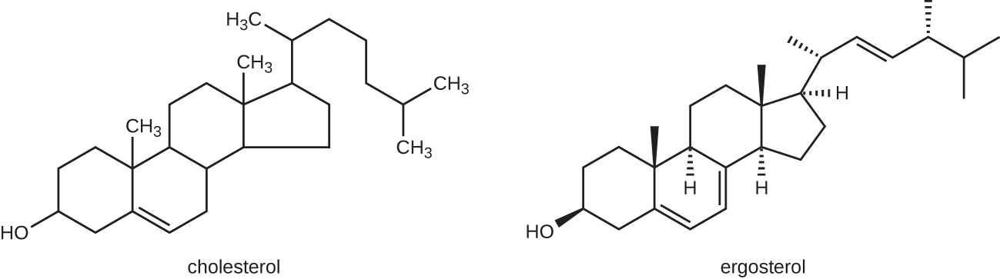
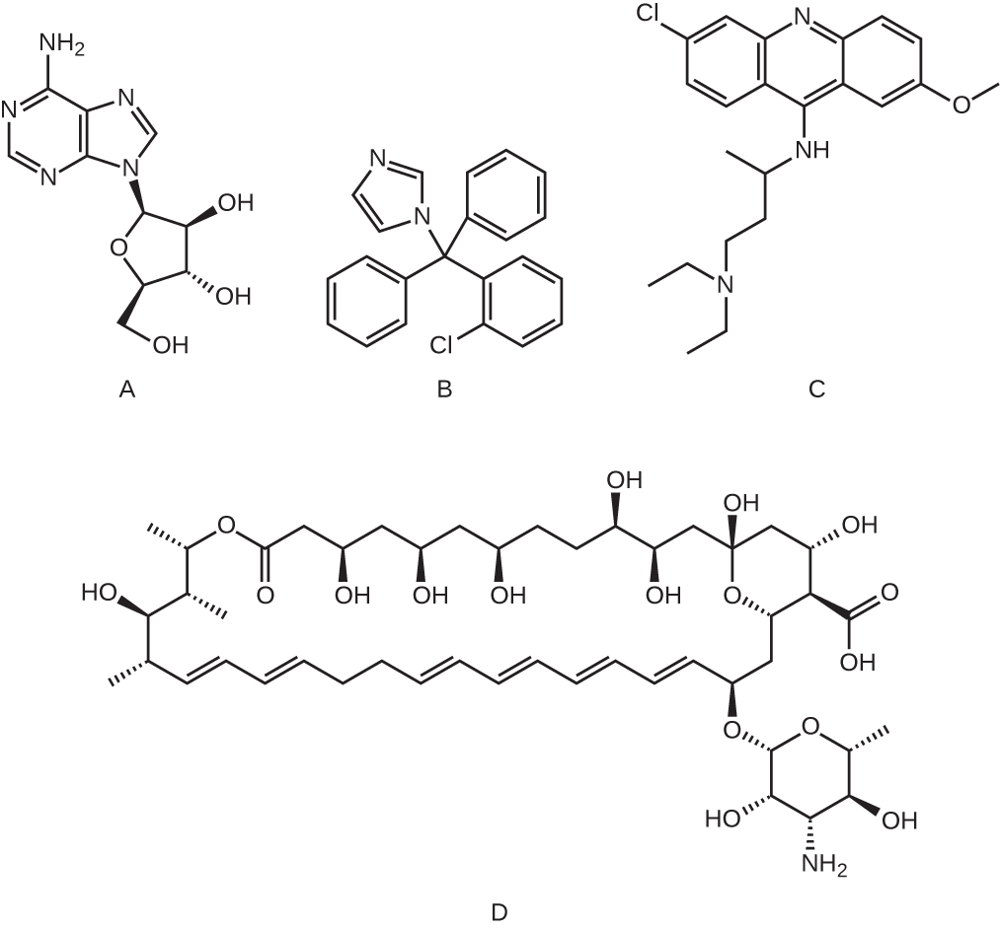

### Learning Objective

* Explain the differences between modes of action of drugs that target fungi, protozoa, helminths, and viruses

Because fungi, protozoa, and helminths are eukaryotic, their cells are very similar to human cells, making it more difficult to develop drugs with selective toxicity. Additionally, viruses replicate within human host cells, making it difficult to develop drugs that are selectively toxic to viruses or virus-infected cells. Despite these challenges, there are antimicrobial drugs that target fungi, protozoa, helminths, and viruses, and some even target more than one type of microbe. [\[link\]](#fs-id1167661598303), [\[link\]](#fs-id1167661428546), [\[link\]](#fs-id1167663731038), and [\[link\]](#fs-id1167661791415) provide examples for antimicrobial drugs in these various classes.

### Antifungal Drugs

The most common mode of action for **antifungal drugs**{: data-type="term" .no-emphasis} is the disruption of the cell membrane. Antifungals take advantage of small differences between fungi and humans in the biochemical pathways that synthesize sterols. The **sterols**{: data-type="term" .no-emphasis} are important in maintaining proper membrane fluidity and, hence, proper function of the cell membrane. For most fungi, the predominant membrane sterol is **ergosterol**{: data-type="term" .no-emphasis}. Because human cell membranes use **cholesterol**{: data-type="term" .no-emphasis}, instead of ergosterol, antifungal drugs that target ergosterol synthesis are selectively toxic ([\[link\]](#OSC_Microbio_14_03_sterols)).

 {: #OSC_Microbio_14_03_sterols}

The **imidazoles**{: data-type="term"} are synthetic fungicides that disrupt ergosterol biosynthesis; they are commonly used in medical applications and also in agriculture to keep seeds and harvested crops from molding. Examples include **miconazole**{: data-type="term" .no-emphasis}, **ketoconazole**{: data-type="term" .no-emphasis}, and **clotrimazole**{: data-type="term" .no-emphasis}, which are used to treat fungal skin infections such as **ringworm**{: data-type="term" .no-emphasis}, specifically **tinea pedis**{: data-type="term" .no-emphasis} (**athlete’s foot**{: data-type="term" .no-emphasis}), **tinea cruris**{: data-type="term" .no-emphasis} (**jock itch**{: data-type="term" .no-emphasis}), and **tinea corporis**{: data-type="term" .no-emphasis}. These infections are commonly caused by **dermatophytes**{: data-type="term" .no-emphasis} of the genera ***Trichophyton***{: data-type="term" .no-emphasis}, ***Epidermophyton***{: data-type="term" .no-emphasis}, and ***Microsporum***{: data-type="term" .no-emphasis}. Miconazole is also used predominantly for the treatment of vaginal yeast infections caused by the fungus ***Candida***{: data-type="term" .no-emphasis}, and ketoconazole is used for the treatment of **tinea versicolor**{: data-type="term" .no-emphasis} and **dandruff**{: data-type="term" .no-emphasis}, which both can be caused by the fungus ***Malassezia***{: data-type="term" .no-emphasis}.

The **triazole**{: data-type="term"} drugs, including **fluconazole**{: data-type="term"}, also inhibit **ergosterol**{: data-type="term" .no-emphasis} biosynthesis. However, they can be administered orally or intravenously for the treatment of several types of systemic yeast infections, including **oral thrush**{: data-type="term" .no-emphasis} and **cryptococcal meningitis**{: data-type="term" .no-emphasis}, both of which are prevalent in patients with AIDS. The triazoles also exhibit more **selective toxicity**{: data-type="term" .no-emphasis}, compared with the imidazoles, and are associated with fewer side effects.

The **allylamines**{: data-type="term"}, a structurally different class of synthetic antifungal drugs, inhibit an earlier step in ergosterol biosynthesis. The most commonly used allylamine is **terbinafine**{: data-type="term"} (marketed under the brand name **Lamisil**{: data-type="term" .no-emphasis}), which is used topically for the treatment of dermatophytic skin infections like **athlete’s foot**{: data-type="term" .no-emphasis}, **ringworm**{: data-type="term" .no-emphasis}, and **jock itch**{: data-type="term" .no-emphasis}. Oral treatment with terbinafine is also used for the treatment of fingernail and toenail fungus, but it can be associated with the rare side effect of **hepatotoxicity**{: data-type="term" .no-emphasis}.

The **polyenes**{: data-type="term"} are a class of antifungal agents naturally produced by certain actinomycete soil bacteria and are structurally related to **macrolides**{: data-type="term" .no-emphasis}. These large, lipophilic molecules bind to ergosterol in fungal cytoplasmic membranes, thus creating pores. Common examples include **nystatin**{: data-type="term" .no-emphasis} and **amphotericin B**{: data-type="term" .no-emphasis}. Nystatin is typically used as a topical treatment for yeast infections of the skin, mouth, and vagina, but may also be used for intestinal fungal infections. The drug **amphotericin B**{: data-type="term"} is used for systemic fungal infections like **aspergillosis**{: data-type="term" .no-emphasis}, **cryptococcal meningitis**{: data-type="term" .no-emphasis}, **histoplasmosis**{: data-type="term" .no-emphasis}, **blastomycosis**{: data-type="term" .no-emphasis}, and **candidiasis**{: data-type="term" .no-emphasis}. Amphotericin B was the only antifungal drug available for several decades, but its use is associated with some serious side effects, including **nephrotoxicity**{: data-type="term" .no-emphasis} (kidney toxicity).

Amphotericin B is often used in combination with **flucytosine**{: data-type="term" .no-emphasis}, a fluorinated pyrimidine analog that is converted by a fungal-specific enzyme into a toxic product that interferes with both DNA replication and protein synthesis in fungi. Flucytosine is also associated with hepatotoxicity (liver toxicity) and bone marrow depression.

Beyond targeting **ergosterol**{: data-type="term" .no-emphasis} in fungal cell membranes, there are a few antifungal drugs that target other fungal structures ([\[link\]](#OSC_Microbio_14_03_antifungal)). The **echinocandins**{: data-type="term" .no-emphasis}, including caspofungin, are a group of naturally produced antifungal compounds that block the synthesis of β(1→3) glucan found in fungal cell walls but not found in human cells. This drug class has the nickname “penicillin for fungi.” Caspofungin is used for the treatment of **aspergillosis**{: data-type="term" .no-emphasis} as well as systemic yeast infections.

Although **chitin**{: data-type="term" .no-emphasis} is only a minor constituent of fungal cell walls, it is also absent in human cells, making it a selective target. The **polyoxins**{: data-type="term" .no-emphasis} and **nikkomycins**{: data-type="term" .no-emphasis} are naturally produced antifungals that target chitin synthesis. Polyoxins are used to control fungi for agricultural purposes, and nikkomycin Z is currently under development for use in humans to treat yeast infections and **Valley fever**{: data-type="term" .no-emphasis} (**coccidioidomycosis**{: data-type="term" .no-emphasis}), a fungal disease prevalent in the southwestern US.[1](#footnote1){: data-type="footnote-link"}

The naturally produced antifungal **griseofulvin**{: data-type="term" .no-emphasis} is thought to specifically disrupt fungal cell division by interfering with microtubules involved in spindle formation during mitosis. It was one of the first antifungals, but its use is associated with **hepatotoxicity**{: data-type="term" .no-emphasis}. It is typically administered orally to treat various types of dermatophytic skin infections when other topical antifungal treatments are ineffective.

There are a few drugs that act as antimetabolites against fungal processes. For example, **atovaquone**{: data-type="term" .no-emphasis}, a representative of the **naphthoquinone**{: data-type="term" .no-emphasis} drug class, is a semisynthetic antimetabolite for fungal and protozoal versions of a mitochondrial cytochrome important in electron transport. Structurally, it is an analog of **coenzyme Q**{: data-type="term" .no-emphasis}, with which it competes for electron binding. It is particularly useful for the treatment of ***Pneumocystis* pneumonia**{: data-type="term" .no-emphasis} caused by ***Pneumocystis jirovecii***{: data-type="term" .no-emphasis}. The antibacterial **sulfamethoxazole-trimethoprim**{: data-type="term" .no-emphasis} combination also acts as an antimetabolite against *P. jirovecii*.

[\[link\]](#fs-id1167661598303) shows the various therapeutic classes of antifungal drugs, categorized by mode of action, with examples of each.

 "){: #OSC_Microbio_14_03_antifungal}

<table summary="Table titled: Common Antifungal Drugs. Columns: Mechanism of Action; Drug Class; Specific Drugs; Clinical Uses. Mechanism: Inhibit ergosterol synthesis. Class: Imidazoles; Miconazole, ketoconazole, clotrimazole; Fungal skin infections and vaginal yeast infections. Class: Triazoles; Fluconazole; Systemic yeast infections, oral thrush, and cryptococcal meningitis. Allylamines; Terbinafine; Dermatophytic skin infections (athlete&#x2019;s foot, ring worm, jock itch), and infections of fingernails and toenails. Mechanism: Bind ergosterol in the cell membrane and create pores that disrupt the membrane. Class: Polyenes. Nystatin,; Used topically for yeast infections of skin, mouth, and vagina; also used for fungal infections of the intestine. Amphotericin B; Variety systemic fungal infections. Mechanism: Inhibit cell wall synthesis. Class: Echinocandins; Caspofungin; Aspergillosis and systemic yeast infections. Not applicable; Nikkomycin Z; Coccidioidomycosis (Valley fever) and yeast infections. Mechanism: Inhibit microtubules and cell division; Not applicable; Griseofulvin; Dermatophytic skin infections." class="span-all"><thead>
<tr>
<th colspan="4" data-align="center">Common Antifungal Drugs</th>
</tr>
<tr valign="top">
<th data-valign="top" data-align="left">Mechanism of Action</th>
<th data-valign="top" data-align="left">Drug Class</th>
<th data-valign="top" data-align="left">Specific Drugs</th>
<th data-valign="top" data-align="left">Clinical Uses</th>
</tr>
</thead><tbody>
<tr valign="top">
<td rowspan="3" data-valign="top" data-align="left">Inhibit ergosterol synthesis</td>
<td data-valign="top" data-align="left">Imidazoles</td>
<td data-valign="top" data-align="left">Miconazole, ketoconazole, clotrimazole</td>
<td data-valign="top" data-align="left">Fungal skin infections and vaginal yeast infections</td>
</tr>
<tr valign="top">
<td data-valign="top" data-align="left">Triazoles</td>
<td data-valign="top" data-align="left">Fluconazole</td>
<td data-valign="top" data-align="left">Systemic yeast infections, oral thrush, and cryptococcal meningitis</td>
</tr>
<tr valign="top">
<td data-valign="top" data-align="left">Allylamines</td>
<td data-valign="top" data-align="left">Terbinafine</td>
<td data-valign="top" data-align="left">Dermatophytic skin infections (athlete’s foot, ring worm, jock itch), and infections of fingernails and toenails</td>
</tr>
<tr valign="top">
<td rowspan="2" data-valign="top" data-align="left">Bind ergosterol in the cell membrane and create pores that disrupt the membrane</td>
<td rowspan="2" data-valign="top" data-align="left">Polyenes</td>
<td data-valign="top" data-align="left">Nystatin</td>
<td data-valign="top" data-align="left">Used topically for yeast infections of skin, mouth, and vagina; also used for fungal infections of the intestine</td>
</tr>
<tr valign="top">
<td data-valign="top" data-align="left">Amphotericin B</td>
<td data-valign="top" data-align="left">Variety systemic fungal infections</td>
</tr>
<tr valign="top">
<td rowspan="2" data-valign="top" data-align="left">Inhibit cell wall synthesis</td>
<td data-valign="top" data-align="left">Echinocandins</td>
<td data-valign="top" data-align="left">Caspofungin</td>
<td data-valign="top" data-align="left">Aspergillosis and systemic yeast infections</td>
</tr>
<tr valign="top">
<td data-valign="top" data-align="left">Not applicable</td>
<td data-valign="top" data-align="left">Nikkomycin Z</td>
<td data-valign="top" data-align="left">Coccidioidomycosis (Valley fever) and yeast infections</td>
</tr>
<tr valign="top">
<td data-valign="top" data-align="left">Inhibit microtubules and cell division</td>
<td data-valign="top" data-align="left">Not applicable</td>
<td data-valign="top" data-align="left">Griseofulvin</td>
<td data-valign="top" data-align="left">Dermatophytic skin infections</td>
</tr>
</tbody></table>

* How is disruption of ergosterol biosynthesis an effective mode of action for antifungals?
{: data-bullet-style="bullet"}

Treating a Fungal Infection of the Lungs

Jack, a 48-year-old engineer, is **HIV**{: data-type="term" .no-emphasis} positive but generally healthy thanks to **antiretroviral therapy (ART)**{: data-type="term" .no-emphasis}. However, after a particularly intense week at work, he developed a fever and a dry cough. He assumed that he just had a cold or mild flu due to overexertion and didn’t think much of it. However, after about a week, he began to experience fatigue, weight loss, and shortness of breath. He decided to visit his physician, who found that Jack had a low level of blood oxygenation. The physician ordered blood testing, a chest X-ray, and the collection of an induced sputum sample for analysis. His X-ray showed a fine cloudiness and several pneumatoceles (thin-walled pockets of air), which indicated ***Pneumocystis* pneumonia**{: data-type="term" .no-emphasis} (PCP), a type of pneumonia caused by the fungus ***Pneumocystis jirovecii***{: data-type="term" .no-emphasis}. Jack’s physician admitted him to the hospital and prescribed **Bactrim**{: data-type="term" .no-emphasis}, a combination of **sulfamethoxazole**{: data-type="term" .no-emphasis} and **trimethoprim**{: data-type="term" .no-emphasis}, to be administered intravenously.

*P. jirovecii* is a yeast-like fungus with a life cycle similar to that of protozoans. As such, it was classified as a protozoan until the 1980s. It lives only in the lung tissue of infected persons and is transmitted from person to person, with many people exposed as children. Typically, *P. jirovecii* only causes pneumonia in immunocompromised individuals. Healthy people may carry the fungus in their lungs with no symptoms of disease. PCP is particularly problematic among HIV patients with compromised immune systems.

PCP is usually treated with oral or intravenous Bactrim, but **atovaquone**{: data-type="term" .no-emphasis} or **pentamidine**{: data-type="term" .no-emphasis} (another antiparasitic drug) are alternatives. If not treated, PCP can progress, leading to a collapsed lung and nearly 100% mortality. Even with antimicrobial drug therapy, PCP still is responsible for 10% of HIV-related deaths.

The cytological examination, using direct immunofluorescence assay (DFA), of a smear from Jack’s sputum sample confirmed the presence of *P. jirovecii* ([\[link\]](#OSC_Microbio_14_03_Pjiroveci)). Additionally, the results of Jack’s blood tests revealed that his white blood cell count had dipped, making him more susceptible to the fungus. His physician reviewed his ART regimen and made adjustments. After a few days of hospitalization, Jack was released to continue his antimicrobial therapy at home. With the adjustments to his ART therapy, Jack’s CD4 counts began to increase and he was able to go back to work.

"){: #OSC_Microbio_14_03_Pjiroveci}

### Antiprotozoan Drugs

There are a few mechanisms by which antiprotozoan drugs target infectious protozoans ([\[link\]](#fs-id1167663731038)). Some are **antimetabolites**{: data-type="term" .no-emphasis}, such as **atovaquone**{: data-type="term" .no-emphasis}, **proguanil**{: data-type="term" .no-emphasis}, and artemisinins. Atovaquone, in addition to being antifungal, blocks electron transport in protozoans and is used for the treatment of protozoan infections including **malaria**{: data-type="term" .no-emphasis}, **babesiosis**{: data-type="term" .no-emphasis}, and **toxoplasmosis**{: data-type="term" .no-emphasis}. Proguanil is another synthetic antimetabolite that is processed in parasitic cells into its active form, which inhibits protozoan folic acid synthesis. It is often used in combination with atovaquone, and the combination is marketed as **Malarone**{: data-type="term" .no-emphasis} for both malaria treatment and prevention.

Artemisinin, a plant-derived antifungal first discovered by Chinese scientists in the 1970s, is quite effective against malaria. Semisynthetic derivatives of **artemisinin**{: data-type="term"} are more water soluble than the natural version, which makes them more bioavailable. Although the exact mechanism of action is unclear, artemisinins appear to act as prodrugs that are metabolized by target cells to produce **reactive oxygen species (ROS)**{: data-type="term" .no-emphasis} that damage target cells. Due to the rise in resistance to antimalarial drugs, artemisinins are also commonly used in combination with other antimalarial compounds in artemisinin-based combination therapy (ACT).

Several antimetabolites are used for the treatment of toxoplasmosis caused by the parasite ***Toxoplasma gondii***{: data-type="term" .no-emphasis}. The synthetic sulfa drug **sulfadiazine**{: data-type="term" .no-emphasis} competitively inhibits an enzyme in **folic acid**{: data-type="term" .no-emphasis} production in parasites and can be used to treat malaria and toxoplasmosis. Pyrimethamine is a synthetic drug that inhibits a different enzyme in the folic acid production pathway and is often used in combination with **sulfadoxine**{: data-type="term" .no-emphasis} (another sulfa drug) for the treatment of **malaria**{: data-type="term" .no-emphasis} or in combination with sulfadiazine for the treatment of **toxoplasmosis**{: data-type="term" .no-emphasis}. Side effects of **pyrimethamine**{: data-type="term" .no-emphasis} include decreased bone marrow activity that may cause increased bruising and low red blood cell counts. When toxicity is a concern, **spiramycin**{: data-type="term" .no-emphasis}, a macrolide protein synthesis inhibitor, is typically administered for the treatment of toxoplasmosis.

Two classes of antiprotozoan drugs interfere with nucleic acid synthesis: **nitroimidazoles**{: data-type="term" .no-emphasis} and **quinolines**{: data-type="term" .no-emphasis}. Nitroimidazoles, including semisynthetic **metronidazole**{: data-type="term" .no-emphasis}, which was discussed previously as an antibacterial drug, and synthetic **tinidazole**{: data-type="term" .no-emphasis}, are useful in combating a wide variety of protozoan pathogens, such as ***Giardia lamblia***{: data-type="term" .no-emphasis}, ***Entamoeba histolytica***{: data-type="term" .no-emphasis}, and ***Trichomonas vaginalis***{: data-type="term" .no-emphasis}. Upon introduction into these cells in low-oxygen environments, nitroimidazoles become activated and introduce DNA strand breakage, interfering with DNA replication in target cells. Unfortunately, metronidazole is associated with **carcinogenesis**{: data-type="term" .no-emphasis} (the development of cancer) in humans.

Another type of synthetic antiprotozoan drug that has long been thought to specifically interfere with DNA replication in certain pathogens is **pentamidine**{: data-type="term"}. It has historically been used for the treatment of **African sleeping sickness**{: data-type="term" .no-emphasis} (caused by the protozoan ***Trypanosoma brucei***{: data-type="term" .no-emphasis}) and **leishmaniasis**{: data-type="term" .no-emphasis} (caused by protozoa of the genus ***Leishmania***{: data-type="term" .no-emphasis}), but it is also an alternative treatment for the fungus ***Pneumocystis***{: data-type="term" .no-emphasis}. Some studies indicate that it specifically binds to the DNA found within **kinetoplasts**{: data-type="term" .no-emphasis} (kDNA; long mitochondrion-like structures unique to **trypanosomes**{: data-type="term" .no-emphasis}), leading to the cleavage of kDNA. However, nuclear DNA of both the parasite and host remain unaffected. It also appears to bind to tRNA, inhibiting the addition of amino acids to tRNA, thus preventing protein synthesis. Possible side effects of pentamidine use include pancreatic dysfunction and liver damage.

The **quinolines**{: data-type="term"} are a class of synthetic compounds related to **quinine**{: data-type="term" .no-emphasis}, which has a long history of use against malaria. Quinolines are thought to interfere with heme detoxification, which is necessary for the parasite’s effective breakdown of hemoglobin into amino acids inside red blood cells. The synthetic derivatives chloroquine, **quinacrine**{: data-type="term" .no-emphasis} (also called **mepacrine**{: data-type="term" .no-emphasis}), and **mefloquine**{: data-type="term" .no-emphasis} are commonly used as antimalarials, and chloroquine is also used to treat amebiasis typically caused by ***Entamoeba histolytica***{: data-type="term" .no-emphasis}. Long-term prophylactic use of chloroquine or mefloquine may result in serious side effects, including hallucinations or cardiac issues. Patients with glucose-6-phosphate dehydrogenase deficiency experience severe **anemia**{: data-type="term" .no-emphasis} when treated with chloroquine.

<table summary="Table titled: Common Antiprotozoan Drugs. Columns: Mechanism of Action; Drug Class; Specific Drugs; Clinical Uses. Mechanism: Inhibit electron transport in mitochondria; Naphthoquinone; Atovaquone; Malaria, babesiosis, and toxoplasmosis. Mechanism: Inhibit folic acid synthesis. Class: Not applicable; Proquanil; Combination therapy with atovaquone for malaria treatment and prevention. Class: Sulfonamide; Sulfadiazine; Malaria and toxoplasmosis. Class: Not applicable; Pyrimethamine; Combination therapy with sulfadoxine (sulfa drug) for malaria. Mechanism: Produces damaging reactive oxygen species; Not applicable; Artemisinin; Combination therapy to treat malaria. Mechanism: Inhibit DNA synthesis. Class: Nitroimidazoles; Metronidazole, tinidazole; Infections caused by Giardia lamblia, Entamoeba histolytica, and Trichomonas vaginalis. Class: Not applicable; Pentamidine; African sleeping sickness and leishmaniasis. Mechanism: Inhibit heme detoxification. Class: Quinolines. Chloroquine; Malaria and infections with E. histolytica. Mepacrine, mefloquine; Malaria." class="span-all"><thead>
<tr>
<th colspan="4" data-align="center">Common Antiprotozoan Drugs</th>
</tr>
<tr valign="top">
<th data-valign="top" data-align="left">Mechanism of Action</th>
<th data-valign="top" data-align="left">Drug Class</th>
<th data-valign="top" data-align="left">Specific Drugs</th>
<th data-valign="top" data-align="left">Clinical Uses</th>
</tr>
</thead><tbody>
<tr valign="top">
<td data-valign="top" data-align="left">Inhibit electron transport in mitochondria</td>
<td data-valign="top" data-align="left">Naphthoquinone</td>
<td data-valign="top" data-align="left">Atovaquone</td>
<td data-valign="top" data-align="left">Malaria, babesiosis, and toxoplasmosis</td>
</tr>
<tr valign="top">
<td rowspan="3" data-valign="top" data-align="left">Inhibit folic acid synthesis</td>
<td data-valign="top" data-align="left">Not applicable</td>
<td data-valign="top" data-align="left">Proquanil</td>
<td data-valign="top" data-align="left">Combination therapy with atovaquone for malaria treatment and prevention</td>
</tr>
<tr valign="top">
<td data-valign="top" data-align="left">Sulfonamide</td>
<td data-valign="top" data-align="left">Sulfadiazine</td>
<td data-valign="top" data-align="left">Malaria and toxoplasmosis</td>
</tr>
<tr valign="top">
<td data-valign="top" data-align="left">Not applicable</td>
<td data-valign="top" data-align="left">Pyrimethamine</td>
<td data-valign="top" data-align="left">Combination therapy with sulfadoxine (sulfa drug) for malaria</td>
</tr>
<tr valign="top">
<td data-valign="top" data-align="left">Produces damaging reactive oxygen species</td>
<td data-valign="top" data-align="left">Not applicable</td>
<td data-valign="top" data-align="left">Artemisinin</td>
<td data-valign="top" data-align="left">Combination therapy to treat malaria</td>
</tr>
<tr valign="top">
<td rowspan="2" data-valign="top" data-align="left">Inhibit DNA synthesis</td>
<td data-valign="top" data-align="left">Nitroimidazoles</td>
<td data-valign="top" data-align="left">Metronidazole, tinidazole</td>
<td data-valign="top" data-align="left">Infections caused by <em>Giardia lamblia, Entamoeba histolytica,</em> and <em>Trichomonas vaginalis</em></td>
</tr>
<tr valign="top">
<td data-valign="top" data-align="left">Not applicable</td>
<td data-valign="top" data-align="left">Pentamidine</td>
<td data-valign="top" data-align="left">African sleeping sickness and leishmaniasis</td>
</tr>
<tr valign="top">
<td rowspan="2" data-valign="top" data-align="left">Inhibit heme detoxification</td>
<td rowspan="2" data-valign="top" data-align="left">Quinolines</td>
<td data-valign="top" data-align="left">Chloroquine</td>
<td data-valign="top" data-align="left">Malaria and infections with <em>E. histolytica</em></td>
</tr>
<tr valign="top">
<td data-valign="top" data-align="left">Mepacrine, mefloquine</td>
<td data-valign="top" data-align="left">Malaria</td>
</tr>
</tbody></table>

* List two modes of action for antiprotozoan drugs.
{: data-bullet-style="bullet"}

### Antihelminthic Drugs

Because helminths are multicellular eukaryotes like humans, developing drugs with selective toxicity against them is extremely challenging. Despite this, several effective classes have been developed ([\[link\]](#fs-id1167663731038)). Synthetic **benzimidazoles**{: data-type="term"}, like **mebendazole**{: data-type="term"} and **albendazole**{: data-type="term"}, bind to helminthic β-tubulin, preventing microtubule formation. Microtubules in the intestinal cells of the worms seem to be particularly affected, leading to a reduction in glucose uptake. Besides their activity against a broad range of helminths, benzimidazoles are also active against many protozoans, fungi, and viruses, and their use for inhibiting mitosis and cell cycle progression in cancer cells is under study.[2](#footnote2){: data-type="footnote-link"} Possible side effects of their use include liver damage and bone marrow suppression.

The **avermectins**{: data-type="term" .no-emphasis} are members of the macrolide family that were first discovered from a Japanese soil isolate, ***Streptomyces avermectinius***{: data-type="term" .no-emphasis}. A more potent semisynthetic derivative of avermectin is **ivermectin**{: data-type="term"}, which binds to glutamate-gated chloride channels specific to invertebrates including helminths, blocking neuronal transmission and causing starvation, paralysis, and death of the worms. Ivermectin is used to treat roundworm diseases, including **onchocerciasis**{: data-type="term" .no-emphasis} (also called **river blindness**{: data-type="term" .no-emphasis}, caused by the worm ***Onchocerca volvulus***{: data-type="term" .no-emphasis}) and **strongyloidiasis**{: data-type="term" .no-emphasis} (caused by the worm ***Strongyloides stercoralis***{: data-type="term" .no-emphasis} or *S. fuelleborni*). Ivermectin also can also treat parasitic insects like mites, lice, and bed bugs, and is nontoxic to humans.

Niclosamide is a synthetic drug that has been used for over 50 years to treat **tapeworm**{: data-type="term" .no-emphasis} infections. Although its mode of action is not entirely clear, **niclosamide**{: data-type="term" .no-emphasis} appears to inhibit ATP formation under anaerobic conditions and inhibit oxidative phosphorylation in the mitochondria of its target pathogens. Niclosamide is not absorbed from the gastrointestinal tract, thus it can achieve high localized intestinal concentrations in patients. Recently, it has been shown to also have antibacterial, antiviral, and antitumor activities.[3](#footnote3){: data-type="footnote-link"}[4](#footnote4){: data-type="footnote-link"}[5](#footnote5){: data-type="footnote-link"}

Another synthetic antihelminthic drug is **praziquantel**{: data-type="term"}, which used for the treatment of parasitic tapeworms and **liver flukes**{: data-type="term" .no-emphasis}, and is particularly useful for the treatment of **schistosomiasis**{: data-type="term" .no-emphasis} (caused by **blood flukes**{: data-type="term" .no-emphasis} from three genera of ***Schistosoma***{: data-type="term" .no-emphasis}). Its mode of action remains unclear, but it appears to cause the influx of calcium into the worm, resulting in intense spasm and paralysis of the worm. It is often used as a preferred alternative to niclosamide in the treatment of tapeworms when gastrointestinal discomfort limits niclosamide use.

The **thioxanthenones**{: data-type="term" .no-emphasis}, another class of synthetic drugs structurally related to **quinine**{: data-type="term" .no-emphasis}, exhibit antischistosomal activity by inhibiting RNA synthesis. The thioxanthenone **lucanthone**{: data-type="term" .no-emphasis} and its metabolite **hycanthone**{: data-type="term" .no-emphasis} were the first used clinically, but serious neurological, gastrointestinal, cardiovascular, and hepatic side effects led to their discontinuation. Oxamniquine, a less toxic derivative of hycanthone, is only effective against *S. mansoni*, one of the three species known to cause schistosomiasis in humans. Praziquantel was developed to target the other two schistosome species, but concerns about increasing resistance have renewed interest in developing additional derivatives of **oxamniquine**{: data-type="term" .no-emphasis} to target all three clinically important schistosome species.

<table summary="Table titled: Common Antihelminthic Drugs. Columns: Mechanism of Action; Drug Class; Specific Drugs; Clinical Uses. Inhibit microtubule formation, reducing glucose uptake; Benzimidazoles; Mebendazole, albendazole.; Variety of helminth infections. Block neuronal transmission, causing paralysis and starvation; Avermectins; Ivermectin; Roundworm diseases, including river blindness and strongyloidiasis, and treatment of parasitic insects. Inhibit ATP production; Not applicable; Niclosamide; Intestinal tapeworm infections. Induce calcium influx; Not applicable; Praziquantel; Schistosomiasis (blood flukes). Inhibit RNA synthesis; Thioxanthenones; Lucanthone, hycanthone, oxamniquine; Schistosomiasis (blood flukes)" class="span-all"><thead>
<tr>
<th colspan="4" data-align="center">Common Antihelminthic Drugs</th>
</tr>
<tr valign="top">
<th data-valign="top" data-align="left">Mechanism of Action</th>
<th data-valign="top" data-align="left">Drug Class</th>
<th data-valign="top" data-align="left">Specific Drugs</th>
<th data-valign="top" data-align="left">Clinical Uses</th>
</tr>
</thead><tbody>
<tr valign="top">
<td data-valign="top" data-align="left">Inhibit microtubule formation, reducing glucose uptake</td>
<td data-valign="top" data-align="left">Benzimidazoles</td>
<td data-valign="top" data-align="left">Mebendazole, albendazole</td>
<td data-valign="top" data-align="left">Variety of helminth infections</td>
</tr>
<tr valign="top">
<td data-valign="top" data-align="left">Block neuronal transmission, causing paralysis and starvation</td>
<td data-valign="top" data-align="left">Avermectins</td>
<td data-valign="top" data-align="left">Ivermectin</td>
<td data-valign="top" data-align="left">Roundworm diseases, including river blindness and strongyloidiasis, and treatment of parasitic insects</td>
</tr>
<tr valign="top">
<td data-valign="top" data-align="left">Inhibit ATP production</td>
<td data-valign="top" data-align="left">Not applicable</td>
<td data-valign="top" data-align="left">Niclosamide</td>
<td data-valign="top" data-align="left">Intestinal tapeworm infections</td>
</tr>
<tr valign="top">
<td data-valign="top" data-align="left">Induce calcium influx</td>
<td data-valign="top" data-align="left">Not applicable</td>
<td data-valign="top" data-align="left">Praziquantel</td>
<td data-valign="top" data-align="left">Schistosomiasis (blood flukes)</td>
</tr>
<tr valign="top">
<td data-valign="top" data-align="left">Inhibit RNA synthesis</td>
<td data-valign="top" data-align="left">Thioxanthenones</td>
<td data-valign="top" data-align="left">Lucanthone, hycanthone, oxamniquine</td>
<td data-valign="top" data-align="left">Schistosomiasis (blood flukes)</td>
</tr>
</tbody></table>

* Why are antihelminthic drugs difficult to develop?
{: data-bullet-style="bullet"}

### Antiviral Drugs

Unlike the complex structure of fungi, protozoa, and helminths, viral structure is simple, consisting of nucleic acid, a protein coat, viral enzymes, and, sometimes, a lipid envelope. Furthermore, viruses are obligate intracellular pathogens that use the host’s cellular machinery to replicate. These characteristics make it difficult to develop drugs with selective toxicity against viruses.

Many antiviral drugs are nucleoside analogs and function by inhibiting nucleic acid biosynthesis. For example, **acyclovir**{: data-type="term"} (marketed as **Zovirax**{: data-type="term" .no-emphasis}) is a synthetic analog of the nucleoside **guanosine**{: data-type="term" .no-emphasis} ([\[link\]](#OSC_Microbio_14_03_Acyclovir)). It is activated by the herpes simplex viral enzyme thymidine kinase and, when added to a growing DNA strand during replication, causes chain termination. Its specificity for virus-infected cells comes from both the need for a viral enzyme to activate it and the increased affinity of the activated form for viral DNA polymerase compared to host cell DNA polymerase. Acyclovir and its derivatives are frequently used for the treatment of **herpes virus**{: data-type="term" .no-emphasis} infections, including **genital herpes**{: data-type="term" .no-emphasis}, **chickenpox**{: data-type="term" .no-emphasis}, **shingles**{: data-type="term" .no-emphasis}, **Epstein-Barr virus**{: data-type="term" .no-emphasis} infections, and **cytomegalovirus**{: data-type="term" .no-emphasis} infections. Acyclovir can be administered either topically or systemically, depending on the infection. One possible side effect of its use includes **nephrotoxicity**{: data-type="term" .no-emphasis}. The drug **adenine-arabinoside**{: data-type="term" .no-emphasis}, marketed as **vidarabine**{: data-type="term" .no-emphasis}, is a synthetic analog to **deoxyadenosine**{: data-type="term" .no-emphasis} that has a mechanism of action similar to that of acyclovir. It is also effective for the treatment of various human herpes viruses. However, because of possible side effects involving low white blood cell counts and **neurotoxicity**{: data-type="term" .no-emphasis}, treatment with acyclovir is now preferred.

Ribavirin, another synthetic **guanosine**{: data-type="term" .no-emphasis} analog, works by a mechanism of action that is not entirely clear. It appears to interfere with both DNA and RNA synthesis, perhaps by reducing intracellular pools of **guanosine triphosphate**{: data-type="term" .no-emphasis} (GTP). Ribavarin also appears to inhibit the RNA polymerase of **hepatitis C**{: data-type="term" .no-emphasis} virus. It is primarily used for the treatment of the RNA viruses like hepatitis C (in combination therapy with interferon) and **respiratory syncytial virus**{: data-type="term" .no-emphasis}. Possible side effects of **ribavirin**{: data-type="term" .no-emphasis} use include **anemia**{: data-type="term" .no-emphasis} and developmental effects on unborn children in pregnant patients. In recent years, another nucleotide analog, **sofosbuvir**{: data-type="term" .no-emphasis} (**Solvaldi**{: data-type="term" .no-emphasis}), has also been developed for the treatment of hepatitis C. Sofosbuvir is a **uridine**{: data-type="term" .no-emphasis} analog that interferes with viral polymerase activity. It is commonly coadministered with ribavirin, with and without **interferon**{: data-type="term" .no-emphasis}.

Inhibition of nucleic acid synthesis is not the only target of synthetic antivirals. Although the mode of action of **amantadine**{: data-type="term"} and its relative **rimantadine**{: data-type="term"} are not entirely clear, these drugs appear to bind to a transmembrane protein that is involved in the escape of the **influenza virus**{: data-type="term" .no-emphasis} from endosomes. Blocking escape of the virus also prevents viral RNA release into host cells and subsequent viral replication. Increasing resistance has limited the use of amantadine and rimantadine in the treatment of influenza A. Use of amantadine can result in neurological side effects, but the side effects of rimantadine seem less severe. Interestingly, because of their effects on brain chemicals such as dopamine and NMDA (N-methyl D-aspartate), amantadine and rimantadine are also used for the treatment of **Parkinson’s disease**{: data-type="term" .no-emphasis}.

Neuraminidase inhibitors, including **olsetamivir**{: data-type="term" .no-emphasis} (**Tamiflu**{: data-type="term" .no-emphasis}), **zanamivir**{: data-type="term" .no-emphasis} (**Relenza**{: data-type="term" .no-emphasis}), and **peramivir**{: data-type="term" .no-emphasis} (**Rapivab**{: data-type="term" .no-emphasis}), specifically target influenza viruses by blocking the activity of influenza virus **neuraminidase**{: data-type="term" .no-emphasis}, preventing the release of the virus from infected cells. These three antivirals can decrease flu symptoms and shorten the duration of illness, but they differ in their modes of administration: olsetamivir is administered orally, zanamivir is inhaled, and peramivir is administered intravenously. Resistance to these neuraminidase inhibitors still seems to be minimal.

Pleconaril is a synthetic antiviral under development that showed promise for the treatment of **picornaviruses**{: data-type="term" .no-emphasis}. Use of **pleconaril**{: data-type="term"} for the treatment of the common cold caused by **rhinoviruses**{: data-type="term" .no-emphasis} was not approved by the FDA in 2002 because of lack of proven effectiveness, lack of stability, and association with irregular menstruation. Its further development for this purpose was halted in 2007. However, pleconaril is still being investigated for use in the treatment of life-threatening complications of **enteroviruses**{: data-type="term" .no-emphasis}, such as **meningitis**{: data-type="term" .no-emphasis} and **sepsis**{: data-type="term" .no-emphasis}. It is also being investigated for use in the global eradication of a specific enterovirus, **polio**{: data-type="term" .no-emphasis}.[6](#footnote6){: data-type="footnote-link"} Pleconaril seems to work by binding to the viral capsid and preventing the uncoating of viral particles inside host cells during viral infection.

Viruses with complex life cycles, such as **HIV**{: data-type="term" .no-emphasis}, can be more difficult to treat. First, HIV targets CD4-positive white blood cells, which are necessary for a normal immune response to infection. Second, HIV is a **retrovirus**{: data-type="term" .no-emphasis}, meaning that it converts its RNA genome into a DNA copy that integrates into the host cell’s genome, thus hiding within host cell DNA. Third, the HIV reverse transcriptase lacks proofreading activity and introduces mutations that allow for rapid development of antiviral drug resistance. To help prevent the emergence of resistance, a combination of specific synthetic antiviral drugs is typically used in ART for HIV ([\[link\]](#OSC_Microbio_14_03_ART)).

The **reverse transcriptase inhibitors**{: data-type="term"} block the early step of converting viral RNA genome into DNA, and can include competitive nucleoside analog inhibitors (e.g., **azidothymidine/zidovudine**{: data-type="term" .no-emphasis}, or AZT) and non-nucleoside noncompetitive inhibitors (e.g., **etravirine**{: data-type="term" .no-emphasis}) that bind reverse transcriptase and cause an inactivating conformational change. Drugs called **protease inhibitors**{: data-type="term"} (e.g., **ritonavir**{: data-type="term" .no-emphasis}) block the processing of viral proteins and prevent viral maturation. Protease inhibitors are also being developed for the treatment of other viral types.[7](#footnote7){: data-type="footnote-link"} For example, **simeprevir**{: data-type="term" .no-emphasis} (**Olysio**{: data-type="term" .no-emphasis}) has been approved for the treatment of **hepatitis C**{: data-type="term" .no-emphasis} and is administered with **ribavirin**{: data-type="term" .no-emphasis} and **interferon**{: data-type="term" .no-emphasis} in combination therapy. The **integrase inhibitors**{: data-type="term"} (e.g., **raltegravir**{: data-type="term" .no-emphasis}), block the activity of the HIV integrase responsible for the recombination of a DNA copy of the viral genome into the host cell chromosome. Additional drug classes for HIV treatment include the CCR5 antagonists and the **fusion inhibitors**{: data-type="term"} (e.g., **enfuviritide**{: data-type="term" .no-emphasis}), which prevent the binding of HIV to the host cell coreceptor (chemokine receptor type 5 \[CCR5\]) and the merging of the viral envelope with the host cell membrane, respectively. [\[link\]](#fs-id1167661791415) shows the various therapeutic classes of antiviral drugs, categorized by mode of action, with examples of each.

 {: #OSC_Microbio_14_03_Acyclovir}

![Diagram showing HIV infection and locations where drugs can stop the infection. GP120 and G(42 are proteins that are on the surface of the virus and bind to CD4 receptor and CCR5. Enfuvirtide is a fusion inhibitor that blocks this process. When the virus enters, it produces DNA from RNA, this  can be blocked by AZT and etravirine which are reverse-transcriptase inhibitors. Next, the viral DNA integrates into the host DNA. Raltegravir is an integrase inhibitor and blocks this step. Finally the virus is rebuild. Ritonavir is a protease inhibitor and blocks this step.](../resources/OSC_Microbio_14_03_ART.jpg "Antiretroviral therapy (ART) is typically used for the treatment of HIV. The targets of drug classes currently in use are shown here. (credit: modification of work by Thomas Splettstoesser)"){: #OSC_Microbio_14_03_ART}

<table summary="Table titled: Common Antiviral Drugs. Columns: Mechanism of Action; Drug; Clinical Uses. Mechanism: Nucleoside analog inhibition of nucleic acid synthesis. Acyclovir; Herpes virus infections. Azidothymidine/zidovudine (AZT); HIV infections. Ribavirin; Hepatitis C virus and respiratory syncytial virus infections. Vidarabine; Herpes virus infections.  Sofosuvir;Hepatitis C virus infections. Mechanism: Non-nucleoside noncompetitive inhibition; Etravirine; HIV infections. Mechanism: Inhibit escape of virus from endosomes; Amantadine, rimantadine; Infections with influenza virus. Mechanism: Inhibit neuraminidase; Olsetamivir, zanamivir, peramivir; Infections with influenza virus. Mechanism: Inhibit viral uncoating; Pleconaril Serious enterovirus infections. Mechanism: Inhibition of protease. Ritonavir; HIV infections. Simeprevir; Hepatitis C virus infections.  Mechanism: Inhibition of integrase; Raltegravir; HIV infections. Mechanism: Inhibition of membrane fusion; Enfuviritide; HIV infections." class="span-all"><thead>
<tr>
<th colspan="3" data-align="center">Common Antiviral Drugs</th>
</tr>
<tr valign="top">
<th data-valign="top" data-align="left">Mechanism of Action</th>
<th data-valign="top" data-align="left">Drug</th>
<th data-valign="top" data-align="left">Clinical Uses</th>
</tr>
</thead><tbody>
<tr valign="top">
<td rowspan="5" data-valign="top" data-align="left">Nucleoside analog inhibition of nucleic acid synthesis</td>
<td data-valign="top" data-align="left">Acyclovir</td>
<td data-valign="top" data-align="left">Herpes virus infections</td>
</tr>
<tr valign="top">
<td data-valign="top" data-align="left">Azidothymidine/zidovudine (AZT)</td>
<td data-valign="top" data-align="left">HIV infections</td>
</tr>
<tr valign="top">
<td data-valign="top" data-align="left">Ribavirin</td>
<td data-valign="top" data-align="left">Hepatitis C virus and respiratory syncytial virus infections</td>
</tr>
<tr valign="top">
<td data-valign="top" data-align="left">Vidarabine</td>
<td data-valign="top" data-align="left">Herpes virus infections</td>
</tr>
<tr valign="top">
<td data-valign="top" data-align="left">Sofosbuvir</td>
<td data-valign="top" data-align="left">Hepatitis C virus infections</td>
</tr>
<tr valign="top">
<td data-valign="top" data-align="left">Non-nucleoside noncompetitive inhibition</td>
<td data-valign="top" data-align="left">Etravirine</td>
<td data-valign="top" data-align="left">HIV infections</td>
</tr>
<tr valign="top">
<td data-valign="top" data-align="left">Inhibit escape of virus from endosomes</td>
<td data-valign="top" data-align="left">Amantadine, rimantadine</td>
<td data-valign="top" data-align="left">Infections with influenza virus</td>
</tr>
<tr valign="top">
<td data-valign="top" data-align="left">Inhibit neuraminadase</td>
<td data-valign="top" data-align="left">Olsetamivir, zanamivir, peramivir</td>
<td data-valign="top" data-align="left">Infections with influenza virus</td>
</tr>
<tr valign="top">
<td data-valign="top" data-align="left">Inhibit viral uncoating</td>
<td data-valign="top" data-align="left">Pleconaril</td>
<td data-valign="top" data-align="left">Serious enterovirus infections</td>
</tr>
<tr valign="top">
<td rowspan="2" data-valign="top" data-align="left">Inhibition of protease</td>
<td data-valign="top" data-align="left">Ritonavir</td>
<td data-valign="top" data-align="left">HIV infections</td>
</tr>
<tr valign="top">
<td data-valign="top" data-align="left">Simeprevir</td>
<td data-valign="top" data-align="left">Hepatitis C virus infections</td>
</tr>
<tr valign="top">
<td data-valign="top" data-align="left">Inhibition of integrase</td>
<td data-valign="top" data-align="left">Raltegravir</td>
<td data-valign="top" data-align="left">HIV infections</td>
</tr>
<tr valign="top">
<td data-valign="top" data-align="left">Inhibition of membrane fusion</td>
<td data-valign="top" data-align="left">Enfuviritide</td>
<td data-valign="top" data-align="left">HIV infections</td>
</tr>
</tbody></table>

* Why is HIV difficult to treat with antivirals?
{: data-bullet-style="bullet"}

To learn more about the various classes of antiretroviral drugs used in the ART of HIV infection, explore each of the drugs in the HIV drug classes provided by US Department of Health and Human Services at [this][1] website.

### Key Concepts and Summary

* Because fungi, protozoans, and helminths are eukaryotic organisms like human cells, it is more challenging to develop antimicrobial drugs that specifically target them. Similarly, it is hard to target viruses because human viruses replicate inside of human cells.
* **Antifungal drugs** interfere with ergosterol synthesis, bind to ergosterol to disrupt fungal cell membrane integrity, or target cell wall-specific components or other cellular proteins.
* **Antiprotozoan drugs** increase cellular levels of reactive oxygen species, interfere with protozoal DNA replication (nuclear versus kDNA, respectively), and disrupt heme detoxification.
* **Antihelminthic drugs** disrupt helminthic and protozoan microtubule formation; block neuronal transmissions; inhibit anaerobic ATP formation and/or oxidative phosphorylation; induce a calcium influx in tapeworms, leading to spasms and paralysis; and interfere with RNA synthesis in schistosomes.
* **Antiviral drugs** inhibit viral entry, inhibit viral uncoating, inhibit nucleic acid biosynthesis, prevent viral escape from endosomes in host cells, and prevent viral release from infected cells.
* Because it can easily mutate to become drug resistant, HIV is typically treated with a combination of several **antiretroviral drugs**, which may include **reverse transcriptase inhibitors, protease inhibitors, integrase inhibitors**, and drugs that interfere with viral binding and fusion to initiate infection.
{: data-bullet-style="bullet"}

### Multiple Choice

Which of the following is not an appropriate target for antifungal drugs?

1.  ergosterol
2.  chitin
3.  cholesterol
4.  β(1→3) glucan
{: data-number-style="upper-alpha"}

C

Which of the following drug classes specifically inhibits neuronal transmission in helminths?

1.  quinolines
2.  avermectins
3.  amantadines
4.  imidazoles
{: data-number-style="upper-alpha"}

B

Which of the following is a nucleoside analog commonly used as a reverse transcriptase inhibitor in the treatment of HIV?

1.  acyclovir
2.  ribavirin
3.  adenine-arabinoside
4.  azidothymidine
{: data-number-style="upper-alpha"}

D

Which of the following is an antimalarial drug that is thought to increase ROS levels in target cells?

1.  artemisinin
2.  amphotericin b
3.  praziquantel
4.  pleconaril
{: data-number-style="upper-alpha"}

A

### Fill in the Blank

Antiviral drugs, like Tamiflu and Relenza, that are effective against the influenza virus by preventing viral escape from host cells are called \_\_\_\_\_\_\_\_.

neuraminidase inhibitors

### True/False

Echinocandins, known as “penicillin for fungi,” target β(1→3) glucan in fungal cell walls.

true

### Short Answer

How does the biology of HIV necessitate the need to treat HIV infections with multiple drugs?

Niclosamide is insoluble and thus is not readily absorbed from the stomach into the bloodstream. How does the insolubility of niclosamide aid its effectiveness as a treatment for tapeworm infection?

### Critical Thinking

Which of the following molecules is an example of a nucleoside analog?

Why can’t drugs used to treat influenza, like amantadines and neuraminidase inhibitors, be used to treat a wider variety of viral infections?

### Footnotes
{: data-type="footnote-refs-title"}

* {: data-type="footnote-ref" #footnote1} [1](#footnote-ref1){: data-type="footnote-ref-link"} Centers for Disease Control and Prevention. “Valley Fever: Awareness Is Key.” http://www.cdc.gov/features/valleyfever/. Accessed June 1, 2016.
* {: data-type="footnote-ref" #footnote2} [2](#footnote-ref2){: data-type="footnote-ref-link"} B. Chu et al. “A Benzimidazole Derivative Exhibiting Antitumor Activity Blocks EGFR and HER2 Activity and Upregulates DR5 in Breast Cancer Cells.” *Cell Death and Disease* 6 (2015):e1686
* {: data-type="footnote-ref" #footnote3} [3](#footnote-ref3){: data-type="footnote-ref-link"} J.-X. Pan et al. “Niclosamide, An Old Antihelminthic Agent, Demonstrates Antitumor Activity by Blocking Multiple Signaling Pathways of Cancer Stem Cells.” *Chinese Journal of Cancer* 31 no. 4 (2012):178–184.
* {: data-type="footnote-ref" #footnote4} [4](#footnote-ref4){: data-type="footnote-ref-link"} F. Imperi et al. “New Life for an Old Drug: The Anthelmintic Drug Niclosamide Inhibits *Pseudomonas aeruginosa* Quorum Sensing.” *Antimicrobial Agents and Chemotherapy* 57 no. 2 (2013):996-1005. 
* {: data-type="footnote-ref" #footnote5} [5](#footnote-ref5){: data-type="footnote-ref-link"} A. Jurgeit et al. “Niclosamide Is a Proton Carrier and Targets Acidic Endosomes with Broad Antiviral Effects.” *PLoS Pathogens* 8 no. 10 (2012):e1002976. 
* {: data-type="footnote-ref" #footnote6} [6](#footnote-ref6){: data-type="footnote-ref-link"} M.J. Abzug. “The Enteroviruses: Problems in Need of Treatments.” *Journal of Infection* 68 no. S1 (2014):108–14.
* {: data-type="footnote-ref" #footnote7} [7](#footnote-ref7){: data-type="footnote-ref-link"} B.L. Pearlman. “Protease Inhibitors for the Treatment of Chronic Hepatitis C Genotype-1 Infection: The New Standard of Care.” *Lancet Infectious Diseases* 12 no. 9 (2012):717–728.
{: data-list-type="bulleted" data-bullet-style="none"}

[1]: https://openstax.org/l/22HIVUSDepthea
