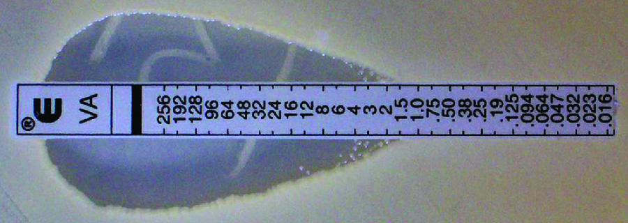

### Learning Objectives

* Describe how the Kirby-Bauer disk diffusion test determines the susceptibility of a microbe to an antibacterial drug.
* Explain the significance of the minimal inhibitory concentration and the minimal bactericidal concentration relative to the effectiveness of an antimicrobial drug.

Testing the effectiveness of antimicrobial drugs against specific organisms is important in identifying their **spectrum of activity**{: data-type="term" .no-emphasis} and the **therapeutic dosage**{: data-type="term" .no-emphasis}. This type of test, generally described as **antimicrobial susceptibility testing (AST)**{: data-type="term" .no-emphasis}, is commonly performed in a clinical laboratory. In this section, we will discuss common methods of testing the effectiveness of antimicrobials.

### The Kirby-Bauer Disk Diffusion Test

The **Kirby-Bauer disk diffusion test**{: data-type="term"} has long been used as a starting point for determining the susceptibility of specific microbes to various antimicrobial drugs. The Kirby-Bauer assay starts with a Mueller-Hinton agar plate on which a confluent lawn is inoculated with a patient’s isolated bacterial pathogen. Filter paper disks impregnated with known amounts of antibacterial drugs to be tested are then placed on the agar plate. As the bacterial inoculum grows, antibiotic diffuses from the circular disk into the agar and interacts with the growing bacteria. Antibacterial activity is observed as a clear circular **zone of inhibition**{: data-type="term"} around the drug-impregnated disk, similar to the disk-diffusion assay depicted in [\[link\]](/m58856#OSC_Microbio_13_04_Diskdiff). The diameter of the zone of inhibition, measured in millimeters and compared to a standardized chart, determines the susceptibility or resistance of the bacterial pathogen to the drug.

There are multiple factors that determine the size of a zone of inhibition in this assay, including drug solubility, rate of drug diffusion through agar, the thickness of the agar medium, and the drug concentration impregnated into the disk. Due to a lack of standardization of these factors, interpretation of the Kirby-Bauer disk diffusion assay provides only limited information on susceptibility and resistance to the drugs tested. The assay cannot distinguish between bacteriostatic and bactericidal activities, and differences in zone sizes cannot be used to compare drug potencies or efficacies. Comparison of zone sizes to a standardized chart will only provide information on the antibacterials to which a bacterial pathogen is susceptible or resistant.

* How does one use the information from a Kirby-Bauer assay to predict the therapeutic effectiveness of an antimicrobial drug in a patient?
{: data-bullet-style="bullet"}

Antibiograms: Taking Some of the Guesswork Out of Prescriptions

Unfortunately, infectious diseases don’t take a time-out for lab work. As a result, physicians rarely have the luxury of conducting susceptibility testing before they write a prescription. Instead, they rely primarily on the empirical evidence (i.e., the signs and symptoms of disease) and their professional experience to make an educated guess as to the diagnosis, causative agent(s), and drug most likely to be effective. This approach allows treatment to begin sooner so the patient does not have to wait for lab test results. In many cases, the prescription is effective; however, in an age of increased antimicrobial resistance, it is becoming increasingly more difficult to select the most appropriate empiric therapy. Selecting an inappropriate empiric therapy not only puts the patient at risk but may promote greater resistance to the drug prescribed.

Recently, studies have shown that antibiograms are useful tools in the decision-making process of selecting appropriate empiric therapy. An **antibiogram**{: data-type="term"} is a compilation of local antibiotic susceptibility data broken down by bacterial pathogen. In a November 2014 study published in the journal *Infection Control and Hospital Epidemiology*, researchers determined that 85% of the prescriptions ordered in skilled nursing facilities were decided upon empirically, but only 35% of those prescriptions were deemed appropriate when compared with the eventual pathogen identification and susceptibility profile obtained from the clinical laboratory. However, in one nursing facility where use of antibiograms was implemented to direct selection of empiric therapy, appropriateness of empiric therapy increased from 32% before antibiogram implementation to 45% after implementation of antibiograms.[1](#footnote1){: data-type="footnote-link"} Although these data are preliminary, they do suggest that health-care facilities can reduce the number of inappropriate prescriptions by using antibiograms to select empiric therapy, thus benefiting patients and minimizing opportunities for antimicrobial resistance to develop.

Visit this website to view an [interactive antibiogram][1] provided by Stanford University.

### Dilution Tests

As discussed, the limitations of the Kirby-Bauer disk diffusion test do not allow for a direct comparison of antibacterial potencies to guide selection of the best therapeutic choice. However, antibacterial dilution tests can be used to determine a particular drug’s **minimal inhibitory concentration (MIC)**{: data-type="term"}, the lowest concentration of drug that inhibits visible bacterial growth, and **minimal bactericidal concentration (MBC)**{: data-type="term"}, the lowest drug concentration that kills ≥99.9% of the starting inoculum. Determining these concentrations helps identify the correct drug for a particular pathogen. For the macrobroth dilution assay, a dilution series of the drug in broth is made in test tubes and the same number of cells of a test bacterial strain is added to each tube ([\[link\]](#OSC_Microbio_14_05_MIC)). The MIC is determined by examining the tubes to find the lowest drug concentration that inhibits visible growth; this is observed as turbidity (cloudiness) in the broth. Tubes with no visible growth are then inoculated onto agar media without antibiotic to determine the MBC. Generally, serum levels of an antibacterial should be at least three to five times above the MIC for treatment of an infection.

The MIC assay can also be performed using 96-well microdilution trays, which allow for the use of small volumes and automated dispensing devices, as well as the testing of multiple antimicrobials and/or microorganisms in one tray ([\[link\]](#OSC_Microbio_14_05_microdilut)). MICs are interpreted as the lowest concentration that inhibits visible growth, the same as for the macrobroth dilution in test tubes. Growth may also be interpreted visually or by using a **spectrophotometer**{: data-type="term" .no-emphasis} or similar device to detect turbidity or a color change if an appropriate biochemical substrate that changes color in the presence of bacterial growth is also included in each well.

The **Etest**{: data-type="term"} is an alternative method used to determine MIC, and is a combination of the **Kirby-Bauer disk diffusion test**{: data-type="term" .no-emphasis} and dilution methods. Similar to the Kirby-Bauer assay, a confluent lawn of a bacterial isolate is inoculated onto the surface of an agar plate. Rather than using circular disks impregnated with one concentration of drug, however, commercially available plastic strips that contain a gradient of an antibacterial are placed on the surface of the inoculated agar plate ([\[link\]](#OSC_Microbio_14_05_Etest)). As the bacterial inoculum grows, antibiotic diffuses from the plastic strips into the agar and interacts with the bacterial cells. Because the rate of drug diffusion is directly related to concentration, an elliptical **zone of inhibition**{: data-type="term" .no-emphasis} is observed with the Etest drug gradient, rather than a circular zone of inhibition observed with the Kirby-Bauer assay. To interpret the results, the intersection of the elliptical zone with the gradient on the drug-containing strip indicates the MIC. Because multiple strips containing different antimicrobials can be placed on the same plate, the MIC of multiple antimicrobials can be determined concurrently and directly compared. However, unlike the macrobroth and microbroth dilution methods, the MBC cannot be determined with the Etest.

  is the MIC. In this example, the MIC is 8 &#x3BC;g/mL. Broth from samples without turbidity can be inoculated onto plates lacking the antimicrobial drug. The lowest dilution that kills &#x2265;99.9% of the starting inoculum is observed on the plates is the MBC. (credit: modification of work by Suzanne Wakim)"){: #OSC_Microbio_14_05_MIC}

"){: #OSC_Microbio_14_05_microdilut}

{: #OSC_Microbio_14_05_Etest}

* Compare and contrast MIC and MBC.
{: data-bullet-style="bullet"}

Resolution

Marisa’s UTI was likely caused by the catheterizations she had in Vietnam. Most bacteria that cause UTIs are members of the normal gut microbiota, but they can cause infections when introduced to the urinary tract, as might have occurred when the catheter was inserted. Alternatively, if the catheter itself was not sterile, bacteria on its surface could have been introduced into Marisa’s body. The antimicrobial therapy Marisa received in Cambodia may also have been a complicating factor because it may have selected for antimicrobial-resistant strains already present in her body. These bacteria would have already contained genes for antimicrobial resistance, either acquired by spontaneous mutation or through horizontal gene transfer, and, therefore, had the best evolutionary advantage for adaptation and growth in the presence of the antimicrobial therapy. As a result, one of these resistant strains may have been subsequently introduced into her urinary tract.

Laboratory testing at the CDC confirmed that the strain of ***Klebsiella pneumoniae***{: data-type="term" .no-emphasis} from Marisa’s urine sample was positive for the presence of NDM, a very active **carbapenemase**{: data-type="term" .no-emphasis} that is beginning to emerge as a new problem in antimicrobial resistance. While NDM-positive strains are resistant to a wide range of antimicrobials, they have shown susceptibility to **tigecycline**{: data-type="term" .no-emphasis} (structurally related to **tetracycline**{: data-type="term" .no-emphasis}) and the **polymyxins**{: data-type="term" .no-emphasis} B and E (**colistin**{: data-type="term" .no-emphasis}).

To prevent her infection from spreading, Marisa was isolated from the other patients in a separate room. All hospital staff interacting with her were advised to follow strict protocols to prevent surface and equipment contamination. This would include especially stringent hand hygiene practices and careful disinfection of all items coming into contact with her.

Marisa’s infection finally responded to tigecycline and eventually cleared. She was discharged a few weeks after admission, and a follow-up stool sample showed her stool to be free of NDM-containing *K. pneumoniae*, meaning that she was no longer harboring the highly resistant bacterium.

*Go back to the [previous](/m58862#fs-id1167661779255) Clinical Focus box.*

### Key Concepts and Summary

* The **Kirby-Bauer disk diffusion** test helps determine the susceptibility of a microorganism to various antimicrobial drugs. However, the **zones of inhibition** measured must be correlated to known standards to determine susceptibility and resistance, and do not provide information on bactericidal versus bacteriostatic activity, or allow for direct comparison of drug potencies.
* Antibiograms are useful for monitoring local trends in antimicrobial resistance/susceptibility and for directing appropriate selection of empiric antibacterial therapy.
* There are several laboratory methods available for determining the **minimum inhibitory concentration (MIC)** of an antimicrobial drug against a specific microbe. The **minimal bactericidal concentration (MBC)** can also be determined, typically as a follow-up experiment to MIC determination using the tube dilution method.
{: data-bullet-style="bullet"}

### Multiple Choice

In the Kirby-Bauer disk diffusion test, the \_\_\_\_\_\_\_ of the zone of inhibition is measured and used for interpretation.

1.  diameter
2.  microbial population
3.  circumference
4.  depth
{: data-number-style="upper-alpha"}

A

Which of the following techniques cannot be used to determine the minimum inhibitory concentration of an antimicrobial drug against a particular microbe?

1.  Etest
2.  microbroth dilution test
3.  Kirby-Bauer disk diffusion test
4.  macrobroth dilution test
{: data-number-style="upper-alpha"}

C

The utility of an antibiogram is that it shows antimicrobial susceptibility trends

1.  over a large geographic area.
2.  for an individual patient.
3.  in research laboratory strains.
4.  in a localized population.
{: data-number-style="upper-alpha"}

D

### Fill in the Blank

The method that can determine the MICs of multiple antimicrobial drugs against a microbial strain using a single agar plate is called the \_\_\_\_\_\_\_\_.

Etest

### True/False

If drug A produces a larger zone of inhibition than drug B on the Kirby-Bauer disk diffusion test, drug A should always be prescribed.

false

### Short Answer

How is the information from a Kirby-Bauer disk diffusion test used for the recommendation of the clinical use of an antimicrobial drug?

What is the difference between MIC and MBC?

### Critical Thinking

Can an Etest be used to find the MBC of a drug? Explain.

### Footnotes
{: data-type="footnote-refs-title"}

* {: data-type="footnote-ref" #footnote1} [1](#footnote-ref1){: data-type="footnote-ref-link"} J.P. Furuno et al. “Using Antibiograms to Improve Antibiotic Prescribing in Skilled Nursing Facilities.” *Infection Control and Hospital Epidemiology* 35 no. Suppl S3 (2014):S56–61.
{: data-list-type="bulleted" data-bullet-style="none"}

[1]: https://openstax.org/l/22StanUnintanti
