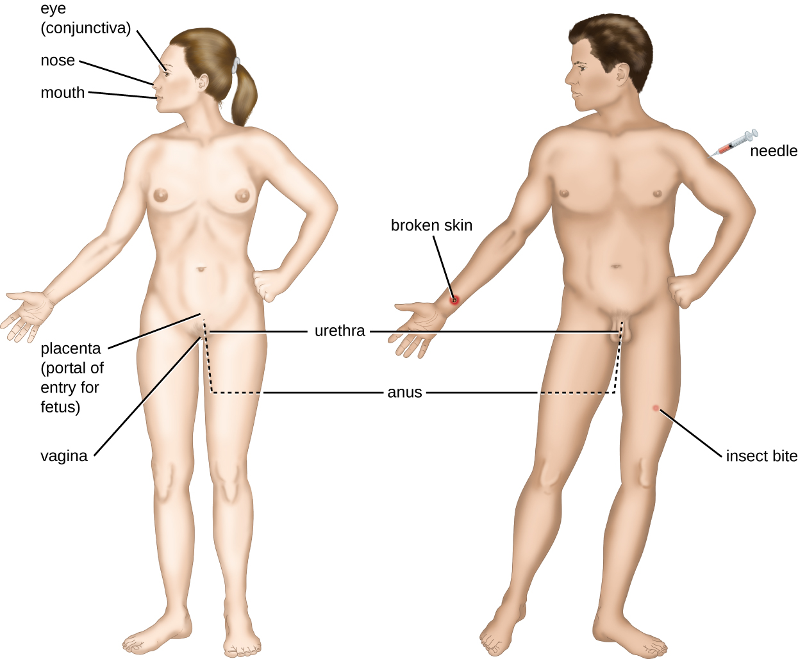
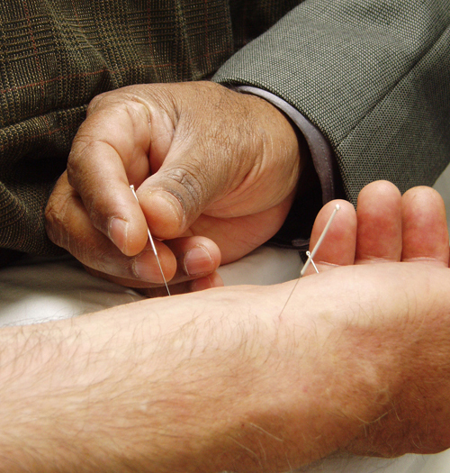

# Learning Objectives

* Summarize Koch’s postulates and molecular Koch’s postulates, respectively, and explain their significance and limitations
* Explain the concept of pathogenicity (virulence) in terms of infectious and lethal dose
* Distinguish between primary and opportunistic pathogens and identify specific examples of each
* Summarize the stages of pathogenesis
* Explain the roles of portals of entry and exit in the transmission of disease and identify specific examples of these portals

For most infectious diseases, the ability to accurately identify the causative pathogen is a critical step in finding or prescribing effective treatments. Today’s physicians, patients, and researchers owe a sizable debt to the physician Robert Koch (1843–1910), who devised a systematic approach for confirming causative relationships between diseases and specific pathogens.

# Koch’s Postulates

In 1884, Koch published four postulates ([\[link\]](#fs-id1167586048013)) that summarized his method for determining whether a particular microorganism was the cause of a particular disease. Each of **Koch’s postulates**{: data-type="term" .no-emphasis} represents a criterion that must be met before a disease can be positively linked with a pathogen. In order to determine whether the criteria are met, tests are performed on laboratory animals and cultures from healthy and diseased animals are compared ([\[link\]](#OSC_Microbio_15_01_Koch)).

| Koch’s Postulates |
|----------
| (1) The suspected pathogen must be found in every case of disease and not be found in healthy individuals. |
{: valign="top"}| (2) The suspected pathogen can be isolated and grown in pure culture. |
{: valign="top"}| (3) A healthy test subject infected with the suspected pathogen must develop the same signs and symptoms of disease as seen in postulate 1. |
{: valign="top"}| (4) The pathogen must be re-isolated from the new host and must be identical to the pathogen from postulate 2. |
{: valign="top"}{: summary="A table labeled Koch&#x2019;s postulates. (1) The suspected pathogen must be found in every case of disease and not be found in healthy individuals. (2) The suspected pathogen can be isolated and grown in pure culture. (3) A healthy test subject infected with the suspected pathogen must develop the same signs and symptoms of disease as seen in postulate 1. (4) The pathogen must be re-isolated from the new host and must be identical to the pathogen from postulate 2." .span-all}

 ![A diagram Koch&#x2019;s postulates. 1 &#x2013; The suspected causative agent must be absent from all healthy organisms but present in all diseased organisms. This is demonstrated by looking at slides under a microscope from a sick mouse and seeing the suspected agent. A slide from a healthy mouse only shows healthy red blood cells. 2 &#x2013; The causative agent must be isolated from the diseased organism and grown in pure culture. This is demonstrated by showing grown on a petri plate from the sick mouse and no growth from the healthy mouse.  3 &#x2013; The cultured agend must cause the same disease when inoculated into a healthy, susceptible organism. This is demonstrated by injecting a healthy mouse with the cultured agent and having that mouse get sick. 4 &#x2013; The same causative agent must then be reisolated from the inoculated diseased organism. This is demonstrated by a petri plate from this last mouse showing growth of the causative agent.](../resources/OSC_Microbio_15_01_Koch.jpg "The steps for confirming that a pathogen is the cause of a particular disease using Koch&#x2019;s postulates."){: #OSC_Microbio_15_01_Koch}

In many ways, Koch’s postulates are still central to our current understanding of the causes of disease. However, advances in microbiology have revealed some important limitations in Koch’s criteria. Koch made several assumptions that we now know are untrue in many cases. The first relates to postulate 1, which assumes that pathogens are only found in diseased, not healthy, individuals. This is not true for many pathogens. For example, *H. pylori*, described earlier in this chapter as a pathogen causing chronic gastritis, is also part of the normal microbiota of the stomach in many healthy humans who never develop gastritis. It is estimated that upwards of 50% of the human population acquires *H. pylori* early in life, with most maintaining it as part of the normal microbiota for the rest of their life without ever developing disease.

Koch’s second faulty assumption was that all healthy test subjects are equally susceptible to disease. We now know that individuals are not equally susceptible to disease. Individuals are unique in terms of their microbiota and the state of their immune system at any given time. The makeup of the resident microbiota can influence an individual’s susceptibility to an infection. Members of the normal microbiota play an important role in immunity by inhibiting the growth of transient pathogens. In some cases, the microbiota may prevent a pathogen from establishing an infection; in others, it may not prevent an infection altogether but may influence the severity or type of signs and symptoms. As a result, two individuals with the same disease may not always present with the same signs and symptoms. In addition, some individuals have stronger immune systems than others. Individuals with immune systems weakened by age or an unrelated illness are much more susceptible to certain infections than individuals with strong immune systems.

Koch also assumed that all pathogens are microorganisms that can be grown in pure culture (postulate 2) and that animals could serve as reliable models for human disease. However, we now know that not all pathogens can be grown in pure culture, and many human diseases cannot be reliably replicated in animal hosts. Viruses and certain bacteria, including ***Rickettsia***{: data-type="term" .no-emphasis} and ***Chlamydia***{: data-type="term" .no-emphasis}, are obligate intracellular pathogens that can grow only when inside a host cell. If a microbe cannot be cultured, a researcher cannot move past postulate 2. Likewise, without a suitable nonhuman host, a researcher cannot evaluate postulate 2 without deliberately infecting humans, which presents obvious ethical concerns. AIDS is an example of such a disease because the human immunodeficiency virus (HIV) only causes disease in humans.

* Briefly summarize the limitations of Koch’s postulates.
{: data-bullet-style="bullet"}

# Molecular Koch’s Postulates

In 1988, Stanley **Falkow**{: data-type="term" .no-emphasis} (1934–) proposed a revised form of Koch’s postulates known as **molecular Koch’s postulates**{: data-type="term" .no-emphasis}. These are listed in the left column of [\[link\]](#fs-id1167582747952). The premise for molecular Koch’s postulates is not in the ability to isolate a particular pathogen but rather to identify a gene that may cause the organism to be pathogenic.

Falkow’s modifications to Koch’s original postulates explain not only infections caused by intracellular pathogens but also the existence of pathogenic strains of organisms that are usually nonpathogenic. For example, the predominant form of the bacterium ***Escherichia coli***{: data-type="term" .no-emphasis} is a member of the normal microbiota of the human intestine and is generally considered harmless. However, there are pathogenic strains of *E. coli* such as enterotoxigenic *E. coli* (**ETEC**{: data-type="term" .no-emphasis}) and **enterohemorrhagic *E. coli* (O157:H7)**{: data-type="term" .no-emphasis} (EHEC). We now know ETEC and **EHEC**{: data-type="term" .no-emphasis} exist because of the acquisition of new genes by the once-harmless *E. coli*, which, in the form of these pathogenic strains, is now capable of producing toxins and causing illness. The pathogenic forms resulted from minor genetic changes. The right-side column of [\[link\]](#fs-id1167582747952) illustrates how molecular Koch’s postulates can be applied to identify EHEC as a pathogenic bacterium.

<table summary="A table titled Molecular Koch&#x2019;s postulates applied to EHEC; two columns: molecular Koch&#x2019;s postulates and application to EHEC.  (1) The phenotype (sign or symptom of disease) should be associated only with pathogenic strains of a species. The application: EHEC causes intestinal inflammation and diarrhea, whereas nonpathogenic strains of E. coli do not. (2) Inactivation of the suspected gene(s) associated with pathogenicity should result in a measurable loss of pathogenicity. The application: One of the genes in EHEC encodes for Shiga toxin, a bacterial toxin (poison) that inhibits protein synthesis. Inactivating this gene reduces the bacteria&#x2019;s ability to cause disease. (3) Reversion of the inactive gene should restore the disease phenotype. The application: By adding the gene that encodes the toxin back into the genome (e.g., with a phage or plasmid), EHEC&#x2019;s ability to cause disease is restored." class="span-all"><thead>
<tr>
<th colspan="2" data-align="center">Molecular Koch’s Postulates Applied to EHEC</th>
</tr>
<tr valign="top">
<th data-valign="top" data-align="left">Molecular Koch’s Postulates</th>
<th data-valign="top" data-align="left">Application to EHEC</th>
</tr>
</thead><tbody>
<tr valign="top">
<td data-valign="top" data-align="left">(1) The phenotype (sign or symptom of disease) should be associated only with pathogenic strains of a species.</td>
<td data-valign="top" data-align="left">EHEC causes intestinal inflammation and diarrhea, whereas nonpathogenic strains of <em>E. coli</em> do not.</td>
</tr>
<tr valign="top">
<td data-valign="top" data-align="left">(2) Inactivation of the suspected gene(s) associated with pathogenicity should result in a measurable loss of pathogenicity.</td>
<td data-valign="top" data-align="left">One of the genes in EHEC encodes for Shiga toxin, a bacterial toxin (poison) that inhibits protein synthesis. Inactivating this gene reduces the bacteria’s ability to cause disease.</td>
</tr>
<tr valign="top">
<td data-valign="top" data-align="left">(3) Reversion of the inactive gene should restore the disease phenotype.</td>
<td data-valign="top" data-align="left">By adding the gene that encodes the toxin back into the genome (e.g., with a phage or plasmid), EHEC’s ability to cause disease is restored.</td>
</tr>
</tbody></table>

As with Koch’s original postulates, the molecular Koch’s postulates have limitations. For example, genetic manipulation of some pathogens is not possible using current methods of molecular genetics. In a similar vein, some diseases do not have suitable animal models, which limits the utility of both the original and molecular postulates.

* Explain the differences between Koch’s original postulates and the molecular Koch’s postulates.
{: data-bullet-style="bullet"}

# Pathogenicity and Virulence

The ability of a microbial agent to cause disease is called **pathogenicity**{: data-type="term"}, and the degree to which an organism is pathogenic is called **virulence**{: data-type="term"}. Virulence is a continuum. On one end of the spectrum are organisms that are avirulent (not harmful) and on the other are organisms that are highly virulent. Highly virulent pathogens will almost always lead to a disease state when introduced to the body, and some may even cause multi-organ and body system failure in healthy individuals. Less virulent pathogens may cause an initial infection, but may not always cause severe illness. Pathogens with low virulence would more likely result in mild signs and symptoms of disease, such as low-grade fever, headache, or muscle aches. Some individuals might even be asymptomatic.

An example of a highly virulent microorganism is ***Bacillus anthracis***{: data-type="term" .no-emphasis}, the pathogen responsible for **anthrax**{: data-type="term" .no-emphasis}. *B. anthracis* can produce different forms of disease, depending on the route of transmission (e.g., cutaneous injection, inhalation, ingestion). The most serious form of anthrax is inhalation anthrax. After *B. anthracis* spores are inhaled, they germinate. An active infection develops and the bacteria release potent toxins that cause edema (fluid buildup in tissues), hypoxia (a condition preventing oxygen from reaching tissues), and necrosis (cell death and inflammation). Signs and symptoms of inhalation anthrax include high fever, difficulty breathing, vomiting and coughing up blood, and severe chest pains suggestive of a heart attack. With inhalation anthrax, the toxins and bacteria enter the bloodstream, which can lead to multi-organ failure and death of the patient. If a gene (or genes) involved in pathogenesis is inactivated, the bacteria become less virulent or nonpathogenic.

Virulence of a pathogen can be quantified using controlled experiments with laboratory animals. Two important indicators of virulence are the **median infectious dose (ID50)**{: data-type="term"} and the **median lethal dose (LD50)**{: data-type="term"}, both of which are typically determined experimentally using animal models. The **ID50**{: data-type="term" .no-emphasis} is the number of pathogen cells or virions required to cause active infection in 50% of inoculated animals. The **LD50**{: data-type="term" .no-emphasis} is the number of pathogenic cells, virions, or amount of toxin required to kill 50% of infected animals. To calculate these values, each group of animals is inoculated with one of a range of known numbers of pathogen cells or virions. In graphs like the one shown in [\[link\]](#OSC_Microbio_15_02_PopCurve), the percentage of animals that have been infected (for ID50) or killed (for LD50) is plotted against the concentration of pathogen inoculated. [\[link\]](#OSC_Microbio_15_02_PopCurve) represents data graphed from a hypothetical experiment measuring the LD50 of a pathogen. Interpretation of the data from this graph indicates that the LD50 of the pathogen for the test animals is 104 pathogen cells or virions (depending upon the pathogen studied).

 {: #OSC_Microbio_15_02_PopCurve}

[\[link\]](#fs-id1167582435824) lists selected foodborne pathogens and their ID50 values in humans (as determined from epidemiologic data and studies on human volunteers). Keep in mind that these are *median* values. The actual infective dose for an individual can vary widely, depending on factors such as route of entry; the age, health, and immune status of the host; and environmental and pathogen-specific factors such as susceptibility to the acidic pH of the stomach. It is also important to note that a pathogen’s infective dose does not necessarily correlate with disease severity. For example, just a single cell of ***Salmonella enterica***{: data-type="term" .no-emphasis} serotype Typhimurium can result in an active infection. The resultant disease, *Salmonella* gastroenteritis or **salmonellosis**{: data-type="term" .no-emphasis}, can cause nausea, vomiting, and diarrhea, but has a mortality rate of less than 1% in healthy adults. In contrast, *S. enterica* serotype Typhi has a much higher ID50, typically requiring as many as 1,000 cells to produce infection. However, this serotype causes **typhoid fever**{: data-type="term" .no-emphasis}, a much more systemic and severe disease that has a mortality rate as high as 10% in untreated individuals.

<table summary="A table labeled ID50 for selected foodborne diseases. Two columns: pathogen and ID50. Viruses. Hepatitis A virus: 10&#x2013;100. Norovirus: 1&#x2013;10. Rotavirus: 10&#x2013;100. Bacteria. Escherichia coli, enterohemorrhagic (EHEC, serotype O157): 10&#x2013;100. E. coli, enteroinvasive (EIEC): 200&#x2013;5,000. E. coli, enteropathogenic (EPEC): 10,000,000&#x2013;10,000,000,000. E. coli, enterotoxigenic (ETEC): 10,000,000&#x2013;10,000,000,000. Salmonella enterica serovar Typhi: &lt;1,000. S. enterica serovar Typhimurium: &#x2265;1. Shigella dysenteriae: 10&#x2013;200. Vibrio cholerae (serotypes O139, O1): 1,000,000. V. parahemolyticus: 100,000,000. Protozoa. Giardia lamblia: 1. Cryptosporidium parvum: 10&#x2013;100." class="span-all"><thead>
<tr>
<th colspan="2" data-align="center">ID50 for Selected Foodborne Diseases<a data-type="footnote-number" name="footnote-ref1" href="#footnote1">1</a></th>
</tr>
<tr valign="top">
<th data-valign="top" data-align="center">Pathogen</th>
<th data-valign="top" data-align="center">ID50</th>
</tr>
</thead><tbody>
<tr valign="top">
<td colspan="2" data-valign="top" data-align="center">Viruses</td>
</tr>
<tr valign="top">
<td data-valign="top" data-align="left">Hepatitis A virus</td>
<td data-valign="top" data-align="center">10–100</td>
</tr>
<tr valign="top">
<td data-valign="top" data-align="left">Norovirus</td>
<td data-valign="top" data-align="center">1–10</td>
</tr>
<tr valign="top">
<td data-valign="top" data-align="left">Rotavirus</td>
<td data-valign="top" data-align="center">10–100</td>
</tr>
<tr valign="top">
<td colspan="2" data-valign="top" data-align="center">Bacteria</td>
</tr>
<tr valign="top">
<td data-valign="top" data-align="left"><em>Escherichia coli</em>, enterohemorrhagic (EHEC, serotype O157)</td>
<td data-valign="top" data-align="center">10–100</td>
</tr>
<tr valign="top">
<td data-valign="top" data-align="left"><em>E. coli</em>, enteroinvasive (EIEC)</td>
<td data-valign="top" data-align="center">200–5,000</td>
</tr>
<tr valign="top">
<td data-valign="top" data-align="left"><em>E. coli</em>, enteropathogenic (EPEC)</td>
<td data-valign="top" data-align="center">10,000,000–10,000,000,000</td>
</tr>
<tr valign="top">
<td data-valign="top" data-align="left"><em>E. coli</em>, enterotoxigenic (ETEC)</td>
<td data-valign="top" data-align="center">10,000,000–10,000,000,000</td>
</tr>
<tr valign="top">
<td data-valign="top" data-align="left"><em>Salmonella enterica</em> serovar Typhi</td>
<td data-valign="top" data-align="center">&lt;1,000</td>
</tr>
<tr valign="top">
<td data-valign="top" data-align="left"><em>S. enterica</em> serovar Typhimurium</td>
<td data-valign="top" data-align="center">≥1</td>
</tr>
<tr valign="top">
<td data-valign="top" data-align="left"><em>Shigella dysenteriae</em></td>
<td data-valign="top" data-align="center">10–200</td>
</tr>
<tr valign="top">
<td data-valign="top" data-align="left"><em>Vibrio cholerae</em> (serotypes O139, O1)</td>
<td data-valign="top" data-align="center">1,000,000</td>
</tr>
<tr valign="top">
<td data-valign="top" data-align="left"><em>V. parahemolyticus</em></td>
<td data-valign="top" data-align="center">100,000,000</td>
</tr>
<tr valign="top">
<td colspan="2" data-valign="top" data-align="center">Protozoa</td>
</tr>
<tr valign="top">
<td data-valign="top" data-align="left"><em>Giardia lamblia</em></td>
<td data-valign="top" data-align="center">1</td>
</tr>
<tr valign="top">
<td data-valign="top" data-align="left"><em>Cryptosporidium parvum</em></td>
<td data-valign="top" data-align="center">10–100</td>
</tr>
</tbody></table>

* What is the difference between a pathogen’s infective dose and lethal dose?
* Which is more closely related to the severity of a disease?
{: data-bullet-style="bullet"}

# Primary Pathogens versus Opportunistic Pathogens

Pathogens can be classified as either primary pathogens or opportunistic pathogens. A **primary pathogen**{: data-type="term"} can cause disease in a host regardless of the host’s resident microbiota or immune system. An **opportunistic pathogen**{: data-type="term"}, by contrast, can only cause disease in situations that compromise the host’s defenses, such as the body’s protective barriers, immune system, or normal microbiota. Individuals susceptible to opportunistic infections include the very young, the elderly, women who are pregnant, patients undergoing chemotherapy, people with immunodeficiencies (such as acquired immunodeficiency syndrome \[AIDS\]), patients who are recovering from surgery, and those who have had a breach of protective barriers (such as a severe wound or burn).

An example of a primary pathogen is enterohemorrhagic *E. coli* (**EHEC**{: data-type="term" .no-emphasis}), which produces a virulence factor known as **Shiga toxin**{: data-type="term" .no-emphasis}. This toxin inhibits protein synthesis, leading to severe and bloody diarrhea, inflammation, and renal failure, even in patients with healthy immune systems. ***Staphylococcus epidermidis***{: data-type="term" .no-emphasis}, on the other hand, is an opportunistic pathogen that is among the most frequent causes of nosocomial disease.[2](#footnote2){: data-type="footnote-number" name="footnote-ref2"} *S. epidermidis* is a member of the normal microbiota of the skin, where it is generally avirulent. However, in hospitals, it can also grow in biofilms that form on catheters, implants, or other devices that are inserted into the body during surgical procedures. Once inside the body, *S. epidermidis* can cause serious infections such as endocarditis, and it produces virulence factors that promote the persistence of such infections.

Other members of the normal microbiota can also cause opportunistic infections under certain conditions. This often occurs when microbes that reside harmlessly in one body location end up in a different body system, where they cause disease. For example, *E. coli* normally found in the large intestine can cause a urinary tract infection if it enters the bladder. This is the leading cause of urinary tract infections among women.

Members of the normal microbiota may also cause disease when a shift in the environment of the body leads to overgrowth of a particular microorganism. For example, the yeast ***Candida***{: data-type="term" .no-emphasis} is part of the normal microbiota of the skin, mouth, intestine, and vagina, but its population is kept in check by other organisms of the microbiota. If an individual is taking antibacterial medications, however, bacteria that would normally inhibit the growth of *Candida* can be killed off, leading to a sudden growth in the population of *Candida*, which is not affected by antibacterial medications because it is a fungus. An overgrowth of *Candida* can manifest as **oral thrush**{: data-type="term" .no-emphasis} (growth on mouth, throat, and tongue), a vaginal **yeast infection**{: data-type="term" .no-emphasis}, or **cutaneous candidiasis**{: data-type="term" .no-emphasis}. Other scenarios can also provide opportunities for *Candida* infections. Untreated **diabetes**{: data-type="term" .no-emphasis} can result in a high concentration of glucose in the saliva, which provides an optimal environment for the growth of *Candida,* resulting in thrush. Immunodeficiencies such as those seen in patients with HIV, AIDS, and cancer also lead to higher incidence of thrush. Vaginal yeast infections can result from decreases in estrogen levels during the menstruation or menopause. The amount of glycogen available to lactobacilli in the vagina is controlled by levels of estrogen; when estrogen levels are low, lactobacilli produce less lactic acid. The resultant increase in vaginal pH allows overgrowth of *Candida* in the vagina.

* Explain the difference between a primary pathogen and an opportunistic pathogen.
* Describe some conditions under which an opportunistic infection can occur.
{: data-bullet-style="bullet"}

# Stages of Pathogenesis

To cause disease, a pathogen must successfully achieve four steps or **stages of pathogenesis**{: data-type="term" .no-emphasis}\: exposure (contact), adhesion (colonization), invasion, and infection. The pathogen must be able to gain entry to the host, travel to the location where it can establish an infection, evade or overcome the host’s immune response, and cause damage (i.e., disease) to the host. In many cases, the cycle is completed when the pathogen exits the host and is transmitted to a new host.

## Exposure

An encounter with a potential pathogen is known as **exposure**{: data-type="term"} or **contact**{: data-type="term"}. The food we eat and the objects we handle are all ways that we can come into contact with potential pathogens. Yet, not all contacts result in infection and disease. For a pathogen to cause disease, it needs to be able to gain access into host tissue. An anatomic site through which pathogens can pass into host tissue is called a **portal of entry**{: data-type="term"}. These are locations where the host cells are in direct contact with the external environment. Major portals of entry are identified in [\[link\]](#OSC_Microbio_15_02_Portal) and include the skin, mucous membranes, and parenteral routes.

 {: #OSC_Microbio_15_02_Portal}

Mucosal surfaces are the most important portals of entry for microbes; these include the mucous membranes of the respiratory tract, the gastrointestinal tract, and the genitourinary tract. Although most mucosal surfaces are in the interior of the body, some are contiguous with the external skin at various body openings, including the eyes, nose, mouth, urethra, and anus.

Most pathogens are suited to a particular portal of entry. A pathogen’s **portal specificity**{: data-type="term" .no-emphasis} is determined by the organism’s environmental adaptions and by the enzymes and toxins they secrete. The respiratory and gastrointestinal tracts are particularly vulnerable portals of entry because particles that include microorganisms are constantly inhaled or ingested, respectively.

Pathogens can also enter through a breach in the protective barriers of the skin and mucous membranes. Pathogens that enter the body in this way are said to enter by the **parenteral route**{: data-type="term"}. For example, the skin is a good natural barrier to pathogens, but breaks in the skin (e.g., wounds, insect bites, animal bites, needle pricks) can provide a parenteral portal of entry for microorganisms.

In pregnant women, the **placenta**{: data-type="term" .no-emphasis} normally prevents microorganisms from passing from the mother to the fetus. However, a few pathogens are capable of crossing the blood-placental barrier. The gram-positive bacterium ***Listeria monocytogenes***{: data-type="term" .no-emphasis}, which causes the foodborne disease listeriosis, is one example that poses a serious risk to the fetus and can sometimes lead to spontaneous abortion. Other pathogens that can pass the placental barrier to infect the fetus are known collectively by the acronym **TORCH**{: data-type="term" .no-emphasis} ([\[link\]](#fs-id1167585849239)).

Transmission of infectious diseases from mother to baby is also a concern at the time of birth when the baby passes through the birth canal. Babies whose mothers have active **chlamydia**{: data-type="term" .no-emphasis} or **gonorrhea**{: data-type="term" .no-emphasis} infections may be exposed to the causative pathogens in the vagina, which can result in eye infections that lead to blindness. To prevent this, it is standard practice to administer antibiotic drops to infants’ eyes shortly after birth.

<table summary="Table titled Pathogens Capable of Crossing the Placental Barrier (TORCH infections). Each letter of the word TORCH has a list of diseases and pathogens. T: Toxoplasmosis caused by  Toxoplasma gondii (protozoan). O: Syphilis (caused by Treponema pallidum (bacterium)), Chickenpox (caused by Varicella zoster virus (human herpesvirus 3), Hepatitis B, (caused by Hepatitis B virus (hepadnavirus)), HIV (caused by Retrovirus), Fifth disease (erythema infectiosum) (caused by Parvovirus B19). R: Rubella (German measles) caused by Togavirus. C: Cytomegalovirus caused by Human herpesvirus 5. H: Herpes caused by Herpes simplex viruses (HSV) 1 and 2." class="span-all"><thead>
<tr valign="top">
<th colspan="3" data-valign="top" data-align="center">Pathogens Capable of Crossing the Placental Barrier (TORCH Infections)</th>
</tr>
<tr valign="top">
<th data-valign="top" data-align="left"> </th>
<th data-valign="top" data-align="left">Disease</th>
<th data-valign="top" data-align="left">Pathogen</th>
</tr>
</thead><tbody>
<tr valign="top">
<td data-valign="top" data-align="left"><strong>T</strong></td>
<td data-valign="top" data-align="left">Toxoplasmosis</td>
<td data-valign="top" data-align="left"><em>Toxoplasma gondii</em> (protozoan)</td>
</tr>
<tr valign="top">
<td data-valign="middle" data-align="left"><strong>O</strong><a data-type="footnote-number" name="footnote-ref3" href="#footnote3">3</a></td>
<td data-valign="top" data-align="left">Syphilis
Chickenpox
Hepatitis B
HIV
Fifth disease (erythema infectiosum)</td>
<td data-valign="top" data-align="left"><em>Treponema pallidum</em> (bacterium)
Varicella-zoster virus (human herpesvirus 3)
Hepatitis B virus (hepadnavirus)
Retrovirus
Parvovirus B19</td>
</tr>
<tr valign="top">
<td data-valign="top" data-align="left"><strong>R</strong></td>
<td data-valign="top" data-align="left">Rubella (German measles)</td>
<td data-valign="top" data-align="left">Togavirus</td>
</tr>
<tr valign="top">
<td data-valign="top" data-align="left"><strong>C</strong></td>
<td data-valign="top" data-align="left">Cytomegalovirus</td>
<td data-valign="top" data-align="left">Human herpesvirus 5</td>
</tr>
<tr valign="top">
<td data-valign="top" data-align="left"><strong>H</strong></td>
<td data-valign="top" data-align="left">Herpes</td>
<td data-valign="top" data-align="left">Herpes simplex viruses (HSV) 1 and 2</td>
</tr>
</tbody></table>

Part 2

At the clinic, a physician takes down Michael’s medical history and asks about his activities and diet over the past week. Upon learning that Michael became sick the day after the party, the physician orders a blood test to check for pathogens associated with foodborne diseases. After tests confirm that presence of a gram-positive rod in Michael’s blood, he is given an injection of a broad-spectrum antibiotic and sent to a nearby hospital, where he is admitted as a patient. There he is to receive additional intravenous antibiotic therapy and fluids.

* Is this bacterium in Michael’s blood part of normal microbiota?
* What portal of entry did the bacteria use to cause this infection?
{: data-bullet-style="bullet"}

*Jump to the [next](/m58868#fs-id1167583838992) Clinical Focus box. Go back to the [previous](/m58866#fs-id1167585015680) Clinical Focus box.*

## Adhesion

Following the initial exposure, the pathogen adheres at the portal of entry. The term **adhesion**{: data-type="term"} refers to the capability of pathogenic microbes to attach to the cells of the body using **adhesion factors**{: data-type="term" .no-emphasis}, and different pathogens use various mechanisms to adhere to the cells of host tissues.

Molecules (either proteins or carbohydrates) called **adhesins**{: data-type="term"} are found on the surface of certain pathogens and bind to specific receptors (glycoproteins) on host cells. Adhesins are present on the fimbriae and flagella of bacteria, the cilia of protozoa, and the capsids or membranes of viruses. Protozoans can also use hooks and barbs for adhesion; spike proteins on viruses also enhance viral adhesion. The production of **glycocalyces**{: data-type="term" .no-emphasis} (slime layers and capsules) ([\[link\]](#OSC_Microbio_15_02_adhesion)), with their high sugar and protein content, can also allow certain bacterial pathogens to attach to cells.

Biofilm growth can also act as an adhesion factor. A **biofilm**{: data-type="term" .no-emphasis} is a community of bacteria that produce a glycocalyx, known as **extrapolymeric substance (EPS)**{: data-type="term" .no-emphasis}, that allows the biofilm to attach to a surface. Persistent ***Pseudomonas aeruginosa***{: data-type="term" .no-emphasis} infections are common in patients suffering from cystic fibrosis, burn wounds, and middle-ear infections (otitis media) because *P. aeruginosa* produces a biofilm. The EPS allows the bacteria to adhere to the host cells and makes it harder for the host to physically remove the pathogen. The EPS not only allows for attachment but provides protection against the immune system and antibiotic treatments, preventing antibiotics from reaching the bacterial cells within the biofilm. In addition, not all bacteria in a biofilm are rapidly growing; some are in stationary phase. Since antibiotics are most effective against rapidly growing bacteria, portions of bacteria in a biofilm are protected against antibiotics.[4](#footnote4){: data-type="footnote-number" name="footnote-ref4"}

 "){: #OSC_Microbio_15_02_adhesion}

## Invasion

Once adhesion is successful, **invasion**{: data-type="term"} can proceed. Invasion involves the dissemination of a pathogen throughout local tissues or the body. Pathogens may produce exoenzymes or toxins, which serve as **virulence factors**{: data-type="term" .no-emphasis} that allow them to colonize and damage host tissues as they spread deeper into the body. Pathogens may also produce virulence factors that protect them against immune system defenses. A pathogen’s specific virulence factors determine the degree of tissue damage that occurs. [\[link\]](#OSC_Microbio_15_02_Invasion) shows the invasion of *H. pylori* into the tissues of the stomach, causing damage as it progresses.

 ![Diagram of H. pylori invading the lining of the stomach. In the first image the H. pylori (an oval cell with 3 flagella is not able to penetrate the gastric mucin gel on top of the epithelial cells. Contact with stomach acid keeps the mucin lining the epithelial cell layer in a spongy gel-like state. This consistency is impermeable to the bacterium H. pylori. The second image shows the bacterium entering the lining. The bacterium releases urease, which neutralizes the stomach acid. This causes the mucin to liquefy and the bacterium can swim right through it.](../resources/OSC_Microbio_15_02_Invasion.jpg "H. pylori is able to invade the lining of the stomach by producing virulence factors that enable it pass through the mucin layer covering epithelial cells. (credit: modification of work by Zina Deretsky, National Science Foundation)"){: #OSC_Microbio_15_02_Invasion}

Intracellular pathogens achieve invasion by entering the host’s cells and reproducing. Some are **obligate intracellular pathogens**{: data-type="term" .no-emphasis} (meaning they can only reproduce inside of host cells) and others are **facultative intracellular pathogens**{: data-type="term" .no-emphasis} (meaning they can reproduce either inside or outside of host cells). By entering the host cells, intracellular pathogens are able to evade some mechanisms of the immune system while also exploiting the nutrients in the host cell.

Entry to a cell can occur by **endocytosis**{: data-type="term" .no-emphasis}. For most kinds of host cells, pathogens use one of two different mechanisms for endocytosis and entry. One mechanism relies on effector proteins secreted by the pathogen; these effector proteins trigger entry into the host cell. This is the method that ***Salmonella***{: data-type="term" .no-emphasis} and ***Shigella***{: data-type="term" .no-emphasis} use when invading intestinal epithelial cells. When these pathogens come in contact with epithelial cells in the intestine, they secrete effector molecules that cause protrusions of membrane ruffles that bring the bacterial cell in. This process is called **membrane ruffling**{: data-type="term" .no-emphasis}. The second mechanism relies on surface proteins expressed on the pathogen that bind to receptors on the host cell, resulting in entry. For example, ***Yersinia***{: data-type="term" .no-emphasis} *pseudotuberculosis* produces a surface protein known as **invasin**{: data-type="term" .no-emphasis} that binds to beta-1 integrins expressed on the surface of host cells.

Some host cells, such as white blood cells and other phagocytes of the immune system, actively endocytose pathogens in a process called phagocytosis. Although phagocytosis allows the pathogen to gain entry to the host cell, in most cases, the host cell kills and degrades the pathogen by using digestive enzymes. Normally, when a pathogen is ingested by a phagocyte, it is enclosed within a phagosome in the cytoplasm; the phagosome fuses with a lysosome to form a phagolysosome, where digestive enzymes kill the pathogen (see [Pathogen Recognition and Phagocytosis](/m58880){: .target-chapter}). However, some intracellular pathogens have the ability to survive and multiply within phagocytes. Examples include ***Listeria monocytogenes***{: data-type="term" .no-emphasis} and ***Shigella***{: data-type="term" .no-emphasis}; these bacteria produce proteins that lyse the phagosome before it fuses with the lysosome, allowing the bacteria to escape into the phagocyte’s cytoplasm where they can multiply. Bacteria such as ***Mycobacterium tuberculosis***{: data-type="term" .no-emphasis}, ***Legionella pneumophila***{: data-type="term" .no-emphasis}, and ***Salmonella***{: data-type="term" .no-emphasis} species use a slightly different mechanism to evade being digested by the phagocyte. These bacteria prevent the fusion of the phagosome with the lysosome, thus remaining alive and dividing within the phagosome.

## Infection

Following invasion, successful multiplication of the pathogen leads to infection. Infections can be described as local, focal, or systemic, depending on the extent of the infection. A **local infection**{: data-type="term"} is confined to a small area of the body, typically near the portal of entry. For example, a hair follicle infected by ***Staphylococcus aureus***{: data-type="term" .no-emphasis} infection may result in a boil around the site of infection, but the bacterium is largely contained to this small location. Other examples of local infections that involve more extensive tissue involvement include urinary tract infections confined to the bladder or pneumonia confined to the lungs.

In a **focal infection**{: data-type="term"}, a localized pathogen, or the toxins it produces, can spread to a secondary location. For example, a dental hygienist nicking the gum with a sharp tool can lead to a local infection in the gum by *Streptococcus* bacteria of the normal oral microbiota. These *Streptococcus* spp. may then gain access to the bloodstream and make their way to other locations in the body, resulting in a secondary infection.

When an infection becomes disseminated throughout the body, we call it a **systemic infection**{: data-type="term"}. For example, infection by the **varicella-zoster virus**{: data-type="term" .no-emphasis} typically gains entry through a mucous membrane of the upper respiratory system. It then spreads throughout the body, resulting in the classic red skin lesions associated with **chickenpox**{: data-type="term" .no-emphasis}. Since these lesions are not sites of initial infection, they are signs of a systemic infection.

Sometimes a **primary infection**{: data-type="term"}, the initial infection caused by one pathogen, can lead to a **secondary infection**{: data-type="term"} by another pathogen. For example, the immune system of a patient with a primary infection by **HIV**{: data-type="term" .no-emphasis} becomes compromised, making the patient more susceptible to secondary diseases like oral thrush and others caused by opportunistic pathogens. Similarly, a primary infection by **Influenzavirus**{: data-type="term" .no-emphasis} damages and decreases the defense mechanisms of the lungs, making patients more susceptible to a secondary pneumonia by a bacterial pathogen like ***Haemophilus influenzae***{: data-type="term" .no-emphasis} or ***Streptococcus pneumoniae***{: data-type="term" .no-emphasis}. Some secondary infections can even develop as a result of treatment for a primary infection. Antibiotic therapy targeting the primary pathogen can cause collateral damage to the normal microbiota, creating an opening for opportunistic pathogens (see [Case in Point: A Secondary Yeast Infection](#fs-id1167582689384)).

A Secondary Yeast Infection

Anita, a 36-year-old mother of three, goes to an urgent care center complaining of pelvic pressure, frequent and painful urination, abdominal cramps, and occasional blood-tinged urine. Suspecting a **urinary tract infection (UTI)**{: data-type="term" .no-emphasis}, the physician requests a urine sample and sends it to the lab for a urinalysis. Since it will take approximately 24 hours to get the results of the culturing, the physician immediately starts Anita on the antibiotic ciprofloxacin. The next day, the microbiology lab confirms the presence of *E. coli* in Anita’s urine, which is consistent with the presumptive diagnosis. However, the antimicrobial susceptibility test indicates that ciprofloxacin would not effectively treat Anita’s UTI, so the physician prescribes a different antibiotic.

After taking her antibiotics for 1 week, Anita returns to the clinic complaining that the prescription is not working. Although the painful urination has subsided, she is now experiencing vaginal itching, burning, and discharge. After a brief examination, the physician explains to Anita that the antibiotics were likely successful in killing the *E. coli* responsible for her UTI; however, in the process, they also wiped out many of the “good” bacteria in Anita’s normal microbiota. The new symptoms that Anita has reported are consistent with a secondary yeast infection by *Candida albicans*, an opportunistic fungus that normally resides in the vagina but is inhibited by the bacteria that normally reside in the same environment.

To confirm this diagnosis, a microscope slide of a direct vaginal smear is prepared from the discharge to check for the presence of yeast. A sample of the discharge accompanies this slide to the microbiology lab to determine if there has been an increase in the population of yeast causing vaginitis. After the microbiology lab confirms the diagnosis, the physician prescribes an antifungal drug for Anita to use to eliminate her secondary yeast infection.

* Why was *Candida* not killed by the antibiotics prescribed for the UTI?
{: data-bullet-style="bullet"}

* List three conditions that could lead to a secondary infection.
{: data-bullet-style="bullet"}

# Transmission of Disease

For a pathogen to persist, it must put itself in a position to be transmitted to a new host, leaving the infected host through a **portal of exit**{: data-type="term"} ([\[link\]](#OSC_Microbio_15_02_PortalExit)). As with portals of entry, many pathogens are adapted to use a particular portal of exit. Similar to portals of entry, the most common portals of exit include the skin and the respiratory, urogenital, and gastrointestinal tracts. Coughing and sneezing can expel pathogens from the respiratory tract. A single sneeze can send thousands of virus particles into the air. Secretions and excretions can transport pathogens out of other portals of exit. Feces, urine, semen, vaginal secretions, tears, sweat, and shed skin cells can all serve as vehicles for a pathogen to leave the body. Pathogens that rely on insect vectors for transmission exit the body in the blood extracted by a biting insect. Similarly, some pathogens exit the body in blood extracted by needles.

 {: #OSC_Microbio_15_02_PortalExit}

# Key Concepts and Summary

* **Koch’s postulates** are used to determine whether a particular microorganism is a pathogen. **Molecular Koch’s postulates** are used to determine what genes contribute to a pathogen’s ability to cause disease.
* **Virulence**, the degree to which a pathogen can cause disease, can be quantified by calculating either the **ID50** or **LD50** of a pathogen on a given population.
* **Primary pathogens** are capable of causing pathological changes associated with disease in a healthy individual, whereas **opportunistic pathogens** can only cause disease when the individual is compromised by a break in protective barriers or immunosuppression.
* Infections and disease can be caused by pathogens in the environment or microbes in an individual’s **resident microbiota**.
* Infections can be classified as **local**, **focal**, or **systemic** depending on the extent to which the pathogen spreads in the body.
* A **secondary infection** can sometimes occur after the host’s defenses or normal microbiota are compromised by a **primary infection** or antibiotic treatment.
* Pathogens enter the body through **portals of entry** and leave through **portals of exit**. The stages of pathogenesis include **exposure**, **adhesion**, **invasion**, **infection**, and **transmission**.
{: data-bullet-style="bullet"}

# Multiple Choice

Which of the following is a pathogen that could not be identified by the original Koch’s postulates?

1.  *Staphylococcus aureus*
2.  *Pseudomonas aeruginosa*
3.  Human immunodeficiency virus
4.  *Salmonella enterica* serovar Typhimurium
{: data-number-style="upper-alpha"}

C

Pathogen A has an ID50 of 50 particles, pathogen B has an ID50 of 1,000 particles, and pathogen C has an ID50 of 1 × 106 particles. Which pathogen is most virulent?

1.  pathogen A
2.  pathogen B
3.  pathogen C
{: data-number-style="upper-alpha"}

A

Which of the following choices lists the steps of pathogenesis in the correct order?

1.  invasion, infection, adhesion, exposure
2.  adhesion, exposure, infection, invasion
3.  exposure, adhesion, invasion, infection
4.  disease, infection, exposure, invasion
{: data-number-style="upper-alpha"}

C

# Fill in the Blank

A(n) \_\_\_\_\_\_\_\_\_\_ pathogen causes disease only when conditions are favorable for the microorganism because of transfer to an inappropriate body site or weakened immunity in an individual.

opportunistic

The concentration of pathogen needed to kill 50% of an infected group of test animals is the \_\_\_\_\_\_\_\_\_\_.

LD50

A(n) \_\_\_\_\_\_\_\_\_\_ infection is a small region of infection from which a pathogen may move to another part of the body to establish a second infection.

focal

Cilia, fimbriae, and pili are all examples of structures used by microbes for \_\_\_\_\_\_\_\_\_\_.

adhesion

# Critical Thinking

Diseases that involve biofilm-producing bacteria are of serious concern. They are not as easily treated compared with those involving free-floating (or planktonic) bacteria. Explain three reasons why biofilm formers are more pathogenic.

A microbiologist has identified a new gram-negative pathogen that causes liver disease in rats. She suspects that the bacterium’s fimbriae are a virulence factor. Describe how molecular Koch’s postulates could be used to test this hypothesis.

Acupuncture is a form of alternative medicine that is used for pain relief. Explain how acupuncture could facilitate exposure to pathogens.

  

## Footnotes
{: data-type="footnote-title"}

1.  [1](#footnote-ref1){: data-type="footnote-ref" name="footnote1"} Food and Drug Administration. “Bad Bug Book, Foodborne Pathogenic Microorganisms and Natural Toxins.” 2nd ed. Silver Spring, MD: US Food and Drug Administration; 2012.
2.  [2](#footnote-ref2){: data-type="footnote-ref" name="footnote2"} M. Otto. “*Staphylococcus epidermidis*--The ‘Accidental’ Pathogen.” *Nature Reviews Microbiology* 7 no. 8 (2009):555–567.
3.  [3](#footnote-ref3){: data-type="footnote-ref" name="footnote3"} The O in TORCH stands for “other.”
4.  [4](#footnote-ref4){: data-type="footnote-ref" name="footnote4"} D. Davies. “Understanding Biofilm Resistance to Antibacterial Agents.” *Nature Reviews Drug Discovery* 2 (2003):114–122.

