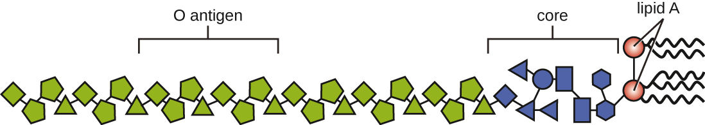

### Learning Objectives

* Explain how virulence factors contribute to signs and symptoms of infectious disease
* Differentiate between endotoxins and exotoxins
* Describe and differentiate between various types of exotoxins
* Describe the mechanisms viruses use for adhesion and antigenic variation

In the previous section, we explained that some pathogens are more virulent than others. This is due to the unique **virulence factor**{: data-type="term"}**s** produced by individual pathogens, which determine the extent and severity of disease they may cause. A pathogen’s virulence factors are encoded by genes that can be identified using molecular Koch’s postulates. When genes encoding virulence factors are inactivated, virulence in the pathogen is diminished. In this section, we examine various types and specific examples of virulence factors and how they contribute to each step of pathogenesis.

### Virulence Factors for Adhesion

As discussed in the previous section, the first two steps in pathogenesis are exposure and adhesion. Recall that an adhesin is a protein or glycoprotein found on the surface of a pathogen that attaches to receptors on the host cell. Adhesins are found on bacterial, viral, fungal, and protozoan pathogens. One example of a bacterial adhesin is **type 1 fimbrial adhesin**{: data-type="term" .no-emphasis}, a molecule found on the tips of fimbriae of enterotoxigenic *E. coli* (**ETEC**{: data-type="term" .no-emphasis}). Recall that fimbriae are hairlike protein bristles on the cell surface. Type 1 fimbrial adhesin allows the fimbriae of ETEC cells to attach to the mannose glycans expressed on intestinal epithelial cells. [\[link\]](#fs-id1167583600393) lists common adhesins found in some of the pathogens we have discussed or will be seeing later in this chapter.

<table summary="Table titled: Some bacterial adhesins and their host attachment sites. The table has 4 columns: pathogen, disease, adhesion, attachment site. Streptococcus pyogenes which causes Sore throat has Protein F which attaches to Respiratory epithelial cells. Streptococcus mutans which causes Dental caries has Adhesin P1 which attaches to Teeth. Neisseria gonorrhoeae which causes Gonorrhea has Type IV pili which attaches to Urethral epithelial cells. Enterotoxigenic E. coli (ETEC) which causes Traveler&#x2019;s diarrhea has Type 1 fimbriae which attaches to Intestinal epithelial cells. Vibrio cholera which causes Cholera has N-methylphenylalanine pili which attaches to Intestinal epithelial cells." class="span-all"><thead>
<tr>
<th colspan="4" data-align="center">Some Bacterial Adhesins and Their Host Attachment Sites</th>
</tr>
<tr valign="top">
<th data-valign="middle" data-align="left">Pathogen</th>
<th data-valign="middle" data-align="left">Disease</th>
<th data-valign="middle" data-align="left">Adhesin</th>
<th data-valign="middle" data-align="left">Attachment Site</th>
</tr>
</thead><tbody>
<tr valign="top">
<td data-valign="middle" data-align="left"><em>Streptococcus pyogenes</em></td>
<td data-valign="middle" data-align="left">Strep throat</td>
<td data-valign="middle" data-align="left">Protein F</td>
<td data-valign="middle" data-align="left">Respiratory epithelial cells</td>
</tr>
<tr valign="top">
<td data-valign="middle" data-align="left"><em>Streptococcus mutans</em></td>
<td data-valign="middle" data-align="left">Dental caries</td>
<td data-valign="middle" data-align="left">Adhesin P1</td>
<td data-valign="middle" data-align="left">Teeth</td>
</tr>
<tr valign="top">
<td data-valign="middle" data-align="left"><em>Neisseria gonorrhoeae</em></td>
<td data-valign="middle" data-align="left">Gonorrhea</td>
<td data-valign="middle" data-align="left">Type IV pili</td>
<td data-valign="middle" data-align="left">Urethral epithelial cells</td>
</tr>
<tr valign="top">
<td data-valign="middle" data-align="left">Enterotoxigenic <em>E. coli</em> (ETEC)</td>
<td data-valign="middle" data-align="left">Traveler’s diarrhea</td>
<td data-valign="middle" data-align="left">Type 1 fimbriae</td>
<td data-valign="middle" data-align="left">Intestinal epithelial cells</td>
</tr>
<tr valign="top">
<td data-valign="middle" data-align="left"><em>Vibrio cholerae</em></td>
<td data-valign="middle" data-align="left">Cholera</td>
<td data-valign="middle" data-align="left">N-methylphenylalanine pili</td>
<td data-valign="middle" data-align="left">Intestinal epithelial cells</td>
</tr>
</tbody></table>

Part 3

The presence of bacteria in Michael’s blood is a sign of infection, since blood is normally sterile. There is no indication that the bacteria entered the blood through an injury. Instead, it appears the portal of entry was the gastrointestinal route. Based on Michael’s symptoms, the results of his blood test, and the fact that Michael was the only one in the family to partake of the hot dogs, the physician suspects that Michael is suffering from a case of listeriosis.

***Listeria monocytogenes***{: data-type="term" .no-emphasis}, the facultative intracellular pathogen that causes listeriosis, is a common contaminant in ready-to-eat foods such as lunch meats and dairy products. Once ingested, these bacteria invade intestinal epithelial cells and translocate to the liver, where they grow inside hepatic cells. Listeriosis is fatal in about one in five normal healthy people, and mortality rates are slightly higher in patients with pre-existing conditions that weaken the immune response. A cluster of virulence genes encoded on a pathogenicity island is responsible for the pathogenicity of *L. monocytogenes*. These genes are regulated by a transcriptional factor known as peptide chain release factor 1 (PrfA). One of the genes regulated by PrfA is *hyl*, which encodes a toxin known as listeriolysin O (LLO), which allows the bacterium to escape vacuoles upon entry into a host cell. A second gene regulated by PrfA is *actA,* which encodes for a surface protein known as actin assembly-inducing protein (ActA). ActA is expressed on the surface of *Listeria* and polymerizes host actin. This enables the bacterium to produce **actin tails**{: data-type="term" .no-emphasis}, move around the cell’s cytoplasm, and spread from cell to cell without exiting into the extracellular compartment.

Michael’s condition has begun to worsen. He is now experiencing a stiff neck and hemiparesis (weakness of one side of the body). Concerned that the infection is spreading, the physician decides to conduct additional tests to determine what is causing these new symptoms.

* What kind of pathogen causes listeriosis, and what virulence factors contribute to the signs and symptoms Michael is experiencing?
* Is it likely that the infection will spread from Michael’s blood? If so, how might this explain his new symptoms?
{: data-bullet-style="bullet"}

*Jump to the [next](#fs-id1167584749543) Clinical Focus box. Go back to the [previous](/m58867#fs-id1167585792869) Clinical Focus box.*

### Bacterial Exoenzymes and Toxins as Virulence Factors

After exposure and adhesion, the next step in pathogenesis is **invasion**{: data-type="term" .no-emphasis}, which can involve enzymes and toxins. Many pathogens achieve invasion by entering the bloodstream, an effective means of dissemination because blood vessels pass close to every cell in the body. The downside of this mechanism of dispersal is that the blood also includes numerous elements of the immune system. Various terms ending in –emia are used to describe the presence of pathogens in the bloodstream. The presence of bacteria in blood is called **bacteremia**{: data-type="term"}. Bacteremia involving **pyogens**{: data-type="term" .no-emphasis} (pus-forming bacteria) is called **pyemia**{: data-type="term" .no-emphasis}. When viruses are found in the blood, it is called **viremia**{: data-type="term"}. The term **toxemia**{: data-type="term"} describes the condition when toxins are found in the blood. If bacteria are both present and multiplying in the blood, this condition is called **septicemia**{: data-type="term"}.

Patients with septicemia are described as **septic**{: data-type="term"}, which can lead to **shock**{: data-type="term"}, a life-threatening decrease in blood pressure (systolic pressure &lt;90 mm Hg) that prevents cells and organs from receiving enough oxygen and nutrients. Some bacteria can cause shock through the release of toxins (virulence factors that can cause tissue damage) and lead to low blood pressure. Gram-negative bacteria are engulfed by immune system phagocytes, which then release **tumor necrosis factor**{: data-type="term" .no-emphasis}, a molecule involved in inflammation and fever. Tumor necrosis factor binds to blood capillaries to increase their permeability, allowing fluids to pass out of blood vessels and into tissues, causing swelling, or **edema**{: data-type="term" .no-emphasis} ([\[link\]](#OSC_Microbio_15_03_Edema)). With high concentrations of tumor necrosis factor, the inflammatory reaction is severe and enough fluid is lost from the circulatory system that blood pressure decreases to dangerously low levels. This can have dire consequences because the heart, lungs, and kidneys rely on normal blood pressure for proper function; thus, multi-organ failure, shock, and death can occur.

 {: #OSC_Microbio_15_03_Edema}

#### Exoenzymes

Some pathogens produce extracellular enzymes, or **exoenzyme**{: data-type="term"}**s**, that enable them to invade host cells and deeper tissues. Exoenzymes have a wide variety of targets. Some general classes of exoenzymes and associated pathogens are listed in [\[link\]](#fs-id1167584684938). Each of these exoenzymes functions in the context of a particular tissue structure to facilitate invasion or support its own growth and defend against the immune system. For example, **hyaluronidase**{: data-type="term"} S, an enzyme produced by pathogens like ***Staphylococcus aureus***{: data-type="term" .no-emphasis}, ***Streptococcus pyogenes***{: data-type="term" .no-emphasis}, and ***Clostridium perfringens***{: data-type="term" .no-emphasis}, degrades the glycoside hylauronan (hyaluronic acid), which acts as an intercellular cement between adjacent cells in connective tissue ([\[link\]](#OSC_Microbio_15_03_hyaluronan)). This allows the pathogen to pass through the tissue layers at the portal of entry and disseminate elsewhere in the body ([\[link\]](#OSC_Microbio_15_03_hyaluronan)).

<table summary="A table titled: some classes of exoenzymes and their targets. The table has 3 columns: class, example and function. Glycohydrolases such as Hyaluronidase S in Staphylococcus aureus degrade hyaluronic acid that cements cells together to promote spreading through tissues. Nucleases such as DNAse produced by S. aureus Degrade DNA released by dying cells (bacteria and host cells) that can trap the bacteria, thus promoting spread. Phospholipases such as  Phospholipase C of Bacillus anthracis degrades phospholipid bilayer of host cells, causing cellular lysis, and degrade membrane of phagosomes to enable escape into the cytoplasm. Proteases such as  Collagenase in Clostridium perfringens Degrade collagen in connective tissue to promote spread." class="span-all"><thead>
<tr>
<th colspan="3" data-align="center">Some Classes of Exoenzymes and Their Targets</th>
</tr>
<tr valign="top">
<th data-valign="top" data-align="left">Class</th>
<th data-valign="top" data-align="left">Example</th>
<th data-valign="top" data-align="left">Function</th>
</tr>
</thead><tbody>
<tr valign="top">
<td data-valign="top" data-align="left">Glycohydrolases</td>
<td data-valign="top" data-align="left">Hyaluronidase S in <em>Staphylococcus aureus</em></td>
<td data-valign="top" data-align="left">Degrades hyaluronic acid that cements cells together to promote spreading through tissues</td>
</tr>
<tr valign="top">
<td data-valign="top" data-align="left">Nucleases</td>
<td data-valign="top" data-align="left">DNAse produced by <em>S. aureus</em></td>
<td data-valign="top" data-align="left">Degrades DNA released by dying cells (bacteria and host cells) that can trap the bacteria, thus promoting spread</td>
</tr>
<tr valign="top">
<td data-valign="top" data-align="left">Phospholipases</td>
<td data-valign="top" data-align="left">Phospholipase C of <em>Bacillus anthracis</em></td>
<td data-valign="top" data-align="left">Degrades phospholipid bilayer of host cells, causing cellular lysis, and degrade membrane of phagosomes to enable escape into the cytoplasm</td>
</tr>
<tr valign="top">
<td data-valign="top" data-align="left">Proteases</td>
<td data-valign="top" data-align="left">Collagenase in <em>Clostridium perfringens</em></td>
<td data-valign="top" data-align="left">Degrades collagen in connective tissue to promote spread</td>
</tr>
</tbody></table>

  Hyaluronan is a polymer found in the layers of epidermis that connect adjacent cells. (b) Hyaluronidase produced by bacteria degrades this adhesive polymer in the extracellular matrix, allowing passage between cells that would otherwise be blocked."){: #OSC_Microbio_15_03_hyaluronan}

Pathogen-produced nucleases, such as **DNAse**{: data-type="term"} produced by *S. aureus,* degrade extracellular DNA as a means of escape and spreading through tissue. As bacterial and host cells die at the site of infection, they lyse and release their intracellular contents. The DNA chromosome is the largest of the intracellular molecules, and masses of extracellular DNA can trap bacteria and prevent their spread. *S. aureus* produces a DNAse to degrade the mesh of extracellular DNA so it can escape and spread to adjacent tissues. This strategy is also used by *S. aureus* and other pathogens to degrade and escape webs of extracellular DNA produced by immune system phagocytes to trap the bacteria.

Enzymes that degrade the phospholipids of cell membranes are called **phospholipases**{: data-type="term" .no-emphasis}. Their actions are specific in regard to the type of phospholipids they act upon and where they enzymatically cleave the molecules. The pathogen responsible for **anthrax**{: data-type="term" .no-emphasis}, *B. anthracis,* produces phospholipase C. When *B. anthracis* is ingested by phagocytic cells of the immune system, phospholipase C degrades the membrane of the phagosome before it can fuse with the lysosome, allowing the pathogen to escape into the cytoplasm and multiply. Phospholipases can also target the membrane that encloses the **phagosome**{: data-type="term" .no-emphasis} within phagocytic cells. As described earlier in this chapter, this is the mechanism used by intracellular pathogens such as *L. monocytogenes* and *Rickettsia* to escape the phagosome and multiply within the cytoplasm of phagocytic cells. The role of phospholipases in bacterial virulence is not restricted to phagosomal escape. Many pathogens produce phospholipases that act to degrade cell membranes and cause lysis of target cells. These phospholipases are involved in lysis of red blood cells, white blood cells, and tissue cells.

Bacterial pathogens also produce various protein-digesting enzymes, or proteases. Proteases can be classified according to their substrate target (e.g., serine proteases target proteins with the amino acid serine) or if they contain metals in their active site (e.g., zinc metalloproteases contain a zinc ion, which is necessary for enzymatic activity).

One example of a protease that contains a metal ion is the exoenzyme **collagenase**{: data-type="term"}. Collagenase digests collagen, the dominant protein in connective tissue. Collagen can be found in the extracellular matrix, especially near mucosal membranes, blood vessels, nerves, and in the layers of the skin. Similar to hyaluronidase, collagenase allows the pathogen to penetrate and spread through the host tissue by digesting this connective tissue protein. The collagenase produced by the gram-positive bacterium ***Clostridium perfringens***{: data-type="term" .no-emphasis}, for example, allows the bacterium to make its way through the tissue layers and subsequently enter and multiply in the blood (septicemia). *C. perfringens* then uses toxins and a phospholipase to cause cellular lysis and necrosis. Once the host cells have died, the bacterium produces gas by fermenting the muscle carbohydrates. The widespread necrosis of tissue and accompanying gas are characteristic of the condition known as **gas gangrene**{: data-type="term" .no-emphasis} ([\[link\]](#OSC_Microbio_15_03_CollClost)).

  surrounding the endothelial cell layer. Collagenase produced by C. perfringens degrades the collagen between the endothelial cells, allowing the bacteria to enter the bloodstream. (credit illustration: modification of work by Bruce Blaus; credit micrograph: Micrograph provided by the Regents of University of Michigan Medical School &#xA9; 2012)"){: #OSC_Microbio_15_03_CollClost}

Two types of cell death are apoptosis and necrosis. Visit this [website][1] to learn more about the differences between these mechanisms of cell death and their causes.

#### Toxins

In addition to exoenzymes, certain pathogens are able to produce **toxin**{: data-type="term"}**s**, biological poisons that assist in their ability to invade and cause damage to tissues. The ability of a pathogen to produce toxins to cause damage to host cells is called **toxigenicity**{: data-type="term"}.

Toxins can be categorized as endotoxins or exotoxins. The **lipopolysaccharide (LPS)**{: data-type="term" .no-emphasis} found on the outer membrane of gram-negative bacteria is called **endotoxin**{: data-type="term"} ([\[link\]](#OSC_Microbio_15_03_LPS)). During infection and disease, gram-negative bacterial pathogens release endotoxin either when the cell dies, resulting in the disintegration of the membrane, or when the bacterium undergoes binary fission. The lipid component of endotoxin, **lipid A**{: data-type="term" .no-emphasis}, is responsible for the toxic properties of the LPS molecule. Lipid A is relatively conserved across different genera of gram-negative bacteria; therefore, the toxic properties of lipid A are similar regardless of the gram-negative pathogen. In a manner similar to that of tumor necrosis factor, lipid A triggers the immune system’s inflammatory response (see [Inflammation and Fever](/m58881){: .target-chapter}). If the concentration of endotoxin in the body is low, the inflammatory response may provide the host an effective defense against infection; on the other hand, high concentrations of endotoxin in the blood can cause an excessive inflammatory response, leading to a severe drop in blood pressure, multi-organ failure, and death.

 {: #OSC_Microbio_15_03_LPS}

A classic method of detecting endotoxin is by using the ***Limulus* amebocyte lysate (LAL) test**{: data-type="term" .no-emphasis}. In this procedure, the blood cells (amebocytes) of the horseshoe crab (*Limulus polyphemus*) is mixed with a patient’s serum. The amebocytes will react to the presence of any endotoxin. This reaction can be observed either chromogenically (color) or by looking for coagulation (clotting reaction) to occur within the serum. An alternative method that has been used is an enzyme-linked immunosorbent assay (**ELISA**{: data-type="term" .no-emphasis}) that uses antibodies to detect the presence of endotoxin.

Unlike the toxic lipid A of endotoxin, **exotoxin**{: data-type="term"}**s** are protein molecules that are produced by a wide variety of living pathogenic bacteria. Although some gram-negative pathogens produce exotoxins, the majority are produced by gram-positive pathogens. Exotoxins differ from endotoxin in several other key characteristics, summarized in [\[link\]](#fs-id1167583723954). In contrast to endotoxin, which stimulates a general systemic inflammatory response when released, exotoxins are much more specific in their action and the cells they interact with. Each exotoxin targets specific receptors on specific cells and damages those cells through unique molecular mechanisms. Endotoxin remains stable at high temperatures, and requires heating at 121 °C (250 °F) for 45 minutes to inactivate. By contrast, most exotoxins are heat labile because of their protein structure, and many are denatured (inactivated) at temperatures above 41 °C (106 °F). As discussed earlier, endotoxin can stimulate a lethal inflammatory response at very high concentrations and has a measured **LD50**{: data-type="term" .no-emphasis} of 0.24 mg/kg. By contrast, very small concentrations of exotoxins can be lethal. For example, **botulinum toxin**{: data-type="term" .no-emphasis}, which causes **botulism**{: data-type="term" .no-emphasis}, has an LD50 of 0.000001 mg/kg (240,000 times more lethal than endotoxin).

<table summary="A table titled comparison of endotoxins and exotoxins produced by bacteria. Endotoxins are mad by Gram-negative bacteria while exotoxins are made by Gram-positive (primarily) and gram-negative bacteria. Endotoxins are composed of Lipid A component of lipopolysaccharide while exotoxins are composed of Protein. Endotoxins cause General systemic symptoms of inflammation and fever while exotoxins cause Specific damage to cells dependent upon receptor-mediated targeting of cells and specific mechanisms of action. Endotoxins are Heat stable while Most exotoxins are heat labile, but some are heat stable." class="span-all"><thead>
<tr>
<th colspan="3" data-align="center">Comparison of Endotoxin and Exotoxins Produced by Bacteria</th>
</tr>
<tr valign="top">
<th data-valign="top" data-align="left">Characteristic</th>
<th data-valign="top" data-align="left">Endotoxin</th>
<th data-valign="top" data-align="left">Exotoxin</th>
</tr>
</thead><tbody>
<tr valign="top">
<td data-valign="top" data-align="left">Source</td>
<td data-valign="top" data-align="left">Gram-negative bacteria</td>
<td data-valign="top" data-align="left">Gram-positive (primarily) and gram-negative bacteria</td>
</tr>
<tr valign="top">
<td data-valign="top" data-align="left">Composition</td>
<td data-valign="top" data-align="left">Lipid A component of lipopolysaccharide</td>
<td data-valign="top" data-align="left">Protein</td>
</tr>
<tr valign="top">
<td data-valign="top" data-align="left">Effect on host</td>
<td data-valign="top" data-align="left">General systemic symptoms of inflammation and fever</td>
<td data-valign="top" data-align="left">Specific damage to cells dependent upon receptor-mediated targeting of cells and specific mechanisms of action</td>
</tr>
<tr valign="top">
<td data-valign="top" data-align="left">Heat stability</td>
<td data-valign="top" data-align="left">Heat stable</td>
<td data-valign="top" data-align="left">Most are heat labile, but some are heat stable</td>
</tr>
<tr valign="top">
<td data-valign="top" data-align="left">LD50</td>
<td data-valign="top" data-align="left">High</td>
<td data-valign="top" data-align="left">Low</td>
</tr>
</tbody></table>

The exotoxins can be grouped into three categories based on their target: intracellular targeting, membrane disrupting, and superantigens. [\[link\]](#fs-id1167584986614) provides examples of well-characterized toxins within each of these three categories.

<table summary="Table titled Some common exotoxins and associated bacteria pathogens. Four columns, category, example, pathogen, and mechanism and disease. Three categories: intracellular targeting toxin, membrane-disrupting toxins, and superantigens. Intracellular-targeting toxins have 4 examples. Cholera toxin produced by Vibrio cholera. Mechanism and disease: Activation of adenylate cyclase in intestinal cells, causing increased levels of cyclic adenosine monophosphate (cAMP) and secretion of fluids and electrolytes out of cell, causing diarrhea. Tetanus toxin produced by Clostridium tetani. Mechanism and disease:  Inhibits the release of inhibitory neurotransmitters in the central nervous system, causing spastic paralysis. Botulinum toxin produced by Clostridium botulinum. Mechanism and disease: Inhibits release of the neurotransmitter acetylcholine from neurons, resulting in flaccid paralysis. Diphtheria toxin produced by Corynebacterium diphtheria. Mechanism and disease: Inhibition of protein synthesis, causing cellular death. Membrane disrupting toxins has 6 examples. Streptolysin produced by Streptococcus pyogenes;  Pneumolysin produced by  Streptococcus pneumoniae and Alpha-toxin produced by Staphylococcus aureus all have the same mechanism:  Proteins that assemble into pores in cell membranes, disrupting their function and killing the cell. Alpha-toxin produced by  Clostridium perfringens, Phospholipase C produced by  Pseudomonas aeruginosa and Beta-toxin produced by Staphylococcus aureus have the same mechanism: Phospholipases that degrade cell membrane phospholipids, disrupting membrane function and killing the cell. Superantigens has 3 examples. Toxic shock syndrome toxin produced by  Staphylococcus aureus, Streptococcal mitogenic exotoxin produced by  Streptococcus pyogenes, and Streptococcal pyrogenic toxins produced by Streptococcus pyogenes. All have the same mechanism: Stimulates excessive activation of immune system cells and release of cytokines (chemical mediators) from immune system cells. Life-threatening fever, inflammation, and shock are the result."><thead>
<tr>
<th colspan="4" data-align="center">Some Common Exotoxins and Associated Bacterial Pathogens</th>
</tr>
<tr valign="top">
<th data-valign="top" data-align="left">Category</th>
<th data-valign="top" data-align="left">Example</th>
<th data-valign="top" data-align="left">Pathogen</th>
<th data-valign="top" data-align="left">Mechanism and Disease</th>
</tr>
</thead><tbody>
<tr valign="top">
<td rowspan="4" data-valign="top" data-align="left">Intracellular-targeting toxins</td>
<td data-valign="top" data-align="left">Cholera toxin</td>
<td data-valign="top" data-align="left"><em>Vibrio cholerae</em></td>
<td data-valign="top" data-align="left">Activation of adenylate cyclase in intestinal cells, causing increased levels of cyclic adenosine monophosphate (cAMP) and secretion of fluids and electrolytes out of cell, causing diarrhea</td>
</tr>
<tr valign="top">
<td data-valign="top" data-align="left">Tetanus toxin</td>
<td data-valign="top" data-align="left"><em>Clostridium tetani</em></td>
<td data-valign="top" data-align="left">Inhibits the release of inhibitory neurotransmitters in the central nervous system, causing spastic paralysis</td>
</tr>
<tr valign="top">
<td data-valign="top" data-align="left">Botulinum toxin</td>
<td data-valign="top" data-align="left"><em>Clostridium botulinum</em></td>
<td data-valign="top" data-align="left">Inhibits release of the neurotransmitter acetylcholine from neurons, resulting in flaccid paralysis</td>
</tr>
<tr valign="top">
<td data-valign="top" data-align="left">Diphtheria toxin</td>
<td data-valign="top" data-align="left"><em>Corynebacterium diphtheriae</em></td>
<td data-valign="top" data-align="left">Inhibition of protein synthesis, causing cellular death</td>
</tr>
<tr valign="top">
<td rowspan="6" data-valign="top" data-align="left">Membrane-disrupting toxins</td>
<td data-valign="top" data-align="left">Streptolysin</td>
<td data-valign="top" data-align="left"><em>Streptococcus pyogenes</em></td>
<td rowspan="3" data-valign="top" data-align="left">Proteins that assemble into pores in cell membranes, disrupting their function and killing the cell</td>
</tr>
<tr valign="top">
<td data-valign="top" data-align="left">Pneumolysin</td>
<td data-valign="top" data-align="left"><em>Streptococcus pneumoniae</em></td>
</tr>
<tr valign="top">
<td data-valign="top" data-align="left">Alpha-toxin</td>
<td data-valign="top" data-align="left"><em>Staphylococcus aureus</em></td>
</tr>
<tr valign="top">
<td data-valign="top" data-align="left">Alpha-toxin</td>
<td data-valign="top" data-align="left"><em>Clostridium perfringens</em></td>
<td rowspan="3" data-valign="top" data-align="left">Phospholipases that degrade cell membrane phospholipids, disrupting membrane function and killing the cell</td>
</tr>
<tr valign="top">
<td data-valign="top" data-align="left">Phospholipase C</td>
<td data-valign="top" data-align="left"><em>Pseudomonas aeruginosa</em></td>
</tr>
<tr valign="top">
<td data-valign="top" data-align="left">Beta-toxin</td>
<td data-valign="top" data-align="left"><em>Staphylococcus aureus</em></td>
</tr>
<tr valign="top">
<td rowspan="3" data-valign="top" data-align="left">Superantigens</td>
<td data-valign="top" data-align="left">Toxic shock syndrome toxin</td>
<td data-valign="top" data-align="left"><em>Staphylococcus aureus</em></td>
<td rowspan="3" data-valign="top" data-align="left">Stimulates excessive activation of immune system cells and release of cytokines (chemical mediators) from immune system cells. Life-threatening fever, inflammation, and shock are the result.</td>
</tr>
<tr valign="top">
<td data-valign="top" data-align="left">Streptococcal mitogenic exotoxin</td>
<td data-valign="top" data-align="left"><em>Streptococcus pyogenes</em></td>
</tr>
<tr valign="top">
<td data-valign="top" data-align="left">Streptococcal pyrogenic toxins</td>
<td data-valign="top" data-align="left"><em>Streptococcus pyogenes</em></td>
</tr>
</tbody></table>

The **intracellular targeting toxin**{: data-type="term"}**s** comprise two components: A for activity and B for binding. Thus, these types of toxins are known as **A-B exotoxins**{: data-type="term"} ([\[link\]](#OSC_Microbio_15_03_ABToxin)). The B component is responsible for the cellular specificity of the toxin and mediates the initial attachment of the toxin to specific cell surface receptors. Once the A-B toxin binds to the host cell, it is brought into the cell by endocytosis and entrapped in a vacuole. The A and B subunits separate as the vacuole acidifies. The A subunit then enters the cell cytoplasm and interferes with the specific internal cellular function that it targets.

  In A-B toxins, the B component binds to the host cell through its interaction with specific cell surface receptors. (b) The toxin is brought in through endocytosis. (c) Once inside the vacuole, the A component (active component) separates from the B component and the A component gains access to the cytoplasm. (credit: modification of work by &#x201C;Biology Discussion Forum&#x201D;/YouTube)"){: #OSC_Microbio_15_03_ABToxin}

Four unique examples of A-B toxins are the diphtheria, cholera, botulinum, and tetanus toxins. The **diphtheria toxin**{: data-type="term" .no-emphasis} is produced by the gram-positive bacterium ***Corynebacterium diphtheriae***{: data-type="term" .no-emphasis}, the causative agent of nasopharyngeal and cutaneous diphtheria. After the A subunit of the diphtheria toxin separates and gains access to the cytoplasm, it facilitates the transfer of adenosine diphosphate (ADP)-ribose onto an elongation-factor protein (EF-2) that is needed for protein synthesis. Hence, diphtheria toxin inhibits protein synthesis in the host cell, ultimately killing the cell ([\[link\]](#OSC_Microbio_15_03_Diphtheria)).

 {: #OSC_Microbio_15_03_Diphtheria}

Cholera toxin is an **enterotoxin**{: data-type="term"} produced by the gram-negative bacterium ***Vibrio cholerae***{: data-type="term" .no-emphasis} and is composed of one A subunit and five B subunits. The mechanism of action of the **cholera toxin**{: data-type="term" .no-emphasis} is complex. The B subunits bind to receptors on the intestinal epithelial cell of the small intestine. After gaining entry into the cytoplasm of the epithelial cell, the A subunit activates an intracellular G protein. The activated G protein, in turn, leads to the activation of the enzyme adenyl cyclase, which begins to produce an increase in the concentration of cyclic AMP (a secondary messenger molecule). The increased cAMP disrupts the normal physiology of the intestinal epithelial cells and causes them to secrete excessive amounts of fluid and electrolytes into the lumen of the intestinal tract, resulting in severe “rice-water stool” diarrhea characteristic of cholera.

Botulinum toxin (also known as **botox**{: data-type="term" .no-emphasis}) is a neurotoxin produced by the gram-positive bacterium ***Clostridium botulinum***{: data-type="term" .no-emphasis}. It is the most acutely toxic substance known to date. The toxin is composed of a light A subunit and heavy protein chain B subunit. The B subunit binds to neurons to allow **botulinum toxin**{: data-type="term" .no-emphasis} to enter the neurons at the neuromuscular junction. The A subunit acts as a protease, cleaving proteins involved in the neuron’s release of **acetylcholine**{: data-type="term" .no-emphasis}, a neurotransmitter molecule. Normally, neurons release acetylcholine to induce muscle fiber contractions. The toxin’s ability to block acetylcholine release results in the inhibition of muscle contractions, leading to muscle relaxation. This has the potential to stop breathing and cause death. Because of its action, low concentrations of botox are used for cosmetic and medical procedures, including the removal of wrinkles and treatment of overactive bladder.

Click this [link][2] to see an animation of how the cholera toxin functions.

Click this [link][3] to see an animation of how the botulinum toxin functions.

Another neurotoxin is **tetanus toxin**{: data-type="term" .no-emphasis}, which is produced by the gram-positive bacterium ***Clostridium tetani***{: data-type="term" .no-emphasis}. This toxin also has a light A subunit and heavy protein chain B subunit. Unlike botulinum toxin, **tetanus**{: data-type="term" .no-emphasis} toxin binds to inhibitory interneurons, which are responsible for release of the inhibitory neurotransmitters glycine and gamma-aminobutyric acid (GABA). Normally, these neurotransmitters bind to neurons at the neuromuscular junction, resulting in the inhibition of acetylcholine release. Tetanus toxin inhibits the release of glycine and GABA from the interneuron, resulting in permanent muscle contraction. The first symptom is typically stiffness of the jaw (lockjaw). Violent muscle spasms in other parts of the body follow, typically culminating with respiratory failure and death. [\[link\]](#OSC_Microbio_15_03_Neurotoxin) shows the actions of both botulinum and tetanus toxins.

 ![Botulinum toxin causes flaccid paralysis and stops muscle contraction. The diagram shows that the normal mechanism has acetylcholine released at the axon terminal. The acetylcholine then binds to receptors on the membrane of a muscle cell. The abnormal mechanism &#x2013; botulinum toxin blocks the release of acetylcholine stopping muscle contraction. Tetanus toxin causes spastic paralysis; uncontrollable muscle contraction. The normal mechanism shows glycine and GABA released from one axon terminal and binding to receptors on another axon terminal. This causes acetylcholine to remain in the vesicles and not bind to the receptors on the muscle cell. In the abnormal mechanism tetanus toxin prevents the release of glycine and GABA. Therefore acetylcholine is released and binds to receptors on the muscle. This prevents the relaxation of muscles.](../resources/OSC_Microbio_15_03_Neurotoxin.jpg "Mechanisms of botulinum and tetanus toxins. (credit micrographs: modification of work by Centers for Disease Control and Prevention)"){: #OSC_Microbio_15_03_Neurotoxin}

Membrane-disrupting toxins affect cell membrane function either by forming pores or by disrupting the phospholipid bilayer in host cell membranes. Two types of membrane-disrupting exotoxins are **hemolysin**{: data-type="term"}**s** and **leukocidins**{: data-type="term" .no-emphasis}, which form pores in cell membranes, causing leakage of the cytoplasmic contents and cell lysis. These toxins were originally thought to target red blood cells (erythrocytes) and white blood cells (leukocytes), respectively, but we now know they can affect other cells as well. The gram-positive bacterium ***Streptococcus pyogenes***{: data-type="term" .no-emphasis} produces **streptolysins**{: data-type="term" .no-emphasis}, water-soluble hemolysins that bind to the cholesterol moieties in the host cell membrane to form a pore. The two types of streptolysins, O and S, are categorized by their ability to cause hemolysis in erythrocytes in the absence or presence of oxygen. Streptolysin O is not active in the presence of oxygen, whereas streptolysin S is active in the presence of oxygen. Other important pore-forming membrane-disrupting toxins include **alpha toxin**{: data-type="term" .no-emphasis} of ***Staphylococcus aureus***{: data-type="term" .no-emphasis} and pneumolysin of ***Streptococcus pneumoniae***{: data-type="term" .no-emphasis}.

Bacterial **phospholipases**{: data-type="term" .no-emphasis} are **membrane-disrupting toxin**{: data-type="term"}**s** that degrade the phospholipid bilayer of cell membranes rather than forming pores. We have already discussed the phospholipases associated with *B. anthracis, L. pneumophila,* and *Rickettsia* species that enable these bacteria to effect the lysis of phagosomes. These same phospholipases are also hemolysins. Other phospholipases that function as hemolysins include the alpha toxin of ***Clostridium perfringens***{: data-type="term" .no-emphasis}, phospholipase C of *P. aeruginosa*, and beta toxin of *Staphylococcus aureus*.

Some strains of *S. aureus* also produce a leukocidin called **Panton-Valentine leukocidin (PVL)**{: data-type="term" .no-emphasis}. PVL consists of two subunits, S and F. The S component acts like the B subunit of an A-B exotoxin in that it binds to glycolipids on the outer plasma membrane of animal cells. The F-component acts like the A subunit of an A-B exotoxin and carries the enzymatic activity. The toxin inserts and assembles into a pore in the membrane. Genes that encode PVL are more frequently present in *S. aureus* strains that cause skin infections and pneumonia.[1](#footnote1){: data-type="footnote-link"} PVL promotes skin infections by causing edema, erythema (reddening of the skin due to blood vessel dilation), and skin necrosis. PVL has also been shown to cause necrotizing pneumonia. PVL promotes pro-inflammatory and cytotoxic effects on alveolar leukocytes. This results in the release of enzymes from the leukocytes, which, in turn, cause damage to lung tissue.

The third class of exotoxins is the **superantigen**{: data-type="term"}**s**. These are exotoxins that trigger an excessive, nonspecific stimulation of immune cells to secrete **cytokines**{: data-type="term" .no-emphasis} (chemical messengers). The excessive production of cytokines, often called a **cytokine storm**{: data-type="term" .no-emphasis}, elicits a strong immune and inflammatory response that can cause life-threatening high fevers, low blood pressure, multi-organ failure, shock, and death. The prototype superantigen is the **toxic shock syndrome toxin**{: data-type="term" .no-emphasis} of *S. aureus*. Most toxic shock syndrome cases are associated with vaginal colonization by toxin-producing *S. aureus* in menstruating women; however, colonization of other body sites can also occur. Some strains of ***Streptococcus pyogenes***{: data-type="term" .no-emphasis} also produce superantigens; they are referred to as the **streptococcal mitogenic exotoxins**{: data-type="term" .no-emphasis} and the **streptococcal pyrogenic toxins**{: data-type="term" .no-emphasis}.

* Describe how exoenzymes contribute to bacterial invasion.
* Explain the difference between exotoxins and endotoxin.
* Name the three classes of exotoxins.
{: data-bullet-style="bullet"}

### Virulence Factors for Survival in the Host and Immune Evasion

Evading the immune system is also important to invasiveness. Bacteria use a variety of virulence factors to evade **phagocytosis**{: data-type="term" .no-emphasis} by cells of the immune system. For example, many bacteria produce **capsules**{: data-type="term" .no-emphasis}, which are used in adhesion but also aid in immune evasion by preventing ingestion by phagocytes. The composition of the capsule prevents immune cells from being able to adhere and then phagocytose the cell. In addition, the capsule makes the bacterial cell much larger, making it harder for immune cells to engulf the pathogen ([\[link\]](#OSC_Microbio_15_03_Phago)). A notable capsule-producing bacterium is the gram-positive pathogen ***Streptococcus pneumoniae***{: data-type="term" .no-emphasis}, which causes pneumococcal pneumonia, meningitis, septicemia, and other respiratory tract infections. Encapsulated strains of *S. pneumoniae* are more virulent than nonencapsulated strains and are more likely to invade the bloodstream and cause septicemia and meningitis.

Some pathogens can also produce proteases to protect themselves against phagocytosis. As described in [Adaptive Specific Host Defenses](/m58883){: .target-chapter}, the human immune system produces antibodies that bind to surface molecules found on specific bacteria (e.g., **capsules**{: data-type="term" .no-emphasis}, **fimbriae**{: data-type="term" .no-emphasis}, **flagella**{: data-type="term" .no-emphasis}, **LPS**{: data-type="term" .no-emphasis}). This binding initiates phagocytosis and other mechanisms of antibacterial killing and clearance. Proteases combat antibody-mediated killing and clearance by attacking and digesting the antibody molecules ([\[link\]](#OSC_Microbio_15_03_Phago)).

In addition to capsules and proteases, some bacterial pathogens produce other virulence factors that allow them to evade the immune system. The fimbriae of certain species of *Streptococcus* contain **M protein**{: data-type="term" .no-emphasis}, which alters the surface of *Streptococcus* and inhibits phagocytosis by blocking the binding of the complement molecules that assist phagocytes in ingesting bacterial pathogens. The acid-fast bacterium ***Mycobacterium tuberculosis***{: data-type="term" .no-emphasis} (the causative agent of **tuberculosis**{: data-type="term" .no-emphasis}) produces a waxy substance known as **mycolic acid**{: data-type="term" .no-emphasis} in its cell envelope. When it is engulfed by phagocytes in the lung, the protective mycolic acid coat enables the bacterium to resist some of the killing mechanisms within the phagolysosome.

  A micrograph of capsules around bacterial cells. (b) Antibodies normally function by binding to antigens, molecules on the surface of pathogenic bacteria. Phagocytes then bind to the antibody, initiating phagocytosis. (c) Some bacteria also produce proteases, virulence factors that break down host antibodies to evade phagocytosis. (credit a: modification of work by Centers for Disease Control and Prevention)"){: #OSC_Microbio_15_03_Phago}

Some bacteria produce virulence factors that promote infection by exploiting molecules naturally produced by the host. For example, most strains of *Staphylococcus aureus* produce the exoenzyme **coagulase**{: data-type="term"}, which exploits the natural mechanism of blood clotting to evade the immune system. Normally, **blood clotting**{: data-type="term" .no-emphasis} is triggered in response to blood vessel damage; platelets begin to plug the clot, and a cascade of reactions occurs in which fibrinogen, a soluble protein made by the liver, is cleaved into **fibrin**{: data-type="term" .no-emphasis}. Fibrin is an insoluble, thread-like protein that binds to blood platelets, cross-links, and contracts to form a mesh of clumped platelets and red blood cells. The resulting clot prevents further loss of blood from the damaged blood vessels. However, if bacteria release coagulase into the bloodstream, the **fibrinogen-to-fibrin cascade**{: data-type="term" .no-emphasis} is triggered in the absence of blood vessel damage. The resulting clot coats the bacteria in fibrin, protecting the bacteria from exposure to phagocytic immune cells circulating in the bloodstream.

Whereas coagulase causes blood to clot, **kinases**{: data-type="term" .no-emphasis} have the opposite effect by triggering the conversion of plasminogen to plasmin, which is involved in the digestion of fibrin clots. By digesting a clot, kinases allow pathogens trapped in the clot to escape and spread, similar to the way that collagenase, hyaluronidase, and DNAse facilitate the spread of infection. Examples of kinases include **staphylokinases**{: data-type="term" .no-emphasis} and **streptokinases**{: data-type="term" .no-emphasis}, produced by ***Staphylococcus aureus***{: data-type="term" .no-emphasis} and ***Streptococcus pyogenes***{: data-type="term" .no-emphasis}, respectively. It is intriguing that *S. aureus* can produce both coagulase to promote clotting and staphylokinase to stimulate the digestion of clots. The action of the coagulase provides an important protective barrier from the immune system, but when nutrient supplies are diminished or other conditions signal a need for the pathogen to escape and spread, the production of staphylokinase can initiate this process.

A final mechanism that pathogens can use to protect themselves against the immune system is called **antigenic variation**{: data-type="term"}, which is the alteration of surface proteins so that a pathogen is no longer recognized by the host’s immune system. For example, the bacterium ***Borrelia burgdorferi***{: data-type="term" .no-emphasis}, the causative agent of **Lyme disease**{: data-type="term" .no-emphasis}, contains a surface lipoprotein known as **VlsE**{: data-type="term" .no-emphasis}. Because of genetic recombination during DNA replication and repair, this bacterial protein undergoes antigenic variation. Each time fever occurs, the VlsE protein in *B. burgdorferi* can differ so much that antibodies against previous VlsE sequences are not effective. It is believed that this variation in the VlsE contributes to the ability *B. burgdorferi* to cause chronic disease. Another important human bacterial pathogen that uses antigenic variation to avoid the immune system is ***Neisseria gonorrhoeae***{: data-type="term" .no-emphasis}, which causes the sexually transmitted disease **gonorrhea**{: data-type="term" .no-emphasis}. This bacterium is well known for its ability to undergo antigenic variation of its type IV pili to avoid immune defenses.

* Name at least two ways that a capsule provides protection from the immune system.
* Besides capsules, name two other virulence factors used by bacteria to evade the immune system.
{: data-bullet-style="bullet"}

Resolution

Based on Michael’s reported symptoms of stiff neck and hemiparesis, the physician suspects that the infection may have spread to his nervous system. The physician decides to order a spinal tap to look for any bacteria that may have invaded the meninges and cerebrospinal fluid (CSF), which would normally be sterile. To perform the spinal tap, Michael’s lower back is swabbed with an iodine antiseptic and then covered with a sterile sheet. The needle is aseptically removed from the manufacturer’s sealed plastic packaging by the clinician’s gloved hands. The needle is inserted and a small volume of fluid is drawn into an attached sample tube. The tube is removed, capped and a prepared label with Michael’s data is affixed to it. This STAT (urgent or immediate analysis required) specimen is divided into three separate sterile tubes, each with 1 mL of CSF. These tubes are immediately taken to the hospital’s lab, where they are analyzed in the clinical chemistry, hematology, and microbiology departments. The preliminary results from all three departments indicate there is a cerebrospinal infection occurring, with the microbiology department reporting the presence of a gram-positive rod in Michael’s CSF.

These results confirm what his physician had suspected: Michael’s new symptoms are the result of **meningitis**{: data-type="term" .no-emphasis}, acute inflammation of the membranes that protect the brain and spinal cord. Because meningitis can be life threatening and because the first antibiotic therapy was not effective in preventing the spread of infection, Michael is prescribed an aggressive course of two antibiotics, ampicillin and gentamicin, to be delivered intravenously. Michael remains in the hospital for several days for supportive care and for observation. After a week, he is allowed to return home for bed rest and oral antibiotics. After 3 weeks of this treatment, he makes a full recovery.

*Go back to the [previous](#fs-id1167583838992) Clinical Focus box.*

### Viral Virulence

Although viral pathogens are not similar to bacterial pathogens in terms of structure, some of the properties that contribute to their virulence are similar. Viruses use **adhesins**{: data-type="term" .no-emphasis} to facilitate adhesion to host cells, and certain enveloped viruses rely on antigenic variation to avoid the host immune defenses. These virulence factors are discussed in more detail in the following sections.

#### Viral Adhesins

One of the first steps in any viral infection is adhesion of the virus to specific receptors on the surface of cells. This process is mediated by adhesins that are part of the **viral capsid**{: data-type="term" .no-emphasis} or **membrane envelope**{: data-type="term" .no-emphasis}. The interaction of **viral adhesins**{: data-type="term" .no-emphasis} with specific cell receptors defines the **tropism**{: data-type="term" .no-emphasis} (preferential targeting) of viruses for specific cells, tissues, and organs in the body. The spike protein **hemagglutinin**{: data-type="term" .no-emphasis} found on **Influenzavirus**{: data-type="term" .no-emphasis} is an example of a viral adhesin; it allows the virus to bind to the **sialic acid**{: data-type="term" .no-emphasis} on the membrane of host respiratory and intestinal cells. Another viral adhesin is the glycoprotein gp20, found on **HIV**{: data-type="term" .no-emphasis}. For HIV to infect cells of the immune system, it must interact with two receptors on the surface of cells. The first interaction involves binding between gp120 and the CD4 cellular marker that is found on some essential immune system cells. However, before viral entry into the cell can occur, a second interaction between gp120 and one of two chemokine receptors (CCR5 and CXCR4) must occur. [\[link\]](#fs-id1167583717939) lists the adhesins for some common viral pathogens and the specific sites to which these adhesins allow viruses to attach.

<table summary="A table titled Some viral adhesins and their host attachment sites; 4 columns: pathogen, disease, adhesion, attachment site. Influenzavirus causes Influenza; it produces Hemagglutinin which binds to  Sialic acid of respiratory and intestinal cells. Herpes simplex virus I or II cause Oral herpes, genital herpes. They produce Glycoproteins gB, gC, gD. Which bind to  Heparan sulfate on mucosal surfaces of the mouth and genitals. Human immunodeficiency virus causes  HIV/AIDS. It produces Glycoprotein gp120 which binds to CD4 and CCR5 or CXCR4 of immune system cells." class="span-all"><thead>
<tr>
<th colspan="4" data-align="center">Some Viral Adhesins and Their Host Attachment Sites</th>
</tr>
<tr valign="top">
<th data-valign="middle" data-align="left">Pathogen</th>
<th data-valign="middle" data-align="left">Disease</th>
<th data-valign="middle" data-align="left">Adhesin</th>
<th data-valign="middle" data-align="left">Attachment Site</th>
</tr>
</thead><tbody>
<tr valign="top">
<td data-valign="middle" data-align="left">Influenzavirus</td>
<td data-valign="middle" data-align="left">Influenza</td>
<td data-valign="middle" data-align="left">Hemagglutinin</td>
<td data-valign="middle" data-align="left">Sialic acid of respiratory and intestinal cells</td>
</tr>
<tr valign="top">
<td data-valign="middle" data-align="left">Herpes simplex virus I or II</td>
<td data-valign="middle" data-align="left">Oral herpes, genital herpes</td>
<td data-valign="middle" data-align="left">Glycoproteins gB, gC, gD</td>
<td data-valign="middle" data-align="left">Heparan sulfate on mucosal surfaces of the mouth and genitals</td>
</tr>
<tr valign="top">
<td data-valign="middle" data-align="left">Human immunodeficiency virus</td>
<td data-valign="middle" data-align="left">HIV/AIDS</td>
<td data-valign="middle" data-align="left">Glycoprotein gp120</td>
<td data-valign="middle" data-align="left">CD4 and CCR5 or CXCR4 of immune system cells</td>
</tr>
</tbody></table>

#### Antigenic Variation in Viruses

Antigenic variation also occurs in certain types of enveloped viruses, including influenza viruses, which exhibit two forms of antigenic variation: **antigenic drift**{: data-type="term"} and **antigenic shift**{: data-type="term"} ([\[link\]](#OSC_Microbio_15_03_Flu)). Antigenic drift is the result of point mutations causing slight changes in the spike proteins **hemagglutinin**{: data-type="term" .no-emphasis} (H) and **neuraminidase**{: data-type="term" .no-emphasis} (N). On the other hand, antigenic shift is a major change in spike proteins due to gene reassortment. This reassortment for antigenic shift occurs typically when two different influenza viruses infect the same host.

The rate of antigenic variation in influenza viruses is very high, making it difficult for the immune system to recognize the many different strains of Influenzavirus. Although the body may develop immunity to one strain through natural exposure or vaccination, antigenic variation results in the continual emergence of new strains that the immune system will not recognize. This is the main reason that vaccines against Influenzavirus must be given annually. Each year’s **influenza vaccine**{: data-type="term" .no-emphasis} provides protection against the most prevalent strains for that year, but new or different strains may be more prevalent the following year.

 ![a) antigenic drift results from genetic mutations. Virus A is shown with different shaped pieces on the outside labeled neuraminidase and hemagglutinin. The mutated hemagglutinin has a different shape. B) Antigenic shift results from genetic reassortment. Virus A has green hemagglutinin and orange neuraminidase on the outside. Virus B has purple neuraminidase and blue hemagglutinin. These both enter the same host cell. Virus C is then produced which has the neuraminidase from virus A and the hemagglutinin from virus B.](../resources/OSC_Microbio_15_03_Flu.jpg "Antigenic drift and antigenic shift in influenza viruses. (a) In antigenic drift, mutations in the genes for the surface proteins neuraminidase and/or hemagglutinin result in small antigenic changes over time. (b) In antigenic shift, simultaneous infection of a cell with two different influenza viruses results in mixing of the genes. The resultant virus possesses a mixture of the proteins of the original viruses. Influenza pandemics can often be traced to antigenic shifts."){: #OSC_Microbio_15_03_Flu}

For another explanation of how [antigenic shift and drift][4] occur, watch this video.

* Describe the role of adhesins in viral tropism.
* Explain the difference between antigenic drift and antigenic shift.
{: data-bullet-style="bullet"}

### Key Concepts and Summary

* **Virulence factors** contribute to a pathogen’s ability to cause disease.
* **Exoenzymes** and **toxins** allow pathogens to invade host tissue and cause tissue damage. Exoenzymes are classified according to the macromolecule they target and exotoxins are classified based on their mechanism of action.
* Bacterial toxins include **endotoxin** and **exotoxins**. Endotoxin is the lipid A component of the LPS of the gram-negative cell envelope. Exotoxins are proteins secreted mainly by gram-positive bacteria, but also are secreted by gram-negative bacteria.
* Bacterial pathogens may evade the host immune response by producing **capsules** to avoid phagocytosis, surviving the intracellular environment of phagocytes, degrading antibodies, or through **antigenic variation**.
* Viral pathogens use adhesins for initiating infections and antigenic variation to avoid immune defenses.
* Influenza viruses use both **antigenic drift** and **antigenic shift** to avoid being recognized by the immune system.
{: data-bullet-style="bullet"}

### Multiple Choice

Which of the following would be a virulence factor of a pathogen?

1.  a surface protein allowing the pathogen to bind to host cells
2.  a secondary host the pathogen can infect
3.  a surface protein the host immune system recognizes
4.  the ability to form a provirus
{: data-number-style="upper-alpha"}

A

You have recently identified a new toxin. It is produced by a gram-negative bacterium. It is composed mostly of protein, has high toxicity, and is not heat stable. You also discover that it targets liver cells. Based on these characteristics, how would you classify this toxin?

1.  superantigen
2.  endotoxin
3.  exotoxin
4.  leukocidin
{: data-number-style="upper-alpha"}

C

Which of the following applies to hyaluronidase?

1.  It acts as a spreading factor.
2.  It promotes blood clotting.
3.  It is an example of an adhesin.
4.  It is produced by immune cells to target pathogens.
{: data-number-style="upper-alpha"}

A

Phospholipases are enzymes that do which of the following?

1.  degrade antibodies
2.  promote pathogen spread through connective tissue.
3.  degrade nucleic acid to promote spread of pathogen
4.  degrade cell membranes to allow pathogens to escape phagosomes
{: data-number-style="upper-alpha"}

D

### Fill in the Blank

The glycoprotein adhesion gp120 on HIV must interact with \_\_\_\_\_\_\_\_\_\_ on some immune cells as the first step in the process of infecting the cell.

CD4

Adhesins are usually located on \_\_\_\_\_\_\_\_\_\_ of the pathogen and are composed mainly of \_\_\_\_\_\_\_\_\_\_ and \_\_\_\_\_\_\_\_\_\_.

surface; proteins; sugars

The Shiga and diphtheria toxins target \_\_\_\_\_\_\_\_\_\_ in host cells.

protein synthesis

Antigenic \_\_\_\_\_\_\_\_\_\_ is the result of reassortment of genes responsible for the production of influenza virus spike proteins between different virus particles while in the same host, whereas antigenic \_\_\_\_\_\_\_\_\_\_ is the result of point mutations in the spike proteins.

shift; drift

### Critical Thinking

Two types of toxins are hemolysins and leukocidins. (a) How are these toxins similar? (b) How do they differ?

Imagine that a mutation in the gene encoding the cholera toxin was made. This mutation affects the A-subunit, preventing it from interacting with any host protein. (a) Would the toxin be able to enter into the intestinal epithelial cell? (b) Would the toxin be able to cause diarrhea?

### Footnotes
{: data-type="footnote-refs-title"}

* {: data-type="footnote-ref" #footnote1} [1](#footnote-ref1){: data-type="footnote-ref-link"} V. Meka. “Panton-Valentine Leukocidin.” http://www.antimicrobe.org/h04c.files/history/PVL-S-aureus.asp
{: data-list-type="bulleted" data-bullet-style="none"}

[1]: https://openstax.org/l/22CellDeath
[2]: https://openstax.org/l/22pathochol
[3]: https://openstax.org/l/22Botulin
[4]: https://openstax.org/l/22Antigenic
