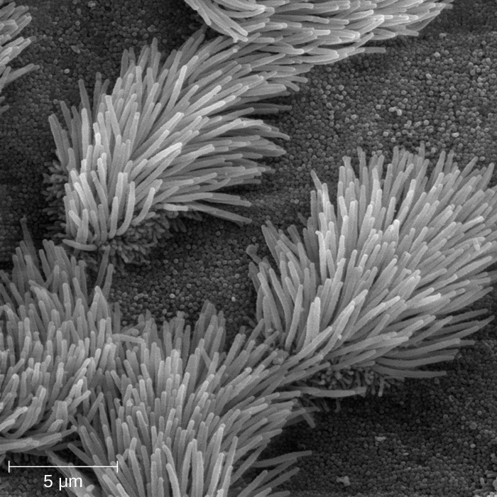
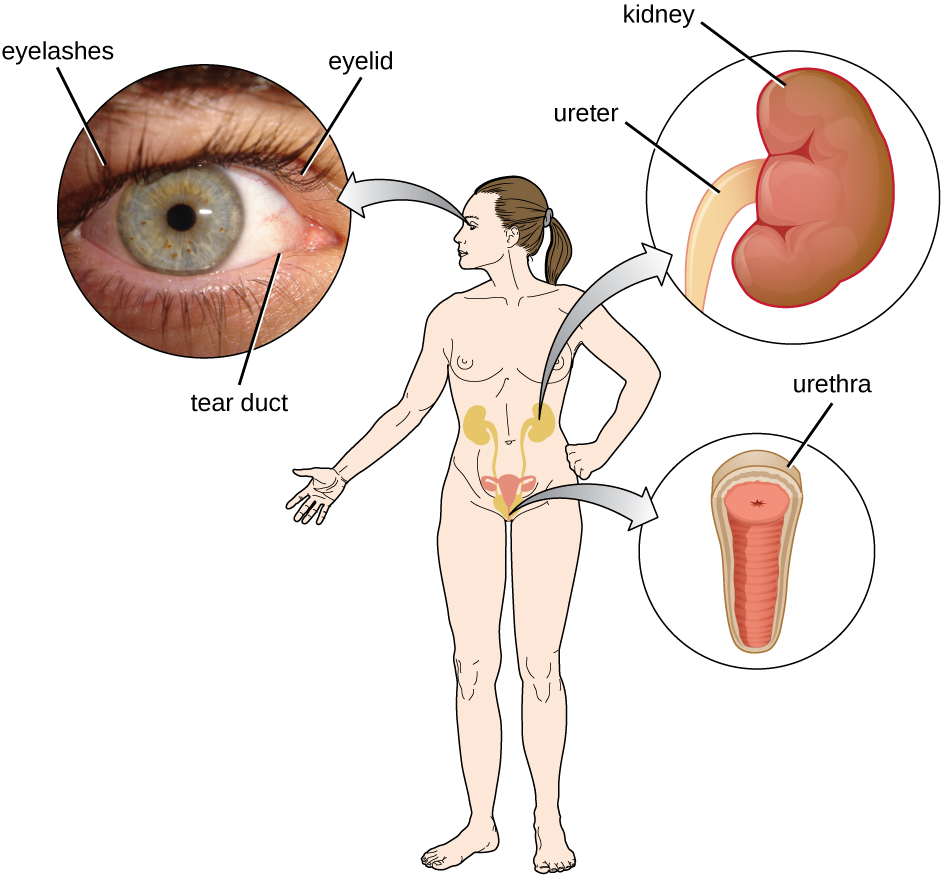

### Learning Objectives

* Describe the various physical barriers and mechanical defenses that protect the human body against infection and disease
* Describe the role of microbiota as a first-line defense against infection and disease

Nonspecific innate immunity can be characterized as a multifaceted system of defenses that targets invading pathogens in a nonspecific manner. In this chapter, we have divided the numerous defenses that make up this system into three categories: physical defenses, chemical defenses, and cellular defenses. However, it is important to keep in mind that these defenses do not function independently, and the categories often overlap. [\[link\]](#fs-id1172098375099) provides an overview of the nonspecific defenses discussed in this chapter.

<table class="span-all" summary="A table contains two columns and eleven rows. The first row is merged across both columns and reads &#x201C;Overview of nonspecific innate immune defenses.&#x201D; The second row begins with a merged cell reading &#x201C;Physical defenses&#x201D; and correlates to &#x201C;physical barriers, mechanical defenses, and microbiome&#x201D; in the right column. The next merged cell reads &#x201C;chemical defenses&#x201D; and correlates to &#x201C;chemicals and enzymes in body fluids, antimicrobial peptides, plasma protein mediators, cytokines, and inflammation-eliciting mediators&#x201D; in the right column. The third merged cell reads &#x201C;Cellular defenses&#x201D; and correlates to &#x201C;granulocytes and agranulocytes&#x201D; in the right column."><thead>
<tr>
<th colspan="2" data-align="center">Overview of Nonspecific Innate Immune Defenses</th>
</tr>
</thead><tbody>
<tr valign="top">
<td rowspan="3" data-valign="middle" data-align="left">Physical defenses</td>
<td data-valign="middle" data-align="left">Physical barriers</td>
</tr>
<tr valign="top">
<td data-valign="middle" data-align="left">Mechanical defenses</td>
</tr>
<tr valign="top">
<td data-valign="middle" data-align="left">Microbiome</td>
</tr>
<tr valign="top">
<td rowspan="5" data-valign="middle" data-align="left">Chemical defenses</td>
<td data-valign="middle" data-align="left">Chemicals and enzymes in body fluids</td>
</tr>
<tr valign="top">
<td data-valign="middle" data-align="left">Antimicrobial peptides</td>
</tr>
<tr valign="top">
<td data-valign="middle" data-align="left">Plasma protein mediators</td>
</tr>
<tr valign="top">
<td data-valign="middle" data-align="left">Cytokines</td>
</tr>
<tr valign="top">
<td data-valign="middle" data-align="left">Inflammation-eliciting mediators</td>
</tr>
<tr valign="top">
<td rowspan="2" data-valign="middle" data-align="left">Cellular defenses</td>
<td data-valign="middle" data-align="left">Granulocytes</td>
</tr>
<tr valign="top">
<td data-valign="middle" data-align="left">Agranulocytes</td>
</tr>
</tbody></table>

Physical defenses provide the body’s most basic form of nonspecific defense. They include physical barriers to microbes, such as the skin and mucous membranes, as well as mechanical defenses that physically remove microbes and debris from areas of the body where they might cause harm or infection. In addition, the microbiome provides a measure of physical protection against disease, as microbes of the normal microbiota compete with pathogens for nutrients and cellular binding sites necessary to cause infection.

### Physical Barriers

Physical barriers play an important role in preventing microbes from reaching tissues that are susceptible to infection. At the cellular level, barriers consist of cells that are tightly joined to prevent invaders from crossing through to deeper tissue. For example, the **endothelial cells**{: data-type="term" .no-emphasis} that line blood vessels have very tight cell-to-cell junctions, blocking microbes from gaining access to the bloodstream. Cell junctions are generally composed of cell membrane proteins that may connect with the extracellular matrix or with complementary proteins from neighboring cells. Tissues in various parts of the body have different types of **cell junctions**{: data-type="term" .no-emphasis}. These include tight junctions, desmosomes, and gap junctions, as illustrated in [\[link\]](#OSC_Microbio_17_02_Junction). Invading microorganisms may attempt to break down these substances chemically, using enzymes such as proteases that can cause structural damage to create a point of entry for pathogens.

 "){: #OSC_Microbio_17_02_Junction}

#### The Skin Barrier

One of the body’s most important physical barriers is the **skin barrier**{: data-type="term" .no-emphasis}, which is composed of three layers of closely packed cells. The thin upper layer is called the epidermis. A second, thicker layer, called the dermis, contains hair follicles, sweat glands, nerves, and blood vessels. A layer of fatty tissue called the hypodermis lies beneath the dermis and contains blood and lymph vessels ([\[link\]](#OSC_Microbio_17_02_Skin)).

 ![A diagram of a section of skin. The bottom layer is the hypodermis and is mostly made up of large circular cells (fatty tissue). The next layer up, and the thickest layer is the dermis. At the bottom of the dermis are blood vessels, lymph vessels, and nerves, all of which run throughout the dermis. Sweat glands are coiled tubes that lead to the surface. Hair follicles are thick vase-shaped structures containing a hair; an oil gland is attached to the hair follicle. The top layer is the epidermis and is made of many layers of flat cells.](../resources/OSC_Microbio_17_02_Skin.jpg "Human skin has three layers, the epidermis, the dermis, and the hypodermis, which provide a thick barrier between microbes outside the body and deeper tissues. Dead skin cells on the surface of the epidermis are continually shed, taking with them microbes on the skin&#x2019;s surface. (credit: modification of work by National Institutes of Health)"){: #OSC_Microbio_17_02_Skin}

The topmost layer of skin, the **epidermis**{: data-type="term" .no-emphasis}, consists of cells that are packed with keratin. These dead cells remain as a tightly connected, dense layer of protein-filled cell husks on the surface of the skin. The keratin makes the skin’s surface mechanically tough and resistant to degradation by bacterial enzymes. Fatty acids on the skin’s surface create a dry, salty, and acidic environment that inhibits the growth of some microbes and is highly resistant to breakdown by bacterial enzymes. In addition, the dead cells of the epidermis are frequently shed, along with any microbes that may be clinging to them. Shed skin cells are continually replaced with new cells from below, providing a new barrier that will soon be shed in the same way.

Infections can occur when the skin barrier is compromised or broken. A wound can serve as a point of entry for opportunistic pathogens, which can infect the skin tissue surrounding the wound and possibly spread to deeper tissues.

Every Rose Has its Thorn

Mike, a gardener from southern California, recently noticed a small red bump on his left forearm. Initially, he did not think much of it, but soon it grew larger and then ulcerated (opened up), becoming a painful lesion that extended across a large part of his forearm ([\[link\]](#OSC_Microbio_17_02_Sporotrich)). He went to an urgent care facility, where a physician asked about his occupation. When he said he was a landscaper, the physician immediately suspected a case of **sporotrichosis**{: data-type="term" .no-emphasis}, a type of fungal infection known as **rose gardener’s disease**{: data-type="term" .no-emphasis} because it often afflicts landscapers and gardening enthusiasts.

Under most conditions, fungi cannot produce skin infections in healthy individuals. Fungi grow filaments known as hyphae, which are not particularly invasive and can be easily kept at bay by the physical barriers of the skin and mucous membranes. However, small wounds in the skin, such as those caused by thorns, can provide an opening for opportunistic pathogens like ***Sporothrix schenkii***{: data-type="term" .no-emphasis}*,* a soil-dwelling fungus and the causative agent of rose gardener’s disease. Once it breaches the skin barrier, *S. schenkii* can infect the skin and underlying tissues, producing ulcerated lesions like Mike’s. Compounding matters, other pathogens may enter the infected tissue, causing secondary bacterial infections.

Luckily, rose gardener’s disease is treatable. Mike’s physician wrote him a prescription for some antifungal drugs as well as a course of antibiotics to combat secondary bacterial infections. His lesions eventually healed, and Mike returned to work with a new appreciation for gloves and protective clothing.

"){: #OSC_Microbio_17_02_Sporotrich}

#### Mucous Membranes

The **mucous membrane**{: data-type="term"}**s** lining the nose, mouth, lungs, and urinary and digestive tracts provide another nonspecific barrier against potential pathogens. Mucous membranes consist of a layer of **epithelial cells**{: data-type="term" .no-emphasis} bound by tight junctions. The epithelial cells secrete a moist, sticky substance called **mucus**{: data-type="term"}, which covers and protects the more fragile cell layers beneath it and traps debris and particulate matter, including microbes. Mucus secretions also contain antimicrobial peptides.

In many regions of the body, mechanical actions serve to flush mucus (along with trapped or dead microbes) out of the body or away from potential sites of infection. For example, in the respiratory system, inhalation can bring microbes, dust, mold spores, and other small airborne debris into the body. This debris becomes trapped in the mucus lining the respiratory tract, a layer known as the mucociliary blanket. The epithelial cells lining the upper parts of the respiratory tract are called **ciliated epithelial cells**{: data-type="term"} because they have hair-like appendages known as cilia. Movement of the cilia propels debris-laden mucus out and away from the lungs. The expelled mucus is then swallowed and destroyed in the stomach, or coughed up, or sneezed out ([\[link\]](#OSC_Microbio_17_02_Cilia)). This system of removal is often called the **mucociliary escalator**{: data-type="term"}.

 {: #OSC_Microbio_17_02_Cilia}

The mucociliary escalator is such an effective barrier to microbes that the lungs, the lowermost (and most sensitive) portion of the respiratory tract, were long considered to be a sterile environment in healthy individuals. Only recently has research suggested that healthy lungs may have a small normal microbiota. Disruption of the mucociliary escalator by the damaging effects of smoking or diseases such as **cystic fibrosis**{: data-type="term" .no-emphasis} can lead to increased colonization of bacteria in the lower respiratory tract and frequent infections, which highlights the importance of this physical barrier to host defenses.

Like the respiratory tract, the digestive tract is a portal of entry through which microbes enter the body, and the mucous membranes lining the digestive tract provide a nonspecific physical barrier against ingested microbes. The intestinal tract is lined with epithelial cells, interspersed with mucus-secreting **goblet cells**{: data-type="term" .no-emphasis} ([\[link\]](#OSC_Microbio_17_02_GobletCell)). This mucus mixes with material received from the stomach, trapping foodborne microbes and debris. The mechanical action of **peristalsis**{: data-type="term"}, a series of muscular contractions in the digestive tract, moves the sloughed mucus and other material through the intestines, rectum, and anus, excreting the material in feces.

 ![Figure a is a diagram of a single goblet cell. Cell is tall and slightly hour-glass shaped. The bottom of the cell is filled with a nucleus. The top shows the Golgi apparatus (folds of membranes), rough endoplasmic reticulum (folds of membranes with dots), secretory vesicles containing mucin (large bubbles), and microvilli (finger-like projections at the top). Figure b is a micrograph of two goblet cells within a row of epithelial cells. The epithelial cells are rectangular with a large nucleus visible. The goblet cells are thinner and have a clear (uncolored) top.](../resources/OSC_Microbio_17_02_GobletCell.jpg "Goblet cells produce and secrete mucus. The arrows in this micrograph point to the mucus-secreting goblet cells (magnification 1600&#x2A2F;) in the intestinal epithelium. (credit micrograph: Micrograph provided by the Regents of University of Michigan Medical School &#xA9; 2012)"){: #OSC_Microbio_17_02_GobletCell}

#### Endothelia

The epithelial cells lining the urogenital tract, blood vessels, lymphatic vessels, and certain other tissues are known as **endothelia**{: data-type="term"}. These tightly packed cells provide a particularly effective frontline barrier against invaders. The endothelia of the **blood-brain barrier**{: data-type="term"}, for example, protect the central nervous system (CNS), which consists of the brain and the spinal cord. The CNS is one of the most sensitive and important areas of the body, as microbial infection of the CNS can quickly lead to serious and often fatal inflammation. The cell junctions in the blood vessels traveling through the CNS are some of the tightest and toughest in the body, preventing any transient microbes in the bloodstream from entering the CNS. This keeps the cerebrospinal fluid that surrounds and bathes the brain and spinal cord sterile under normal conditions.

* Describe how the mucociliary escalator functions.
* Name two places you would find endothelia.
{: data-bullet-style="bullet"}

### Mechanical Defenses

In addition to physical barriers that keep microbes out, the body has a number of **mechanical defenses**{: data-type="term" .no-emphasis} that physically remove pathogens from the body, preventing them from taking up residence. We have already discussed several examples of mechanical defenses, including the shedding of skin cells, the expulsion of mucus via the mucociliary escalator, and the excretion of feces through intestinal peristalsis. Other important examples of mechanical defenses include the flushing action of urine and tears, which both serve to carry microbes away from the body. The flushing action of urine is largely responsible for the normally sterile environment of the urinary tract, which includes the kidneys, ureters, and urinary bladder. Urine passing out of the body washes out transient microorganisms, preventing them from taking up residence. The eyes also have physical barriers and mechanical mechanisms for preventing infections. The eyelashes and eyelids prevent dust and airborne microorganisms from reaching the surface of the eye. Any microbes or debris that make it past these physical barriers may be flushed out by the mechanical action of blinking, which bathes the eye in tears, washing debris away ([\[link\]](#OSC_Microbio_17_02_Barrier)).

 {: #OSC_Microbio_17_02_Barrier}

* Name two mechanical defenses that protect the eyes.
{: data-bullet-style="bullet"}

### Microbiome

In various regions of the body, **resident microbiota**{: data-type="term" .no-emphasis} serve as an important first-line defense against invading pathogens. Through their occupation of cellular binding sites and competition for available nutrients, the resident microbiota prevent the critical early steps of pathogen attachment and proliferation required for the establishment of an infection. For example, in the **vagina**{: data-type="term" .no-emphasis}, members of the resident microbiota compete with opportunistic pathogens like the yeast *Candida*. This competition prevents infections by limiting the availability of nutrients, thus inhibiting the growth of ***Candida***{: data-type="term" .no-emphasis}*,* keeping its population in check. Similar competitions occur between the microbiota and potential pathogens on the skin, in the upper respiratory tract, and in the gastrointestinal tract. As will be discussed later in this chapter, the resident microbiota also contribute to the chemical defenses of the innate nonspecific host defenses.

The importance of the normal microbiota in host defenses is highlighted by the increased susceptibility to infectious diseases when the microbiota is disrupted or eliminated. Treatment with antibiotics can significantly deplete the normal microbiota of the gastrointestinal tract, providing an advantage for pathogenic bacteria to colonize and cause diarrheal infection. In the case of diarrhea caused by ***Clostridium difficile***{: data-type="term" .no-emphasis}, the infection can be severe and potentially lethal. One strategy for treating *C. difficile* infections is **fecal transplantation**{: data-type="term" .no-emphasis}, which involves the transfer of fecal material from a donor (screened for potential pathogens) into the intestines of the recipient patient as a method of restoring the normal microbiota and combating *C. difficile* infections.

[\[link\]](#fs-id1172100897138) provides a summary of the physical defenses discussed in this section.

<table class="span-all" summary="A table contains three columns and five rows. The first row is a header row that reads &#x201C;Physical defenses of nonspecific innate immunity. The second row contains subheaders &#x201C;defense, examples, and function.&#x201D; The third row contains &#x201C;cellular barriers&#x201D;, &#x201C;skin, mucous membranes, endothelial cells&#x201D;, and &#x201C;deny entry to pathogens.&#x201D; The fourth row contains &#x201C;mechanical defenses&#x201D;, &#x201C;shedding of skin cells, mucociliary sweeping, peristalsis, flushing action of urine and tears&#x201D;, and &#x201C;remove pathogens from potential sites of infection.&#x201D; The fifth row contains &#x201C;microbiome&#x201D;, &#x201C;resident bacteria of the skin, upper respiratory tract, gastrointestinal tract, and genitourinary tract&#x201D;, and &#x201C;compete with pathogens for cellular binding sites and nutrients.&#x201D;"><thead>
<tr>
<th colspan="3" data-align="center">Physical Defenses of Nonspecific Innate Immunity</th>
</tr>
<tr valign="top">
<th data-valign="top" data-align="center">Defense</th>
<th data-valign="top" data-align="center">Examples</th>
<th data-valign="top" data-align="center">Function</th>
</tr>
</thead><tbody>
<tr valign="top">
<td data-valign="top" data-align="left">Cellular barriers</td>
<td data-valign="top" data-align="left">Skin, mucous membranes, endothelial cells</td>
<td data-valign="top" data-align="left">Deny entry to pathogens</td>
</tr>
<tr valign="top">
<td data-valign="top" data-align="left">Mechanical defenses</td>
<td data-valign="top" data-align="left">Shedding of skin cells, mucociliary sweeping, peristalsis, flushing action of urine and tears</td>
<td data-valign="top" data-align="left">Remove pathogens from potential sites of infection</td>
</tr>
<tr valign="top">
<td data-valign="top" data-align="left">Microbiome</td>
<td data-valign="top" data-align="left">Resident bacteria of the skin, upper respiratory tract, gastrointestinal tract, and genitourinary tract</td>
<td data-valign="top" data-align="left">Compete with pathogens for cellular binding sites and nutrients</td>
</tr>
</tbody></table>

* List two ways resident microbiota defend against pathogens.
{: data-bullet-style="bullet"}

### Key Concepts and Summary

* **Nonspecific innate immunity** provides a first line of defense against infection by nonspecifically blocking entry of microbes and targeting them for destruction or removal from the body.
* The physical defenses of innate immunity include physical barriers, mechanical actions that remove microbes and debris, and the microbiome, which competes with and inhibits the growth of pathogens.
* The skin, mucous membranes, and endothelia throughout the body serve as physical barriers that prevent microbes from reaching potential sites of infection. Tight cell junctions in these tissues prevent microbes from passing through.
* Microbes trapped in dead skin cells or **mucus** are removed from the body by mechanical actions such as shedding of skin cells, mucociliary sweeping, coughing, **peristalsis**, and flushing of bodily fluids (e.g., urination, tears)
* The resident microbiota provide a physical defense by occupying available cellular binding sites and competing with pathogens for available nutrients.
{: data-bullet-style="bullet"}

### Multiple Choice

Which of the following best describes the innate nonspecific immune system?

1.  a targeted and highly specific response to a single pathogen or molecule
2.  a generalized and nonspecific set of defenses against a class or group of pathogens
3.  a set of barrier mechanisms that adapts to specific pathogens after repeated exposure
4.  the production of antibody molecules against pathogens
{: data-number-style="upper-alpha"}

B

Which of the following constantly sheds dead cells along with any microbes that may be attached to those cells?

1.  epidermis
2.  dermis
3.  hypodermis
4.  mucous membrane
{: data-number-style="upper-alpha"}

A

Which of the following uses a particularly dense suite of tight junctions to prevent microbes from entering the underlying tissue?

1.  the mucociliary escalator
2.  the epidermis
3.  the blood-brain barrier
4.  the urethra
{: data-number-style="upper-alpha"}

C

### Fill in the Blank

The muscular contraction of the intestines that results in movement of material through the digestive tract is called \_\_\_\_\_\_\_\_.

peristalsis

\_\_\_\_\_\_ are the hair-like appendages of cells lining parts of the respiratory tract that sweep debris away from the lungs.

cilia

Secretions that bathe and moisten the interior of the intestines are produced by \_\_\_\_\_\_\_ cells.

goblet

### Short Answer

Differentiate a physical barrier from a mechanical removal mechanism and give an example of each.

Identify some ways that pathogens can breach the physical barriers of the innate immune system.

