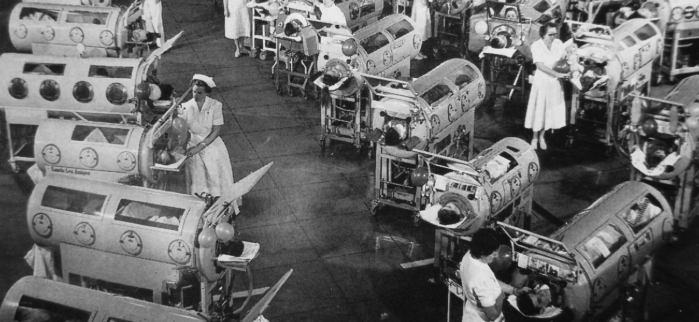

<cnx-pi data-type="cnx.flag.introduction"> class="introduction" </cnx-pi>

<cnx-pi data-type="cnx.eoc">class="summary" title="Chapter Summary"</cnx-pi>

<cnx-pi data-type="cnx.eoc">class="multiple-choice" title="Multiple Choice"</cnx-pi>

<cnx-pi data-type="cnx.eoc">class="true-false" title="True/False"</cnx-pi>

<cnx-pi data-type="cnx.eoc">class="matching" title="Matching"</cnx-pi>

<cnx-pi data-type="cnx.eoc">class="fill-in-the-blank" title="Fill in the Blank"</cnx-pi>

<cnx-pi data-type="cnx.eoc">class="short-answer" title="Short Answer"</cnx-pi>

<cnx-pi data-type="cnx.eoc">class="critical-thinking" title="Critical Thinking"</cnx-pi>

 {: #OSC_Microbio_18_00_salk}

People living in developed nations and born in the 1960s or later may have difficulty understanding the once heavy burden of devastating infectious diseases. For example, **smallpox**{: data-type="term" .no-emphasis}, a deadly viral disease, once destroyed entire civilizations but has since been eradicated. Thanks to the vaccination efforts by multiple groups, including the World Health Organization, Rotary International, and the United Nations Children’s Fund (UNICEF), smallpox has not been diagnosed in a patient since 1977. **Polio**{: data-type="term" .no-emphasis} is another excellent example. This crippling viral disease paralyzed patients, who were often kept alive in “iron lung wards” as recently as the 1950s ([\[link\]](#OSC_Microbio_18_00_salk)). Today, vaccination against polio has nearly eradicated the disease. Vaccines have also reduced the prevalence of once-common infectious diseases such as **chickenpox**{: data-type="term" .no-emphasis}, **German measles**{: data-type="term" .no-emphasis}, **measles**{: data-type="term" .no-emphasis}, **mumps**{: data-type="term" .no-emphasis}, and **whooping cough**{: data-type="term" .no-emphasis}. The success of these and other vaccines is due to the very specific and adaptive host defenses that are the focus of this chapter.

[Innate Nonspecific Host Defenses](/m58876){: .target-chapter} described innate immunity against microbial pathogens. Higher animals, such as humans, also possess an adaptive immune defense, which is highly specific for individual microbial pathogens. This specific adaptive immunity is acquired through active infection or vaccination and serves as an important defense against pathogens that evade the defenses of innate immunity.

