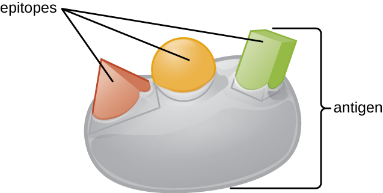
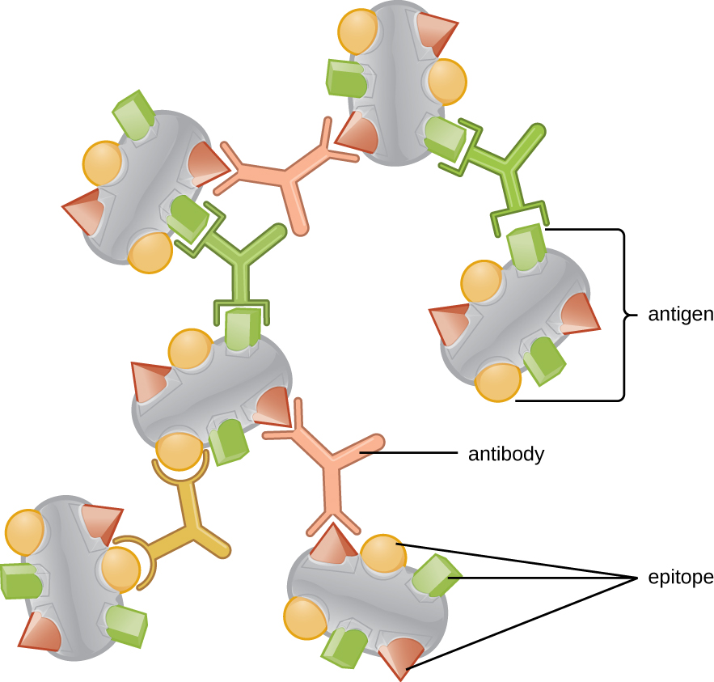

# Learning Objectives

* Define memory, primary response, secondary response, and specificity
* Distinguish between humoral and cellular immunity
* Differentiate between antigens, epitopes, and haptens
* Describe the structure and function of antibodies and distinguish between the different classes of antibodies

Part 1

Olivia, a one-year old infant, is brought to the emergency room by her parents, who report her symptoms: excessive crying, irritability, sensitivity to light, unusual lethargy, and vomiting. A physician feels swollen lymph nodes in Olivia’s throat and armpits. In addition, the area of the abdomen over the spleen is swollen and tender.

* What do these symptoms suggest?
* What tests might be ordered to try to diagnose the problem?
{: data-bullet-style="bullet"}

*Jump to the [next](/m58886#fs-id1167662393469) Clinical Focus box.*

**Adaptive immunity**{: data-type="term"} is defined by two important characteristics: **specificity**{: data-type="term"} and **memory**{: data-type="term"}. Specificity refers to the adaptive immune system’s ability to target specific pathogens, and memory refers to its ability to quickly respond to pathogens to which it has previously been exposed. For example, when an individual recovers from chickenpox, the body develops a *memory* of the infection that will *specifically* protect it from the causative agent, the varicella-zoster virus, if it is exposed to the virus again later.

Specificity and memory are achieved by essentially programming certain cells involved in the immune response to respond rapidly to subsequent exposures of the pathogen. This programming occurs as a result of the first exposure to a pathogen or vaccine, which triggers a **primary response**{: data-type="term"}. Subsequent exposures result in a **secondary response**{: data-type="term"} that is faster and stronger as a result of the body’s memory of the first exposure ([\[link\]](#OSC_Microbio_18_01_responses)). This secondary response, however, is specific to the pathogen in question. For example, exposure to one virus (e.g., varicella-zoster virus) will not provide protection against other viral diseases (e.g., measles, mumps, or polio).

Adaptive specific immunity involves the actions of two distinct cell types: **B lymphocytes**{: data-type="term"} (**B cells**{: data-type="term"}) and **T lymphocytes**{: data-type="term"} (**T cells**{: data-type="term"}). Although B cells and T cells arise from a common **hematopoietic stem cell**{: data-type="term" .no-emphasis} differentiation pathway (see [\[link\]](/m58879#OSC_Microbio_17_05_Hematopo)), their sites of maturation and their roles in adaptive immunity are very different.

B cells mature in the **bone marrow**{: data-type="term" .no-emphasis} and are responsible for the production of glycoproteins called **antibodies**{: data-type="term"}, or **immunoglobulins**{: data-type="term"}. Antibodies are involved in the body’s defense against pathogens and toxins in the extracellular environment. Mechanisms of adaptive specific immunity that involve B cells and antibody production are referred to as **humoral immunity**{: data-type="term"}. The maturation of T cells occurs in the **thymus**{: data-type="term" .no-emphasis}. T cells function as the central orchestrator of both innate and adaptive immune responses. They are also responsible for destruction of cells infected with intracellular pathogens. The targeting and destruction of intracellular pathogens by T cells is called cell-mediated immunity, or **cellular immunity**{: data-type="term"}.

 {: #OSC_Microbio_18_01_responses}

* List the two defining characteristics of adaptive immunity.
* Explain the difference between a primary and secondary immune response.
* How do humoral and cellular immunity differ?
{: data-bullet-style="bullet"}

# Antigens

Activation of the adaptive immune defenses is triggered by pathogen-specific molecular structures called **antigens**{: data-type="term"}. Antigens are similar to the pathogen-associated molecular patterns (PAMPs) discussed in [Pathogen Recognition and Phagocytosis](/m58880){: .target-chapter}; however, whereas PAMPs are molecular structures found on numerous pathogens, antigens are unique to a specific pathogen. The antigens that stimulate adaptive immunity to chickenpox, for example, are unique to the varicella-zoster virus but significantly different from the antigens associated with other viral pathogens.

The term *antigen* was initially used to describe molecules that stimulate the production of antibodies; in fact, the term comes from a combination of the words <u data-effect="underline">anti</u>body and <u data-effect="underline">gen</u>erator, and a molecule that stimulates antibody production is said to be **antigenic**{: data-type="term"}. However, the role of antigens is not limited to humoral immunity and the production of antibodies; antigens also play an essential role in stimulating cellular immunity, and for this reason antigens are sometimes more accurately referred to as **immunogens**{: data-type="term"}. In this text, however, we will typically refer to them as antigens.

Pathogens possess a variety of structures that may contain antigens. For example, antigens from bacterial cells may be associated with their capsules, cell walls, fimbriae, flagella, or pili. Bacterial antigens may also be associated with extracellular toxins and enzymes that they secrete. Viruses possess a variety of antigens associated with their capsids, envelopes, and the spike structures they use for attachment to cells.

Antigens may belong to any number of molecular classes, including carbohydrates, lipids, nucleic acids, proteins, and combinations of these molecules. Antigens of different classes vary in their ability to stimulate adaptive immune defenses as well as in the type of response they stimulate (humoral or cellular). The structural complexity of an antigenic molecule is an important factor in its antigenic potential. In general, more complex molecules are more effective as antigens. For example, the three-dimensional complex structure of **proteins**{: data-type="term" .no-emphasis} make them the most effective and potent antigens, capable of stimulating both humoral and cellular immunity. In comparison, carbohydrates are less complex in structure and therefore less effective as antigens; they can only stimulate humoral immune defenses. Lipids and nucleic acids are the least antigenic molecules, and in some cases may only become antigenic when combined with proteins or carbohydrates to form glycolipids, lipoproteins, or nucleoproteins.

One reason the three-dimensional complexity of antigens is so important is that antibodies and T cells do not recognize and interact with an entire antigen but with smaller exposed regions on the surface of antigens called **epitopes**{: data-type="term"}. A single antigen may possess several different epitopes ([\[link\]](#OSC_Microbio_18_02_epitope)), and different antibodies may bind to different epitopes on the same antigen ([\[link\]](#OSC_Microbio_18_02_antbind)). For example, the bacterial **flagellum**{: data-type="term" .no-emphasis} is a large, complex protein structure that can possess hundreds or even thousands of epitopes with unique three-dimensional structures. Moreover, flagella from different bacterial species (or even strains of the same species) contain unique epitopes that can only be bound by specific antibodies.

An antigen’s size is another important factor in its antigenic potential. Whereas large antigenic structures like flagella possess multiple epitopes, some molecules are too small to be antigenic by themselves. Such molecules, called **haptens**{: data-type="term"}, are essentially free epitopes that are not part of the complex three-dimensional structure of a larger antigen. For a hapten to become antigenic, it must first attach to a larger **carrier molecule**{: data-type="term" .no-emphasis} (usually a protein) to produce a conjugate antigen. The hapten-specific antibodies produced in response to the conjugate antigen are then able to interact with unconjugated free hapten molecules. Haptens are not known to be associated with any specific pathogens, but they are responsible for some allergic responses. For example, the hapten **urushiol**{: data-type="term" .no-emphasis}, a molecule found in the oil of plants that cause **poison ivy**{: data-type="term" .no-emphasis}, causes an immune response that can result in a severe rash (called contact dermatitis). Similarly, the hapten penicillin can cause allergic reactions to drugs in the penicillin class.

 {: #OSC_Microbio_18_02_epitope}

{: #OSC_Microbio_18_02_antbind}

* What is the difference between an antigen and an epitope?
* What factors affect an antigen’s antigenic potential?
* Why are haptens typically not antigenic, and how do they become antigenic?
{: data-bullet-style="bullet"}

# Antibodies

Antibodies (also called immunoglobulins) are glycoproteins that are present in both the blood and tissue fluids. The basic structure of an antibody monomer consists of four protein chains held together by **disulfide bonds**{: data-type="term" .no-emphasis} ([\[link\]](#OSC_Microbio_18_04_ABstruct)). A disulfide bond is a covalent bond between the sulfhydryl *R* groups found on two cysteine amino acids. The two largest chains are identical to each other and are called the **heavy chains**{: data-type="term"}. The two smaller chains are also identical to each other and are called the **light chains**{: data-type="term"}. Joined together, the heavy and light chains form a basic Y-shaped structure.

The two ‘arms’ of the Y-shaped antibody molecule are known as the **Fab region**{: data-type="term"}, for “fragment of antigen binding.” The far end of the Fab region is the variable region, which serves as the site of **antigen binding**{: data-type="term" .no-emphasis}. The amino acid sequence in the **variable region**{: data-type="term" .no-emphasis} dictates the three-dimensional structure, and thus the specific three-dimensional epitope to which the Fab region is capable of binding. Although the epitope specificity of the Fab regions is identical for each arm of a single antibody molecule, this region displays a high degree of variability between antibodies with different epitope specificities. Binding to the Fab region is necessary for neutralization of pathogens, agglutination or aggregation of pathogens, and antibody-dependent cell-mediated cytotoxicity.

The **constant region**{: data-type="term" .no-emphasis} of the antibody molecule includes the trunk of the Y and lower portion of each arm of the Y. The trunk of the Y is also called the **Fc region**{: data-type="term"}, for “fragment of crystallization,” and is the site of complement factor binding and binding to phagocytic cells during antibody-mediated **opsonization**{: data-type="term" .no-emphasis}.

 ![a) An antibody is a Y shape made of four strands. The two inner strands form the actual Y shape and are the heavy chains. The two light chains sit on the outsides of the top regions of the Y. The bottom portion of the Y (made of only heavy chains) is called the Fc Region. The Fc region along with half of the top portion of the Y (made of both light and heavy chains) is the constant regions. The variable region is the very tips of the Y and is made of both light and heavy chains. The antigen binding site is in the variable region. Disulfide bridges hold the antigen&#x2019;s shape. B) a space filling model of the antigen.](../resources/OSC_Microbio_18_04_ABstruct.jpg "(a) The typical four-chain structure of a generic antibody monomer. (b) The corresponding three-dimensional structure of the antibody IgG. (credit b: modification of work by Tim Vickers)"){: #OSC_Microbio_18_04_ABstruct}

* Describe the different functions of the Fab region and the Fc region.
{: data-bullet-style="bullet"}

## Antibody Classes

The constant region of an antibody molecule determines its class, or **isotype**{: data-type="term" .no-emphasis}. The five classes of antibodies are IgG, IgM, IgA, IgD, and IgE. Each class possesses unique heavy chains designated by Greek letters γ, μ, α, δ, and ε, respectively. Antibody classes also exhibit important differences in abundance in serum, arrangement, body sites of action, functional roles, and size ([\[link\]](#OSC_Microbio_18_04_ABClassTBL)).

**IgG**{: data-type="term"} is a monomer that is by far the most abundant antibody in human blood, accounting for about 80% of total serum antibody. IgG penetrates efficiently into tissue spaces, and is the only antibody class with the ability to cross the **placental barrier**{: data-type="term" .no-emphasis}, providing passive immunity to the developing fetus during pregnancy. IgG is also the most versatile antibody class in terms of its role in the body’s defense against pathogens.

**IgM**{: data-type="term"} is initially produced in a monomeric membrane-bound form that serves as an antigen-binding receptor on B cells. The secreted form of IgM assembles into a pentamer with five monomers of IgM bound together by a protein structure called the **J chain**{: data-type="term" .no-emphasis}. Although the location of the J chain relative to the Fc regions of the five monomers prevents IgM from performing some of the functions of IgG, the ten available Fab sites associated with a pentameric IgM make it an important antibody in the body’s arsenal of defenses. IgM is the first antibody produced and secreted by B cells during the primary and secondary immune responses, making pathogen-specific IgM a valuable diagnostic marker during active or recent infections.

**IgA**{: data-type="term"} accounts for about 13% of total serum antibody, and **secretory IgA**{: data-type="term" .no-emphasis} is the most common and abundant antibody class found in the **mucus**{: data-type="term" .no-emphasis} secretions that protect the mucous membranes. IgA can also be found in other secretions such as **breast milk**{: data-type="term" .no-emphasis}, **tears**{: data-type="term" .no-emphasis}, and **saliva**{: data-type="term" .no-emphasis}. Secretory IgA is assembled into a dimeric form with two monomers joined by a protein structure called the secretory component. One of the important functions of secretory IgA is to trap pathogens in mucus so that they can later be eliminated from the body.

Similar to IgM, **IgD**{: data-type="term"} is a membrane-bound monomer found on the surface of B cells, where it serves as an antigen-binding receptor. However, IgD is not secreted by B cells, and only trace amounts are detected in serum. These trace amounts most likely come from the degradation of old B cells and the release of IgD molecules from their cytoplasmic membranes.

**IgE**{: data-type="term"} is the least abundant antibody class in serum. Like IgG, it is secreted as a monomer, but its role in adaptive immunity is restricted to **anti-parasitic defenses**{: data-type="term" .no-emphasis}. The Fc region of IgE binds to **basophils**{: data-type="term" .no-emphasis} and **mast cells**{: data-type="term" .no-emphasis}. The Fab region of the bound IgE then interacts with specific antigen epitopes, causing the cells to release potent pro-inflammatory mediators. The inflammatory reaction resulting from the activation of mast cells and basophils aids in the defense against parasites, but this reaction is also central to allergic reactions (see [Diseases of the Immune System](/m58891){: .target-chapter}.

 ![Table titled: The five immunoglobulin (Ig) classes. IgG monomer is a Y shaped molecule; the heavy chain is gamma, it has 2 antigen binding sites and a molecular weight of 150,000 daltons. It makes up 80% of the total antibodies in the serum. It crosses the placenta and fixes compliments and the Fc binds to phagocytes. It&#x2019;s functions are: Neutralization, agglutination, complement activation, opsonization, and antibody-dependent cell-mediated cytotoxicity. IgM pentamer is 5 Y&#x2019;s bound at their bases; the heavy chain is mu, it has 10 antigen binding sites and a molecular weight of 900,000 daltons. It makes up 6% of the total antibodies in the serum. It does not cross the placenta but does fix compliments and the Fc does not bind to a particular cell type. It&#x2019;s functions are: Neutralization, agglutination, and complement activation. The monomer form serves as the B cell receptor. IgA dimer is 2 Y&#x2019;s bound at their bases; the heavy chain is alpha, it has 4 antigen binding sites and a molecular weight of 385,000 daltons. It makes up 13% of the total antibodies in the serum. It does not cross the placenta nor fix compliments and the Fc does not bind to a particular cell type. It&#x2019;s functions are: Neutralization and trapping of pathogens in mucus. IgD monomer is 1 Y; the heavy chain is delta, it has 2 antigen binding sites and a molecular weight of 180,000 daltons. It makes up &lt;1% of the total antibodies in the serum. It does not cross the placenta nor fix compliments and the Fc does not bind to a particular cell type. It&#x2019;s functions are: B cell receptors. IgE monomer is 1 Y; the heavy chain is epsilon, it has 2 antigen binding sites and a molecular weight of 200,000 daltons. It makes up &lt;1% of the total antibodies in the serum. It does not cross the placenta nor fix compliments. The Fc binds to mast cells and basophils. It&#x2019;s functions are: Activation of basophils and mast cells against parasites and allergens.](../resources/OSC_Microbio_18_04_ABClassTBL.jpg){: #OSC_Microbio_18_04_ABClassTBL}

* What part of an antibody molecule determines its class?
* What class of antibody is involved in protection against parasites?
* Describe the difference in structure between IgM and IgG.
{: data-bullet-style="bullet"}

# Antigen-Antibody Interactions

Different classes of antibody play important roles in the body’s defense against pathogens. These functions include neutralization of pathogens, opsonization for phagocytosis, agglutination, complement activation, and antibody-dependent cell-mediated cytotoxicity. For most of these functions, antibodies also provide an important link between adaptive specific immunity and innate nonspecific immunity.

**Neutralization**{: data-type="term"} involves the binding of certain antibodies (IgG, IgM, or IgA) to epitopes on the surface of pathogens or toxins, preventing their attachment to cells. For example, Secretory IgA can bind to specific pathogens and block initial attachment to intestinal mucosal cells. Similarly, specific antibodies can bind to certain toxins, blocking them from attaching to target cells and thus neutralizing their toxic effects. Viruses can be neutralized and prevented from infecting a cell by the same mechanism ([\[link\]](#OSC_Microbio_18_04_neutral)).

As described in [Chemical Defenses](/m58878){: .target-chapter}, **opsonization**{: data-type="term" .no-emphasis} is the coating of a pathogen with molecules, such as **complement**{: data-type="term" .no-emphasis} factors, **C-reactive protein**{: data-type="term" .no-emphasis}, and **serum amyloid A**{: data-type="term" .no-emphasis}, to assist in phagocyte binding to facilitate **phagocytosis**{: data-type="term" .no-emphasis}. IgG antibodies also serve as excellent opsonins, binding their Fab sites to specific epitopes on the surface of pathogens. Phagocytic cells such as **macrophages**{: data-type="term" .no-emphasis}, **dendritic cells**{: data-type="term" .no-emphasis}, and **neutrophils**{: data-type="term" .no-emphasis} have receptors on their surfaces that recognize and bind to the Fc portion of the IgG molecules; thus, IgG helps such phagocytes attach to and engulf the pathogens they have bound ([\[link\]](#OSC_Microbio_18_04_opson)).

**Agglutination**{: data-type="term"} or **aggregation**{: data-type="term" .no-emphasis} involves the cross-linking of pathogens by antibodies to create large aggregates ([\[link\]](#OSC_Microbio_18_04_agg)). IgG has two **Fab antigen-binding sites**{: data-type="term" .no-emphasis}, which can bind to two separate pathogen cells, clumping them together. When multiple IgG antibodies are involved, large aggregates can develop; these aggregates are easier for the kidneys and spleen to filter from the blood and easier for phagocytes to ingest for destruction. The pentameric structure of **IgM**{: data-type="term" .no-emphasis} provides ten Fab binding sites per molecule, making it the most efficient antibody for agglutination.

 {: #OSC_Microbio_18_04_neutral}

{: #OSC_Microbio_18_04_opson}

{: #OSC_Microbio_18_04_agg}

Another important function of antibodies is activation of the **complement cascade**{: data-type="term" .no-emphasis}. As discussed in the previous chapter, the complement system is an important component of the innate defenses, promoting the inflammatory response, recruiting **phagocytes**{: data-type="term" .no-emphasis} to site of infection, enhancing phagocytosis by opsonization, and killing gram-negative bacterial pathogens with the **membrane attack complex (MAC)**{: data-type="term" .no-emphasis}. Complement activation can occur through three different pathways (see [\[link\]](/m58878#OSC_Microbio_17_03_ClassAltPa)), but the most efficient is the **classical pathway**{: data-type="term" .no-emphasis}, which requires the initial binding of IgG or IgM antibodies to the surface of a pathogen cell, allowing for recruitment and activation of the **C1 complex**{: data-type="term" .no-emphasis}.

Yet another important function of antibodies is **antibody-dependent cell-mediated cytotoxicity (ADCC)**{: data-type="term"}, which enhances killing of pathogens that are too large to be phagocytosed. This process is best characterized for natural killer cells (**NK cells**{: data-type="term" .no-emphasis}), as shown in [\[link\]](#OSC_Microbio_18_04_NK), but it can also involve **macrophages**{: data-type="term" .no-emphasis} and **eosinophils**{: data-type="term" .no-emphasis}. ADCC occurs when the **Fab region**{: data-type="term" .no-emphasis} of an IgG antibody binds to a large pathogen; **Fc receptors**{: data-type="term" .no-emphasis} on effector cells (e.g., NK cells) then bind to the Fc region of the antibody, bringing them into close proximity with the target pathogen. The effector cell then secretes powerful cytotoxins (e.g., **perforin**{: data-type="term" .no-emphasis} and **granzymes**{: data-type="term" .no-emphasis}) that kill the pathogen.

 {: #OSC_Microbio_18_04_NK}

* Where is IgA normally found?
* Which class of antibody crosses the placenta, providing protection to the fetus?
* Compare the mechanisms of opsonization and antibody-dependent cell-mediated cytotoxicity.
{: data-bullet-style="bullet"}

# Key Concepts and Summary

* **Adaptive immunity** is an acquired defense against foreign pathogens that is characterized by **specificity** and **memory.** The first exposure to an antigen stimulates a **primary response**, and subsequent exposures stimulate a faster and strong **secondary response.**
* Adaptive immunity is a dual system involving **humoral immunity** (antibodies produced by B cells) and **cellular immunity** (T cells directed against intracellular pathogens).
* **Antigens**, also called **immunogens**, are molecules that activate adaptive immunity. A single antigen possesses smaller **epitopes**, each capable of inducing a specific adaptive immune response.
* An antigen’s ability to stimulate an immune response depends on several factors, including its molecular class, molecular complexity, and size.
* **Antibodies** (**immunoglobulins**) are Y-shaped glycoproteins with two Fab sites for binding antigens and an Fc portion involved in complement activation and opsonization.
* The five classes of antibody are **IgM**, **IgG**, **IgA**, **IgE**, and **IgD**, each differing in size, arrangement, location within the body, and function. The five primary functions of antibodies are neutralization, opsonization, agglutination, complement activation, and antibody-dependent cell-mediated cytotoxicity (ADCC).
{: data-bullet-style="bullet"}

# Multiple Choice

Antibodies are produced by \_\_\_\_\_\_\_\_.

1.  plasma cells
2.  T cells
3.  bone marrow
4.  B cells
{: data-number-style="lower-alpha"}

A

Cellular adaptive immunity is carried out by \_\_\_\_\_\_\_\_.

1.  B cells
2.  T cells
3.  bone marrow
4.  neutrophils
{: data-number-style="lower-alpha"}

B

A single antigen molecule may be composed of many individual \_\_\_\_\_\_\_\_.

1.  T-cell receptors
2.  B-cell receptors
3.  MHC II
4.  epitopes
{: data-number-style="lower-alpha"}

D

Which class of molecules is the most antigenic?

1.  polysaccharides
2.  lipids
3.  proteins
4.  carbohydrates
{: data-number-style="lower-alpha"}

C

# Matching

Match the antibody class with its description.

| \_\_\_IgA | A. This class of antibody is the only one that can cross the placenta. |
{: valign="top"}| \_\_\_IgD | B. This class of antibody is the first to appear after activation of B cells. |
{: valign="top"}| \_\_\_IgE | C. This class of antibody is involved in the defense against parasitic infections and involved in allergic responses. |
{: valign="top"}| \_\_\_IgG | D. This class of antibody is found in very large amounts in mucus secretions. |
{: valign="top"}| \_\_\_IgM | E. This class of antibody is not secreted by B cells but is expressed on the surface of naïve B cells. |
{: valign="top"}{: summary="IgA, IgD, IgE, IgG, IgM. a. This class of antibody is the only one that can cross the placenta.  b. This class of antibody is the first to appear after activation of B cells. c. This class of antibody is involved in the defense against parasitic infections and involved in allergic responses. d. This class of antibody is found in very large amounts in mucus secretions. e. This class of antibody is not secreted by B cells but is expressed on the surface of na&#xEF;ve B cells." .unnumbered .unstyled}

d, e, c, a, b

# Fill in the Blank

There are two critically important aspects of adaptive immunity. The first is specificity, while the second is \_\_\_\_\_\_\_\_.

memory

\_\_\_\_\_\_\_\_ immunity involves the production of antibody molecules that bind to specific antigens.

Humoral

The heavy chains of an antibody molecule contain \_\_\_\_\_\_\_\_ region segments, which help to determine its class or isotype.

constant

The variable regions of the heavy and light chains form the \_\_\_\_\_\_\_\_ sites of an antibody.

antigen-binding

# Short Answer

What is the difference between humoral and cellular adaptive immunity?

What is the difference between an antigen and a hapten?

Describe the mechanism of antibody-dependent cell-mediated cytotoxicity.

