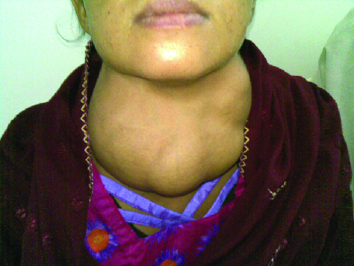

### Learning Objectives

* Explain why autoimmune disorders develop
* Provide a few examples of organ-specific and systemic autoimmune diseases

In 1970, artist Walt Kelly developed a poster promoting Earth Day, featuring a character from *Pogo*, his daily newspaper comic strip. In the poster, Pogo looks out across a litter-strewn forest and says wryly, “We have met the enemy and he is us.” Pogo was not talking about the human immune system, but he very well could have been. Although the immune system protects the body by attacking invading “enemies” (pathogens), in some cases, the immune system can mistakenly identify the body’s own cells as the enemy, resulting in **autoimmune disease**{: data-type="term"}.

Autoimmune diseases are those in which the body is attacked by its own specific adaptive immune response. In normal, healthy states, the immune system induces **tolerance**{: data-type="term"}, which is a lack of an anti-self immune response. However, with autoimmunity, there is a loss of immune tolerance, and the mechanisms responsible for autoimmune diseases include type II, III, and IV hypersensitivity reactions. Autoimmune diseases can have a variety of mixed symptoms that flare up and disappear, making diagnosis difficult.

The causes of autoimmune disease are a combination of the individual\'s genetic makeup and the effect of environmental influences, such as sunlight, infections, medications, and environmental chemicals. However, the vagueness of this list reflects our poor understanding of the etiology of these diseases. Except in a very few specific diseases, the initiation event(s) of most autoimmune states has not been fully characterized.

There are several possible causes for the origin of autoimmune diseases and autoimmunity is likely due to several factors. Evidence now suggests that regulatory T and B cells play an essential role in the maintenance of tolerance and prevention of autoimmune responses. The **regulatory T cells**{: data-type="term" .no-emphasis} are especially important for inhibiting autoreactive T cells that are not eliminated during **thymic selection**{: data-type="term" .no-emphasis} and escape the **thymus**{: data-type="term" .no-emphasis} (see [T Lymphocytes and Cellular Immunity](/m58886){: .target-chapter}). In addition, **antigen mimicry**{: data-type="term" .no-emphasis} between pathogen antigens and our own self antigens can lead to **cross-reactivity**{: data-type="term" .no-emphasis} and autoimmunity. Hidden self-antigens may become exposed because of trauma, drug interactions, or disease states, and trigger an autoimmune response. All of these factors could contribute to autoimmunity. Ultimately, damage to tissues and organs in the autoimmune disease state comes as a result of inflammatory responses that are inappropriate; therefore, treatment often includes immunosuppressive drugs and **corticosteroid**{: data-type="term" .no-emphasis}s.

### Organ-Specific Autoimmune Diseases

Some autoimmune diseases are considered organ specific, meaning that the immune system targets specific organs or tissues. Examples of organ-specific autoimmune diseases include celiac disease, Graves disease, Hashimoto thyroiditis, type I diabetes mellitus, and Addison disease.

#### Celiac Disease

Celiac disease is largely a disease of the small intestine, although other organs may be affected. People in their 30s and 40s, and children are most commonly affected, but **celiac disease**{: data-type="term"} can begin at any age. It results from a reaction to proteins, commonly called **gluten**{: data-type="term" .no-emphasis}, found mainly in wheat, barley, rye, and some other grains. The disease has several genetic causes (predispositions) and poorly understood environmental influences. On exposure to gluten, the body produces various autoantibodies and an inflammatory response. The inflammatory response in the small intestine leads to a reduction in the depth of the microvilli of the mucosa, which hinders absorption and can lead to weight loss and anemia. The disease is also characterized by diarrhea and abdominal pain, symptoms that are often misdiagnosed as **irritable bowel syndrome**{: data-type="term" .no-emphasis}.

Diagnosis of celiac disease is accomplished from serological tests for the presence of primarily IgA antibodies to components of gluten, the **transglutinaminase**{: data-type="term" .no-emphasis} enzyme, and autoantibodies to **endomysium**{: data-type="term" .no-emphasis}, a connective tissue surrounding muscle fibers. Serological tests are typically followed up with **endoscopy**{: data-type="term" .no-emphasis} and biopsy of the duodenal mucosa. Serological screening surveys have found about 1% of individuals in the United Kingdom are positive even though they do not all display symptoms.[1](#footnote1){: data-type="footnote-link"} This early recognition allows for more careful monitoring and prevention of severe disease.

Celiac disease is treated with complete removal of gluten-containing foods from the diet, which results in improved symptoms and reduced risk of complications. Other theoretical approaches include breeding grains that do not contain the immunologically reactive components or developing dietary supplements that contain enzymes that break down the protein components that cause the immune response.[2](#footnote2){: data-type="footnote-link"}

#### Disorders of the Thyroid

**Graves disease**{: data-type="term"} is the most common cause of **hyperthyroidism**{: data-type="term" .no-emphasis} in the United States. Symptoms of Graves disease result from the production of **thyroid-stimulating immunoglobulin (TSI)**{: data-type="term" .no-emphasis} also called **TSH-receptor antibody**{: data-type="term" .no-emphasis}. TSI targets and binds to the receptor for **thyroid stimulating hormone (TSH)**{: data-type="term" .no-emphasis}, which is naturally produced by the **pituitary gland**{: data-type="term" .no-emphasis}. TSI may cause conflicting symptoms because it may stimulate the thyroid to make too much thyroid hormone or block **thyroid**{: data-type="term" .no-emphasis} hormone production entirely, making diagnosis more difficult. Signs and symptoms of Graves disease include heat intolerance, rapid and irregular heartbeat, weight loss, **goiter**{: data-type="term" .no-emphasis} (a swollen thyroid gland, protruding under the skin of the throat \[[\[link\]](#OSC_Microbio_19_02_auto)\]) and **exophthalmia**{: data-type="term" .no-emphasis} (bulging eyes) often referred to as Graves **ophthalmopathy**{: data-type="term" .no-emphasis} ([\[link\]](#OSC_Microbio_19_02_exophth)).

The most common cause of **hypothyroidism**{: data-type="term" .no-emphasis} in the United States is **Hashimoto thyroiditis**{: data-type="term"}, also called **chronic lymphocytic thyroiditis**{: data-type="term" .no-emphasis}. Patients with Hashimoto thyroiditis often develop a spectrum of different diseases because they are more likely to develop additional autoimmune diseases such as Addison disease (discussed later in this section), type 1 diabetes, rheumatoid arthritis, and celiac disease. Hashimoto thyroiditis is a TH1 cell-mediated disease that occurs when the thyroid gland is attacked by cytotoxic lymphocytes, macrophages, and autoantibodies. This autoimmune response leads to numerous symptoms that include goiter ([\[link\]](#OSC_Microbio_19_02_auto)), cold intolerance, muscle weakness, painful and stiff joints, depression, and memory loss.

 {: #OSC_Microbio_19_02_auto}

"){: #OSC_Microbio_19_02_exophth}

#### Type 1 Diabetes

Juvenile **diabetes**{: data-type="term" .no-emphasis}, or **type 1 diabetes mellitus**{: data-type="term"}, is usually diagnosed in children and young adults. It is a T-cell-dependent autoimmune disease characterized by the selective destruction of the β cells of the islets of Langerhans in the **pancreas**{: data-type="term" .no-emphasis} by CD4 TH1-mediated CD8 T cells, anti-β-cell antibodies, and macrophage activity. There is also evidence that viral infections can have either a potentiating or inhibitory role in the development of type 1 diabetes (T1D) mellitus. The destruction of the β cells causes a lack of **insulin**{: data-type="term" .no-emphasis} production by the pancreas. In T1D, β-cell destruction may take place over several years, but symptoms of **hyperglycemia**{: data-type="term" .no-emphasis}, extreme increase in thirst and urination, weight loss, and extreme fatigue usually have a sudden onset, and diagnosis usually does not occur until most β cells have already been destroyed.

#### Autoimmune Addison Disease

Destruction of the **adrenal glands**{: data-type="term" .no-emphasis} (the glands lying above the kidneys that produce glucocorticoids, mineralocorticoids, and sex steroids) is the cause of **Addison disease**{: data-type="term"}, also called **primary adrenal insufficiency (PAI)**{: data-type="term" .no-emphasis}. Today, up to 80% of Addison disease cases are diagnosed as autoimmune Addison disease (AAD), which is caused by an autoimmune response to adrenal tissues disrupting adrenal function. Disruption of adrenal function causes impaired metabolic processes that require normal steroid hormone levels, causing signs and symptoms throughout the body. There is evidence that both humoral and CD4 TH1-driven CD8 T-cell–mediated immune mechanisms are directed at the adrenal cortex in AAD. There is also evidence that the autoimmune response is associated with autoimmune destruction of other endocrine glands as well, such as the **pancreas**{: data-type="term" .no-emphasis} and **thyroid**{: data-type="term" .no-emphasis}, conditions collectively referred to as **autoimmune polyendocrine syndromes (APS)**{: data-type="term" .no-emphasis}. In up to 80% of patients with AAD, antibodies are produced to three enzymes involved in steroid synthesis: 21-hydroxylase (21-OH), 17α-hydroxylase, and cholesterol side-chain–cleaving enzyme.[3](#footnote3){: data-type="footnote-link"} The most common autoantibody found in AAD is to 21-OH, and antibodies to any of the key enzymes for steroid production are diagnostic for AAD. The adrenal cortex cells are targeted, destroyed, and replaced with fibrous tissue by immune-mediated inflammation. In some patients, at least 90% of the adrenal cortex is destroyed before symptoms become diagnostic.

Symptoms of AAD include weakness, nausea, decreased appetite, weight loss, **hyperpigmentation**{: data-type="term" .no-emphasis} ([\[link\]](#OSC_Microbio_19_02_hyperpig)), **hyperkalemia**{: data-type="term" .no-emphasis} (elevated blood potassium levels), **hyponatremia**{: data-type="term" .no-emphasis} (decreased blood sodium levels), **hypoglycemia**{: data-type="term" .no-emphasis} (decreased levels of blood sugar), **hypotension**{: data-type="term" .no-emphasis} (decreased blood pressure), **anemia**{: data-type="term" .no-emphasis}, **lymphocytosis**{: data-type="term" .no-emphasis} (decreased levels of white blood cells), and fatigue. Under extreme stress, such as surgery, accidental trauma, or infection, patients with AAD may experience an adrenal crisis that causes the patient to vomit, experience abdominal pain, back or leg cramps, and even severe hypotension leading to shock.

 "){: #OSC_Microbio_19_02_hyperpig}

* What are the names of autoimmune diseases that interfere with hormone gland function?
* Describe how the mechanisms of Graves disease and Hashimoto thyroiditis differ.
* Name the cells that are destroyed in type 1 diabetes mellitus and describe the result.
{: data-bullet-style="bullet"}

### Systemic Autoimmune Diseases

Whereas organ-specific autoimmune diseases target specific organs or tissues, **systemic autoimmune disease**{: data-type="term"}s are more generalized, targeting multiple organs or tissues throughout the body. Examples of systemic autoimmune diseases include multiple sclerosis, myasthenia gravis, psoriasis, rheumatoid arthritis, and systemic lupus erythematosus.

#### Multiple Sclerosis

Multiple sclerosis (MS) is an autoimmune central nervous system disease that affects the brain and spinal cord. Lesions in multiple locations within the central nervous system are a hallmark of **multiple sclerosis**{: data-type="term"} and are caused by infiltration of immune cells across the **blood-brain barrier**{: data-type="term" .no-emphasis}. The immune cells include T cells that promote inflammation, **demyelination**{: data-type="term" .no-emphasis}, and neuron degeneration, all of which disrupt neuronal signaling. Symptoms of MS include visual disturbances; muscle weakness; difficulty with coordination and balance; sensations such as numbness, prickling, or “pins and needles”; and cognitive and memory problems.

#### Myasthenia Gravis

Autoantibodies directed against acetylcholine receptors (AChRs) in the synaptic cleft of neuromuscular junctions lead to **myasthenia gravis**{: data-type="term"} ([\[link\]](#OSC_Microbio_19_02_Mgrav)). Anti-AChR antibodies are high-affinity IgGs and their synthesis requires activated CD4 T cells to interact with and stimulate B cells. Once produced, the **anti-AChR antibodies**{: data-type="term" .no-emphasis} affect neuromuscular transmission by at least three mechanisms:

* Complement binding and activation at the neuromuscular junction
* Accelerated AChR endocytosis of molecules cross-linked by antibodies
* Functional AChR blocking, which prevents normal acetylcholine attachment to, and activation of, AChR

Regardless of the mechanism, the effect of anti-AChR is extreme muscle weakness and potentially death through respiratory arrest in severe cases.

  Normal release of the neurotransmitter acetylcholine stimulates muscle contraction. (b) In myasthenia gravis, autoantibodies block the receptors for acetylcholine (AChr) on muscle cells, resulting in paralysis."){: #OSC_Microbio_19_02_Mgrav}

#### Psoriasis

Psoriasis is a skin disease that causes itchy or sore patches of thick, red skin with silvery scales on elbows, knees, scalp, back, face, palms, feet, and sometimes other areas. Some individuals with **psoriasis**{: data-type="term"} also get a form of arthritis called **psoriatic arthritis**{: data-type="term" .no-emphasis}, in which the joints can become inflamed. Psoriasis results from the complex interplay between keratinocytes, dendritic cells, and T cells, and the cytokines produced by these various cells. In a process called cell turnover, skin cells that grow deep in the skin rise to the surface. Normally, this process takes a month. In psoriasis, as a result of cytokine activation, cell turnover happens in just a few days. The thick inflamed patches of skin that are characteristic of psoriasis develop because the skin cells rise too fast.

#### Rheumatoid Arthritis

The most common chronic inflammatory joint disease is **rheumatoid arthritis**{: data-type="term"} (RA) ([\[link\]](#OSC_Microbio_19_02_arth)) and it is still a major medical challenge because of unsolved questions related to the environmental and genetic causes of the disease. RA involves type III hypersensitivity reactions and the activation of CD4 T cells, resulting in chronic release of the inflammatory cytokines **IL-1**{: data-type="term" .no-emphasis}, **IL-6**{: data-type="term" .no-emphasis}, and tumor necrosis factor-α (**TNF-α**{: data-type="term" .no-emphasis}). The activated CD4 T cells also stimulate the production of rheumatoid factor (RF) antibodies and anticyclic citrullinated peptide antibodies (anti-CCP) that form **immune complex**{: data-type="term" .no-emphasis}es. Increased levels of **acute-phase proteins**{: data-type="term" .no-emphasis}, such as **C-reactive protein (CRP)**{: data-type="term" .no-emphasis}, are also produced as part of the inflammatory process and participate in complement fixation with the antibodies on the immune complexes. The formation of immune complexes and reaction to the immune factors cause an inflammatory process in joints, particularly in the hands, feet, and legs. Diagnosis of RA is based on elevated levels of RF, anti-CCP, quantitative CRP, and the erythrocyte sedimentation rate (ESR) (modified Westergren). In addition, radiographs, ultrasound, or magnetic resonance imaging scans can identify joint damage, such as erosions, a loss of bone within the joint, and narrowing of joint space.

  and photograph (right) show damage to the hands typical of rheumatoid arthritis. (credit right: modification of work by &#x201C;handarmdoc&#x201D;/Flickr)"){: #OSC_Microbio_19_02_arth}

#### Systemic Lupus Erythematosus

The damage and pathology of **systemic lupus erythematosus (SLE)**{: data-type="term"} is caused by **type III hypersensitivity**{: data-type="term" .no-emphasis} reactions. Autoantibodies produced in SLE are directed against nuclear and cytoplasmic proteins. **Anti-nuclear antibodies (ANAs)**{: data-type="term" .no-emphasis} are present in more than 95% of patients with SLE,[4](#footnote4){: data-type="footnote-link"} with additional autoantibodies including anti-double–stranded DNA (ds-DNA) and anti-Sm antibodies (antibodies to small nuclear ribonucleoprotein). Anti-ds-DNA and anti-Sm antibodies are unique to patients with SLE; thus, their presence is included in the classification criteria of SLE. Cellular interaction with autoantibodies leads to nuclear and cellular destruction, with components released after cell death leading to the formation of immune complexes.

Because autoantibodies in SLE can target a wide variety of cells, symptoms of SLE can occur in many body locations. However, the most common symptoms include fatigue, fever with no other cause, hair loss, and a sunlight-sensitive \"butterfly\" or wolf-mask (lupus) rash that is found in about 50% of people with SLE ([\[link\]](#OSC_Microbio_19_02_lupus)). The rash is most often seen over the cheeks and bridge of the nose, but can be widespread. Other symptoms may appear depending on affected areas. The joints may be affected, leading to arthritis of the fingers, hands, wrists, and knees. Effects on the brain and nervous system can lead to headaches, numbness, tingling, seizures, vision problems, and personality changes. There may also be abdominal pain, nausea, vomiting, arrhythmias, shortness of breath, and blood in the sputum. Effects on the skin can lead to additional areas of skin lesions, and vasoconstriction can cause color changes in the fingers when they are cold (Raynaud phenomenon). Effects on the kidneys can lead to edema in the legs and weight gain. A diagnosis of SLE depends on identification of four of 11 of the most common symptoms and confirmed production of an array of autoantibodies unique to SLE. A positive test for ANAs alone is not diagnostic.

  Systemic lupus erythematosus is characterized by autoimmunity to the individual&#x2019;s own DNA and/or proteins. (b) This patient is presenting with a butterfly rash, one of the characteristic signs of lupus. (credit a: modification of work by Mikael H&#xE4;ggstr&#xF6;m; credit b: modification of work by Shrestha D, Dhakal AK, Shiva RK, Shakya A, Shah SC, Shakya H)"){: #OSC_Microbio_19_02_lupus}

* List the ways antibodies contribute to the pathogenesis of myasthenia gravis.
* Explain why rheumatoid arthritis is considered a type III hypersensitivity.
* Describe the symptoms of systemic lupus erythematosus and explain why they affect so many different parts of the body.
* What is recognized as an antigen in myasthenia gravis?
{: data-bullet-style="bullet"}

[\[link\]](#fs-id1167663990837) summarizes the causes, signs, and symptoms of select autoimmune diseases.

<table summary="Table titled: Select Autoimmune Diseases. Columns: Disease; Cause; Signs and Symptoms. Addison disease: Destruction of adrenal gland cells by cytotoxic T cells; Weakness, nausea, hypotension, fatigue; adrenal crisis with severe pain in abdomen, lower back, and legs; circulatory system collapse, kidney failure. Celiac disease:  Antibodies to gluten become autoantibodies that target cells of the small intestine; Severe diarrhea, abdominal pain, anemia, malnutrition. Diabetes mellitus (type I): Cytotoxic T-cell destruction of the insulin-producing &#x3B2; cells of the pancreas; Hyperglycemia, extreme increase in thirst and urination, weight loss, extreme fatigue. Graves disease: Autoantibodies target thyroid-stimulating hormone receptors, resulting in overstimulation of the thyroid; Hyperthyroidism with rapid and irregular heartbeat, heat intolerance, weight loss, goiter, exophthalmia. Hashimoto thyroiditis: Thyroid gland is attacked by cytotoxic T cells, lymphocytes, macrophages, and autoantibodies; Thyroiditis with goiter, cold intolerance, muscle weakness, painful and stiff joints, depression, memory loss. Multiple sclerosis (MS): Cytotoxic T-cell destruction of the myelin sheath surrounding nerve axons in the central nervous system; Visual disturbances, muscle weakness, impaired coordination and balance, numbness, prickling or &#x201C;pins and needles&#x201D; sensations, impaired cognitive function and memory. Myasthenia gravis: Autoantibodies directed against acetylcholine receptors within the neuromuscular junction; Extreme muscle weakness eventually leading to fatal respiratory arrest. Psoriasis: Cytokine activation of keratinocytes causes rapid and excessive epidermal cell turnover ; Itchy or sore patches of thick, red skin with silvery scales; commonly affects elbows, knees, scalp, back, face, palms, feet. Rheumatoid arthritis: Autoantibodies, immune complexes, complement activation, phagocytes, and T cells damage membranes and bone in joints; Joint inflammation, pain and disfigurement, chronic systemic inflammation. Systemic lupus erythematosus (SLE): Autoantibodies directed against nuclear and cytoplasmic molecules form immune complexes that deposit in tissues. Phagocytic cells and complement activation cause tissue damage and inflammation; Fatigue, fever, joint pain and swelling, hair loss, anemia, clotting, a sunlight-sensitive &#x201C;butterfly&#x201D; rash, skin lesions, photosensitivity, decreased kidney function, memory loss, confusion, depression." class="span-all"><thead>
<tr valign="top">
<th colspan="3" data-valign="top" data-align="left">Select Autoimmune Diseases</th>
</tr>
<tr valign="top">
<th data-valign="top" data-align="left">Disease</th>
<th data-valign="top" data-align="left">Cause</th>
<th data-valign="top" data-align="left">Signs and Symptoms</th>
</tr>
</thead><tbody>
<tr valign="top">
<td data-valign="top" data-align="left">Addison disease</td>
<td data-valign="top" data-align="left">Destruction of adrenal gland cells by cytotoxic T cells</td>
<td data-valign="top" data-align="left">Weakness, nausea, hypotension, fatigue; adrenal crisis with severe pain in abdomen, lower back, and legs; circulatory system collapse, kidney failure</td>
</tr>
<tr valign="top">
<td data-valign="top" data-align="left">Celiac disease</td>
<td data-valign="top" data-align="left">Antibodies to gluten become autoantibodies that target cells of the small intestine</td>
<td data-valign="top" data-align="left">Severe diarrhea, abdominal pain, anemia, malnutrition</td>
</tr>
<tr valign="top">
<td data-valign="top" data-align="left">Diabetes mellitus (type I)</td>
<td data-valign="top" data-align="left">Cytotoxic T-cell destruction of the insulin-producing β cells of the pancreas</td>
<td data-valign="top" data-align="left">Hyperglycemia, extreme increase in thirst and urination, weight loss, extreme fatigue</td>
</tr>
<tr valign="top">
<td data-valign="top" data-align="left">Graves disease</td>
<td data-valign="top" data-align="left">Autoantibodies target thyroid-stimulating hormone receptors, resulting in overstimulation of the thyroid</td>
<td data-valign="top" data-align="left">Hyperthyroidism with rapid and irregular heartbeat, heat intolerance, weight loss, goiter, exophthalmia</td>
</tr>
<tr valign="top">
<td data-valign="top" data-align="left">Hashimoto thyroiditis</td>
<td data-valign="top" data-align="left">Thyroid gland is attacked by cytotoxic T cells, lymphocytes, macrophages, and autoantibodies</td>
<td data-valign="top" data-align="left">Thyroiditis with goiter, cold intolerance, muscle weakness, painful and stiff joints, depression, memory loss</td>
</tr>
<tr valign="top">
<td data-valign="top" data-align="left">Multiple sclerosis (MS)</td>
<td data-valign="top" data-align="left">Cytotoxic T-cell destruction of the myelin sheath surrounding nerve axons in the central nervous system</td>
<td data-valign="top" data-align="left">Visual disturbances, muscle weakness, impaired coordination and balance, numbness, prickling or “pins and needles” sensations, impaired cognitive function and memory</td>
</tr>
<tr valign="top">
<td data-valign="top" data-align="left">Myasthenia gravis</td>
<td data-valign="top" data-align="left">Autoantibodies directed against acetylcholine receptors within the neuromuscular junction</td>
<td data-valign="top" data-align="left">Extreme muscle weakness eventually leading to fatal respiratory arrest</td>
</tr>
<tr valign="top">
<td data-valign="top" data-align="left">Psoriasis</td>
<td data-valign="top" data-align="left">Cytokine activation of keratinocytes causes rapid and excessive epidermal cell turnover</td>
<td data-valign="top" data-align="left">Itchy or sore patches of thick, red skin with silvery scales; commonly affects elbows, knees, scalp, back, face, palms, feet</td>
</tr>
<tr valign="top">
<td data-valign="top" data-align="left">Rheumatoid arthritis</td>
<td data-valign="top" data-align="left">Autoantibodies, immune complexes, complement activation, phagocytes, and T cells damage membranes and bone in joints</td>
<td data-valign="top" data-align="left">Joint inflammation, pain and disfigurement, chronic systemic inflammation</td>
</tr>
<tr valign="top">
<td data-valign="top" data-align="left">Systemic lupus erythematosus (SLE)</td>
<td data-valign="top" data-align="left">Autoantibodies directed against nuclear and cytoplasmic molecules form immune complexes that deposit in tissues. Phagocytic cells and complement activation cause tissue damage and inflammation</td>
<td data-valign="top" data-align="left">Fatigue, fever, joint pain and swelling, hair loss, anemia, clotting, a sunlight-sensitive "butterfly" rash, skin lesions, photosensitivity, decreased kidney function, memory loss, confusion, depression</td>
</tr>
</tbody></table>

### Summary

* **Autoimmune diseases** result from a breakdown in immunological tolerance. The actual induction event(s) for autoimmune states are largely unknown.
* Some autoimmune diseases attack specific organs, whereas others are more systemic.
* Organ-specific autoimmune diseases include **celiac disease**, **Graves disease**, **Hashimoto thyroiditis**, **type I diabetes mellitus,** and **Addison disease**.
* Systemic autoimmune diseases include **multiple sclerosis**, **myasthenia gravis**, **psoriasis**, **rheumatoid arthritis**, and **systemic lupus erythematosus**.
* Treatments for autoimmune diseases generally involve anti-inflammatory and immunosuppressive drugs.
{: data-bullet-style="bullet"}

### Multiple Choice

Which of the following is an example of an organ-specific autoimmune disease?

1.  rheumatoid arthritis
2.  psoriasis
3.  Addison disease
4.  myasthenia gravis
{: type="A"}

C

Which of the following is an example of a systemic autoimmune disease?

1.  Hashimoto thyroiditis
2.  type I diabetes mellitus
3.  Graves disease
4.  myasthenia gravis
{: type="A"}

D

### Fill in the Blank

The thyroid-stimulating immunoglobulin that acts like thyroid-stimulating hormone and causes Graves disease is an antibody to the \_\_\_\_\_\_\_\_.

thyroid-stimulating hormone receptor

### Footnotes
{: data-type="footnote-refs-title"}

* {: data-type="footnote-ref" #footnote1} [1](#footnote-ref1){: data-type="footnote-ref-link"} D.A. Van Heel, J. West. “Recent Advances in Coeliac Disease.” *Gut* 55 no. 7 (2006):1037—1046.
* {: data-type="footnote-ref" #footnote2} [2](#footnote-ref2){: data-type="footnote-ref-link"} ibid.
* {: data-type="footnote-ref" #footnote3} [3](#footnote-ref3){: data-type="footnote-ref-link"} P. Martorell et al. “Autoimmunity in Addison’s Disease.” *Netherlands Journal of Medicine* 60 no. 7 (2002):269—275.
* {: data-type="footnote-ref" #footnote4} [4](#footnote-ref4){: data-type="footnote-ref-link"} C.C. Mok, C.S. Lau. “Pathogenesis of Systemic Lupus Erythematosus.” *Journal of Clinical Pathology* 56 no. 7 (2003):481—490.
{: data-list-type="bulleted" data-bullet-style="none"}

