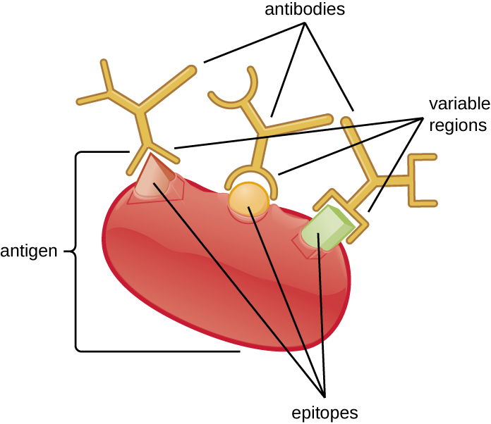

### Learning Objectives

* Compare the method of development, use, and characteristics of monoclonal and polyclonal antibodies
* Explain the nature of antibody cross-reactivity and why this is less of a problem with monoclonal antibodies

Part 1

In an unfortunate incident, a healthcare worker struggling with addiction was caught stealing syringes of painkillers and replacing them with syringes filled with unknown substances. The hospital immediately fired the employee and had him arrested; however, two patients that he had worked with later tested positive for HIV.

While there was no proof that the infections originated from the tainted syringes, the hospital’s public health physician took immediate steps to determine whether any other patients had been put at risk. Although the worker had only been employed for a short time, it was determined that he had come into contact with more than 1300 patients. The hospital decided to contact all of these patients and have them tested for HIV.

* Why does the hospital feel it is necessary to test every patient for HIV?
* What types of tests can be used to determine if a patient has HIV?
{: data-bullet-style="bullet"}

*Jump to the [next](/m58903#fs-id1167662465858) Clinical Focus box.*

In addition to being crucial for our normal immune response, **antibodies**{: data-type="term" .no-emphasis} provide powerful tools for research and diagnostic purposes. The high specificity of antibodies makes them an excellent tool for detecting and quantifying a broad array of targets, from drugs to serum proteins to microorganisms. With ***in vitro* assays**{: data-type="term" .no-emphasis}, antibodies can be used to precipitate soluble antigens, agglutinate (clump) cells, opsonize and kill bacteria with the assistance of complement, and neutralize drugs, toxins, and viruses.

An antibody’s **specificity**{: data-type="term"} results from the antigen-binding site formed within the **variable regions**{: data-type="term" .no-emphasis}—regions of the antibody that have unique patterns of amino acids that can only bind to target antigens with a molecular sequence that provides complementary charges and noncovalent bonds. There are limitations to antibody specificity, however. Some antigens are so chemically similar that **cross-reactivity**{: data-type="term" .no-emphasis} occurs; in other words, antibodies raised against one antigen bind to a chemically similar but different antigen. Consider an antigen that consists of a single protein with multiple epitopes ([\[link\]](#OSC_Microbio_20_01_Epitope)). This single protein may stimulate the production of many different antibodies, some of which may bind to chemically identical epitopes on other proteins.

Cross-reactivity is more likely to occur between antibodies and antigens that have low **affinity**{: data-type="term"} or **avidity**{: data-type="term"}. Affinity, which can be determined experimentally, is a measure of the binding strength between an antibody\'s binding site and an epitope, whereas avidity is the total strength of all the interactions in an antibody-antigen complex (which may have more than one bonding site). Avidity is influenced by affinity as well as the structural arrangements of the epitope and the variable regions of the antibody. If an antibody has a high affinity/avidity for a specific antigen, it is less likely to cross-react with an antigen for which it has a lower affinity/avidity.

 {: #OSC_Microbio_20_01_Epitope}

* What property makes antibodies useful for research and clinical diagnosis?
* What is cross-reactivity and why does it occur?
{: data-bullet-style="bullet"}

### Producing Polyclonal Antibodies

Antibodies used for research and diagnostic purposes are often obtained by injecting a lab animal such as a rabbit or a goat with a specific **antigen**{: data-type="term" .no-emphasis}. Within a few weeks, the animal’s immune system will produce high levels of antibodies specific for the antigen. These antibodies can be harvested in an **antiserum**{: data-type="term"}, which is whole serum collected from an animal following exposure to an antigen. Because most antigens are complex structures with multiple epitopes, they result in the production of multiple antibodies in the lab animal. This so-called **polyclonal antibody**{: data-type="term"} response is also typical of the response to infection by the human immune system. Antiserum drawn from an animal will thus contain antibodies from multiple clones of B cells, with each B cell responding to a specific epitope on the antigen ([\[link\]](#OSC_Microbio_20_01_poly)).

Lab animals are usually injected at least twice with antigen when being used to produce antiserum. The second injection will activate memory cells that make class **IgG**{: data-type="term" .no-emphasis} antibodies against the antigen. The memory cells also undergo **affinity maturation**{: data-type="term"}, resulting in a pool of antibodies with higher average affinity. Affinity maturation occurs because of mutations in the immunoglobulin gene variable regions, resulting in B cells with slightly altered antigen-binding sites. On re-exposure to the antigen, those B cells capable of producing antibody with higher affinity antigen-binding sites will be stimulated to proliferate and produce more antibody than their lower-affinity peers. An **adjuvant**{: data-type="term" .no-emphasis}, which is a chemical that provokes a generalized activation of the immune system that stimulates greater antibody production, is often mixed with the antigen prior to injection.

Antiserum obtained from animals will not only contain antibodies against the antigen artificially introduced in the laboratory, but it will also contain antibodies to any other antigens to which the animal has been exposed during its lifetime. For this reason, antisera must first be “purified” to remove other antibodies before using the antibodies for research or diagnostic assays.

 {: #OSC_Microbio_20_01_poly}

### Clinical Uses of Polyclonal Antisera

Polyclonal antisera are used in many clinical tests that are designed to determine whether a patient is producing antibodies in response to a particular pathogen. While these tests are certainly powerful diagnostic tools, they have their limitations, because they are an indirect means of determining whether a particular pathogen is present. Tests based on a polyclonal response can sometimes lead to a **false-positive**{: data-type="term"} result—in other words, a test that confirms the presence of an antigen that is, in fact, not present. Antibody-based tests can also result in a **false-negative**{: data-type="term"} result, which occurs when the test fails to detect an antibody that is, in fact, present.

The accuracy of antibody tests can be described in terms of **test sensitivity**{: data-type="term"} and **test specificity**{: data-type="term"}. Test sensitivity is the probability of getting a positive test result when the patient is indeed infected. If a test has high sensitivity, the probability of a false negative is low. Test specificity, on the other hand, is the probability of getting a negative test result when the patient is not infected. If a test has high specificity, the probability of a false positive is low.

False positives often occur due to **cross-reactivity**{: data-type="term" .no-emphasis}, which can occur when epitopes from a different pathogen are similar to those found on the pathogen being tested for. For this reason, antibody-based tests are often used only as **screening tests**{: data-type="term" .no-emphasis}; if the results are positive, other confirmatory tests are used to make sure that the results were not a false positive.

For example, a blood sample from a patient suspected of having hepatitis C can be screened for the virus using antibodies that bind to antigens on **hepatitis C**{: data-type="term" .no-emphasis} virus. If the patient is indeed infected with hepatitis C virus, the antibodies will bind to the antigens, yielding a positive test result. If the patient is not infected with hepatitic C virus, the antibodies will generally not bind to anything and the test should be negative; however, a false positive may occur if the patient has been previously infected by any of a variety of pathogens that elicit antibodies that cross-react with the hepatitis C virus antigens. Antibody tests for hepatitis C have high sensitivity (a low probability of a false negative) but low specificity (a high probability of a false positive). Thus, patients who test positive must have a second, confirmatory test to rule out the possibility of a false positive. The **confirmatory test**{: data-type="term" .no-emphasis} is a more expensive and time-consuming test that directly tests for the presence of hepatitis C viral RNA in the blood. Only after the confirmatory test comes back positive can the patient be definitively diagnosed with a hepatitis C infection. Antibody-based tests can result in a false negative if, for any reason, the patient’s immune system has not produced detectable levels of antibodies. For some diseases, it may take several weeks following infection before the immune system produces enough antibodies to cross the detection threshold of the assay. In immunocompromised patients, the immune system may not be capable of producing a detectable level of antibodies.

Another limitation of using antibody production as an indicator of disease is that antibodies in the blood will persist long after the infection has been cleared. Depending on the type of infection, antibodies will be present for many months; sometimes, they may be present for the remainder of the patient’s life. Thus, a positive antibody-based test only means that the patient was infected at some point in time; it does not prove that the infection is active.

In addition to their role in diagnosis, polyclonal antisera can activate complement, detect the presence of bacteria in clinical and food industry settings, and perform a wide array of precipitation reactions that can detect and quantify serum proteins, viruses, or other antigens. However, with the many specificities of antibody present in a polyclonal antiserum, there is a significant likelihood that the antiserum will cross-react with antigens to which the individual was never exposed. Therefore, we must always account for the possibility of false-positive results when working with a polyclonal antiserum.

* What is a false positive and what are some reasons that false positives occur?
* What is a false negative and what are some reasons that false positives occur?
* If a patient tests negative on a highly sensitive test, what is the likelihood that the person is infected with the pathogen?
{: data-bullet-style="bullet"}

### Producing Monoclonal Antibodies

Some types of assays require better antibody specificity and affinity than can be obtained using a polyclonal antiserum. To attain this high specificity, all of the antibodies must bind with high affinity to a single epitope. This high specificity can be provided by **monoclonal antibodies (mAbs)**{: data-type="term"}. [\[link\]](#fs-id1167660253847) compares some of the important characteristics of monoclonal and polyclonal antibodies.

Unlike polyclonal antibodies, which are produced in live animals, monoclonal antibodies are produced *in vitro* using tissue-culture techniques. mAbs are produced by immunizing an animal, often a mouse, multiple times with a specific antigen. B cells from the spleen of the immunized animal are then removed. Since normal B cells are unable to proliferate forever, they are fused with immortal, cancerous B cells called myeloma cells, to yield **hybridoma**{: data-type="term"} cells. All of the cells are then placed in a selective medium that allows only the hybridomas to grow; unfused myeloma cells cannot grow, and any unfused B cells die off. The hybridomas, which are capable of growing continuously in culture while producing antibodies, are then screened for the desired mAb. Those producing the desired mAb are grown in tissue culture; the culture medium is harvested periodically and mAbs are purified from the medium. This is a very expensive and time-consuming process. It may take weeks of culturing and many liters of media to provide enough mAbs for an experiment or to treat a single patient. mAbs are expensive ([\[link\]](#OSC_Microbio_20_01_mabprod)).

  are produced by introducing an antigen to a mouse and then fusing polyclonal B cells from the mouse&#x2019;s spleen to myeloma cells. The resulting hybridoma cells are cultured and continue to produce antibodies to the antigen. Hybridomas producing the desired mAb are then grown in large numbers on a selective medium that is periodically harvested to obtain the desired mAbs."){: #OSC_Microbio_20_01_mabprod}

<table summary="Table comparing Characteristics of Polyclonal and Monoclonal Antibodies. Monoclonal antibodies: Expensive production, Long production time, Large quantities of specific antibodies, Recognize a single epitope on an antigen, Production is continuous and uniform once the hybridoma is made. Polyclonal antibodies: Inexpensive production, Rapid production, Large quantities of nonspecific antibodies, Recognize multiple epitopes on an antigen, Different batches vary in composition." class="span-all"><thead>
<tr>
<th colspan="2" data-align="center">Characteristics of Polyclonal and Monoclonal Antibodies</th>
</tr>
<tr valign="top">
<th data-valign="top" data-align="left">Monoclonal Antibodies</th>
<th data-valign="top" data-align="left">Polyclonal Antibodies</th>
</tr>
</thead><tbody>
<tr valign="top">
<td data-valign="top" data-align="left">Expensive production</td>
<td data-valign="top" data-align="left">Inexpensive production</td>
</tr>
<tr valign="top">
<td data-valign="top" data-align="left">Long production time</td>
<td data-valign="top" data-align="left">Rapid production</td>
</tr>
<tr valign="top">
<td data-valign="top" data-align="left">Large quantities of specific antibodies</td>
<td data-valign="top" data-align="left">Large quantities of nonspecific antibodies</td>
</tr>
<tr valign="top">
<td data-valign="top" data-align="left">Recognize a single epitope on an antigen</td>
<td data-valign="top" data-align="left">Recognize multiple epitopes on an antigen</td>
</tr>
<tr valign="top">
<td data-valign="top" data-align="left">Production is continuous and uniform once the hybridoma is made</td>
<td data-valign="top" data-align="left">Different batches vary in composition</td>
</tr>
</tbody></table>

### Clinical Uses of Monoclonal Antibodies

Since the most common methods for producing monoclonal antibodies use mouse cells, it is necessary to create **humanized monoclonal antibodies**{: data-type="term"} for human clinical use. Mouse antibodies cannot be injected repeatedly into humans, because the immune system will recognize them as being foreign and will respond to them with neutralizing antibodies. This problem can be minimized by genetically engineering the antibody in the mouse B cell. The **variable regions**{: data-type="term" .no-emphasis} of the mouse light and heavy chain genes are ligated to human constant regions, and the chimeric gene is then transferred into a host cell. This allows production of a mAb that is mostly “human” with only the antigen-binding site being of mouse origin.

Humanized mAbs have been successfully used to treat cancer with minimal side effects. For example, the humanized monoclonal antibody drug **Herceptin**{: data-type="term" .no-emphasis} has been helpful for the treatment of some types of breast cancer. There have also been a few preliminary trials of humanized mAb for the treatment of infectious diseases, but none of these treatments are currently in use. In some cases, mAbs have proven too specific to treat infectious diseases, because they recognize some serovars of a pathogen but not others. Using a cocktail of multiple mAbs that target different strains of the pathogen can address this problem. However, the great cost associated with mAb production is another challenge that has prevented mAbs from becoming practical for use in treating microbial infections.[1](#footnote1){: data-type="footnote-link"}

One promising technology for inexpensive mAbs is the use of genetically engineered plants to produce antibodies (or **plantibodies**{: data-type="term"}). This technology transforms plant cells into antibody factories rather than relying on tissue culture cells, which are expensive and technically demanding. In some cases, it may even be possible to deliver these antibodies by having patients eat the plants rather than by extracting and injecting the antibodies. For example, in 2013, a research group cloned antibody genes into plants that had the ability to neutralize an important toxin from bacteria that can cause severe gastrointestinal disease.[2](#footnote2){: data-type="footnote-link"} Eating the plants could potentially deliver the antibodies directly to the toxin.

* How are humanized monoclonal antibodies produced?
* What does the “monoclonal” of monoclonal antibodies mean?
{: data-bullet-style="bullet"}

Using Monoclonal Antibodies to Combat Ebola

During the 2014–2015 Ebola outbreak in West Africa, a few Ebola-infected patients were treated with ZMapp, a drug that had been shown to be effective in trials done in rhesus macaques only a few months before.[3](#footnote3){: data-type="footnote-link"} ZMapp is a combination of three mAbs produced by incorporating the antibody genes into tobacco plants using a viral vector. By using three mAbs, the drug is effective across multiple strains of the virus. Unfortunately, there was only enough ZMapp to treat a tiny number of patients.

While the current technology is not adequate for producing large quantities of ZMapp, it does show that plantibodies—plant-produced mAbs—are feasible for clinical use, potentially cost effective, and worth further development. The last several years have seen an explosion in the number of new mAb-based drugs for the treatment of cancer and infectious diseases; however, the widespread use of such drugs is currently inhibited by their exorbitant cost, especially in underdeveloped parts of the world, where a single dose might cost more than the patient’s lifetime income. Developing methods for cloning antibody genes into plants could reduce costs dramatically.

### Key Concepts and Summary

* Antibodies bind with high **specificity** to antigens used to challenge the immune system, but they may also show **cross-reactivity** by binding to other antigens that share chemical properties with the original antigen.
* Injection of an antigen into an animal will result in a **polyclonal antibody** response in which different antibodies are produced that react with the various epitopes on the antigen.
* **Polyclonal antisera** are useful for some types of laboratory assays, but other assays require more specificity. Diagnostic tests that use polyclonal antisera are typically only used for screening because of the possibility of **false-positive** and **false-negative** results.
* **Monoclonal antibodies** provide higher specificity than polyclonal antisera because they bind to a single epitope and usually have high **affinity**.
* Monoclonal antibodies are typically produced by culturing antibody-secreting **hybridomas** derived from mice. mAbs are currently used to treat cancer, but their exorbitant cost has prevented them from being used more widely to treat infectious diseases. Still, their potential for laboratory and clinical use is driving the development of new, cost-effective solutions such as **plantibodies**.
{: data-bullet-style="bullet"}

### Multiple Choice

For many uses in the laboratory, polyclonal antibodies work well, but for some types of assays, they lack sufficient \_\_\_\_\_\_\_\_ because they cross-react with inappropriate antigens.

1.  specificity
2.  sensitivity
3.  accuracy
4.  reactivity
{: data-number-style="lower-alpha"}

A

How are monoclonal antibodies produced?

1.  Antibody-producing B cells from a mouse are fused with myeloma cells and then the cells are grown in tissue culture.
2.  A mouse is injected with an antigen and then antibodies are harvested from its serum.
3.  They are produced by the human immune system as a natural response to an infection.
4.  They are produced by a mouse’s immune system as a natural response to an infection.
{: data-number-style="lower-alpha"}

A

### Fill in the Blank

When we inject an animal with the same antigen a second time a few weeks after the first, \_\_\_\_\_\_\_\_ takes place, which means the antibodies produced after the second injection will on average bind the antigen more tightly.

affinity maturation

When using mAbs to treat disease in humans, the mAbs must first be \_\_\_\_\_\_\_\_ by replacing the mouse constant region DNA with human constant region DNA.

humanized

If we used normal mouse mAbs to treat human disease, multiple doses would cause the patient to respond with \_\_\_\_\_\_\_\_ against the mouse antibodies.

neutralizing antibodies

A polyclonal response to an infection occurs because most antigens have multiple \_\_\_\_\_\_\_\_,

epitopes

### Short Answer

Describe two reasons why polyclonal antibodies are more likely to exhibit cross-reactivity than monoclonal antibodies.

### Critical Thinking

Suppose you were screening produce in a grocery store for the presence of *E. coli* contamination. Would it be better to use a polyclonal anti-*E. coli* antiserum or a mAb against an *E. coli* membrane protein? Explain.

### Footnotes
{: data-type="footnote-refs-title"}

* {: data-type="footnote-ref" #footnote1} [1](#footnote-ref1){: data-type="footnote-ref-link"} Saylor, Carolyn, Ekaterina Dadachova and Arturo Casadevall, “Monoclonal Antibody-Based Therapies for Microbial Diseases,” *Vaccine* 27 (2009): G38-G46.
* {: data-type="footnote-ref" #footnote2} [2](#footnote-ref2){: data-type="footnote-ref-link"} Nakanishi, Katsuhiro et al., “Production of Hybrid-IgG/IgA Plantibodies with Neutralizing Activity against Shiga Toxin 1,” *PloS One* 8, no. 11 (2013): e80712.
* {: data-type="footnote-ref" #footnote3} [3](#footnote-ref3){: data-type="footnote-ref-link"} Qiu, Xiangguo et al., “Reversion of Advanced Ebola Virus Disease in Nonhuman Primates with ZMapp,” *Nature* 514 (2014): 47–53.
{: data-list-type="bulleted" data-bullet-style="none"}

