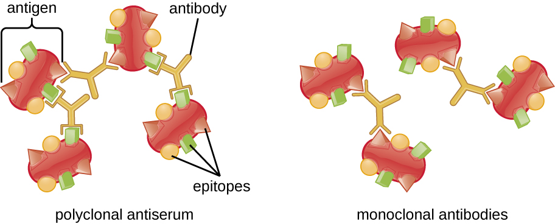

### Learning Objectives

* Describe various types of assays used to find antigen-antibody complexes
* Describe the circumstances under which antigen-antibody complexes precipitate out of solution
* Explain how antibodies in patient serum can be used to diagnose disease

Laboratory tests to detect antibodies and antigens outside of the body (e.g., in a test tube) are called *in vitro* assays. When both antibodies and their corresponding antigens are present in a solution, we can often observe a precipitation reaction in which large complexes (lattices) form and settle out of solution. In the next several sections, we will discuss several common *in vitro* assays.

### Precipitin Reactions

A visible antigen-antibody complex is called a **precipitin**{: data-type="term"}, and *in vitro* assays that produce a precipitin are called **precipitin reactions**{: data-type="term" .no-emphasis}. A precipitin reaction typically involves adding soluble antigens to a test tube containing a solution of antibodies. Each antibody has two arms, each of which can bind to an epitope. When an antibody binds to two antigens, the two antigens become bound together by the antibody. A lattice can form as antibodies bind more and more antigens together, resulting in a precipitin ([\[link\]](#OSC_Microbio_20_02_Preciptin)). Most precipitin tests use a **polyclonal antiserum**{: data-type="term" .no-emphasis} rather than **monoclonal antibodies**{: data-type="term" .no-emphasis} because polyclonal antibodies can bind to multiple epitopes, making lattice formation more likely. Although mAbs may bind some antigens, the binding will occur less often, making it much less likely that a visible precipitin will form.

 {: #OSC_Microbio_20_02_Preciptin}

The amount of precipitation also depends on several other factors. For example, precipitation is enhanced when the antibodies have a high affinity for the antigen. While most antibodies bind antigen with high affinity, even high-affinity binding uses relatively weak noncovalent bonds, so that individual interactions will often break and new interactions will occur.

In addition, for precipitin formation to be visible, there must be an optimal ratio of antibody to antigen. The optimal ratio is not likely to be a 1:1 antigen-to-antibody ratio; it can vary dramatically, depending on the number of epitopes on the antigen and the class of antibody. Some antigens may have only one or two **epitopes**{: data-type="term" .no-emphasis} recognized by the antiserum, whereas other antigens may have many different epitopes and/or multiple instances of the same epitope on a single antigen molecule.

[\[link\]](#OSC_Microbio_20_02_Preciptinform) illustrates how the ratio of antigen and antibody affects the amount of precipitation. To achieve the optimal ratio, antigen is slowly added to a solution containing antibodies, and the amount of precipitin is determined qualitatively. Initially, there is not enough antigen to produce visible lattice formation; this is called the zone of antibody excess. As more antigen is added, the reaction enters the **equivalence zone**{: data-type="term"} (or zone of equivalence), where both the optimal antigen-antibody interaction and maximal precipitation occur. If even more antigen were added, the amount of antigen would become excessive and actually cause the amount of precipitation to decline.

 ![(A) Diagram of polyclonal antiserum. Antigens with multiple epitopes (shapes on their surface) are bound to different antibodies (each antibody binds to a different epitope). B) Diagram of monoclonal antibodies. Antigens with multiple epitopes have only one type of antibody bound to a single epitope on each. A graph; the X-axis is labeled antigen added and Y-axis is labeled precipitin formed. In the zone of antibody excess there is more antibody than antigen. In this case, there is no precipitate. In the equivalence zone there are approximately equal amounts of antigen and antibody. In this case a precipitate does form. In the zone of antigen excess, there is more antigen than antibody and no precipitate forms.](../resources/OSC_Microbio_20_02_Precipform.jpg "As antigen is slowly added to a solution containing a constant amount antibody, the amount of precipitin increases as the antibody-to-antigen ratio approaches the equivalence zone and decreases once the proportion of antigen exceeds the optimal ratio."){: #OSC_Microbio_20_02_Preciptinform}

* What is a precipitin?
* Why do polyclonal antisera produce a better precipitin reaction?
{: data-bullet-style="bullet"}

#### Precipitin Ring Test

A variety of techniques allow us to use precipitin formation to quantify either antigen concentration or the amount of antibody present in an antiserum. One such technique is the **precipitin ring test**{: data-type="term"} ([\[link\]](#OSC_Microbio_20_02_PRing)), which is used to determine the relative amount of antigen-specific antibody in a sample of serum. To perform this test, a set of test tubes is prepared by adding an antigen solution to the bottom of each tube. Each tube receives the same volume of solution, and the concentration of antigens is constant (e.g., 1 mg/mL). Next, glycerol is added to the antigen solution in each test tube, followed by a **serial dilution**{: data-type="term" .no-emphasis} of the antiserum. The glycerol prevents mixing of the antiserum with the antigen solution, allowing antigen-antibody binding to take place only at the interface of the two solutions. The result is a visible ring of precipitin in the tubes that have an antigen-antibody ratio within the equivalence zone. This highest dilution with a visible ring is used to determine the **titer**{: data-type="term"} of the antibodies. The titer is the reciprocal of the highest dilution showing a positive result, expressed as a whole number. In [\[link\]](#OSC_Microbio_20_02_PRing), the titer is 16.

While a measurement of titer does not tell us in absolute terms how much antibody is present, it does give a measure of biological activity, which is often more important than absolute amount. In this example, it would not be useful to know what mass of **IgG**{: data-type="term" .no-emphasis} were present in the antiserum, because there are many different specificities of antibody present; but it is important for us to know how much of the antibody activity in a patient’s serum is directed against the antigen of interest (e.g., a particular pathogen or allergen).

 {: #OSC_Microbio_20_02_PRing}

#### Ouchterlony Assay

While the precipitin ring test provides insights into antibody-antigen interactions, it also has some drawbacks. It requires the use of large amounts of serum, and great care must be taken to avoid mixing the solutions and disrupting the ring. Performing a similar test in an agar gel matrix can minimize these problems. This type of assay is variously called **double immunodiffusion**{: data-type="term"} or the **Ouchterlony assay**{: data-type="term"} for Orjan **Ouchterlony**{: data-type="term" .no-emphasis},[1](#footnote1){: data-type="footnote-link"} who first described the technique in 1948.

When agar is highly purified, it produces a clear, colorless gel. Holes are punched in the gel to form wells, and antigen and antisera are added to neighboring wells. Proteins are able to diffuse through the gel, and precipitin arcs form between the wells at the zone of equivalence. Because the **precipitin**{: data-type="term" .no-emphasis} lattice is too large to diffuse through the gel, the arcs are firmly locked in place and easy to see ([\[link\]](#OSC_Microbio_20_02_Ouchter)).

Although there are now more sensitive and quantitative methods of detecting antibody-antigen interactions, the Ouchterlony test provides a rapid and qualitative way of determining whether an antiserum has antibodies against a particular antigen. The Ouchterlony test is particularly useful when looking for **cross-reactivity**{: data-type="term" .no-emphasis}. We can check an antiserum against a group of closely related antigens and see which combinations form precipitin arcs.

  and antisera (wells 1 through 5) in a gel. The antibodies and antigen diffuse through the gel, causing a precipitin arc to form at the zone of equivalence. In this example, only the antiserum in well 1 contains antibodies to the antigen. The resulting precipitin arc is stable because the lattice is too large to diffuse through the gel. (credit left: modification of work by Higgins PJ, Tong C, Borenfreund E, Okin RS, Bendich A)"){: #OSC_Microbio_20_02_Ouchter}

#### Radial Immunodiffusion Assay

The **radial immunodiffusion**{: data-type="term"} (RID) assay is similar to the Ouchterlony assay but is used to precisely quantify antigen concentration rather than to compare different antigens. In this assay, the antiserum is added to tempered agar (liquid agar at slightly above 45 °C), which is poured into a small petri dish or onto a glass slide and allowed to cool. Wells are cut in the cooled agar, and antigen is then added to the wells and allowed to diffuse. As the antigen and antibody interact, they form a zone of precipitation. The square of the diameter of the zone of precipitation is directly proportional to the concentration of antigen. By measuring the zones of precipitation produced by samples of known concentration (see the outer ring of samples in [\[link\]](#OSC_Microbio_20_02_RID)), we can prepare a standard curve for determining the concentration of an unknown solution. The RID assay is a also useful test for determining the concentration of many serum proteins such as the C3 and C4 complement proteins, among others.

 ![At the top is a photograph of 4 clear dots in a row. Dot 1 has a small ring around it, dot 2 has a larger ring, dot 3 has a larger ring, and dot 4 has an even larger ring. These have arrows leading to a graph that shows that the size of the ring (zone of precipitation diameter)  relates to the concentration of antigen. The lower antigen concentration results in a smaller ring.  Another dot (#5) off to the side contains an unknown antigen concentration. The size of the ring is measured and used to find the concentration of antigen. This is done by finding the ring size on the line from the graph and connecting that to the X-axis to find the concentration of antigen.](../resources/OSC_Microbio_20_02_RID.jpg "In this radial immunodiffusion (RID) assay, an antiserum is mixed with the agar before it is cooled, and solutions containing antigen are added to each well in increasing concentrations (wells 1&#x2013;4). An antigen solution of an unknown concentration is added to well 5. The zones of precipitation are measured and plotted against a standard curve to determine the antigen concentration of the unknown sample. (credit circles: modification of work by Kangwa M, Yelemane V, Polat AN, Gorrepati KD, Grasselli M, Fern&#xE1;ndez-Lahore M)"){: #OSC_Microbio_20_02_RID}

* Why does a precipitin ring form in a precipitin ring test, and what are some reasons why a ring might not form?
* Compare and contrast the techniques used in an Ouchterlony assay and a radial immunodiffusion assay.
{: data-bullet-style="bullet"}

#### Flocculation Assays

A flocculation assay is similar to a precipitin reaction except that it involves insoluble antigens such as lipids. A **flocculant**{: data-type="term"} is similar to a precipitin in that there is a visible lattice of antigen and antibody, but because lipids are insoluble in aqueous solution, they cannot precipitate. Instead of precipitation, flocculation (foaming) is observed in the test tube fluid.

Using Flocculation to Test for Syphilis

Syphilis is a sexually transmitted infection that can cause severe, chronic disease in adults. In addition, it is readily passed from infected mothers to their newborns during pregnancy and childbirth, often resulting in stillbirth or serious long-term health problems for the infant. Unfortunately, syphilis can also be difficult to diagnose in expectant mothers, because it is often asymptomatic, especially in women. In addition, the causative agent, the bacterium ***Treponema pallidum***{: data-type="term" .no-emphasis}, is both difficult to grow on conventional lab media and too small to see using routine microcopy. For these reasons, presumptive diagnoses of syphilis are generally confirmed indirectly in the laboratory using tests that detect antibodies to treponemal antigens.

In 1906, German scientist August von **Wassermann**{: data-type="term" .no-emphasis} (1866–1925) introduced the first test for syphilis that relied on detecting anti-treponemal antibodies in the patient’s blood. The antibodies detected in the Wassermann test were antiphospholipid antibodies that are nonspecific to *T. pallidum*. Their presence can assist in the diagnosis of syphilis, but because they are nonspecific, they can also lead to false-positive results in patients with other diseases and autoimmune conditions. The original **Wasserman test**{: data-type="term" .no-emphasis} has been modified over the years to minimize **false-positives**{: data-type="term" .no-emphasis} and is now known as the Venereal Disease Research Lab test, better known by its acronym, the **VDRL test**{: data-type="term" .no-emphasis}.

To perform the VDRL test, patient serum or cerebral spinal fluid is placed on a slide with a mixture of **cardiolipin**{: data-type="term" .no-emphasis} (an antigenic phospholipid found in the mitochondrial membrane of various pathogens), lecithin, and cholesterol. The lecithin and cholesterol stabilize the reaction and diminish false positives. Anti-treponemal antibodies from an infected patient’s serum will bind cardiolipin and form a flocculant. Although the VDRL test is more specific than the original Wassermann assay, false positives may still occur in patients with autoimmune diseases that cause extensive cell damage (e.g., **systemic lupus erythematosus**{: data-type="term" .no-emphasis}).

### Neutralization Assay

To cause infection, viruses must bind to receptors on host cells. Antiviral antibodies can neutralize viral infections by coating the virions, blocking the binding ([\[link\]](/m58884#OSC_Microbio_18_04_neutral)). This activity neutralizes virions and can result in the formation of large antibody-virus complexes (which are readily removed by phagocytosis) or by antibody binding to the virus and blocking its binding to host cell receptors. This neutralization activity is the basis of **neutralization assays**{: data-type="term" .no-emphasis}, sensitive assays used for diagnoses of viral infections.

When viruses infect cells, they often cause damage (**cytopathic effects**{: data-type="term" .no-emphasis}) that may include lysis of the host cells. Cytopathic effects can be visualized by growing host cells in a petri dish, covering the cells with a thin layer of agar, and then adding virus (see [Isolation, Culture, and Identification of Viruses](/m58810){: .target-chapter}). The virus will diffuse very slowly through the agar. A virus will enter a host cell, proliferate (causing cell damage), be released from the dead host cell, and then move to neighboring cells. As more and more cells die, **plaques**{: data-type="term" .no-emphasis} of dead cells will form ([\[link\]](#OSC_Microbio_20_02_Plaques)).

During the course of a viral infection, the patient will mount an antibody response to the virus, and we can quantify those antibodies using a **plaque reduction assay**{: data-type="term" .no-emphasis}. To perform the assay, a **serial dilution**{: data-type="term" .no-emphasis} is carried out on a serum sample. Each dilution is then mixed with a standardized amount of the suspect virus. Any virus-specific antibodies in the serum will neutralize some of the virus. The suspensions are then added to host cells in culture to allow any nonneutralized virus to infect the cells and form plaques after several days. The **titer**{: data-type="term" .no-emphasis} is defined as the reciprocal of the highest dilution showing a 50% reduction in plaques. Titer is always expressed as a whole number. For example, if a 1/64 dilution was the highest dilution to show 50% plaque reduction, then the titer is 64.

The presence of antibodies in the patient’s serum does not tell us whether the patient is currently infected or was infected in the past. Current infections can be identified by waiting two weeks and testing another serum sample. A four-fold increase in neutralizing titer in this second sample indicates a new infection.

  contain a low concentration of antibodies. The wells with relatively few plaques have a high concentration of antibodies. (credit: modification of work by Centers for Disease Control and Prevention)"){: #OSC_Microbio_20_02_Plaques}

* In a neutralization assay, if a patient’s serum has high numbers of antiviral antibodies, would you expect to see more or fewer plaques?
{: data-bullet-style="bullet"}

### Immunoelectrophoresis

When a patient has elevated protein levels in the blood or is losing protein in the urine, a clinician will often order a **polyacrylamide gel electrophoresis**{: data-type="term" .no-emphasis} (**PAGE**{: data-type="term" .no-emphasis}) assay (see [Visualizing and Characterizing DNA, RNA, and Protein](/m58849){: .target-chapter}). This assay compares the relative abundance of the various types of serum proteins. Abnormal protein electrophoresis patterns can be further studied using **immunoelectrophoresis (IEP)**{: data-type="term"}. The IEP begins by running a PAGE. Antisera against selected serum proteins are added to troughs running parallel to the electrophoresis track, forming **precipitin arcs**{: data-type="term" .no-emphasis} similar to those seen in an **Ouchterlony assay**{: data-type="term" .no-emphasis} ([\[link\]](#OSC_Microbio_20_02_IEP)). This allows the identification of abnormal immunoglobulin proteins in the sample.

IEP is particularly useful in the diagnosis of **multiple myeloma**{: data-type="term" .no-emphasis}, a cancer of antibody-secreting cells. Patients with multiple myeloma cannot produce healthy antibodies; instead they produce abnormal antibodies that are monoclonal proteins (M proteins). Thus, patients with multiple myeloma will present with elevated serum protein levels that show a distinct band in the gamma globulin region of a protein electrophoresis gel and a sharp spike (in M protein) on the densitometer scan rather than the normal broad smear ([\[link\]](#OSC_Microbio_20_02_Spike)). When antibodies against the various types of antibody heavy and light chains are used to form precipitin arcs, the **M protein**{: data-type="term" .no-emphasis} will cause distinctly skewed arcs against one class of heavy chain and one class of light chain as seen in [\[link\]](#OSC_Microbio_20_02_IEP).

 ![a) A graph showing a large peak at alb and smaller peaks at alpha1, alpha2, beta, and gamma.  B) A photograph showing various white lines on a blue background. The top line is labeled anti-human whole serum, the next is anti-IgG, the next is anti-IgA, the next is anti-K and the next is anti-lambda. Each of these is near a band from both the normal and patient urine samples. Black arrows point to the patient&#x2019;s sample next to anti-IgG and anti-k. A white arrow points to the band from the patient near anti-K.](../resources/OSC_Microbio_20_02_IEP.jpg "(a) This graph shows normal measurements of serum proteins. (b) This photograph shows an immunoelectrophoresis of urine. After electrophoresis, antisera were added to the troughs and the precipitin arcs formed, illustrating the distribution of specific proteins. The skewed arcs (arrows) help to diagnose multiple myeloma. (credit a, b: modification of work by Izawa S, Akimoto T, Ikeuchi H, Kusano E, Nagata D)"){: #OSC_Microbio_20_02_IEP}

Protein Electrophoresis and the Characterization of Immunoglobulin Structure

The advent of electrophoresis ultimately led to researching and understanding the structure of antibodies. When Swedish biochemist Arne Tiselius (1902–1971) published the first protein electrophoresis results in 1937,[2](#footnote2){: data-type="footnote-link"} he could identify the protein albumin (the smallest and most abundant serum protein) by the sharp band it produced in the gel. The other serum proteins could not be resolved in a simple protein electrophoresis, so he named the three broad bands, with many proteins in each band, alpha, beta, and gamma globulins. Two years later, American immunologist Elvin Kabat (1914–2000) traveled to Sweden to work with Tiselius using this new technique and showed that antibodies migrated as gamma globulins.[3](#footnote3){: data-type="footnote-link"} With this new understanding in hand, researchers soon learned that multiple myeloma, because it is a cancer of antibody-secreting cells, could be tentatively diagnosed by the presence of a large M spike in the gamma-globulin region by protein electrophoresis. Prior to this discovery, studies on immunoglobulin structure had been minimal, because of the difficulty of obtaining pure samples to study. Sera from multiple myeloma patients proved to be an excellent source of highly enriched monoclonal immunoglobulin, providing the raw material for studies over the next 20-plus years that resulted in the elucidation of the structure of immunoglobulin.

 and normal sera (left). The proteins have been stained; when the density of each band is quantified by densitometry, the data produce the bar graph on the right. Both gels show the expected dense band of albumin at the bottom and an abnormal spike in the gamma-globulin region. (credit: modification of work by Soodgupta D, Hurchla MA, Jiang M, Zheleznyak A, Weilbaecher KN, Anderson CJ, Tomasson MH, Shokeen M)"){: #OSC_Microbio_20_02_Spike}

* In general, what does an immunoelectrophoresis assay accomplish?
{: data-bullet-style="bullet"}

### Immunoblot Assay: The Western Blot

After performing protein gel electrophoresis, specific proteins can be identified in the gel using antibodies. This technique is known as the **western blot**{: data-type="term"}. Following separation of proteins by PAGE, the protein antigens in the gel are transferred to and immobilized on a nitrocellulose membrane. This membrane can then be exposed to a **primary antibody**{: data-type="term" .no-emphasis} produced to specifically bind to the protein of interest. A second antibody equipped with a molecular beacon will then bind to the first. These secondary antibodies are coupled to another molecule such as an enzyme or a **fluorophore**{: data-type="term"} (a molecule that fluoresces when excited by light). When using antibodies coupled to enzymes, a **chromogenic substrate**{: data-type="term"} for the enzyme is added. This substrate is usually colorless but will develop color in the presence of the antibody. The fluorescence or substrate coloring identifies the location of the specific protein in the membrane to which the antibodies are bound ([\[link\]](#OSC_Microbio_20_02_Western)).

Typically, **polyclonal antibodies**{: data-type="term" .no-emphasis} are used for western blot assays. They are more sensitive than mAbs because of their ability to bind to various epitopes of the primary antigen, and the signal from polyclonal antibodies is typically stronger than that from mAbs. Monoclonal antibodies can also be used; however, they are much more expensive to produce and are less sensitive, since they are only able to recognize one specific epitope.

Several variations of the western blot are useful in research. In a **southwestern blot**{: data-type="term" .no-emphasis}, proteins are separated by SDS-PAGE, blotted onto a nitrocellulose membrane, allowed to renature, and then probed with a fluorescently or radioactively labeled DNA probe; the purpose of the southwestern is to identify specific DNA-protein interactions. **Far-western blots**{: data-type="term" .no-emphasis} are carried out to determine protein-protein interactions between immobilized proteins (separated by SDS-PAGE, blotted onto a nitrocellulose membrane, and allowed to renature) and non-antibody protein probes. The bound non-antibody proteins that interact with the immobilized proteins in a far-western blot may be detected by radiolabeling, fluorescence, or the use of an antibody with an enzymatic molecular beacon.

 ![(a) A diagram showing the process of a western blot. Step 1 &#x2013; a gel is on top of a nitrocellulose membrane and filter paper is on either side. This is all sandwiched between positive and negative plates. If the proteins are hydrophobic use PVDF membrane instead of nitrocellulose. This causes the proteins to bind to the membrane. At this point there are many protein bands.  Then antibodies specific to the protein on interest are added. They bind to one of the protein bands on the membrane. Next labeled antibodies bidn to the first set of antibodies. This results in a single visible band. (b) A photo of the results shows dark bands on a white membrane.](../resources/OSC_Microbio_20_02_Western.jpg "(a) This diagram summarizes the process of western blotting. Antibodies are used to identify specific bands on the protein gel. (b) A western blot test for antibodies against HIV. The top strip is the negative control; the next strip is the positive control. The bottom two strips are patient serum samples containing antibodies. (credit a: modification of work by &#x201C;Bensaccount&#x201D;/Wikimedia Commons)"){: #OSC_Microbio_20_02_Western}

* What is the function of the enzyme in the immunoblot assay?
{: data-bullet-style="bullet"}

### Complement-Mediated Immunoassay

One of the key functions of antibodies is the activation (fixation) of complement. When antibody binds to bacteria, for example, certain **complement proteins**{: data-type="term" .no-emphasis} recognize the bound antibody and activate the **complement cascade**{: data-type="term" .no-emphasis}. In response, other complement proteins bind to the bacteria where some serve as <strong data-type="term" class="no-emphasis">opsonins </strong>to increase the efficiency of phagocytosis and others create holes in gram-negative bacterial cell membranes, causing lysis. This lytic activity can be used to detect the presence of antibodies against specific antigens in the serum.

Red blood cells are good indicator cells to use when evaluating complement-mediated cytolysis. Hemolysis of red blood cells releases hemoglobin, which is a brightly colored pigment, and hemolysis of even a small number of red cells will cause the solution to become noticeably pink ([\[link\]](#OSC_Microbio_20_02_Complement)). This characteristic plays a role in the **complement fixation test**{: data-type="term"}, which allows the detection of antibodies against specific pathogens. The complement fixation test can be used to check for antibodies against pathogens that are difficult to culture in the lab such as fungi, viruses, or the bacteria *Chlamydia*.

To perform the complement fixation test, antigen from a pathogen is added to patient serum. If antibodies to the antigen are present, the antibody will bind the antigen and fix all the available complement. When red blood cells and antibodies against red blood cells are subsequently added to the mix, there will be no complement left to lyse the red cells. Thus, if the solution remains clear, the test is positive. If there are no antipathogen antibodies in the patient’s serum, the added antibodies will activate the complement to lyse the red cells, yielding a negative test ([\[link\]](#OSC_Microbio_20_02_Complement)).

 ![Diagram of the complement fixation test. 1. Patient A&#x2019;s serum contains antibodies to the suspected antigen. Patient B&#x2019;s serum does not. Both patients have complement, but different amounts. 2. Heating the serum destroys all of the complement in the patient&#x2019;s serum. Antibodies remain in Patient A&#x2019;s serum. 3. An equal amount of complement is then added to the serum for both patients. Antigens are also added. In patient A&#x2019;s serum, antibodies bind to antigens and complement fixation occurs. Patient B&#x2019;s serum lacks antibodies, so complement fixation does not occur. 4. Sheep RBCs and antibodies to sheep RBCs are added to both samples. 5. In patient A, complement is already fixed and cannot lyse RBCs. The antibodies bind to RBCs and settle to the bottom. In patient B, antibodies bind to RBCs and complement lyses the RBCs. Serum turns pink.](../resources/OSC_Microbio_20_02_Complement.jpg "The complement fixation test is used to determine whether a patient&#x2019;s serum contains antibodies to a specific antigen. If it does, complement fixation will occur, and there will be no complement available to lyse the antibody-bound sheep red blood cells that are added to the solution in the next step. If the sample does not contain antibodies to the antigen, hemolysis of the sheep blood cells will be observed."){: #OSC_Microbio_20_02_Complement}

  
View this [video][1] to see an outline of the steps of the complement fixation test.

* In a complement fixation test, if the serum turns pink, does the patient have antibodies to the antigen or not? Explain.
{: data-bullet-style="bullet"}

[\[link\]](#fs-id1167661342578) summarizes the various types of antibody-antigen assays discussed in this section.

<table summary="Table titled: Mechanisms of Select Antibody-Antigen Assays. Columns: Type of Assay, Mechanism, Examples. Row 1 &#x2013; Precipitation; Antibody binds to soluble antigen, forming a visible precipitin; Precipitin ring test to visualize lattice formation in solution; Immunoelectrophoresis to examine distribution of antigens following electrophoresis; Ouchterlony assay to compare diverse antigens; Radial immunodiffusion assay to quantify antigens. Row 2 &#x2013; Flocculation; Antibody binds to insoluble molecules in suspension, forming visible aggregates; VDRL test for syphilis. Row 3 &#x2013; Neutralization; Antibody binds to virus, blocking viral entry into target cells and preventing formation of plaques; Plaque reduction assay for detecting presence of neutralizing antibodies in patient sera. Row 4 - Complement activation; Antibody binds to antigen, inducing complement activation and leaving no complement to lyse red blood cells; Complement fixation test for patient antibodies against hard-to-culture bacteria such as Chlamydia." class="span-all"><thead>
<tr>
<th colspan="3" data-align="center">Mechanisms of Select Antibody-Antigen Assays</th>
</tr>
<tr valign="top">
<th data-valign="top" data-align="left">Type of Assay</th>
<th data-valign="top" data-align="left">Mechanism</th>
<th data-valign="top" data-align="left">Examples</th>
</tr>
</thead><tbody>
<tr valign="top">
<td rowspan="4" data-valign="top" data-align="left">Precipitation</td>
<td rowspan="4" data-valign="top" data-align="left">Antibody binds to soluble antigen, forming a visible precipitin</td>
<td data-valign="top" data-align="left">Precipitin ring test to visualize lattice formation in solution</td>
</tr>
<tr valign="top">
<td data-valign="top" data-align="left">Immunoelectrophoresis to examine distribution of antigens following electrophoresis</td>
</tr>
<tr valign="top">
<td data-valign="top" data-align="left">Ouchterlony assay to compare diverse antigens</td>
</tr>
<tr valign="top">
<td data-valign="top" data-align="left">Radial immunodiffusion assay to quantify antigens</td>
</tr>
<tr valign="top">
<td data-valign="top" data-align="left">Flocculation</td>
<td data-valign="top" data-align="left">Antibody binds to insoluble molecules in suspension, forming visible aggregates</td>
<td data-valign="top" data-align="left">VDRL test for syphilis</td>
</tr>
<tr valign="top">
<td data-valign="top" data-align="left">Neutralization</td>
<td data-valign="top" data-align="left">Antibody binds to virus, blocking viral entry into target cells and preventing formation of plaques</td>
<td data-valign="top" data-align="left">Plaque reduction assay for detecting presence of neutralizing antibodies in patient sera</td>
</tr>
<tr valign="top">
<td data-valign="top" data-align="left">Complement activation</td>
<td data-valign="top" data-align="left">Antibody binds to antigen, inducing complement activation and leaving no complement to lyse red blood cells</td>
<td data-valign="top" data-align="left">Complement fixation test for patient antibodies against hard-to-culture bacteria such as <em>Chlamydia</em></td>
</tr>
</tbody></table>

### Key Concepts and Summary

* When present in the correct ratio, antibody and antigen will form a **precipitin**, or lattice that precipitates out of solution.
* A **precipitin ring test** can be used to visualize lattice formation in solution. The **Ouchterlony assay** demonstrates lattice formation in a gel. The **radial immunodiffusion** assay is used to quantify antigen by measuring the size of a precipitation zone in a gel infused with antibodies.
* Insoluble antigens in suspension will form **flocculants** when bound by antibodies. This is the basis of the VDRL test for syphilis in which anti-treponemal antibodies bind to cardiolipin in suspension.
* Viral infections can be detected by quantifying virus-neutralizing antibodies in a patient’s serum.
* Different antibody classes in plasma or serum are identified by using **immunoelectrophoresis**.
* The presence of specific antigens (e.g., bacterial or viral proteins) in serum can be demonstrated by **western blot** assays, in which the proteins are transferred to a nitrocellulose membrane and identified using labeled antibodies.
* In the complement fixation test, complement is used to detect antibodies against various pathogens.
{: data-bullet-style="bullet"}

### Multiple Choice

The formation of \_\_\_\_\_\_\_\_ is a positive result in the VDRL test.

1.  flocculant
2.  precipitin
3.  coagulation
4.  a bright pink color
{: type="a"}

A

The titer of a virus neutralization test is the highest dilution of patient serum

1.  in which there is no detectable viral DNA.
2.  in which there is no detectable viral protein.
3.  that completely blocks plaque formation.
4.  that reduces plaque formation by at least 50%.
{: type="a"}

D

In the Ouchterlony assay, we see a sharp precipitin arc form between antigen and antiserum. Why does this arc remain visible for a long time?

1.  The antibody molecules are too large to diffuse through the agar.
2.  The precipitin lattice is too large to diffuse through the agar.
3.  Methanol, added once the arc forms, denatures the protein and blocks diffusion.
4.  The antigen molecules are chemically coupled to the gel matrix.
{: type="a"}

B

### Fill in the Blank

When slowly adding antigen to an antiserum, the amount of precipitin would gradually increase until reaching the \_\_\_\_\_\_\_\_; addition of more antigen after this point would actually decrease the amount of precipitin.

equivalence zone or zone of equivalence

The radial immunodiffusion test quantifies antigen by mixing \_\_\_\_\_\_\_\_ into a gel and then allowing antigen to diffuse out from a well cut in the gel.

antiserum

### Short Answer

Explain why hemolysis in the complement fixation test is a negative test for infection.

What is meant by the term “neutralizing antibodies,” and how can we quantify this effect using the viral neutralization assay?

### Critical Thinking

Both IgM and IgG antibodies can be used in precipitation reactions. However, one of these immunoglobulin classes will form precipitates at much lower concentrations than the other. Which class is this, and why is it so much more efficient in this regard?

### Footnotes
{: data-type="footnote-refs-title"}

* {: data-type="footnote-ref" #footnote1} [1](#footnote-ref1){: data-type="footnote-ref-link"} Ouchterlony, Örjan, “In Vitro Method for Testing the Toxin-Producing Capacity of Diphtheria Bacteria,” *Acta Pathologica Microbiologica Scandinavica* 26, no. 4 (1949): 516-24.
* {: data-type="footnote-ref" #footnote2} [2](#footnote-ref2){: data-type="footnote-ref-link"} Tiselius, Arne, “Electrophoresis of Serum Globulin: Electrophoretic Analysis of Normal and Immune Sera,” *Biochemical Journal* 31, no. 9 (1937): 1464.
* {: data-type="footnote-ref" #footnote3} [3](#footnote-ref3){: data-type="footnote-ref-link"} Tiselius, Arne and Elvin A. Kabat. “An Electrophoretic Study of Immune Sera and Purified Antibody Preparations,” *The Journal of Experimental Medicine* 69, no. 1 (1939): 119-31.
{: data-list-type="bulleted" data-bullet-style="none"}

[1]: https://openstax.org/l/22complfixatst
