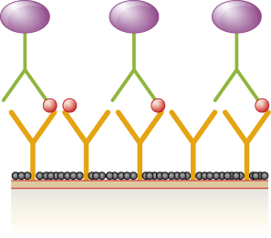

### Learning Objectives

* Explain the differences and similarities between EIA, FEIA, and ELISA
* Describe the difference and similarities between immunohistochemistry and immunocytochemistry
* Describe the different purposes of direct and indirect ELISA

Similar to the **western blot**{: data-type="term" .no-emphasis}, **enzyme immunoassays (EIAs)**{: data-type="term"} use antibodies to detect the presence of antigens. However, EIAs differ from western blots in that the assays are conducted in microtiter plates or *in vivo* rather than on an absorbent membrane. There are many different types of EIAs, but they all involve an antibody molecule whose **constant region**{: data-type="term" .no-emphasis} binds an enzyme, leaving the variable region free to bind its specific antigen. The addition of a substrate for the enzyme allows the antigen to be visualized or quantified ([\[link\]](#OSC_Microbio_20_04_EIA)).

In EIAs, the substrate for the enzyme is most often a chromogen, a colorless molecule that is converted into a colored end product. The most widely used enzymes are alkaline phosphatase and horseradish peroxidase for which appropriate substrates are readily available. In some EIAs, the substrate is a **fluorogen**{: data-type="term"}, a nonfluorescent molecule that the enzyme converts into a fluorescent form. EIAs that utilize a fluorogen are called **fluorescent enzyme immunoassays (FEIAs)**{: data-type="term"}. Fluorescence can be detected by either a **fluorescence microscope**{: data-type="term" .no-emphasis} or a **spectrophotometer**{: data-type="term" .no-emphasis}.

 "){: #OSC_Microbio_20_04_EIA}

The MMR Titer

The MMR vaccine is a combination vaccine that provides protection against measles, mumps, and rubella (German measles). Most people receive the MMR vaccine as children and thus have antibodies against these diseases. However, for various reasons, even vaccinated individuals may become susceptible to these diseases again later in life. For example, some children may receive only one round of the MMR vaccine instead of the recommended two. In addition, the titer of protective antibodies in an individual’s body may begin to decline with age or as the result of some medical conditions.

To determine whether the titer of antibody in an individual’s bloodstream is sufficient to provide protection, an MMR titer test can be performed. The test is a simple immunoassay that can be done quickly with a blood sample. The results of the test will indicate whether the individual still has immunity or needs another dose of the MMR vaccine.

Submitting to an MMR titer is often a pre-employment requirement for healthcare workers, especially those who will frequently be in contact with young children or immunocompromised patients. Were a healthcare worker to become infected with measles, mumps, or rubella, the individual could easily pass these diseases on to susceptible patients, leading to an outbreak. Depending on the results of the MMR titer, healthcare workers might need to be revaccinated prior to beginning work.

### Immunostaining

One powerful use of EIA is **immunostaining**{: data-type="term"}, in which antibody-enzyme conjugates enhance microscopy. **Immunohistochemistry (IHC)**{: data-type="term"} is used for examining whole tissues. As seen in [\[link\]](#OSC_Microbio_20_04_IHC), a section of tissue can be stained to visualize the various cell types. In this example, a mAb against CD8 was used to stain **CD8**{: data-type="term" .no-emphasis} cells in a section of tonsil tissue. It is now possible to count the number of CD8 cells, determine their relative numbers versus the other cell types present, and determine the location of these cells within this tissue. Such data would be useful for studying diseases such as AIDS, in which the normal function of CD8 cells is crucial for slowing disease progression.

**Immunocytochemistry (ICC)**{: data-type="term"} is another valuable form of immunostaining. While similar to IHC, in ICC, extracellular matrix material is stripped away, and the cell membrane is etched with alcohol to make it permeable to antibodies. This allows antibodies to pass through the cell membrane and bind to specific targets inside the cell. Organelles, cytoskeletal components, and other intracellular structures can be visualized in this way. While some ICC techniques use EIA, the enzyme can be replaced with a fluorescent molecule, making it a fluorescent immunoassay.

 "){: #OSC_Microbio_20_04_IHC}

* What is the difference between immunohistochemistry and immunocytochemistry?
* What must be true of the product of the enzymatic reaction used in immunohistochemistry?
{: data-bullet-style="bullet"}

### Enzyme-linked Immunosorbent Assays (ELISAs)

The **enzyme-linked immunosorbent assays (ELISAs)**{: data-type="term"} are widely used EIAs. In the **direct ELISA**{: data-type="term"}, antigens are immobilized in the well of a microtiter plate. An antibody that is specific for a particular antigen and is conjugated to an enzyme is added to each well. If the antigen is present, then the antibody will bind. After washing to remove any unbound antibodies, a colorless substrate (**chromogen**{: data-type="term" .no-emphasis}) is added. The presence of the enzyme converts the substrate into a colored end product ([\[link\]](#OSC_Microbio_20_04_EIA)). While this technique is faster because it only requires the use of one antibody, it has the disadvantage that the signal from a direct ELISA is lower (lower sensitivity).

In a **sandwich ELISA**{: data-type="term"}, the goal is to use antibodies to precisely quantify specific antigen present in a solution, such as antigen from a pathogen, a serum protein, or a hormone from the blood or urine to list just a few examples. The first step of a sandwich ELISA is to add the **primary antibody**{: data-type="term"} to all the wells of a microtiter plate ([\[link\]](#OSC_Microbio_20_04_ELISA)). The antibody sticks to the plastic by hydrophobic interactions. After an appropriate incubation time, any unbound antibody is washed away. Comparable washes are used between each of the subsequent steps to ensure that only specifically bound molecules remain attached to the plate. A blocking protein is then added (e.g., albumin or the milk protein casein) to bind the remaining nonspecific protein-binding sites in the well. Some of the wells will receive known amounts of antigen to allow the construction of a standard curve, and unknown antigen solutions are added to the other wells. The primary antibody captures the antigen and, following a wash, the **secondary antibody**{: data-type="term"} is added, which is a **polyclonal antibody**{: data-type="term" .no-emphasis} that is conjugated to an enzyme. After a final wash, a colorless substrate (chromogen) is added, and the enzyme converts it into a colored end product. The color intensity of the sample caused by the end product is measured with a **spectrophotometer**{: data-type="term" .no-emphasis}. The amount of color produced (measured as absorbance) is directly proportional to the amount of enzyme, which in turn is directly proportional to the captured antigen. ELISAs are extremely sensitive, allowing antigen to be quantified in the nanogram (10–9 g) per mL range.

In an **indirect ELISA**{: data-type="term"}, we quantify antigen-specific antibody rather than antigen. We can use indirect ELISA to detect antibodies against many types of pathogens, including ***Borrelia burgdorferi***{: data-type="term" .no-emphasis} (**Lyme disease**{: data-type="term" .no-emphasis}) and **HIV**{: data-type="term" .no-emphasis}. There are three important differences between indirect and direct ELISAs as shown in [\[link\]](#OSC_Microbio_20_04_Indirect). Rather than using antibody to capture antigen, the indirect ELISA starts with attaching known antigen (e.g., peptides from HIV) to the bottom of the microtiter plate wells. After blocking the unbound sites on the plate, patient serum is added; if antibodies are present (**primary antibody**{: data-type="term" .no-emphasis}), they will bind the antigen. After washing away any unbound proteins, the secondary antibody with its conjugated enzyme is directed against the primary antibody (e.g., antihuman immunoglobulin). The **secondary antibody**{: data-type="term" .no-emphasis} allows us to quantify how much antigen-specific antibody is present in the patient’s serum by the intensity of the color produced from the conjugated enzyme-chromogen reaction.

As with several other tests for antibodies discussed in this chapter, there is always concern about **cross-reactivity**{: data-type="term" .no-emphasis} with antibodies directed against some other antigen, which can lead to false-positive results. Thus, we cannot definitively diagnose an HIV infection (or any other type of infection) based on a single indirect ELISA assay. We must confirm any suspected positive test, which is most often done using either an <strong data-type="term" class="no-emphasis">immunoblot </strong>that actually identifies the presence of specific peptides from the pathogen or a test to identify the nucleic acids associated with the pathogen, such as **reverse transcriptase PCR (RT-PCR)**{: data-type="term" .no-emphasis} or a nucleic acid antigen test.

 ![a) Diagram of a sandwich ELISA showing what happens in both a positive and a negative sample. First, the primary antibody binds to the well. This is shown as Ys bound to a surface. Next, blocking agent is added. This is shown as a black covering on the surface between the antibodies. Next, the sample is added; if the correct antigen is present it binds to the antibody. In the positive well a circle binds to the antibodies; in the negative well nothing binds to the antibodies. Next, any unbound sample is washed away. Next, antibody-enzyme conjugate is added. This is shown in the positive well as another Y shape that binds to the circles. This new Y shape has a purple circle at the end. These antibodies are also in the negative sample but they are not attached to anything. Next, unbound antibody-enzyme conjugate is washed away; these remain in the positive sample (because they are attached to the antigen) but are washed away in the negative sample. Finally, a substrate is added to both the positive and negative samples. The enzyme in the positive sample turns this substrate blue. b) A plastic plate with many wells. Some are clear, some are blue.](../resources/OSC_Microbio_20_04_ELISA.jpg "(a) In a sandwich ELISA, a primary antibody is used to first capture an antigen with the primary antibody. A secondary antibody conjugated to an enzyme that also recognizes epitopes on the antigen is added. After the addition of the chromogen, a spectrophotometer measures the absorbance of end product, which is directly proportional to the amount of captured antigen. (b) An ELISA plate shows dilutions of antibodies (left) and antigens (bottom). Higher concentrations result in a darker final color. (credit b: modification of work by U.S. Fish and Wildlife Service Pacific Region)"){: #OSC_Microbio_20_04_ELISA}

![Diagram of indirect ELISA showing what happens in both a positive and a negative sample. First the antigens are bound to the well. This is shown as diamonds on a surface of both the positive and negative wells. Next, blocking agent is added. This is shown as a black covering on the surface between the antigens. Next, the sample is added. If the correct antibody is present it binds to the antigen. This is shown as Ys in both the positive and negative wells. Otherwise, nothing binds to the antigen. Next, any unbound sample is washed away. In the positive well, there is an antibody bound to the antigen, in the negative well, there is nothing bound to the antigen. Next, anti-human enzyme-linked antibody is added. This is shown as a Ys with a purple circle in both wells. Next, unbound antigen in washed away. In the positive sample this Y remains bound to the old antibody. In the negative well it is no longer present. Finally, substrate is added to both wells. In the positive well, the enzyme changes the substrate to a blue color.](../resources/OSC_Microbio_20_04_Indirect.jpg "The indirect ELISA is used to quantify antigen-specific antibodies in patient serum for disease diagnosis. Antigen from the suspected disease agent is attached to microtiter plates. The primary antibody comes from the patient&#x2019;s serum, which is subsequently bound by the enzyme-conjugated secondary antibody. Measuring the production of end product allows us to detect or quantify the amount of antigen-specific antibody present in the patient&#x2019;s serum."){: #OSC_Microbio_20_04_Indirect}

* What is the purpose of the secondary antibody in a direct ELISA?
* What do the direct and indirect ELISAs quantify?
{: data-bullet-style="bullet"}

Part 2

Although contacting and testing the 1300 patients for HIV would be time consuming and expensive, administrators hoped to minimize the hospital’s liability by proactively seeking out and treating potential victims of the rogue employee’s crime. Early detection of HIV is important, and prompt treatment can slow the progression of the disease.

There are a variety of screening tests for HIV, but the most widely used is the indirect ELISA. As with other indirect ELISAs, the test works by attaching antigen (in this case, HIV peptides) to a well in a 96-well plate. If the patient is HIV positive, anti-HIV antibodies will bind to the antigen and be identified by the second antibody-enzyme conjugate.

* How accurate is an indirect ELISA test for HIV, and what factors could impact the test’s accuracy?
* Should the hospital use any other tests to confirm the results of the indirect ELISA?
{: data-bullet-style="bullet"}

*Jump to the [previous](/m58900#fs-id1167662756934) Clinical Focus box. Jump to the [next](#fs-id1167660291521) Clinical Focus box.*

### Immunofiltration and Immunochromatographic Assays

For some situations, it may be necessary to detect or quantify antigens or antibodies that are present at very low concentration in solution. Immunofiltration techniques have been developed to make this possible. In **immunofiltration**{: data-type="term"}, a large volume of fluid is passed through a porous membrane into an absorbent pad. An antigen attached to the porous membrane will capture antibody as it passes; alternatively, we can also attach an antibody to the membrane to capture antigen.

The method of immunofiltration has been adapted in the development of **immunochromatographic assays**{: data-type="term"}, commonly known as **lateral flow tests**{: data-type="term"} or strip tests. These tests are quick and easy to perform, making them popular for point-of-care use (i.e., in the doctor’s office) or in-home use. One example is the **TORCH test**{: data-type="term" .no-emphasis} that allows doctors to screen pregnant women or newborns for infection by an array of viruses and other pathogens (*Toxoplasma*, other viruses, rubella, cytomegalovirus, herpes simplex). In-home **pregnancy tests**{: data-type="term" .no-emphasis} are another widely used example of a lateral flow test ([\[link\]](#OSC_Microbio_20_04_Torch)). Immunofiltration tests are also popular in developing countries, because they are inexpensive and do not require constant refrigeration of the dried reagents. However, the technology is also built into some sophisticated laboratory equipment.

In lateral flow tests ([\[link\]](#OSC_Microbio_20_04_Lateral)), fluids such as urine are applied to an absorbent pad on the test strip. The fluid flows by capillary action and moves through a stripe of beads with antibodies attached to their surfaces. The fluid in the sample actually hydrates the reagents, which are present in a dried state in the stripe. Antibody-coated beads made of latex or tiny gold particles will bind antigens in the test fluid. The antibody-antigen complexes then flow over a second stripe that has immobilized antibody against the antigen; this stripe will retain the beads that have bound antigen. A third control stripe binds any beads. A red color (from gold particles) or blue (from latex beads) developing at the test line indicates a positive test. If the color only develops at the control line, the test is negative.

Like ELISA techniques, lateral flow tests take advantage of antibody sandwiches, providing sensitivity and specificity. While not as quantitative as ELISA, these tests have the advantage of being fast, inexpensive, and not dependent on special equipment. Thus, they can be performed anywhere by anyone. There are some concerns about putting such powerful diagnostic tests into the hands of people who may not understand the tests’ limitations, such as the possibility of false-positive results. While home pregnancy tests have become widely accepted, at-home antibody-detection tests for diseases like HIV have raised some concerns in the medical community. Some have questioned whether self-administration of such tests should be allowed in the absence of medical personnel who can explain the test results and order appropriate confirmatory tests. However, with growing numbers of lateral flow tests becoming available, and the rapid development of lab-on-a-chip technology ([\[link\]](/m58899#OSC_Microbio_20_00_Chip)), home medical tests are likely to become even more commonplace in the future.

 "){: #OSC_Microbio_20_04_Torch}

![A diagram showing lateral flow test of a urine sample. The top panel shows a positive test and the bottom shows a negative test. In both a urine sample is added; in the positive sample there are antigens present. The label reads hCG urine sample is applied to absorbent sample pad. In both cases the urine sample flows across the test area. The first region is a mix area that contains hCG-second antibody-AuNPs (hCG-GC). These then flow across the hCG strip in both samples. Next, we reach the test line. Here there are antibodies that bind the antigens in the positive sample but bind nothing in the negative sample. In the positive sample the hCG-GC also bind to the antigen, forming an antibody sandwich around the antigen. The presence of the hCG-GC causes a color change here in the positive sample but not in the negative sample.  Finally, the control line contains antibodies that bind the hCG-GC directly; so these bind in both the positive and negative samples. The control line turns a color in both.](../resources/OSC_Microbio_20_04_Lateral.jpg "Immunochromatographic assays, or lateral flow tests, allow the testing of antigen in a dilute solution. As the fluid flows through the test strip, it rehydrates the reagents. Antibodies conjugated to small particles bind the antigen in the first stripe and then flow onto the second stripe where they are bound by a second, fixed antibody. This produces a line of color, depending on the color of the beads. The third, control stripe binds beads as well to indicate that the test is working properly. (credit: modification of work by Yeh CH, Zhao ZQ, Shen PL, Lin YC)"){: #OSC_Microbio_20_04_Lateral}

* What physical process does the lateral flow method require to function?
* Explain the purpose of the third strip in a lateral flow assay.
{: data-bullet-style="bullet"}

[\[link\]](#fs-id1167662871299) compares some of the key mechanisms and examples of some of the EIAs discussed in this section as well as immunoblots, which were discussed in [Detecting Antigen-Antibody Complexes](/m58901){: .target-chapter}.

<table summary="Table titled: Immunoblots &amp; Enzyme Immunoassays. Columns: Type of Assay; Mechanism; Specific Procedures; Examples. Type of Assay: Immunoblots; Uses enzyme-antibody conjugates to identify specific proteins that have been transferred to an absorbent membrane; Western blot: Detects the presence of a particular protein; Detecting the presence of HIV peptides (or peptides from other infectious agents) in patient sera. Type of assay: Immunostaining; Uses enzyme-antibody conjugates to stain specific molecules on or in cells; Immunohistochemistry: Used to stain specific cells in a tissue Stain for presence of CD8 cells in host tissue; Enzyme-linked immunosorbent assay (ELISA); Uses enzyme-antibody conjugates to quantify target molecules. Type of Assay: Direct ELISA: Uses a single antibody to detect the presence of an antigen; Detection of HIV antigen p24 up to one month after being infected; Indirect ELISA: Measures the amount of antibody produced against an antigen Detection of HIV antibodies in serum. Type of Assay: Immunochromatographic (lateral flow) assays; Techniques use the capture of flowing, color-labeled antigen-antibody complexes by fixed antibody for disease diagnosis; Sandwich ELISA: Measures the amount of antigen bound by the antibody; Detection of antibodies for various pathogens in patient sera (e.g., rapid strep, malaria dipstick); Pregnancy test detecting human chorionic gonadotrophin in urine." class="span-all"><thead>
<tr>
<th colspan="4" data-align="center">Immunoblots &amp; Enzyme Immunoassays</th>
</tr>
<tr valign="top">
<th data-valign="top" data-align="left">Type of Assay</th>
<th data-valign="top" data-align="left">Mechanism</th>
<th data-valign="top" data-align="left">Specific Procedures</th>
<th data-valign="top" data-align="left">Examples</th>
</tr>
</thead><tbody>
<tr valign="top">
<td data-valign="top" data-align="left">Immunoblots</td>
<td data-valign="top" data-align="left">Uses enzyme-antibody conjugates to identify specific proteins that have been transferred to an absorbent membrane</td>
<td data-valign="top" data-align="left">Western blot: Detects the presence of a particular protein</td>
<td data-valign="top" data-align="left">Detecting the presence of HIV peptides (or peptides from other infectious agents) in patient sera</td>
</tr>
<tr valign="top">
<td data-valign="top" data-align="left">Immunostaining</td>
<td data-valign="top" data-align="left">Uses enzyme-antibody conjugates to stain specific molecules on or in cells</td>
<td data-valign="top" data-align="left">Immunohistochemistry: Used to stain specific cells in a tissue</td>
<td data-valign="top" data-align="left">Stain for presence of CD8 cells in host tissue</td>
</tr>
<tr valign="top">
<td rowspan="2" data-valign="top" data-align="left">Enzyme-linked immunosorbent assay (ELISA)</td>
<td rowspan="2" data-valign="top" data-align="left">Uses enzyme-antibody conjugates to quantify target molecules</td>
<td data-valign="top" data-align="left">Direct ELISA: Uses a single antibody to detect the presence of an antigen</td>
<td data-valign="top" data-align="left">Detection of HIV antigen p24 up to one month after being infected</td>
</tr>
<tr valign="top">
<td data-valign="top" data-align="left">Indirect ELISA: Measures the amount of antibody produced against an antigen</td>
<td data-valign="top" data-align="left">Detection of HIV antibodies in serum</td>
</tr>
<tr valign="top">
<td rowspan="2" data-valign="top" data-align="left">Immunochromatographic (lateral flow) assays</td>
<td rowspan="2" data-valign="top" data-align="left">Techniques use the capture of flowing, color-labeled antigen-antibody complexes by fixed antibody for disease diagnosis</td>
<td rowspan="2" data-valign="top" data-align="left">Sandwich ELISA: Measures the amount of antigen bound by the antibody</td>
<td data-valign="top" data-align="left">Detection of antibodies for various pathogens in patient sera (e.g., rapid strep, malaria dipstick)</td>
</tr>
<tr valign="top">
<td data-valign="top" data-align="left">Pregnancy test detecting human chorionic gonadotrophin in urine</td>
</tr>
</tbody></table>

Part 3

Although the indirect ELISA for HIV is a sensitive assay, there are several complicating considerations. First, if an infected person is tested too soon after becoming infected, the test can yield false-negative results. The seroconversion window is generally about three weeks, but in some cases, it can be more than two months.

In addition to false negatives, false positives can also occur, usually due to previous infections with other viruses that induce cross-reacting antibodies. The false-positive rate depends on the particular brand of test used, but 0.5% is not unusual.[1](#footnote1){: data-type="footnote-link"} Because of the possibility of a false positive, all positive tests are followed up with a confirmatory test. This confirmatory test is often an immunoblot (western blot) in which HIV peptides from the patient’s blood are identified using an HIV-specific mAb-enzyme conjugate. A positive western blot would confirm an HIV infection and a negative blot would confirm the absence of HIV despite the positive ELISA.

Unfortunately, western blots for HIV antigens often yield indeterminant results, in which case, they neither confirm nor invalidate the results of the indirect ELISA. In fact, the rate of indeterminants can be 10–49% (which is why, combined with their cost, western blots are not used for screening). Similar to the indirect ELISA, an indeterminant western blot can occur because of cross-reactivity or previous viral infections, vaccinations, or autoimmune diseases.

* Of the 1300 patients being tested, how many false-positive ELISA tests would be expected?
* Of the false positives, how many indeterminant western blots could be expected?
* How would the hospital address any cases in which a patient’s western blot was indeterminant?
{: data-bullet-style="bullet"}

*Jump to the [previous](#fs-id1167662465858) Clinical Focus box. Jump to the [next](/m58904#fs-id1167662496088) Clinical Focus box.*

### Key Concepts and Summary

* **Enzyme immunoassays (EIA)** are used to visualize and quantify antigens. They use an antibody conjugated to an enzyme to bind the antigen, and the enzyme converts a substrate into an observable end product. The substrate may be either a chromogen or a fluorogen.
* **Immunostaining** is an EIA technique for visualizing cells in a tissue (**immunohistochemistry**) or examining intracellular structures (**immunocytochemistry**).
* **Direct ELISA** is used to quantify an antigen in solution. The primary antibody captures the antigen, and the secondary antibody delivers an enzyme. Production of end product from the chromogenic substrate is directly proportional to the amount of captured antigen.
* **Indirect ELISA** is used to detect antibodies in patient serum by attaching antigen to the well of a microtiter plate, allowing the patient (primary) antibody to bind the antigen and an enzyme-conjugated secondary antibody to detect the primary antibody.
* **Immunofiltration and immunochromatographic assays** are used in **lateral flow tests**, which can be used to diagnose pregnancy and various diseases by detecting color-labeled antigen-antibody complexes in urine or other fluid samples
{: data-bullet-style="bullet"}

### Multiple Choice

In an enzyme immunoassay, the enzyme

1.  is bound by the antibody’s antigen-binding site.
2.  is attached to the well of a microtiter plate.
3.  is conjugated to the suspect antigen.
4.  is bound to the constant region of the secondary antibody.
{: data-number-style="lower-alpha"}

D

When using an EIA to study microtubules or other structures inside a cell, we first chemically fix the cell and then treat the cells with alcohol. What is the purpose of this alcohol treatment?

1.  It makes holes in the cell membrane large enough for antibodies to pass.
2.  It makes the membrane sticky so antibodies will bind and be taken up by receptor-mediated endocytosis.
3.  It removes negative charges from the membrane, which would otherwise repulse the antibodies.
4.  It prevents nonspecific binding of the antibodies to the cell membrane.
{: data-number-style="lower-alpha"}

A

In a lateral-flow pregnancy test, you see a blue band form on the control line and no band form on the test line. This is probably a \_\_\_\_\_\_\_\_ test for pregnancy.

1.  positive
2.  false-positive
3.  false-negative
4.  negative
{: data-number-style="lower-alpha"}

D

When performing an FEIA, the fluorogen replaces the \_\_\_\_\_\_\_\_ that is used in an EIA.

1.  antigen
2.  chromogenic substrate
3.  enzyme
4.  secondary antibody
{: data-number-style="lower-alpha"}

B

### Fill in the Blank

To detect antibodies against bacteria in the bloodstream using an EIA, we would run a(n) \_\_\_\_\_\_\_\_, which we would start by attaching antigen from the bacteria to the wells of a microtiter plate.

indirect ELISA

### Short Answer

Why is it important in a sandwich ELISA that the antigen has multiple epitopes? And why might it be advantageous to use polyclonal antisera rather than mAb in this assay?

The pregnancy test strip detects the presence of human chorionic gonadotrophin in urine. This hormone is initially produced by the fetus and later by the placenta. Why is the test strip preferred for this test rather than using either a direct or indirect ELISA with their more quantifiable results?

### Critical Thinking

Label the primary and secondary antibodies, and discuss why the production of end product will be proportional to the amount of antigen.

### Footnotes
{: data-type="footnote-refs-title"}

* {: data-type="footnote-ref" #footnote1} [1](#footnote-ref1){: data-type="footnote-ref-link"} Thomas, Justin G., Victor Jaffe, Judith Shaffer, and Jose Abreu, “HIV Testing: US Recommendations 2014,” *Osteopathic Family Physician* 6, no. 6 (2014).
{: data-list-type="bulleted" data-bullet-style="none"}

