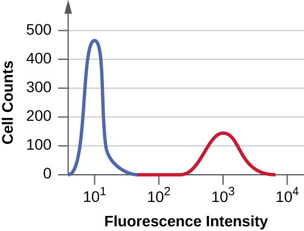

### Learning Objectives

* Describe the benefits of immunofluorescent antibody assays in comparison to nonfluorescent assays
* Compare direct and indirect fluorescent antibody assays
* Explain how a flow cytometer can be used to quantify specific subsets of cells present in a complex mixture of cell types
* Explain how a fluorescence-activated cell sorter can be used to separate unique types of cells

Rapid visualization of bacteria from a clinical sample such as a throat swab or sputum can be achieved through **fluorescent antibody (FA) techniques**{: data-type="term"} that attach a fluorescent marker (**fluorogen**{: data-type="term" .no-emphasis}) to the constant region of an antibody, resulting in a reporter molecule that is quick to use, easy to see or measure, and able to bind to target markers with high specificity. We can also label cells, allowing us to precisely quantify particular subsets of cells or even purify these subsets for further research.

As with the enzyme assays, FA methods may be direct, in which a labeled mAb binds an antigen, or indirect, in which secondary polyclonal antibodies bind patient antibodies that react to a prepared antigen. Applications of these two methods were demonstrated in [\[link\]](/m58787#OSC_Microbio_02_03_DirectFl). FA methods are also used in automated cell counting and sorting systems to enumerate or segregate labeled subpopulations of cells in a sample.

### Direct Fluorescent Antibody Techniques

**Direct fluorescent antibody (DFA) tests**{: data-type="term"} use a fluorescently labeled mAb to bind and illuminate a target antigen. DFA tests are particularly useful for the rapid diagnosis of bacterial diseases. For example, fluorescence-labeled antibodies against ***Streptococcus pyogenes***{: data-type="term" .no-emphasis} (**group A strep**{: data-type="term" .no-emphasis}) can be used to obtain a diagnosis of **strep throat**{: data-type="term" .no-emphasis} from a throat swab. The diagnosis is ready in a matter of minutes, and the patient can be started on antibiotics before even leaving the clinic. DFA techniques may also be used to diagnose pneumonia caused by ***Mycoplasma pneumoniae***{: data-type="term" .no-emphasis} or ***Legionella pneumophila***{: data-type="term" .no-emphasis} from sputum samples ([\[link\]](#OSC_Microbio_20_05_Legion)). The fluorescent antibodies bind to the bacteria on a microscope slide, allowing ready detection of the bacteria using a **fluorescence microscope**{: data-type="term" .no-emphasis}. Thus, the DFA technique is valuable for visualizing certain bacteria that are difficult to isolate or culture from patient samples.

 "){: #OSC_Microbio_20_05_Legion}

  
Watch the [animation][1] on this page to review the procedures of the direct fluorescent antibody test.

* In a direct fluorescent antibody test, what does the fluorescent antibody bind to?
{: data-bullet-style="bullet"}

### Indirect Fluorescent Antibody Techniques

**Indirect fluorescent antibody (IFA) tests**{: data-type="term"} ([\[link\]](#OSC_Microbio_20_05_IFA)) are used to look for antibodies in patient serum. For example, an IFA test for the diagnosis of **syphilis**{: data-type="term" .no-emphasis} uses *T. pallidum* cells isolated from a lab animal (the bacteria cannot be grown on lab media) and a smear prepared on a glass slide. Patient serum is spread over the smear and anti-treponemal antibodies, if present, are allowed to bind. The serum is washed off and a secondary antibody added. The **secondary antibody**{: data-type="term" .no-emphasis} is an antihuman immunoglobulin conjugated to a **fluorogen**{: data-type="term" .no-emphasis}. On examination, the *T. pallidum* bacteria will only be visible if they have been bound by the antibodies from the patient’s serum.

The IFA test for syphilis provides an important complement to the **VDRL test**{: data-type="term" .no-emphasis} discussed in [Detecting Antigen-Antibody Complexes](/m58901){: .target-chapter}. The VDRL is more likely to generate false-positive reactions than the IFA test; however, the VDRL is a better test for determining whether an infection is currently active.

IFA tests are also useful for the diagnosis of autoimmune diseases. For example, **systemic lupus erythematosus**{: data-type="term" .no-emphasis} (SLE) (see [Autoimmune Disorders](/m58893){: .target-chapter}) is characterized by elevated expression levels of **antinuclear antibodies**{: data-type="term" .no-emphasis} (ANA). These autoantibodies can be expressed against a variety of DNA-binding proteins and even against DNA itself. Because autoimmunity is often difficult to diagnose, especially early in disease progression, testing for ANA can be a valuable clue in making a diagnosis and starting appropriate treatment.

The IFA for ANA begins by fixing cells grown in culture to a glass slide and making them permeable to antibody. The slides are then incubated with serial dilutions of serum from the patient. After incubation, the slide is washed to remove unbound proteins, and the fluorescent antibody (antihuman IgG conjugated to a fluorogen) added. After an incubation and wash, the cells can be examined for fluorescence evident around the nucleus ([\[link\]](#OSC_Microbio_20_05_ANA)). The **titer**{: data-type="term" .no-emphasis} of ANA in the serum is determined by the highest dilution showing fluorescence. Because many healthy people express ANA, the American College of Rheumatology recommends that the titer must be at least 1:40 in the presence of symptoms involving two or more organ systems to be considered indicative of SLE.[1](#footnote1){: data-type="footnote-link"}

  The IFA test is used to detect antigen-specific antibodies by allowing them to bind to antigen fixed to a surface and then illuminating these complexes with a secondary antibody-fluorogen conjugate. (b) In this example of a micrograph of an indirect fluorescent antibody test, a patient&#x2019;s antibodies to the measles virus bind to viral antigens present on inactivated measles-infected cells affixed to a slide. Secondary antibodies bind the patient&#x2019;s antibodies and carry a fluorescent molecule. (credit b: modification of work by American Society for Microbiology)"){: #OSC_Microbio_20_05_IFA}

, cells are exposed to serum from a patient suspected of making ANA and then to a fluorescent mAb specific for human immunoglobulin. As a control, serum from a healthy patient is also used. Visible fluorescence around the nucleus demonstrates the presence of ANA in the patient&#x2019;s serum. In the healthy control where lower levels of ANA are produced, very faint green is detected. (credit left, right: modification of work by Al-Hussaini AA, Alzahrani MD, Alenizi AS, Suliman NM, Khan MA, Alharbi SA, Chentoufi AA)"){: #OSC_Microbio_20_05_ANA}

* In an indirect fluorescent antibody test, what does the fluorescent antibody bind to?
* What is the ANA test looking for?
{: data-bullet-style="bullet"}

### Flow Cytometry

Fluorescently labeled antibodies can be used to quantify cells of a specific type in a complex mixture using **flow cytometry**{: data-type="term"} ([\[link\]](#OSC_Microbio_20_05_Flow)), an **automated, cell-counting**{: data-type="term" .no-emphasis} system that detects fluorescing cells as they pass through a narrow tube one cell at a time. For example, in **HIV**{: data-type="term" .no-emphasis} infections, it is important to know the level of CD4 T cells in the patient’s blood; if the numbers fall below 500 per μL of blood, the patient becomes more likely to acquire opportunistic infections; below 200 per μL, the patient can no longer mount a useful adaptive immune response at all. The analysis begins by incubating a mixed-cell population (e.g., white blood cells from a donor) with a fluorescently labeled mAb specific for a subpopulation of cells (e.g., anti-CD4). Some experiments look at two cell markers simultaneously by adding a different fluorogen to the appropriate mAb. The cells are then introduced to the flow cytometer through a narrow capillary that forces the cells to pass in single file. A laser is used to activate the fluorogen. The fluorescent light radiates out in all directions, so the fluorescence detector can be positioned at an angle from the incident laser light.

[\[link\]](#OSC_Microbio_20_05_Flow) shows the obscuration bar in front of the forward-scatter detector that prevents laser light from hitting the detector. As a cell passes through the laser bar, the forward-scatter detector detects light scattered around the obscuration bar. The scattered light is transformed into a voltage pulse, and the cytometer counts a cell. The fluorescence from a labeled cell is detected by the side-scatter detectors. The light passes through various dichroic mirrors such that the light emitted from the fluorophore is received by the correct detector.

 "){: #OSC_Microbio_20_05_Flow}

Data are collected from both the forward- and side-scatter detectors. One way these data can be presented is in the form of a histogram. The forward scatter is placed on the *y*-axis (to represent the number of cells), and the side scatter is placed on the *x*-axis (to represent the fluoresence of each cell). The scaling for the *x*-axis is logarithmic, so fluorescence intensity increases by a factor of 10 with each unit increase along the axis. [\[link\]](#OSC_Microbio_20_05_Histogram) depicts an example in which a culture of cells is combined with an antibody attached to a fluorophore to detect CD8 cells and then analyzed by flow cytometry. The histogram has two peaks. The peak on the left has lower fluorescence readings, representing the subset of the cell population (approximately 30 cells) that does not fluoresce; hence, they are not bound by antibody and therefore do not express CD8. The peak on the right has higher fluorescence readings, representing the subset of the cell population (approximately 100 cells) that show fluorescence; hence, they are bound by the antibody and therefore do express CD8.

 , and the y-axis represents the number of cells at a particular level of fluorescence."){: #OSC_Microbio_20_05_Histogram}

* What is the purpose of the laser in a flow cytometer?
* In the output from a flow cytometer, the area under the histogram is equivalent to what?
{: data-bullet-style="bullet"}

Resolution

After notifying all 1300 patients, the hospital begins scheduling HIV screening. Appointments were scheduled a minimum of 3 weeks after the patient’s last hospital visit to minimize the risk of false negatives. Because some false positives were anticipated, the public health physician set up a counseling protocol for any patient whose indirect ELISA came back positive.

Of the 1300 patients, eight tested positive using the ELISA. Five of these tests were invalidated by negative western blot tests, but one western blot came back positive, confirming that the patient had indeed contracted HIV. The two remaining western blots came back indeterminate. These individuals had to submit to a third test, a PCR, to confirm the presence or absence of HIV sequences. Luckily, both patients tested negative.

As for the lone patient confirmed to have HIV, the tests cannot prove or disprove any connection to the syringes compromised by the former hospital employee. Even so, the hospital’s insurance will fully cover the patient’s treatment, which began immediately.

Although we now have drugs that are typically effective at controlling the progression of HIV and AIDS, there is still no cure. If left untreated, or if the drug regimen fails, the patient will experience a gradual decline in the number of CD4 helper T cells, resulting in severe impairment of all adaptive immune functions. Even moderate declines of helper T cell numbers can result in immunodeficiency, leaving the patient susceptible to opportunistic infections. To monitor the status of the patient’s helper T cells, the hospital will use flow cytometry. This sensitive test allows physicians to precisely determine the number of helper T cells so they can adjust treatment if the number falls below 500 cells/µL.

*Jump to the [previous](/m58903#fs-id1167660291521) Clinical Focus box.*

### Cell Sorting Using Immunofluorescence

The flow cytometer and immunofluorescence can also be modified to sort cells from a single sample into purified subpopulations of cells for research purposes. This modification of the flow cytometer is called a **fluorescence-activated cell sorter (FACS)**{: data-type="term"}. In a FACS, fluorescence by a cell induces the device to put a charge on a droplet of the transporting fluid containing that cell. The charge is specific to the wavelength of the fluorescent light, which allows for differential sorting by those different charges. The sorting is accomplished by an electrostatic deflector that moves the charged droplet containing the cell into one collecting vessel or another. The process results in highly purified subpopulations of cells.

One limitation of a FACS is that it only works on isolated cells. Thus, the method would work in sorting white blood cells, since they exist as isolated cells. But for cells in a tissue, flow cytometry can only be applied if we can excise the tissue and separate it into single cells (using proteases to cleave cell-cell adhesion molecules) without disrupting cell integrity. This method may be used on tumors, but more often, immunohistochemistry and immunocytochemistry are used to study cells in tissues.

  
Watch videos to learn more about how [flow cytometry][2] and a [FACS][3] work.

* In fluorescence activated cell sorting, what characteristic of the target cells allows them to be separated?
{: data-bullet-style="bullet"}

[\[link\]](#fs-id1167660185739) compares the mechanisms of the fluorescent antibody techniques discussed in this section.

<table summary="Table titled: Fluorescent Antibody Techniques. Columns: Type of Assay, Mechanism, Examples. Assau: Direct fluorescent antibody (DFA); Uses fluorogen-antibody conjugates to label bacteria from patient samplesl; Visualizing Legionella pneumophila from a throat swab; Assay: Indirect fluorescent antibody (IFA); Detects disease-specific antibodies in patent serum; Diagnosing syphilis; detecting antinuclear antibodies (ANA) for lupus and other autoimmune diseases. Assay: Flow cytometry; Labels cell membranes with fluorogen-antibody conjugate markers excited by a laser; machine counts the cell and records the relative fluorescence; Counting the number of fluorescently labeled CD4 or CD8 cells in a sample. Assay: Fluorescence activated cell sorter (FACS); Form of flow cytometry that both counts cells and physically separates them into pools of high and low fluorescence cells; Sorting cancer cells." class="span-all"><thead>
<tr>
<th colspan="3" data-align="center">Fluorescent Antibody Techniques</th>
</tr>
<tr valign="top">
<th data-valign="top" data-align="left">Type of Assay</th>
<th data-valign="top" data-align="left">Mechanism</th>
<th data-valign="top" data-align="left">Examples</th>
</tr>
</thead><tbody>
<tr valign="top">
<td data-valign="top" data-align="left">Direct fluorescent antibody (DFA)</td>
<td data-valign="top" data-align="left">Uses fluorogen-antibody conjugates to label bacteria from patient samples</td>
<td data-valign="top" data-align="left">Visualizing <em>Legionella pneumophila</em> from a throat swab</td>
</tr>
<tr valign="top">
<td data-valign="top" data-align="left">Indirect fluorescent antibody (IFA)</td>
<td data-valign="top" data-align="left">Detects disease-specific antibodies in patent serum</td>
<td data-valign="top" data-align="left">Diagnosing syphilis; detecting antinuclear antibodies (ANA) for lupus and other autoimmune diseases</td>
</tr>
<tr valign="top">
<td data-valign="top" data-align="left">Flow cytometry</td>
<td data-valign="top" data-align="left">Labels cell membranes with fluorogen-antibody conjugate markers excited by a laser; machine counts the cell and records the relative fluorescence</td>
<td data-valign="top" data-align="left">Counting the number of fluorescently labeled CD4 or CD8 cells in a sample</td>
</tr>
<tr valign="top">
<td data-valign="top" data-align="left">Fluorescence activated cell sorter (FACS)</td>
<td data-valign="top" data-align="left">Form of flow cytometry that both counts cells and physically separates them into pools of high and low fluorescence cells</td>
<td data-valign="top" data-align="left">Sorting cancer cells</td>
</tr>
</tbody></table>

### Key Concepts and Summary

* **Immunofluorescence** assays use antibody-fluorogen conjugates to illuminate antigens for easy, rapid detection.
* **Direct immunofluorescence** can be used to detect the presence of bacteria in clinical samples such as sputum.
* **Indirect immunofluorescence** detects the presence of antigen-specific antibodies in patient sera. The fluorescent antibody binds to the antigen-specific antibody rather than the antigen.
* The use of indirect immunofluorescence assays to detect **antinuclear antibodies** is an important tool in the diagnosis of several autoimmune diseases.
* **Flow cytometry** uses fluorescent mAbs against cell-membrane proteins to quantify specific subsets of cells in complex mixtures.
* **Fluorescence-activated cell sorters** are an extension of flow cytometry in which fluorescence intensity is used to physically separate cells into high and low fluorescence populations.
{: data-bullet-style="bullet"}

### Multiple Choice

Suppose you need to quantify the level of CD8 T cells in the blood of a patient recovering from influenza. You treat a sample of the patient’s white blood cells using a fluorescent mAb against CD8, pass the cells through a flow cytometer, and produce the histogram shown below. The area under the peak to the left (blue) is three times greater than the area of the peak on the right (red). What can you determine from these data?

  
1.  There are no detectable CD8 cells.
2.  There are three times as many CD4 cells than CD8 cells.
3.  There are three times as many CD8 cells than CD4 cells.
4.  CD8 cells make up about one-fourth of the total number of cells.
{: type="a"}

D

In the data described in the previous question, the average fluorescence intensity of cells in the second (red) peak is about \_\_\_\_\_\_\_\_ that in the first (blue) peak.

1.  three times
2.  100 times
3.  one-third
4.  1000 times
{: type="a"}

B

In a direct fluorescent antibody test, which of the following would we most likely be looking for using a fluorescently-labeled mAb?

1.  bacteria in a patient sample
2.  bacteria isolated from a patient and grown on agar plates
3.  antiserum from a patient smeared onto a glass slide
4.  antiserum from a patient that had bound to antigen-coated beads
{: type="a"}

A

### Fill in the Blank

In flow cytometry, cell subsets are labeled using a fluorescent antibody to a membrane protein. The fluorogen is activated by a(n) \_\_\_\_\_\_\_\_ as the cells pass by the detectors.

laser

Fluorescence in a flow cytometer is measured by a detector set at an angle to the light source. There is also an in-line detector that can detect cell clumps or \_\_\_\_\_\_\_\_.

fragments

### Critical Thinking

A patient suspected of having syphilis is tested using both the VDRL test and IFA. The IFA test comes back positive, but the VDRL test is negative. What is the most likely reason for these results?

A clinician suspects that a patient with pneumonia may be infected by *Legionella pneumophila*. Briefly describe two reasons why a DFA test might be better for detecting this pathogen than standard bacteriology techniques.

### Footnotes
{: data-type="footnote-refs-title"}

* {: data-type="footnote-ref" #footnote1} [1](#footnote-ref1){: data-type="footnote-ref-link"} Gill, James M., ANNA M. Quisel, PETER V. Rocca, and DENE T. Walters. “Diagnosis of systemic lupus erythematosus.” *American family physician* 68, no. 11 (2003): 2179-2186.
{: data-list-type="bulleted" data-bullet-style="none"}

[1]: https://openstax.org/l/22dirfluorant
[2]: https://openstax.org/l/22flowcytometry
[3]: https://openstax.org/l/22FACSwork
