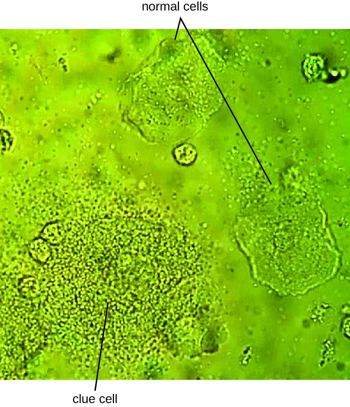

### Learning Objectives

* Identify the most common bacterial pathogens that can cause infections of the reproductive system
* Compare the major characteristics of specific bacterial diseases affecting the reproductive system

In addition to infections of the urinary tract, bacteria commonly infect the reproductive tract. As with the urinary tract, parts of the reproductive system closest to the external environment are the most likely sites of infection. Often, the same microbes are capable of causing urinary tract and reproductive tract infections.

### Bacterial Vaginitis and Vaginosis

Inflammation of the vagina is called **vaginitis**{: data-type="term" .no-emphasis}, often caused by a bacterial infection. It is also possible to have an imbalance in the normal **vaginal microbiota**{: data-type="term" .no-emphasis} without inflammation called **bacterial vaginosis (BV)**{: data-type="term"}. Vaginosis may be asymptomatic or may cause mild symptoms such as a thin, white-to-yellow, homogeneous vaginal discharge, burning, odor, and itching. The major causative agent is ***Gardnerella vaginalis***{: data-type="term" .no-emphasis}, a gram-variable to gram-negative pleomorphic bacterium. Other causative agents include anaerobic species such as members of the genera ***Bacteroides***{: data-type="term" .no-emphasis} and ***Fusobacterium***{: data-type="term" .no-emphasis}. Additionally, ureaplasma and mycoplasma may be involved. The disease is usually self-limiting, although antibiotic treatment is recommended if symptoms develop.

*G. vaginalis* appears to be more virulent than other vaginal bacterial species potentially associated with BV. Like ***Lactobacillus***{: data-type="term" .no-emphasis} spp., *G. vaginalis* is part of the normal vaginal microbiota, but when the population of *Lactobacillus* spp. decreases and the **vaginal pH**{: data-type="term" .no-emphasis} increases, *G. vaginalis* flourishes, causing vaginosis by attaching to vaginal epithelial cells and forming a thick protective **biofilm**{: data-type="term" .no-emphasis}. *G. vaginalis* also produces a cytotoxin called **vaginolysin**{: data-type="term" .no-emphasis} that lyses vaginal epithelial cells and red blood cells.

Since *G. vaginalis* can also be isolated from healthy women, the “gold standard” for the diagnosis of BV is direct examination of vaginal secretions and not the culture of *G. vaginalis*. Diagnosis of bacterial vaginosis from vaginal secretions can be accurately made in three ways. The first is to use a **DNA probe**{: data-type="term" .no-emphasis}. The second method is to assay for **sialidase activity**{: data-type="term" .no-emphasis} (sialidase is an enzyme produced by *G. vaginalis* and other bacteria associated with vaginosis, including *Bacteroides* spp., ***Prevotella***{: data-type="term" .no-emphasis} spp., and ***Mobiluncus***{: data-type="term" .no-emphasis} spp.). The third method is to assess gram-stained vaginal smears for microscopic morphology and relative numbers and types of bacteria, squamous epithelial cells, and leukocytes. By examining slides prepared from **vaginal swabs**{: data-type="term" .no-emphasis}, it is possible to distinguish lactobacilli (long, gram-positive rods) from other gram-negative species responsible for BV. A shift in predominance from gram-positive bacilli to gram-negative coccobacilli can indicate BV. Additionally, the slide may contain so-called **clue cells**{: data-type="term" .no-emphasis}, which are epithelial cells that appear to have a granular or stippled appearance due to bacterial cells attached to their surface ([\[link\]](#OSC_Microbio_23_03_VagSmear)). Presumptive diagnosis of bacterial vaginosis can involve an assessment of clinical symptoms and evaluation of vaginal fluids using **Amsel’s diagnostic criteria**{: data-type="term" .no-emphasis} which include 3 out of 4 of the following characteristics:

1.  white to yellow discharge;
2.  a fishy odor, most noticeable when 10% KOH is added;
3.  pH greater than 4.5;
4.  the presence of clue cells.
{: type="1"}

Treatment is often unnecessary because the infection often clears on its own. However, in some cases, antibiotics such as topical or oral **clindamycin**{: data-type="term" .no-emphasis} or **metronidazole**{: data-type="term" .no-emphasis} may be prescribed. Alternative treatments include oral **tinidazole**{: data-type="term" .no-emphasis} or clindamycin ovules (vaginal suppositories).

 {: #OSC_Microbio_23_03_VagSmear}

* Explain the difference between vaginosis and vaginitis.
* What organisms are responsible for vaginosis and what organisms typically hold it at bay?
{: data-bullet-style="bullet"}

Part 2

There is no catch-all test for STIs, so several tests, in addition to a physical exam, are necessary to diagnose an infection. Nadia tries to relax in the exam room while she waits for the doctor to return, but she is nervous about the results.

When the doctor finally returns, she has some unexpected news: Nadia is pregnant. Surprised and excited, Nadia wants to know if the pregnancy explains her unusual symptoms. The doctor explains that the irritation that Nadia is experiencing is vaginitis, which can be caused by several types of microorganisms. One possibility is bacterial vaginosis, which develops when there is an imbalance in the bacteria in the vagina, as often occurs during pregnancy. Vaginosis can increase the risk of preterm birth and low birth weight, and a few studies have also shown that it can cause second-trimester miscarriage; however, the condition can be treated. To check for it, the doctor has asked the lab to perform a Gram stain on Nadia’s sample.

* What result would you expect from the Gram stain if Nadia has bacterial vaginosis?
* What is the relationship between pregnancy, estrogen levels, and development of bacterial vaginosis?
{: data-bullet-style="bullet"}

*Jump to the [next](/m58921#fs-id1167662424154) Clinical Focus box. Go back to the [previous](/m58917#fs-id1167662872332) Clinical Focus box.*

### Gonorrhea

Also known as the clap, **gonorrhea**{: data-type="term"} is a common sexually transmitted disease of the reproductive system that is especially prevalent in individuals between the ages of 15 and 24. It is caused by ***Neisseria gonorrhoeae***{: data-type="term" .no-emphasis}, often called gonococcus or GC, which have fimbriae that allow the cells to attach to epithelial cells. It also has a type of lipopolysaccharide endotoxin called **lipooligosaccharide**{: data-type="term" .no-emphasis} as part of the outer membrane structure that enhances its pathogenicity. In addition to causing **urethritis**{: data-type="term" .no-emphasis}, *N. gonorrhoeae* can infect other body tissues such as the skin, meninges, pharynx, and conjunctiva.

Many infected individuals (both men and women) are asymptomatic carriers of gonorrhea. When symptoms do occur, they manifest differently in males and females. Males may develop pain and burning during urination and discharge from the penis that may be yellow, green, or white ([\[link\]](#OSC_Microbio_23_03_Gonorrheae)). Less commonly, the testicles may become swollen or tender. Over time, these symptoms can increase and spread. In some cases, chronic infection develops. The disease can also develop in the rectum, causing symptoms such as discharge, soreness, bleeding, itching, and pain (especially in association with bowel movements).

  Clinical photograph of gonococcal discharge from penis. The lesions on the skin could indicate co-infection with another STI. (b) Purulent discharge originating from the cervix and accumulating in the vagina of a patient with gonorrhea. (c) A micrograph of urethral discharge shows gram-negative diplococci (paired cells) both inside and outside the leukocytes (large cells with lobed nuclei). These results could be used to diagnose gonorrhea in a male patient, but female vaginal samples may contain other Neisseria spp. even if the patient is not infected with N. gonorrhoeae. (credit a, b: modification of work by Centers for Disease Control and Prevention; credit c: modification of work by American Society for Microbiology)"){: #OSC_Microbio_23_03_Gonorrheae}

Women may develop pelvic pain, discharge from the vagina, intermenstrual bleeding (i.e., bleeding not associated with normal menstruation), and pain or irritation associated with urination. As with men, the infection can become chronic. In women, however, chronic infection can cause increases in menstrual flow. Rectal infection can also occur, with the symptoms previously described for men. Infections that spread to the endometrium and fallopian tubes can cause **pelvic inflammatory disease (PID)**{: data-type="term" .no-emphasis}, characterized by pain in the lower abdominal region, **dysuria**{: data-type="term" .no-emphasis}, vaginal discharge, and fever. PID can also lead to infertility through scarring and blockage of the fallopian tubes (**salpingitis**{: data-type="term" .no-emphasis}); it may also increase the risk of a life-threatening **ectopic pregnancy**{: data-type="term" .no-emphasis}, which occurs when a fertilized egg begins developing somewhere other than the uterus (e.g., in the fallopian tube or ovary).

When a gonorrhea infection disseminates throughout the body, serious complications can develop. The infection may spread through the blood (**bacteremia**{: data-type="term" .no-emphasis}) and affect organs throughout the body, including the heart (**gonorrheal endocarditis**{: data-type="term" .no-emphasis}), joints (**gonorrheal arthritis**{: data-type="term" .no-emphasis}), and meninges encasing the brain (**meningitis**{: data-type="term" .no-emphasis}).

Urethritis caused by *N. gonorrhoeae* can be difficult to treat due to **antibiotic resistance**{: data-type="term" .no-emphasis} (see [Micro Connections](#fs-id1167662469916)). Some strains have developed resistance to the **fluoroquinolones**{: data-type="term" .no-emphasis}, so **cephalosporins**{: data-type="term" .no-emphasis} are often a first choice for treatment. Because co-infection with *C. trachomatis* is common, the CDC recommends treating with a combination regimen of **ceftriaxone**{: data-type="term" .no-emphasis} and **azithromycin**{: data-type="term" .no-emphasis}. Treatment of sexual partners is also recommended to avoid reinfection and spread of infection to others.[1](#footnote1){: data-type="footnote-link"}

* What are some of the serious consequences of a gonorrhea infection?
* What organism commonly coinfects with *N. gonorrhoeae*?
{: data-bullet-style="bullet"}

Antibiotic Resistance in *Neisseria*

Antibiotic resistance in many pathogens is steadily increasing, causing serious concern throughout the public health community. Increased resistance has been especially notable in some species, such as *Neisseria gonorrhoeae*. The CDC monitors the spread of antibiotic resistance in *N. gonorrhoeae*, which it classifies as an urgent threat, and makes recommendations for treatment. So far, *N. gonorrhoeae* has shown resistance to cefixime (a cephalosporin), ceftriaxone (another cephalosporin), azithromycin, and tetracycline. Resistance to tetracycline is the most common, and was seen in 188,600 cases of gonorrhea in 2011 (out of a total 820,000 cases). In 2011, some 246,000 cases of gonorrhea involved strains of *N. gonorrhoeae* that were resistant to at least one antibiotic.[2](#footnote2){: data-type="footnote-link"} These resistance genes are spread by plasmids, and a single bacterium may be resistant to multiple antibiotics. The CDC currently recommends treatment with two medications, ceftriaxone and azithromycin, to attempt to slow the spread of resistance. If resistance to cephalosporins increases, it will be extremely difficult to control the spread of *N. gonorrhoeae*.

### Chlamydia

***Chlamydia trachomatis***{: data-type="term" .no-emphasis} is the causative agent of the STI **chlamydia**{: data-type="term"} ([\[link\]](#OSC_Microbio_23_03_Ctrachomat)). While many *Chlamydia* infections are asymptomatic, chlamydia is a major cause of nongonococcal urethritis (NGU) and may also cause **epididymitis**{: data-type="term" .no-emphasis} and **orchitis**{: data-type="term" .no-emphasis} in men. In women, chlamydia infections can cause urethritis, **salpingitis**{: data-type="term" .no-emphasis}, and PID. In addition, chlamydial infections may be associated with an increased risk of **cervical cancer**{: data-type="term" .no-emphasis}.

Because chlamydia is widespread, often asymptomatic, and has the potential to cause substantial complications, routine screening is recommended for sexually active women who are under age 25, at high risk (i.e., not in a monogamous relationship), or beginning prenatal care.

Certain serovars of *C. trachomatis* can cause an infection of the lymphatic system in the groin known as **lymphogranuloma venereum**{: data-type="term"}. This condition is commonly found in tropical regions and can also co-occur in conjunction with human immunodeficiency virus (HIV) infection. After the microbes invade the lymphatic system, buboes (large lymph nodes, see [\[link\]](#OSC_Microbio_23_03_Ctrachomat)) form and can burst, releasing pus through the skin. The male genitals can become greatly enlarged and in women the rectum may become narrow.

Urogenital infections caused by *C. trachomatis* can be treated using **azithromycin**{: data-type="term" .no-emphasis} or **doxycycline**{: data-type="term" .no-emphasis} (the recommended regimen from the CDC). Erythromycin, **levofloxacin**{: data-type="term" .no-emphasis}, and **ofloxacin**{: data-type="term" .no-emphasis} are alternatives.

  Chlamydia trachomatis inclusion bodies within McCoy cell monolayers. Inclusion bodies are distinguished by their brown color. (b) Lymphogranuloma venereum infection can cause swollen lymph nodes in the groin called buboes. (credit a: modification of work by Centers for Disease Control and Prevention; credit b: modification of work by Herbert L. Fred and Hendrik A. van Dijk)"){: #OSC_Microbio_23_03_Ctrachomat}

* Compare the signs and symptoms of chlamydia infection in men and women.
{: data-bullet-style="bullet"}

### Syphilis

**Syphilis**{: data-type="term"} is spread through direct physical (generally sexual) contact, and is caused by the gram-negative spirochete ***Treponema pallidum***{: data-type="term" .no-emphasis}. *T. pallidum* has a relatively simple genome and lacks lipopolysaccharide endotoxin characteristic of gram-negative bacteria. However, it does contain lipoproteins that trigger an immune response in the host, causing tissue damage that may enhance the pathogen’s ability to disseminate while evading the host immune system.

After entering the body, *T. pallidum* moves rapidly into the bloodstream and other tissues. If not treated effectively, syphilis progresses through three distinct stages: primary, secondary, and tertiary. Primary syphilis appears as a single lesion on the cervix, penis, or anus within 10 to 90 days of transmission. Such lesions contain many *T. pallidum* cells and are highly infectious. The lesion, called a **hard chancre**{: data-type="term"}, is initially hard and painless, but it soon develops into an ulcerated sore ([\[link\]](#OSC_Microbio_23_03_SyphStages)). Localized lymph node swelling may occur as well. In some cases, these symptoms may be relatively mild, and the lesion may heal on its own within two to six weeks. Because the lesions are painless and often occur in hidden locations (e.g., the cervix or anus), infected individuals sometimes do not notice them.

The secondary stage generally develops once the primary chancre has healed or begun to heal. Secondary syphilis is characterized by a rash that affects the skin and mucous membranes of the mouth, vagina, or anus. The rash often begins on the palms or the soles of the feet and spreads to the trunk and the limbs ([\[link\]](#OSC_Microbio_23_03_SyphStages)). The rash may take many forms, such as macular or papular. On mucous membranes, it may manifest as mucus patches or white, wartlike lesions called condylomata lata. The rash may be accompanied by malaise, fever, and swelling of lymph nodes. Individuals are highly contagious in the secondary stage, which lasts two to six weeks and is recurrent in about 25% of cases.

After the secondary phase, syphilis can enter a latent phase, in which there are no symptoms but microbial levels remain high. Blood tests can still detect the disease during latency. The latent phase can persist for years.

Tertiary syphilis, which may occur 10 to 20 years after infection, produces the most severe symptoms and can be fatal. Granulomatous lesions called **gummas**{: data-type="term"} may develop in a variety of locations, including mucous membranes, bones, and internal organs ([\[link\]](#OSC_Microbio_23_03_SyphStages)). Gummas can be large and destructive, potentially causing massive tissue damage. The most deadly lesions are those of the cardiovascular system (cardiovascular syphilis) and the central nervous system (neurosyphilis). Cardiovascular syphilis can result in a fatal aortic aneurysm (rupture of the aorta) or coronary stenosis (a blockage of the coronary artery). Damage to the central nervous system can cause dementia, personality changes, seizures, general paralysis, speech impairment, loss of vision and hearing, and loss of bowel and bladder control.

  This ulcerated sore is a hard chancre caused by syphilis. (b) This individual has a secondary syphilis rash on the hands. (c) Tertiary syphilis produces lesions called gummas, such as this one located on the nose. (credit a, b, c: modification of work by Centers for Disease Control and Prevention)"){: #OSC_Microbio_23_03_SyphStages}

The recommended methods for diagnosing early syphilis are darkfield or brightfield (silver stain) microscopy of tissue or exudate from lesions to detect *T. pallidum* ([\[link\]](#OSC_Microbio_23_03_Treponema)). If these methods are not available, two types of serologic tests (treponemal and nontreponemal) can be used for a presumptive diagnosis once the spirochete has spread in the body. **Nontreponemal serologic tests**{: data-type="term"} include the **Venereal Disease Research Laboratory**{: data-type="term" .no-emphasis} (VDRL) and **rapid plasma reagin**{: data-type="term" .no-emphasis} (RPR) tests. These are similar screening tests that detect nonspecific antibodies (those for lipid antigens produced during infection) rather than those produced against the spirochete. **Treponemal serologic tests**{: data-type="term"} measure antibodies directed against *T. pallidum* antigens using particle agglutination (*T. pallidum* passive particle agglutination or TP-PA), immunofluorescence (the fluorescent *T. pallidum* antibody absorption or FTA-ABS), various enzyme reactions (enzyme immunoassays or EIAs) and chemiluminescence immunoassays (CIA). Confirmatory testing, rather than screening, must be done using treponemal rather than nontreponemal tests because only the former tests for antibodies to spirochete antigens. Both treponemal and nontreponemal tests should be used (as opposed to just one) since both tests have limitations than can result in false positives or false negatives.

Neurosyphilis cannot be diagnosed using a single test. With or without clinical signs, it is generally necessary to assess a variety of factors, including reactive serologic test results, cerebrospinal fluid cell count abnormalities, cerebrospinal fluid protein abnormalities, or reactive VDRL-CSF (the VDRL test of cerebrospinal fluid). The VDRL-CSF is highly specific, but not sufficiently sensitive for conclusive diagnosis.

The recommended treatment for syphilis is parenteral **penicillin G**{: data-type="term" .no-emphasis} (especially long-acting benzathine penicillin, although the exact choice depends on the stage of disease). Other options include tetracycline and **doxycycline**{: data-type="term" .no-emphasis}.

  Darkfield micrograph of Treponema pallidum. (b) Silver stain micrograph of the same species. (credit a, b: modification of work by Centers for Disease Control and Prevention)"){: #OSC_Microbio_23_03_Treponema}

#### Congenital Syphilis

Congenital syphilis is passed by mother to fetus when untreated primary or secondary syphilis is present. In many cases, infection may lead to miscarriage or stillbirth. Children born with **congenital syphilis**{: data-type="term" .no-emphasis} show symptoms of secondary syphilis and may develop mucus patches that deform the nose. In infants, gummas can cause significant tissue damage to organs and teeth. Many other complications may develop, such as **osteochondritis**{: data-type="term" .no-emphasis}, **anemia**{: data-type="term" .no-emphasis}, blindness, bone deformations, neurosyphilis, and cardiovascular lesions. Because congenital syphilis poses such a risk to the fetus, expectant mothers are screened for syphilis infection during the first trimester of pregnancy as part of the TORCH panel of prenatal tests.

* What aspect of tertiary syphilis can lead to death?
* How do treponemal serologic tests detect an infection?
{: data-bullet-style="bullet"}

### Chancroid

The sexually transmitted infection **chancroid**{: data-type="term"} is caused by the gram-negative rod ***Haemophilus ducreyi***{: data-type="term" .no-emphasis}. It is characterized by **soft chancres**{: data-type="term"} **(**[\[link\]](#OSC_Microbio_23_03_Chancroid)) on the genitals or other areas associated with sexual contact, such as the mouth and anus. Unlike the hard chancres associated with syphilis, soft chancres develop into painful, open sores that may bleed or produce fluid that is highly contagious. In addition to causing chancres, the bacteria can invade the lymph nodes, potentially leading to pus discharge through the skin from lymph nodes in the groin. Like other genital lesions, soft chancres are of particular concern because they compromise the protective barriers of the skin or mucous membranes, making individuals more susceptible to HIV and other sexually transmitted diseases.

Several virulence factors have been associated with *H. ducreyi*, including **lipooligosaccharide**{: data-type="term" .no-emphasis}s, protective outer membrane proteins, **antiphagocytic proteins**{: data-type="term" .no-emphasis}, secretory proteins, and **collagen-specific adhesin NcaA**{: data-type="term" .no-emphasis}. The collagen-specific adhesion NcaA plays an important role in initial cellular attachment and colonization. Outer membrane proteins DsrA and DltA have been shown to provide protection from serum-mediated killing by antibodies and complement.

*H. ducreyi* is difficult to culture; thus, diagnosis is generally based on clinical observation of genital ulcers and tests that rule out other diseases with similar ulcers, such as syphilis and genital herpes. PCR tests for *H. ducreyi* have been developed in some laboratories, but as of 2015 none had been cleared by the US Food and Drug Administration (FDA).[3](#footnote3){: data-type="footnote-link"} Recommended treatments for chancroid include antibiotics such as **azithromycin**{: data-type="term" .no-emphasis}, **ciprofloxacin**{: data-type="term" .no-emphasis}, **erythromycin**{: data-type="term" .no-emphasis} and **ceftriaxone**{: data-type="term" .no-emphasis}. Resistance to ciprofloxacin and erythromycin has been reported.[4](#footnote4){: data-type="footnote-link"}

  A soft chancre on the penis of a man with chancroid. (b) Chancroid is caused by the gram-negative bacterium Haemophilus ducreyi, seen here in a gram-stained culture of rabbit blood. (credit a, b: modification of work by Centers for Disease Control and Prevention)"){: #OSC_Microbio_23_03_Chancroid}

* What is the key difference between chancroid lesions and those associated with syphilis?
* Why is it difficult to definitively diagnose chancroid?
{: data-bullet-style="bullet"}

Bacterial Reproductive Tract Infections

Many bacterial infections affecting the reproductive system are transmitted through sexual contact, but some can be transmitted by other means. In the United States, gonorrhea and chlamydia are common illnesses with incidences of about 350,000 and 1.44 million, respectively, in 2014. Syphilis is a rarer disease with an incidence of 20,000 in 2014. Chancroid is exceedingly rare in the United States with only six cases in 2014 and a median of 10 cases per year for the years 2010–2014.[5](#footnote5){: data-type="footnote-link"} [\[link\]](#OSC_Microbio_23_03_RepInfTbl) summarizes bacterial infections of the reproductive tract.

![Table title: Bacterial Infections of the Reproductive Tract. Columns: Disease, Pathogen, Signs and Symptoms Transmission, Diagnostic Tests, Antimicrobial Drugs. Disease - Bacterial vaginosis (BV); Gardnerella vaginalis, Bacteroides spp., Fusobacterium spp., others; Often asymptomatic; vaginal discharge, burning, odor, or itching Opportunistic infection caused by imbalance of normal vaginal microbiota; Vaginal smear; Clindamycin, metronidazole, tinidazole. Disease &#x2013; Chancroid; Haemophilus ducreyi; Soft, painful chancres on genitals, mouth, or anus; swollen lymph nodes; pus discharge; Sexual contact or contact with open lesions or discharge; Observation of clinical symptoms and negative tests for syphilis and herpes; Azithromycin, ceftriaxone, erythromycin, ciprofloxacin. Disease - Chlamydia ; Chlamydia trachomatis; Often asymptomatic; in men, urethritis, epididymitis, orchitis; in women, urethritis, vaginal discharge or bleeding, pelvic inflammatory disease, salpingitis, increased risk of cervical cancer ; Sexual contact or from mother to neonate during birth; NAAT, urine sample, vaginal swab, culture; Azithromycin, doxycycline, erythromycin, ofloxacin, or levofloxacin. Disease &#x2013; Gonorrhea; Neisseria gonorrhoeae; Urethritis, dysuria, penile or vaginal discharge, rectal pain and bleeding; in females, pelvic pain, intermenstrual bleeding, pelvic inflammatory disease, salpingitis, increased risk of infertility or ectopic pregnancy; in disseminated infections, arthritis, endocarditis, meningitis; Sexual contact ; Urine sample or culture, NAAT, PCR, ELISA; Ceftriaxone, azithromycin. Syphilis; Treponema pallidum Primary: hard chancre; Secondary: rash, cutaneous lesions, condylomata, malaise, fever, swollen lymph nodes; Tertiary: gummas, cardiovascular syphilis, neurosyphilis, possibly fatal; Sexual contact or from mother to neonate during birth; Darkfield or brightfield silver stain examination of lesion tissue or exudate, treponemal and non-treponemal serological testing, VDRL-CSF for neurosyphilis, prenatal TORCH panel; Penicillin G, tetracycline, doxycycline.](../resources/OSC_Microbio_23_03_RepInfTbl.jpg){: #OSC_Microbio_23_03_RepInfTbl}

### Key Concepts and Summary

* **Bacterial vaginosis** is caused by an imbalance in the vaginal microbiota, with a decrease in lactobacilli and an increase in vaginal pH. *G. vaginalis* is the most common cause of bacterial vaginosis, which is associated with vaginal discharge, odor, burning, and itching.
* **Gonorrhea** is caused by *N. gonorrhoeae*, which can cause infection of the reproductive and urinary tracts and is associated with symptoms of urethritis. If left untreated, it can progress to epididymitis, salpingitis, and pelvic inflammatory disease and enter the bloodstream to infect other sites in the body.
* **Chlamydia** is the most commonly reported STI and is caused by *C. trachomatis*. Most infections are asymptomatic, and infections that are not treated can spread to involve the epididymis of men and cause salpingitis and pelvic inflammatory disease in women.
* **Syphilis** is caused by *T. pallidum* and has three stages, primary, secondary, and tertiary. Primary syphilis is associated with a painless hard chancre lesion on genitalia. Secondary syphilis is associated with skin and mucous membrane lesions. Tertiary syphilis is the most serious and life-threatening, and can involve serious nervous system damage.
* **Chancroid** is an infection of the reproductive tract caused by *H. ducreyi* that results in the development of characteristic **soft chancres**.
{: data-bullet-style="bullet"}

### Multiple Choice

Treponemal and non-treponemal serological testing can be used to test for

1.  vaginosis.
2.  chlamydia.
3.  syphilis.
4.  gonorrhea.
{: type="a"}

C

Lymphogranuloma venereum is caused by serovars of

1.  *Neisseria gonorrhoeae*.
2.  *Chlamydia trachomatis*.
3.  *Treponema pallidum*.
4.  *Haemophilis ducreyi*.
{: type="a"}

B

The latent stage of syphilis, which may last for years, can occur between

1.  the secondary and tertiary stages.
2.  the primary and secondary stages.
3.  initial infection and the primary stage.
4.  any of the three stages.
{: type="a"}

A

Based on its shape, which microbe is this?

"){: #OSC_Microbio_23_03_ArtConnect_img}

1.  *Neisseria gonorrhoeae*
2.  *Chlamydia trachomatis*
3.  *Treponema pallidum*
4.  *Haemophilis ducreyi*
{: type="a"}

C

### Fill in the Blank

Soft chancres on the genitals are characteristic of the sexually transmitted disease known as \_\_\_\_\_.

chancroid

### Short Answer

Compare gonococcal and nongonoccocal urethritis with respect to their symptoms and the pathogens that cause each disease.

### Critical Thinking

Chlamydia is often asymptomatic. Why might it be important for an individual to know if he or she were infected?

Why does the CDC recommend a two-drug treatment regimen to cover both *C. trachomatis* and *N. gonorrhoeae* if testing to distinguish between the two is not available? Additionally, how does the two-drug treatment regimen address antibiotic resistance?

### Footnotes
{: data-type="footnote-refs-title"}

* {: data-type="footnote-ref" #footnote1} [1](#footnote-ref1){: data-type="footnote-ref-link"} Centers for Disease Control and Prevention. “2015 Sexually Transmitted Diseases Treatment Guidelines: Gonococcal Infections,” 2015. http://www.cdc.gov/std/tg2015/gonorrhea.htm.
* {: data-type="footnote-ref" #footnote2} [2](#footnote-ref2){: data-type="footnote-ref-link"} Centers for Disease Control and Prevention. “Antibiotic Resistance Threats in the United States, 2013,” 2013. http://www.cdc.gov/drugresistance/pdf/ar-threats-2013-508.pdf. 
* {: data-type="footnote-ref" #footnote3} [3](#footnote-ref3){: data-type="footnote-ref-link"} Centers for Disease Control and Prevention. “2015 Sexually Transmitted Diseases Treatment Guidelines: Chancroid,” 2015. http://www.cdc.gov/std/tg2015/chancroid.htm.
* {: data-type="footnote-ref" #footnote4} [4](#footnote-ref4){: data-type="footnote-ref-link"} Ibid.
* {: data-type="footnote-ref" #footnote5} [5](#footnote-ref5){: data-type="footnote-ref-link"} Centers for Disease Control and Prevention. “2014 Sexually Transmitted Disease Surveillance,” 2015. http://www.cdc.gov/std/stats14/default.htm.
{: data-list-type="bulleted" data-bullet-style="none"}

