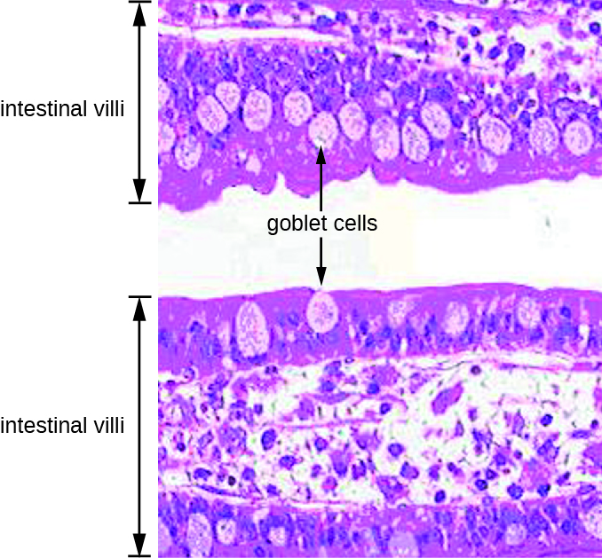

### Learning Objectives

* Describe the major anatomical features of the human digestive system
* Describe the normal microbiota of various regions in the human digestive system
* Explain how microorganisms overcome the defenses of the digestive tract to cause infection or intoxication
* Describe general signs and symptoms associated with infections of the digestive system

Part 1

After a morning of playing outside, four-year-old Carli ran inside for lunch. After taking a bite of her fried egg, she pushed it away and whined, “It’s too slimy, Mommy. I don’t want any more.” But her mother, in no mood for games, curtly replied that if she wanted to go back outside she had better finish her lunch. Reluctantly, Carli complied, trying hard not to gag as she choked down the runny egg.

That night, Carli woke up feeling nauseated. She cried for her parents and then began to vomit. Her parents tried to comfort her, but she continued to vomit all night and began to have diarrhea and run a fever. By the morning, her parents were very worried. They rushed her to the emergency room.

* What could have caused Carli’s signs and symptoms?
{: data-bullet-style="bullet"}

*Jump to the [next](/m58933#fs-id1167660319792) Clinical Focus box.*

The human **digestive system**{: data-type="term" .no-emphasis}, or the gastrointestinal (GI) tract, begins with the mouth and ends with the anus. The parts of the mouth include the teeth, the gums, the tongue, the oral vestibule (the space between the gums, lips, and teeth), and the oral cavity proper (the space behind the teeth and gums). Other parts of the **GI tract**{: data-type="term" .no-emphasis} are the pharynx, esophagus, stomach, small intestine, large intestine, rectum, and anus ([\[link\]](#OSC_Microbio_24_01_GITract)). Accessory digestive organs include the salivary glands, liver, gallbladder, spleen, and pancreas.

The digestive system contains normal microbiota, including archaea, bacteria, fungi, protists, and even viruses. Because this microbiota is important for normal functioning of the digestive system, alterations to the microbiota by antibiotics or diet can be harmful. Additionally, the introduction of pathogens to the GI tract can cause infections and diseases. In this section, we will review the microbiota found in a healthy digestive tract and the general signs and symptoms associated with oral and GI infections.

 ![Diagram of the digestive system. The system begins with the mouth and tongue. There are salivary glands in this region: the sublingual gland is under the tongue, the submandibular gland is below the jaw and the parotid gland is in the very back of the mouth. The mouth leads to the pharynx (a tube) that leads to the esophagus, that leads to the stomach, that leads to the small intestines. The small intestine is divided into 3 regions: first is the duodenum, next is the jejunim and finally the ileum. This leads to the large intestines which is divided into  regions: first the cecum, then the ascending colon, then the transverse colon, then the descending colon, then the sigmoid colon, and finally the rectum, anal canal and anus.  The appendix is a small projection off the cecum. Also part of the digestive system is the large liver (above and to the right of the stomach), the gallbladder (a small sac under the liver), the pancrease (a structure below and behind the stomach) and the spleen (a structure below and to the left of the stomach).](../resources/OSC_Microbio_24_01_GITract.jpg "The digestive system, or the gastrointestinal tract, includes all of the organs associated with the digestion of food."){: #OSC_Microbio_24_01_GITract}

### Anatomy and Normal Microbiota of the Oral Cavity

Food enters the digestive tract through the mouth, where mechanical digestion (by chewing) and chemical digestion (by enzymes in **saliva**{: data-type="term" .no-emphasis}) begin. Within the **mouth**{: data-type="term" .no-emphasis} are the **tongue**{: data-type="term" .no-emphasis}, **teeth**{: data-type="term" .no-emphasis}, and **salivary glands**{: data-type="term" .no-emphasis}, including the parotid, sublingual, and submandibular glands ([\[link\]](#OSC_Microbio_24_01_OralCavity)). The salivary glands produce saliva, which lubricates food and contains digestive enzymes.

 ![a) Structures of the head and neck: lips, jaw, nasal cavity (large space behind the nose), oral cavity (space in the mouth), tongue, uvula (structure in at the back of the mouth), pharyx (tube at the back of the mouth), esophagus (the pharyx is the top part of this tube which is now called the esophagus in the throat), and the larynx (this is also continuous with the pharynx but leads to the respiratory system). B) Components of the mouth region: teeth, sublingual gland (Below the tongue), submandibular gland (at the back and to the bottom of the mouth), and the parotid gland (a large gland at the very back of the mouth).](../resources/OSC_Microbio_24_01_OralCavity.jpg "(a) When food enters the mouth, digestion begins. (b) Salivary glands are accessory digestive organs. (credit: modification of work by National Cancer Institute)"){: #OSC_Microbio_24_01_OralCavity}

The structure of a **tooth**{: data-type="term" .no-emphasis} ([\[link\]](#OSC_Microbio_24_01_Tooth)) begins with the visible outer surface, called the **crown**{: data-type="term" .no-emphasis}, which has to be extremely hard to withstand the force of biting and chewing. The crown is covered with **enamel**{: data-type="term" .no-emphasis}, which is the hardest material in the body. Underneath the crown, a layer of relatively hard **dentin**{: data-type="term" .no-emphasis} extends into the root of the tooth around the innermost **pulp**{: data-type="term" .no-emphasis} cavity, which includes the pulp chamber at the top of the tooth and pulp canal, or **root canal**{: data-type="term" .no-emphasis}, located in the root. The pulp that fills the pulp cavity is rich in blood vessels, lymphatic vessels, connective tissue, and nerves. The root of the tooth and some of the crown are covered with **cementum**{: data-type="term" .no-emphasis}, which works with the periodontal ligament to anchor the tooth in place in the jaw bone. The soft tissues surrounding the teeth and bones are called **gums**{: data-type="term" .no-emphasis}, or **gingiva**{: data-type="term" .no-emphasis}. The **gingival space**{: data-type="term" .no-emphasis} or **gingival crevice**{: data-type="term" .no-emphasis} is located between the gums and teeth.

 ![Structure of a tooth. The part above the gums (gingiva) is called the crown, the part below the gingiva is the root. The very top of the crown is a thick enamel, this is very thick at the region above the gingiva and much thinner in the root. The next layer in is the dentin and this is equally thick in both the crown and root. In the very center is the pulp which contains the pulp canal (root canal) and nerve and blood vessels. The root sits mainly in the bone region. There is a small space where the tooth extends past the gingiva, this is called the gingival crevice.](../resources/OSC_Microbio_24_01_Tooth.jpg "The tooth has a visible crown with an outer layer of enamel, a layer of dentin, and an inner pulp. The root, hidden by the gums, contains the pulp canal (root canal). (credit: modification of work by Bruce Blaus)"){: #OSC_Microbio_24_01_Tooth}

Microbes such as bacteria and archaea are abundant in the mouth and coat all of the surfaces of the oral cavity. However, different structures, such as the teeth or cheeks, host unique communities of both aerobic and anaerobic microbes. Some factors appear to work against making the mouth hospitable to certain microbes. For example, chewing allows microbes to mix better with saliva so they can be swallowed or spit out more easily. Saliva also contains enzymes, including **lysozyme**{: data-type="term" .no-emphasis}, which can damage microbial cells. Recall that lysozyme is part of the first line of defense in the innate immune system and cleaves the β-(1,4) glycosidic linkages between N-acetylglucosamine (NAG) and N-acetylmuramic acid (NAM) in bacterial peptidoglycan (see [Chemical Defenses](/m58878){: .target-chapter}). Additionally, fluids containing immunoglobulins and phagocytic cells are produced in the gingival spaces. Despite all of these chemical and mechanical activities, the mouth supports a large microbial community.

* What factors make the mouth inhospitable for certain microbes?
{: data-bullet-style="bullet"}

### Anatomy and Normal Microbiota of the GI Tract

As food leaves the oral cavity, it travels through the pharynx, or the back of the throat, and moves into the **esophagus**{: data-type="term" .no-emphasis}, which carries the food from the **pharynx**{: data-type="term" .no-emphasis} to the **stomach**{: data-type="term" .no-emphasis} without adding any additional digestive enzymes. The stomach produces **mucus**{: data-type="term" .no-emphasis} to protect its lining, as well as digestive enzymes and acid to break down food. Partially digested food then leaves the stomach through the **pyloric sphincter**{: data-type="term" .no-emphasis}, reaching the first part of the small intestine called the **duodenum**{: data-type="term" .no-emphasis}. Pancreatic juice, which includes enzymes and bicarbonate ions, is released into the small intestine to neutralize the acidic material from the stomach and to assist in digestion. Bile, produced by the **liver**{: data-type="term" .no-emphasis} but stored in the **gallbladder**{: data-type="term" .no-emphasis}, is also released into the **small intestine**{: data-type="term" .no-emphasis} to emulsify fats so that they can travel in the watery environment of the small intestine. Digestion continues in the small intestine, where the majority of nutrients contained in the food are absorbed. Simple columnar epithelial cells called **enterocytes**{: data-type="term" .no-emphasis} line the lumen surface of the small intestinal folds called **villi**{: data-type="term" .no-emphasis}. Each enterocyte has smaller **microvilli**{: data-type="term" .no-emphasis} (cytoplasmic membrane extensions) on the cellular apical surface that increase the surface area to allow more absorption of nutrients to occur ([\[link\]](#OSC_Microbio_24_01_Villi)).

 ![The small intestines with increasing magnification. A) is a diagram and b), c), and d) are micrographs of each magnification. The micrograph of the larges magnification shows a pink region on the bottom with a deeply waved darker pink region at the surface; the top of the image is clear. There are some darker patches in the bottom layer labeled Peyer&#x2019;s patches. The diagram sows a tube lined with three layers of muscle; blood vessels connected to the outside of the tube. A cutout of the tube shows circular folds along the diameter of the tube. These folds contain deeply lobed villi. The empty space in the tube is labeled lumen. The next layer of magnification is one of the vili. The micrograph is filled with pink layers folding back and forth. The diagram shows two folds. The surface of the fold is covered with absorptive cells and some goblet cells. Between the folds is further indent labeled intestinal crypt. Inside the folds are capillaries, arteries, and lymphatic vesicles. At the very bottom of the structure (below the blood and lymph vessels, are a few duodenal glands. The final close-up shows finger-shapes in a row on the surface of a cell. These are labeled microvilli (brush border) on the diagram.](../resources/OSC_Microbio_24_01_Villi.jpg "(a) The structure of the wall of the small intestine allows for the majority of nutrient absorption in the body. (b) Villi are folds in the surface of the small intestine. Microvilli are cytoplasmic extensions on individual cells that increase the surface area for absorption. (c) A light micrograph shows the shape of the villi. (d) An electron micrograph shows the shape of the microvilli. (credit b, c, d: Modification of micrographs provided by the Regents of University of Michigan Medical School &#xA9; 2012)"){: #OSC_Microbio_24_01_Villi}

Digested food leaves the small intestine and moves into the **large intestine**{: data-type="term" .no-emphasis}, or **colon**{: data-type="term" .no-emphasis}, where there is a more diverse microbiota. Near this junction, there is a small pouch in the large intestine called the **cecum**{: data-type="term" .no-emphasis}, which attaches to the **appendix**{: data-type="term" .no-emphasis}. Further digestion occurs throughout the colon and water is reabsorbed, then waste is excreted through the **rectum**{: data-type="term" .no-emphasis}, the last section of the colon, and out of the body through the **anus**{: data-type="term" .no-emphasis} ([\[link\]](#OSC_Microbio_24_01_GITract)).

The environment of most of the GI tract is harsh, which serves two purposes: digestion and immunity. The stomach is an extremely acidic environment (pH 1.5–3.5) due to the gastric juices that break down food and kill many ingested microbes; this helps prevent infection from pathogens. The environment in the small intestine is less harsh and is able to support microbial communities. Microorganisms present in the small intestine can include **lactobacilli**{: data-type="term" .no-emphasis}, **diptherioids**{: data-type="term" .no-emphasis} and the fungus ***Candida***{: data-type="term" .no-emphasis}. On the other hand, the large intestine (colon) contains a diverse and abundant microbiota that is important for normal function. These microbes include ***Bacteriodetes***{: data-type="term" .no-emphasis} (especially the genera ***Bacteroides***{: data-type="term" .no-emphasis} and ***Prevotella***{: data-type="term" .no-emphasis}) and ***Firmicutes***{: data-type="term" .no-emphasis} (especially members of the genus ***Clostridium***{: data-type="term" .no-emphasis}). Methanogenic archaea and some fungi are also present, among many other species of bacteria. These microbes all aid in digestion and contribute to the production of feces, the waste excreted from the digestive tract, and flatus, the gas produced from microbial fermentation of undigested food. They can also produce valuable nutrients. For example, **lactic acid bacteria**{: data-type="term" .no-emphasis} such as **bifidobacteria**{: data-type="term" .no-emphasis} can synthesize vitamins, such as vitamin B12, folate, and riboflavin, that humans cannot synthesize themselves. *E. coli* found in the intestine can also break down food and help the body produce vitamin K, which is important for blood coagulation.

The GI tract has several other methods of reducing the risk of infection by pathogens. Small aggregates of underlying lymphoid tissue in the ileum, called **Peyer’s patches**{: data-type="term"} ([\[link\]](#OSC_Microbio_24_01_Villi)), detect pathogens in the intestines via microfold (M) cells, which transfer antigens from the lumen of the intestine to the lymphocytes on Peyer’s patches to induce an immune response. The Peyer’s patches then secrete **IgA**{: data-type="term" .no-emphasis} and other pathogen-specific antibodies into the intestinal lumen to help keep intestinal microbes at safe levels. Goblet cells, which are modified simple columnar epithelial cells, also line the **GI tract**{: data-type="term" .no-emphasis} ([\[link\]](#OSC_Microbio_24_01_GobletCell)). Goblet cells secrete a gel-forming **mucin**{: data-type="term" .no-emphasis}, which is the major component of **mucus**{: data-type="term" .no-emphasis}. The production of a protective layer of mucus helps reduce the risk of pathogens reaching deeper tissues.

The constant movement of materials through the gastrointestinal tract also helps to move transient pathogens out of the body. In fact, feces are composed of approximately 25% microbes, 25% sloughed epithelial cells, 25% mucus, and 25% digested or undigested food. Finally, the normal microbiota provides an additional barrier to infection via a variety of mechanisms. For example, these organisms outcompete potential pathogens for space and nutrients within the intestine. This is known as **competitive exclusion**{: data-type="term" .no-emphasis}. Members of the microbiota may also secrete protein toxins known as **bacteriocins**{: data-type="term" .no-emphasis} that are able to bind to specific receptors on the surface of susceptible bacteria.

 {: #OSC_Microbio_24_01_GobletCell}

* Compare and contrast the microbiota of the small and large intestines.
{: data-bullet-style="bullet"}

### General Signs and Symptoms of Oral and GI Disease

Despite numerous defense mechanisms that protect against infection, all parts of the digestive tract can become sites of infection or intoxication. The term **food poisoning**{: data-type="term" .no-emphasis} is sometimes used as a catch-all for GI infections and intoxications, but not all forms of GI disease originate with foodborne pathogens or toxins.

In the mouth, **fermentation**{: data-type="term" .no-emphasis} by anaerobic microbes produces acids that damage the teeth and gums. This can lead to tooth decay, cavities, and **periodontal disease**{: data-type="term"}, a condition characterized by chronic inflammation and erosion of the **gums**{: data-type="term" .no-emphasis}. Additionally, some pathogens can cause infections of the mucosa, glands, and other structures in the mouth, resulting in inflammation, sores, cankers, and other lesions. An open sore in the mouth or GI tract is typically called an **ulcer**{: data-type="term"}.

Infections and intoxications of the lower GI tract often produce symptoms such as nausea, vomiting, diarrhea, aches, and fever. In some cases, vomiting and diarrhea may cause severe dehydration and other complications that can become serious or fatal. Various clinical terms are used to describe gastrointestinal symptoms. For example, **gastritis**{: data-type="term"} is an inflammation of the stomach lining that results in swelling and **enteritis**{: data-type="term"} refers to inflammation of the intestinal mucosa. When the inflammation involves both the stomach lining and the intestinal lining, the condition is called **gastroenteritis**{: data-type="term"}. Inflammation of the liver is called **hepatitis**{: data-type="term"}. Inflammation of the colon, called **colitis**{: data-type="term"}, commonly occurs in cases of food intoxication. Because an inflamed colon does not reabsorb water as effectively as it normally does, stools become watery, causing diarrhea. Damage to the epithelial cells of the colon can also cause bleeding and excess **mucus**{: data-type="term" .no-emphasis} to appear in watery stools, a condition called **dysentery**{: data-type="term"}.

* List possible causes and signs and symptoms of food poisoning.
{: data-bullet-style="bullet"}

### Key Concepts and Summary

* The digestive tract, consisting of the oral cavity, pharynx, esophagus, stomach, small intestine, and large intestine, has a normal microbiota that is important for health.
* The constant movement of materials through the gastrointestinal canal, the protective layer of mucus, the normal microbiota, and the harsh chemical environment in the stomach and small intestine help to prevent colonization by pathogens.
* Infections or microbial toxins in the oral cavity can cause **tooth decay**, **periodontal disease**, and various types of **ulcers**.
* Infections and intoxications of the gastrointestinal tract can cause general symptoms such as nausea, vomiting, diarrhea, and fever. Localized inflammation of the GI tract can result in **gastritis**, **enteritis**, **gastroenteritis**, **hepatitis**, or **colitis**, and damage to epithelial cells of the colon can lead to **dysentery**.
* **Foodborne illness** refers to infections or intoxications that originate with pathogens or toxins ingested in contaminated food or water.
{: data-bullet-style="bullet"}

### Multiple Choice

Which of the following is NOT a way the normal microbiota of the intestine helps to prevent infection?

1.  It produces acids that lower the pH of the stomach.
2.  It speeds up the process by which microbes are flushed from the digestive tract.
3.  It consumes food and occupies space, outcompeting potential pathogens.
4.  It generates large quantities of oxygen that kill anaerobic pathogens.
{: type="a"}

D

What types of microbes live in the intestines?

1.  Diverse species of bacteria, archaea, and fungi, especially *Bacteroides* and *Firmicutes* bacteria
2.  A narrow range of bacteria, especially *Firmicutes*
3.  A narrow range of bacteria and fungi, especially *Bacteroides*
4.  Archaea and fungi only
{: type="a"}

A

### Fill in the Blank

The part of the gastrointestinal tract with the largest natural microbiota is the \_\_\_\_\_\_\_\_\_.

Large intestine or colon

### Short Answer

How does the diarrhea caused by dysentery differ from other types of diarrhea?

