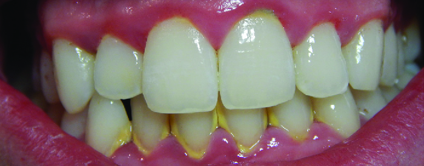

### Learning Objectives

* Explain the role of microbial activity in diseases of the mouth and oral cavity
* Compare the major characteristics of specific oral diseases and infections

Despite the presence of **saliva**{: data-type="term" .no-emphasis} and the mechanical forces of chewing and eating, some microbes thrive in the mouth. These microbes can cause damage to the teeth and can cause infections that have the potential to spread beyond the mouth and sometimes throughout the body.

### Dental Caries

Cavities of the teeth, known clinically as **dental caries**{: data-type="term"}, are microbial lesions that cause damage to the teeth. Over time, the lesion can grow through the outer **enamel**{: data-type="term" .no-emphasis} layer to infect the underlying **dentin**{: data-type="term" .no-emphasis} or even the innermost **pulp**{: data-type="term" .no-emphasis}. If dental caries are not treated, the infection can become an **abscess**{: data-type="term" .no-emphasis} that spreads to the deeper tissues of the **teeth**{: data-type="term" .no-emphasis}, near the roots, or to the bloodstream.

Tooth decay results from the metabolic activity of microbes that live on the teeth. A layer of proteins and carbohydrates forms when clean teeth come into contact with saliva. Microbes are attracted to this food source and form a **biofilm**{: data-type="term" .no-emphasis} called **plaque**{: data-type="term" .no-emphasis}. The most important cariogenic species in these biofilms is ***Streptococcus mutans***{: data-type="term" .no-emphasis}. When **sucrose**{: data-type="term" .no-emphasis}, a disaccharide sugar from food, is broken down by bacteria in the mouth, **glucose**{: data-type="term" .no-emphasis} and **fructose**{: data-type="term" .no-emphasis} are produced. The glucose is used to make **dextran**{: data-type="term" .no-emphasis}, which is part of the extracellular matrix of the biofilm. Fructose is fermented, producing organic acids such as **lactic acid**{: data-type="term" .no-emphasis}. These acids dissolve the minerals of the tooth, including **enamel**{: data-type="term" .no-emphasis}, even though it is the hardest material in the body. The acids work even more quickly on exposed **dentin**{: data-type="term" .no-emphasis} ([\[link\]](#OSC_Microbio_24_02_ToothDecay)). Over time, the **plaque**{: data-type="term" .no-emphasis} **biofilm**{: data-type="term" .no-emphasis} can become thick and eventually calcify. When a heavy plaque deposit becomes hardened in this way, it is called **tartar**{: data-type="term"} or **dental calculus**{: data-type="term"} ([\[link\]](#OSC_Microbio_24_02_Xray)). These substantial plaque biofilms can include a variety of bacterial species, including ***Streptococcus***{: data-type="term" .no-emphasis} and ***Actinomyces***{: data-type="term" .no-emphasis} species.

  develop on teeth, the acids produced gradually dissolve the enamel, followed by the dentin. Eventually, if left untreated, the lesion may reach the pulp and cause an abscess. (credit: modification of work by &#x201C;BruceBlaus&#x201D;/Wikimedia Commons)"){: #OSC_Microbio_24_02_ToothDecay}

 Tartar (dental calculus) is visible at the bases of these teeth. The darker deposits higher on the crowns are staining. (b) This tooth shows only a small amount of visible decay. (c) An X-ray of the same tooth shows that there is a dark area representing more decay inside the tooth. (d) Removal of a portion of the crown reveals the area of damage. (e) All of the cavity must be removed before filling. (credit: modification of work by &#x201C;DRosenbach&#x201D;/Wikimedia Commons)"){: #OSC_Microbio_24_02_Xray}

Some tooth decay is visible from the outside, but it is not always possible to see all decay or the extent of the decay. X-ray imaging is used to produce radiographs that can be studied to look for deeper decay and damage to the root or bone ([\[link\]](#OSC_Microbio_24_02_Xray)). If not detected, the decay can reach the pulp or even spread to the bloodstream. Painful abscesses can develop.

To prevent tooth decay, prophylactic treatment and good hygiene are important. Regular tooth brushing and flossing physically removes microbes and combats microbial growth and **biofilm**{: data-type="term" .no-emphasis} formation. Toothpaste contains **fluoride**{: data-type="term" .no-emphasis}, which becomes incorporated into the hydroxyapatite of tooth **enamel**{: data-type="term" .no-emphasis}, protecting it against acidity caused by fermentation of mouth microbiota. Fluoride is also bacteriostatic, thus slowing enamel degradation. Antiseptic mouthwashes commonly contain plant-derived **phenolics**{: data-type="term" .no-emphasis} like **thymol**{: data-type="term" .no-emphasis} and **eucalyptol**{: data-type="term" .no-emphasis} and/or heavy metals like **zinc chloride**{: data-type="term" .no-emphasis} (see [Using Chemicals to Control Microorganisms](/m58855){: .target-chapter}). Phenolics tend to be stable and persistent on surfaces, and they act through denaturing proteins and disrupting membranes.

Regular dental cleanings allow for the detection of decay at early stages and the removal of **tartar**{: data-type="term" .no-emphasis}. They may also help to draw attention to other concerns, such as damage to the enamel from acidic drinks. Reducing sugar consumption may help prevent damage that results from the microbial fermentation of sugars. Additionally, sugarless candies or gum with sugar alcohols (such as **xylitol**{: data-type="term" .no-emphasis}) can reduce the production of acids because these are fermented to nonacidic compounds (although excess consumption may lead to gastrointestinal distress). Fluoride treatment or ingesting fluoridated water strengthens the minerals in teeth and reduces the incidence of **dental caries**{: data-type="term" .no-emphasis}.

If **caries**{: data-type="term" .no-emphasis} develop, prompt treatment prevents worsening. Smaller areas of decay can be drilled to remove affected tissue and then filled. If the **pulp**{: data-type="term" .no-emphasis} is affected, then a **root canal**{: data-type="term" .no-emphasis} may be needed to completely remove the infected tissues to avoid continued spread of the infection, which could lead to painful **abscesses**{: data-type="term" .no-emphasis}.

* Name some ways that microbes contribute to tooth decay.
* What is the most important cariogenic species of bacteria?
{: data-bullet-style="bullet"}

### Periodontal Disease

In addition to damage to the **teeth**{: data-type="term" .no-emphasis} themselves, the surrounding structures can be affected by microbes. Periodontal disease is the result of infections that lead to inflammation and tissue damage in the structures surrounding the teeth. The progression from mild to severe **periodontal disease**{: data-type="term" .no-emphasis} is generally reversible and preventable with good oral hygiene.

Inflammation of the gums that can lead to irritation and bleeding is called **gingivitis**{: data-type="term"}. When **plaque**{: data-type="term" .no-emphasis} accumulates on the teeth, bacteria colonize the **gingival space**{: data-type="term" .no-emphasis}. As this space becomes increasingly blocked, the environment becomes anaerobic. This allows a wide variety of microbes to colonize, including ***Porphyromonas***{: data-type="term" .no-emphasis}, ***Streptococcus***{: data-type="term" .no-emphasis}, and ***Actinomyces***{: data-type="term" .no-emphasis}. The bacterial products, which include **lipopolysaccharide**{: data-type="term" .no-emphasis} (LPS), **proteases**{: data-type="term" .no-emphasis}, **lipoteichoic acids**{: data-type="term" .no-emphasis}, and others, cause inflammation and gum damage ([\[link\]](#OSC_Microbio_24_02_Gingivitis)). It is possible that methanogenic archaeans (including *Methanobrevibacter oralis* and other ***Methanobrevibacter***{: data-type="term" .no-emphasis} species) also contribute to disease progression as some species have been identified in patients with **periodontal disease**{: data-type="term" .no-emphasis}, but this has proven difficult to study.[1](#footnote1){: data-type="footnote-link"}[2](#footnote2){: data-type="footnote-link"}[3](#footnote3){: data-type="footnote-link"} Gingivitis is diagnosed by visual inspection, including measuring pockets in the gums, and X-rays, and is usually treated using good dental hygiene and professional dental cleaning, with antibiotics reserved for severe cases.

 {: #OSC_Microbio_24_02_Gingivitis}

Over time, chronic gingivitis can develop into the more serious condition of **periodontitis**{: data-type="term"} ([\[link\]](#OSC_Microbio_24_02_Peridont)). When this happens, the gums recede and expose parts of the tooth below the **crown**{: data-type="term" .no-emphasis}. This newly exposed area is relatively unprotected, so bacteria can grow on it and spread underneath the **enamel**{: data-type="term" .no-emphasis} of the crown and cause **cavities**{: data-type="term" .no-emphasis}. Bacteria in the **gingival space**{: data-type="term" .no-emphasis} can also erode the **cementum**{: data-type="term" .no-emphasis}, which helps to hold the **teeth**{: data-type="term" .no-emphasis} in place. If not treated, erosion of cementum can lead to the movement or loss of teeth. The bones of the jaw can even erode if the infection spreads. This condition can be associated with bleeding and halitosis (bad breath). Cleaning and appropriate dental hygiene may be sufficient to treat periodontitis. However, in cases of severe periodontitis, an antibiotic may be given. Antibiotics may be given in pill form or applied directly to the gum (local treatment). Antibiotics given can include **tetracycline**{: data-type="term" .no-emphasis}, **doxycycline**{: data-type="term" .no-emphasis}, **macrolides**{: data-type="term" .no-emphasis} or **β-lactams**{: data-type="term" .no-emphasis}. Because periodontitis can be caused by a mix of microbes, a combination of antibiotics may be given.

 ![Diagram of a tooth with healthy gums. The crown is the part above the gums, the root is the part below the gums. The enamel is the outer layer, inside is the dentin and inside that is the pulp which contains the root canal, nerves, and blood vessels. Below the gums is bone. Gingivitis is the first stage of periodontal disease. This is when the gums become darker red and swollen. Periodontitis the gumsrecede and the enamel begins to break. In advanced periodontitis the gums recede even further and the tooth degenerates past the enamel and into the dentin and pulp.](../resources/OSC_Microbio_24_02_Peridont.jpg "(a) Healthy gums hold the teeth firmly and do not bleed. (b) Gingivitis is the first stage of periodontal disease. Microbial infection causes gums to become inflamed and irritated, with occasional bleeding. (c) In periodontitis, gums recede and expose parts of the tooth normally covered. (d) In advanced periodontitis, the infection spreads to ligaments and bone tissue supporting the teeth. Tooth loss may occur, or teeth may need to be surgically removed. (credit: modification of work by &#x201C;BruceBlaus&#x201D;/Wikimedia Commons)"){: #OSC_Microbio_24_02_Peridont}

#### Trench Mouth

When certain bacteria, such as *Prevotella intermedia*, *Fusobacterium* species, and *Treponema vicentii*, are involved and periodontal disease progresses, **acute necrotizing ulcerative gingivitis**{: data-type="term"} or **trench mouth**{: data-type="term"}, also called Vincent\'s disease, can develop. This is severe periodontitis characterized by erosion of the gums, ulcers, substantial pain with chewing, and halitosis ([\[link\]](#OSC_Microbio_24_02_Trench)) that can be diagnosed by visual examination and X-rays. In countries with good medical and dental care, it is most common in individuals with weakened immune systems, such as patients with AIDS. In addition to cleaning and pain medication, patients may be prescribed antibiotics such as **amoxicillin**{: data-type="term" .no-emphasis}, **amoxicillin clavulanate**{: data-type="term" .no-emphasis}, **clindamycin**{: data-type="term" .no-emphasis}, or **doxycycline**{: data-type="term" .no-emphasis}.

 "){: #OSC_Microbio_24_02_Trench}

* How does gingivitis progress to periodontitis?
{: data-bullet-style="bullet"}

Healthy Mouth, Healthy Body

Good oral health promotes good overall health, and the reverse is also true. Poor oral health can lead to difficulty eating, which can cause malnutrition. Painful or loose teeth can also cause a person to avoid certain foods or eat less. Malnutrition due to dental problems is of greatest concern for the elderly, for whom it can worsen other health conditions and contribute to mortality. Individuals who have serious illnesses, especially AIDS, are also at increased risk of malnutrition from dental problems.

Additionally, poor oral health can contribute to the development of disease. Increased bacterial growth in the mouth can cause inflammation and infection in other parts of the body. For example, ***Streptococcus***{: data-type="term" .no-emphasis} in the mouth, the main contributor to biofilms on teeth, tartar, and dental caries, can spread throughout the body when there is damage to the tissues inside the mouth, as can happen during dental work. *S. mutans* produces a surface adhesin known as P1, which binds to salivary agglutinin on the surface of the tooth. P1 can also bind to extracellular matrix proteins including fibronectin and collagen. When *Streptococcus* enters the bloodstream as a result of tooth brushing or dental cleaning, it causes inflammation that can lead to the accumulation of plaque in the arteries and contribute to the development of **atherosclerosis**{: data-type="term" .no-emphasis}, a condition associated with cardiovascular disease, heart attack, and stroke. In some cases, bacteria that spread through the blood vessels can lodge in the heart and cause **endocarditis**{: data-type="term" .no-emphasis} (an example of a focal infection).

### Oral Infections

As noted earlier, normal oral microbiota can cause dental and periodontal infections. However, there are number of other infections that can manifest in the oral cavity when other microbes are present.

#### Herpetic Gingivostomatitis

As described in [Viral Infections of the Skin and Eyes](/m58908){: .target-chapter}, infections by **herpes simplex virus type 1 (HSV-1)**{: data-type="term" .no-emphasis} frequently manifest as **oral herpes**{: data-type="term" .no-emphasis}, also called **acute herpes labialis**{: data-type="term" .no-emphasis} and characterized by **cold sores**{: data-type="term" .no-emphasis} on the lips, mouth, or gums. HSV-1 can also cause acute **herpetic gingivostomatitis**{: data-type="term"}, a condition that results in ulcers of the mucous membranes inside the mouth ([\[link\]](#OSC_Microbio_24_02_HerpGing)). Herpetic gingivostomatitis is normally self-limiting except in immunocompromised patients. Like oral herpes, the infection is generally diagnosed through clinical examination, but cultures or biopsies may be obtained if other signs or symptoms suggest the possibility of a different causative agent. If treatment is needed, mouthwashes or antiviral medications such as **acyclovir**{: data-type="term" .no-emphasis}, **famciclovir**{: data-type="term" .no-emphasis}, or **valacyclovir**{: data-type="term" .no-emphasis} may be used.

  This cold sore is caused by infection with herpes simplex virus type 1 (HSV-1). (b) HSV-1 can also cause acute herpetic gingivostomatitis. (credit b: modification of work by Klaus D. Peter)"){: #OSC_Microbio_24_02_HerpGing}

#### Oral Thrush

The yeast ***Candida***{: data-type="term" .no-emphasis} is part of the normal human microbiota, but overgrowths, especially of *Candida albicans*, can lead to infections in several parts of the body. When *Candida* infection develops in the oral cavity, it is called **oral thrush**{: data-type="term"}. Oral thrush is most common in infants because they do not yet have well developed immune systems and have not acquired the robust normal microbiota that keeps *Candida* in check in adults. Oral thrush is also common in immunodeficient patients and is a common infection in patients with AIDS.

Oral thrush is characterized by the appearance of white patches and pseudomembranes in the mouth ([\[link\]](#OSC_Microbio_24_02_Thrush)) and can be associated with bleeding. The infection may be treated topically with **nystatin**{: data-type="term" .no-emphasis} or **clotrimazole**{: data-type="term" .no-emphasis} oral suspensions, although systemic treatment is sometimes needed. In serious cases, systemic azoles such as **fluconazole**{: data-type="term" .no-emphasis} or **itraconazole**{: data-type="term" .no-emphasis} (for strains resistant to fluconazole), may be used. Amphotericin B can also be used if the infection is severe or if the *Candida* species is azole-resistant.

 "){: #OSC_Microbio_24_02_Thrush}

#### Mumps

The viral disease **mumps**{: data-type="term"} is an infection of the parotid glands, the largest of the three pairs of **salivary glands**{: data-type="term" .no-emphasis} ([\[link\]](/m58924#OSC_Microbio_24_01_OralCavity)). The causative agent is mumps virus (MuV), a **paramyxovirus**{: data-type="term" .no-emphasis} with an envelope that has hemagglutinin and neuraminidase spikes. A fusion protein located on the surface of the envelope helps to fuse the viral envelope to the host cell plasma membrane.

Mumps virus is transmitted through respiratory droplets or through contact with contaminated saliva, making it quite contagious so that it can lead easily to epidemics. It causes fever, muscle pain, headache, pain with chewing, loss of appetite, fatigue, and weakness. There is swelling of the salivary glands and associated pain ([\[link\]](#OSC_Microbio_24_02_Mumps)). The virus can enter the bloodstream (**viremia**{: data-type="term" .no-emphasis}), allowing it to spread to the organs and the central nervous system. The infection ranges from subclinical cases to cases with serious complications, such as **encephalitis**{: data-type="term" .no-emphasis}, **meningitis**{: data-type="term" .no-emphasis}, and deafness. Inflammation of the pancreas, testes, ovaries, and breasts may also occur and cause permanent damage to those organs; despite these complications, a mumps infection rarely cause sterility.

Mumps can be recognized based on clinical signs and symptoms, and a diagnosis can be confirmed with laboratory testing. The virus can be identified using culture or molecular techniques such as RT-PCR. Serologic tests are also available, especially enzyme immunoassays that detect antibodies. There is no specific treatment for mumps, so supportive therapies are used. The most effective way to avoid infection is through vaccination. Although mumps used to be a common childhood disease, it is now rare in the United States due to vaccination with the measles, mumps, and rubella (MMR) vaccine.

 "){: #OSC_Microbio_24_02_Mumps}

* Compare and contrast the signs and symptoms of herpetic gingivostomatitis, oral thrush, and mumps.
{: data-bullet-style="bullet"}

Oral Infections

Infections of the mouth and oral cavity can be caused by a variety of pathogens, including bacteria, viruses, and fungi. Many of these infections only affect the mouth, but some can spread and become systemic infections. [\[link\]](#OSC_Microbio_24_02_OralInfTbl) summarizes the main characteristics of common oral infections.

![Table titled: Oral Infections. Columns: Disease, Pathogen, Signs and Symptoms, Transmission, Diagnostic Tests, Antimicrobial Drugs. Dental caries; Streptococcus mutans; Discoloration, softening, cavities in teeth; Non-transmissible; caused by bacteria of the normal oral microbiota; Visual examinations, X-rays Oral antiseptics (e.g., Listerine). Gingivitis and periodontitis; Porphyromonas, Streptococcus, Actinomyces; Inflammation and erosion of gums, bleeding, halitosis; erosion of cementum leading to tooth loss in advanced infections; Non-transmissible; caused by bacteria of the normal oral microbiota; Visual examination, X-rays, measuring pockets in gums; Tetracycline, doxycycline, macrolides or beta-lactams. Mixture of antibiotics may be given. Herpetic gingivostomatitis; Herpes simplex virus type 1 (HSV-1); Lesions in mucous membranes of mouth Contact with saliva or lesions of an infected person Culture or biopsy; Acyclovir, famcyclovir, valacyclovir. Mumps; Mumps virus (a paramyxovirus); Swelling of parotid glands, fever, headache, muscle pain, weakness, fatigue, loss of appetite, pain while chewing; in serious cases, encephalitis, meningitis, and inflammation of testes, ovaries, and breasts; Contact with saliva or respiratory droplets of an infected person; Virus culture or serologic tests for antibodies, enzyme immunoassay, RT-PCR; None for treatment; MMR vaccine for prevention. Oral thrush; Candida albicans, other Candida spp.;  White patches and pseudomembranes in mouth, may cause bleeding; Nontransmissible; caused by overgrowth of Candida spp. in the normal oral microbiota; primarily affects infants and the immunocompromised. Microscopic analysis of oral samples; Clotrimazole, nystatin, fluconazole, or itraconazole; amphotericin B in severe cases. Trench mouth (acute necrotizing ulcerative gingivitis); Prevotella intermedia Fusobacterium species, Treponema vincentii, others; Erosion of gums, ulcers, substantial pain with chewing, halitosis; Nontransmissible; caused by members of the normal oral microbiota; Visual examinations, X-rays; Amoxicillin, amoxicillin clavulanate, clindamycin, or doxycycline.](../resources/OSC_Microbio_24_02_OralInfTBL.jpg){: #OSC_Microbio_24_02_OralInfTbl}

### Key Concepts and Summary

* **Dental caries**, **tartar**, and **gingivitis** are caused by overgrowth of oral bacteria, usually *Streptococcus* and *Actinomyces* species, as a result of insufficient dental hygiene.
* Gingivitis can worsen, allowing *Porphyromonas*, *Streptococcus*, and *Actinomyces* species to spread and cause **periodontitis**. When *Prevotella intermedia*, *Fusobacterium* species, and *Treponema vicentii* are involved, it can lead to **acute necrotizing ulcerative gingivitis**.
* The herpes simplex virus type 1 can cause lesions of the mouth and throat called **herpetic gingivostomatitis.**
* Other infections of the mouth include **oral thrush**, a fungal infection caused by overgrowth of *Candida* yeast, and **mumps**, a viral infection of the salivary glands caused by the mumps virus, a paramyxovirus.
{: data-bullet-style="bullet"}

### Multiple Choice

What pathogen is the most important contributor to biofilms in plaque?

1.  *Staphylococcus aureus*
2.  *Streptococcus mutans*
3.  *Escherichia coli*
4.  *Clostridium difficile*
{: data-number-style="lower-alpha"}

B

What type of organism causes thrush?

1.  a bacterium
2.  a virus
3.  a fungus
4.  a protozoan
{: data-number-style="lower-alpha"}

C

In mumps, what glands swell to produce the disease’s characteristic appearance?

1.  the sublingual glands
2.  the gastric glands
3.  the parotid glands
4.  the submandibular glands
{: data-number-style="lower-alpha"}

C

Which of the following is true of HSV-1?

1.  It causes oral thrush in immunocompromised patients.
2.  Infection is generally self-limiting.
3.  It is a bacterium.
4.  It is usually treated with amoxicillin.
{: data-number-style="lower-alpha"}

B

### Fill in the Blank

When plaque becomes heavy and hardened, it is called dental calculus or \_\_\_\_\_\_\_\_\_.

tartar

### Short Answer

Why do sugary foods promote dental caries?

### Footnotes
{: data-type="footnote-refs-title"}

* {: data-type="footnote-ref" #footnote1} [1](#footnote-ref1){: data-type="footnote-ref-link"} Hans-Peter Horz and Georg Conrads. “Methanogenic *Archaea* and Oral Infections—Ways to Unravel the Black Box.” *Journal of Oral Microbiology* 3(2011). doi: 10.3402/jom.v3i0.5940.
* {: data-type="footnote-ref" #footnote2} [2](#footnote-ref2){: data-type="footnote-ref-link"} Hiroshi Maeda, Kimito Hirai, Junji Mineshiba, Tadashi Yamamoto, Susumu Kokeguchi, and Shogo Takashiba. “Medical Microbiological Approach to Archaea in Oral Infectious Diseases.” *Japanese Dental Science Review* 49: 2, p. 72–78.
* {: data-type="footnote-ref" #footnote3} [3](#footnote-ref3){: data-type="footnote-ref-link"} Paul W. Lepp, Mary M. Brinig, Cleber C. Ouverney, Katherine Palm, Gary C. Armitage, and David A. Relman. “Methanogenic *Archaea* and Human Periodontal Disease.” *Proceedings of the National Academy of Sciences of the United States of America* 101 (2003): 16, pp. 6176–6181. doi: 10.1073/pnas.0308766101.
{: data-list-type="bulleted" data-bullet-style="none"}

