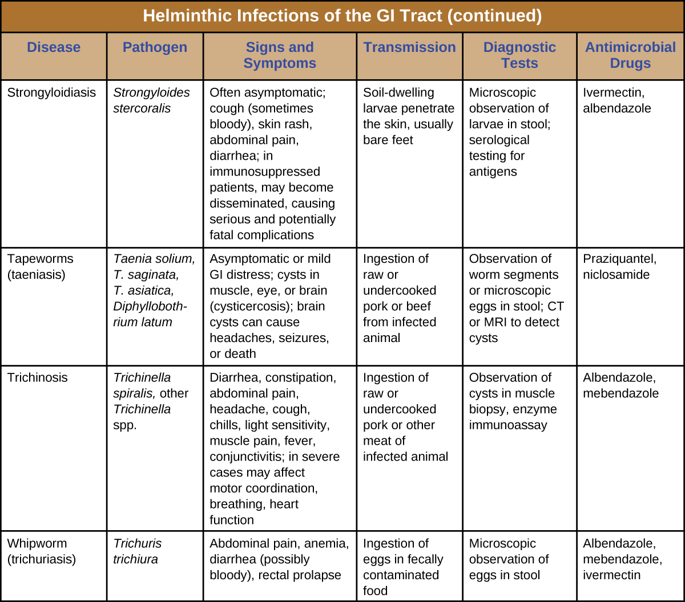

### Learning Objectives

* Identify the most common helminths that cause infections of the GI tract
* Compare the major characteristics of specific helminthic diseases affecting GI tract

Helminths are widespread intestinal parasites. These parasites can be divided into three common groups: round-bodied worms also described as **nematodes**{: data-type="term" .no-emphasis}, flat-bodied worms that are segmented (also described as **cestodes**{: data-type="term" .no-emphasis}), and flat-bodied worms that are non-segmented (also described as **trematodes**{: data-type="term" .no-emphasis}). The nematodes include **roundworms**{: data-type="term" .no-emphasis}, **pinworms**{: data-type="term" .no-emphasis}, **hookworms**{: data-type="term" .no-emphasis}, and **whipworms**{: data-type="term" .no-emphasis}. Cestodes include beef, pork, and fish **tapeworms**{: data-type="term" .no-emphasis}. Trematodes are collectively called **flukes**{: data-type="term" .no-emphasis} and more uniquely identified with the body site where the adult flukes are located. Although infection can have serious consequences, many of these parasites are so well adapted to the human host that there is little obvious disease.

### Ascariasis

Infections caused by the large nematode roundworm ***Ascaris lumbricoides***{: data-type="term" .no-emphasis}, a soil-transmitted helminth, are called **ascariasis**{: data-type="term"}. Over 800 million to 1 billion people are estimated to be infected worldwide.[1](#footnote1){: data-type="footnote-link"} Infections are most common in warmer climates and at warmer times of year. At present, infections are uncommon in the United States. The eggs of the worms are transmitted through contaminated food and water. This may happen if food is grown in contaminated soil, including when manure is used as fertilizer.

When an individual consumes embryonated eggs (those with a developing embryo), the eggs travel to the intestine and the larvae are able to hatch. *Ascaris* is able to produce proteases that allow for penetration and degradation of host tissue. The juvenile worms can then enter the circulatory system and migrate to the lungs where they enter the alveoli (air sacs). From here they crawl to the pharynx and then follow the gut lumen to return to the small intestine, where they mature into adult **roundworms**{: data-type="term" .no-emphasis}. Females in the host will produce and release eggs that leave the host via feces. In some cases, the worms can block ducts such as those of the **pancreas**{: data-type="term" .no-emphasis} or **gallbladder**{: data-type="term" .no-emphasis}.

The infection is commonly asymptomatic. When signs and symptoms are present, they include shortness of breath, cough, nausea, diarrhea, blood in the stool, abdominal pain, weight loss, and fatigue. The roundworms may be visible in the stool. In severe cases, children with substantial infections may experience intestinal blockage.

The eggs can be identified by microscopic examination of the stool ([\[link\]](#OSC_Microbio_24_06_Ascariasis)). In some cases, the worms themselves may be identified if coughed up or excreted in stool. They can also sometimes be identified by X-rays, ultrasounds, or MRIs.

Ascariasis is self-limiting, but can last one to two years because the worms can inhibit the body’s inflammatory response through glycan gimmickry (see [Virulence Factors of Eukaryotic Pathogens](/m58869){: .target-chapter}). The first line of treatment is **mebendazole**{: data-type="term" .no-emphasis} or **albendazole**{: data-type="term" .no-emphasis}. In some severe cases, surgery may be required.

  Adult Ascaris lumbricoides roundworms can cause intestinal blockage. (b) This mass of A. lumbricoides worms was excreted by a child. (c) A micrograph of a fertilized egg of A. lumbricoides. Fertilized eggs can be distinguished from unfertilized eggs because they are round rather than elongated and have a thicker cell wall. (credit a: modification of work by South African Medical Research Council; credit b: modification of work by James Gathany, Centers for Disease Control and Prevention; credit c: modification of work by Centers for Disease Control and Prevention)"){: #OSC_Microbio_24_06_Ascariasis}

* Describe the route by which *A. lumbricoides* reaches the host’s intestines as an adult worm.
{: data-bullet-style="bullet"}

### Hookworm

Two species of nematode worms are associated with **hookworm infection**{: data-type="term"}. Both species are found in the Americas, Africa, and Asia. ***Necator americanus***{: data-type="term" .no-emphasis} is found predominantly in the United States and Australia. Another species, ***Ancylostoma doudenale***{: data-type="term" .no-emphasis}, is found in southern Europe, North Africa, the Middle East, and Asia.

The eggs of these species develop into larvae in soil contaminated by dog or cat feces. These larvae can penetrate the skin. After traveling through the venous circulation, they reach the lungs. When they are coughed up, they are then swallowed and can enter the intestine and develop into mature adults. At this stage, they attach to the wall of the intestine, where they feed on blood and can potentially cause anemia. Signs and symptoms include cough, an itchy rash, loss of appetite, abdominal pain, and diarrhea. In children, hookworms can affect physical and cognitive growth.

Some hookworm species, such as *Ancylostoma braziliense* that is commonly found in animals such as cats and dogs, can penetrate human skin and migrate, causing **cutaneous larva migrans**{: data-type="term" .no-emphasis}, a skin disease caused by the larvae of hookworms. As they move across the skin, in the subcutaneous tissue, pruritic tracks appear ([\[link\]](#OSC_Microbio_24_06_Hookworm)).

The infection is diagnosed using microscopic examination of the stool, allowing for observation of eggs in the feces. Medications such as **albendazole**{: data-type="term" .no-emphasis}, **mebendazole**{: data-type="term" .no-emphasis}, and **pyrantel pamoate**{: data-type="term" .no-emphasis} are used as needed to treat systemic infection. In addition to systemic medication for symptoms associated with cutaneous larva migrans, topical **thiabendazole**{: data-type="term" .no-emphasis} is applied to the affected areas.

  This animal hookworm, Ancylostoma caninum, is attached to the intestinal wall. (b) The tracks of hookworms are visible in this individual with cutaneous larva migrans. (c) This micrograph shows the microscopic egg of a hookworm. (credit a, c: modification of work by Centers for Disease Control and Prevention)"){: #OSC_Microbio_24_06_Hookworm}

### Strongyloidiasis

**Strongyloidiasis**{: data-type="term"} is generally caused by ***Strongyloides stercoralis***{: data-type="term" .no-emphasis}, a soil-transmitted **helminth**{: data-type="term" .no-emphasis} with both free-living and parasitic forms. In the parasitic form, the larvae of these **nematodes**{: data-type="term" .no-emphasis} generally penetrate the body through the skin, especially through bare feet, although transmission through organ transplantation or at facilities like day-care centers can also occur. When excreted in the stool, larvae can become free-living adults rather than developing into the parasitic form. These free-living worms reproduce, laying eggs that hatch into larvae that can develop into the parasitic form. In the parasitic life cycle, infective larvae enter the skin, generally through the feet. The larvae reach the circulatory system, which allows them to travel to the alveolar spaces of the lungs. They are transported to the **pharynx**{: data-type="term" .no-emphasis} where, like many other helminths, the infected patient coughs them up and swallows them again so that they return to the **intestine**{: data-type="term" .no-emphasis}. Once they reach the intestine, females live in the epithelium and produce eggs that develop asexually, unlike the free-living forms, which use sexual reproduction. The larvae may be excreted in the stool or can reinfect the host by entering the tissue of the intestines and skin around the anus, which can lead to chronic infections.

The condition is generally asymptomatic, although severe symptoms can develop after treatment with corticosteroids for asthma or chronic obstructive pulmonary disease, or following other forms of immunosuppression. When the immune system is suppressed, the rate of autoinfection increases, and huge amounts of larvae migrate to organs throughout the body.

Signs and symptoms are generally nonspecific. The condition can cause a rash at the site of skin entry, cough (dry or with blood), fever, nausea, difficulty breathing, bloating, pain, heartburn, and, rarely, arthritis, or cardiac or kidney complications. Disseminated strongyloidiasis or hyperinfection is a life-threatening form of the disease that can occur, usually following immunosuppression such as that caused by glucocorticoid treatment (most commonly), with other immunosuppressive medications, with HIV infection, or with malnutrition.

As with other helminths, direct examination of the stool is important in diagnosis. Ideally, this should be continued over seven days. Serological testing, including antigen testing, is also available. These can be limited by cross-reactions with other similar parasites and by the inability to distinguish current from resolved infection. Ivermectin is the preferred treatment, with **albendazole**{: data-type="term" .no-emphasis} as a secondary option.

* How does an acute infection of *S. stercoralis* become chronic?
{: data-bullet-style="bullet"}

### Pinworms (Enterobiasis)

***Enterobius vermicularis***{: data-type="term" .no-emphasis}, commonly called **pinworms**{: data-type="term" .no-emphasis}, are tiny (2–13 mm) nematodes that cause **enterobiasis**{: data-type="term"}. Of all helminthic infections, enterobiasis is the most common in the United States, affecting as many as one-third of American children.[2](#footnote2){: data-type="footnote-link"} Although the signs and symptoms are generally mild, patients may experience abdominal pain and insomnia from itching of the perianal region, which frequently occurs at night when worms leave the anus to lay eggs. The itching contributes to transmission, as the disease is transmitted through the fecal-oral route. When an infected individual scratches the anal area, eggs may get under the fingernails and later be deposited near the individual’s mouth, causing reinfection, or on fomites, where they can be transferred to new hosts. After being ingested, the larvae hatch within the small intestine and then take up residence in the colon and develop into adults. From the colon, the female adult exits the body at night to lay eggs ([\[link\]](#OSC_Microbio_24_06_Pinworm)).

Infection is diagnosed in any of three ways. First, because the worms emerge at night to lay eggs, it is possible to inspect the perianal region for worms while an individual is asleep. An alternative is to use transparent tape to remove eggs from the area around the anus first thing in the morning for three days to yield eggs for microscopic examination. Finally, it may be possible to detect eggs through examination of samples from under the fingernails, where eggs may lodge due to scratching. Once diagnosis has been made, **mebendazole**{: data-type="term" .no-emphasis}, **albendazole**{: data-type="term" .no-emphasis}, and **pyrantel pamoate**{: data-type="term" .no-emphasis} are effective for treatment.

  E. vermicularis are tiny nematodes commonly called pinworms. (b) This micrograph shows pinworm eggs."){: #OSC_Microbio_24_06_Pinworm}

### Trichuriasis

The nematode whipworm ***Trichuris trichiura***{: data-type="term" .no-emphasis} is a parasite that is transmitted by ingestion from soil-contaminated hands or food and causes **trichuriasis**{: data-type="term"}. Infection is most common in warm environments, especially when there is poor sanitation and greater risk of fecal contamination of soil, or when food is grown in soil using manure as a fertilizer. The signs and symptoms may be minimal or nonexistent. When a substantial infection develops, signs and symptoms include painful, frequent diarrhea that may contain mucus and blood. It is possible for the infection to cause rectal prolapse, a condition in which a portion of the rectum becomes detached from the inside of the body and protrudes from the anus ([\[link\]](#OSC_Microbio_24_06_Whipworm)). Severely infected children may experience reduced growth and their cognitive development may be affected.

When fertilized eggs are ingested, they travel to the intestine and the larvae emerge, taking up residence in the walls of the colon and cecum. They attach themselves with part of their bodies embedded in the mucosa. The larvae mature and live in the cecum and ascending colon. After 60 to 70 days, females begin to lay 3000 to 20,000 eggs per day.

Diagnosis involves examination of the feces for the presence of eggs. It may be necessary to use concentration techniques and to collect specimens on multiple days. Following diagnosis, the infection may be treated with **mebendazole**{: data-type="term" .no-emphasis}, **albendazole**{: data-type="term" .no-emphasis}, or **ivermectin**{: data-type="term" .no-emphasis}.

  This adult female Trichuris whipworm is a soil-transmitted parasite. (b) Trichuris trichiura eggs are ingested and travel to the intestines where the larvae emerge and take up residence. (c) Rectal prolapse is a condition that can result from whipworm infections. It occurs when the rectum loses its attachment to the internal body structure and protrudes from the anus. (credit a, b, c: modification of work by Centers for Disease Control and Prevention)"){: #OSC_Microbio_24_06_Whipworm}

### Trichinosis

**Trichinosis**{: data-type="term"} (**trichenellosis**{: data-type="term" .no-emphasis}) develops following consumption of food that contains ***Trichinella***{: data-type="term" .no-emphasis} *spiralis* (most commonly) or other *Trichinella* species. These microscopic nematode worms are most commonly transmitted in meat, especially pork, that has not been cooked thoroughly. *T. spiralis* larvae in meat emerge from cysts when exposed to acid and pepsin in the stomach. They develop into mature adults within the large intestine. The larvae produced in the large intestine are able to migrate into the muscles mechanically via the stylet of the parasite, forming cysts. Muscle proteins are reduced in abundance or undetectable in cells that contain *Trichinella* (nurse cells). Animals that ingest the cysts from other animals can later develop infection ([\[link\]](#OSC_Microbio_24_06_Tspiralis)).

Although infection may be asymptomatic, symptomatic infections begin within a day or two of consuming the nematodes. Abdominal symptoms arise first and can include diarrhea, constipation, and abdominal pain. Other possible symptoms include headache, light sensitivity, muscle pain, fever, cough, chills, and conjunctivitis. More severe symptoms affecting motor coordination, breathing, and the heart sometimes occur. It may take months for the symptoms to resolve, and the condition is occasionally fatal. Mild cases may be mistaken for influenza or similar conditions.

Infection is diagnosed using clinical history, muscle biopsy to look for larvae, and serological testing, including immunoassays. Enzyme immunoassay is the most common test. It is difficult to effectively treat larvae that have formed cysts in the muscle, although medications may help. It is best to begin treatment as soon as possible because medications such as **mebendazole**{: data-type="term" .no-emphasis} and **albendazole**{: data-type="term" .no-emphasis} are effective in killing only the adult worms in the intestine. Steroids may be used to reduce inflammation if larvae are in the muscles.

  This image shows larvae of T. spiralis within muscle. (b) In meat, the larvae have a characteristic coiled appearance, as seen in this partially digested larva in bear meat. (credit a, b: modification of work by Centers for Disease Control and Prevention)"){: #OSC_Microbio_24_06_Tspiralis}

* Compare and contrast the transmissions of pinworms and whipworms.
{: data-bullet-style="bullet"}

### Tapeworms (Taeniasis)

**Taeniasis**{: data-type="term"} is a **tapeworm**{: data-type="term" .no-emphasis} infection, generally caused by pork (***Taenia***{: data-type="term" .no-emphasis} *solium*), beef (*Taenia saginata*), and Asian (*Taenia asiatica*) tapeworms found in undercooked meat. Consumption of raw or undercooked fish, including contaminated sushi, can also result in infection from the fish tapeworm (***Diphyllobothrium***{: data-type="term" .no-emphasis} *latum*). Tapeworms are flatworms (**cestodes**{: data-type="term" .no-emphasis}) with multiple body segments and a head called a **scolex**{: data-type="term" .no-emphasis} that attaches to the intestinal wall. Tapeworms can become quite large, reaching 4 to 8 meters long ([\[link\]](#OSC_Microbio_24_06_Tapeworm)). [\[link\]](/m58803#OSC_Microbio_05_02_tapewormLC) illustrates the life cycle of a tapeworm.

  An adult tapeworm uses the scolex to attach to the intestinal wall. (b) The egg of a pork tapeworm (Taenia solium) is visible in this micrograph. (credit a, b: modification of work by Centers for Disease Control and Prevention)"){: #OSC_Microbio_24_06_Tapeworm}

Tapeworms attached to the intestinal wall produce eggs that are excreted in feces. After ingestion by animals, the eggs hatch and the larvae emerge. They may take up residence in the intestine, but can sometimes move to other tissues, especially muscle or brain tissue. When *T. solium* larvae form cysts in tissue, the condition is called **cysticercosis**{: data-type="term" .no-emphasis}. This occurs through ingestion of eggs via the fecal-oral route, not through consumption of undercooked meat. It can develop in the muscles, eye (ophthalmic cysticercosis), or brain (neurocysticercosis).

Infections may be asymptomatic or they may cause mild gastrointestinal symptoms such as epigastric discomfort, nausea, diarrhea, flatulence, or hunger pains. It is also common to find visible tapeworm segments passed in the stool. In cases of cysticercosis, symptoms differ depending upon where the cysts become established. Neurocysticercosis can have severe, life-threatening consequences and is associated with headaches and seizures because of the presence of the tapeworm larvae encysted in the brain. Cysts in muscles may be asymptomatic, or they may be painful.

To diagnose these conditions, microscopic analysis of stool samples from three separate days is generally recommended. Eggs or body segments, called proglottids, may be visible in these samples. Molecular methods have been developed but are not yet widely available. Imaging, such as CT and MRI, may be used to detect cysts. Praziquantel or **niclosamide**{: data-type="term" .no-emphasis} are used for treatment.

What’s in Your Sushi Roll?

As foods that contain raw fish, such as sushi and sashimi, continue to increase in popularity throughout the world, so does the risk of parasitic infections carried by raw or undercooked fish. ***Diphyllobothrium***{: data-type="term" .no-emphasis} species, known as fish tapeworms, is one of the main culprits. Evidence suggests that undercooked salmon caused an increase in *Diphyllobothrium* infections in British Columbia in the 1970s and early 1980s. In the years since, the number of reported cases in the United States and Canada has been low, but it is likely that cases are underreported because the causative agent is not easily recognized.[3](#footnote3){: data-type="footnote-link"}

Another illness transmitted in undercooked fish is herring worm disease, or anisakiasis, in which nematodes attach to the epithelium of the esophagus, stomach, or small intestine. Cases have increased around the world as raw fish consumption has increased.[4](#footnote4){: data-type="footnote-link"}

Although the message may be unpopular with sushi lovers, fish should be frozen or cooked before eating. The extremely low and high temperatures associated with freezing and cooking kill worms and larvae contained in the meat, thereby preventing infection. Ingesting fresh, raw sushi may make for a delightful meal, but it also entails some risk.

### Hydatid Disease

Another cestode, *Echinococcus granulosus*, causes a serious infection known as **hydatid disease**{: data-type="term"} (**cystic echinococcosis**{: data-type="term"}). *E. granulosus* is found in dogs (the definitive host), as well as several intermediate hosts (sheep, pigs, goats, cattle). The cestodes are transmitted through eggs in the feces from infected animals, which can be an occupational hazard for individuals who work in agriculture.

Once ingested, *E. granulosus* eggs hatch in the small intestine and release the larvae. The larvae invade the intestinal wall to gain access to the circulatory system. They form hydatid cysts in internal organs, especially in the lungs and liver, that grow slowly and are often undetected until they become large. If the cysts burst, a severe allergic reaction (anaphylaxis) may occur.

Cysts present in the liver can cause enlargement of the liver, nausea, vomiting, right epigastric pain, pain in the right upper quadrant, and possible allergic signs and symptoms. Cysts in the lungs can lead to alveolar disease. Abdominal pain, weight loss, pain, and malaise may occur, and inflammatory processes develop.

*E. granulosus* can be detected through imaging (ultrasonography, CT, MRI) that shows the cysts. Serologic tests, including ELISA and indirect hemagglutinin tests, are used. Cystic disease is most effectively treated with surgery to remove cysts, but other treatments are also available, including chemotherapy with anti-helminthic drugs (**albendazole**{: data-type="term" .no-emphasis} or **mebendazole**{: data-type="term" .no-emphasis}).

* Describe the risks of the cysts associated with taeniasis and hydatid disease.
{: data-bullet-style="bullet"}

### Flukes

Flukes are flatworms that have a leaflike appearance. They are a type of trematode worm, and multiple species are associated with disease in humans. The most common are liver flukes and intestinal flukes ([\[link\]](#OSC_Microbio_24_06_Flukes)).

  A liver fluke infects the bile ducts. (b) An intestinal fluke infects the intestines. (credit a: modification of work by Shafiei R, Sarkari B, Sadjjadi SM, Mowlavi GR, and Moshfe A; credit b: modification of work by Georgia Division of Public Health)"){: #OSC_Microbio_24_06_Flukes}

#### Liver Flukes

The **liver flukes**{: data-type="term"} are several species of trematodes that cause disease by interfering with the bile duct. **Fascioliasis**{: data-type="term" .no-emphasis} is caused by ***Fasciola***{: data-type="term" .no-emphasis} *hepatica* and *Fasciola gigantica* in contaminated raw or undercooked aquatic plants (e.g., watercress). In *Fasciola* infection, adult flukes develop in the bile duct and release eggs into the feces. Clonochiasis is caused by ***Clonorchis sinensis***{: data-type="term" .no-emphasis} in contaminated freshwater fish. Other flukes, such as ***Opisthorchis viverrini***{: data-type="term" .no-emphasis} (found in fish) and ***Opisthorchis felineus***{: data-type="term" .no-emphasis} (found in freshwater snails), also cause infections. Liver flukes spend part of their life cycle in freshwater snails, which serve as an intermediate host. Humans are typically infected after eating aquatic plants contaminated by the infective larvae after they have left the snail. Once they reach the human intestine, they migrate back to the bile duct, where they mature. The life cycle is similar for the other infectious liver flukes, (see [\[link\]](/m58803#OSC_Microbio_05_02_schistolLC)).

When *Fasciola* flukes cause acute infection, signs and symptoms include nausea, vomiting, abdominal pain, rash, fever, malaise, and breathing difficulties. If the infection becomes chronic, with adult flukes living in the bile duct, then cholangitis, cirrhosis, pancreatitis, cholecystitis, and gallstones may develop. Symptoms are similar for infections by other liver flukes. Cholangiocarcinoma can occur from *C. sinensis* infection. The *Opisthorchis* species can also be associated with cancer development.

Diagnosis is accomplished using patient history and examination of samples from feces or other samples (such as vomitus). Because the eggs may appear similar, immunoassay techniques are available that can help distinguish species. The preferred treatment for fascioliasis is **triclabendazole**{: data-type="term" .no-emphasis}. *C. sinensis* and *Opisthorchis* spp. infections are treated with **praziquantel**{: data-type="term" .no-emphasis} or **albendazole**{: data-type="term" .no-emphasis}.

#### Intestinal Flukes

The **intestinal flukes**{: data-type="term"} are trematodes that develop in the intestines. Many, such as ***Fasciolopsis buski***{: data-type="term" .no-emphasis}, which causes **fasciolopsiasis**{: data-type="term" .no-emphasis}, are closely related to liver flukes. Intestinal flukes are ingested from contaminated aquatic plants that have not been properly cooked. When the cysts are consumed, the larvae emerge in the duodenum and develop into adults while attached to the intestinal epithelium. The eggs are released in stool.

Intestinal fluke infection is often asymptomatic, but some cases may involve mild diarrhea and abdominal pain. More severe symptoms such as vomiting, nausea, allergic reactions, and anemia can sometimes occur, and high parasite loads may sometimes lead to intestinal obstructions.

Diagnosis is the same as with liver flukes: examination of feces or other samples and immunoassay. Praziquantel is used to treat infections caused by intestinal flukes.

* How are flukes transmitted?
{: data-bullet-style="bullet"}

Helminthic Gastrointestinal Infections

Numerous helminths are capable of colonizing the GI tract. Many such infections are asymptomatic, but others may cause signs and symptoms ranging from mild GI stress to severe systemic infection. Helminths have complex and unique life cycles that dictate their specific modes of transmission. Most helminthic infections can be treated with medications.

![Table titled: Helminthic Infections of the GI Tract. Columns: Disease, Pathogen, Signs and Symptoms, Transmission, Diagnostic Tests, Antimicrobial Drugs. Ascariasis; Ascaris lumbricoides; Shortness of breath, cough, nausea, diarrhea, bloody stool, abdominal pain, weight loss, fatigue, worms in stool or sputum; Ingestion of eggs in fecally contaminated food and water; Microscopic observation of eggs in stool sample, X-rays, ultrasounds or MRIs; Albendazole, mebendazole. Hookworm; Necator americanus, Ancyclostoma doudenale; Cough, itchy rash, wheezing, loss of appetite, abdominal pain, diarrhea, cutaneous larva migrans; Larvae in soil contaminated by dog or cat feces penetrate the skin; Microscopic observation of eggs in stool sample; Albendazole, mebendazole, pyrantel pamoate, thiabendazole. Hydatid disease (cystic echinococcosis); Echinococcus granulosus ; Cysts in lungs, liver, and other organs causing nausea, GI distress, and weight loss; severe anaphylaxis or death if cysts burst; Exposure to eggs in feces of infected dogs or livestock; CT, MRI, or ultrasonography to detect cysts; ELISA, indirect hemagglutinin test; Albendazole or mebenazole. Intestinal flukes (fasciolopsiasis); Fasciolopsis buski; Diarrhea, abdominal pain; in severe cases, vomiting, nausea, intestinal obstruction, anemia, allergic reactions; Ingestion of raw or undercooked aquatic plants containing cysts; Microscopic examination of eggs in stool or other samples; immunoassays; Praziquantel. Liver flukes; Fasciola hepatica, F. gigantica, Clonorchis sinensis, Opisthorchis viverrini, O. felineus; Fever, malaise, anemia, abdominal signs and symptoms, transaminitis; cholangitis, cirrhosis, pancreatitis, cholecystitis, gall stones in chronic phase; Ingestion of raw or undercooked aquatic plants (Fasciola spp.) or freshwater fish (Clonorchis spp.) contaminated with eggs or cysts; Microscopic observation of eggs in stool or other samples; immunoassays; Triclabendazole for Fasciola; praziquantel, albendazole for Clonorchis and Opisthorchis. Pinworms (Enterobiasis); Enterobius vermicularis; Itching around the anus, abdominal pain, insomnia, irritation of female genital tract Fecal-oral route; Visual observation of worms in anal region; microscopic observation of eggs from anal area or under fingernails; Mebendazole, albendazole, pyrantel pamoate. Strongyloidiasis; Strongyloides stercoralis; Often asymptomatic; cough (sometimes bloody), skin rash, abdominal pain, diarrhea; in immunosuppressed patients, may become disseminated, causing serious and potentially fatal complications Soil-dwelling larvae penetrate the skin, usually bare feet; Microscopic observation of larvae in stool; serological testing for antigens; Ivermectin, albendazole. Tapeworms (taeniasis) ; Taenia solium, T. saginata, T. asiatica, Diphyllobothrium latum; Asymptomatic or mild GI distress; cysts in muscle, eye, or brain (cysticercosis); brain cysts can cause headaches, seizures, or death; Ingestion of raw or undercooked pork or beef from infected animal; Observation of worm segments or microscopic eggs in stool; CT or MRI to detect cysts; Praziquantel, niclosamide. Trichinosis; Trichinella spiralis, other Trichinella spp. Diarrhea, constipation, abdominal pain, headache, cough, chills, light sensitivity, muscle pain, fever, conjunctivitis; in severe cases may affect motor coordination, breathing, heart function; Ingestion of raw or undercooked pork or other meat of infected animal; Observation of cysts in muscle biopsy, enzyme immunoassay; Albendazole, mebendazole. Whipworm (trichuriasis); Trichuris trichiura; Abdominal pain, anemia, diarrhea (possibly bloody), rectal prolapse; Ingestion of eggs in fecally contaminated food Microscopic observation of eggs in stool; Albendazole, mebendazole, ivermectin.](../resources/OSC_Microbio_24_06_HelminthTBL.jpg){: #OSC_Microbio_24_06_HelminthTBL}

{: #OSC_Microbio_24_06_HelminthTBL2}

Resolution

Carli’s doctor explained that she had bacterial gastroenteritis caused by *Salmonella* bacteria. The source of these bacteria was likely the undercooked egg. Had the egg been fully cooked, the high temperature would have been sufficient to kill any *Salmonella* in or on the egg. In this case, enough bacteria survived to cause an infection once the egg was eaten.

Carli’s signs and symptoms continued to worsen. Her fever became higher, her vomiting and diarrhea continued, and she began to become dehydrated. She felt thirsty all the time and had continual abdominal cramps. Carli’s doctor treated her with intravenous fluids to help with her dehydration, but did not prescribe antibiotics. Carli’s parents were confused because they thought a bacterial infection should always be treated with antibiotics.

The doctor explained that the worst medical problem for Carli was dehydration. Except in the most vulnerable and sick patients, such as those with HIV/AIDS, antibiotics do not reduce recovery time or improve outcomes in *Salmonella* infections. In fact, antibiotics can actually delay the natural excretion of bacteria from the body. Rehydration therapy replenishes lost fluids, diminishing the effects of dehydration and improving the patient’s condition while the infection resolves.

After two days of rehydration therapy, Carli’s signs and symptoms began to fade. She was still somewhat thirsty, but the amount of urine she passed became larger and the color lighter. She stopped vomiting. Her fever was gone, and so was the diarrhea. At that point, stool analysis found very few *Salmonella* bacteria. In one week, Carli was discharged as fully recovered.

*Go back to the [previous](/m58933#fs-id1167660319792) Clinical Focus box.*

### Key Concepts and Summary

* Helminths often cause intestinal infections after transmission to humans through exposure to contaminated soil, water, or food. Signs and symptoms are often mild, but severe complications may develop in some cases.
* *Ascaris lumbricoides* eggs are transmitted through contaminated food or water and hatch in the intestine. Juvenile larvae travel to the lungs and then to the pharynx, where they are swallowed and returned to the intestines to mature. These nematode roundworms cause **ascariasis**.
* *Necator americanus* and *Ancylostoma doudenale* cause **hookworm infection** when larvae penetrate the skin from soil contaminated by dog or cat feces. They travel to the lungs and are then swallowed to mature in the intestines.
* *Strongyloides stercoralis* are transmitted from soil through the skin to the lungs and then to the intestine where they cause **strongyloidiasis**.
* *Enterobius vermicularis* are nematode pinworms transmitted by the fecal-oral route. After ingestion, they travel to the colon where they cause **enterobiasis**.
* *Trichuris trichiura* can be transmitted through soil or fecal contamination and cause **trichuriasis**. After ingestion, the eggs travel to the intestine where the larvae emerge and mature, attaching to the walls of the colon and cecum.
* *Trichinella* spp. is transmitted through undercooked meat. Larvae in the meat emerge from cysts and mature in the large intestine. They can migrate to the muscles and form new cysts, causing **trichinosis**.
* *Taenia* spp. and *Diphyllobothrium latum* are tapeworms transmitted through undercooked food or the fecal-oral route. *Taenia* infections cause **taeniasis**. Tapeworms use their scolex to attach to the intestinal wall. Larvae may also move to muscle or brain tissue.
* *Echinococcus granulosus* is a cestode transmitted through eggs in the feces of infected animals, especially dogs. After ingestion, eggs hatch in the small intestine, and the larvae invade the intestinal wall and travel through the circulatory system to form dangerous cysts in internal organs, causing **hydatid disease**.
* Flukes are transmitted through aquatic plants or fish. **Liver flukes** cause disease by interfering with the bile duct. **Intestinal flukes** develop in the intestines, where they attach to the intestinal epithelium.
{: data-bullet-style="bullet"}

### Multiple Choice

What is another name for *Trichuris trichiura*?

1.  pinworm
2.  whipworm
3.  hookworm
4.  ascariasis
{: data-number-style="lower-alpha"}

B

Which type of helminth infection can be diagnosed using tape?

1.  pinworm
2.  whipworm
3.  hookworm
4.  tapeworm
{: data-number-style="lower-alpha"}

A

### Fill in the Blank

Liver flukes are often found in the \_\_\_\_\_\_\_\_\_ duct.

bile

### Short Answer

Why does the coughing up of worms play an important part in the life cycle of some helminths, such as the roundworm *Ascaris lumbricoides*?

### Critical Thinking

Cases of strongyloidiasis are often more severe in patients who are using corticosteroids to treat another disorder. Explain why this might occur.

### Footnotes
{: data-type="footnote-refs-title"}

* {: data-type="footnote-ref" #footnote1} [1](#footnote-ref1){: data-type="footnote-ref-link"} Centers for Disease Control and Prevention. “Parasites–Ascariasis.” Updated May 24, 2016. http://www.cdc.gov/parasites/ascariasis/index.html.
* {: data-type="footnote-ref" #footnote2} [2](#footnote-ref2){: data-type="footnote-ref-link"} “Roundworms.” *University of Maryland Medical Center Medical Reference Guide*. Last reviewed December 9, 2014. https://umm.edu/health/medical/altmed/condition/roundworms.
* {: data-type="footnote-ref" #footnote3} [3](#footnote-ref3){: data-type="footnote-ref-link"} Nancy Craig. “Fish Tapeworm and Sushi.” *Canadian Family Physician* 58 (2012) 6: pp. 654–658. http://www.ncbi.nlm.nih.gov/pmc/articles/PMC3374688/.
* {: data-type="footnote-ref" #footnote4} [4](#footnote-ref4){: data-type="footnote-ref-link"} Centers for Disease Control and Prevention. “Anisakiasis FAQs.” Updated November 12, 2012. http://www.cdc.gov/parasites/anisakiasis/faqs.html.
{: data-list-type="bulleted" data-bullet-style="none"}

