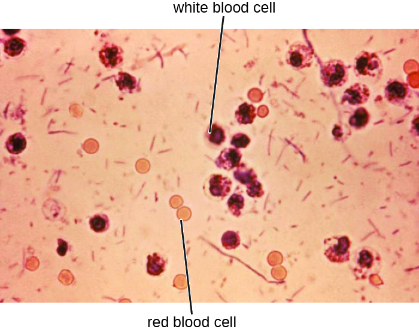

# Learning Objectives

* Identify the most common bacteria that can cause infections of the GI tract
* Compare the major characteristics of specific bacterial diseases affecting the GI tract

A wide range of gastrointestinal diseases are caused by bacterial contamination of food. Recall that **foodborne disease**{: data-type="term"} can arise from either **infection**{: data-type="term" .no-emphasis} or **intoxication**{: data-type="term" .no-emphasis}. In both cases, bacterial toxins are typically responsible for producing disease signs and symptoms. The distinction lies in where the toxins are produced. In an infection, the microbial agent is ingested, colonizes the gut, and then produces toxins that damage host cells. In an intoxication, bacteria produce toxins in the food before it is ingested. In either case, the toxins cause damage to the cells lining the gastrointestinal tract, typically the colon. This leads to the common signs and symptoms of diarrhea or watery stool and abdominal cramps, or the more severe **dysentery**{: data-type="term" .no-emphasis}. Symptoms of foodborne diseases also often include nausea and vomiting, which are mechanisms the body uses to expel the toxic materials.

Most bacterial gastrointestinal illness is short-lived and self-limiting; however, loss of fluids due to severe diarrheal illness can lead to dehydration that can, in some cases, be fatal without proper treatment. Oral rehydration therapy with electrolyte solutions is an essential aspect of treatment for most patients with GI disease, especially in children and infants.

# Staphylococcal Food Poisoning

**Staphylococcal food poisoning**{: data-type="term"} is one form of food intoxication. When ***Staphylococcus aureus***{: data-type="term" .no-emphasis} grows in food, it may produce **enterotoxins**{: data-type="term" .no-emphasis} that, when ingested, can cause symptoms such as nausea, diarrhea, cramping, and vomiting within one to six hours. In some severe cases, it may cause headache, dehydration, and changes in blood pressure and heart rate. Signs and symptoms resolve within 24 to 48 hours. *S. aureus* is often associated with a variety of raw or undercooked and cooked foods including meat (e.g., canned meat, ham, and sausages) and dairy products (e.g., cheeses, milk, and butter). It is also commonly found on hands and can be transmitted to prepared foods through poor hygiene, including poor handwashing and the use of contaminated food preparation surfaces, such as cutting boards. The greatest risk is for food left at a temperature below 60 °C (140 °F), which allows the bacteria to grow. Cooked foods should generally be reheated to at least 60 °C (140 °F) for safety and most raw meats should be cooked to even higher internal temperatures ([\[link\]](#OSC_Microbio_24_03_DangerZone)).

 "){: #OSC_Microbio_24_03_DangerZone}

There are at least 21 *Staphylococcal* enterotoxins and *Staphylococcal* enterotoxin-like toxins that can cause food intoxication. The enterotoxins are proteins that are resistant to low pH, allowing them to pass through the stomach. They are heat stable and are not destroyed by boiling at 100 °C. Even though the bacterium itself may be killed, the enterotoxins alone can cause vomiting and diarrhea, although the mechanisms are not fully understood. At least some of the symptoms may be caused by the enterotoxin functioning as a **superantigen**{: data-type="term" .no-emphasis} and provoking a strong immune response by activating T cell proliferation.

The rapid onset of signs and symptoms helps to diagnose this **foodborne illness**{: data-type="term" .no-emphasis}. Because the bacterium does not need to be present for the toxin to cause symptoms, diagnosis is confirmed by identifying the **toxin**{: data-type="term" .no-emphasis} in a food sample or in biological specimens (feces or vomitus) from the patient. Serological techniques, including ELISA, can also be used to identify the toxin in food samples.

The condition generally resolves relatively quickly, within 24 hours, without treatment. In some cases, supportive treatment in a hospital may be needed.

* How can *S. aureus* cause food intoxication?
{: data-bullet-style="bullet"}

# Shigellosis (Bacillary Dysentery)

When gastrointestinal illness is associated with the rod-shaped, gram-negative bacterium ***Shigella***{: data-type="term" .no-emphasis}, it is called **bacillary dysentery**{: data-type="term"}, or **shigellosis**{: data-type="term"}. Infections can be caused by *S. dysenteriae*, *S. flexneri*, *S. boydii*, and/or *S. sonnei* that colonize the GI tract. Shigellosis can be spread from hand to mouth or through contaminated food and water. Most commonly, it is transmitted through the fecal-oral route.

*Shigella* bacteria invade intestinal epithelial cells. When taken into a phagosome, they can escape and then live within the cytoplasm of the cell or move to adjacent cells. As the organisms multiply, the epithelium and structures with M cells of the **Peyer’s patches**{: data-type="term" .no-emphasis} in the intestine may become ulcerated and cause loss of fluid. Stomach cramps, fever, and watery diarrhea that may also contain pus, **mucus**{: data-type="term" .no-emphasis}, and/or blood often develop. More severe cases may result in ulceration of the mucosa, dehydration, and rectal bleeding. Additionally, patients may later develop **hemolytic uremic syndrome (HUS)**{: data-type="term" .no-emphasis}, a serious condition in which damaged blood cells build up in the kidneys and may cause kidney failure, or **reactive arthritis**{: data-type="term" .no-emphasis}, a condition in which arthritis develops in multiple joints following infection. Patients may also develop chronic post-infection irritable bowel syndrome (IBS).

*S. dysenteriae* type 1 is able to produce **Shiga toxin**{: data-type="term" .no-emphasis}, which targets the endothelial cells of small blood vessels in the small and large intestine by binding to a glycosphingolipid. Once inside the endothelial cells, the toxin targets the large ribosomal subunit, thus affecting protein synthesis of these cells. Hemorrhaging and lesions in the colon can result. The toxin can target the kidney’s glomerulus, the blood vessels where filtration of blood in the kidney begins, thus resulting in HUS.

Stool samples, which should be processed promptly, are analyzed using serological or molecular techniques. One common method is to perform immunoassays for *S. dysenteriae.* (Other methods that can be used to identify *Shigella* include API test strips, Enterotube systems, or PCR testing. The presence of white blood cells and blood in fecal samples occurs in about 70% of patients[1](#footnote1){: data-type="footnote-number" name="footnote-ref1"} ([\[link\]](#OSC_Microbio_24_03_Shigella)). Severe cases may require antibiotics such as **ciprofloxacin**{: data-type="term" .no-emphasis} and **azithromycin**{: data-type="term" .no-emphasis}, but these must be carefully prescribed because resistance is increasingly common.

 {: #OSC_Microbio_24_03_Shigella}

* Compare and contrast *Shigella* infections and intoxications.
{: data-bullet-style="bullet"}

# Salmonellosis

***Salmonella***{: data-type="term" .no-emphasis} gastroenteritis, also called **salmonellosis**{: data-type="term"}, is caused by the rod-shaped, gram-negative bacterium *Salmonella*. Two species, *S. enterica* and *S. bongori*, cause disease in humans, but *S. enterica* is the most common. The most common serotypes of *S. enterica* are Enteritidis and **Typhi**{: data-type="term" .no-emphasis}. We will discuss typhoid fever caused by serotypes Typhi and Paratyphi A separately. Here, we will focus on salmonellosis caused by other serotypes.

*Salmonella* is a part of the normal intestinal microbiota of many individuals. However, salmonellosis is caused by exogenous agents, and infection can occur depending on the serotype, size of the inoculum, and overall health of the host. Infection is caused by ingestion of contaminated food, handling of eggshells, or exposure to certain animals. *Salmonella* is part of poultry’s microbiota, so exposure to raw eggs and raw poultry can increase the risk of infection. Handwashing and cooking foods thoroughly greatly reduce the risk of transmission. *Salmonella* bacteria can survive freezing for extended periods but cannot survive high temperatures.

Once the bacteria are ingested, they multiply within the intestines and penetrate the epithelial mucosal cells via M cells where they continue to grow ([\[link\]](#OSC_Microbio_24_03_Salmonella)). They trigger inflammatory processes and the hypersecretion of fluids. Once inside the body, they can persist inside the phagosomes of macrophages. *Salmonella* can cross the epithelial cell membrane and enter the bloodstream and lymphatic system. Some strains of *Salmonella* also produce an **enterotoxin**{: data-type="term" .no-emphasis} that can cause an **intoxication**{: data-type="term" .no-emphasis}.

Infected individuals develop fever, nausea, abdominal cramps, vomiting, headache, and diarrhea. These signs and symptoms generally last a few days to a week. According to the Centers for Disease Control and Prevention (CDC), there are 1,000,000 cases annually, with 380 deaths each year.[2](#footnote2){: data-type="footnote-number" name="footnote-ref2"} However, because the disease is usually self-limiting, many cases are not reported to doctors and the overall incidence may be underreported. Diagnosis involves culture followed by serotyping and DNA fingerprinting if needed. Positive results are reported to the CDC. When an unusual serotype is detected, samples are sent to the CDC for further analysis. Serotyping is important for determining treatment. Oral rehydration therapy is commonly used. Antibiotics are only recommended for serious cases. When antibiotics are needed, as in immunocompromised patients, **fluoroquinolones**{: data-type="term" .no-emphasis}, third-generation **cephalosporins**{: data-type="term" .no-emphasis}, and **ampicillin**{: data-type="term" .no-emphasis} are recommended. Antibiotic resistance is a serious concern.

 "){: #OSC_Microbio_24_03_Salmonella}

# Typhoid Fever

Certain serotypes of *S. enterica*, primarily serotype **Typhi**{: data-type="term" .no-emphasis} (*S. typhi*) but also **Paratyphi**{: data-type="term" .no-emphasis}, cause a more severe type of salmonellosis called **typhoid fever**{: data-type="term"}. This serious illness, which has an untreated mortality rate of 10%, causes high fever, body aches, headache, nausea, lethargy, and a possible rash.

Some individuals carry *S. typhi* without presenting signs or symptoms (known as asymptomatic carriers) and continually shed them through their feces. These carriers often have the bacteria in the gallbladder or intestinal epithelium. Individuals consuming food or water contaminated with these feces can become infected.

*S. typhi* penetrate the intestinal mucosa, grow within the macrophages, and are transported through the body, most notably to the liver and gallbladder. Eventually, the macrophages lyse, releasing *S. typhi* into the bloodstream and lymphatic system. Mortality can result from ulceration and perforation of the intestine. A wide range of complications, such as pneumonia and jaundice, can occur with disseminated disease.

*S. typhi* have ***Salmonella* pathogenicity islands**{: data-type="term" .no-emphasis} (SPIs) that contain the genes for many of their virulence factors. Two examples of important typhoid **toxins**{: data-type="term" .no-emphasis} are the **Vi antigen**{: data-type="term" .no-emphasis}, which encodes for capsule production, and chimeric **A2B5 toxin**{: data-type="term" .no-emphasis}, which causes many of the signs and symptoms of the acute phase of typhoid fever.

Clinical examination and culture are used to make the diagnosis. The bacteria can be cultured from feces, urine, blood, or bone marrow. Serology, including ELISA, is used to identify the most pathogenic strains, but confirmation with DNA testing or culture is needed. A PCR test can also be used, but is not widely available.

The recommended antibiotic treatment involves **fluoroquinolones**{: data-type="term" .no-emphasis}, **ceftriaxone**{: data-type="term" .no-emphasis}, and **azithromycin**{: data-type="term" .no-emphasis}. Individuals must be extremely careful to avoid infecting others during treatment. Typhoid fever can be prevented through vaccination for individuals traveling to parts of the world where it is common.

* Why is serotyping particularly important in *Salmonella* infections and typhoid fever?
{: data-bullet-style="bullet"}

Typhoid Mary

Mary **Mallon**{: data-type="term" .no-emphasis} was an Irish immigrant who worked as a cook in New York in the early 20th century. Over seven years, from 1900 to 1907, Mallon worked for a number of different households, unknowingly spreading illness to the people who lived in each one. In 1906, one family hired George Soper, an expert in typhoid fever epidemics, to determine the cause of the illnesses in their household. Eventually, Soper tracked Mallon down and directly linked 22 cases of typhoid fever to her. He discovered that Mallon was a carrier for typhoid but was immune to it herself. Although active carriers had been recognized before, this was the first time that an asymptomatic carrier of infection had been identified.

Because she herself had never been ill, Mallon found it difficult to believe she could be the source of the illness. She fled from Soper and the authorities because she did not want to be quarantined or forced to give up her profession, which was relatively well paid for someone with her background. However, Mallon was eventually caught and kept in an isolation facility in the Bronx, where she remained until 1910, when the New York health department released her under the condition that she never again work with food. Unfortunately, Mallon did not comply, and she soon began working as a cook again. After new cases began to appear that resulted in the death of two individuals, the authorities tracked her down again and returned her to isolation, where she remained for 23 more years until her death in 1938. Epidemiologists were able to trace 51 cases of typhoid fever and three deaths directly to Mallon, who is unflatteringly remembered as “**Typhoid Mary**{: data-type="term" .no-emphasis}.”

The Typhoid Mary case has direct correlations in the health-care industry. Consider Kaci Hickox, an American nurse who treated Ebola patients in West Africa during the 2014 epidemic. After returning to the United States, Hickox was quarantined against her will for three days and later found not to have Ebola. Hickox vehemently opposed the quarantine. In an editorial published in the British newspaper *The Guardian*,[3](#footnote3){: data-type="footnote-number" name="footnote-ref3"} Hickox argued that quarantining asymptomatic health-care workers who had not tested positive for a disease would not only prevent such individuals from practicing their profession, but discourage others from volunteering to work in disease-ridden areas where health-care workers are desperately needed.

What is the responsibility of an individual like Mary Mallon to change her behavior to protect others? What happens when an individual believes that she is not a risk, but others believe that she is? How would you react if you were in Mallon’s shoes and were placed in a quarantine you did not believe was necessary, at the expense of your own freedom and possibly your career? Would it matter if you were definitely infected or not?

# *E. coli* Infections

The gram-negative rod ***Escherichia coli***{: data-type="term" .no-emphasis} is a common member of the normal microbiota of the colon. Although the vast majority of *E. coli* strains are helpful commensal bacteria, some can be pathogenic and may cause dangerous diarrheal disease. The pathogenic strains have additional virulence factors such as type 1 **fimbriae**{: data-type="term" .no-emphasis} that promote colonization of the colon or may produce toxins (see [Virulence Factors of Bacterial and Viral Pathogens](/m58868){: .target-chapter}). These virulence factors are acquired through **horizontal gene transfer**{: data-type="term" .no-emphasis}.

Extraintestinal disease can result if the bacteria spread from the gastrointestinal tract. Although these bacteria can be spread from person to person, they are often acquired through contaminated food or water. There are six recognized pathogenic groups of *E. coli*, but we will focus here on the four that are most commonly transmitted through food and water.

**Enterotoxigenic *E. coli* (ETEC)**{: data-type="term"}, also known as **traveler’s diarrhea**{: data-type="term"}, causes diarrheal illness and is common in less developed countries. In Mexico, ETEC infection is called Montezuma’s Revenge. Following ingestion of contaminated food or water, infected individuals develop a watery diarrhea, abdominal cramps, **malaise**{: data-type="term"} (a feeling of being unwell), and a low fever. ETEC produces a heat-stable **enterotoxin**{: data-type="term" .no-emphasis} similar to **cholera toxin**{: data-type="term" .no-emphasis}, and **adhesins**{: data-type="term" .no-emphasis} called **colonization factors**{: data-type="term" .no-emphasis} that help the bacteria to attach to the intestinal wall. Some strains of ETEC also produce heat-labile toxins. The disease is usually relatively mild and self-limiting. Diagnosis involves culturing and PCR. If needed, antibiotic treatment with **fluoroquinolones**{: data-type="term" .no-emphasis}, **doxycycline**{: data-type="term" .no-emphasis}, **rifaximin**{: data-type="term" .no-emphasis}, and **trimethoprim-sulfamethoxazole**{: data-type="term" .no-emphasis} (**TMP/SMZ**{: data-type="term" .no-emphasis}) may shorten infection duration. However, antibiotic resistance is a problem.

**Enteroinvasive *E. coli* (EIEC)**{: data-type="term"} is very similar to **shigellosis**{: data-type="term" .no-emphasis}, including its pathogenesis of intracellular invasion into intestinal epithelial tissue. This bacterium carries a large plasmid that is involved in epithelial cell penetration. The illness is usually self-limiting, with symptoms including watery diarrhea, chills, cramps, malaise, fever, and dysentery. Culturing and PCR testing can be used for diagnosis. Antibiotic treatment is not recommended, so supportive therapy is used if needed.

**Enteropathogenic *E. coli* (EPEC)**{: data-type="term"} can cause a potentially fatal diarrhea, especially in infants and those in less developed countries. Fever, vomiting, and diarrhea can lead to severe dehydration. These *E. coli* inject a protein (Tir) that attaches to the surface of the intestinal epithelial cells and triggers rearrangement of host cell actin from **microvilli**{: data-type="term" .no-emphasis} to pedestals. Tir also happens to be the receptor for **Intimin**{: data-type="term" .no-emphasis}, a surface protein produced by EPEC, thereby allowing *E. coli* to “sit” on the pedestal. The genes necessary for this pedestal formation are encoded on the locus for **enterocyte effacement**{: data-type="term" .no-emphasis} (LEE) **pathogenicity island**{: data-type="term" .no-emphasis}. As with ETEC, diagnosis involves culturing and PCR. Treatment is similar to that for ETEC.

The most dangerous strains are **enterohemorrhagic *E. coli* (EHEC)**{: data-type="term"}, which are the strains capable of causing epidemics. In particular, the strain **O157:H7**{: data-type="term" .no-emphasis} has been responsible for several recent outbreaks. Recall that the O and H refer to surface antigens that contribute to pathogenicity and trigger a host immune response (“O” refers to the O-side chain of the **lipopolysaccharide**{: data-type="term" .no-emphasis} and the “H” refers to the **flagella**{: data-type="term" .no-emphasis}). Similar to EPEC, EHEC also forms pedestals. EHEC also produces a Shiga-like toxin. Because the genome of this bacterium has been sequenced, it is known that the **Shiga toxin**{: data-type="term" .no-emphasis} genes were most likely acquired through transduction (horizontal gene transfer). The Shiga toxin genes originated from ***Shigella***{: data-type="term" .no-emphasis} *dysenteriae*. Prophage from a bacteriophage that previously infected *Shigella* integrated into the chromosome of *E. coli*. The Shiga-like toxin is often called verotoxin.

EHEC can cause disease ranging from relatively mild to life-threatening. Symptoms include bloody diarrhea with severe cramping, but no fever. Although it is often self-limiting, it can lead to hemorrhagic colitis and profuse bleeding. One possible complication is HUS. Diagnosis involves culture, often using MacConkey with sorbitol agar to differentiate between *E. coli* O157:H7, which does not ferment sorbitol, and other less virulent strains of *E. coli* that can ferment sorbitol.

Serological typing or PCR testing also can be used, as well as genetic testing for Shiga toxin. To distinguish EPEC from EHEC, because they both form pedestals on intestinal epithelial cells, it is necessary to test for genes encoding for both the Shiga-like toxin and for the LEE. Both EPEC and EHEC have LEE, but EPEC lacks the gene for Shiga toxin. Antibiotic therapy is not recommended and may worsen HUS because of the toxins released when the bacteria are killed, so supportive therapies must be used. [\[link\]](#fs-id1167662684521) summarizes the characteristics of the four most common pathogenic groups.

<table summary="Table titled: Some Pathogenic Strains of E. coli . Columns: Group; Virulence Factors and Genes; Signs and Symptoms; Diagnostic Tests; Treatment. Enterotoxigenic E. coli (ETEC); Heat stable enterotoxin similar to cholera toxin; Relatively mild, watery diarrhea; Culturing, PCR; Self-limiting; if needed, fluoroquinolones, doxycycline, rifaximin, TMP/SMZ; antibiotic resistance is a problem. Enteroinvasive E. coli (EIEC); Inv (invasive plasmid) genes; Relatively mild, watery diarrhea; dysentery or inflammatory colitis may occur; Culturing, PCR; testing for inv gene; additional assays to distinguish from Shigella; Supportive therapy only; antibiotics not recommended. Enteropathogenic E. coli (EPEC); Locus of enterocyte effacement (LEE); pathogenicity island; Severe fever, vomiting, nonbloody diarrhea, dehydration; potentially fatal; Culturing, PCR; detection of LEE lacking Shiga-like toxin genes; Self-limiting; if needed, fluoroquinolones, doxycycline, rifaximin (TMP/SMZ); antibiotic resistance is a problem. Enterohemorrhagic E. coli (EHEC); Verotoxin; May be mild or very severe; bloody diarrhea; may result in HUS; Culturing; plate on MacConkey agar with sorbitol agar as it does not ferment sorbitol; PCR detection of LEE containing Shiga-like toxin genes; Antibiotics are not recommended due to the risk of HUS." class="span-all"><thead>
<tr>
<th colspan="5" data-align="center">Some Pathogenic Groups of <em>E. col</em><em>i</em></th>
</tr>
<tr valign="top">
<th data-valign="top" data-align="center">Group</th>
<th data-valign="top" data-align="center">Virulence Factors and Genes</th>
<th data-valign="top" data-align="center">Signs and Symptoms</th>
<th data-valign="top" data-align="center">Diagnostic Tests</th>
<th data-valign="top" data-align="center">Treatment</th>
</tr>
</thead><tbody>
<tr valign="top">
<td data-valign="top" data-align="left">Enterotoxigenic <em>E. coli</em> (ETEC)</td>
<td data-valign="top" data-align="left">Heat stable enterotoxin similar to cholera toxin</td>
<td data-valign="top" data-align="left">Relatively mild, watery diarrhea</td>
<td data-valign="top" data-align="left">Culturing, PCR</td>
<td data-valign="top" data-align="left">Self-limiting; if needed, fluoroquinolones, doxycycline, rifaximin, TMP/SMZ; antibiotic resistance is a problem</td>
</tr>
<tr valign="top">
<td data-valign="top" data-align="left">Enteroinvasive <em>E. coli</em> (EIEC)</td>
<td data-valign="top" data-align="left"><em>Inv</em> (invasive plasmid) genes</td>
<td data-valign="top" data-align="left">Relatively mild, watery diarrhea; dysentery or inflammatory colitis may occur</td>
<td data-valign="top" data-align="left">Culturing, PCR; testing for <em>inv</em> gene; additional assays to distinguish from <em>Shigella</em></td>
<td data-valign="top" data-align="left">Supportive therapy only; antibiotics not recommended</td>
</tr>
<tr valign="top">
<td data-valign="top" data-align="left">Enteropathogenic <em>E. coli</em> (EPEC)</td>
<td data-valign="top" data-align="left">Locus of enterocyte effacement (LEE) pathogenicity island</td>
<td data-valign="top" data-align="left">Severe fever, vomiting, nonbloody diarrhea, dehydration; potentially fatal</td>
<td data-valign="top" data-align="left">Culturing, PCR; detection of LEE lacking Shiga-like toxin genes</td>
<td data-valign="top" data-align="left">Self-limiting; if needed, fluoroquinolones, doxycycline, rifaximin (TMP/SMZ); antibiotic resistance is a problem</td>
</tr>
<tr valign="top">
<td data-valign="top" data-align="left">Enterohemorrhagic <em>E. coli</em> (EHEC)</td>
<td data-valign="top" data-align="left">Verotoxin</td>
<td data-valign="top" data-align="left">May be mild or very severe; bloody diarrhea; may result in HUS</td>
<td data-valign="top" data-align="left">Culturing; plate on MacConkey agar with sorbitol agar as it does not ferment sorbitol; PCR detection of LEE containing Shiga-like toxin genes</td>
<td data-valign="top" data-align="left">Antibiotics are not recommended due to the risk of HUS</td>
</tr>
</tbody></table>

* Compare and contrast the virulence factors and signs and symptoms of infections with the four main *E. coli* groups.
{: data-bullet-style="bullet"}

# Cholera and Other Vibrios

The gastrointestinal disease **cholera**{: data-type="term"} is a serious infection often associated with poor sanitation, especially following natural disasters, because it is spread through contaminated water and food that has not been heated to temperatures high enough to kill the bacteria. It is caused by ***Vibrio cholerae***{: data-type="term" .no-emphasis} serotype O1, a gram-negative, flagellated bacterium in the shape of a curved rod (vibrio). According to the CDC, cholera causes an estimated 3 to 5 million cases and 100,000 deaths each year.[4](#footnote4){: data-type="footnote-number" name="footnote-ref4"}

Because *V. cholerae* is killed by stomach acid, relatively large doses are needed for a few microbial cells to survive to reach the intestines and cause infection. The motile cells travel through the mucous layer of the intestines, where they attach to epithelial cells and release **cholera enterotoxin**{: data-type="term" .no-emphasis}. The toxin is an A-B toxin with activity through adenylate cyclase (see [Virulence Factors of Bacterial and Viral Pathogens](/m58868){: .target-chapter}). Within the intestinal cell, cyclic AMP (cAMP) levels increase, which activates a chloride channel and results in the release of ions into the intestinal lumen. This increase in osmotic pressure in the lumen leads to water also entering the lumen. As the water and electrolytes leave the body, it causes rapid dehydration and electrolyte imbalance. Diarrhea is so profuse that it is often called “rice water stool,” and patients are placed on cots with a hole in them to monitor the fluid loss ([\[link\]](#OSC_Microbio_24_03_VibrioChol)).

Cholera is diagnosed by taking a stool sample and culturing for *Vibrio*. The bacteria are oxidase positive and show non-lactose fermentation on MacConkey agar. Gram-negative lactose fermenters will produce red colonies while non-fermenters will produce white/colorless colonies. Gram-positive bacteria will not grow on MacConkey. Lactose fermentation is commonly used for pathogen identification because the normal microbiota generally ferments lactose while pathogens do not. *V. cholerae* may also be cultured on thiosulfate citrate bile salts sucrose (TCBS) agar, a selective and differential media for *Vibrio* spp., which produce a distinct yellow colony.

Cholera may be self-limiting and treatment involves rehydration and electrolyte replenishment. Although antibiotics are not typically needed, they can be used for severe or disseminated disease. Tetracyclines are recommended, but **doxycycline**{: data-type="term" .no-emphasis}, **erythromycin**{: data-type="term" .no-emphasis}, **orfloxacin**{: data-type="term" .no-emphasis}, **ciprofloxacin**{: data-type="term" .no-emphasis}, and **TMP/SMZ**{: data-type="term" .no-emphasis} may be used. Recent evidence suggests that **azithromycin**{: data-type="term" .no-emphasis} is also a good first-line antibiotic. Good sanitation—including appropriate sewage treatment, clean supplies for cooking, and purified drinking water—is important to prevent infection ([\[link\]](#OSC_Microbio_24_03_VibrioChol))

  Outbreaks of cholera often occur in areas with poor sanitation or after natural disasters that compromise sanitation infrastructure. (b) At a cholera treatment center in Haiti, patients are receiving intravenous fluids to combat the dehydrating effects of this disease. They often lie on a cot with a hole in it and a bucket underneath to allow for monitoring of fluid loss. (c) This scanning electron micrograph shows Vibrio cholera. (credit a, b: modification of work by Centers for Disease Control and Prevention; credit c: modification of work by Janice Carr, Centers for Disease Control and Prevention)"){: #OSC_Microbio_24_03_VibrioChol}

*V. cholera* is not the only ***Vibrio***{: data-type="term" .no-emphasis} species that can cause disease. *V. parahemolyticus* is associated with consumption of contaminated seafood and causes gastrointestinal illness with signs and symptoms such as watery diarrhea, nausea, fever, chills, and abdominal cramps. The bacteria produce a heat-stable **hemolysin**{: data-type="term" .no-emphasis}, leading to dysentery and possible disseminated disease. It also sometimes causes wound infections. *V. parahemolyticus* is diagnosed using cultures from blood, stool, or a wound. As with *V. cholera*, selective medium (especially TCBS agar) works well. Tetracycline and **ciprofloxacin**{: data-type="term" .no-emphasis} can be used to treat severe cases, but antibiotics generally are not needed.

*Vibrio vulnificus* is found in warm seawater and, unlike *V. cholerae*, is not associated with poor sanitary conditions. The bacteria can be found in raw seafood, and ingestion causes gastrointestinal illness. It can also be acquired by individuals with open skin wounds who are exposed to water with high concentrations of the pathogen. In some cases, the infection spreads to the bloodstream and causes septicemia. Skin infection can lead to edema, ecchymosis (discoloration of skin due to bleeding), and abscesses. Patients with underlying disease have a high fatality rate of about 50%. It is of particular concern for individuals with chronic liver disease or who are otherwise immunodeficient because a healthy immune system can often prevent infection from developing. *V. vulnificus* is diagnosed by culturing for the pathogen from stool samples, blood samples, or skin abscesses. Adult patients are treated with **doxycycline**{: data-type="term" .no-emphasis} combined with a third generation **cephalosporin**{: data-type="term" .no-emphasis} or with **fluoroquinolones**{: data-type="term" .no-emphasis}, and children are treated with **TMP/SMZ**{: data-type="term" .no-emphasis}.

Two other vibrios, ***Aeromonas hydrophila***{: data-type="term" .no-emphasis} and ***Plesiomonas shigelloides***{: data-type="term" .no-emphasis}, are also associated with marine environments and raw seafood; they can also cause gastroenteritis. Like *V. vulnificus*, *A. hydrophila* is more often associated with infections in wounds, generally those acquired in water. In some cases, it can also cause septicemia. Other species of *Aeromonas* can cause illness. *P. shigelloides* is sometimes associated with more serious systemic infections if ingested in contaminated food or water. Culture can be used to diagnose *A. hydrophila* and *P. shigelloides* infections, for which antibiotic therapy is generally not needed. When necessary, **tetracycline**{: data-type="term" .no-emphasis} and **ciprofloxacin**{: data-type="term" .no-emphasis}, among other antibiotics, may be used for treatment of *A. hydrophila*, and **fluoroquinolones**{: data-type="term" .no-emphasis} and **trimethoprim**{: data-type="term" .no-emphasis} are the effective treatments for *P. shigelloides*.

* How does *V. cholera* infection cause rapid dehydration?
{: data-bullet-style="bullet"}

# *Campylobacter jejuni* Gastroenteritis

***Campylobacter***{: data-type="term" .no-emphasis} is a genus of gram-negative, spiral or curved bacteria. They may have one or two flagella. ***Campylobacter jejuni* gastroenteritis**{: data-type="term"}, a form of **campylobacteriosis**{: data-type="term" .no-emphasis}, is a widespread illness that is caused by *Campylobacter jejuni*. The primary route of transmission is through poultry that becomes contaminated during slaughter. Handling of the raw chicken in turn contaminates cooking surfaces, utensils, and other foods. Unpasteurized milk or contaminated water are also potential vehicles of transmission. In most cases, the illness is self-limiting and includes fever, diarrhea, cramps, vomiting, and sometimes **dysentery**{: data-type="term" .no-emphasis}. More serious signs and symptoms, such as bacteremia, meningitis, pancreatitis, cholecystitis, and hepatitis, sometimes occur. It has also been associated with autoimmune conditions such as **Guillain-Barré syndrome**{: data-type="term" .no-emphasis}, a neurological disease that occurs after some infections and results in temporary paralysis. **HUS**{: data-type="term" .no-emphasis} following infection can also occur. The virulence in many strains is the result of hemolysin production and the presence of *Campylobacter* **cytolethal distending toxin**{: data-type="term" .no-emphasis} (CDT), a powerful deoxyribonuclease (DNase) that irreversibly damages host cell DNA.

Diagnosis involves culture under special conditions, such as elevated temperature, low oxygen tension, and often medium supplemented with antimicrobial agents. These bacteria should be cultured on selective medium (such as Campy CV, charcoal selective medium, or cefaperazone charcoal deoxycholate agar) and incubated under microaerophilic conditions for at least 72 hours at 42 °C. Antibiotic treatment is not usually needed, but **erythromycin**{: data-type="term" .no-emphasis} or **ciprofloxacin**{: data-type="term" .no-emphasis} may be used.

# Peptic Ulcers

The gram-negative bacterium ***Helicobacter pylori***{: data-type="term" .no-emphasis} is able to tolerate the acidic environment of the human stomach and has been shown to be a major cause of **peptic ulcers**{: data-type="term"}, which are ulcers of the stomach or duodenum. The bacterium is also associated with increased risk of stomach cancer ([\[link\]](#OSC_Microbio_24_03_Ulcers)). According to the CDC, approximately two-thirds of the population is infected with *H. pylori,* but less than 20% have a risk of developing ulcers or stomach cancer. *H. pylori* is found in approximately 80% of stomach ulcers and in over 90% of duodenal ulcers.[5](#footnote5){: data-type="footnote-number" name="footnote-ref5"}

*H. pylori* colonizes epithelial cells in the stomach using pili for adhesion. These bacteria produce **urease**{: data-type="term" .no-emphasis}, which stimulates an immune response and creates ammonia that neutralizes stomach acids to provide a more hospitable microenvironment. The infection damages the cells of the stomach lining, including those that normally produce the protective mucus that serves as a barrier between the tissue and stomach acid. As a result, inflammation (**gastritis**{: data-type="term" .no-emphasis}) occurs and ulcers may slowly develop. Ulcer formation can also be caused by toxin activity. It has been reported that 50% of clinical isolates of *H. pylori* have detectable levels of exotoxin activity *in vitro*.[6](#footnote6){: data-type="footnote-number" name="footnote-ref6"} This **toxin**{: data-type="term" .no-emphasis}, VacA, induces vacuole formation in host cells. VacA has no primary sequence homology with other bacterial toxins, and in a mouse model, there is a correlation between the presence of the toxin gene, the activity of the toxin, and gastric epithelial tissue damage.

Signs and symptoms include nausea, lack of appetite, bloating, burping, and weight loss. Bleeding ulcers may produce dark stools. If no treatment is provided, the ulcers can become deeper, more tissues can be involved, and stomach perforation can occur. Because perforation allows digestive enzymes and acid to leak into the body, it is a very serious condition.

 "){: #OSC_Microbio_24_03_Ulcers}

To diagnose *H. pylori* infection, multiple methods are available. In a breath test, the patient swallows radiolabeled urea. If *H. pylori* is present, the bacteria will produce **urease**{: data-type="term" .no-emphasis} to break down the urea. This reaction produces radiolabeled carbon dioxide that can be detected in the patient’s breath. Blood testing can also be used to detect antibodies to *H. pylori*. The bacteria themselves can be detected using either a stool test or a stomach wall biopsy.

Antibiotics can be used to treat the infection. However, unique to *H. pylori,* the recommendation from the US Food and Drug Administration is to use a triple therapy. The current protocols are 10 days of treatment with **omeprazole**{: data-type="term" .no-emphasis}, **amoxicillin**{: data-type="term" .no-emphasis}, and **clarithromycin**{: data-type="term" .no-emphasis} (OAC); 14 days of treatment with **bismuth subsalicylate**{: data-type="term" .no-emphasis}, **metronidazole**{: data-type="term" .no-emphasis}, and **tetracycline**{: data-type="term" .no-emphasis} (BMT); or 10 or 14 days of treatment with **lansoprazole**{: data-type="term" .no-emphasis}, **amoxicillin**{: data-type="term" .no-emphasis}, and **clarithromycin**{: data-type="term" .no-emphasis} (LAC). Omeprazole, bismuth subsalicylate, and lansoprazole are not antibiotics but are instead used to decrease acid levels because *H. pylori* prefers acidic environments.

Although treatment is often valuable, there are also risks to *H. pylori* eradication. Infection with *H. pylori* may actually protect against some cancers, such as esophageal adenocarcinoma and gastroesophageal reflux disease.[7](#footnote7){: data-type="footnote-number" name="footnote-ref7"}[8](#footnote8){: data-type="footnote-number" name="footnote-ref8"}

* How does *H. pylori* cause peptic ulcers?
{: data-bullet-style="bullet"}

# *Clostridium perfringens* Gastroenteritis

***Clostridium perfringens* gastroenteritis**{: data-type="term"} is a generally mild foodborne disease that is associated with undercooked meats and other foods. *C. perfringens* is a gram-positive, rod-shaped, endospore-forming anaerobic bacterium that is tolerant of high and low temperatures. At high temperatures, the bacteria can form endospores that will germinate rapidly in foods or within the intestine. Food poisoning by type A strains is common. This strain always produces an **enterotoxin**{: data-type="term" .no-emphasis}, sometimes also present in other strains, that causes the clinical symptoms of cramps and diarrhea. A more severe form of the illness, called **pig-bel**{: data-type="term" .no-emphasis} or **enteritis necroticans**{: data-type="term" .no-emphasis}, causes hemorrhaging, pain, vomiting, and bloating. Gangrene of the intestines may result. This form has a high mortality rate but is rare in the United States.

Diagnosis involves detecting the *C. perfringens* toxin in stool samples using either molecular biology techniques (PCR detection of the toxin gene) or immunology techniques (ELISA). The bacteria itself may also be detected in foods or in fecal samples. Treatment includes rehydration therapy, electrolyte replacement, and intravenous fluids. Antibiotics are not recommended because they can damage the balance of the microbiota in the gut, and there are concerns about antibiotic resistance. The illness can be prevented through proper handling and cooking of foods, including prompt refrigeration at sufficiently low temperatures and cooking food to a sufficiently high temperature.

# *Clostridium difficile*

***Clostridium difficile***{: data-type="term" .no-emphasis} is a gram-positive rod that can be a commensal bacterium as part of the normal microbiota of healthy individuals. When the normal microbiota is disrupted by long-term antibiotic use, it can allow the overgrowth of this bacterium, resulting in **antibiotic-associated diarrhea**{: data-type="term"} caused by ***C. difficile***{: data-type="term" .no-emphasis}. Antibiotic-associated diarrhea can also be considered a **nosocomial disease**{: data-type="term" .no-emphasis}. Patients at the greatest risk of *C. difficile* infection are those who are immunocompromised, have been in health-care settings for extended periods, are older, have recently taken antibiotics, have had gastrointestinal procedures done, or use proton pump inhibitors, which reduce stomach acidity and allow proliferation of *C. difficile*. Because this species can form **endospores**{: data-type="term" .no-emphasis}, it can survive for extended periods of time in the environment under harsh conditions and is a considerable concern in health-care settings.

This bacterium produces two toxins, ***Clostridium difficile* toxin A**{: data-type="term" .no-emphasis} (TcdA) and ***Clostridium difficile* toxin B**{: data-type="term" .no-emphasis} (TcdB). These toxins inactivate small GTP-binding proteins, resulting in actin condensation and cell rounding, followed by cell death. Infections begin with focal necrosis, then ulceration with exudate, and can progress to **pseudomembranous colitis**{: data-type="term"}, which involves inflammation of the colon and the development of a pseudomembrane of fibrin containing dead epithelial cells and leukocytes ([\[link\]](#OSC_Microbio_24_03_pseudocoli)). Watery diarrhea, dehydration, fever, loss of appetite, and abdominal pain can result. Perforation of the colon can occur, leading to septicemia, shock, and death. *C. difficile* is also associated with **necrotizing enterocolitis**{: data-type="term" .no-emphasis} in premature babies and **neutropenic enterocolitis**{: data-type="term" .no-emphasis} associated with cancer therapies.

 ![A diagram showing the lining of the stomach. At the very bottom is a blood vessel with red blood cells, neutrophils, and monocytes. At the top is a wavy layer of epithelial cells covered in mucous. A variety of bacteria (different shapes and colors to indicate different species) are seen on the mucus. In one region is a cluster of rod shaped cells labeled Clostridium difficile that release small dots labeled TcdA and TcdB. These create a pseudomembrane that is a swelling above destroyed epithelial cells. In response neutrophils and monocytes released.](../resources/OSC_Microbio_24_03_pseudocoli.jpg "Clostridium difficile is able to colonize the mucous membrane of the colon when the normal microbiota is disrupted. The toxins TcdA and TcdB trigger an immune response, with neutrophils and monocytes migrating from the bloodstream to the site of infection. Over time, inflammation and dead cells contribute to the development of a pseudomembrane. (credit micrograph: modification of work by Janice Carr, Centers for Disease Control and Prevention)"){: #OSC_Microbio_24_03_pseudocoli}

Diagnosis is made by considering the patient history (such as exposure to antibiotics), clinical presentation, imaging, endoscopy, lab tests, and other available data. Detecting the **toxin**{: data-type="term" .no-emphasis} in stool samples is used to confirm diagnosis. Although culture is preferred, it is rarely practical in clinical practice because the bacterium is an obligate anaerobe. Nucleic acid amplification tests, including PCR, are considered preferable to ELISA testing for molecular analysis.

The first step of conventional treatment is to stop antibiotic use, and then to provide supportive therapy with electrolyte replacement and fluids. Metronidazole is the preferred treatment if the ***C. difficile***{: data-type="term" .no-emphasis} diagnosis has been confirmed. **Vancomycin**{: data-type="term" .no-emphasis} can also be used, but it should be reserved for patients for whom metronidazole was ineffective or who meet other criteria (e.g., under 10 years of age, pregnant, or allergic to metronidazole).

A newer approach to treatment, known as a **fecal transplant**{: data-type="term" .no-emphasis}, focuses on restoring the microbiota of the gut in order to combat the infection. In this procedure, a healthy individual donates a stool sample, which is mixed with saline and transplanted to the recipient via colonoscopy, endoscopy, sigmoidoscopy, or enema. It has been reported that this procedure has greater than 90% success in resolving *C. difficile* infections.[9](#footnote9){: data-type="footnote-number" name="footnote-ref9"}

* How does antibiotic use lead to *C. difficile* infections?
{: data-bullet-style="bullet"}

# Foodborne Illness Due to *Bacillus cereus*

***Bacillus cereus***{: data-type="term" .no-emphasis}, commonly found in soil, is a gram-positive endospore-forming bacterium that can sometimes cause foodborne illness. *B. cereus* endospores can survive cooking and produce **enterotoxins**{: data-type="term" .no-emphasis} in food after it has been heated; illnesses often occur after eating rice and other prepared foods left at room temperature for too long. The signs and symptoms appear within a few hours of ingestion and include nausea, pain, and abdominal cramps. *B. cereus* produces two toxins: one causing diarrhea, and the other causing vomiting. More severe signs and symptoms can sometimes develop.

Diagnosis can be accomplished by isolating bacteria from stool samples or vomitus and uneaten infected food. Treatment involves rehydration and supportive therapy. Antibiotics are not typically needed, as the illness is usually relatively mild and is due to toxin activity.

# Foodborne Illness Due to *Yersinia*

The genus ***Yersinia***{: data-type="term" .no-emphasis} is best known for *Yersinia pestis*, a gram-negative rod that causes the plague. However, *Y. enterocolitica* and *Y. pseudotuberculosis* can cause **gastroenteritis**{: data-type="term" .no-emphasis}. The infection is generally transmitted through the fecal-oral route, with ingestion of food or water that has been contaminated by feces. Intoxication can also result because of the activity of its **endotoxin**{: data-type="term" .no-emphasis} and **exotoxins**{: data-type="term" .no-emphasis} (**enterotoxin**{: data-type="term" .no-emphasis} and **cytotoxin necrotizing factor**{: data-type="term" .no-emphasis}). The illness is normally relatively mild and self-limiting. However, severe diarrhea and dysentery can develop in infants. In adults, the infection can spread and cause complications such as reactive arthritis, thyroid disorders, endocarditis, glomerulonephritis, eye inflammation, and/or erythema nodosum. Bacteremia may develop in rare cases.

Diagnosis is generally made by detecting the bacteria in stool samples. Samples may also be obtained from other tissues or body fluids. Treatment is usually supportive, including rehydration, without antibiotics. If bacteremia or other systemic disease is present, then antibiotics such as **fluoroquinolones**{: data-type="term" .no-emphasis}, **aminoglycosides**{: data-type="term" .no-emphasis}, **doxycycline**{: data-type="term" .no-emphasis}, and **trimethoprim-sulfamethoxazole**{: data-type="term" .no-emphasis} may be used. Recovery can take up to two weeks.

* Compare and contrast foodborne illnesses due to *B. cereus* and *Yersinia*.
{: data-bullet-style="bullet"}

Bacterial Infections of the Gastrointestinal Tract

Bacterial infections of the gastrointestinal tract generally occur when bacteria or bacterial **toxins**{: data-type="term" .no-emphasis} are ingested in contaminated food or water. Toxins and other virulence factors can produce gastrointestinal inflammation and general symptoms such as diarrhea and vomiting. Bacterial GI infections can vary widely in terms of severity and treatment. Some can be treated with antibiotics, but in other cases antibiotics may be ineffective in combating toxins or even counterproductive if they compromise the GI microbiota. [\[link\]](#OSC_Microbio_24_03_DisproTbl1) and [\[link\]](#OSC_Microbio_24_03_DisProTbl2) the key features of common bacterial GI infections.

![Table titled: Bacterial Infections of the GI Tract. Columns: Disease, Pathogen, Signs and Symptoms, Transmission, Diagnostic Tests, Antimicrobial Drugs. Bacillus cereus infection, Bacillus cereus; Nausea, pain, abdominal cramps, diarrhea or vomiting ; Ingestion of contaminated rice or meat, even after cooking; Testing stool sample, vomitus, or uneaten food for presence of bacteria; None. Campylobacter jejuni gastroenteritis; Campylobacter jejuni; Fever, diarrhea, cramps, vomiting, and sometimes dysentery; sometimes more severe organ or autoimmune effects; Ingestion of unpasteurized milk, undercooked chicken, or contaminated water; Culture on selective medium with elevated temperature and low oxygen concentration; Generally none; erythromycin or ciprofloxacin if necessary. Cholera; Vibrio cholera; Severe diarrhea and fluid loss, potentially leading to shock, renal failure, and death; Ingestion of contaminated water or food; Culture on selective medium (TCBS agar); distinguished as oxidase positive with fermentative metabolisms; Generally none; tetracyclines, azithromycin, others if necessary. Clostridium difficile infection; Clostridium difficile; Pseudomembranous colitis, watery diarrhea, fever, abdominal pain, loss of appetite, dehydration; in severe cases, perforation of the colon, septicemia, shock, and death; Overgrowth of C. difficile in the normal microbiota due to antibiotic use; hospital-acquired infections in immunocompromised patients; Detection of toxin in stool, nucleic acid amplification tests (e.g., PCR); Discontinuation of previous antibiotic treatment; metronidazole or vancomycin. Clostridium perfringens gastroenteritis; Clostridium perfringens (especially type A); Mild cramps and diarrhea in most cases; in rare cases, hemorrhaging, vomiting, intestinal gangrene, and death; Ingestion of undercooked meats containing C. perfringens endospores; Detection of toxin or bacteria in stool or uneaten food; None. E. coli infection; ETEC, EPEC, EIEC, EHEC ; Watery diarrhea, dysentery, cramps, malaise, fever, chills, dehydration; in EHEC, possible severe complications such as hematolytic uremic syndrome; Ingestion of contaminated food or water; Tissue culture, immunochemical assays, PCR, gene probes; Not recommended for EIEC and EHEC; fluoroquinolones, doxycycline, rifaximin, and TMP/SMZ possible for ETEC and EPEC.](../resources/OSC_Microbio_24_03_DisProTbl1.jpg){: #OSC_Microbio_24_03_DisproTbl1}

![Table Titled: Bacterial Infections of the GI Tract (continued). Columns: Disease, Pathogen, Signs and Symptoms, Transmission, Diagnostic Tests, Antimicrobial Drugs. Peptic ulcers; Helicobacter pylori; Nausea, bloating, burping, lack of appetite, weight loss, perforation of stomach, blood in stools ; Normal flora, can also be acquired via saliva, Fecal-oral route via contaminated food and water; Breath test, detection of antibodies in blood, detection of bacteria in stool sample or stomach biopsy; Amoxicillin, clarithromycin metronidazole, tetracycline, lansoprazole; antacids may also be given in combination with antibiotics. Salmonellosis; Salmonella enterica, serotype Enteritides; Fever, nausea, vomiting, abdominal cramps, headache, diarrhea; can be fatal in infants; Ingestion of contaminated food, handling of eggshells or contaminated animals Culturing, serotyping and DNA fingerprinting ; Not generally recommended; fluoroquinolones, ampicillin, others for immunocompromised patients. Shigella dysentery; Shigella dysenteriae, S. flexneri, S. boydii, and S. sonnei; Abdominal cramps, fever, diarrhea, dysentery; possible complications: reactive arthritis and hemolytic uremic syndrome; Fecal-oral route via contaminated food and water; Testing of stool samples for presence of blood and leukocytes; culturing, PCR, immunoassay for S. dysenteriae; Ciprofloxacin, azithromycin. Staphylococcal food poisoning; Staphylococcus aureus; Rapid-onset nausea, diarrhea, vomiting lasting 24&#x2013;48 hours; possible dehydration and change in blood pressure and heart rate;Ingestion of raw or undercooked meat or dairy products contaminated with staphylococcal enterotoxins; ELISA to detect enterotoxins in uneaten food, stool, or vomitus ; None. Typhoid fever; S. enterica, subtypes Typhi or Paratyphi Aches, headaches, nausea, lethargy, diarrhea or constipation, possible rash; lethal perforation of intestine can occur Fecal-oral route; may be spread by asymptomatic carriers; Culture of blood, stool, or bone marrow, serologic tests; PCR tests when available; Fluoroquinolones, ceftriaxone, azithromycin; preventive vaccine available.  Yersinia infection; Yersinia enterocolitica, Y. pseudotuberculosis; Generally mild diarrhea and abdominal cramps; in some cases, bacteremia can occur, leading to severe complications; Fecal-oral route, typically via contaminated food or water Testing stool samples, tissues, body fluids; Generally none; fluoroquinolones, aminoglycosides, others for systemic infections.](../resources/OSC_Microbio_24_03_DisProTbl2.jpg){: #OSC_Microbio_24_03_DisProTbl2}

Part 2

At the hospital, Carli’s doctor began to think about possible causes of her severe gastrointestinal distress. One possibility was food poisoning, but no one else in her family was sick. The doctor asked about what Carli had eaten the previous day; her mother mentioned that she’d had eggs for lunch, and that they may have been a little undercooked. The doctor took a sample of Carli’s stool and sent it for laboratory testing as part of her workup. She suspected that Carli could have a case of bacterial or viral gastroenteritis, but she needed to know the cause in order to prescribe an appropriate treatment.

In the laboratory, technicians microscopically identified gram-negative bacilli in Carli’s stool sample. They also established a pure culture of the bacteria and analyzed it for antigens. This testing showed that the causative agent was *Salmonella*.

* What should the doctor do now to treat Carli?
{: data-bullet-style="bullet"}

*Jump to the [next](/m58932#fs-id1167661274425) Clinical Focus box. Go back to the [previous](/m58924#fs-id1167663610173) Clinical Focus box.*

# Key Concepts and Summary

* Major causes of gastrointestinal illness include *Salmonella* spp., *Staphylococcus* spp., *Helicobacter pylori*, *Clostridium perfringens*, *Clostridium difficile*, *Bacillus cereus*, and *Yersinia* bacteria.
* *C. difficile* is an important cause of hospital acquired infection.
* *Vibrio cholerae* causes **cholera**, which can be a severe diarrheal illness.
* Different strains of *E. coli*, including **ETEC**, **EPEC**, **EIEC**, and **EHEC**, cause different illnesses with varying degrees of severity.
* *H. pylori* is associated with **peptic ulcers**.
* *Salmonella enterica* serotypes can cause **typhoid fever**, a more severe illness than **salmonellosis**.
* Rehydration and other supportive therapies are often used as general treatments.
* Careful antibiotic use is required to reduce the risk of causing *C. difficile* infections and when treating antibiotic-resistant infections.
{: data-bullet-style="bullet"}

# Multiple Choice

Which type of *E. coli* infection can be severe with life-threatening consequences such as hemolytic uremic syndrome?

1.  ETEC
2.  EPEC
3.  EHEC
4.  EIEC
{: data-number-style="lower-alpha"}

C

Which species of *Shigella* has a type that produces Shiga toxin?

1.  *S. boydii*
2.  *S. flexneri*
3.  *S. dysenteriae*
4.  *S. sonnei*
{: data-number-style="lower-alpha"}

C

Which type of bacterium produces an A-B toxin?

1.  *Salmonella*
2.  *Vibrio cholera*
3.  ETEC
4.  *Shigella dysenteriae*
{: data-number-style="lower-alpha"}

B

# Fill in the Blank

Antibiotic associated pseudomembranous colitis is caused by \_\_\_\_\_\_\_\_\_.

*Clostridium difficile*

# Critical Thinking

Why does use of antibiotics and/or proton pump inhibitors contribute to the development of *C. difficile* infections?

Why did scientists initially think it was unlikely that a bacterium caused peptic ulcers?

Does it makes a difference in treatment to know if a particular illness is caused by a bacterium (an infection) or a toxin (an intoxication)?

## Footnotes
{: data-type="footnote-title"}

1.  [1](#footnote-ref1){: data-type="footnote-ref" name="footnote1"} Jaya Sureshbabu. “Shigella Infection Workup.” *Medscape*. Updated Jun 28, 2016. http://emedicine.medscape.com/article/968773-workup.
2.  [2](#footnote-ref2){: data-type="footnote-ref" name="footnote2"} Centers for Disease Control and Prevention. *Salmonella*. Updated August 25, 2016. https://www.cdc.gov/salmonella.
3.  [3](#footnote-ref3){: data-type="footnote-ref" name="footnote3"} Kaci Hickox. “Stop Calling Me the ‘Ebola Nurse.’” *The Guardian.* November 17, 2014. http://www.theguardian.com/commentisfree/2014/nov/17/stop-calling-me-ebola-nurse-kaci-hickox.
4.  [4](#footnote-ref4){: data-type="footnote-ref" name="footnote4"} Centers for Disease Control and Prevention. *Cholera—Vibrio cholerae Infection*. Updated November 6, 2014. http://www.cdc.gov/cholera/general. Accessed Sept 14, 2016.
5.  [5](#footnote-ref5){: data-type="footnote-ref" name="footnote5"} Centers for Disease Control and Prevention. “*Helicobacter pylori*\: Fact Sheet for Health Care Providers.” Updated July 1998. http://www.cdc.gov/ulcer/files/hpfacts.pdf.
6.  [6](#footnote-ref6){: data-type="footnote-ref" name="footnote6"} T. L. Cover. “The Vacuolating Cytotoxin of *Helicobacter pylori*.” *Molecular Microbiology* 20 (1996) 2: pp. 241–246. http://www.ncbi.nlm.nih.gov/pubmed/8733223.
7.  [7](#footnote-ref7){: data-type="footnote-ref" name="footnote7"} Martin J. Blaser. “Disappearing Microbiota: *Helicobacter pylori* Protection against Esophageal Adenocarcinoma.” *Cancer Prevention Research* 1 (2008) 5: pp. 308–311. http://cancerpreventionresearch.aacrjournals.org/content/1/5/308.full.pdf+html.
8.  [8](#footnote-ref8){: data-type="footnote-ref" name="footnote8"} Ivan F. N. Hung and Benjamin C. Y. Wong. “Assessing the Risks and Benefits of Treating *Helicobacter pylori* Infection.” *Therapeutic Advances in Gastroenterology* 2 (2009) 3: pp, 141–147. doi: 10.1177/1756283X08100279.
9.  [9](#footnote-ref9){: data-type="footnote-ref" name="footnote9"} Faith Rohlke and Neil Stollman. “Fecal Microbiota Transplantation in Relapsing *Clostridium difficile* Infection,” *Therapeutic Advances in Gastroenterology* 5 (2012) 6: 403–420. doi: 10.1177/1756283X12453637.

