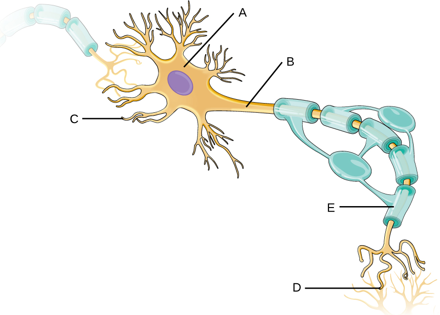

### Learning Objectives

* Describe the major anatomical features of the nervous system
* Explain why there is no normal microbiota of the nervous system
* Explain how microorganisms overcome defenses of the nervous system to cause infection
* Identify and describe general symptoms associated with various infections of the nervous system

Part 1

David is a 35-year-old carpenter from New Jersey. A year ago, he was diagnosed with Crohn’s disease, a chronic inflammatory bowel disease that has no known cause. He has been taking a prescription corticosteroid to manage the condition, and the drug has been highly effective in keeping his symptoms at bay. However, David recently fell ill and decided to visit his primary care physician. His symptoms included a fever, a persistent cough, and shortness of breath. His physician ordered a chest X-ray, which revealed consolidation of the right lung. The doctor prescribed a course of levofloxacin and told David to come back in a week if he did not feel better.

* What type of drug is levofloxacin?
* What type of microbes would this drug be effective against?
* What type of infection is consistent with David’s symptoms?
{: data-bullet-style="bullet"}

*Jump to the [next](/m58942#fs-id1167662549252) Clinical Focus box.*

The human nervous system can be divided into two interacting subsystems: the **peripheral nervous system (PNS)**{: data-type="term"} and the **central nervous system (CNS)**{: data-type="term"}. The CNS consists of the brain and spinal cord. The peripheral nervous system is an extensive network of nerves connecting the CNS to the muscles and sensory structures. The relationship of these systems is illustrated in [\[link\]](#OSC_Microbio_26_01_NervSys).

### The Central Nervous System

The **brain**{: data-type="term" .no-emphasis} is the most complex and sensitive organ in the body. It is responsible for all functions of the body, including serving as the coordinating center for all sensations, mobility, emotions, and intellect. Protection for the brain is provided by the bones of the skull, which in turn are covered by the scalp, as shown in [\[link\]](#OSC_Microbio_26_01_Meninges). The scalp is composed of an outer layer of skin, which is loosely attached to the **aponeurosis**{: data-type="term" .no-emphasis}, a flat, broad tendon layer that anchors the superficial layers of the skin. The **periosteum**{: data-type="term" .no-emphasis}, below the aponeurosis, firmly encases the bones of the skull and provides protection, nutrition to the bone, and the capacity for bone repair. Below the boney layer of the skull are three layers of membranes called **meninges**{: data-type="term"} that surround the brain. The relative positions of these meninges are shown in [\[link\]](#OSC_Microbio_26_01_Meninges). The meningeal layer closest to the bones of the skull is called the **dura mater**{: data-type="term"} (literally meaning *tough mother*). Below the dura mater lies the **arachnoid mater**{: data-type="term"} (literally *spider-like mother*). The innermost meningeal layer is a delicate membrane called the **pia mater**{: data-type="term"} (literally *tender mother*). Unlike the other meningeal layers, the pia mater firmly adheres to the convoluted surface of the brain. Between the arachnoid mater and pia mater is the **subarachnoid space**{: data-type="term" .no-emphasis}. The subarachnoid space within this region is filled with **cerebrospinal fluid (CSF)**{: data-type="term"}. This watery fluid is produced by cells of the choroid plexus—areas in each ventricle of the brain that consist of cuboidal epithelial cells surrounding dense capillary beds. The CSF serves to deliver nutrients and remove waste from neural tissues.

  consists of the brain and spinal cord. It connects to the peripheral nervous system (PNS), a network of nerves that extends throughout the body."){: #OSC_Microbio_26_01_NervSys}

"){: #OSC_Microbio_26_01_Meninges}

#### The Blood-Brain Barrier

The tissues of the CNS have extra protection in that they are not exposed to blood or the immune system in the same way as other tissues. The blood vessels that supply the brain with nutrients and other chemical substances lie on top of the pia mater. The capillaries associated with these blood vessels in the brain are less permeable than those in other locations in the body. The capillary endothelial cells form tight junctions that control the transfer of blood components to the brain. In addition, cranial capillaries have far fewer fenestra (pore-like structures that are sealed by a membrane) and pinocytotic vesicles than other capillaries. As a result, materials in the circulatory system have a very limited ability to interact with the CNS directly. This phenomenon is referred to as the **blood-brain barrier**{: data-type="term" .no-emphasis}.

The blood-brain barrier protects the cerebrospinal fluid from contamination, and can be quite effective at excluding potential microbial pathogens. As a consequence of these defenses, there is no normal **microbiota**{: data-type="term" .no-emphasis} in the cerebrospinal fluid. The blood-brain barrier also inhibits the movement of many drugs into the brain, particularly compounds that are not lipid soluble. This has profound ramifications for treatments involving infections of the CNS, because it is difficult for drugs to cross the blood-brain barrier to interact with pathogens that cause infections.

The **spinal cord**{: data-type="term" .no-emphasis} also has protective structures similar to those surrounding the brain. Within the bones of the vertebrae are meninges of dura mater (sometimes called the **dural sheath**{: data-type="term" .no-emphasis}), arachnoid mater, pia mater, and a **blood-spinal cord barrier**{: data-type="term" .no-emphasis} that controls the transfer of blood components from blood vessels associated with the spinal cord.

To cause an infection in the CNS, pathogens must successfully breach the blood-brain barrier or blood-spinal cord barrier. Various pathogens employ different **virulence factors**{: data-type="term" .no-emphasis} and mechanisms to achieve this, but they can generally be grouped into four categories: intercellular (also called paracellular), transcellular, leukocyte facilitated, and nonhematogenous. Intercellular entry involves the use of microbial virulence factors, toxins, or inflammation-mediated processes to pass between the cells of the blood-brain barrier. In transcellular entry, the pathogen passes through the cells of the blood-brain barrier using virulence factors that allow it to adhere to and trigger uptake by vacuole- or receptor-mediated mechanisms. Leukocyte-facilitated entry is a Trojan-horse mechanism that occurs when a pathogen infects peripheral blood leukocytes to directly enter the CNS. Nonhematogenous entry allows pathogens to enter the brain without encountering the blood-brain barrier; it occurs when pathogens travel along either the olfactory or trigeminal cranial nerves that lead directly into the CNS.

  
View this [video][1] about the blood-brain barrier

* What is the primary function of the blood-brain barrier?
{: data-bullet-style="bullet"}

### The Peripheral Nervous System

The PNS is formed of the nerves that connect organs, limbs, and other anatomic structures of the body to the brain and spinal cord. Unlike the brain and spinal cord, the PNS is not protected by bone, meninges, or a blood barrier, and, as a consequence, the nerves of the PNS are much more susceptible to injury and infection. Microbial damage to peripheral nerves can lead to tingling or numbness known as **neuropathy**{: data-type="term"}. These symptoms can also be produced by trauma and noninfectious causes such as drugs or chronic diseases like diabetes.

### The Cells of the Nervous System

Tissues of the PNS and CNS are formed of cells called **glial cells**{: data-type="term"} (neuroglial cells) and **neurons**{: data-type="term"} (nerve cells). Glial cells assist in the organization of neurons, provide a scaffold for some aspects of neuronal function, and aid in recovery from neural injury.

Neurons are specialized cells found throughout the nervous system that transmit signals through the nervous system using electrochemical processes. The basic structure of a neuron is shown in [\[link\]](#OSC_Microbio_26_01_Neruron). The cell body (or **soma**{: data-type="term"}) is the metabolic center of the neuron and contains the nucleus and most of the cell’s organelles. The many finely branched extensions from the soma are called **dendrites**{: data-type="term"}. The soma also produces an elongated extension, called the **axon**{: data-type="term"}, which is responsible for the transmission of electrochemical signals through elaborate ion transport processes. Axons of some types of neurons can extend up to one meter in length in the human body. To facilitate electrochemical signal transmission, some neurons have a **myelin sheath**{: data-type="term"} surrounding the axon. Myelin, formed from the cell membranes of glial cells like the **Schwann cells**{: data-type="term" .no-emphasis} in the PNS and **oligodendrocytes**{: data-type="term" .no-emphasis} in the CNS, surrounds and insulates the axon, significantly increasing the speed of electrochemical signal transmission along the axon. The end of an axon forms numerous branches that end in bulbs called synaptic terminals. Neurons form junctions with other cells, such as another neuron, with which they exchange signals. The junctions, which are actually gaps between neurons, are referred to as **synapses**{: data-type="term"}. At each synapse, there is a presynaptic neuron and a postsynaptic neuron (or other cell). The synaptic terminals of the axon of the presynaptic terminal form the synapse with the dendrites, soma, or sometimes the axon of the postsynaptic neuron, or a part of another type of cell such as a muscle cell. The synaptic terminals contain vesicles filled with chemicals called **neurotransmitters**{: data-type="term"}. When the electrochemical signal moving down the axon reaches the synapse, the vesicles fuse with the membrane, and neurotransmitters are released, which diffuse across the synapse and bind to receptors on the membrane of the postsynaptic cell, potentially initiating a response in that cell. That response in the postsynaptic cell might include further propagation of an electrochemical signal to transmit information or contraction of a muscle fiber.

 ![a) A drawing of a neuron. The cell body contains the nucleus and has short projections called dendrite. The cell also has a long projection called an axon wrapped in a layer called the myelin sheath. The myelin sheath layer covers most of the axon but also produces uncovered spaces at set intervals; each space is called a node of Ranvier. The myelin sheath is made from oligodendrocytes. At the end of the axon is a synapse. B) Diagram of a synapse. This is the region where two neurons come together (but they do not touch). The presynaptic neuron releases neurotransmitters into the synapse space. The post synaptic neuron has receptors on which the neurotransmitters attach.](../resources/OSC_Microbio_26_01_Neruron.jpg "(a) A myelinated neuron is associated with oligodendrocytes. Oligodendrocytes are a type of glial cell that forms the myelin sheath in the CNS that insulates the axon so that electrochemical nerve impulses are transferred more efficiently. (b) A synapse consists of the axonal end of the presynaptic neuron (top) that releases neurotransmitters that cross the synaptic space (or cleft) and bind to receptors on dendrites of the postsynaptic neuron (bottom)."){: #OSC_Microbio_26_01_Neruron}

* What cells are associated with neurons, and what is their function?
* What is the structure and function of a synapse?
{: data-bullet-style="bullet"}

### Meningitis and Encephalitis

Although the skull provides the brain with an excellent defense, it can also become problematic during infections. Any swelling of the brain or meninges that results from inflammation can cause intracranial pressure, leading to severe damage of the brain tissues, which have limited space to expand within the inflexible bones of the skull. The term **meningitis**{: data-type="term"} is used to describe an inflammation of the meninges. Typical symptoms can include severe headache, fever, photophobia (increased sensitivity to light), stiff neck, convulsions, and confusion. An inflammation of brain tissue is called **encephalitis**{: data-type="term"}, and patients exhibit signs and symptoms similar to those of meningitis in addition to lethargy, seizures, and personality changes. When inflammation affects both the meninges and the brain tissue, the condition is called **meningoencephalitis**{: data-type="term"}. All three forms of inflammation are serious and can lead to blindness, deafness, coma, and death.

Meningitis and encephalitis can be caused by many different types of microbial pathogens. However, these conditions can also arise from noninfectious causes such as head trauma, some cancers, and certain drugs that trigger inflammation. To determine whether the inflammation is caused by a pathogen, a **lumbar puncture**{: data-type="term" .no-emphasis} is performed to obtain a sample of **CSF**{: data-type="term" .no-emphasis}. If the CSF contains increased levels of white blood cells and abnormal glucose and protein levels, this indicates that the inflammation is a response to an infectioninflinin.

* What are the two types of inflammation that can impact the CNS?
* Why do both forms of inflammation have such serious consequences?
{: data-bullet-style="bullet"}

Guillain-Barré Syndrome

**Guillain-Barré syndrome (GBS)**{: data-type="term" .no-emphasis} is a rare condition that can be preceded by a viral or bacterial infection that results in an autoimmune reaction against myelinated nerve cells. The destruction of the myelin sheath around these neurons results in a loss of sensation and function. The first symptoms of this condition are tingling and weakness in the affected tissues. The symptoms intensify over a period of several weeks and can culminate in complete paralysis. Severe cases can be life-threatening. Infections by several different microbial pathogens, including ***Campylobacter jejuni***{: data-type="term" .no-emphasis} (the most common risk factor), cytomegalovirus, **Epstein-Barr virus**{: data-type="term" .no-emphasis}, varicella-zoster virus, ***Mycoplasma pneumoniae***{: data-type="term" .no-emphasis},[1](#footnote1){: data-type="footnote-link"} and **Zika virus**{: data-type="term" .no-emphasis}[2](#footnote2){: data-type="footnote-link"} have been identified as triggers for GBS. Anti-myelin antibodies from patients with GBS have been demonstrated to also recognize *C. jejuni*. It is possible that cross-reactive antibodies, antibodies that react with similar antigenic sites on different proteins, might be formed during an infection and may lead to this autoimmune response.

GBS is solely identified by the appearance of clinical symptoms. There are no other diagnostic tests available. Fortunately, most cases spontaneously resolve within a few months with few permanent effects, as there is no available vaccine. GBS can be treated by plasmapheresis. In this procedure, the patient’s plasma is filtered from their blood, removing autoantibodies.

### Key Concepts and Summary

* The nervous system consists of two subsystems: the **central nervous system** and **peripheral nervous system**.
* The skull and three **meninges** (the **dura mater**, **arachnoid mater**, and **pia mater**) protect the brain.
* Tissues of the PNS and CNS are formed of cells called **glial cells** and **neurons**.
* Since the **blood-brain barrier** excludes most microbes, there is no normal microbiota in the CNS.
* Some pathogens have specific virulence factors that allow them to breach the blood-brain barrier. Inflammation of the brain or **meninges** caused by infection is called **encephalitis** or **meningitis**, respectively. These conditions can lead to blindness, deafness, coma, and death.
{: data-bullet-style="bullet"}

### Multiple Choice

What is the outermost membrane surrounding the brain called?

1.  pia mater
2.  arachnoid mater
3.  dura mater
4.  alma mater
{: type="a"}

C

What term refers to an inflammation of brain tissues?

1.  encephalitis
2.  meningitis
3.  sinusitis
4.  meningoencephalitis
{: type="a"}

A

Nerve cells form long projections called \_\_\_\_\_\_\_\_.

1.  soma
2.  axons
3.  dendrites
4.  synapses
{: type="a"}

B

Chemicals called \_\_\_\_\_\_\_\_ are stored in neurons and released when the cell is stimulated by a signal.

1.  toxins
2.  cytokines
3.  chemokines
4.  neurotransmitters
{: type="a"}

D

The central nervous system is made up of

1.  sensory organs and muscles.
2.  the brain and muscles.
3.  the sensory organs and spinal cord.
4.  the brain and spinal column.
{: type="a"}

D

### Matching

Match each strategy for microbial invasion of the CNS with its description.

| \_\_\_intercellular entry | A. pathogen gains entry by infecting peripheral white blood cells |
{: valign="top"}| \_\_\_transcellular entry | B. pathogen bypasses the blood-brain barrier by travel along the olfactory or trigeminal cranial nerves |
{: valign="top"}| \_\_\_leukocyte-facilitated entry | C. pathogen passes through the cells of the blood-brain barrier |
{: valign="top"}| \_\_\_nonhematogenous entry | D. pathogen passes between the cells of the blood-brain barrier |
{: valign="top"}{: summary="No Summary" .unnumbered .unstyled}

D, C, A, B

### Fill in the Blank

The cell body of a neuron is called the \_\_\_\_\_\_\_\_.

soma

A signal is transmitted down the \_\_\_\_\_\_\_\_ of a nerve cell.

axon

The \_\_\_\_\_\_\_\_ is filled with cerebrospinal fluid.

subarachnoid space

The \_\_\_\_\_\_\_\_ \_\_\_\_\_\_\_\_ prevents access of microbes in the blood from gaining access to the central nervous system.

blood-brain barrier

The \_\_\_\_\_\_\_\_ are a set of membranes that cover and protect the brain.

meninges

### Short Answer

Briefly describe the defenses of the brain against trauma and infection.

Describe how the blood-brain barrier is formed.

Identify the type of cell shown, as well as the following structures: axon, dendrite, myelin sheath, soma, and synapse.

  

### Critical Thinking

What important function does the blood-brain barrier serve? How might this barrier be problematic at times?

### Footnotes
{: data-type="footnote-refs-title"}

* {: data-type="footnote-ref" #footnote1} [1](#footnote-ref1){: data-type="footnote-ref-link"} Yuki, Nobuhiro and Hans-Peter Hartung, “Guillain–Barré Syndrome,” *New England Journal of Medicine* 366, no. 24 (2012): 2294-304.
* {: data-type="footnote-ref" #footnote2} [2](#footnote-ref2){: data-type="footnote-ref-link"} Cao-Lormeau, Van-Mai, Alexandre Blake, Sandrine Mons, Stéphane Lastère, Claudine Roche, Jessica Vanhomwegen, Timothée Dub et al., “Guillain-Barré Syndrome Outbreak Associated with Zika Virus Infection in French Polynesia: A Case-Control Study,” *The Lancet* 387, no. 10027 (2016): 1531-9.
{: data-list-type="bulleted" data-bullet-style="none"}

[1]: https://www.openstax.org/l/22bldbrbarr
