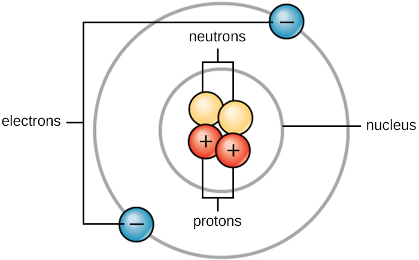
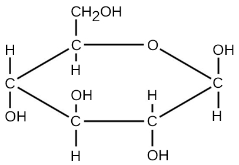

Like all other matter, the matter that comprises microorganisms is governed by the laws of chemistry and physics. The chemical and physical properties of microbial pathogens—both cellular and acellular—dictate their habitat, control their metabolic processes, and determine how they interact with the human body. This appendix provides a review of some of the fundamental principles of chemistry and physics that are essential to an understanding of microbiology. Many of the chapters in this text—especially [Microbial Biochemistry](/m58812){: .target-chapter} and [Microbial Metabolism](/m58818){: .target-chapter}—assume that the reader already has an understanding of the concepts reviewed here.

# Atomic Structure

Life is made up of matter. Matter occupies space and has mass. All matter is composed of **atoms**. All atoms contain **protons**, **electrons**, and **neutrons** ([\[link\]](#OSC_Microbio_00_AA_atom)). The only exception is hydrogen (H), which is made of one proton and one electron. A proton is a positively charged particle that resides in the nucleus (the core of the atom) of an atom and has a mass of 1 atomic mass unit (amu) and a charge of +1. An electron is a negatively charged particle that travels in the space around the nucleus. Electrons are distributed in different energy levels called electron shells. Electrons have a negligible mass and a charge of –1. Neutrons, like protons, reside in the nucleus of an atom. They have a mass of 1 amu and no charge (neutral). The positive (proton) and negative (electron) charges balance each other in a neutral atom, which has a net zero charge. Because protons and neutrons each have a mass of 1 amu, the mass of an atom is equal to the number of protons and neutrons of that atom. The number of electrons does not factor into the overall mass because electron mass is so small.

 {: #OSC_Microbio_00_AA_atom}

# Chemical Elements

All matter is composed of atoms of **elements**. Elements have unique physical and chemical properties and are substances that cannot easily be transformed either physically or chemically into other substances. Each element has been given a name, usually derived from Latin or English. The elements also have one- or two-letter symbols representing the name; for example, sodium (Na), gold (Au), and silver (Ag) have abbreviations derived from their original Latin names *natrium*, *aurum,* and *argentum*, respectively. Examples with English abbreviations are carbon (C), hydrogen (H), oxygen (O), and nitrogen (N). A total of 118 different elements (92 of which occur naturally) have been identified and organized into the periodic table of elements. Of the naturally occurring elements, fewer than 30 are found in organisms on Earth, and four of those (C, H, O, and N) make up approximately 96% of the mass of an organism.[1](#footnote1){: data-type="footnote-number" name="footnote-ref1"}

Each unique element is identified by the number of protons in its atomic nucleus. In addition to protons, each element\'s atomic nucleus contains an equal or greater number of neutrons (with the exception of hydrogen, which has only one proton). The total number of protons per element is described as the **atomic number**, and the combined mass of protons and neutrons is called the atomic mass or **mass number**. Therefore, it is possible to determine the number of neutrons by subtracting the atomic number from the mass number.

**Isotopes** are different forms of the same element that have the same number of protons, but a different number of neutrons. Many elements have several isotopes with one or two commonly occurring isotopes in nature. For example, carbon-12 (12C), the most common isotope of carbon (98.6% of all C found on Earth),[2](#footnote2){: data-type="footnote-number" name="footnote-ref2"} contains six protons and six neutrons. Therefore, it has a mass number of 12 (6 protons + 6 neutrons) and an atomic number of 6.

There are two additional types of isotopes in nature: heavy isotopes, and radioisotopes. Heavy isotopes have one or more extra neutrons while still maintaining a stable atomic nucleus. An example of a heavy isotope is carbon-13 (13C) (1.1% of all carbon).[3](#footnote3){: data-type="footnote-number" name="footnote-ref3"} 13C has a mass number of 13 (6 protons + 7 neutrons). Since the atomic number of 13C is 6, it is still the element carbon; however, it has more mass than the more common form of the element, 12C, because of the extra neutron in the nucleus. Carbon-14 (14C) (0.0001% of all carbon)[4](#footnote4){: data-type="footnote-number" name="footnote-ref4"} is an example of a radioisotope. 14C has a mass number of 14 (6 protons + 8 neutrons); however, the extra neutrons in 14C result in an unstable nucleus. This instability leads to the process of radioactive decay. Radioactive decay involves the loss of one or more neutrons and the release of energy in the form of gamma rays, alpha particles, or beta particles (depending on the isotope).

Heavy isotopes and radioisotopes of carbon and other elements have proven to be useful in research, industry, and medicine.

# Chemical Bonds

There are three types of chemical bonds that are important when describing the interaction of atoms both within and between molecules in microbiology: (1) covalent bonds, which can be either polar or non-polar, (2) ionic bonds, and (3) hydrogen bonds. There are other types of interactions such as *London* dispersion forces and *van der Waals* forces that could also be discussed when describing the physical and chemical properties of the intermolecular interactions of atoms, but we will not include descriptions of these forces here.

Chemical bonding is determined by the outermost shell of electrons, called the valence electrons (VE), of an atom. The number of VE is important when determining the number and type of chemical bonds an atom will form.

## Covalent Bonds

The strongest chemical bond between two or more atoms is a **covalent bond**. These bonds form when an electron is shared between two atoms, and these are the most common form of chemical bond in living organisms. Covalent bonds form between the atoms of elements that make up the biological molecules in our cells. An example of a simple molecule formed with covalent bonds is water, H2O, with one VE per H atom and 6 VE per O atom. Because of the VE configuration, each H atom is able to accept one additional VE and each O atom is able to accept two additional VE. When sharing electrons, the hydrogen and oxygen atoms that combine to form water molecules become bonded together by covalent bonds ([\[link\]](#OSC_Microbio_00_AA_bonds)). The electron from the hydrogen atom divides its time between the outer electron shell of the hydrogen atom and the outermost electron shell of the oxygen atom. To completely fill the outer shell of an oxygen atom, two electrons from two hydrogen atoms are needed, hence the subscript “2” indicating two atoms of H in a molecule of H2O. This sharing is a lower energy state for all of the atoms involved than if they existed without their outer shells filled.

There are two types of covalent bonds: polar and nonpolar. **Nonpolar covalent** bonds form between two atoms of the same or different elements that share the electrons equally ([\[link\]](#OSC_Microbio_00_AA_bonds)). In a **polar covalent bond**, the electrons shared by the atoms spend more time closer to one nucleus than to the other nucleus. Because of the unequal distribution of electrons between the different nuclei, a slightly positive (δ+) or slightly negative (δ–) charge develops. Water is an example of a molecule formed with **polar covalent bonds** ([\[link\]](#OSC_Microbio_00_AA_bonds)).

 ![A water molecule is labeled &#x201C;polar covalent bond&#x201D;; it consists of a central oxygen atom with 8 electrons in its outermost shell, 4 of which are shared (2 each) with 2 hydrogen atoms; the hydrogen atoms have a slightly positive charge and the oxygen atom has a slightly negative charge. A methane molecule is labeled &#x201C;nonpolar covalent bond&#x201D;; it consists of a central carbon atom with 8 electrons in its outermost shell, all of which are shared (2 each) with 4 hydrogen atoms; the molecule is neutral. The formation of sodium chloride is shown, with the sodium atom giving the only electron in its outermost shell to the chlorine atom, resulting in a sodium atom with no electrons in its outermost shell and a net positive charge, and a chlorine atom with 8 electrons in its outermost shell and a net negative charge.](../resources/OSC_Microbio_00_AA_bonds.jpg "The water molecule (top left) depicts a polar bond with a slightly positive charge on the hydrogen atoms and a slightly negative charge on the oxygen. Methane (top right) is an example of a nonpolar covalent bond. Sodium chloride (bottom) is a substance formed from ionic bonds between sodium and chlorine."){: #OSC_Microbio_00_AA_bonds}

## Ions and Ionic Bonds

When an atom does not contain equal numbers of protons and electrons, it is called an **ion**. Because the number of electrons does not equal the number of protons, each ion has a net charge. Positive ions are formed by losing electrons and are called **cations**. Negative ions are formed by gaining electrons and are called **anions**.

For example, a sodium atom has only has one electron in its outermost shell. It takes less energy for the sodium atom to donate that one electron than it does to accept seven more electrons, which it would need to fill its outer shell. If the sodium atom loses an electron, it now has 11 protons and only 10 electrons, leaving it with an overall charge of +1. It is now called a sodium ion (Na+).

A chlorine atom has seven electrons in its outer shell. Again, it is more energy efficient for the chlorine atom to gain one electron than to lose seven. Therefore, it will more likely gain an electron to form an ion with 17 protons and 18 electrons, giving it a net negative (–1) charge. It is now called a chloride ion (Cl–). This movement of electrons from one atom to another is referred to as electron transfer. Because positive and negative charges attract, these ions stay together and form an **ionic bond**, or a bond between ions. When Na+ and Cl– ions combine to produce NaCl, an electron from a sodium atom stays with the other seven from the chlorine atom, and the sodium and chloride ions attract each other in a lattice of ions with a net zero charge ([\[link\]](#OSC_Microbio_00_AA_bonds)).

**Polyatomic ions** consist of multiple atoms joined by covalent bonds; but unlike a molecule, a polyatomic ion has a positive or negative charge. It behaves as a cation or anion and can therefore form ionic bonds with other ions to form ionic compounds. The atoms in a polyatomic ion may be from the same element or different elements.

[\[link\]](#fs-id1167662548952) lists some cations and anions that commonly occur in microbiology. Note that this table includes monoatomic as well as polyatomic ions.

<table summary="A table is titled &#x201C;Some Common Ions in Microbiology.&#x201D; These cations and their formulas are listed: sodium (N A superscript +), hydrogen (H superscript +), potassium (K superscript +), ammonium (N H subscript 4 superscript +), copper one (C U superscript +), copper two (C U superscript 2 +), iron two (F E superscript 2 +), and iron three (F E superscript 3 +). These anions and their formulas are listed: chloride (C L superscript &#x2013;), bicarbonate (H C O subscript 3 superscript &#x2013;), carbonate (C O subscript 3 superscript 2 &#x2013;), hydrogen sulfate (H subscript 2 S O subscript 4 superscript 2 &#x2013;), hydrogen sulfide (H S superscript &#x2013;), hydroxide (O H superscript &#x2013;), hypochlorite (C L O superscript &#x2013;), nitrite (N O subscript 2 superscript &#x2013;), nitrate (N O subscript 3 superscript &#x2013;), peroxide (O subscript 2 superscript 2 &#x2013;), phosphate (P O subscript 4 superscript 3 &#x2013;), pyrophosphate (P subscript 2 O subscript 7 superscript 4 &#x2013;), sulfite S O subscript 3 superscript 2 &#x2013;), thiosulfate (S subscript 2 O subscript 3 superscript 2&#x2013;)." class="span-all"><thead>
<tr valign="top">
<th colspan="4" data-valign="top" data-align="center">Some Common Ions in Microbiology</th>
</tr>
<tr valign="top">
<th colspan="2" data-valign="top" data-align="center">Cations</th>
<th colspan="2" data-valign="top" data-align="center">Anions</th>
</tr>
</thead><tbody>
<tr valign="top">
<td data-valign="top" data-align="center">sodium</td>
<td data-valign="top" data-align="center">Na+</td>
<td data-valign="top" data-align="center">chloride</td>
<td data-valign="top" data-align="center">Cl–</td>
</tr>
<tr valign="top">
<td data-valign="top" data-align="center">hydrogen</td>
<td data-valign="top" data-align="center">H+</td>
<td data-valign="top" data-align="center">bicarbonate</td>
<td data-valign="top" data-align="center"><math xmlns="http://www.w3.org/1998/Math/MathML"><mrow><msub><mrow><mtext>HCO</mtext></mrow><mtext>3</mtext></msub><msup><mrow /><mo>−</mo></msup></mrow></math></td>
</tr>
<tr valign="top">
<td data-valign="top" data-align="center">potassium</td>
<td data-valign="top" data-align="center">K+</td>
<td data-valign="top" data-align="center">carbonate</td>
<td data-valign="top" data-align="center"><math xmlns="http://www.w3.org/1998/Math/MathML"><mrow><msub><mrow><mtext>CO</mtext></mrow><mtext>3</mtext></msub><msup><mrow><msup><mrow /><mtext>2</mtext></msup></mrow><mo>−</mo></msup></mrow></math></td>
</tr>
<tr valign="top">
<td data-valign="top" data-align="center">ammonium</td>
<td data-valign="top" data-align="center"><math xmlns="http://www.w3.org/1998/Math/MathML"><mrow><msub><mrow><mtext>NH</mtext></mrow><mtext>4</mtext></msub><msup><mrow /><mo>+</mo></msup></mrow></math></td>
<td data-valign="top" data-align="center">hydrogen sulfate</td>
<td data-valign="top" data-align="center"><math xmlns="http://www.w3.org/1998/Math/MathML"><mrow><msub><mtext>H</mtext><mtext>2</mtext></msub><msub><mrow><mtext>SO</mtext></mrow><mtext>4</mtext></msub><msup><mrow><msup><mrow /><mtext>2</mtext></msup></mrow><mo>−</mo></msup></mrow></math></td>
</tr>
<tr valign="top">
<td data-valign="top" data-align="center">copper (I)</td>
<td data-valign="top" data-align="center">Cu+</td>
<td data-valign="top" data-align="center">hydrogen sulfide</td>
<td data-valign="top" data-align="center">HS–</td>
</tr>
<tr valign="top">
<td data-valign="top" data-align="center">copper (II)</td>
<td data-valign="top" data-align="center">Cu2+</td>
<td data-valign="top" data-align="center">hydroxide</td>
<td data-valign="top" data-align="center">OH–</td>
</tr>
<tr valign="top">
<td data-valign="top" data-align="center">iron (II)</td>
<td data-valign="top" data-align="center">Fe2+</td>
<td data-valign="top" data-align="center">hypochlorite</td>
<td data-valign="top" data-align="center">ClO–</td>
</tr>
<tr valign="top">
<td data-valign="top" data-align="center">iron (III)</td>
<td data-valign="top" data-align="center">Fe3+</td>
<td data-valign="top" data-align="center">nitrite</td>
<td data-valign="top" data-align="center"><math xmlns="http://www.w3.org/1998/Math/MathML"><mrow><msub><mrow><mtext>NO</mtext></mrow><mtext>2</mtext></msub><msup><mrow /><mo>−</mo></msup></mrow></math></td>
</tr>
<tr valign="top">
<td />
<td />
<td data-valign="top" data-align="center">nitrate</td>
<td data-valign="top" data-align="center"><math xmlns="http://www.w3.org/1998/Math/MathML"><mrow><msub><mrow><mtext>NO</mtext></mrow><mtext>3</mtext></msub><msup><mrow /><mo>−</mo></msup></mrow></math></td>
</tr>
<tr valign="top">
<td />
<td />
<td data-valign="top" data-align="center">peroxide</td>
<td data-valign="top" data-align="center"><math xmlns="http://www.w3.org/1998/Math/MathML"><mrow><msub><mtext>O</mtext><mtext>2</mtext></msub><msup><mrow><msup><mrow /><mtext>2</mtext></msup></mrow><mo>−</mo></msup></mrow></math></td>
</tr>
<tr valign="top">
<td />
<td />
<td data-valign="top" data-align="center">phosphate</td>
<td data-valign="top" data-align="center"><math xmlns="http://www.w3.org/1998/Math/MathML"><mrow><msub><mrow><mtext>PO</mtext></mrow><mtext>4</mtext></msub><msup><mrow><msup><mrow /><mtext>3</mtext></msup></mrow><mo>−</mo></msup></mrow></math></td>
</tr>
<tr valign="top">
<td />
<td />
<td data-valign="top" data-align="center">pyrophosphate</td>
<td data-valign="top" data-align="center"><math xmlns="http://www.w3.org/1998/Math/MathML"><mrow><msub><mtext>P</mtext><mtext>2</mtext></msub><msub><mtext>O</mtext><mtext>7</mtext></msub><msup><mrow><msup><mrow /><mtext>4</mtext></msup></mrow><mo>−</mo></msup></mrow></math></td>
</tr>
<tr valign="top">
<td />
<td />
<td data-valign="top" data-align="center">sulfite</td>
<td data-valign="top" data-align="center"><math xmlns="http://www.w3.org/1998/Math/MathML"><mrow><msub><mrow><mtext>SO</mtext></mrow><mtext>3</mtext></msub><msup><mrow><msup><mrow /><mtext>2</mtext></msup></mrow><mo>−</mo></msup></mrow></math></td>
</tr>
<tr valign="top">
<td />
<td />
<td data-valign="top" data-align="center">thiosulfate</td>
<td data-valign="top" data-align="center"><math xmlns="http://www.w3.org/1998/Math/MathML"><mrow><msub><mtext>S</mtext><mtext>2</mtext></msub><msub><mtext>O</mtext><mtext>3</mtext></msub><msup><mrow><msup><mrow /><mtext>2</mtext></msup></mrow><mo>−</mo></msup></mrow></math></td>
</tr>
</tbody></table>

# Molecular Formula, Molecular Mass, and the Mole

For molecules formed by covalent bonds, the molecular formula represents the number and types of elemental atoms that compose the molecule. As an example, consider a molecule of glucose, which has the molecular formula C6H12O6. This molecular formula indicates that a single molecule of glucose is formed from six carbon atoms, twelve hydrogen atoms, and six oxygen atoms.

The **molecular mass** of a molecule can be calculated using the molecular formula and the atomic mass of each element in the molecule. The number of each type of atom is multiplied by the atomic mass; then the products are added to get the molecular mass. For example the molecular mass of glucose, C6H12O6 ([\[link\]](#OSC_Microbio_00_AA_glucose)), is calculated as:

<math xmlns="http://www.w3.org/1998/Math/MathML"><mtable><mtr><mtd columnalign="left"><mtext>mass of carbon</mtext></mtd><mtd columnalign="left"><mo>=</mo></mtd><mtd columnalign="left"><mn>12</mn><mspace width="0.2em" /><mfrac><mrow><mtext>amu</mtext></mrow><mrow><mtext>atom</mtext></mrow></mfrac><mspace width="0.2em" /><mo>×</mo><mspace width="0.2em" /><mn>6</mn><mspace width="0.2em" /><mtext>atoms</mtext><mo>=</mo><mn>72</mn><mspace width="0.2em" /><mtext>amu</mtext></mtd></mtr><mtr><mtd columnalign="left"><mtext>mass of hydrogen</mtext></mtd><mtd columnalign="left"><mo>=</mo></mtd><mtd columnalign="left"><mn>1</mn><mspace width="0.2em" /><mfrac><mrow><mtext>amu</mtext></mrow><mrow><mtext>atom</mtext></mrow></mfrac><mspace width="0.2em" /><mo>×</mo><mspace width="0.2em" /><mn>12</mn><mspace width="0.2em" /><mtext>atoms</mtext><mo>=</mo><mn>12</mn><mspace width="0.2em" /><mtext>amu</mtext></mtd></mtr><mtr><mtd columnalign="left"><mtext>mass of oxygen</mtext></mtd><mtd columnalign="left"><mo>=</mo></mtd><mtd columnalign="left"><mn>16</mn><mspace width="0.2em" /><mfrac><mrow><mtext>amu</mtext></mrow><mrow><mtext>atom</mtext></mrow></mfrac><mspace width="0.2em" /><mo>×</mo><mspace width="0.2em" /><mn>6</mn><mspace width="0.2em" /><mtext>atoms</mtext><mo>=</mo><mn>96</mn><mspace width="0.2em" /><mtext>amu</mtext></mtd></mtr><mtr><mtd columnalign="left"><mtext>molecular mass of glucose</mtext></mtd><mtd columnalign="left"><mo>=</mo></mtd><mtd columnalign="left"><mn>72</mn><mspace width="0.2em" /><mtext>amu</mtext><mo>+</mo><mn>12</mn><mspace width="0.2em" /><mtext>amu</mtext><mo>+</mo><mn>96</mn><mspace width="0.2em" /><mtext>amu</mtext><mo>=</mo><mn>180</mn><mspace width="0.2em" /><mtext>amu</mtext></mtd></mtr></mtable></math>

 {: #OSC_Microbio_00_AA_glucose}

The number of entities composing a mole has been experimentally determined to be 6.022 × 1023, a fundamental constant named **Avogadro’s number** (NA) or the Avogadro constant. This constant is properly reported with an explicit unit of “per mole.”

# Energy

Thermodynamics refers to the study of energy and energy transfer involving physical matter.

Matter participating in a particular case of energy transfer is called a system, and everything outside of that matter is called the surroundings. There are two types of systems: open and closed. In an **open system**, energy can be exchanged with its surroundings. A **closed system** cannot exchange energy with its surroundings. Biological organisms are open systems. Energy is exchanged between them and their surroundings as they use energy from the sun to perform photosynthesis or consume energy-storing molecules and release energy to the environment by doing work and releasing heat. Like all things in the physical world, energy is subject to physical laws. In general, energy is defined as the ability to do work, or to create some kind of change. Energy exists in different forms. For example, electrical energy, light energy, and heat energy are all different types of energy. The **first law of thermodynamics,** often referred to as the law of conservation of energy, states that the total amount of energy in the universe is constant and conserved. Energy exists in many different forms. According to the first law of thermodynamics, energy may be transferred from place to place or transformed into different forms, but it cannot be created or destroyed.

The challenge for all living organisms is to obtain energy from their surroundings in forms that they can transfer or transform into usable energy to do work. Microorganisms have evolved to meet this challenge. Chemical energy stored within organic molecules such as sugars and fats is transferred and transformed through a series of cellular chemical reactions into energy within molecules of ATP. Energy in ATP molecules is easily accessible to do work. Examples of the types of work that cells need to do include building complex molecules, transporting materials, powering the motion of cilia or flagella, and contracting muscle fibers to create movement.

A microorganism’s primary tasks of obtaining, transforming, and using energy to do work may seem simple. However, the **second law of thermodynamics** explains why these tasks are more difficult than they appear. All energy transfers and transformations are never completely efficient. In every energy transfer, some amount of energy is lost in a form that is unusable. In most cases, this form is **heat energy**. Thermodynamically, heat energy is defined as the energy transferred from one system to another that is not work. For example, some energy is lost as heat energy during cellular metabolic reactions.

The more energy that is lost by a system to its surroundings, the less ordered and more random the system is. Scientists refer to the measure of randomness or disorder within a system as **entropy**. High entropy means high disorder and low energy. Molecules and chemical reactions have varying entropy as well. For example, entropy increases as molecules at a high concentration in one place diffuse and spread out. The second law of thermodynamics says that energy will always be lost as heat in energy transfers or transformations. Microorganisms are highly ordered, requiring constant energy input to be maintained in a state of low entropy.

# Chemical Reactions

**Chemical reactions** occur when two or more atoms bond together to form molecules or when bonded atoms are broken apart. The substances used in a chemical reaction are called the **reactants** (usually found on the left side of a chemical equation), and the substances produced by the reaction are known as the **products** (usually found on the right side of a chemical equation). An arrow is typically drawn between the reactants and products to indicate the direction of the chemical reaction; this direction is not always a “one-way street.”

An example of a simple chemical reaction is the breaking down of hydrogen peroxide molecules, each of which consists of two hydrogen atoms bonded to two oxygen atoms (H2O2). The reactant hydrogen peroxide is broken down into water, containing one oxygen atom bound to two hydrogen atoms (H2O), and oxygen, which consists of two bonded oxygen atoms (O2). In the equation below, the reaction includes two hydrogen peroxide molecules and two water molecules. This is an example of a balanced chemical equation, wherein the number of atoms of each element is the same on each side of the equation. According to the law of conservation of matter, the number of atoms before and after a chemical reaction should be equal, such that no atoms are, under normal circumstances, created or destroyed.

<math xmlns="http://www.w3.org/1998/Math/MathML"><mrow><msub><mrow><mtext>2H</mtext></mrow><mn>2</mn></msub><msub><mtext>O</mtext><mn>2</mn></msub><mrow><mo>(</mo><mrow><mtext>hydrogen peroxide</mtext></mrow><mo>)</mo></mrow><mspace width="0.2em" /><mo stretchy="false">⟶</mo><mspace width="0.2em" /><msub><mrow><mtext>2H</mtext></mrow><mn>2</mn></msub><mtext>O</mtext><mrow><mo>(</mo><mrow><mtext>water</mtext></mrow><mo>)</mo></mrow><mo>+</mo><msub><mrow><mtext>O</mtext></mrow><mn>2</mn></msub><mrow><mo>(</mo><mrow><mtext>oxygen</mtext></mrow><mo>)</mo></mrow></mrow></math>

Some chemical reactions, such as the one shown above, can proceed in one direction until the reactants are all used up. Equations that describe these reactions contain a unidirectional arrow and are irreversible. **Reversible reactions** are those that can go in either direction. In reversible reactions, reactants are turned into products, but when the concentration of product rises above a certain threshold (characteristic of the particular reaction), some of these products will be converted back into reactants; at this point, the designations of products and reactants are reversed. The changes in concentration continue until a certain relative balance in concentration between reactants and products occurs—a state called **chemical equilibrium**. At this point, both the forward and reverse reactions continue to occur, but they do so at the same rate, so the concentrations of reactants and products do not change. These situations of reversible reactions are often denoted by a chemical equation with a double-headed arrow pointing towards both the reactants and products. For example, when carbon dioxide dissolves in water, it can do so as a gas dissolved in water *or* by reacting with water to produce carbonic acid. In the cells of some microorganisms, the rate of carbonic acid production is accelerated by the enzyme carbonic anhydrase, as indicated in the following equation:

<math xmlns="http://www.w3.org/1998/Math/MathML"><mrow><msub><mrow><mtext>CO</mtext></mrow><mn>2</mn></msub><mo>+</mo><msub><mrow><mtext>H</mtext></mrow><mn>2</mn></msub><mtext>O</mtext><mover><mrow><mo>⇌</mo></mrow><mrow><mtable><mtr><mtd><mrow><mtext>carbonic</mtext></mrow></mtd></mtr><mtr><mtd><mrow><mtext>anhydrase</mtext></mrow></mtd></mtr></mtable></mrow></mover><msub><mrow><mtext>H</mtext></mrow><mn>2</mn></msub><msub><mrow><mtext>CO</mtext></mrow><mn>3</mn></msub><mo stretchy="false">⇌</mo><msup><mrow><mtext>H</mtext></mrow><mrow><mo>+</mo></mrow></msup><mo>+</mo><msup><mrow><msub><mrow><mtext>HCO</mtext></mrow><mrow><mn>3</mn></mrow></msub></mrow><mrow><mo>−</mo></mrow></msup></mrow></math>

# Properties of Water and Solutions

The hydrogen and oxygen atoms within water molecules form polar covalent bonds. There is no overall charge to a water molecule, but there is one ∂+ on each hydrogen atom and two ∂– on the oxygen atom. Each water molecule attracts other water molecules because of the positive and negative charges in the different parts of the molecule ([\[link\]](#OSC_Microbio_00_AA_polar)). Water also attracts other polar molecules (such as sugars), forming hydrogen bonds. When a substance readily forms hydrogen bonds with water, it can dissolve in water and is referred to as **hydrophilic** (“water-loving”). Hydrogen bonds are not readily formed with nonpolar substances like oils and fats. These nonpolar compounds are **hydrophobic** (“water-fearing”) and will orient away from and avoid water.

  and slightly negative (&#x2202;&#x2013;) charges of polar covalent molecules such as water."){: #OSC_Microbio_00_AA_polar}

The hydrogen bonds in water allow it to absorb and release heat energy more slowly than many other substances. This means that water moderates temperature changes within organisms and in their environments. As energy input continues, the balance between hydrogen-bond formation and breaking swings toward fewer hydrogen bonds: more bonds are broken than are formed. This process results in the release of individual water molecules at the surface of the liquid (such as a body of water, the leaves of a plant, or the skin of an organism) in a process called **evaporation**.

Conversely, as molecular motion decreases and temperatures drop, less energy is present to break the hydrogen bonds between water molecules. These bonds remain intact and begin to form a rigid, lattice-like structure (e.g., ice). When frozen, ice is less dense (the molecules are farther apart) than liquid water. This means that ice floats on the surface of a body of water. In lakes, ponds, and oceans, ice will form on the surface of the water, creating an insulating barrier to protect the animal and plant life beneath from freezing in the water. If this did not happen, plants and animals living in water would freeze in a block of ice and could not move freely, making life in cold temperatures difficult or impossible.

Because water is polar, with slight positive and negative charges, ionic compounds and polar molecules can readily dissolve in it. Water is, therefore, what is referred to as a solvent—a substance capable of dissolving another substance. The charged particles will form hydrogen bonds with a surrounding layer of water molecules. This is referred to as a **sphere of hydration** and serves to keep the ions separated or dispersed in the water ([\[link\]](#OSC_Microbio_00_AA_hydration)). These spheres of hydration are also referred to as hydration shells. The polarity of the water molecule makes it an effective solvent and is important in its many roles in living systems.

  is mixed in water, spheres of hydration form around the ions."){: #OSC_Microbio_00_AA_hydration}

The ability of insects to float on and skate across pond water results from the property of **cohesion**. In cohesion, water molecules are attracted to each other (because of hydrogen bonding), keeping the molecules together at the liquid-air (gas) interface. Cohesion gives rise to surface tension, the capacity of a substance to withstand rupture when placed under tension or stress.

These cohesive forces are also related to water’s property of **adhesion**, or the attraction between water molecules and other molecules. This is observed when water “climbs” up a straw placed in a glass of water. You will notice that the water appears to be higher on the sides of the straw than in the middle. This is because the water molecules are attracted to the straw and therefore adhere to it.

Cohesion and adhesion are also factors in bacterial colonies and biofilm formation. Cohesion keeps the colony intact (helps it “stick” to a surface), while adhesion keeps the cells adhered to each other. Cohesive and adhesive forces are important for sustaining life. For example, because of these forces, water in natural surroundings provides the conditions necessary to allow bacterial and archaeal cells to adhere and accumulate on surfaces.

# Acids and Bases

The **pH** of a solution is a measure of hydrogen ion (H+) and hydroxide ion (OH–) concentrations and is described as **acidity** or **alkalinity,** respectively. Acidity and alkalinity (also referred to as basicity) can be measured and calculated. pH can be simply represented by the mathematic equation, <math xmlns="http://www.w3.org/1998/Math/MathML"><mrow><mtext>pH</mtext><mo>=</mo><msub><mrow><mtext>−log</mtext></mrow><mrow><mn>10</mn></mrow></msub><mrow><mo>[</mo><msup><mrow><mtext>H</mtext></mrow><mrow><mo>+</mo></mrow></msup><mo>]</mo><mo>.</mo></mrow></mrow></math>

 On the left side of the equation, the \"p\" means \"the negative logarithm of \" and the H represents the \[H+\]. On the right side of the equation, \[H+\] is the concentration of H+ in moles/L . What is not represented in this simple equation is the contribution of the OH–, which also participates in acidity or alkalinity. Calculation of pH results in a number range of 0 to 14 called the pH scale ([\[link\]](#OSC_Microbio_00_AA_ph)). A pH value between 0 and 6.9 indicates an acid. It is also referred to as a low pH, due to a high \[H+\] and low \[OH–\] concentration. A pH value between 7.1 and 14 indicates an alkali or base. It is also referred to as a high pH, due to a low \[H+\] and high \[OH–\] concentration. A pH of 7 is described as a neutral pH and occurs when \[H+\] equals \[OH–\].

 "){: #OSC_Microbio_00_AA_ph}

A change of one unit on the pH scale represents a change in the \[H+\] by a factor of 10, a change in two units represents a change in the \[H+\] by a factor of 100. Thus, small changes in pH represent large changes in \[H+\].

## Footnotes
{: data-type="footnote-title"}

1.  [1](#footnote-ref1){: data-type="footnote-ref" name="footnote1"} Schrijver, Karel, and Iris Schrijver. *Living with the Stars: How the Human Body Is Connected to the Life Cycles of the Earth, the Planets, and the Stars*. Oxford University Press, USA, 2015.
2.  [2](#footnote-ref2){: data-type="footnote-ref" name="footnote2"} National Oceanic and Atmospheric Administration, “Stable and Radiocarbon Isotopes of Carbon Dioxide.” Web page. Accessed Feb 19, 2016 \[http://www.esrl.noaa.gov/gmd/outreach/isotopes/chemistry.html\]
3.  [3](#footnote-ref3){: data-type="footnote-ref" name="footnote3"} ibid.
4.  [4](#footnote-ref4){: data-type="footnote-ref" name="footnote4"} ibid.

