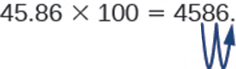
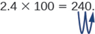

### Squares and Other Powers

An exponent, or a power, is mathematical shorthand for repeated multiplications. For example, the exponent “2” means to multiply the base for that exponent by itself (in the example here, the base is “5”):

<math xmlns="http://www.w3.org/1998/Math/MathML"><mrow><msup><mn>5</mn><mn>2</mn></msup><mo>=</mo><mn>5</mn><mspace width="0.2em" /><mo>×</mo><mspace width="0.2em" /><mn>5</mn><mo>=</mo><mn>25</mn></mrow></math>

The exponent is “2” and the base is the number “5.” This expression (multiplying a number by itself) is also called a square. Any number raised to the power of 2 is being squared. Any number raised to the power of 3 is being cubed:

<math xmlns="http://www.w3.org/1998/Math/MathML"><mrow><msup><mn>5</mn><mn>3</mn></msup><mo>=</mo><mn>5</mn><mspace width="0.2em" /><mo>×</mo><mspace width="0.2em" /><mn>5</mn><mspace width="0.2em" /><mo>×</mo><mspace width="0.2em" /><mn>5</mn><mo>=</mo><mn>125</mn></mrow></math>

A number raised to the fourth power is equal to that number multiplied by itself four times, and so on for higher powers. In general:

<math xmlns="http://www.w3.org/1998/Math/MathML"><mrow><msup><mi>n</mi><mi>x</mi></msup><mo>=</mo><mi>n</mi><mspace width="0.2em" /><mo>×</mo><mspace width="0.2em" /><msup><mi>n</mi><mrow><mi>x</mi><mo>−</mo><mn>1</mn></mrow></msup></mrow></math>

### Calculating Percents

A percent is a way of expressing a fractional amount of something using a whole divided into 100 parts. A percent is a ratio whose denominator is 100. We use the percent symbol, %, to show percent. Thus, 25% means a ratio of <math xmlns="http://www.w3.org/1998/Math/MathML"><mrow><mfrac><mrow><mn>25</mn></mrow><mrow><mn>100</mn></mrow></mfrac></mrow></math>

, 3% means a ratio of <math xmlns="http://www.w3.org/1998/Math/MathML"><mrow><mfrac><mn>3</mn><mrow><mn>100</mn></mrow></mfrac></mrow></math>

, and 100 % percent means <math xmlns="http://www.w3.org/1998/Math/MathML"><mrow><mfrac><mrow><mn>100</mn></mrow><mrow><mn>100</mn></mrow></mfrac></mrow></math>

, or a whole.

#### Converting Percents

A percent can be converted to a fraction by writing the value of the percent as a fraction with a denominator of 100 and simplifying the fraction if possible.

<math xmlns="http://www.w3.org/1998/Math/MathML"><mrow><mtext>25%</mtext><mo>=</mo><mfrac><mrow><mn>25</mn></mrow><mrow><mn>100</mn></mrow></mfrac><mo>=</mo><mfrac><mn>1</mn><mn>4</mn></mfrac></mrow></math>

A percent can be converted to a decimal by writing the value of the percent as a fraction with a denominator of 100 and dividing the numerator by the denominator.

<math xmlns="http://www.w3.org/1998/Math/MathML"><mrow><mtext>10%</mtext><mo>=</mo><mfrac><mrow><mn>10</mn></mrow><mrow><mn>100</mn></mrow></mfrac><mo>=</mo><mn>0.10</mn></mrow></math>

To convert a decimal to a percent, write the decimal as a fraction. If the denominator of the fraction is not 100, convert it to a fraction with a denominator of 100, and then write the fraction as a percent.

<math xmlns="http://www.w3.org/1998/Math/MathML"><mrow><mn>0.833</mn><mo>=</mo><mfrac><mrow><mn>833</mn></mrow><mrow><mn>1000</mn></mrow></mfrac><mo>=</mo><mfrac><mrow><mn>83.3</mn></mrow><mrow><mn>100</mn></mrow></mfrac><mo>=</mo><mn>83.3%</mn></mrow></math>

To convert a fraction to a percent, first convert the fraction to a decimal, and then convert the decimal to a percent.

<math xmlns="http://www.w3.org/1998/Math/MathML"><mrow><mfrac><mn>3</mn><mn>4</mn></mfrac><mo>=</mo><mn>0.75</mn><mo>=</mo><mfrac><mrow><mn>75</mn></mrow><mrow><mn>100</mn></mrow></mfrac><mo>=</mo><mn>75%</mn></mrow></math>

Suppose a researcher finds that 15 out of 23 students in a class are carriers of *Neisseria meningitides*. What percentage of students are carriers? To find this value, first express the numbers as a fraction.

<math xmlns="http://www.w3.org/1998/Math/MathML"><mrow><mfrac><mrow><mtext>carriers</mtext></mrow><mrow><mtext>total students</mtext></mrow></mfrac><mo>=</mo><mfrac><mrow><mn>15</mn></mrow><mrow><mn>23</mn></mrow></mfrac></mrow></math>

Then divide the numerator by the denominator.

<math xmlns="http://www.w3.org/1998/Math/MathML"><mrow><mfrac><mrow><mn>15</mn></mrow><mrow><mn>23</mn></mrow></mfrac><mo>=</mo><mn>15</mn><mo>÷</mo><mn>23</mn><mo>≈</mo><mn>0.65</mn></mrow></math>

Finally, to convert a decimal to a percent, multiply by 100.

<math xmlns="http://www.w3.org/1998/Math/MathML"><mrow><mn>0.65</mn><mspace width="0.2em" /><mo>×</mo><mspace width="0.2em" /><mn>100</mn><mo>=</mo><mn>65%</mn></mrow></math>

The percent of students who are carriers is 65%.

You might also get data on occurrence and non-occurrence; for example, in a sample of students, 9 tested positive for *Toxoplasma* antibodies, while 28 tested negative. What is the percentage of seropositive students? The first step is to determine the “whole,” of which the positive students are a part. To do this, sum the positive and negative tests.

<math xmlns="http://www.w3.org/1998/Math/MathML"><mrow><mtext>positive</mtext><mo>+</mo><mtext>negative</mtext><mo>=</mo><mn>9</mn><mo>+</mo><mn>28</mn><mo>=</mo><mn>37</mn></mrow></math>

The whole sample consisted of 37 students. The fraction of positives is:

<math xmlns="http://www.w3.org/1998/Math/MathML"><mrow><mfrac><mrow><mtext>positive</mtext></mrow><mrow><mtext>total students</mtext></mrow></mfrac><mo>=</mo><mfrac><mn>9</mn><mrow><mn>37</mn></mrow></mfrac></mrow></math>

To find the percent of students who are carriers, divide the numerator by the denominator and multiply by 100.

<math xmlns="http://www.w3.org/1998/Math/MathML"><mtable><mtr><mtd columnalign="left"><mfrac><mn>9</mn><mrow><mn>37</mn></mrow></mfrac><mo>=</mo><mn>9</mn><mo>÷</mo><mn>37</mn><mo>≈</mo><mn>0.24</mn></mtd></mtr><mtr><mtd columnalign="left"><mn>0.24</mn><mspace width="0.2em" /><mo>×</mo><mspace width="0.2em" /><mn>100</mn><mo>=</mo><mn>24%</mn></mtd></mtr></mtable></math>

The percent of positive students is about 24%.

Another way to think about calculating a percent is to set up equivalent fractions, one of which is a fraction with 100 as the denominator, and cross-multiply. The previous example would be expressed as:

<math xmlns="http://www.w3.org/1998/Math/MathML"><mrow><mfrac><mn>9</mn><mrow><mn>37</mn></mrow></mfrac><mo>=</mo><mfrac><mi>x</mi><mrow><mn>100</mn></mrow></mfrac></mrow></math>

Now, cross multiply and solve for the unknown:

<math xmlns="http://www.w3.org/1998/Math/MathML"><mtable><mtr><mtd columnalign="right"><mn>9</mn><mspace width="0.2em" /><mo>×</mo><mspace width="0.2em" /><mn>100</mn></mtd><mtd columnalign="left"><mo>=</mo></mtd><mtd columnalign="left"><mn>37</mn><mi>x</mi></mtd><mtd /><mtd /><mtd /></mtr><mtr><mtd columnalign="right"><mfrac><mrow><mn>9</mn><mspace width="0.2em" /><mo>×</mo><mspace width="0.2em" /><mn>100</mn></mrow><mrow><mn>37</mn></mrow></mfrac></mtd><mtd columnalign="left"><mo>=</mo></mtd><mtd columnalign="left"><mi>x</mi></mtd><mtd /><mtd /><mtd columnalign="left"><mspace width="5em" /><mtext>Divide both sides by 37</mtext></mtd></mtr><mtr><mtd columnalign="right"><mfrac><mrow><mn>900</mn></mrow><mrow><mn>37</mn></mrow></mfrac></mtd><mtd columnalign="left"><mo>=</mo></mtd><mtd columnalign="left"><mi>x</mi></mtd><mtd /><mtd /><mtd columnalign="left"><mspace width="5em" /><mtext>Multiply</mtext></mtd></mtr><mtr><mtd columnalign="right"><mn>24</mn></mtd><mtd columnalign="left"><mo>≈</mo></mtd><mtd columnalign="left"><mi>x</mi></mtd><mtd /><mtd /><mtd columnalign="left"><mspace width="5em" /><mtext>Divide</mtext></mtd></mtr></mtable></math>

The answer, rounded, is the same.

### Multiplying and Dividing by Tens

In many fields, especially in the sciences, it is common to multiply decimals by powers of 10. Let’s see what happens when we multiply 1.9436 by some powers of 10.

<math xmlns="http://www.w3.org/1998/Math/MathML"><mtable><mtr><mtd columnalign="right"><mn>1.9436</mn><mrow><mo>(</mo><mrow><mn>10</mn></mrow><mo>)</mo></mrow></mtd><mtd columnalign="left"><mo>=</mo></mtd><mtd columnalign="left"><mn>19.436</mn></mtd></mtr><mtr><mtd columnalign="right"><mn>1.9436</mn><mrow><mo>(</mo><mrow><mn>100</mn></mrow><mo>)</mo></mrow></mtd><mtd columnalign="left"><mo>=</mo></mtd><mtd columnalign="left"><mn>194.36</mn></mtd></mtr><mtr><mtd columnalign="right"><mn>1.9436</mn><mrow><mo>(</mo><mrow><mn>1000</mn></mrow><mo>)</mo></mrow></mtd><mtd columnalign="left"><mo>=</mo></mtd><mtd columnalign="left"><mn>1943.6</mn></mtd></mtr></mtable></math>

The number of places that the decimal point moves is the same as the number of zeros in the power of ten. [\[link\]](#fs-id1167663639521) summarizes the results.

| Multiply by | Zeros | Decimal point moves . . . |
{: valign="top"}|----------
| 10 | 1 | 1 place to the right |
{: valign="top"}| 100 | 2 | 2 places to the right |
{: valign="top"}| 1,000 | 3 | 3 places to the right |
{: valign="top"}| 10,000 | 4 | 4 places to the right |
{: valign="top"}{: summary="A table explains that to multiply by 10, there is one zero and the decimal point moves 1 place to the right. To multiply by 100, there are two zeroes and the decimal point moves 2 places to the right. To multiply by 1000, there are three zeroes and the decimal point moves 3 places to the right. To multiply by 10,000 there are four zeroes and the decimal point moves 4 places to the right." .span-all}

We can use this pattern as a shortcut to multiply by powers of ten instead of multiplying using the vertical format. We can count the zeros in the power of 10 and then move the decimal point that same number of places to the right.

So, for example, to multiply 45.86 by 100, move the decimal point 2 places to the right.

    Sometimes when we need to move the decimal point, there are not enough decimal places. In that case, we use zeros as placeholders. For example, let’s multiply 2.4 by 100. We need to move the decimal point 2 places to the right. Since there is only one digit to the right of the decimal point, we must write a 0 in the hundredths place.

    When dividing by powers of 10, simply take the opposite approach and move the decimal to the left by the number of zeros in the power of ten.

Let’s see what happens when we divide 1.9436 by some powers of 10.

<math xmlns="http://www.w3.org/1998/Math/MathML"><mtable><mtr><mtd columnalign="right"><mn>1.9436</mn><mo>÷</mo><mn>10</mn></mtd><mtd columnalign="left"><mo>=</mo></mtd><mtd columnalign="left"><mn>0.19436</mn></mtd></mtr><mtr><mtd columnalign="right"><mn>1.9436</mn><mo>÷</mo><mn>100</mn></mtd><mtd columnalign="left"><mo>=</mo></mtd><mtd columnalign="left"><mn>0.019436</mn></mtd></mtr><mtr><mtd columnalign="right"><mn>1.9436</mn><mo>÷</mo><mn>1000</mn></mtd><mtd columnalign="left"><mo>=</mo></mtd><mtd columnalign="left"><mn>0.0019436</mn></mtd></mtr></mtable></math>

If there are insufficient digits to move the decimal, add zeroes to create places.

### Scientific Notation

Scientific notation is used to express very large and very small numbers as a product of two numbers. The first number of the product, the digit term, is usually a number not less than 1 and not greater than 10. The second number of the product, the exponential term, is written as 10 with an exponent. Some examples of scientific notation are given in [\[link\]](#fs-id1167663664079).

| Standard Notation | Scientific Notation |
{: valign="top"}|----------
| 1000 | 1 × 103 |
{: valign="top"}| 100 | 1 × 102 |
{: valign="top"}| 10 | 1 × 101 |
{: valign="top"}| 1 | 1 × 100 |
{: valign="top"}| 0.1 | 1 × 10−1 |
{: valign="top"}| 0.01 | 1 × 10−2 |
{: valign="top"}{: summary="A table gives examples of standard and scientific notation. The standard notation of 1000 has the scientific notation of 1 &#xD7; 103. The standard notation of 100 has the scientific notation of 1 &#xD7; 102. The standard notation of 10 has the scientific notation of 1 &#xD7; 101. The standard notation of 1 has the scientific notation of 1 &#xD7; 100. The standard notation of 0.1 has the scientific notation of 1 &#xD7; 10&#x2212;1. The standard notation of 0.01 has the scientific notation of 1 &#xD7; 10&#x2212;2." .span-all}

Scientific notation is particularly useful notation for very large and very small numbers, such as 1,230,000,000 = 1.23 × 109, and 0.00000000036 = 3.6 × 10−10.

### Expressing Numbers in Scientific Notation

Converting any number to scientific notation is straightforward. Count the number of places needed to move the decimal next to the left-most non-zero digit: that is, to make the number between 1 and 10. Then multiply that number by 10 raised to the number of places you moved the decimal. The exponent is positive if you moved the decimal to the left and negative if you moved the decimal to the right. So

<math xmlns="http://www.w3.org/1998/Math/MathML"><mrow><mn>2386</mn><mo>=</mo><mn>2.386</mn><mspace width="0.2em" /><mo>×</mo><mspace width="0.2em" /><mn>1000</mn><mo>=</mo><mn>2.386</mn><mspace width="0.2em" /><mo>×</mo><mspace width="0.2em" /><msup><mrow><mn>10</mn></mrow><mn>3</mn></msup></mrow></math>

and

<math xmlns="http://www.w3.org/1998/Math/MathML"><mrow><mn>0.123</mn><mo>=</mo><mn>1.23</mn><mspace width="0.2em" /><mo>×</mo><mspace width="0.2em" /><mn>0.1</mn><mo>=</mo><mn>1.23</mn><mspace width="0.2em" /><mo>×</mo><mspace width="0.2em" /><msup><mrow><mn>10</mn></mrow><mrow><mn>−1</mn></mrow></msup></mrow></math>

The power (exponent) of 10 is equal to the number of places the decimal is shifted.

### Logarithms

The common logarithm (log) of a number is the power to which 10 must be raised to equal that number. For example, the common logarithm of 100 is 2, because 10 must be raised to the second power to equal 100. Additional examples are in [\[link\]](#fs-id1167661395255).

| Number | Exponential Form | Common Logarithm |
{: valign="top"}|----------
| 1000 | 103 | 3 |
{: valign="top"}| 10 | 101 | 1 |
{: valign="top"}| 1 | 100 | 0 |
{: valign="top"}| 0.1 | 10−1 | −1 |
{: valign="top"}| 0.001 | 10−3 | −3 |
{: valign="top"}{: summary="A table gives the exponential form and common logarithm of several numbers. For 1000, the exponential form is 103 and the common logarithm is 3. For 10, the exponential form is 101 and the common logarithm is 1.For 1, the exponential form is 10&#xB0; and the common logarithm is 0. For 0.1, the exponential form is 10&#x2212;1 and the common logarithm is &#x2212;1. For 0.001, the exponential form is 10&#x2212;3 and the common logarithm is &#x2212;3." .span-all}

To find the common logarithm of most numbers, you will need to use the LOG button on a calculator.

### Rounding and Significant Digits

In reporting numerical data obtained via measurements, we use only as many significant figures as the accuracy of the measurement warrants. For example, suppose a microbiologist using an automated cell counter determines that there are 525,341 bacterial cells in a one-liter sample of river water. However, she records the concentration as 525,000 cells per liter and uses this rounded number to estimate the number of cells that would likely be found in 10 liters of river water. In this instance, the last three digits of the measured quantity are not considered *significant.* They are rounded to account for variations in the number of cells that would likely occur if more samples were measured.

The importance of significant figures lies in their application to fundamental computation. In addition and subtraction, the sum or difference should contain as many digits to the right of the decimal as that in the *least* certain (indicated by underscoring in the following example) of the numbers used in the computation.

Suppose a microbiologist wishes to calculate the total mass of two samples of agar.

<math xmlns="http://www.w3.org/1998/Math/MathML"><mtable><mtr><mtd columnalign="left"><mn>4.38</mn><munder accentunder="true"><mn>3</mn><mo stretchy="true">\_</mo></munder><mspace width="0.2em" /><mtext>g</mtext></mtd></mtr><mtr><mtd columnalign="left"><munder accentunder="true"><mrow><mn>3.002</mn><munder accentunder="true"><mn>1</mn><mo>\_</mo></munder></mrow><mo stretchy="true">\_\_\_\_\_\_</mo></munder><mspace width="0.2em" /><mtext>g</mtext></mtd></mtr><mtr><mtd columnalign="left"><mn>7.38</mn><munder accentunder="true"><mn>5</mn><mo>\_</mo></munder><mspace width="0.2em" /><mtext>g</mtext></mtd></mtr></mtable></math>

The least certain of the two masses has three decimal places, so the sum must have three decimal places.

In multiplication and division, the product or quotient should contain no more digits than than in the factor containing the *least* number of significant figures. Suppose the microbiologist would like to calculate how much of a reagent would be present in 6.6 mL if the concentration is 0.638 g/mL.

<math xmlns="http://www.w3.org/1998/Math/MathML"><mrow><mn>0.63</mn><munder accentunder="true"><mn>8</mn><mo>\_</mo></munder><mspace width="0.2em" /><mfrac><mtext>g</mtext><mrow><mtext>mL</mtext></mrow></mfrac><mspace width="0.2em" /><mo>×</mo><mspace width="0.2em" /><mn>6.</mn><munder accentunder="true"><mn>6</mn><mo>\_</mo></munder><mspace width="0.2em" /><mtext>mL</mtext><mo>=</mo><mn>4.1</mn><mspace width="0.2em" /><mtext>g</mtext></mrow></math>

Again, the answer has only one decimal place because this is the accuracy of the least accurate number in the calculation.

When rounding numbers, increase the retained digit by 1 if it is followed by a number larger than 5 (“round up”). Do not change the retained digit if the digits that follow are less than 5 (“round down”). If the retained digit is followed by 5, round up if the retained digit is odd, or round down if it is even (after rounding, the retained digit will thus always be even).

### Generation Time

It is possible to write an equation to calculate the cell numbers at any time if the number of starting cells and doubling time are known, as long as the cells are dividing at a constant rate. We define *N*0 as the starting number of bacteria, the number at time *t* = 0. *Ni* is the number of bacteria at time *t* = *i*, an arbitrary time in the future. Finally we will set *j* equal to the number of generations, or the number of times the cell population doubles during the time interval. Then we have,

<math xmlns="http://www.w3.org/1998/Math/MathML"><mrow><msub><mi>N</mi><mi>i</mi></msub><mo>=</mo><msub><mi>N</mi><mn>0</mn></msub><mspace width="0.2em" /><mo>×</mo><mspace width="0.2em" /><msup><mn>2</mn><mi>j</mi></msup></mrow></math>

This equation is an expression of growth by binary fission.

In our example, *N*0 = 4, the number of generations, *j*, is equal to 3 after 90 minutes because the generation time is 30 minutes. The number of cells can be estimated from the following equation:

<math xmlns="http://www.w3.org/1998/Math/MathML"><mtable><mtr><mtd columnalign="right"><msub><mi>N</mi><mi>i</mi></msub></mtd><mtd columnalign="left"><mo>=</mo></mtd><mtd columnalign="left"><msub><mi>N</mi><mn>0</mn></msub><mspace width="0.2em" /><mo>×</mo><mspace width="0.2em" /><msup><mn>2</mn><mi>j</mi></msup></mtd></mtr><mtr><mtd columnalign="right"><msub><mi>N</mi><mrow><mn>90</mn></mrow></msub></mtd><mtd columnalign="left"><mo>=</mo></mtd><mtd columnalign="left"><mn>4</mn><mspace width="0.2em" /><mo>×</mo><mspace width="0.2em" /><msup><mn>2</mn><mn>3</mn></msup></mtd></mtr><mtr><mtd columnalign="right"><msub><mi>N</mi><mrow><mn>90</mn></mrow></msub></mtd><mtd columnalign="left"><mo>=</mo></mtd><mtd columnalign="left"><mn>4</mn><mspace width="0.2em" /><mo>×</mo><mspace width="0.2em" /><mn>8</mn><mo>=</mo><mn>32</mn></mtd></mtr></mtable></math>

The number of cells after 90 minutes is 32.

### Most Probable Number

The table in [\[link\]](#OSC_Microbio_00_EE_MPN) contains values used to calculate the most probable number example given in [How Microbes Grow](/m58828#fs-id1172099701627).

 ![A table is titled Most Probable Number Table. For each row, it states the number of tubes giving a positive reaction for a 5-tube set for 10 mL, 1 mL and 0.1 mL tubes, followed by the MPN per 100 mL, and the 95% confidence limits for low and high. For row 1, the reactions are 10 mL = 0, 1 mL = 0, 0.1 mL = 0; the MPN is &lt;2, and the low and high confidence limits are &lt;1 and 7. For row 2, the reactions are 10 mL = 0, 1 mL = 1, 0.1 mL = 0; the MPN is 2, and the low and high confidence limits are &lt;1 and 7. For row 3, the reactions are 10 mL = 0, 1 mL = 2, 0.1 mL = 0; the MPN is 4, and the low and high confidence limits are &lt;1 and 11. For row 4, the reactions are 10 mL = 1, 1 mL = 0, 0.1 mL = 0; the MPN is 2, and the low and high confidence limits are &lt;1 and 7. For row 5, the reactions are 10 mL = 1, 1 mL = 0, 0.1 mL = 1; the MPN is 4, and the low and high confidence limits are &lt;1 and 11. For row 6, the reactions are 10 mL = 1, 1 mL = 1, 0.1 mL = 0; the MPN is 4, and the low and high confidence limits are &lt;1 and 11. For row 7, the reactions are 10 mL = 1, 1 mL = 1, 0.1 mL = 1; the MPN is 6, and the low and high confidence limits are &lt;1 and 15. For row 8, the reactions are 10 mL = 2, 1 mL = 0, 0.1 mL = 0; the MPN is 5, and the low and high confidence limits are &lt;1 and 13. For row 9, the reactions are 10 mL = 2, 1 mL = 0, 0.1 mL = 1; the MPN is 7, and the low and high confidence limits are 1 and 17. For row 10, the reactions are 10 mL = 2, 1 mL = 1, 0.1 mL = 0; the MPN is 7, and the low and high confidence limits are 1 and 17. For row 11, the reactions are 10 mL = 2, 1 mL = 1, 0.1 mL = 1; the MPN is 9, and the low and high confidence limits are 2 and 21. For row 12, the reactions are 10 mL = 2, 1 mL = 2, 0.1 mL = 0; the MPN is 9, and the low and high confidence limits are 2 and 21. For row 13, the reactions are 10 mL = 2, 1 mL = 3, 0.1 mL = 0; the MPN is 12, and the low and high confidence limits are 3 and 28. For row 14, the reactions are 10 mL = 3, 1 mL = 0, 0.1 mL = 0; the MPN is 8, and the low and high confidence limits are 1 and 19. For row 15, the reactions are 10 mL = 3, 1 mL = 0, 0.1 mL = 1; the MPN is 11, and the low and high confidence limits are 2 and 25. For row 16, the reactions are 10 mL = 3, 1 mL = 1, 0.1 mL = 0; the MPN is 11, and the low and high confidence limits are 2 and 25. For row 17, the reactions are 10 mL = 3, 1 mL = 1, 0.1 mL = 1; the MPN is 14, and the low and high confidence limits are 4 and 34. For row 18, the reactions are 10 mL = 3, 1 mL = 2, 0.1 mL = 0; the MPN is 14, and the low and high confidence limits are 4 and 34. For row 19, the reactions are 10 mL = 3, 1 mL = 2, 0.1 mL = 1; the MPN is 17, and the low and high confidence limits are 5 and 46. For row 20, the reactions are 10 mL = 3, 1 mL = 3, 0.1 mL = 0; the MPN is 17, and the low and high confidence limits are 5 and 46. For row 21, the reactions are 10 mL = 4, 1 mL = 0, 0.1 mL = 0; the MPN is 13, and the low and high confidence limits are 3 and 31. For row 22, the reactions are 10 mL = 4, 1 mL = 0, 0.1 mL = 1; the MPN is 17, and the low and high confidence limits are 5 and 46. For row 23, the reactions are 10 mL = 4, 1 mL = 1, 0.1 mL = 0; the MPN is 17, and the low and high confidence limits are 5 and 46. For row 24, the reactions are 10 mL = 4, 1 mL = 1, 0.1 mL = 1; the MPN is 21, and the low and high confidence limits are 7 and 63. For row 25, the reactions are 10 mL = 4, 1 mL = 1, 0.1 mL = 2; the MPN is 26, and the low and high confidence limits are 9 and 78. For row 26, the reactions are 10 mL = 4, 1 mL = 2, 0.1 mL = 0; the MPN is 22, and the low and high confidence limits are 7 and 67. For row 27, the reactions are 10 mL = 4, 1 mL = 2, 0.1 mL = 1; the MPN is 26, and the low and high confidence limits are 9 and 80. For row 28, the reactions are 10 mL = 4, 1 mL = 3, 0.1 mL = 0; the MPN is 27, and the low and high confidence limits are 9 and 80. For row 29, the reactions are 10 mL = 4, 1 mL = 3, 0.1 mL = 1; the MPN is 33, and the low and high confidence limits are 11 and 93. For row 30, the reactions are 10 mL = 4, 1 mL = 4, 0.1 mL = 0; the MPN is 34, and the low and high confidence limits are 12 and 93. For row 31, the reactions are 10 mL = 5, 1 mL = 0, 0.1 mL = 0; the MPN is 23, and the low and high confidence limits are 7 and 70. For row 32, the reactions are 10 mL = 5, 1 mL = 0, 0.1 mL = 1; the MPN is 31, and the low and high confidence limits are 11 and 89. For row 33, the reactions are 10 mL = 5, 1 mL = 0, 0.1 mL = 2; the MPN is 43, and the low and high confidence limits are 15 and 110. For row 34, the reactions are 10 mL = 5, 1 mL = 1, 0.1 mL = 0; the MPN is 33, and the low and high confidence limits are 11 and 93. For row 35, the reactions are 10 mL = 5, 1 mL = 1, 0.1 mL = 1; the MPN is 46, and the low and high confidence limits are 16 and 120. For row 36, the reactions are 10 mL = 5, 1 mL = 1, 0.1 mL = 2; the MPN is 63, and the low and high confidence limits are 21 and 150. For row 37, the reactions are 10 mL = 5, 1 mL = 2, 0.1 mL = 0; the MPN is 49, and the low and high confidence limits are 17 and 130. For row 38, the reactions are 10 mL = 5, 1 mL = 2, 0.1 mL = 1; the MPN is 70, and the low and high confidence limits are 23 and 170. For row 39, the reactions are 10 mL = 5, 1 mL = 2, 0.1 mL = 2; the MPN is 94, and the low and high confidence limits are 28 and 220. For row 40, the reactions are 10 mL = 5, 1 mL = 3, 0.1 mL = 0; the MPN is 79, and the low and high confidence limits are 25 and 190. For row 41, the reactions are 10 mL = 5, 1 mL = 3, 0.1 mL = 1; the MPN is 110, and the low and high confidence limits are 31 and 250. For row 42, the reactions are 10 mL = 5, 1 mL = 3, 0.1 mL = 2; the MPN is 140, and the low and high confidence limits are 37 and 340. For row 43, the reactions are 10 mL = 5, 1 mL = 3, 0.1 mL = 3; the MPN is 180, and the low and high confidence limits are 44 and 500.](../resources/OSC_Microbio_00_EE_MPNTable.jpg){: #OSC_Microbio_00_EE_MPN}

