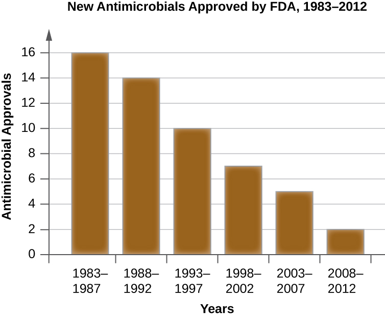

### Learning Objectives

* Describe the methods and strategies used for discovery of new antimicrobial agents.

With the continued evolution and spread of antimicrobial resistance, and now the identification of pan-resistant bacterial pathogens, the search for new antimicrobials is essential for preventing the postantibiotic era. Although development of more effective semisynthetic derivatives is one strategy, resistance to them develops rapidly because bacterial pathogens are already resistant to earlier-generation drugs in the family and can easily mutate and develop resistance to the new semisynthetic drugs. Today, scientists continue to hunt for new antimicrobial compounds and explore new avenues of antimicrobial discovery and synthesis. They check large numbers of soils and microbial products for antimicrobial activity by using **high-throughput screening methods**{: data-type="term" .no-emphasis}, which use automation to test large numbers of samples simultaneously. The recent development of the **iChip**{: data-type="term" .no-emphasis}[1](#footnote1){: data-type="footnote-link"} allows researchers to investigate the antimicrobial-producing capabilities of soil microbes that are difficult to grow by standard cultivation techniques in the laboratory. Rather than grow the microbes in the laboratory, they are grown in situ—right in the soil. Use of the iChip has resulted in the discovery of **teixobactin**{: data-type="term" .no-emphasis}, a novel antimicrobial from Mount Ararat, Turkey. Teixobactin targets two distinct steps in gram-positive cell wall synthesis and for which antimicrobial resistance appears not yet to have evolved.

Although soils have been widely examined, other environmental niches have not been tested as fully. Since 70% of the earth is covered with water, marine environments could be mined more fully for the presence of antimicrobial-producing microbes. In addition, researchers are using combinatorial chemistry, a method for making a very large number of related compounds from simple precursors, and testing them for antimicrobial activity. An additional strategy that needs to be explored further is the development of compounds that inhibit resistance mechanisms and restore the activity of older drugs, such as the strategy described earlier for **β-lactamase inhibitors**{: data-type="term" .no-emphasis} like **clavulanic acid**{: data-type="term" .no-emphasis}. Finally, developing inhibitors of virulence factor production and function could be a very important avenue. Although this strategy would not be directly antibacterial, drugs that slow the progression of an infection could provide an advantage for the immune system and could be used successfully in combination with antimicrobial drugs.

* What are new sources and strategies for developing drugs to fight infectious diseases?
{: data-bullet-style="bullet"}

The (Free?) Market for New Antimicrobials

There used to be plenty of antimicrobial drugs on the market to treat infectious diseases. However, the spread of antimicrobial resistance has created a need for new antibiotics to replace those that are no longer as effective as they once were. Unfortunately, pharmaceutical companies are not particularly motivated to fill this need. As of 2009, all but five pharmaceutical companies had moved away from antimicrobial drug development.[2](#footnote2){: data-type="footnote-link"} As a result, the number of FDA approvals of new antimicrobials has fallen drastically in recent decades ([\[link\]](#OSC_Microbio_14_01_FDAAntibio)).

Given that demand usually encourages supply, one might expect pharmaceutical companies to be rushing to get back in the business of developing new antibiotics. But developing new drugs is a lengthy process and requires large investments in research and development. Pharmaceutical companies can typically get a higher return on their investment by developing products for chronic, nonmicrobial diseases like diabetes; such drugs must be taken for life, and therefore generate more long-term revenue than an antibiotic that does its job in a week or two. But what will happen when drugs like vancomycin, a superantimicrobial reserved for use as a last resort, begin to lose their effectiveness against ever more drug-resistant superbugs? Will drug companies wait until all antibiotics have become useless before beginning to look for new ones?

Recently, it has been suggested that large pharmaceutical companies should be given financial incentives to pursue such research. In September 2014, the White House released an executive order entitled “Combating Antibiotic Resistant Bacteria,” calling upon various government agencies and the private sector to work together to “accelerate basic and applied research and development for new antimicrobials, other therapeutics, and vaccines.”[3](#footnote3){: data-type="footnote-link"} As a result, as of March 2015, President Obama’s proposed fiscal year 2016 budget doubled the amount of federal funding to $1.2 billion for “combating and preventing antibiotic resistance,” which includes money for antimicrobial research and development.[4](#footnote4){: data-type="footnote-link"} Similar suggestions have also been made on a global scale. In December 2014, a report chaired by former Goldman Sachs economist Jim O’Neill was published in *The Review on Antimicrobial Resistance*.[5](#footnote5){: data-type="footnote-link"}

These developments reflect the growing belief that for-profit pharmaceutical companies must be subsidized to encourage development of new antimicrobials. But some ask whether pharmaceutical development should be motivated by profit at all. Given that millions of lives may hang in the balance, some might argue that drug companies have an ethical obligation to devote their research and development efforts to high-utility drugs, as opposed to highly profitable ones. Yet this obligation conflicts with the fundamental goals of a for-profit company. Are government subsidies enough to ensure that drug companies make the public interest a priority, or should government agencies assume responsibility for developing critical drugs that may have little or no return on investment?

{: #OSC_Microbio_14_01_FDAAntibio}

  
To further examine the scope of the problem, view [this][1] video.

To [learn more][2] about the history of antimicrobial drug discovery, visit Michigan State University’s Antimicrobial Resistance Learning Site.

### Key Concepts and Summary

* Current research into the development of antimicrobial drugs involves the use of high-throughput screening and combinatorial chemistry technologies.
* New technologies are being developed to discover novel antibiotics from soil microorganisms that cannot be cultured by standard laboratory methods.
* Additional strategies include searching for antibiotics from sources other than soil, identifying new antibacterial targets, using combinatorial chemistry to develop novel drugs, developing drugs that inhibit resistance mechanisms, and developing drugs that target virulence factors and hold infections in check.
{: data-bullet-style="bullet"}

### Multiple Choice

Which of the following has yielded compounds with the most antimicrobial activity?

1.  water
2.  air
3.  volcanoes
4.  soil
{: type="A"}

D

### True/False

The rate of discovery of antimicrobial drugs has decreased significantly in recent decades.

true

### Critical Thinking

Who should be responsible for discovering and developing new antibiotics? Support your answer with reasoning.

### Footnotes
{: data-type="footnote-refs-title"}

* {: data-type="footnote-ref" #footnote1} [1](#footnote-ref1){: data-type="footnote-ref-link"} L. Losee et al. “A New Antibiotic Kills Pathogens Without Detectable Resistance.” *Nature* 517 no. 7535 (2015):455–459.
* {: data-type="footnote-ref" #footnote2} [2](#footnote-ref2){: data-type="footnote-ref-link"} H.W. Boucher et al. “Bad Bugs, No Drugs: No ESKAPE! An Update from the Infectious Diseases Society of America.” *Clinical Infectious Diseases* 48 no. 1 (2009):1–12.
* {: data-type="footnote-ref" #footnote3} [3](#footnote-ref3){: data-type="footnote-ref-link"} The White House. *National Action Plan for Combating Antibiotic-Resistant Bacteria.* Washington, DC: The White House, 2015. 
* {: data-type="footnote-ref" #footnote4} [4](#footnote-ref4){: data-type="footnote-ref-link"} White House Office of the Press Secretary. “Fact Sheet: Obama Administration Releases National Action Plan to Combat Antibiotic-Resistant Bacteria.” March 27, 2015. https://www.whitehouse.gov/the-press-office/2015/03/27/fact-sheet-obama-administration-releases-national-action-plan-combat-ant
* {: data-type="footnote-ref" #footnote5} [5](#footnote-ref5){: data-type="footnote-ref-link"} Review on Antimicrobial Resistance. http://amr-review.org. Accessed June 1, 2016.
{: data-list-type="bulleted" data-bullet-style="none"}

[1]: https://openstax.org/l/22PBSDecAntimic
[2]: https://openstax.org/l/22MSUAntResLeaH
